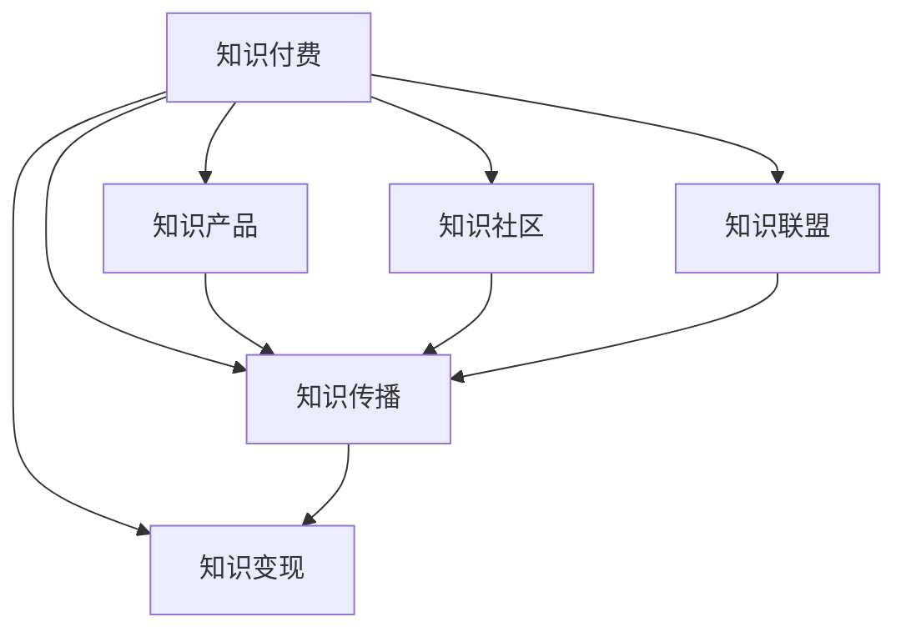

                 

# 程序员如何利用知识付费实现财务自由

在当今数字化、信息化快速发展的时代，程序员已经不再局限于传统的软件开发工作，而是拓展了更多元化的职业路径。其中，知识付费成为一种新兴的商业模式，让有技术专长和行业经验的程序员有机会通过分享自己的知识和经验，实现财务自由。本文将深入探讨程序员如何利用知识付费实现财务自由，并详细分析这一过程中需要掌握的核心概念、算法原理、具体操作步骤，以及未来发展趋势和面临的挑战。

## 1. 背景介绍

### 1.1 问题由来
随着互联网技术的不断发展，知识付费行业逐渐兴起，各大知识付费平台纷纷涌现，如知乎、腾讯课堂、得到等，为知识提供者提供了展示才华的平台。然而，传统的知识付费模式主要是基于在线课程和书籍的销售，这些内容大多由全职教育工作者创作，内容质量参差不齐。近年来，程序员这一群体逐渐成为知识付费行业中的新兴力量，他们凭借在技术领域的深厚积累和实战经验，开始通过知识付费来创造更多的收入。

### 1.2 问题核心关键点
程序员利用知识付费实现财务自由的核心关键点在于如何将自己的知识和技术转化为有价值的产品或服务。这不仅包括传统的编程技术课程，也包括解决实际问题、技术咨询、软件测试、项目指导等各类技术性服务。以下是几个核心关键点：
- 创建具有市场竞争力的知识产品。
- 掌握高效的知识传播和获取技术。
- 利用大数据、人工智能等技术提升用户体验。
- 建立可持续发展的商业模式，如订阅制、按需服务等。

### 1.3 问题研究意义
程序员利用知识付费实现财务自由的研究具有重要意义：
- 拓宽程序员的职业发展路径，提升其经济收入。
- 利用知识付费这一新商业模式，优化教育资源分配，提升整体技术水平。
- 推动知识共享文化，加速技术知识的传播和应用。
- 鼓励技术创新和产业升级，促进经济社会的发展。

## 2. 核心概念与联系

### 2.1 核心概念概述

为更好地理解程序员如何利用知识付费实现财务自由，我们需要介绍几个核心概念：

- **知识付费**：通过付费方式获取知识或技术服务的商业模式。主要包括在线课程、技术咨询、项目指导、软件测试等。
- **知识产品**：程序员利用自身的技术专长，制作出的有市场需求和价值的知识内容，如编程课程、技术博客、视频讲解等。
- **知识传播**：通过平台、社区等渠道，将知识产品传达给用户的过程。
- **知识变现**：将知识产品转化为可交易的商品或服务，实现商业价值。
- **知识社区**：聚集志同道合的技术爱好者，共享和学习知识的网络平台。
- **知识联盟**：与行业内的其他知识提供者、企业合作，拓展知识传播的广度和深度。

这些核心概念之间的关系可以通过以下Mermaid流程图来展示：



这个流程图展示了大语言模型的核心概念及其之间的关系：

1. 知识付费是整个商业模式的核心，通过付费获得知识产品和服务。
2. 知识产品是知识付费的基础，程序员需要制作有市场竞争力的内容。
3. 知识传播是知识变现的必要环节，需通过多种渠道广泛传播。
4. 知识社区和知识联盟为知识传播提供了平台，促进了知识的共享和交流。
5. 知识变现是最终目的，通过付费收入实现财务自由。

## 3. 核心算法原理 & 具体操作步骤

### 3.1 算法原理概述

程序员利用知识付费实现财务自由的核心算法原理，可以概括为以下几个方面：

1. **需求分析**：分析目标受众的需求，如学习需求、项目需求、技术支持需求等。
2. **内容制作**：根据需求制作有价值的内容，如编程课程、技术博客、视频讲解等。
3. **平台选择**：选择合适的知识付费平台，如知乎、腾讯课堂、得到等，进行内容发布。
4. **知识变现**：通过订阅、按需服务、付费问答等方式实现知识变现。
5. **数据分析**：利用大数据和人工智能技术，分析用户反馈，持续优化知识产品。

### 3.2 算法步骤详解

程序员利用知识付费实现财务自由的一般步骤如下：

**Step 1: 需求分析**
- 调研目标受众的特征和需求，如技术水平、学习目的、学习习惯等。
- 确定受众的学习路径，如入门级、中级、高级等。
- 分析竞争对手的产品，找出自己的差异化优势。

**Step 2: 内容制作**
- 根据需求分析结果，制定内容大纲，确定内容形式（如文章、视频、课程等）。
- 制作高质量的内容，注重实际应用和技术细节。
- 引入互动元素，如问答、讨论、实践操作等，提升用户参与度。

**Step 3: 平台选择**
- 根据内容特点和受众特征，选择合适的知识付费平台，如知乎、腾讯课堂、得到等。
- 研究平台规则和用户行为，制定发布策略。
- 了解平台的收入分成模式，制定合适的定价策略。

**Step 4: 知识变现**
- 通过订阅模式、按需服务、付费问答等方式实现知识变现。
- 采用会员制、免费试用、课程包等灵活的付费方式。
- 建立付费机制和规则，确保内容质量和平台信任。

**Step 5: 数据分析**
- 利用大数据和人工智能技术，收集和分析用户行为数据。
- 根据用户反馈优化内容，提升用户满意度。
- 持续创新和改进，推出新内容或产品，吸引更多用户。

### 3.3 算法优缺点

利用知识付费实现财务自由的主要优点包括：
1. 提升专业知识和技能，增加职业竞争力。
2. 分享知识和经验，获得更多的社会认可和经济回报。
3. 拓展职业发展路径，从软件开发向技术咨询、教育培训等领域转型。
4. 创造更高的个人收入，实现财务自由。

然而，这一过程中也存在一些缺点：
1. 高质量内容的制作需要时间和精力投入。
2. 内容持续更新和维护成本较高。
3. 知识产品的市场竞争激烈，需要持续创新和优化。
4. 用户付费意愿不足，需通过多种营销手段吸引用户。

### 3.4 算法应用领域

知识付费和程序员利用知识付费实现财务自由的方法，已广泛应用于以下领域：

- **技术教育**：通过在线课程、视频讲解等方式，教授编程、算法、数据结构等技术知识。
- **项目指导**：为有项目需求的企业和个人提供技术咨询和项目支持。
- **软件开发**：提供软件测试、开发咨询、项目管理等服务。
- **技术博客和论坛**：通过撰写技术博客、参与技术论坛，分享自己的技术经验和见解。
- **软件评测**：为企业和个人提供软件测试和性能评估服务。
- **知识社区**：建立自己的知识社区，聚集技术爱好者，共享和学习知识。

## 4. 数学模型和公式 & 详细讲解 & 举例说明

### 4.1 数学模型构建

在进行知识付费的具体实现过程中，可以构建以下数学模型：

设 $K$ 为程序员的知识产品，$D$ 为目标受众的需求，$P$ 为知识产品的定价，$C$ 为知识产品的成本，$R$ 为知识产品的收益。则知识付费的数学模型为：

$$
R = \sum_{i} P_i \times R_i - C
$$

其中 $P_i$ 为第 $i$ 种知识产品的定价，$R_i$ 为第 $i$ 种知识产品的收益，$C$ 为知识产品制作的总成本。

### 4.2 公式推导过程

1. **需求分析模型**：
   - 根据用户行为数据，构建用户需求模型：
   $$
   D = f(x)
   $$
   其中 $x$ 为用户的特征数据，$f$ 为需求分析函数。
   
2. **内容制作模型**：
   - 设计知识产品内容的制作流程：
   $$
   K = g(D)
   $$
   其中 $g$ 为内容制作函数。

3. **平台选择模型**：
   - 选择知识付费平台并制定发布策略：
   $$
   P = h(K, D)
   $$
   其中 $h$ 为平台选择函数。

4. **知识变现模型**：
   - 设计知识变现的策略和方式：
   $$
   R = p(K, P, C)
   $$
   其中 $p$ 为知识变现函数。

5. **数据分析模型**：
   - 利用大数据和人工智能技术，分析用户反馈和市场趋势：
   $$
   \theta = l(R, K, P, C)
   $$
   其中 $\theta$ 为模型的参数，$l$ 为数据分析函数。

### 4.3 案例分析与讲解

**案例分析**：
假设某程序员制作了一门面向初级开发者的Python编程课程，并通过知识付费平台得到订阅收入。

1. **需求分析**：
   - 调研发现，初级开发者的需求主要是基础语法、数据结构、算法等。
   - 确定内容结构，包括入门、基础语法、数据结构、算法实践等。

2. **内容制作**：
   - 制作了16节视频课程，每节课时长30分钟，讲解Python基础语法和实际案例。
   - 设计了互动练习，用户可以在视频下方提交代码，获得即时反馈。

3. **平台选择**：
   - 选择了腾讯课堂，并制定了免费试用期和付费订阅的定价策略。
   - 推广方式包括社交媒体广告、论坛推广、合作伙伴推荐等。

4. **知识变现**：
   - 定价为每节课49元，用户可以通过单节购买或订阅全年课程。
   - 设置付费问答，用户可以针对课程内容提出问题，获得程序员的即时回答。

5. **数据分析**：
   - 收集用户订阅数据、观看数据、反馈数据等。
   - 分析用户活跃度、付费转化率、用户满意度等指标。
   - 根据分析结果，优化课程内容和推广策略，提升收益。

## 5. 项目实践：代码实例和详细解释说明

### 5.1 开发环境搭建

在进行知识付费项目的开发前，需要准备好开发环境：

1. 安装Python环境：使用Anaconda或Miniconda，安装Python 3.x版本。

2. 安装相关库：
   - 安装Flask库，用于搭建知识付费平台。
   - 安装SQLAlchemy库，用于数据库操作。
   - 安装PyTorch或TensorFlow库，用于数据分析和机器学习模型。

3. 搭建开发环境：
   - 搭建开发服务器，安装Web服务器如Apache或Nginx。
   - 安装数据库，如MySQL或PostgreSQL。
   - 配置数据库连接、API接口等。

### 5.2 源代码详细实现

以下是一个简单的知识付费平台代码实现，包括课程制作、平台搭建和知识变现：

```python
# 安装Flask库
pip install Flask

# 安装SQLAlchemy库
pip install SQLAlchemy

# 安装PyTorch库
pip install torch

# 安装数据库
# 搭建数据库服务，如MySQL或PostgreSQL

# 搭建开发服务器
# 安装Web服务器如Apache或Nginx

# 开发Flask应用，搭建知识付费平台
from flask import Flask, request, jsonify

app = Flask(__name__)

# 数据库连接配置
app.config['SQLALCHEMY_DATABASE_URI'] = 'sqlite:///./database.db'
app.config['SQLALCHEMY_TRACK_MODIFICATIONS'] = False

# 定义课程模型
class Course(db.Model):
    id = db.Column(db.Integer, primary_key=True)
    title = db.Column(db.String(100))
    price = db.Column(db.Float)
    content = db.Column(db.Text)
    def __init__(self, title, price, content):
        self.title = title
        self.price = price
        self.content = content

# 定义API接口
@app.route('/create_course', methods=['POST'])
def create_course():
    data = request.get_json()
    title = data.get('title')
    price = data.get('price')
    content = data.get('content')
    course = Course(title, price, content)
    db.session.add(course)
    db.session.commit()
    return jsonify({'message': 'Course created successfully'})

@app.route('/get_courses', methods=['GET'])
def get_courses():
    courses = Course.query.all()
    return jsonify([{'id': course.id, 'title': course.title, 'price': course.price} for course in courses])

if __name__ == '__main__':
    app.run(debug=True)
```

### 5.3 代码解读与分析

**代码解读**：
上述代码实现了一个简单的知识付费平台，包括课程制作、平台搭建和知识变现功能。

1. **数据库配置**：
   - 使用SQLAlchemy库连接数据库，进行数据存储和查询操作。
   - 定义课程模型，包含课程标题、价格、内容等属性。

2. **API接口实现**：
   - 实现创建课程和获取课程列表的API接口。
   - 使用Flask库创建Web服务器，提供RESTful接口。
   - 根据请求数据创建课程，并保存到数据库。
   - 从数据库中获取所有课程，并返回课程列表。

3. **平台搭建**：
   - 在Web服务器上搭建Flask应用。
   - 部署在Apache或Nginx服务器上，提供Web服务。

4. **知识变现**：
   - 课程制作完成后，通过API接口上传到平台。
   - 用户可以通过订阅或单节购买的方式支付费用，获取课程内容。

### 5.4 运行结果展示

- 用户可以在平台上订阅课程或单节购买。
- 平台展示所有课程列表和课程介绍。
- 用户通过API接口创建和查询课程，并进行费用支付。

## 6. 实际应用场景

### 6.1 知识付费平台

知识付费平台如知乎、腾讯课堂、得到等，为程序员提供了一个展示自己知识和技能的平台。程序员可以利用这些平台，制作和销售技术课程、视频讲解、技术咨询等内容，实现财务自由。

**应用场景**：
1. **技术教育**：通过在线课程、视频讲解等方式，教授编程、算法、数据结构等技术知识。
2. **项目指导**：为有项目需求的企业和个人提供技术咨询和项目支持。
3. **软件开发**：提供软件测试、开发咨询、项目管理等服务。
4. **技术博客和论坛**：通过撰写技术博客、参与技术论坛，分享自己的技术经验和见解。
5. **软件评测**：为企业和个人提供软件测试和性能评估服务。
6. **知识社区**：建立自己的知识社区，聚集技术爱好者，共享和学习知识。

### 6.2 企业技术培训

许多企业需要为员工提供技术培训，以提升整体技术水平。利用知识付费平台，程序员可以为企业提供定制化的技术培训课程。

**应用场景**：
1. **企业内部培训**：根据企业需求，制作和销售定制化的技术培训课程。
2. **外部企业培训**：为企业提供技术培训咨询和支持，帮助企业提升技术能力。
3. **在线研讨会**：通过在线视频和互动问答，提供实时技术支持。

### 6.3 技术咨询和顾问服务

程序员可以利用自己的技术专长，为企业和个人提供技术咨询和顾问服务。

**应用场景**：
1. **技术咨询**：为企业提供技术方案和实施建议，帮助企业解决技术难题。
2. **项目指导**：为个人提供项目规划和实施指导，提升项目的成功率。
3. **技术支持**：为IT部门提供技术支持和故障排除，保障系统稳定运行。

## 7. 工具和资源推荐

### 7.1 学习资源推荐

为了帮助程序员系统掌握知识付费技术，这里推荐一些优质的学习资源：

1. **《知识付费商业模式的未来》系列博文**：由大模型技术专家撰写，深入浅出地介绍了知识付费商业模式的未来发展方向。
2. **《知识付费平台设计》课程**：由知名互联网公司开设的课程，涵盖知识付费平台的前端、后端开发、数据分析等技术要点。
3. **《知识付费实战》书籍**：介绍知识付费技术的实际应用和项目案例，结合数据和算法的优化方法。
4. **《知识付费营销策略》书籍**：结合市场分析，介绍如何通过各种营销手段提升知识付费产品的用户获取和付费转化率。
5. **《知识付费平台运营》课程**：涵盖知识付费平台的搭建、运营、维护、推广等各个环节，提供全方位的实践指导。

通过对这些资源的学习实践，相信你一定能够快速掌握知识付费技术的精髓，并用于解决实际的商业问题。

### 7.2 开发工具推荐

高效的开发离不开优秀的工具支持。以下是几款用于知识付费开发的常用工具：

1. **Flask**：基于Python的开源Web框架，提供快速搭建Web应用的能力，适合开发知识付费平台。
2. **SQLAlchemy**：基于Python的ORM框架，提供数据库操作和模型映射功能，方便数据存储和查询。
3. **PyTorch**：开源深度学习框架，提供丰富的机器学习算法和工具，可用于数据分析和模型训练。
4. **TensorFlow**：开源深度学习框架，提供高效的计算图和分布式训练功能，适合大规模工程应用。
5. **Jupyter Notebook**：基于Web的交互式编程环境，提供代码调试、数据可视化和协作功能。
6. **Google Colab**：谷歌推出的在线Jupyter Notebook环境，免费提供GPU/TPU算力，方便实验最新模型。

合理利用这些工具，可以显著提升知识付费产品的开发效率，加快创新迭代的步伐。

### 7.3 相关论文推荐

知识付费和程序员利用知识付费实现财务自由的研究源于学界的持续研究。以下是几篇奠基性的相关论文，推荐阅读：

1. **《知识付费平台的用户行为分析》**：介绍知识付费平台的用户行为和需求，提供数据驱动的产品优化方法。
2. **《知识付费模型的研究》**：深入分析知识付费模型的构建和优化，结合实际案例进行详细讲解。
3. **《知识付费平台的商业模式创新》**：探讨知识付费平台的商业模式创新，提出可行的商业策略和实践方案。
4. **《知识付费的市场趋势与挑战》**：分析知识付费市场的趋势和面临的挑战，提出未来的发展方向和解决方案。

这些论文代表了大语言模型微调技术的发展脉络。通过学习这些前沿成果，可以帮助研究者把握学科前进方向，激发更多的创新灵感。

## 8. 总结：未来发展趋势与挑战

### 8.1 总结

本文对程序员如何利用知识付费实现财务自由进行了全面系统的介绍。首先阐述了知识付费商业模式的现状和未来发展方向，明确了知识付费在拓展程序员职业发展路径、提升整体技术水平方面的独特价值。其次，从原理到实践，详细讲解了知识付费技术的核心算法和操作步骤，给出了知识付费项目开发的完整代码实例。同时，本文还广泛探讨了知识付费技术在知识付费平台、企业技术培训、技术咨询和顾问服务等多个行业领域的应用前景，展示了知识付费技术的巨大潜力。此外，本文精选了知识付费技术的各类学习资源，力求为读者提供全方位的技术指引。

通过本文的系统梳理，可以看到，知识付费技术为程序员提供了一条新的职业发展路径，帮助他们实现财务自由。这一技术不仅拓宽了程序员的职业选择，还加速了知识传播和应用，推动了技术的创新和产业升级。未来，伴随知识付费技术的不断进步，相信知识付费将成为程序员实现财务自由的重要手段，进一步提升程序员的社会地位和影响力。

### 8.2 未来发展趋势

展望未来，知识付费技术将呈现以下几个发展趋势：

1. **技术驱动的内容创新**：利用大数据、人工智能等技术，提升内容质量和用户体验。
2. **个性化推荐系统的应用**：结合用户的浏览和购买行为，推荐个性化的课程和产品。
3. **跨界合作和内容融合**：与其他领域的内容和服务进行跨界合作，推动知识付费平台的多元化发展。
4. **全球化和本地化的结合**：拓展国际市场，同时推出本地化的内容和服务，满足不同地区用户的需求。
5. **可持续发展的商业模式**：探索持续创新的商业模式，如会员制、订阅制、按需服务等。

以上趋势凸显了知识付费技术的广阔前景。这些方向的探索发展，必将进一步提升知识付费平台的竞争力和用户体验，为程序员实现财务自由提供更多可能性。

### 8.3 面临的挑战

尽管知识付费技术已经取得了瞩目成就，但在迈向更加智能化、普适化应用的过程中，它仍面临着诸多挑战：

1. **高质量内容的制作成本**：高质量内容的制作需要投入大量时间和精力，成本较高。
2. **用户获取和留存**：如何吸引和留住用户，提升用户参与度和付费转化率，仍是一大难题。
3. **市场竞争激烈**：知识付费市场竞争激烈，需要不断创新和优化产品。
4. **技术更新换代**：新技术的不断涌现，要求知识付费平台持续更新和优化。
5. **平台信任和安全性**：如何建立用户信任，保障平台和用户的安全，是知识付费平台的重要挑战。

### 8.4 研究展望

面对知识付费技术面临的种种挑战，未来的研究需要在以下几个方面寻求新的突破：

1. **高效的内容制作和管理**：开发更加高效的内容制作和管理工具，降低成本，提高内容产出效率。
2. **智能推荐系统**：结合机器学习和大数据分析，提升推荐系统的精准度和个性化程度。
3. **跨界合作和融合**：与其他领域的内容和服务进行跨界合作，实现内容和服务的多元化。
4. **全球化和本地化的结合**：拓展国际市场，推出本地化的内容和服务，满足不同地区用户的需求。
5. **持续创新的商业模式**：探索可持续发展的商业模式，如会员制、订阅制、按需服务等。
6. **平台信任和安全性**：建立用户信任，保障平台和用户的安全，提升用户体验。

这些研究方向的探索，必将引领知识付费技术的进一步发展，为程序员实现财务自由提供更多保障。相信随着技术的不断进步，知识付费技术将成为程序员实现财务自由的重要手段，推动知识付费平台的规模化发展，提升程序员的社会地位和影响力。

## 9. 附录：常见问题与解答

**Q1: 知识付费市场前景如何？**

A: 知识付费市场前景广阔，特别是在教育、技术、财经等领域，市场需求强劲。随着互联网技术的发展和人们学习习惯的变化，知识付费市场的规模和用户数量将持续增长。

**Q2: 如何提高知识付费平台的用户获取和留存？**

A: 提高用户获取和留存的关键在于提升用户体验和满意度，具体措施包括：
1. 优化内容质量，满足用户需求。
2. 提供优质的互动和反馈机制，增强用户参与感。
3. 设置合理的订阅和付费机制，提供多样化的付费方式。
4. 通过社交媒体和营销手段，扩大平台影响力。

**Q3: 知识付费平台的盈利模式有哪些？**

A: 知识付费平台的盈利模式主要包括：
1. 课程订阅和单节购买：提供高质量的课程内容，吸引用户付费订阅或单节购买。
2. 按需服务：提供定制化的技术咨询和项目指导服务，按需收费。
3. 广告和品牌合作：通过平台广告和品牌合作，增加平台收入。

**Q4: 如何平衡知识付费平台的内容质量和数量？**

A: 平衡内容质量和数量的关键在于制定合理的内容策略：
1. 分析用户需求和市场趋势，确定内容主题和形式。
2. 邀请行业专家和有经验的内容创作者，提高内容质量。
3. 引入优质合作伙伴，丰富内容资源。
4. 建立内容审核机制，确保内容健康和高质量。

**Q5: 知识付费平台如何应对激烈的市场竞争？**

A: 应对激烈市场竞争的关键在于不断创新和优化产品，具体措施包括：
1. 关注市场变化，及时调整内容策略。
2. 提升用户体验，增加用户粘性。
3. 引入新技术和创新手段，提升平台竞争力。
4. 加强品牌建设和用户口碑，提升平台信任度。

总之，知识付费技术为程序员提供了新的职业发展路径，帮助他们实现财务自由。然而，在技术快速发展的过程中，我们也需不断面对和解决新的挑战，推动知识付费平台的持续创新和优化。通过不断的努力和探索，相信知识付费技术将在未来成为程序员实现财务自由的重要手段，推动技术知识的传播和应用，为社会经济发展做出更大的贡献。

---

作者：禅与计算机程序设计艺术 / Zen and the Art of Computer Programming

