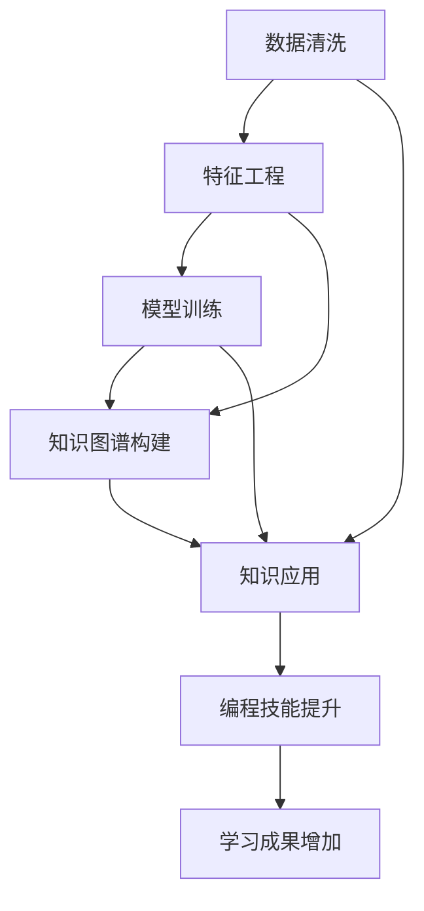

                 

# 程序员如何利用知识发现引擎提高学习成果

> 关键词：知识发现引擎,机器学习,数据挖掘,学习成果,编程技能,知识图谱,应用案例

## 1. 背景介绍

在现代信息技术飞速发展的背景下，知识发现引擎(Knowledge Discovery Engine, KDE)逐渐成为提升学习和工作效率的重要工具。传统的信息检索方式无法满足用户日益增长的知识需求，知识发现引擎通过机器学习、数据挖掘等技术手段，帮助用户在海量数据中发现知识、挖掘有价值信息，极大提升学习成果。

## 2. 核心概念与联系

### 2.1 核心概念概述

为了更好地理解知识发现引擎在提升学习成果中的应用，我们首先来介绍几个核心概念：

- **知识发现引擎(KDE)**：利用人工智能、数据挖掘等技术，从大规模数据中提取有用信息、发现知识的工具。KDE主要包括数据清洗、特征工程、模型训练等关键步骤，能够高效、准确地实现知识发现和信息挖掘。
- **机器学习(ML)**：一种通过算法和模型，让计算机系统自动地从数据中学习和优化的方法，广泛应用于知识发现引擎中，用于训练模型、发现规律等。
- **数据挖掘(Data Mining)**：从大量数据中提取有价值的信息、知识和模式的过程，是知识发现引擎的重要技术手段。数据挖掘技术可以用于聚类、分类、关联规则发现等任务。
- **学习成果**：程序员通过学习获取的知识和技能，以及应用这些知识解决实际问题的能力。
- **编程技能**：程序员熟练使用编程语言、工具和技术，进行软件开发和维护的能力。
- **知识图谱(Knowledge Graph)**：一种结构化的知识表示方式，通过节点和边，将实体、属性和关系组织起来，便于机器理解和推理。
- **应用案例**：具体实例展示知识发现引擎在提升学习成果中的实际应用。

这些核心概念之间存在紧密的联系。知识发现引擎通过机器学习、数据挖掘等技术，从大规模数据中提取有价值的信息，帮助程序员提升学习成果。程序员通过学习知识发现引擎的原理和应用，可以更好地利用这一工具进行知识挖掘和技能提升，提高编程技能和应用能力。

### 2.2 核心概念原理和架构的 Mermaid 流程图



这个流程图展示了知识发现引擎的基本流程和工作原理：

1. 首先对大规模数据进行清洗，去除噪声和无关信息。
2. 然后进行特征工程，提取有价值特征，用于训练模型。
3. 利用机器学习模型对数据进行训练，发现潜在规律和知识。
4. 基于发现的知识构建知识图谱，表示实体、属性和关系。
5. 最后通过知识图谱，提升编程技能和学习成果。

## 3. 核心算法原理 & 具体操作步骤

### 3.1 算法原理概述

知识发现引擎的核心算法原理主要包括以下几个方面：

- **数据预处理**：对原始数据进行清洗、归一化、编码等预处理操作，使其更适合后续的特征工程和模型训练。
- **特征提取与选择**：利用统计方法、降维技术等，从原始数据中提取有价值的特征，用于训练模型。
- **模型训练**：选择合适的机器学习算法，如决策树、随机森林、神经网络等，对特征数据进行训练，构建预测模型。
- **知识图谱构建**：将模型预测的实体、属性和关系组织起来，构建知识图谱，便于后续的推理和应用。
- **知识应用**：通过知识图谱进行推理、搜索、推荐等，提升编程技能和学习成果。

### 3.2 算法步骤详解

基于上述原理，知识发现引擎的具体操作步骤如下：

1. **数据收集与预处理**
   - 收集相关领域的文本、代码、注释等数据。
   - 对数据进行清洗，去除重复、无关、错误数据。
   - 对数据进行归一化、编码等预处理操作，使其适合特征提取。

2. **特征提取与选择**
   - 利用自然语言处理(NLP)技术，从文本数据中提取关键字、词频、句法结构等特征。
   - 对代码数据进行抽象语法树解析，提取方法、函数、参数等特征。
   - 使用统计方法如TF-IDF、PCA等，对特征进行降维处理。

3. **模型训练与调优**
   - 选择合适的机器学习算法，如随机森林、神经网络等。
   - 对特征数据进行划分，训练和验证模型，选择最优参数。
   - 利用交叉验证等技术，评估模型的泛化能力和稳定性。

4. **知识图谱构建**
   - 利用知识图谱构建工具，如Neo4j、Gephi等，将模型预测的实体、属性和关系组织成图谱。
   - 根据领域知识，补充、修改图谱中的实体和关系，优化图谱结构。

5. **知识应用**
   - 利用图谱进行实体搜索、关系推断等操作，发现编程技巧、最佳实践等。
   - 根据用户输入的查询，推荐相关资源、教程和案例，辅助学习。

### 3.3 算法优缺点

知识发现引擎在提升学习成果中具有以下优点：

- **自动化数据处理**：通过自动化数据清洗和预处理，大幅减少人工工作量，提高数据质量。
- **高效的知识提取**：利用机器学习、数据挖掘等技术，从大规模数据中高效发现知识和规律。
- **泛化能力强**：利用知识图谱，能够进行跨领域的知识迁移和应用。
- **交互式学习**：通过智能推荐，提供个性化的学习路径和资源，提高学习效率。

同时，知识发现引擎也存在一些缺点：

- **数据依赖性强**：需要大量高质量数据进行训练和测试，否则结果可能不理想。
- **模型复杂度高**：构建复杂知识图谱和模型需要较高的时间和计算资源。
- **领域依赖性强**：不同领域的数据特征和知识结构差异较大，需要针对性地构建模型。

### 3.4 算法应用领域

知识发现引擎在多个领域都有广泛的应用，以下是几个典型案例：

1. **编程技能提升**
   - 分析程序员在开源社区中的代码贡献，提取编码风格、常用库和框架等特征，构建知识图谱。
   - 基于图谱进行编程技巧、最佳实践的推荐，提升程序员的编程技能。

2. **项目案例推荐**
   - 从GitHub、Stack Overflow等平台收集开源项目数据，提取项目描述、语言、库、框架等特征。
   - 构建知识图谱，提供项目案例推荐，帮助程序员学习新的技术和框架。

3. **学习资源搜索**
   - 利用NLP技术对网络上的编程教程、文档、博客等资源进行提取和索引。
   - 通过搜索图谱，发现相关资源，帮助程序员高效找到所需的学习资料。

4. **问题诊断与解决**
   - 分析程序员在代码中遇到的问题，提取关键词和错误信息，构建知识图谱。
   - 利用图谱进行问题匹配和推理，推荐相关的解决方案和案例。

## 4. 数学模型和公式 & 详细讲解 & 举例说明

### 4.1 数学模型构建

知识发现引擎的数学模型构建包括以下几个部分：

- **数据表示**：将数据转化为向量或矩阵形式，用于特征提取和模型训练。
- **特征表示**：利用数学方法，从原始数据中提取有价值特征，表示为特征向量。
- **模型训练**：选择合适的机器学习模型，定义损失函数，训练优化模型参数。
- **知识图谱表示**：将实体、属性和关系组织成图谱，利用图谱算法进行推理和应用。

### 4.2 公式推导过程

以随机森林算法为例，展示知识发现引擎的数学模型构建和训练过程：

**数据表示**
设原始数据集为 $D=\{(x_i, y_i)\}_{i=1}^N$，其中 $x_i$ 为输入特征，$y_i$ 为输出标签。将 $x_i$ 转化为矩阵形式 $X \in \mathbb{R}^{n \times d}$，$y_i$ 转化为向量形式 $Y \in \mathbb{R}^N$。

**特征提取**
利用TF-IDF算法，计算每个特征词的权重，得到特征向量 $X'$。

**模型训练**
设随机森林模型包含 $m$ 棵决策树，每棵树的特征子集为 $S_j$，参数为 $\theta_j$，损失函数为 $L$。训练模型的目标为：

$$
\mathop{\min}_{\theta_1,\cdots,\theta_m} L(\theta_1,\cdots,\theta_m;X',Y)
$$

其中 $L$ 为决策树的损失函数，通常为分类错误率。

**知识图谱表示**
构建知识图谱 $G=(V,E)$，其中 $V$ 为节点集合，$E$ 为边集合。每个节点 $v_i$ 表示一个实体或属性，每条边 $e_j$ 表示实体之间的关联关系。

### 4.3 案例分析与讲解

假设有一个软件开发公司的内部知识库，包含大量代码、文档和项目案例。通过知识发现引擎，公司希望提取编程技能和最佳实践，辅助程序员提高学习成果。

**数据收集与预处理**
收集公司的内部代码库、文档库和项目案例库，进行数据清洗和预处理。

**特征提取**
对代码库和文档库进行NLP处理，提取关键词、词频、句子长度等特征。对项目案例库进行实体抽取，提取项目名称、语言、库等特征。

**模型训练**
选择随机森林算法，训练特征数据，得到预测模型。使用交叉验证评估模型的泛化能力和稳定性。

**知识图谱构建**
利用图谱构建工具，将模型预测的实体、属性和关系组织成图谱。根据领域知识，补充、修改图谱中的实体和关系，优化图谱结构。

**知识应用**
基于图谱进行编程技巧、最佳实践的推荐，辅助程序员提高学习成果。

## 5. 项目实践：代码实例和详细解释说明

### 5.1 开发环境搭建

以下是使用Python和TensorFlow进行知识发现引擎的开发环境搭建步骤：

1. 安装Anaconda：从官网下载并安装Anaconda，用于创建独立的Python环境。

2. 创建并激活虚拟环境：
```bash
conda create -n kde-env python=3.8 
conda activate kde-env
```

3. 安装TensorFlow：根据CUDA版本，从官网获取对应的安装命令。例如：
```bash
conda install tensorflow -c pytorch -c conda-forge
```

4. 安装其他相关库：
```bash
pip install pandas numpy scikit-learn tensorflow-estimator tensorflow-hub transformers
```

5. 安装TensorBoard：用于可视化模型训练过程，查看训练状态和性能指标。
```bash
pip install tensorboard
```

完成上述步骤后，即可在`kde-env`环境中开始知识发现引擎的开发实践。

### 5.2 源代码详细实现

下面以一个简单的代码实现为例，展示知识发现引擎的关键步骤：

```python
import pandas as pd
from sklearn.feature_extraction.text import TfidfVectorizer
from sklearn.ensemble import RandomForestClassifier
from sklearn.metrics import accuracy_score
from tensorflow.keras.layers import Dense, Input, Embedding
from tensorflow.keras.models import Model
from tensorflow.keras.preprocessing.text import Tokenizer
from tensorflow.keras.preprocessing.sequence import pad_sequences
import tensorflow_hub as hub

# 数据预处理
def preprocess_data(data_path):
    df = pd.read_csv(data_path)
    X = df['code']
    y = df['label']
    X_train, X_test, y_train, y_test = train_test_split(X, y, test_size=0.2, random_state=42)
    return X_train, X_test, y_train, y_test

# 特征提取
def extract_features(X_train, X_test):
    tokenizer = Tokenizer()
    tokenizer.fit_on_texts(X_train)
    X_train = tokenizer.texts_to_sequences(X_train)
    X_test = tokenizer.texts_to_sequences(X_test)
    X_train = pad_sequences(X_train, maxlen=100)
    X_test = pad_sequences(X_test, maxlen=100)
    return X_train, X_test

# 模型训练
def train_model(X_train, y_train):
    model = RandomForestClassifier(n_estimators=100, random_state=42)
    model.fit(X_train, y_train)
    return model

# 知识图谱构建
def build_knowledge_graph(X_train, y_train):
    # 获取标签的类别和数量
    classes = np.unique(y_train)
    # 构建图谱
    graph = nx.Graph()
    for i, label in enumerate(classes):
        graph.add_node(i, label=label)
        for j, label in enumerate(classes):
            if i != j and y_train[i] == y_train[j]:
                graph.add_edge(i, j)
    return graph

# 测试与评估
def test_model(model, X_test, y_test):
    y_pred = model.predict(X_test)
    accuracy = accuracy_score(y_test, y_pred)
    print(f'Accuracy: {accuracy:.2f}')

# 运行示例
X_train, X_test, y_train, y_test = preprocess_data('data.csv')
X_train, X_test = extract_features(X_train, X_test)
model = train_model(X_train, y_train)
graph = build_knowledge_graph(X_train, y_train)
test_model(model, X_test, y_test)
```

### 5.3 代码解读与分析

上述代码实现了一个简单的基于随机森林的知识发现引擎：

1. `preprocess_data`函数：数据预处理，包括数据读取、分割和特征提取。
2. `extract_features`函数：使用词向量模型对代码进行特征提取和处理。
3. `train_model`函数：使用随机森林算法训练模型。
4. `build_knowledge_graph`函数：构建知识图谱，表示代码与标签之间的关系。
5. `test_model`函数：测试模型的性能，计算准确率。

## 6. 实际应用场景

### 6.1 智能教育

在智能教育领域，知识发现引擎可以帮助学生提升学习成果。通过分析学生的历史学习数据，提取常见问题、知识点、学习路径等，构建知识图谱。利用图谱进行知识推荐和路径优化，辅助学生高效学习。

### 6.2 智能医疗

在智能医疗领域，知识发现引擎可以用于疾病诊断和治疗方案推荐。通过分析患者的病历数据，提取症状、检查结果、治疗方案等关键信息，构建知识图谱。利用图谱进行疾病诊断和治疗方案推荐，提高医生的诊断和治疗水平。

### 6.3 智能金融

在智能金融领域，知识发现引擎可以用于风险评估和投资决策。通过分析历史交易数据，提取市场趋势、风险指标、交易策略等关键信息，构建知识图谱。利用图谱进行风险评估和投资决策，提高金融机构的盈利能力和风险控制水平。

### 6.4 未来应用展望

随着知识发现引擎的不断发展，未来的应用前景更加广阔。以下是几个可能的方向：

1. **跨领域知识迁移**：知识发现引擎可以跨领域地迁移和应用知识，如将自然语言处理的知识迁移到计算机视觉、语音识别等领域。
2. **自适应学习系统**：根据学生的学习进度和反馈，实时调整学习路径和推荐资源，实现个性化、自适应的学习。
3. **实时数据分析**：利用知识发现引擎进行实时数据分析和推理，如在金融交易中实时监控市场动态，进行动态投资决策。
4. **智能推荐系统**：结合机器学习和大数据分析，构建更加精准、高效的推荐系统，应用于电商、娱乐、教育等多个领域。

## 7. 工具和资源推荐

### 7.1 学习资源推荐

为了帮助开发者系统掌握知识发现引擎的理论基础和实践技巧，这里推荐一些优质的学习资源：

1. **《数据科学手册》**：全面介绍数据科学的理论和方法，涵盖数据清洗、特征工程、模型训练等关键环节。
2. **《机器学习实战》**：通过实战项目，介绍机器学习的基本原理和常用算法，适合初学者入门。
3. **《TensorFlow官方文档》**：TensorFlow的官方文档，包含丰富的教程和示例，适合深度学习和知识发现引擎的开发者。
4. **《KDE工具与算法》**：介绍知识发现引擎的基本概念、工具和算法，适合知识发现领域的研究人员。
5. **Coursera课程**：Coursera提供的数据科学和机器学习课程，涵盖知识发现引擎的基本原理和应用案例。

通过对这些资源的学习实践，相信你一定能够快速掌握知识发现引擎的精髓，并用于解决实际的NLP问题。

### 7.2 开发工具推荐

高效的开发离不开优秀的工具支持。以下是几款用于知识发现引擎开发的常用工具：

1. **Python**：Python是数据科学和机器学习领域的主流编程语言，拥有丰富的库和框架。
2. **TensorFlow**：由Google主导开发的深度学习框架，适用于大规模机器学习项目。
3. **Jupyter Notebook**：交互式编程环境，适合数据处理、模型训练和结果展示。
4. **Scikit-learn**：Python的机器学习库，提供了丰富的机器学习算法和工具。
5. **TensorBoard**：TensorFlow配套的可视化工具，用于监控模型训练过程。

合理利用这些工具，可以显著提升知识发现引擎的开发效率，加快创新迭代的步伐。

### 7.3 相关论文推荐

知识发现引擎的研究始于学界的持续研究。以下是几篇奠基性的相关论文，推荐阅读：

1. **《知识发现与数据挖掘》**：介绍知识发现和数据挖掘的基本概念和常用方法，适合初学者入门。
2. **《数据挖掘：概念与技术》**：全面介绍数据挖掘的原理和技术，涵盖数据预处理、特征工程、模型训练等环节。
3. **《机器学习：原理、算法与应用》**：介绍机器学习的基本原理和常用算法，涵盖监督学习、无监督学习、半监督学习等。
4. **《知识图谱：理论与应用》**：介绍知识图谱的基本概念、构建方法和应用场景，适合知识发现领域的研究人员。
5. **《知识图谱与大数据分析》**：介绍知识图谱在大数据背景下的应用，涵盖知识图谱构建、查询优化、推理等技术。

这些论文代表了大数据和知识发现领域的最新进展，通过学习这些前沿成果，可以帮助研究者把握学科前进方向，激发更多的创新灵感。

## 8. 总结：未来发展趋势与挑战

### 8.1 总结

本文对知识发现引擎在提升学习成果中的应用进行了全面系统的介绍。首先阐述了知识发现引擎的背景和应用意义，明确了其在大数据时代的重要性。其次，从原理到实践，详细讲解了知识发现引擎的数学模型和操作步骤，给出了知识发现引擎的代码实例。同时，本文还广泛探讨了知识发现引擎在多个领域的应用前景，展示了其在提升学习成果中的巨大潜力。此外，本文精选了知识发现引擎的学习资源、开发工具和相关论文，力求为开发者提供全方位的技术指引。

通过本文的系统梳理，可以看到，知识发现引擎作为提升学习成果的重要工具，已经逐渐成为数据科学和机器学习领域的新宠。其自动化的数据处理、高效的知识提取、泛化能力和交互式学习等功能，极大地提升了学习效率和效果。未来，伴随知识发现引擎的不断发展，其在各个领域的广泛应用前景将更加令人期待。

### 8.2 未来发展趋势

展望未来，知识发现引擎将呈现以下几个发展趋势：

1. **自动化程度更高**：随着AI技术的进步，知识发现引擎将更加自动化，能够自动识别和处理更多类型的数据。
2. **模型泛化能力更强**：利用深度学习和大数据技术，知识发现引擎将能够处理更加复杂、多样化的问题，具备更强的泛化能力。
3. **多模态数据融合**：结合语音、图像、视频等多模态数据，知识发现引擎将能够更全面地理解和分析问题，提升应用效果。
4. **实时数据分析与推理**：利用云计算和大数据技术，知识发现引擎将能够实时进行数据分析和推理，适应动态变化的环境。
5. **跨领域知识迁移**：知识发现引擎将能够跨领域地迁移和应用知识，实现更广泛的应用场景。

以上趋势凸显了知识发现引擎的广阔前景。这些方向的探索发展，必将进一步提升知识发现引擎的性能和应用范围，为提升学习成果、推动各行各业的发展带来深远影响。

### 8.3 面临的挑战

尽管知识发现引擎已经取得了瞩目成就，但在迈向更加智能化、普适化应用的过程中，它仍面临着诸多挑战：

1. **数据质量问题**：知识发现引擎依赖于高质量的数据，如果数据存在噪声、缺失、不一致等问题，结果可能不理想。
2. **模型复杂度**：知识图谱和模型的构建复杂度较高，需要较高的时间和计算资源。
3. **领域依赖性**：不同领域的数据特征和知识结构差异较大，需要针对性地构建模型。
4. **用户隐私保护**：知识发现引擎需要处理大量用户数据，如何保护用户隐私和数据安全，是一个重要的挑战。

### 8.4 研究展望

面对知识发现引擎面临的挑战，未来的研究需要在以下几个方面寻求新的突破：

1. **高效数据处理**：开发更加高效的数据清洗和预处理算法，提高数据处理速度和质量。
2. **轻量级模型构建**：研究轻量级的知识图谱和模型构建方法，降低资源消耗，提高应用效率。
3. **多模态数据融合**：研究多模态数据的融合方法，提升知识发现引擎的全面性和准确性。
4. **实时数据分析**：利用实时数据处理技术，提高知识发现引擎的实时性和动态适应性。
5. **隐私保护机制**：研究隐私保护技术，如差分隐私、联邦学习等，保障用户隐私和数据安全。

这些研究方向将推动知识发现引擎的持续优化和创新，提升其在提升学习成果、服务各行业中的应用价值。相信随着技术的发展和研究的深入，知识发现引擎将在更多的领域得到应用，成为推动人工智能和社会进步的重要工具。

## 9. 附录：常见问题与解答

**Q1：知识发现引擎如何处理噪声数据？**

A: 知识发现引擎通过数据清洗和预处理，去除噪声和无关信息。常用的方法包括缺失值填补、异常值检测、数据归一化等。例如，可以使用统计方法如平均值、中位数等填补缺失值，使用K-means等聚类算法检测和去除异常值。

**Q2：如何提高知识发现引擎的泛化能力？**

A: 提高知识发现引擎的泛化能力，可以通过以下方法：
1. 增加数据量和多样性，涵盖更多类型和领域的数据。
2. 使用更复杂和强大的模型，如深度神经网络、注意力机制等。
3. 引入正则化技术和对抗训练，防止过拟合。
4. 进行模型融合和集成学习，综合多模型的结果。

**Q3：知识发现引擎在实际应用中，需要注意哪些问题？**

A: 知识发现引擎在实际应用中，需要注意以下问题：
1. 数据质量问题：确保输入数据质量高、完整、一致。
2. 模型复杂度问题：构建简单高效的模型，避免过度复杂化。
3. 领域依赖问题：针对不同领域的数据特点，选择合适的特征和模型。
4. 隐私保护问题：保护用户隐私，确保数据安全。

**Q4：如何评估知识发现引擎的效果？**

A: 评估知识发现引擎的效果，通常使用以下指标：
1. 准确率（Accuracy）：模型预测正确的样本数与总样本数之比。
2. 召回率（Recall）：模型正确预测的正样本数与实际正样本数之比。
3. F1分数（F1-Score）：准确率和召回率的调和平均值。
4. AUC-ROC曲线（AUC-ROC Curve）：绘制ROC曲线，评估模型在不同阈值下的性能。
5. ROC-AUC值：ROC曲线下的面积，衡量模型分类能力。

**Q5：知识图谱在知识发现引擎中的应用场景有哪些？**

A: 知识图谱在知识发现引擎中的应用场景包括：
1. 知识推理：利用知识图谱进行实体推理和关系推断，发现新知识和规律。
2. 信息检索：基于知识图谱进行实体搜索和关系匹配，辅助问题解决。
3. 推荐系统：结合用户兴趣和知识图谱，进行个性化推荐。
4. 智能问答：通过知识图谱构建问答系统，解答用户问题。

这些应用场景展示了知识图谱在知识发现引擎中的广泛应用，能够显著提升模型的智能水平和应用效果。

---

作者：禅与计算机程序设计艺术 / Zen and the Art of Computer Programming

