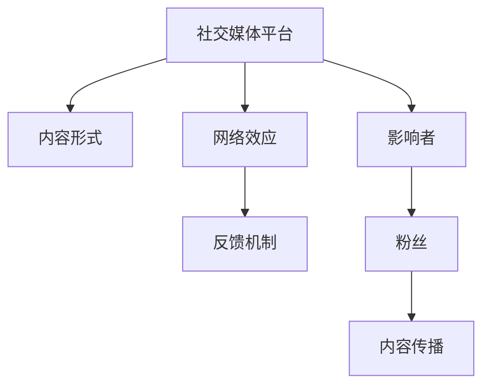

                 

# 程序员如何利用社交媒体扩大知识影响力

> 关键词：社交媒体,知识传播,编程,网络影响力,社区参与,技术博客,编程竞赛,开源项目

## 1. 背景介绍

随着互联网技术的飞速发展，社交媒体已成为现代社会的标配，深刻地改变了人们获取信息、表达观点、交流互动的方式。对于程序员而言，社交媒体不仅是展示技术才华的平台，更是一种新型知识传播的渠道。通过在社交媒体上发布技术文章、参与编程竞赛、贡献开源项目等方式，程序员可以大幅提升自身的技术影响力和知名度。

### 1.1 社交媒体的价值

社交媒体不仅仅是个人娱乐的场所，也是知识传播和价值交换的重要平台。程序员利用社交媒体可以：

- 分享知识：通过文章、视频、代码等形式，分享技术心得、实践经验，传授编程技巧，帮助其他开发者学习。
- 获取反馈：在社交媒体上发布内容，获取来自同行的反馈、建议和改进意见，提高自我认知。
- 扩展人脉：通过参与讨论、互动交流，结识更多行业内的技术专家、志同道合的开发者，建立有价值的社交网络。
- 提升影响力：借助社交媒体的传播效应，吸引更多的关注者，提升在技术圈内的知名度和影响力。
- 发掘机会：通过社交媒体，发现技术趋势、就业机会、合作项目，拓展职业发展的可能性。

### 1.2 社交媒体的分类

社交媒体平台种类繁多，不同平台适合的内容形式和互动方式也各不相同。以下是几种主要的社交媒体及其特点：

1. **Twitter**：实时性、即时性、简短性。适合分享技术见解、发布最新动态、参与技术讨论。
2. **GitHub**：代码托管、版本控制、开源项目。适合发布代码示例、参与开源项目、展示技术成果。
3. **LinkedIn**：职业社交、人脉扩展、行业动态。适合发布专业文章、招聘信息、寻求职业机会。
4. **Medium**：长篇技术博客、深度分析、专业讨论。适合撰写技术文章、传播专业知识、进行技术分享。
5. **Stack Overflow**：编程问答、技术交流、问题解决。适合回答技术问题、参与问题讨论、分享编程经验。

## 2. 核心概念与联系

### 2.1 核心概念概述

理解社交媒体知识传播的原理和机制，有助于程序员更好地利用这一渠道，提升自身影响力。核心概念包括：

- **社交媒体平台**：如Twitter、GitHub、LinkedIn、Medium、Stack Overflow等，是知识传播的重要渠道。
- **内容形式**：如文章、代码、视频、PPT等，是社交媒体上知识传播的主要载体。
- **网络效应**：社交媒体用户数量的增长会吸引更多用户加入，形成正反馈，提升内容传播的广度和深度。
- **反馈机制**：社交媒体上的点赞、评论、分享等反馈机制，影响内容的传播效果。
- **影响者**：在社交媒体上有较大影响力的技术专家、博主、开发者，他们的内容对粉丝有较强的影响力。

这些概念之间的关系可以通过以下Mermaid流程图来展示：



### 2.2 核心概念原理和架构

社交媒体知识传播的原理是基于网络效应和反馈机制的。社交媒体平台通过连接用户，建立网络关系，形成知识传播的闭环。用户通过发布内容、参与互动、获得反馈，逐步扩大自己的影响力，吸引更多的粉丝关注，进一步提升内容的传播效果。

社交媒体知识传播的架构通常包括以下几个部分：

1. **内容发布平台**：提供内容发布、分享、评论等功能，如Twitter、Medium、博客等。
2. **互动社区**：提供问答、讨论、交流等功能，如Stack Overflow、Reddit等。
3. **数据平台**：记录用户行为、内容传播效果等数据，用于分析、优化和决策，如Google Analytics等。
4. **推荐算法**：根据用户行为和内容特征，推荐相关内容，提高内容传播效率，如算法推荐系统。

社交媒体知识传播的流程可以总结为：内容发布 -> 内容传播 -> 获得反馈 -> 优化内容 -> 扩大影响力 -> 获得更多反馈 -> ...。

## 3. 核心算法原理 & 具体操作步骤

### 3.1 算法原理概述

社交媒体知识传播的算法原理主要基于网络效应和反馈机制。用户通过发布内容、参与互动、获得反馈，逐步扩大自己的影响力，吸引更多的粉丝关注，进一步提升内容的传播效果。

社交媒体平台通常采用推荐算法来提高内容的传播效率，常见的推荐算法包括：

- **基于用户行为的推荐**：根据用户的历史行为、兴趣偏好，推荐相关内容。
- **基于内容的推荐**：根据内容的关键词、标签、风格等特征，推荐相关内容。
- **基于社交关系的推荐**：根据用户的社交关系，推荐与用户有相似兴趣或关系的人或内容。

这些推荐算法通过不断迭代，优化内容的传播效果，提高用户的参与度和满意度。

### 3.2 算法步骤详解

社交媒体知识传播的操作步骤主要包括：

1. **内容创作**：程序员根据技术主题、行业热点等，创作高质量的技术文章、代码示例、视频教程等。
2. **内容发布**：选择适合的社交媒体平台，发布内容。
3. **互动参与**：积极参与社交媒体上的讨论、问答、技术交流等，与同行互动。
4. **内容优化**：根据反馈，优化内容质量、格式、标题等，提升内容吸引力。
5. **粉丝运营**：定期更新内容，维护粉丝关系，扩大社交网络。
6. **数据分析**：利用社交媒体平台提供的数据分析工具，分析内容传播效果、粉丝行为等，优化策略。

### 3.3 算法优缺点

社交媒体知识传播的优点：

- 低成本高效益：通过社交媒体，程序员可以以较低的成本传播技术知识，获取广泛的影响力。
- 即时性互动：社交媒体的实时性特点，使得程序员能够即时获得反馈，进行互动交流。
- 多种内容形式：社交媒体支持多种内容形式，程序员可以根据自身特点选择适合的形式。

社交媒体知识传播的缺点：

- 内容同质化：大量类似内容可能导致用户疲劳，影响传播效果。
- 误导信息：社交媒体上存在虚假信息、不实报道，程序员需要具备辨别能力。
- 网络暴力：社交媒体上可能存在网络暴力、人身攻击，程序员需要注意自我保护。
- 数据隐私：社交媒体平台需要用户提供大量个人信息，程序员需要注意数据隐私保护。

### 3.4 算法应用领域

社交媒体知识传播在以下领域具有广泛的应用：

1. **技术博客和文章**：通过Medium、博客等平台，发布技术文章，传播编程知识。
2. **编程竞赛和比赛**：通过参与HackerRank、LeetCode等编程竞赛，展示技术能力，吸引粉丝关注。
3. **开源项目和代码托管**：通过GitHub等平台，贡献代码，参与开源项目，提升技术影响力。
4. **技术讲座和演讲**：通过LinkedIn、Twitter等平台，分享技术讲座、演讲，扩大影响力。
5. **社区互动和讨论**：通过Stack Overflow、Reddit等平台，参与技术讨论、问答，积累技术知识。

## 4. 数学模型和公式 & 详细讲解

### 4.1 数学模型构建

社交媒体知识传播的数学模型可以表示为：

$$
\text{传播效果} = \text{内容质量} \times \text{平台特征} \times \text{网络效应}
$$

其中：

- **内容质量**：内容的技术深度、原创性、实用性等因素。
- **平台特征**：平台的活跃度、用户基数、推荐算法等因素。
- **网络效应**：用户之间的连接强度、互动频率等因素。

### 4.2 公式推导过程

假设社交媒体上有一个用户U，内容C，社交关系G。用户U在社交媒体上的传播效果$E(U)$可以表示为：

$$
E(U) = f(C, G, U)
$$

其中$f$为传播效果的函数。内容C的质量可以通过技术指标、原创性、互动度等衡量，社交关系G可以表示为用户之间的关系网络，用户U的影响力可以表示为粉丝数量、互动频率等。

传播效果的函数$f$可以表示为：

$$
f(C, G, U) = C \times \left(\sum_{i=1}^N \frac{G_{U,i}}{D_i}\right) \times U
$$

其中$N$为用户U的社交关系数，$G_{U,i}$为U与用户i的关系强度，$D_i$为i的粉丝数。

### 4.3 案例分析与讲解

假设一个程序员A在GitHub上发布了一个开源项目C，并积极参与技术讨论。根据上述公式，A在GitHub上的传播效果可以表示为：

$$
E(A) = f(C, G_A, U_A)
$$

其中$G_A$表示A的社交关系网络，$U_A$表示A的粉丝数量和互动频率。通过优化内容C的质量和形式，积极参与技术讨论，A可以逐步扩大自己的影响力，吸引更多的粉丝关注。

## 5. 项目实践：代码实例和详细解释说明

### 5.1 开发环境搭建

以下是使用Python进行社交媒体知识传播实践的开发环境配置流程：

1. **安装Python**：从官网下载并安装Python 3.x版本。
2. **安装社交媒体API**：安装Python中的相关API包，如Tweepy（Twitter）、PyGitHub（GitHub）、Requests等。
3. **配置API密钥**：获取Twitter、GitHub等社交媒体平台的API密钥，配置到Python代码中。
4. **环境测试**：编写测试代码，确保API配置正确，能正常访问社交媒体平台。

### 5.2 源代码详细实现

下面以在Twitter上发布技术文章的示例，展示代码实现：

```python
import tweepy
import time

# 获取Twitter API密钥
consumer_key = 'YOUR_CONSUMER_KEY'
consumer_secret = 'YOUR_CONSUMER_SECRET'
access_token = 'YOUR_ACCESS_TOKEN'
access_token_secret = 'YOUR_ACCESS_TOKEN_SECRET'

# 创建API对象
auth = tweepy.OAuthHandler(consumer_key, consumer_secret)
auth.set_access_token(access_token, access_token_secret)
api = tweepy.API(auth)

# 发布文章
def publish_article(article_content):
    status = api.update_status(article_content)
    print(f'Article published with ID: {status.idstr}')

# 发布示例文章
publish_article('This is a sample article about programming on Twitter.')
```

以上代码实现了在Twitter上发布技术文章的逻辑。通过设置API密钥，创建API对象，调用`update_status`方法，即可发布文章。

### 5.3 代码解读与分析

**代码解读**：

- `tweepy`库是Python中用于与Twitter API交互的库，支持发布文章、获取状态、搜索用户等功能。
- `api.update_status`方法用于发布文章，参数为文章内容。
- 获取Twitter API密钥时，需要注册Twitter开发者账号，并在开发者控制台中创建应用，获取对应的API密钥。

**代码分析**：

- 代码中使用了`tweepy`库的API接口，通过API密钥和`api.update_status`方法，实现了在Twitter上发布文章的功能。
- 代码实现简单，易于扩展，支持发布多种形式的内容，如文章、代码、视频等。
- 代码中未考虑错误处理和异常情况，实际使用时需要增加相应的异常处理逻辑。

### 5.4 运行结果展示

运行以上代码，可以在Twitter上成功发布文章。文章的发布效果可以通过查看Twitter上的状态更新来验证。

## 6. 实际应用场景

### 6.1 技术博客和文章

技术博客是程序员展示技术水平、传播编程知识的重要平台。通过在Medium、博客等平台发布技术文章，程序员可以积累技术影响力，吸引更多的粉丝关注。

在技术博客上，程序员可以分享编程心得、技术方案、项目经验等，帮助其他开发者学习。同时，通过评论、点赞等互动，获得反馈，进一步提升内容质量。

### 6.2 编程竞赛和比赛

编程竞赛和比赛是程序员展示技术能力、拓展人脉的重要途径。通过参与HackerRank、LeetCode等编程竞赛，程序员可以与其他开发者交流、切磋，展示自己的编程水平。

在编程竞赛中，程序员需要解决各种难题，展示自己的算法和编程能力。同时，通过与其他参赛者交流、讨论，积累编程经验，扩大社交网络。

### 6.3 开源项目和代码托管

开源项目和代码托管是程序员分享技术成果、积累技术影响力的重要手段。通过在GitHub等平台贡献代码、参与开源项目，程序员可以展示自己的技术能力，吸引更多的粉丝关注。

在开源项目中，程序员可以与全球开发者协作，共同开发高质量的代码。同时，通过参与讨论、贡献代码，积累技术经验，扩大社交网络。

### 6.4 技术讲座和演讲

技术讲座和演讲是程序员展示技术水平、拓展人脉的重要途径。通过在LinkedIn、Twitter等平台分享技术讲座、演讲，程序员可以展示自己的技术能力，吸引更多的粉丝关注。

在技术讲座和演讲中，程序员可以分享自己的技术心得、行业热点、最新进展等，展示自己的技术水平。同时，通过与其他技术专家交流、互动，积累技术经验，扩大社交网络。

### 6.5 社区互动和讨论

社区互动和讨论是程序员积累技术知识、拓展人脉的重要手段。通过在Stack Overflow、Reddit等平台参与技术讨论、问答，程序员可以积累技术知识，展示自己的技术能力，吸引更多的粉丝关注。

在社区讨论中，程序员可以与其他开发者交流、讨论，解决技术难题，积累技术经验。同时，通过回答问题、参与讨论，展示自己的技术能力，吸引更多的粉丝关注。

## 7. 工具和资源推荐

### 7.1 学习资源推荐

为了帮助程序员系统掌握社交媒体知识传播的理论基础和实践技巧，这里推荐一些优质的学习资源：

1. **《社交媒体营销》系列书籍**：详细介绍了社交媒体的原理、策略、案例等，是了解社交媒体知识传播的必备书籍。
2. **《编程技巧》系列课程**：涵盖编程技巧、算法设计、数据结构等内容，是提升编程能力的优秀资源。
3. **《技术博客》系列博客**：分享技术心得、项目经验、编程技巧等，是程序员学习编程知识的重要平台。
4. **《编程竞赛》系列课程**：介绍编程竞赛的参赛策略、算法设计、代码实现等内容，是提升编程竞赛能力的优秀资源。
5. **《开源项目》系列文章**：介绍开源项目的贡献方式、协作技巧、项目经验等内容，是提升开源贡献能力的优秀资源。

通过对这些资源的学习实践，相信你一定能够快速掌握社交媒体知识传播的精髓，并用于解决实际的编程问题。

### 7.2 开发工具推荐

高效的开发离不开优秀的工具支持。以下是几款用于社交媒体知识传播开发的常用工具：

1. **PyTorch**：基于Python的开源深度学习框架，灵活高效的计算图，适合快速迭代研究。
2. **TensorFlow**：由Google主导开发的开源深度学习框架，生产部署方便，适合大规模工程应用。
3. **Twitter API**：Twitter官方提供的API接口，支持发布文章、获取状态、搜索用户等功能。
4. **GitHub API**：GitHub官方提供的API接口，支持代码托管、版本控制、开源项目等功能。
5. **Stack Overflow API**：Stack Overflow官方提供的API接口，支持问答、讨论、社区互动等功能。

合理利用这些工具，可以显著提升社交媒体知识传播的开发效率，加快创新迭代的步伐。

### 7.3 相关论文推荐

社交媒体知识传播的发展源于学界的持续研究。以下是几篇奠基性的相关论文，推荐阅读：

1. **《社交媒体对知识传播的影响》**：研究了社交媒体在知识传播中的作用和影响，为程序员利用社交媒体提供了理论依据。
2. **《编程竞赛中的策略和技巧》**：介绍了编程竞赛的参赛策略、算法设计、代码实现等内容，是提升编程竞赛能力的优秀资源。
3. **《开源项目的贡献方式和协作技巧》**：介绍了开源项目的贡献方式、协作技巧、项目经验等内容，是提升开源贡献能力的优秀资源。
4. **《技术讲座和演讲的策略和技巧》**：介绍了技术讲座和演讲的策略、技巧、经验等内容，是提升技术演讲能力的优秀资源。
5. **《社区互动和讨论的策略和技巧》**：介绍了社区互动和讨论的策略、技巧、经验等内容，是提升社区互动能力的优秀资源。

这些论文代表了大语言模型微调技术的发展脉络。通过学习这些前沿成果，可以帮助研究者把握学科前进方向，激发更多的创新灵感。

## 8. 总结：未来发展趋势与挑战

### 8.1 总结

本文对程序员利用社交媒体扩大知识影响力的原理、技术和操作流程进行了全面系统的介绍。首先阐述了社交媒体的价值，并介绍了社交媒体知识传播的原理和机制。其次，从算法原理、操作步骤、优缺点等方面详细讲解了社交媒体知识传播的实现细节，并提供了代码实例和详细解释。同时，本文还探讨了社交媒体知识传播在技术博客、编程竞赛、开源项目等多个领域的应用场景，展示了其广阔的潜力。最后，本文推荐了学习资源、开发工具和相关论文，提供了全方位的技术指引。

通过本文的系统梳理，可以看到，社交媒体知识传播已成为程序员展示技术才华、积累技术影响力的重要渠道。利用这一渠道，程序员可以高效传播技术知识，拓展社交网络，提升个人品牌影响力。未来，社交媒体知识传播必将在技术社区、企业招聘、项目协作等方面发挥更大的作用，成为程序员职业发展的重要手段。

### 8.2 未来发展趋势

展望未来，社交媒体知识传播将呈现以下几个发展趋势：

1. **多平台融合**：社交媒体平台之间的互动和融合将更加频繁，程序员可以同时在多个平台发布内容，扩大传播效果。
2. **算法优化**：社交媒体平台将不断优化推荐算法，提高内容的传播效率，提升程序员的影响力。
3. **实时互动**：社交媒体的实时互动功能将更加强大，程序员可以即时获取反馈，进行互动交流。
4. **个性化推荐**：社交媒体平台将提供更加个性化的推荐服务，根据程序员的兴趣和历史行为，推荐相关内容。
5. **技术社区崛起**：技术社区将逐步崛起，成为程序员交流、协作的重要平台，推动技术知识的传播和创新。

这些趋势将进一步提升社交媒体知识传播的效果，使程序员能够更高效地传播技术知识，拓展人脉，提升影响力。

### 8.3 面临的挑战

尽管社交媒体知识传播已取得显著成效，但在实际应用中也面临诸多挑战：

1. **内容质量**：发布的内容需要具备高质量、原创性，否则难以吸引关注者。
2. **网络暴力**：社交媒体上存在网络暴力、人身攻击，程序员需要具备自我保护能力。
3. **数据隐私**：社交媒体平台需要用户提供大量个人信息，程序员需要重视数据隐私保护。
4. **互动不足**：社交媒体上的互动不足，内容难以获得良好的传播效果。
5. **时间成本**：维护社交媒体账号需要大量时间，程序员需要合理分配时间。

这些挑战需要程序员在实践中不断优化策略，提升内容质量，加强互动交流，保障数据安全，才能更好地利用社交媒体传播技术知识，提升个人影响力。

### 8.4 研究展望

未来的研究将在以下几个方向寻求新的突破：

1. **算法优化**：开发更加高效的推荐算法，提升内容传播效果。
2. **互动策略**：研究更有效的互动策略，提升用户参与度和互动频率。
3. **数据隐私保护**：研究数据隐私保护技术，保障用户数据安全。
4. **时间管理**：研究时间管理方法，帮助程序员更好地平衡社交媒体维护和日常工作。
5. **技术社区建设**：研究技术社区的建设方法，推动技术知识传播和创新。

这些研究方向将进一步提升社交媒体知识传播的效果，使程序员能够更高效地传播技术知识，拓展人脉，提升影响力。

## 9. 附录：常见问题与解答

**Q1：如何高效利用社交媒体传播技术知识？**

A: 高效利用社交媒体传播技术知识需要以下步骤：

1. 确定目标受众：明确你想要传播的对象，如技术社区、企业招聘、项目协作等。
2. 选择合适的平台：根据目标受众选择合适的社交媒体平台，如Twitter、GitHub、LinkedIn等。
3. 发布高质量内容：发布高质量、原创性的技术文章、代码示例、视频教程等。
4. 积极互动交流：积极参与社交媒体上的讨论、问答、技术交流等，与同行互动。
5. 定期更新内容：定期更新内容，保持活跃度，吸引更多关注者。
6. 关注反馈意见：关注粉丝的反馈意见，不断优化内容质量，提升传播效果。

**Q2：社交媒体知识传播对程序员有什么好处？**

A: 社交媒体知识传播对程序员有以下好处：

1. 提升技术影响力：通过发布技术文章、参与讨论，程序员可以展示技术水平，积累技术影响力。
2. 拓展人脉：通过参与社交媒体上的互动，程序员可以结识更多技术专家、志同道合的开发者，建立有价值的社交网络。
3. 获取反馈：通过社交媒体上的反馈机制，程序员可以获取来自同行的反馈、建议和改进意见，提高自我认知。
4. 发掘机会：通过社交媒体，程序员可以发现技术趋势、就业机会、合作项目，拓展职业发展的可能性。

**Q3：社交媒体上如何避免网络暴力？**

A: 避免社交媒体上的网络暴力需要以下措施：

1. 尊重他人：在社交媒体上发布内容时，尊重他人的观点和隐私，避免人身攻击和歧视性言论。
2. 控制情绪：在与人互动时，控制情绪，避免因情绪激动而引发争执。
3. 关注平台规则：熟悉社交媒体平台的规则和政策，避免发布违规内容。
4. 及时举报：遇到网络暴力行为，及时举报，避免事态扩大。

**Q4：如何保障社交媒体上的数据隐私？**

A: 保障社交媒体上的数据隐私需要以下措施：

1. 控制信息发布：在社交媒体上发布信息时，只发布必要的信息，避免泄露隐私。
2. 使用隐私设置：使用社交媒体平台的隐私设置，限制他人访问你的信息。
3. 使用加密工具：使用加密工具保护数据安全，避免数据泄露。
4. 关注隐私政策：关注社交媒体平台的隐私政策，了解数据使用和保护措施。

通过以上措施，可以有效保障社交媒体上的数据隐私，避免信息泄露和数据滥用。

---

作者：禅与计算机程序设计艺术 / Zen and the Art of Computer Programming

