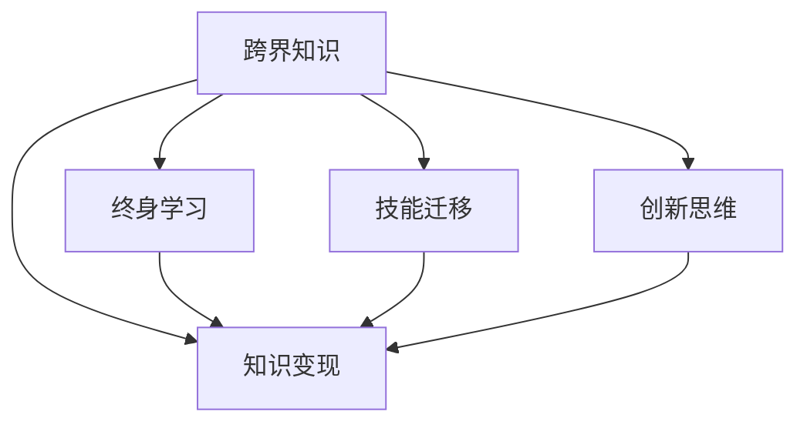

                 

# 程序员如何培养跨界知识变现能力

## 1. 背景介绍

在当今这个快速变化的数字化时代，程序员要想保持竞争力，必须具备跨界知识技能，以适应技术和市场的不断变化。跨界知识，是指跨过传统行业边界，融合多种学科领域的知识，提升个人解决问题和创新的能力。这种能力不仅能够帮助程序员在现有岗位上发挥更大的价值，还能够在职业发展中开辟新的道路，实现知识变现。

### 1.1 问题由来

随着科技的进步和市场的变化，程序员面临的挑战越来越复杂多样。传统IT领域的技术更新速度快，新的编程语言、框架和工具层出不穷，而新兴领域如人工智能、大数据、区块链等也在快速崛起，给程序员的知识结构带来了巨大的压力。

### 1.2 问题核心关键点

- **跨界能力的重要性**：跨界能力是程序员应对未来挑战的关键。在快速变化的技术和市场环境中，单一技术领域的知识已不足以应对复杂多变的问题。
- **知识变现的途径**：通过跨界知识，程序员可以在多个领域获得应用，实现自我价值和商业价值的双重提升。
- **跨界学习的挑战**：跨界学习需要时间和精力的投入，如何高效地掌握新知识，并灵活应用于不同领域，是程序员面临的主要挑战。

## 2. 核心概念与联系

### 2.1 核心概念概述

为了更好地理解跨界知识变现能力的培养，本节将介绍几个关键概念及其联系：

- **跨界知识**：指跨越传统学科边界，整合多种知识领域的综合能力，如技术、市场、商业、心理学等。
- **知识变现**：指将所掌握的知识、技能转化为经济价值的过程，包括在现有岗位上提升工作效率，开辟新的职业道路，或参与创业等。
- **终身学习**：即持续不断地更新知识，学习新技术、新方法，保持与市场需求的同步。
- **技能迁移**：指将一种领域的技能和经验，迁移到另一个领域的应用，实现知识的复用。
- **创新思维**：指打破传统思维定势，从新的角度审视问题，寻找创新的解决方案。

这些概念之间的联系如图示：



这个图示展示了跨界知识与知识变现之间的逻辑关系：

1. 跨界知识通过终身学习和技能迁移不断丰富和发展，成为跨界知识变现的基础。
2. 跨界知识变现不仅包括在原有岗位上提升效率，还包括开辟新的职业道路、参与创业等。
3. 创新思维是跨界知识变现的重要推动力，能够帮助程序员找到新颖的解决方案。

## 3. 核心算法原理 & 具体操作步骤

### 3.1 算法原理概述

跨界知识变现能力的培养，本质上是通过学习和实践，不断提升自己的综合素质和技能，实现知识、技能和市场需求的匹配。这一过程可以概括为以下几个步骤：

1. **需求分析**：明确自身职业发展方向，识别当前技能与市场需求之间的差距。
2. **目标设定**：根据需求分析结果，设定具体的学习目标和时间表。
3. **知识获取**：通过多种途径获取新知识，包括在线课程、书籍、研讨会、项目实践等。
4. **技能应用**：将新知识应用到实际工作中，验证和优化所学内容。
5. **反馈优化**：通过反馈和反思，持续改进学习方法和技能应用策略。

### 3.2 算法步骤详解

下面是跨界知识变现能力的培养步骤的详细讲解：

**Step 1: 需求分析**

- 反思当前职业发展和个人兴趣，识别技能瓶颈和职业兴趣。
- 调研市场趋势，识别技术发展方向和新兴领域，如人工智能、大数据、区块链等。
- 确定短期和长期的学习目标，如掌握一种新编程语言，或了解一种新技术框架。

**Step 2: 目标设定**

- 根据需求分析结果，设定具体的学习目标，如在一年内掌握Python编程，或完成一个大数据项目。
- 制定详细的学习计划，包括每周学习时间、学习内容和方法。
- 确定评估学习效果的标准，如通过项目实战、证书考试等。

**Step 3: 知识获取**

- 选择权威的学习资源，如MOOC平台上的在线课程、专业书籍、技术博客等。
- 加入相关的学习社区和论坛，参与讨论和交流，获取第一手信息。
- 通过项目实践，将所学知识应用到实际问题中，提升理解和应用能力。

**Step 4: 技能应用**

- 在工作中应用新技能，解决实际问题，积累实战经验。
- 通过开源项目、参与竞赛等方式，展示所学技能的价值。
- 向同事和上级展示成果，获得反馈和认可。

**Step 5: 反馈优化**

- 定期回顾和评估学习效果，调整学习计划和方法。
- 针对反馈意见，改进学习策略和技术应用，持续提升能力。
- 寻求更多的学习机会，如参加工作坊、培训课程等。

### 3.3 算法优缺点

跨界知识变现能力的培养，具有以下优点：

1. **提升竞争力**：跨界能力能够帮助程序员在技术和市场变化中保持竞争力，适应新挑战。
2. **开拓职业道路**：跨界知识能够开拓新的职业领域，提供更多职业选择和发展机会。
3. **实现知识变现**：通过跨界能力，程序员能够在现有岗位上提升工作效率，开辟新的收入来源，实现商业价值。

同时，也存在一些局限性：

1. **时间成本高**：跨界学习需要大量的时间和精力投入，可能会影响当前工作的进展。
2. **学习难度大**：跨界知识涉及多个领域的综合能力，难度较大，需要较强的自学能力和毅力。
3. **缺乏系统性**：跨界学习往往缺乏系统的课程体系，容易走弯路，效率较低。
4. **实践机会少**：跨界学习更多依赖于自学和在线资源，缺乏实际项目的实践机会。

尽管如此，跨界知识变现能力的培养仍然是程序员提升自我价值和市场竞争力的重要途径。通过科学的方法和持续的努力，程序员可以实现多领域技能的学习和应用，真正实现知识变现。

### 3.4 算法应用领域

跨界知识变现能力的应用领域非常广泛，涵盖了多个行业和职业方向：

- **软件开发**：通过学习新的编程语言、框架和技术，提升开发效率和代码质量。
- **数据分析**：掌握大数据技术，提升数据处理和分析能力，为决策支持提供科学依据。
- **人工智能**：学习机器学习、深度学习等技术，实现智能应用和自动化流程。
- **产品设计**：理解用户需求和市场趋势，提升产品设计和用户体验。
- **创业**：利用跨界知识，开发创新性产品，创业或参与初创公司。
- **技术咨询**：提供技术指导和咨询服务，帮助企业解决技术难题。

这些领域都需要跨界能力，通过跨界学习，程序员可以在多个方向上实现自我增值和价值实现。

## 4. 数学模型和公式 & 详细讲解 & 举例说明

### 4.1 数学模型构建

为了更好地理解跨界知识变现能力培养的数学模型，我们以学习Python编程为例，构建一个简单的数学模型。

假设程序员初始掌握的编程语言为C++，学习目标为Python。设初始掌握程度为 $P_0$，学习时间为 $t$，学习效率为 $e$，学习目标掌握程度为 $P_1$。则掌握Python编程的能力提升可以表示为：

$$
P(t) = P_0 + et
$$

其中 $t$ 为学习时间，$e$ 为学习效率。

### 4.2 公式推导过程

根据上述模型，我们可以推导出学习效率 $e$ 和掌握程度 $P_1$ 的关系：

$$
P_1 = P_0 + et
$$

$$
t = \frac{P_1 - P_0}{e}
$$

通过公式可以计算出达到目标掌握程度 $P_1$ 所需的学习时间 $t$，以及学习效率 $e$ 的影响。例如，如果初始掌握度为50%，目标掌握度为90%，学习效率为每日掌握5%，则：

$$
t = \frac{90\% - 50\%}{5\%} = 10
$$

即需要10天时间才能达到90%的掌握度。

### 4.3 案例分析与讲解

以一个实际的跨界学习案例为例，分析如何通过学习新知识实现知识变现：

**案例背景**：
- 程序员小张目前在大数据领域工作，但希望通过学习人工智能技术，提升自身竞争力。
- 小张的初始掌握度为0，目标掌握度为60%。

**学习过程**：
- 小张通过在线课程和书籍，每天学习2小时，共计学习20天。
- 小张的学习效率为每日掌握5%。
- 通过学习，小张最终达到了目标掌握度60%。

**成果变现**：
- 小张通过掌握人工智能技术，获得了更多高薪职位的机会，提升了自身价值。
- 小张参与了一个AI项目，展示了自身的技术能力，获得了公司的认可。

## 5. 项目实践：代码实例和详细解释说明

### 5.1 开发环境搭建

要实现跨界知识变现能力，程序员需要构建一个适合学习与实践的环境。以下是一些关键的开发环境搭建步骤：

1. **选择学习平台**：
   - 在线课程平台：如Coursera、edX、Udacity等。
   - 视频教程：如YouTube、Bilibili等。
   - 书籍资源：如GitHub、亚马逊等。

2. **安装必要的软件**：
   - 编程环境：如Python、R、JavaScript等。
   - 开发工具：如IDE、编辑器、调试器等。
   - 数据集：如Kaggle、UCI等。

3. **配置环境变量**：
   - 设置项目目录和路径。
   - 配置依赖包和版本。

4. **搭建项目管理工具**：
   - 使用Git、SVN等版本控制工具。
   - 配置CI/CD工具，如Jenkins、Travis CI等。

### 5.2 源代码详细实现

以学习Python编程为例，我们提供一个简单的代码实现流程：

**Step 1: 创建项目文件夹**
```bash
mkdir learn_python
cd learn_python
```

**Step 2: 安装Python环境**
```bash
pip install python
```

**Step 3: 学习Python基础语法**
```python
# 打印"Hello, World!"
print("Hello, World!")
```

**Step 4: 学习数据结构**
```python
# 列表、字典、集合等数据结构
```

**Step 5: 学习面向对象编程**
```python
# 类、继承、多态等概念
```

**Step 6: 应用Python实现项目**
```python
# 应用Python进行数据处理、机器学习等项目实践
```

### 5.3 代码解读与分析

在上述代码中，我们通过Python基础语法的学习，逐步掌握数据结构和面向对象编程的概念。通过项目实践，将所学知识应用到实际问题中，进一步巩固和提升能力。

## 6. 实际应用场景

### 6.1 软件开发

跨界知识在软件开发中的应用非常广泛，程序员可以通过学习新语言和框架，提升开发效率和代码质量。例如，Java程序员学习Python后，可以在数据分析、自动化测试等领域找到新的应用场景，实现跨界知识的变现。

**案例分析**：
- 项目背景：某公司需要开发一个数据分析平台。
- 技术需求：平台需要支持实时数据处理、机器学习模型训练等。
- 解决方案：Java程序员小王学习了Python和Scikit-learn，通过Python实现了数据处理和模型训练模块，提升了平台的功能和性能。
- 成果变现：小王获得了晋升机会，并通过平台项目展示了自身的跨界能力。

### 6.2 数据分析

数据分析是跨界能力的重要应用方向之一，通过学习大数据技术，程序员可以提升数据处理和分析能力，为决策支持提供科学依据。

**案例分析**：
- 项目背景：某公司需要分析用户行为数据，优化产品设计。
- 技术需求：数据处理、统计分析、可视化等。
- 解决方案：数据分析师小李学习了R和Pandas，通过R语言实现了数据处理和统计分析模块，提升了数据处理效率。
- 成果变现：小李获得了更多的项目机会，并通过数据支持决策，获得了公司的认可。

### 6.3 人工智能

人工智能是当前技术发展的前沿领域，通过学习机器学习、深度学习等技术，程序员可以实现智能应用和自动化流程。

**案例分析**：
- 项目背景：某公司需要开发一个智能客服系统。
- 技术需求：自然语言处理、机器学习模型训练等。
- 解决方案：数据科学家小张学习了Python和TensorFlow，通过TensorFlow实现了机器学习模型训练，提升了客服系统的智能化水平。
- 成果变现：小张获得了更多的技术职位机会，并通过智能客服项目展示了自身的跨界能力。

### 6.4 未来应用展望

未来，随着技术的不断进步和市场的需求变化，跨界知识变现能力将更加重要。程序员需要不断学习和实践，适应新变化，提升自身竞争力。

**趋势预测**：
1. **自动化和智能化**：随着AI技术的发展，自动化和智能化的需求将不断增长，程序员可以通过学习新技能，实现自动化的流程和智能化的解决方案。
2. **多模态技术**：未来将出现更多跨模态技术，如语音识别、图像处理等，程序员需要掌握跨模态技术，实现多模态信息融合。
3. **区块链和加密技术**：随着区块链技术的崛起，程序员可以学习区块链和加密技术，参与智能合约开发、数字身份验证等应用。
4. **大数据和云计算**：云计算和大数据技术的发展将带来更多的机会，程序员可以学习云平台技术、大数据处理技术，提升数据处理和分析能力。

## 7. 工具和资源推荐

### 7.1 学习资源推荐

为了帮助程序员系统掌握跨界知识变现能力，推荐以下学习资源：

1. **在线课程平台**：
   - Coursera：提供大量技术和管理课程，涵盖编程、数据科学、人工智能等。
   - edX：提供来自世界顶尖大学的高质量课程，涵盖计算机科学、数据科学、商业管理等。
   - Udacity：提供实战导向的课程，涵盖人工智能、自动驾驶、数据分析等。

2. **技术博客和社区**：
   - Medium：涵盖技术、商业、创意等领域的文章。
   - Stack Overflow：程序员交流和问题解答社区。
   - GitHub：代码分享和开源项目社区。

3. **书籍推荐**：
   - 《Python编程：从入门到实践》：适合Python编程入门学习。
   - 《深度学习》：涵盖深度学习基础和应用。
   - 《数据科学实战》：涵盖数据分析、机器学习等。

### 7.2 开发工具推荐

为了提高程序员的学习和实践效率，推荐以下开发工具：

1. **编程环境**：
   - Python：广泛使用的编程语言，适合数据科学、机器学习等。
   - R：适合数据处理和统计分析。
   - JavaScript：适合前端开发和全栈开发。

2. **IDE和编辑器**：
   - PyCharm：Python编程IDE，提供强大的开发功能和代码提示。
   - Visual Studio Code：轻量级、高度可定制的编辑器。
   - Sublime Text：支持多种编程语言的编辑器。

3. **项目管理工具**：
   - Git：版本控制工具，支持分布式协作。
   - Jenkins：开源的持续集成工具。
   - Docker：容器化部署工具。

### 7.3 相关论文推荐

为了帮助程序员深入理解跨界知识变现能力的理论基础，推荐以下相关论文：

1. 《Lifelong Learning and Online Skill Improvement》：探讨终身学习在技能提升中的应用。
2. 《Cross-Domain Knowledge Transfer》：研究跨界知识迁移的方法和技术。
3. 《Deep Learning for Natural Language Processing》：介绍深度学习在自然语言处理中的应用。
4. 《Programming as a Scientific Discipline》：讨论编程作为科学学科的重要性。

## 8. 总结：未来发展趋势与挑战

### 8.1 研究成果总结

跨界知识变现能力的培养是程序员应对未来挑战的重要途径。通过学习多种技术和领域的知识，程序员可以在多个方向上实现自我增值和价值实现。

### 8.2 未来发展趋势

未来，跨界知识变现能力将进一步发展和应用，主要趋势如下：

1. **技术融合**：多种技术的融合将带来更多创新性应用，如AI与大数据、区块链与云计算等。
2. **跨界学习**：跨界学习将成为常态，程序员需要不断更新知识，适应新变化。
3. **知识变现**：跨界能力将带来更多职业机会，程序员可以在不同领域实现自我增值。
4. **创新思维**：创新思维将成为跨界能力的重要组成部分，帮助程序员找到新颖的解决方案。

### 8.3 面临的挑战

尽管跨界知识变现能力具有巨大的潜力，但实现过程中仍面临诸多挑战：

1. **时间成本高**：跨界学习需要大量的时间和精力投入，可能会影响当前工作的进展。
2. **学习难度大**：跨界知识涉及多个领域的综合能力，难度较大，需要较强的自学能力和毅力。
3. **缺乏系统性**：跨界学习往往缺乏系统的课程体系，容易走弯路，效率较低。
4. **实践机会少**：跨界学习更多依赖于自学和在线资源，缺乏实际项目的实践机会。

### 8.4 研究展望

为了克服这些挑战，未来的研究需要在以下几个方面寻求新的突破：

1. **系统化学习路径**：开发系统化的学习路径和课程体系，帮助程序员高效掌握跨界知识。
2. **实践机会平台**：搭建跨界学习的实践平台，提供实际项目的实践机会。
3. **跨界学习社区**：建立跨界学习社区，促进程序员之间的交流和合作。
4. **持续学习机制**：建立持续学习机制，定期更新和优化学习内容和策略。

总之，跨界知识变现能力的培养是程序员提升自身竞争力和实现商业价值的重要途径。通过科学的方法和持续的努力，程序员可以在多个领域实现自我增值和价值实现，真正实现知识变现。

## 9. 附录：常见问题与解答

**Q1: 跨界学习需要掌握多少新知识？**

A: 跨界学习需要根据个人职业发展和市场需求来选择和掌握新的知识。一般来说，掌握一个新领域的基础知识和核心技能需要1-3个月的时间，提升技能和应用则需要6-12个月。

**Q2: 如何找到适合自己的跨界学习方向？**

A: 可以通过以下步骤找到适合自己的跨界学习方向：
1. 反思当前职业发展和个人兴趣。
2. 调研市场趋势和技术发展方向。
3. 结合自身兴趣和市场需求，选择学习方向。

**Q3: 跨界学习如何平衡时间和工作？**

A: 可以通过以下方法平衡时间和工作：
1. 制定详细的学习计划，合理安排学习时间。
2. 利用碎片时间进行学习，如通勤、午休等。
3. 利用在线课程和资源，提高学习效率。

**Q4: 跨界学习如何提高学习效果？**

A: 可以通过以下方法提高学习效果：
1. 选择权威的学习资源，如MOOC平台、技术博客等。
2. 学习时注重实践，多做项目和案例分析。
3. 定期回顾和反思学习过程，及时调整学习策略。

---

作者：禅与计算机程序设计艺术 / Zen and the Art of Computer Programming

