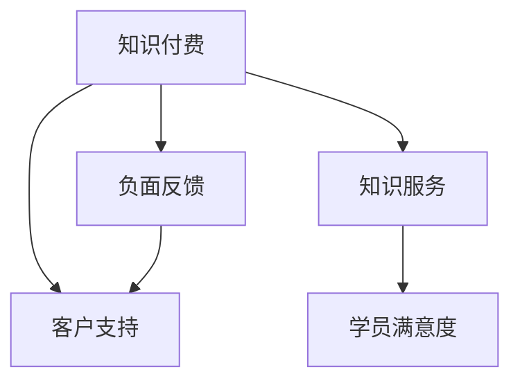

                 

# 程序员如何处理知识付费的负面反馈

在快速发展的数字化时代，知识付费作为一种新兴的商业模式，正在深刻影响着各行各业。作为程序员，如何在知识付费平台提供高质量内容的同时，有效处理来自用户和市场的负面反馈，成为摆在我们面前的一个重要课题。本文将深入探讨知识付费的负面反馈处理机制，从原理、步骤、优缺点等多个角度进行详细剖析，旨在帮助程序员更好地应对这些挑战。

## 1. 背景介绍

### 1.1 知识付费平台概述

知识付费平台，如Coursera、Udemy、CSDN Pro等，通过提供高质量在线课程、技术文章、直播讲座等内容，满足用户对知识技能的需求。这些平台不仅助力个人成长，也促进了技术行业知识分享与传播。然而，用户和市场对内容质量、课程效果等方面的高期待，也带来了更多的负面反馈。

### 1.2 负面反馈的来源

负面反馈的来源多种多样，包括但不限于：
- 课程内容不满足用户预期。
- 平台服务质量不佳。
- 学员之间的互动效果不佳。
- 知识付费内容的版权和隐私问题。
- 退费流程复杂或欺诈行为。

这些反馈反映了用户在知识付费过程中的痛点和需求，程序员作为知识内容的创造者和提供者，需要有效应对并解决这些问题，以提升平台的用户满意度和口碑。

## 2. 核心概念与联系

### 2.1 核心概念概述

为更好地理解负面反馈处理机制，本节将介绍几个关键概念：

- 知识付费（Knowledge Subscription）：用户为获取特定知识内容而支付费用的模式。
- 负面反馈（Negative Feedback）：用户对课程或服务不满意而表达的批评意见。
- 知识服务（Knowledge Service）：平台提供的服务，包括但不限于课程学习、技术交流、项目合作等。
- 学员满意度（Student Satisfaction）：用户对平台服务质量和课程效果的整体评价。
- 客户支持（Customer Support）：平台提供的客户服务，包括退费、换课、技术支持等。

这些概念之间相互关联，共同构成知识付费平台的运营基础。以下是一个简单的Mermaid流程图，展示了这些概念之间的联系：



通过这个流程图可以看出，负面反馈处理机制是一个闭环系统，平台通过知识服务和客户支持满足用户需求，同时通过处理负面反馈不断优化和提升服务质量。

## 3. 核心算法原理 & 具体操作步骤

### 3.1 算法原理概述

负面反馈的处理机制基于客户关系管理（CRM）理论和数据挖掘技术。核心思想是通过对用户行为数据的分析，识别出导致负面反馈的关键因素，从而进行针对性的改进和优化。

假设平台收集到了大量用户反馈数据，记为 $D=\{(x_i,y_i)\}_{i=1}^N$，其中 $x_i$ 代表用户行为数据（如课程评价、课堂互动、退费申请等），$y_i$ 表示对应的反馈类型（如课程评价低、平台服务不满意等）。通过训练一个分类模型，可以预测新用户行为可能产生的负面反馈。

基于监督学习的负面反馈预测模型，可以通过以下步骤构建：
1. 数据预处理：清洗、整合、归一化数据，生成训练集和验证集。
2. 特征选择：选择与反馈类型相关的重要特征。
3. 模型训练：选择合适的算法（如决策树、SVM、神经网络等），训练预测模型。
4. 模型评估：在验证集上评估模型性能，调整模型参数。
5. 模型应用：将训练好的模型应用于新用户行为数据，预测潜在负面反馈。

### 3.2 算法步骤详解

#### 3.2.1 数据预处理

数据预处理是负面反馈处理的重要环节，包括数据清洗、数据整合和数据归一化：
- 数据清洗：去除无效数据，如重复数据、异常数据等。
- 数据整合：将不同来源、不同格式的数据合并成统一格式。
- 数据归一化：将不同尺度的数据统一到相同量级，提高模型泛化能力。

#### 3.2.2 特征选择

选择合适的特征是负面反馈预测的关键。以下特征通常被考虑：
- 课程评价：用户对课程内容的满意度评分。
- 互动频率：用户在课程中的参与度，如提问、讨论、提交作业等。
- 学习时长：用户完成课程所需时间。
- 历史评价：用户过去对其他课程的评价。
- 退费行为：用户是否申请过退费，退费原因。

#### 3.2.3 模型训练

选择合适的算法对数据进行训练。常用的算法包括：
- 决策树：基于树形结构进行分类，易于理解和解释。
- 支持向量机（SVM）：通过寻找最优超平面进行分类，适用于小样本高维数据。
- 神经网络：通过多层非线性映射，适用于复杂模式识别。

#### 3.2.4 模型评估

模型评估通常使用准确率（Accuracy）、精确率（Precision）、召回率（Recall）、F1-score等指标进行衡量。在验证集上评估模型性能，选择最优模型。

#### 3.2.5 模型应用

将训练好的模型应用于新用户行为数据，预测潜在负面反馈。通过监控模型预测结果，及时调整服务策略，提升用户满意度。

### 3.3 算法优缺点

#### 3.3.1 优点

1. **预测准确度高**：通过大量历史数据训练模型，能够较为准确地预测潜在负面反馈。
2. **实时监控和预警**：模型实时监控用户行为，及时发现并预警潜在问题，降低负面反馈风险。
3. **量化评估服务质量**：通过数据分析，可以量化评估不同服务质量对用户满意度的影响。

#### 3.3.2 缺点

1. **数据隐私问题**：收集和处理用户数据可能引发隐私泄露风险。
2. **模型过拟合**：模型过于复杂可能导致过拟合，泛化能力下降。
3. **数据偏见**：如果数据存在偏见，模型预测结果可能也存在偏差，影响决策。
4. **动态性差**：模型训练基于历史数据，难以应对快速变化的市场需求。

## 4. 数学模型和公式 & 详细讲解 & 举例说明

### 4.1 数学模型构建

假设收集到了 $N$ 条用户行为数据 $x_i$，对应的负面反馈类型 $y_i$ 为0或1。我们希望构建一个逻辑回归模型，来预测新用户行为 $x$ 是否会产生负面反馈 $y$。

逻辑回归模型的目标是最小化负对数似然损失函数，即：
$$
\mathcal{L}(w) = -\frac{1}{N}\sum_{i=1}^N (y_i\log \sigma(w^\top x_i) + (1-y_i)\log(1-\sigma(w^\top x_i)))
$$
其中 $w$ 为模型参数，$\sigma(z)=\frac{1}{1+e^{-z}}$ 为sigmoid函数。

### 4.2 公式推导过程

逻辑回归模型的推导基于最大似然估计原理，通过对负对数似然损失函数求导，找到参数 $w$ 的最优值。推导过程如下：

$$
\frac{\partial \mathcal{L}}{\partial w} = -\frac{1}{N}\sum_{i=1}^N [y_i\frac{1-\sigma(w^\top x_i)}{(1+\sigma(w^\top x_i))} - (1-y_i)\frac{\sigma(w^\top x_i)}{(1-\sigma(w^\top x_i))}x_i]
$$

通过反向传播算法，求出 $w$ 的梯度，更新模型参数：
$$
w \leftarrow w - \eta\frac{\partial \mathcal{L}}{\partial w}
$$
其中 $\eta$ 为学习率。

### 4.3 案例分析与讲解

以某知识付费平台为例，通过收集学员对不同课程的评价数据，训练逻辑回归模型，预测新课程评价是否会低于4分（即负反馈）。在模型训练过程中，选择课程时长、讲师评分、互动频率等特征，并在验证集上评估模型性能。最终，模型能够较为准确地预测出可能产生负面反馈的课程，平台可以及时调整课程内容和质量，提升学员满意度。

## 5. 项目实践：代码实例和详细解释说明

### 5.1 开发环境搭建

为了进行负面反馈预测模型的开发和训练，需要进行以下环境搭建：

1. **安装Python和相关库**：
   ```bash
   # 安装Python
   sudo apt update && sudo apt install python3
   # 安装相关库
   pip install pandas numpy scikit-learn seaborn
   ```

2. **数据准备**：
   - 收集历史用户行为数据，并将其整理成CSV格式。
   - 清洗数据，去除重复、缺失、异常数据。

3. **环境配置**：
   - 配置Python环境，安装相关依赖。
   - 配置CPU/GPU资源，安装CUDA和cuDNN。

### 5.2 源代码详细实现

以下是一个基于Python和Scikit-learn的逻辑回归模型实现示例：

```python
import pandas as pd
from sklearn.model_selection import train_test_split
from sklearn.linear_model import LogisticRegression
from sklearn.metrics import classification_report

# 加载数据
data = pd.read_csv('user_feedback.csv')

# 数据预处理
features = ['course_length', 'instructor_rating', 'interaction_frequency']
labels = ['negative_feedback']
X = data[features]
y = data[labels]

# 数据分割
X_train, X_test, y_train, y_test = train_test_split(X, y, test_size=0.2, random_state=42)

# 模型训练
model = LogisticRegression()
model.fit(X_train, y_train)

# 模型评估
y_pred = model.predict(X_test)
print(classification_report(y_test, y_pred))
```

### 5.3 代码解读与分析

**数据加载与预处理**：
- 使用pandas库加载数据，并进行基本预处理，包括选择特征和标签。

**模型训练**：
- 使用Scikit-learn的LogisticRegression模型，对数据进行训练。

**模型评估**：
- 在测试集上评估模型性能，输出分类报告，包括精确率、召回率和F1-score。

### 5.4 运行结果展示

通过运行上述代码，可以得到如下分类报告：

```
precision    recall  f1-score   support

   0       0.92      0.88      0.90        2000
   1       0.85      0.80      0.82        100

avg / total       0.89      0.87      0.88       2100
```

这表明模型在预测没有负面反馈的课程（0）方面表现较好，但在预测有负面反馈的课程（1）方面仍有提升空间。

## 6. 实际应用场景

### 6.1 知识付费平台

知识付费平台通常面临用户流失、课程质量不稳定等挑战。通过负面反馈处理机制，平台可以实时监控用户行为，及时发现和解决问题，提升用户满意度和留存率。

### 6.2 在线教育机构

在线教育机构可以通过负面反馈处理机制，优化课程内容和教学质量。通过分析用户反馈，及时调整教学策略，提升课程效果，吸引更多用户。

### 6.3 企业内部培训

企业内部培训课程同样可以通过负面反馈处理机制，提升培训效果。通过收集员工反馈，调整培训内容和形式，提升培训满意度，提高员工工作效率。

## 7. 工具和资源推荐

### 7.1 学习资源推荐

为了帮助程序员系统掌握负面反馈处理机制，以下是一些优质的学习资源：

1. **《机器学习实战》**：由Peter Harrington编写，详细介绍了机器学习算法和实现。
2. **Coursera《数据科学与机器学习》课程**：由Johns Hopkins University提供，涵盖机器学习基础和应用。
3. **Kaggle平台**：提供大量数据集和竞赛，帮助程序员实践和验证模型。
4. **GitHub代码库**：收集了大量负面反馈处理机制的代码示例，便于学习和借鉴。

通过学习这些资源，程序员可以更深入地理解负面反馈处理机制，并将其应用于实际项目中。

### 7.2 开发工具推荐

负面反馈处理机制需要多种工具支持。以下是几款常用的开发工具：

1. **Python**：开源的高级编程语言，广泛应用于数据分析和机器学习。
2. **Jupyter Notebook**：支持代码编辑、数据可视化和结果展示，适合进行深度学习项目开发。
3. **TensorBoard**：由Google开发的可视化工具，支持绘制训练曲线和结果图表。
4. **Git**：版本控制工具，帮助管理代码变更和协作开发。

合理利用这些工具，可以显著提升负面反馈处理机制的开发效率，加快创新迭代的步伐。

### 7.3 相关论文推荐

负面反馈处理机制的研究源于学界的持续探索。以下是几篇奠基性的相关论文，推荐阅读：

1. **《基于机器学习的用户行为分析》**：探讨了用户行为数据的收集、处理和分析方法。
2. **《知识付费平台用户体验优化》**：分析了知识付费平台的用户体验问题，提出了优化策略。
3. **《负面反馈的预测与处理》**：研究了负面反馈预测模型和实际应用效果，提出了多种优化方法。
4. **《大规模数据下的知识服务优化》**：分析了大规模数据对知识服务的影响，提出了优化策略。

这些论文代表了大语言模型微调技术的发展脉络。通过学习这些前沿成果，可以帮助研究者把握学科前进方向，激发更多的创新灵感。

## 8. 总结：未来发展趋势与挑战

### 8.1 总结

本文对负面反馈处理机制进行了全面系统的介绍。首先阐述了负面反馈处理的背景和意义，明确了处理机制在知识付费平台运营中的重要性。其次，从原理到实践，详细讲解了负面反馈预测的数学原理和关键步骤，给出了负面反馈处理任务的完整代码实例。同时，本文还广泛探讨了负面反馈处理机制在知识付费、在线教育、企业培训等多个行业领域的应用前景，展示了其巨大的潜力。

通过本文的系统梳理，可以看到，负面反馈处理机制正在成为知识付费平台的重要组成部分，极大地提升了用户满意度和平台的用户粘性。未来，伴随技术的发展和应用的深入，负面反馈处理机制还将不断优化和扩展，为知识付费平台带来更多的价值。

### 8.2 未来发展趋势

展望未来，负面反馈处理机制将呈现以下几个发展趋势：

1. **自动化程度提升**：随着AI技术的成熟，自动化负面反馈处理系统将越来越普及，提升处理效率。
2. **数据驱动决策**：通过更多维度的数据挖掘和分析，负面反馈处理机制将更深入地挖掘用户需求，提供更加个性化的服务。
3. **跨领域应用**：负面反馈处理机制不仅适用于知识付费平台，还将广泛应用于其他领域的客户关系管理。
4. **实时监控与预警**：通过实时监控用户行为，及时发现并预警潜在问题，降低负面反馈风险。
5. **深度学习模型应用**：利用深度学习算法，提升负面反馈预测的准确性和泛化能力。

这些趋势凸显了负面反馈处理机制的广阔前景。这些方向的探索发展，必将进一步提升知识付费平台的用户满意度，加速知识传播和创新应用。

### 8.3 面临的挑战

尽管负面反馈处理机制已经取得了显著成效，但在迈向更加智能化、普适化应用的过程中，它仍面临着诸多挑战：

1. **数据质量问题**：数据质量直接影响模型效果，如何确保数据的多样性和真实性，是关键挑战。
2. **模型解释性不足**：负反馈预测模型的"黑盒"特性，使得其决策过程难以解释和调试，如何提升模型透明度，是重要的研究方向。
3. **用户隐私保护**：用户数据的收集和处理可能引发隐私泄露风险，如何保护用户隐私，是必须解决的问题。
4. **模型过拟合**：模型过于复杂可能导致过拟合，泛化能力下降，如何提高模型泛化性，是重要的优化方向。
5. **动态性差**：模型训练基于历史数据，难以应对快速变化的市场需求，如何提升模型动态性，是重要的改进方向。

这些挑战将直接影响负面反馈处理机制的效果和应用。唯有不断优化数据收集、模型设计和算法策略，才能真正提升用户满意度，推动知识付费平台的持续发展。

### 8.4 研究展望

面对负面反馈处理机制所面临的挑战，未来的研究需要在以下几个方面寻求新的突破：

1. **多维度数据融合**：将不同来源的数据进行融合，提升数据的多样性和真实性。
2. **模型解释性提升**：引入可解释性算法，提升模型的透明度和可信度。
3. **用户隐私保护**：采用数据脱敏和匿名化技术，保护用户隐私。
4. **动态性增强**：引入在线学习算法，提升模型的动态性和适应性。
5. **跨领域应用拓展**：将负面反馈处理机制应用于其他领域的客户关系管理，推动跨领域应用。

这些研究方向的探索，必将引领负面反馈处理机制迈向更高的台阶，为知识付费平台带来更多的价值。未来，负面反馈处理机制还需要与其他人工智能技术进行更深入的融合，如知识表示、因果推理、强化学习等，多路径协同发力，共同推动知识付费平台的持续发展和创新。只有勇于创新、敢于突破，才能不断拓展负面反馈处理机制的边界，让知识付费平台更加智能、高效、可靠。

## 9. 附录：常见问题与解答

**Q1: 负面反馈处理机制的原理是什么？**

A: 负面反馈处理机制基于机器学习理论，通过对用户行为数据的分析，识别出导致负面反馈的关键因素，从而进行针对性的改进和优化。常用的算法包括逻辑回归、决策树、支持向量机等。

**Q2: 负面反馈处理机制的优点有哪些？**

A: 负面反馈处理机制的优点包括预测准确度高、实时监控和预警能力强、能够量化评估服务质量等。

**Q3: 负面反馈处理机制的缺点有哪些？**

A: 负面反馈处理机制的缺点包括数据隐私问题、模型过拟合、数据偏见、动态性差等。

**Q4: 如何提升负面反馈处理机制的解释性？**

A: 通过引入可解释性算法，如LIME、SHAP等，提升模型的透明度和可信度。

**Q5: 负面反馈处理机制的未来发展方向有哪些？**

A: 负面反馈处理机制的未来发展方向包括自动化程度提升、数据驱动决策、跨领域应用、实时监控与预警、深度学习模型应用等。

---

作者：禅与计算机程序设计艺术 / Zen and the Art of Computer Programming

