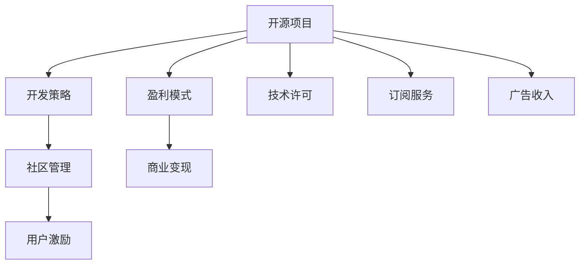

                 

# 程序员如何将开源项目转化为付费服务

> 关键词：开源项目,付费服务,商业模式,社区管理,开发策略,盈利模式,技术许可,订阅服务,开源社区,商业变现

## 1. 背景介绍

### 1.1 问题由来

在开源软件盛行的年代，程序员常常会遇到如何将自己的开源项目转化为盈利模式的问题。开源软件因其开放性、共享性和协作性，赢得了广大开发者的喜爱和信任。然而，很多开源项目之所以能够维持和更新，往往依赖于志愿者的贡献和资金支持。如何从开源项目中获得可持续的收入，使其能够持续发展和维持，成为许多开源项目管理者需要面对的挑战。

开源项目的转化不仅能够为开发者带来经济回报，还能够激励社区成员持续贡献，提升项目的活跃度和稳定性。因此，如何将开源项目成功转化为盈利模式，是许多开源项目和软件开发者的重要课题。

### 1.2 问题核心关键点

开源项目转化为盈利模式的核心关键点主要包括：

- **商业模式选择**：选择合适的盈利模式，如技术许可、订阅服务、广告收入等，以最大化收益。
- **社区管理**：维护社区健康、激励开发者贡献，提升项目知名度和活跃度。
- **开发策略**：制定科学的项目规划和开发计划，确保项目稳定更新和质量提升。
- **盈利模式设计**：设计合理的盈利机制，包括定价策略、付费用户管理等，满足用户需求并保证项目收益。

本文将详细阐述如何选择合适的商业模式，优化社区管理策略，制定有效的开发策略，设计可持续的盈利模式，并结合具体案例进行深入分析。

## 2. 核心概念与联系

### 2.1 核心概念概述

在探讨如何将开源项目转化为付费服务的过程中，需要理解以下几个核心概念：

- **开源项目**：一种由开发者贡献、公共共享的源代码项目。开源项目强调开放性和协作性，但不一定带有盈利目的。
- **盈利模式**：指企业或组织从其业务活动中获取收入的方式，包括广告收入、订阅服务、技术许可、付费下载等。
- **商业模式**：企业为了实现其价值主张和核心能力，所采用的盈利方式和价值交换策略。
- **社区管理**：管理开源项目社区的各项事务，包括社区规则制定、开发者激励、用户反馈处理等。
- **开发策略**：指导项目开发过程的策略和方法，包括版本控制、代码审查、迭代开发等。

这些概念之间的逻辑关系可以通过以下Mermaid流程图来展示：



这个流程图展示了一个开源项目转化为盈利模式的整体框架：

1. 开源项目通过科学的项目开发策略，保持代码质量和技术更新。
2. 根据项目特点和市场需求，选择合适的盈利模式，进行商业变现。
3. 通过有效的社区管理策略，激励开发者和用户贡献，提升项目的知名度和活跃度。
4. 设计合理的盈利机制，满足用户需求并保证项目收益。

## 3. 核心算法原理 & 具体操作步骤

### 3.1 算法原理概述

将开源项目转化为盈利模式的本质，是一种商业化的过程。其核心思想是：

1. **选择合适的盈利模式**：根据项目的特点、市场需求和开发者的资源情况，选择最合适的盈利模式。
2. **优化社区管理**：通过有效的社区管理策略，提升项目在开发者和用户中的知名度和活跃度。
3. **制定科学开发策略**：制定合理的项目开发计划，确保项目质量和更新频率，提升用户满意度。
4. **设计盈利机制**：设计合理的定价策略和付费模式，满足用户需求，实现项目收益。

### 3.2 算法步骤详解

#### 3.2.1 选择合适的盈利模式

选择合适的盈利模式是开源项目商业化的第一步。以下是几种常见的盈利模式及其特点：

1. **技术许可**：以许可费或一次性购买的方式，向企业或个人用户销售软件的使用权。适用于功能成熟、应用范围广的开源项目。

2. **订阅服务**：用户定期支付订阅费用，获取软件更新、技术支持和社区服务等。适用于需要持续迭代和更新、用户群体稳定的开源项目。

3. **广告收入**：在开源项目内或其周边平台展示广告，获取广告收入。适用于用户基础广泛的开源项目，如社区论坛、博客等。

4. **开源基金会**：通过基金会形式，接受企业和个人的捐款，用于项目维护和社区支持。适用于非营利性的开源项目，如Apache基金会等。

5. **商业合作**：与企业合作，共同开发和推广产品，实现双赢。适用于具有技术领先和市场潜力的开源项目。

选择盈利模式时，需要综合考虑项目的特点、市场需求、用户基础和团队资源等因素，制定切实可行的商业化策略。

#### 3.2.2 优化社区管理策略

社区管理是开源项目成功的关键。以下是一些优化社区管理策略的建议：

1. **制定社区规则**：明确社区行为规范，包括代码审查、代码贡献、用户反馈处理等。确保社区秩序井然，提升用户体验。

2. **激励开发者贡献**：通过提供资金、荣誉、培训等激励措施，鼓励开发者积极贡献代码和改进项目。

3. **处理用户反馈**：及时响应用户反馈，积极改进项目，提升用户满意度。

4. **举办社区活动**：定期举办线上线下活动，如技术分享会、编码马拉松等，增强社区凝聚力。

5. **宣传和推广**：通过社交媒体、技术博客等渠道，宣传和推广项目，提升知名度和用户基础。

#### 3.2.3 制定科学开发策略

科学的项目开发策略是开源项目成功的保障。以下是一些制定科学开发策略的建议：

1. **版本控制**：使用Git等版本控制工具，确保代码的历史版本管理和回溯。

2. **代码审查**：建立严格的代码审查机制，确保代码质量和一致性。

3. **迭代开发**：采用敏捷开发方法，如Scrum、Kanban等，提升开发效率和项目稳定性。

4. **文档和测试**：编写详细的技术文档和测试用例，确保项目可读性和可维护性。

5. **持续集成**：使用CI/CD工具，如Jenkins、GitLab CI等，自动化构建和测试，确保代码质量。

#### 3.2.4 设计盈利机制

设计合理的盈利机制是开源项目商业化的关键。以下是一些设计盈利机制的建议：

1. **定价策略**：根据项目特点和市场需求，制定合理的定价策略。可以采用一次性购买、订阅服务等形式。

2. **付费用户管理**：提供不同级别的订阅服务，满足不同用户的需求。同时，根据用户贡献度、活跃度等因素，提供特权和奖励。

3. **会员制**：提供会员制度，向高级会员提供更多特权和支持。

4. **灵活定价**：根据用户需求和使用量，灵活调整定价策略，实现精细化运营。

### 3.3 算法优缺点

开源项目转化为盈利模式的主要优点包括：

1. **社区贡献**：开源项目的社区贡献能够提升项目质量和用户满意度，吸引更多开发者和用户参与。

2. **可持续性**：开源项目的商业化能够实现项目的可持续发展，满足项目维护和社区运营的资金需求。

3. **市场认可**：开源项目的商业化能够提升项目在市场中的认可度和影响力。

4. **创新能力**：开源项目的商业化能够激发开发者的创新能力，推动技术进步。

5. **多渠道收入**：开源项目的商业化能够通过多种渠道获取收入，降低单一模式的财务风险。

然而，开源项目转化为盈利模式也存在一些缺点：

1. **市场风险**：市场需求变化、竞争加剧等因素可能导致项目商业化的失败。

2. **社区分裂**：商业化可能引起部分社区成员的不满和反对，导致社区分裂。

3. **资源投入**：商业化需要投入大量资源，如时间、资金、人力等，对开发者和团队提出了更高的要求。

4. **法律和道德问题**：开源项目的商业化需要考虑法律和道德问题，如版权、知识产权等。

5. **市场定位**：商业化需要准确的市场定位，避免项目定位不清、目标用户不明确等问题。

### 3.4 算法应用领域

开源项目转化为盈利模式的应用领域非常广泛，涵盖以下方面：

1. **商业软件**：如MySQL、Apache Kafka等，通过技术许可、订阅服务等形式，实现商业化运营。

2. **云计算平台**：如AWS、Azure等，通过广告收入、订阅服务等形式，实现盈利。

3. **开源基金会**：如Apache基金会、Linux基金会等，通过捐款、赞助等方式，实现项目维护和社区支持。

4. **开源社区项目**：如Kubernetes、Docker等，通过社区管理、商业合作等方式，提升项目影响力和商业价值。

5. **企业开源项目**：如Google的Open Source Projects，通过技术许可、商业合作等方式，实现项目商业化。

## 4. 数学模型和公式 & 详细讲解 & 举例说明

### 4.1 数学模型构建

将开源项目转化为盈利模式的数学模型可以简化为以下几个变量：

- **项目质量**：用代码行数、贡献者数、代码贡献量等指标衡量。
- **用户满意度**：通过用户反馈、社区活跃度等指标衡量。
- **市场需求**：通过市场调研、用户需求分析等指标衡量。
- **社区贡献**：通过开发者贡献度、社区参与度等指标衡量。
- **商业化收益**：通过销售收入、订阅费、广告收入等指标衡量。

构建数学模型时，可以引入以下公式：

1. **需求函数**：
$$
D(Q) = a + bQ
$$
其中，$D(Q)$ 为市场需求，$Q$ 为项目质量，$a$、$b$ 为模型参数。

2. **用户满意度函数**：
$$
S(Q) = c + dQ
$$
其中，$S(Q)$ 为用户满意度，$Q$ 为项目质量，$c$、$d$ 为模型参数。

3. **社区贡献函数**：
$$
C(Q) = e + fQ
$$
其中，$C(Q)$ 为社区贡献，$Q$ 为项目质量，$e$、$f$ 为模型参数。

4. **商业化收益函数**：
$$
R(Q) = hQ + i
$$
其中，$R(Q)$ 为商业化收益，$Q$ 为项目质量，$h$、$i$ 为模型参数。

### 4.2 公式推导过程

根据上述变量和函数，推导最优化的目标函数为：

$$
\max_{Q} R(Q) = \max_{Q} (hQ + i)
$$

在优化过程中，需要平衡以下变量：

- **项目质量**：通过代码质量、开发者贡献度等指标衡量。
- **市场需求**：通过市场调研、用户需求分析等指标衡量。
- **用户满意度**：通过用户反馈、社区活跃度等指标衡量。
- **社区贡献**：通过开发者贡献度、社区参与度等指标衡量。

### 4.3 案例分析与讲解

以下以MySQL数据库为例，探讨如何将其转化为盈利模式：

1. **选择盈利模式**：MySQL采用技术许可模式，向企业提供商业版和技术支持。

2. **优化社区管理**：MySQL通过邮件列表、社区论坛等方式，管理开发者和用户贡献，激励开发者积极贡献代码和改进项目。

3. **制定开发策略**：MySQL采用敏捷开发方法，快速迭代和更新，确保项目稳定性和用户体验。

4. **设计盈利机制**：MySQL提供不同级别的订阅服务，满足不同用户的需求，同时通过付费用户管理，提供更多特权和支持。

MySQL的成功商业化，主要得益于其卓越的项目质量、稳定的用户满意度、广泛的市场需求和有效的社区管理策略。通过合理的盈利模式和商业化策略，MySQL实现了从开源项目到商业成功的华丽转身。

## 5. 项目实践：代码实例和详细解释说明

### 5.1 开发环境搭建

在进行开源项目商业化的开发实践前，我们需要准备好开发环境。以下是使用Python进行Flask框架开发的环境配置流程：

1. 安装Anaconda：从官网下载并安装Anaconda，用于创建独立的Python环境。

2. 创建并激活虚拟环境：
```bash
conda create -n flask-env python=3.8 
conda activate flask-env
```

3. 安装Flask：从官网获取Flask的最新版本，进行安装。
```bash
pip install Flask
```

4. 安装所需依赖包：
```bash
pip install gunicorn psycopg2 flask-sqlalchemy flask-migrate flask-restful
```

完成上述步骤后，即可在`flask-env`环境中开始开发实践。

### 5.2 源代码详细实现

下面我们以Flask框架为例，给出一个简单的开源项目转化示例。

首先，定义Flask应用程序：

```python
from flask import Flask, request, jsonify

app = Flask(__name__)

@app.route('/hello', methods=['GET'])
def hello():
    name = request.args.get('name')
    return jsonify({'message': f'Hello, {name}!'})

if __name__ == '__main__':
    app.run(debug=True)
```

然后，定义数据库连接和迁移：

```python
from flask_sqlalchemy import SQLAlchemy
from flask_migrate import Migrate

app.config['SQLALCHEMY_DATABASE_URI'] = 'sqlite:///mydatabase.db'
db = SQLAlchemy(app)
migrate = Migrate(app, db)

class User(db.Model):
    id = db.Column(db.Integer, primary_key=True)
    name = db.Column(db.String(50), nullable=False)
```

最后，启动Flask应用：

```python
if __name__ == '__main__':
    app.run(debug=True)
```

### 5.3 代码解读与分析

让我们再详细解读一下关键代码的实现细节：

**Flask应用程序**：
- `hello`函数：处理`/hello`路径的GET请求，获取查询参数`name`，返回JSON格式的问候消息。

**数据库连接和迁移**：
- `User`类：定义用户数据模型，包含`id`和`name`字段。
- `app.config`：配置Flask应用程序的数据库连接信息。
- `db`和`migrate`：通过SQLAlchemy和Flask Migrate，实现数据库的迁移和模型管理。

**Flask应用启动**：
- `app.run(debug=True)`：启动Flask应用，开启调试模式。

以上代码示例展示了如何将一个简单的开源项目转化为Flask应用，并通过Flask框架实现用户查询和数据存储功能。在实际开发中，开发者可以根据项目需求，进一步扩展功能、优化性能、改进用户体验。

## 6. 实际应用场景

### 6.1 智能客服系统

开源智能客服系统可以通过技术许可、订阅服务等模式进行商业化。智能客服系统能够7x24小时不间断服务，快速响应客户咨询，用自然流畅的语言解答各类常见问题。

在技术实现上，可以收集企业内部的历史客服对话记录，将问题和最佳答复构建成监督数据，在此基础上对开源智能客服系统进行商业化微调。微调后的智能客服系统能够自动理解用户意图，匹配最合适的答案模板进行回复。对于客户提出的新问题，还可以接入检索系统实时搜索相关内容，动态组织生成回答。

### 6.2 金融舆情监测

开源金融舆情监测系统可以通过订阅服务模式进行商业化。金融机构需要实时监测市场舆论动向，以便及时应对负面信息传播，规避金融风险。

具体而言，可以收集金融领域相关的新闻、报道、评论等文本数据，并对其进行主题标注和情感标注。在此基础上对开源舆情监测系统进行商业化微调，使其能够自动判断文本属于何种主题，情感倾向是正面、中性还是负面。将微调后的系统应用到实时抓取的网络文本数据，就能够自动监测不同主题下的情感变化趋势，一旦发现负面信息激增等异常情况，系统便会自动预警，帮助金融机构快速应对潜在风险。

### 6.3 个性化推荐系统

开源个性化推荐系统可以通过订阅服务模式进行商业化。推荐系统能够通过用户浏览、点击、评论、分享等行为数据，提取和用户交互的物品标题、描述、标签等文本内容。将文本内容作为模型输入，用户的后续行为（如是否点击、购买等）作为监督信号，在此基础上对开源推荐系统进行商业化微调。微调后的推荐系统能够从文本内容中准确把握用户的兴趣点，推荐更精准、多样的产品。

### 6.4 未来应用展望

随着开源项目的持续发展和商业化成功案例的不断涌现，开源项目转化为盈利模式的前景将更加广阔。

在智慧医疗领域，开源医疗问答、病历分析、药物研发等应用将提升医疗服务的智能化水平，辅助医生诊疗，加速新药开发进程。

在智能教育领域，开源教育推荐、智能辅导、知识库管理等应用将因材施教，促进教育公平，提高教学质量。

在智慧城市治理中，开源城市事件监测、舆情分析、应急指挥等应用将提高城市管理的自动化和智能化水平，构建更安全、高效的未来城市。

此外，在企业生产、社会治理、文娱传媒等众多领域，开源应用也将不断涌现，为传统行业数字化转型升级提供新的技术路径。

## 7. 工具和资源推荐

### 7.1 学习资源推荐

为了帮助开发者系统掌握开源项目转化为盈利模式的方法，这里推荐一些优质的学习资源：

1. **开源项目商业化指南**：一本系统介绍开源项目商业化策略的书籍，涵盖项目质量提升、市场需求分析、盈利模式选择等多个方面。

2. **GitHub开源社区**：全球最大的开源社区，提供丰富的开源项目案例和开发经验。

3. **Flask官方文档**：Flask框架的官方文档，详细介绍了Flask的开发实践和商业化策略。

4. **Flask扩展库**：Flask框架的各种扩展库和插件，提供了丰富的功能和工具，支持开发者进行商业化实践。

5. **开源项目商业化案例**：开源项目商业化的成功案例集，展示了多种盈利模式和商业化策略，具有很高的参考价值。

通过对这些资源的学习实践，相信你一定能够快速掌握开源项目转化为盈利模式的核心技巧，并将其成功应用于实际项目中。

### 7.2 开发工具推荐

高效的开发离不开优秀的工具支持。以下是几款用于开源项目商业化开发的常用工具：

1. **Git**：全球最流行的版本控制工具，支持快速迭代和代码版本管理。

2. **Flask**：轻量级的Web开发框架，支持快速开发和部署。

3. **SQLAlchemy**：Python的ORM工具，支持数据库连接和模型管理。

4. **Flask SQLAlchemy**：Flask框架与SQLAlchemy的集成，提供便捷的数据库操作接口。

5. **Flask Migrate**：Flask框架的数据库迁移工具，支持数据库版本管理和模型迁移。

6. **Flask Migrate**：Flask框架的数据库迁移工具，支持数据库版本管理和模型迁移。

7. **Flask-RESTful**：Flask框架的RESTful接口实现工具，支持快速构建API服务。

8. **Gunicorn**：Python Web应用服务器，支持高性能的异步处理和负载均衡。

9. **Apache Kafka**：分布式消息队列，支持高吞吐量的数据流处理。

合理利用这些工具，可以显著提升开源项目商业化的开发效率，加快创新迭代的步伐。

### 7.3 相关论文推荐

开源项目转化为盈利模式的研究源于学界的持续研究。以下是几篇奠基性的相关论文，推荐阅读：

1. **《开源软件商业化》**：系统介绍开源软件商业化的基本原理和策略。

2. **《开源社区商业化》**：探讨开源社区商业化的多种策略和成功案例。

3. **《开源项目盈利模式分析》**：通过实证研究，分析不同盈利模式的优劣。

4. **《开源项目商业化风险评估》**：评估开源项目商业化过程中可能面临的风险和挑战。

5. **《开源项目社区管理》**：介绍开源项目社区管理的最佳实践和成功经验。

这些论文代表了大语言模型微调技术的发展脉络。通过学习这些前沿成果，可以帮助研究者把握学科前进方向，激发更多的创新灵感。

## 8. 总结：未来发展趋势与挑战

### 8.1 总结

本文对如何将开源项目转化为盈利模式进行了全面系统的介绍。首先阐述了开源项目转化为盈利模式的背景和意义，明确了商业化策略的选择、社区管理、开发策略和盈利机制的优化方向。其次，从原理到实践，详细讲解了开源项目商业化的核心算法和操作步骤，给出了商业化开发的完整代码实例。同时，本文还广泛探讨了开源项目商业化的实际应用场景，展示了商业化范式的广泛应用前景。此外，本文精选了商业化相关的学习资源，力求为读者提供全方位的技术指引。

通过本文的系统梳理，可以看到，开源项目的商业化转化不仅能带来经济效益，还能提升项目的知名度和影响力，吸引更多的开发者和用户参与。未来，随着开源项目的持续发展和商业化成功案例的不断涌现，开源项目将更加广泛地应用于各个行业领域，推动技术的进步和产业的发展。

### 8.2 未来发展趋势

开源项目转化为盈利模式的发展趋势主要体现在以下几个方面：

1. **开放性与商业化相结合**：开源项目逐渐从单一的开源模式，向开放性与商业化相结合的模式转变，实现多方共赢。

2. **生态系统建设**：开源项目生态系统建设逐渐成熟，包括社区管理、开发者激励、用户反馈处理等多个方面。

3. **多渠道盈利**：开源项目盈利渠道逐渐多样化，包括技术许可、订阅服务、广告收入、赞助等多种方式。

4. **国际化和本地化**：开源项目逐渐实现国际化和本地化，提升在全球范围内的影响力和竞争力。

5. **技术创新**：开源项目通过商业化获得更多的资金支持，推动技术创新和产品迭代。

6. **社会责任**：开源项目商业化过程中，逐渐重视社会责任和环境保护，实现商业价值与社会价值的统一。

### 8.3 面临的挑战

尽管开源项目商业化转化取得了一定成就，但在迈向更加智能化、普适化应用的过程中，仍面临诸多挑战：

1. **市场竞争激烈**：开源项目面临的市场竞争日趋激烈，如何保持项目的竞争力和市场份额是重要课题。

2. **用户需求多样**：开源项目需兼顾多种用户需求，设计合理的盈利模式和定价策略，以满足不同用户的需求。

3. **开发者贡献不足**：开源项目需有效激励开发者贡献代码，提升项目的质量和活跃度。

4. **知识产权保护**：开源项目需关注知识产权保护问题，避免侵权和盗版行为。

5. **法律合规风险**：开源项目需遵守相关法律法规，避免法律风险和合规问题。

### 8.4 研究展望

面对开源项目商业化转化所面临的挑战，未来的研究需要在以下几个方面寻求新的突破：

1. **开源与商业平衡**：寻找开源与商业之间的平衡点，既能实现商业化收益，又能保持开源的开放性和协作性。

2. **社区管理优化**：探索更加高效和灵活的社区管理策略，提升社区凝聚力和用户满意度。

3. **用户需求研究**：深入研究用户需求和市场变化，设计更加多样化和灵活的盈利模式和定价策略。

4. **开发者激励机制**：设计合理的开发者激励机制，提升开发者的贡献度和项目活跃度。

5. **法律合规保障**：建立完善的法律合规保障机制，确保开源项目商业化过程的合法合规。

6. **开源社区生态**：构建更加完善和成熟开源社区生态，实现社区成员之间的互利共赢。

这些研究方向的探索，必将引领开源项目商业化转化的新方向，推动开源项目向更高的台阶发展。面向未来，开源项目需要不断优化商业化策略，提升项目影响力和竞争力，才能在激烈的市场竞争中占据一席之地。

## 9. 附录：常见问题与解答

**Q1：开源项目如何选择合适的盈利模式？**

A: 选择合适的盈利模式需要综合考虑项目特点、市场需求、用户基础和团队资源等因素。例如，功能成熟、应用范围广的开源项目可以采用技术许可模式，而需要持续迭代和更新的开源项目可以采用订阅服务模式。

**Q2：如何激励开发者积极贡献代码？**

A: 可以通过提供资金、荣誉、培训等激励措施，鼓励开发者积极贡献代码和改进项目。建立社区规则和代码审查机制，确保贡献代码的质量和一致性。

**Q3：开源项目商业化过程中需要注意哪些问题？**

A: 开源项目商业化过程中需要注意以下几个问题：市场风险、社区分裂、资源投入、法律和道德问题、市场定位等。需要制定合理的项目规划和开发策略，设计灵活的盈利机制，确保商业化的成功。

**Q4：开源项目如何设计合理的定价策略？**

A: 根据用户需求和使用量，设计灵活的定价策略，满足不同用户的需求。可以采用一次性购买、订阅服务等形式，确保项目的收益。

**Q5：如何设计开源项目的社区管理策略？**

A: 制定社区规则，明确社区行为规范，包括代码审查、代码贡献、用户反馈处理等。通过激励措施和社区活动，提升社区成员的贡献度和活跃度。

通过这些问题的详细解答，可以帮助开源项目管理者更好地理解商业化的核心要点，顺利将开源项目转化为盈利模式，实现项目的可持续发展。

