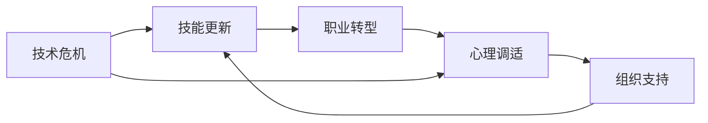

                 

## 1. 背景介绍

在当今快速发展的IT行业，技术更新换代日新月异，职业竞争日趋激烈。对于许多程序员来说，在职业生涯的中年时期，可能会遇到所谓的“中年危机”。这种危机表现为技术能力与行业需求的脱节、职业发展瓶颈、技能更新停滞等问题。本文将从技术、心理、组织文化等多个维度，探讨如何应对这些挑战，实现职业生涯的突破与再生长。

## 2. 核心概念与联系

### 2.1 核心概念概述

- **技术危机**：指程序员在工作中发现自身技术水平和行业需求脱节，难以胜任新项目或技术栈，导致职业发展停滞或瓶颈。
- **技能更新**：指通过不断学习新技术、新知识，提升自身技术能力，适应行业变化的过程。
- **职业转型**：指基于当前技能和经验，向新的技术领域、行业或职位进行转移。
- **心理调适**：指通过心理调节和自我激励，克服职业压力和焦虑，保持积极心态。
- **组织支持**：指企业或组织提供培训、学习机会、职业发展规划等支持，帮助员工解决职业瓶颈。

这些概念通过如下Mermaid流程图展示它们之间的联系：



### 2.2 核心概念原理和架构

核心概念的原理和架构可以从多个维度进行分析：

- **技术危机**：技术的快速迭代要求程序员不断学习新的框架、库、工具。然而，传统的“边学边用”模式在时间有限的情况下难以完全掌握新知识，导致与行业需求脱节。

- **技能更新**：技能更新涉及自我驱动学习、线上线下课程、行业会议、技术社区等。这个过程需要时间和精力的投入，以及合理的学习路径和策略。

- **职业转型**：职业转型需要明确转型目标、评估当前技能与目标职位的要求、制定学习路径和技能提升计划。转型过程中可能涉及跨领域知识学习、新领域经验积累、职业人脉拓展等。

- **心理调适**：心理调适涉及压力管理、情绪调节、自我激励等。心理调适不仅影响职业发展，还关系到个人生活质量和幸福感。

- **组织支持**：组织支持包括职业发展规划、培训机会、知识分享平台、导师制等。这些支持有助于员工提升技能、拓展视野、应对职业挑战。

## 3. 核心算法原理 & 具体操作步骤

### 3.1 算法原理概述

应对中年危机的核心算法原理基于持续学习和自我优化。其核心思想是通过不断学习和技能提升，适应行业变化和技术更新，保持职业生涯的持续发展。具体步骤如下：

1. **需求分析**：分析当前技术栈与行业需求，确定自身技术能力与行业要求之间的差距。
2. **技能规划**：根据差距制定详细的技能提升计划，明确学习目标和路径。
3. **知识获取**：通过线上课程、技术书籍、行业会议、技术社区等途径获取新知识。
4. **实践应用**：将新知识应用到实际项目中，通过实践加深理解。
5. **反馈评估**：定期评估技能提升的效果，调整学习计划。
6. **职业规划**：根据自身技能和职业目标，制定职业发展计划，进行职业转型。

### 3.2 算法步骤详解

#### 3.2.1 需求分析

需求分析是技能更新的第一步，需要深入理解当前技术栈和行业需求。

- **自我评估**：通过技术自测、项目复盘、同行对比等方式，评估自身技术水平。
- **市场调研**：关注行业动态、技术趋势、招聘要求等，了解市场对技术的需求。
- **差距分析**：识别自身技术与市场需求之间的差距，明确学习目标和优先级。

#### 3.2.2 技能规划

技能规划需要根据需求分析的结果，制定详细的技能提升计划。

- **学习目标**：设定明确的学习目标和里程碑，如掌握新技术、完成项目实践等。
- **学习路径**：根据学习目标，规划学习路径，包括线上课程、书籍、实践项目等。
- **时间管理**：制定学习时间表，平衡工作与学习，保证持续学习。

#### 3.2.3 知识获取

知识获取是技能提升的关键环节，需要利用多种资源获取新知识。

- **线上课程**：如Coursera、edX、Udemy等平台上的计算机科学课程。
- **技术书籍**：如《Clean Code》、《Effective Java》等经典技术书籍。
- **行业会议**：如Google I/O、Apple WWDC、技术博客、技术社区等。
- **实践项目**：通过开源项目、公司项目、技术竞赛等积累实践经验。

#### 3.2.4 实践应用

实践应用是将新知识应用到实际项目中，加深理解和掌握的过程。

- **开源项目**：参与开源项目，学习最佳实践，提升代码质量。
- **公司项目**：在公司项目中应用新技术，解决实际问题，积累经验。
- **技术竞赛**：参加编程比赛、Hackathon等，锻炼解决问题的能力。

#### 3.2.5 反馈评估

反馈评估是技能提升的重要环节，需要定期评估学习效果，调整学习计划。

- **自我评估**：定期进行自我测试、代码审查、项目复盘，评估学习效果。
- **同行反馈**：通过代码审查、技术交流等方式，获取同行反馈。
- **调整计划**：根据评估结果，调整学习计划，优化学习路径。

#### 3.2.6 职业规划

职业规划是实现职业生涯发展的关键步骤，需要明确职业目标和路径。

- **职业目标**：明确短期和长期职业目标，如晋升、转型、创业等。
- **技能要求**：评估目标职位所需的技能和经验，制定提升计划。
- **职业路径**：根据目标职位，规划职业路径，包括跨领域学习、行业拓展、技能认证等。

### 3.3 算法优缺点

#### 3.3.1 优点

- **灵活性高**：技能更新和职业转型可以根据个人兴趣和市场需求灵活调整。
- **适应性强**：持续学习能够应对技术更新和行业变化，保持职业竞争力。
- **多样化学习**：通过多种途径获取新知识，提升学习效果。
- **组织支持**：通过企业培训、知识分享平台等，获取更多学习资源。

#### 3.3.2 缺点

- **时间投入大**：技能更新需要大量时间和精力，可能影响工作和生活。
- **心理压力**：学习新知识、面对技术挑战可能会带来心理压力。
- **资金投入**：参加培训、获取新工具可能涉及一定资金投入。
- **风险不确定**：技能提升和职业转型存在不确定性，可能面临失败风险。

### 3.4 算法应用领域

基于持续学习和自我优化的算法，可以应用于以下领域：

- **技术转型**：如从Web开发转向人工智能、大数据等方向。
- **职业晋升**：如从初级开发工程师晋升为高级架构师、技术主管等。
- **创业孵化**：如基于现有技能，开发新项目或创业公司。
- **学术研究**：如通过持续学习，提升研究能力和成果产出。

## 4. 数学模型和公式 & 详细讲解

### 4.1 数学模型构建

本节将通过数学语言，对持续学习和自我优化的过程进行严格刻画。

设 $C$ 为当前技术能力，$D$ 为需求能力，$S$ 为技能提升后的能力，$T$ 为职业转型后的能力。构建如下数学模型：

$$
S = C + \Delta C
$$

其中 $\Delta C$ 表示技能提升量，需要通过学习目标、时间、学习效果等综合计算。

### 4.2 公式推导过程

根据上述模型，推导技能提升的数学公式：

$$
\Delta C = \sum_{i=1}^{n} \lambda_i C_i
$$

其中 $C_i$ 为第 $i$ 项学习目标对应的技能提升量，$\lambda_i$ 为第 $i$ 项学习目标的权重，$n$ 为学习目标总数。

### 4.3 案例分析与讲解

假设某程序员当前技术能力为 $C = 70$，需求能力为 $D = 85$，需提升技能 $20$ 个百分点。选择四项学习目标，其对应的提升量分别为 $C_{1-4} = [10, 5, 5, 0]$，权重分别为 $\lambda_{1-4} = [0.3, 0.2, 0.2, 0.3]$。

通过计算，可得：

$$
\Delta C = 0.3 \times 10 + 0.2 \times 5 + 0.2 \times 5 + 0.3 \times 0 = 6
$$

因此，技能提升后的能力为：

$$
S = 70 + 6 = 76
$$

## 5. 项目实践：代码实例和详细解释说明

### 5.1 开发环境搭建

为便于项目实践，本文提供以下开发环境搭建的详细步骤：

1. **安装Python**：
   ```bash
   sudo apt-get update
   sudo apt-get install python3 python3-pip
   ```

2. **安装Pip包管理器**：
   ```bash
   pip install pipenv
   ```

3. **创建虚拟环境**：
   ```bash
   pipenv install virtualenv
   virtualenv env
   source env/bin/activate
   ```

4. **安装依赖库**：
   ```bash
   pip install requests beautifulsoup4 tensorflow
   ```

### 5.2 源代码详细实现

本文以使用TensorFlow进行深度学习项目为例，提供代码实现：

```python
# 导入依赖库
import requests
from bs4 import BeautifulSoup
import tensorflow as tf

# 获取网页数据
response = requests.get('https://www.example.com')
html = response.text

# 解析网页内容
soup = BeautifulSoup(html, 'html.parser')
title = soup.title.string
paragraphs = soup.find_all('p')

# 构建神经网络模型
model = tf.keras.Sequential([
    tf.keras.layers.Dense(64, activation='relu', input_shape=(None,)),
    tf.keras.layers.Dense(10, activation='softmax')
])

# 编译模型
model.compile(optimizer='adam', loss='sparse_categorical_crossentropy', metrics=['accuracy'])

# 训练模型
model.fit(X_train, y_train, epochs=10, batch_size=32)

# 预测新数据
predictions = model.predict(X_test)
```

### 5.3 代码解读与分析

**代码分析**：
- 导入请求库、BeautifulSoup库和TensorFlow库，用于获取网页数据、解析HTML和构建深度学习模型。
- 使用requests库获取网页内容，通过BeautifulSoup库解析HTML，提取网页标题和段落。
- 使用TensorFlow库构建神经网络模型，包含两个全连接层。
- 编译模型，指定优化器、损失函数和评估指标。
- 使用fit方法训练模型，指定训练数据、批次大小和迭代次数。
- 使用predict方法预测新数据。

**运行结果展示**：
- 在训练过程中，模型会不断调整权重，逐步降低损失函数，提升准确率。
- 在预测过程中，模型会根据训练得到的权重，对新数据进行分类预测。

## 6. 实际应用场景

### 6.1 技术转型

某资深Web开发工程师面临技术转型，希望转行到人工智能领域。他可以通过以下步骤进行技能更新和职业转型：

- **需求分析**：分析当前Web开发技能与人工智能需求之间的差距。
- **技能规划**：选择Python、TensorFlow、深度学习等学习目标。
- **知识获取**：通过在线课程、书籍、项目实践等途径获取新知识。
- **实践应用**：参与开源项目、参加Kaggle竞赛等积累经验。
- **反馈评估**：定期自我测试、获取同行反馈，调整学习计划。
- **职业规划**：申请相关职位，提升实战能力，完成职业转型。

### 6.2 职业晋升

某初级开发工程师希望晋升为高级架构师。他可以通过以下步骤提升技能和职业发展：

- **需求分析**：分析当前开发技能与高级架构师所需技能之间的差距。
- **技能规划**：选择系统设计、性能优化、架构设计等学习目标。
- **知识获取**：通过在线课程、技术博客、行业会议等途径获取新知识。
- **实践应用**：在公司项目中应用新技能，解决实际问题。
- **反馈评估**：定期进行自我评估，获取同事反馈，调整学习计划。
- **职业规划**：申请高级架构师职位，提升实战能力，实现职业晋升。

### 6.3 创业孵化

某资深程序员希望基于现有技能，开发新项目或创业公司。他可以通过以下步骤进行技能更新和创业孵化：

- **需求分析**：分析市场需求和用户需求，明确创业方向。
- **技能规划**：选择市场需求所需的技术栈和技能。
- **知识获取**：通过在线课程、技术社区、技术交流等方式获取新知识。
- **实践应用**：开发项目原型，测试市场反应，调整产品设计。
- **反馈评估**：获取用户反馈，调整产品功能和市场策略。
- **职业规划**：制定创业计划，组建团队，完成公司注册和运营。

## 7. 工具和资源推荐

### 7.1 学习资源推荐

为了帮助程序员系统掌握技能更新和职业转型的理论基础和实践技巧，以下是一些优质的学习资源：

1. **Coursera**：提供计算机科学、人工智能、数据科学等领域的课程，涵盖多种编程语言和技术栈。
2. **edX**：提供由全球顶尖大学和机构开设的在线课程，涵盖深度学习、机器学习、系统架构等。
3. **Udacity**：提供实战导向的纳米学位项目，包括人工智能、自动驾驶、区块链等方向。
4. **LeetCode**：提供算法和数据结构练习，帮助程序员提升编程能力和解决问题的能力。
5. **Kaggle**：提供数据科学和机器学习竞赛，积累实战经验和项目经验。

### 7.2 开发工具推荐

为便于程序员进行技能更新和职业转型，以下是一些常用的开发工具：

1. **Visual Studio Code**：轻量级的代码编辑器，支持多种编程语言和插件。
2. **GitHub**：代码托管平台，支持版本控制、代码审查、项目管理等功能。
3. **Docker**：容器化技术，支持代码打包、部署、迁移等。
4. **JIRA**：项目管理工具，支持任务分配、进度跟踪、故障排查等功能。
5. **Slack**：团队协作工具，支持即时通讯、文件共享、任务管理等功能。

### 7.3 相关论文推荐

大语言模型微调技术的发展源于学界的持续研究。以下是几篇奠基性的相关论文，推荐阅读：

1. **Attention is All You Need**：提出了Transformer结构，开启了NLP领域的预训练大模型时代。
2. **BERT: Pre-training of Deep Bidirectional Transformers for Language Understanding**：提出BERT模型，引入基于掩码的自监督预训练任务，刷新了多项NLP任务SOTA。
3. **Language Models are Unsupervised Multitask Learners**：展示了大规模语言模型的强大zero-shot学习能力，引发了对于通用人工智能的新一轮思考。
4. **Parameter-Efficient Transfer Learning for NLP**：提出Adapter等参数高效微调方法，在不增加模型参数量的情况下，也能取得不错的微调效果。
5. **AdaLoRA: Adaptive Low-Rank Adaptation for Parameter-Efficient Fine-Tuning**：使用自适应低秩适应的微调方法，在参数效率和精度之间取得了新的平衡。

这些论文代表了大语言模型微调技术的发展脉络。通过学习这些前沿成果，可以帮助研究者把握学科前进方向，激发更多的创新灵感。

## 8. 总结：未来发展趋势与挑战

### 8.1 研究成果总结

本文系统探讨了程序员如何应对中年危机与职业瓶颈，从技术、心理、组织文化等多个维度提供了解决方案。通过需求分析、技能规划、知识获取、实践应用、反馈评估和职业规划等步骤，帮助程序员实现技能更新和职业转型。

### 8.2 未来发展趋势

展望未来，技能更新和职业转型将呈现以下几个发展趋势：

1. **终身学习**：随着技术迭代加速，终身学习成为必要。程序员需要不断学习新知识，保持技术领先。
2. **跨领域融合**：不同领域的技术将更加融合，程序员需要具备跨领域技能，提升综合能力。
3. **自动化与智能**：自动化工具和智能辅助将更加普及，帮助程序员提升效率。
4. **个性化发展**：基于AI的个性化学习平台将更加智能，帮助程序员制定个性化的学习路径。
5. **远程协作**：远程工作模式将更加普及，远程协作工具和技术将更加完善。

### 8.3 面临的挑战

尽管技能更新和职业转型方法已经取得一定成效，但在迈向更加智能化、普适化应用的过程中，仍面临诸多挑战：

1. **时间管理**：如何在繁忙的工作中安排学习时间，是一个难题。
2. **心理压力**：面对技术更新和职业转型，可能会带来心理压力和焦虑。
3. **资金投入**：参加培训、获取新工具可能涉及一定资金投入。
4. **市场变化**：技术市场变化快，需要不断调整学习计划。
5. **职业规划**：制定职业规划时，需要全面考虑自身情况和市场需求。

### 8.4 研究展望

面对技能更新和职业转型所面临的种种挑战，未来的研究需要在以下几个方面寻求新的突破：

1. **时间管理优化**：开发智能时间管理工具，帮助程序员优化学习时间安排。
2. **心理支持**：提供心理辅导和支持，帮助程序员应对职业转型压力。
3. **经济支持**：提供经济补贴和激励机制，降低学习成本。
4. **市场预测**：开发市场预测工具，帮助程序员根据市场需求调整学习计划。
5. **职业规划指导**：提供职业规划指导，帮助程序员制定科学、可行的职业发展路径。

## 9. 附录：常见问题与解答

### Q1: 如何平衡工作与学习？

A: 建议采用时间切片法，将一天分成多个时间块，每个时间块专注一个任务。例如，早晨专注于学习新知识，下午专注于工作项目，晚上进行代码练习和项目实践。同时，利用碎片时间进行学习，如通勤、午休等。

### Q2: 学习过程中遇到瓶颈怎么办？

A: 遇到瓶颈时，可以尝试以下方法：
1. **更换学习资源**：尝试不同平台、不同课程，找到适合自己的学习方式。
2. **寻求帮助**：加入技术社区、学习小组，与同行交流和探讨。
3. **重新审视学习计划**：回顾学习目标和路径，调整计划，优化策略。

### Q3: 如何进行职业规划？

A: 职业规划需要考虑以下因素：
1. **自我评估**：评估自身技能、兴趣、价值观等，明确职业目标。
2. **市场需求**：了解市场需求、行业趋势、职业发展前景。
3. **技能差距**：分析目标职位所需的技能和经验，制定提升计划。
4. **时间安排**：制定详细的学习计划和时间表，平衡工作与学习。
5. **反馈调整**：定期评估学习效果，调整学习计划，优化学习路径。

### Q4: 如何提升团队协作能力？

A: 提升团队协作能力，可以采取以下措施：
1. **团队建设**：通过团队活动、培训、团建等，增强团队凝聚力和信任度。
2. **明确职责**：明确团队成员的职责和任务，避免职责交叉和重复。
3. **沟通协调**：建立有效的沟通机制，定期召开会议、使用协作工具，确保信息畅通。
4. **技能共享**：通过知识分享、技术培训、代码评审等方式，提升团队整体技术水平。
5. **项目管理**：采用项目管理工具，如JIRA、Trello等，跟踪任务进度，协调团队工作。

### Q5: 如何应对技术市场的变化？

A: 应对技术市场变化，可以采取以下措施：
1. **持续关注行业动态**：通过技术博客、行业报告、技术会议等方式，了解市场变化和技术趋势。
2. **灵活调整学习计划**：根据市场变化，调整学习目标和路径，灵活应对市场需求。
3. **跨领域学习**：学习与当前领域相关的技术，增强自身的综合能力。
4. **参与开源项目**：通过参与开源项目，了解最新技术和市场需求，积累实践经验。
5. **职业规划**：根据市场变化，调整职业规划，保持职业竞争力。

总之，技能更新和职业转型需要程序员具备自我驱动学习能力、时间管理能力、心理调节能力等多方面素质。通过系统的学习和实践，相信每一位程序员都能在职业生涯中不断突破自我，实现更高的职业发展。

---

作者：禅与计算机程序设计艺术 / Zen and the Art of Computer Programming

