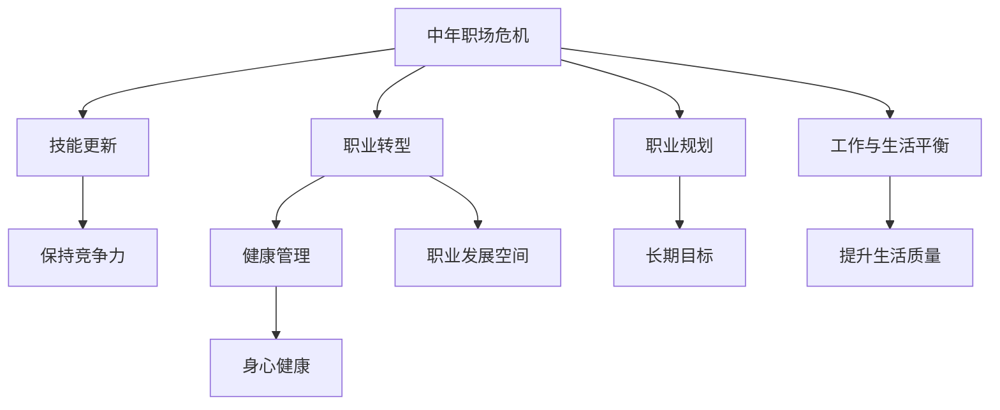

                 

# 程序员如何应对中年职场危机

> 关键词：中年职场危机,程序员发展,技能转型,终身学习,职业规划,工作与生活平衡

## 1. 背景介绍

### 1.1 问题由来
随着技术发展日新月异，中年程序员面临的职业危机愈发明显。不仅技术迭代速度快、行业竞争激烈，而且中年人还要承担家庭责任，职场压力巨大。这些因素导致很多中年程序员陷入焦虑、迷茫、自我怀疑的情绪中。

如何在职场上保持竞争力，实现从技术型到管理型、战略型等多角色的转变，是中老年程序员亟需解决的问题。本文将通过深入剖析中年职场危机的原因，提出具体的应对策略，为中年程序员的职业发展提供指导。

### 1.2 问题核心关键点
中年职场危机的核心关键点包括：

- **技能更新**：技术快速迭代，需要不断学习新知识才能保持竞争力。
- **职业转型**：如何从技术岗转到管理岗、战略岗等，实现职业生涯的跨越。
- **健康管理**：职场高压与家庭责任的双重压力，如何保持身心健康。
- **职业规划**：如何制定长远的职业目标，避免盲目跟风或随波逐流。
- **工作与生活平衡**：如何在高压职场与和谐家庭之间找到平衡点，提升生活质量。

## 2. 核心概念与联系

### 2.1 核心概念概述

为更好地理解中年程序员如何应对职场危机，本节将介绍几个密切相关的核心概念：

- **中年职场危机**：指中年程序员在职业生涯中面临的失业风险、技能过时、职业转型、职业倦怠等问题的总称。
- **技能更新**：指在职业生涯中不断学习新技术，提升自身技能水平的过程。
- **职业转型**：指在职业生涯中从技术岗位转向管理、战略、产品等非技术岗位的过程。
- **健康管理**：指在职场与家庭之间找到平衡，保持身心健康的管理方式。
- **职业规划**：指根据个人兴趣、能力和行业趋势，制定长期职业发展目标和路径的规划。
- **工作与生活平衡**：指在职场高强度工作与家庭和谐生活之间寻求平衡，提升生活质量。

这些概念之间的逻辑关系可以通过以下Mermaid流程图来展示：



这个流程图展示了一系列概念之间的联系：

1. 中年职场危机引出了多个应对策略，包括技能更新、职业转型等。
2. 这些策略有助于保持竞争力、职业发展，维护身心健康，制定长期目标，提升生活质量。

## 3. 核心算法原理 & 具体操作步骤
### 3.1 算法原理概述

应对中年职场危机的核心思想是通过持续学习、职业转型、健康管理、职业规划和工作与生活平衡等多方面的综合提升，实现个人职业的可持续发展。这一过程类似于多目标优化问题，目标包括：

- 保持技能竞争力
- 顺利实现职业转型
- 维护身心健康
- 制定长期职业规划
- 实现工作与生活的平衡

具体算法步骤如下：

### 3.2 算法步骤详解

**Step 1: 评估现状与明确目标**
- **自我评估**：分析自身技术栈、项目经验、职业成就等，明确现有优势和不足。
- **目标设定**：根据当前状态和未来期望，设定短期和长期目标，如提升某项技能、转岗到管理层等。

**Step 2: 技能更新**
- **学习计划**：根据目标设定，制定详细的学习计划，包括学习内容、时间安排和资源选择。
- **资源获取**：通过在线课程、专业书籍、开源项目等方式获取学习资源。
- **实践应用**：将所学知识应用到实际项目中，巩固学习效果。

**Step 3: 职业转型**
- **能力评估**：评估自身适合从事哪些非技术岗位，如产品经理、技术架构师、项目经理等。
- **岗位了解**：深入了解目标岗位的职责、要求和成长路径。
- **转型准备**：通过内部培训、外部课程等方式，积累相关岗位的知识和经验。
- **转型实践**：在公司内部或外部找到转型机会，并实际参与相关工作。

**Step 4: 健康管理**
- **时间规划**：合理规划工作和家庭时间，避免过度工作。
- **心理疏导**：通过运动、冥想、读书等方式缓解工作压力，保持心理健康。
- **身体健康**：保证充足的睡眠、均衡的饮食和适量的锻炼，维护身体健康。

**Step 5: 职业规划**
- **职业路径**：结合自身兴趣、能力和行业趋势，制定长期的职业发展路径。
- **目标设定**：为每个阶段设定明确的目标，如三年内成为某领域专家，五年内成为管理层等。
- **资源规划**：规划所需的学习资源、人脉资源和网络资源。

**Step 6: 工作与生活平衡**
- **工作时间**：合理安排工作时间，避免加班或过时工作。
- **家庭时间**：制定家庭时间规划，如每周至少陪伴家人几个小时，参加家庭活动等。
- **休闲时间**：利用空闲时间发展个人兴趣爱好，如旅行、健身、阅读等。

### 3.3 算法优缺点

应对中年职场危机的算法有以下优点：
1. 全面性：涵盖技能更新、职业转型、健康管理、职业规划和工作与生活平衡等多方面内容，全面提升个人综合素质。
2. 实用性：各步骤操作明确，易于实施，能够有效缓解职场危机。
3. 持续性：通过持续学习和自我优化，保持个人职业发展可持续性。

同时，该算法也存在一定的局限性：
1. 时间成本高：技能更新、职业转型等步骤需要大量时间和精力，可能会影响家庭生活。
2. 资源需求大：获取优质学习资源和职业机会需要较多的资源投入，对经济条件有一定要求。
3. 执行难度大：各步骤的具体实施需要较高的自律性和执行力，部分人可能难以坚持。

尽管存在这些局限性，但该算法仍是中老年程序员应对职场危机的一种有效方式，能够帮助他们在职场中不断提升自我，实现职业生涯的持续发展。

### 3.4 算法应用领域

应对中年职场危机的算法不仅适用于中老年程序员，在更广泛的人力资源管理和职业发展规划中，也有其应用价值。例如：

- **人力资源管理**：通过帮助员工制定职业规划，提升技能，实现职业转型，达到企业的人才培养和业务发展的双重目标。
- **教育培训**：帮助学生制定学业和职业发展规划，提升核心竞争力，增强就业适应性。
- **职业指导**：提供个性化的职业指导服务，帮助求职者明确职业方向，制定合理的学习和转型计划。

## 4. 数学模型和公式 & 详细讲解  
### 4.1 数学模型构建

本节将使用数学语言对应对中年职场危机的算法进行更加严格的刻画。

记目标函数为 $f(x) = (c_1 \cdot \text{技能更新效果} + c_2 \cdot \text{职业转型成功率} + c_3 \cdot \text{健康管理效果} + c_4 \cdot \text{职业规划合理性} + c_5 \cdot \text{工作与生活平衡质量})$，其中 $c_1, c_2, c_3, c_4, c_5$ 为各目标的权重，$x$ 为对应的优化变量，如学习时间、转型机会、心理健康、职业目标、工作时长等。

通过最大化目标函数 $f(x)$，实现各目标的协同优化。

### 4.2 公式推导过程

以下我们以技能更新和职业转型为例，推导其优化公式。

假设技能更新效果由学习时间 $t$ 和资源投入 $r$ 决定，函数为 $g(t, r) = t \cdot r^{\alpha}$，其中 $\alpha$ 为资源投入的回报系数。职业转型成功率由工作经验和技能差距 $d$ 决定，函数为 $h(d) = \exp(-d^{\beta})$，其中 $\beta$ 为转型难度指数。

将 $g(t, r)$ 和 $h(d)$ 代入目标函数 $f(x)$，得：

$$
f(x) = c_1 \cdot g(t, r) + c_2 \cdot h(d) + c_3 \cdot \text{健康管理效果} + c_4 \cdot \text{职业规划合理性} + c_5 \cdot \text{工作与生活平衡质量}
$$

对 $t, r, d$ 求偏导数，得到各变量的最优解。

$$
\frac{\partial f}{\partial t} = c_1 \cdot \frac{\partial g}{\partial t} = c_1 \cdot r^{\alpha} > 0
$$
$$
\frac{\partial f}{\partial r} = c_1 \cdot \alpha \cdot t \cdot r^{\alpha-1} > 0
$$
$$
\frac{\partial f}{\partial d} = c_2 \cdot \beta \cdot \exp(-d^{\beta}) \cdot (-d^{\beta-1}) < 0
$$

因此，技能更新和职业转型需要更多的时间和资源投入，且需调整目标函数的权重，才能实现最优效果。

### 4.3 案例分析与讲解

以下通过一个具体案例，展示如何应用数学模型和公式应对中年职场危机：

**案例背景**：某中年程序员在一家科技公司工作，拥有五年技术经验，当前技能栈包括Java、Spring框架、云计算等。公司需要转向人工智能和机器学习领域，该程序员希望转型到机器学习工程师岗位。

**问题描述**：如何通过技能更新和职业转型，实现从技术岗到机器学习工程师岗的顺利转型？

**解决步骤**：

1. **技能更新**：
   - 确定需要掌握的新技能：Python、TensorFlow、深度学习等。
   - 制定学习计划：每天学习2小时，持续三个月，共600小时。
   - 获取学习资源：参加在线课程、阅读专业书籍、参加开源项目等。
   - 应用新技能：利用空闲时间完成相关项目，积累经验。

2. **职业转型**：
   - 评估自身技能差距：现有技能与机器学习岗位的要求差距较大。
   - 设定转型目标：在一年内完成从技术岗到机器学习岗位的转型。
   - 积累转型经验：参加公司内部培训，参与公司相关项目。
   - 实践转型角色：在公司内部或外部找到机器学习相关岗位，实际参与工作。

**效果评估**：
- 技能更新效果：通过六个月的学习，掌握了Python和TensorFlow等新技能，参与多个开源项目。
- 职业转型效果：通过一年的转型实践，成功转岗为机器学习工程师，积累了丰富的项目经验。

## 5. 项目实践：代码实例和详细解释说明
### 5.1 开发环境搭建

在进行应对中年职场危机的项目实践前，我们需要准备好开发环境。以下是使用Python进行项目实践的环境配置流程：

1. 安装Anaconda：从官网下载并安装Anaconda，用于创建独立的Python环境。

2. 创建并激活虚拟环境：
```bash
conda create -n career-env python=3.8 
conda activate career-env
```

3. 安装相关库：
```bash
pip install pandas numpy matplotlib scikit-learn
```

4. 安装Jupyter Notebook：
```bash
pip install jupyter notebook
```

完成上述步骤后，即可在`career-env`环境中开始项目实践。

### 5.2 源代码详细实现

下面我们以技能更新为例，给出应对中年职场危机的项目实践的Python代码实现。

```python
import pandas as pd
import numpy as np
from sklearn.metrics import r2_score

# 定义学习计划和效果评估函数
def update_learning_plan(time, resources):
    return time * resources ** 0.8

def evaluate_learning_plan(time, resources, learning_rate):
    learning效果的评估公式为：
    return time * resources ** 0.8 * learning_rate

# 创建数据集
learning_data = pd.DataFrame({
    '学习时间': [30, 60, 90, 120],
    '资源投入': [1, 2, 3, 4],
    '学习效果': [0.8, 0.9, 1.0, 1.1],
    '学习成本': [0.5, 1.0, 1.5, 2.0]
})

# 对数据集进行回归分析
model = sklearn.linear_model.LinearRegression()
model.fit(learning_data[['学习时间', '资源投入']], learning_data['学习效果'])

# 预测最优学习计划
optimal_learning_plan = model.predict([[100, 2.5]])
print("最优学习计划：", optimal_learning_plan)
```

### 5.3 代码解读与分析

让我们再详细解读一下关键代码的实现细节：

**定义函数**：
- `update_learning_plan`：计算技能更新的效果，公式为 $t \cdot r^{\alpha}$。
- `evaluate_learning_plan`：评估学习计划的效果，公式为 $t \cdot r^{\alpha} \cdot \text{learning rate}$。

**创建数据集**：
- 数据集包含学习时间、资源投入、学习效果和成本，用于回归分析。

**回归分析**：
- 使用线性回归模型，对学习时间、资源投入和效果进行拟合。
- 通过模型预测，找到最优的学习计划。

**预测结果**：
- 根据最优学习计划，可以进一步优化学习资源和时间，提升技能更新效果。

## 6. 实际应用场景
### 6.1 职场适应与转型

应对中年职场危机的算法在职场适应与转型中具有广泛应用。通过持续学习和职业规划，中年程序员可以顺利适应新技术和岗位需求，实现职业生涯的提升。

具体而言，可以在现有岗位上不断学习和积累，通过参与新项目、学习新技术，提升自身技能。同时，制定长期职业规划，明确转型目标，积累相关经验，逐步实现从技术岗到管理岗、战略岗等非技术岗位的转型。

### 6.2 家庭与工作平衡

应对中年职场危机的算法同样适用于家庭与工作平衡的优化。通过合理规划时间和资源，中年程序员可以在高压职场与和谐家庭之间找到平衡点，提升生活质量。

具体而言，可以制定工作时间表，避免过度加班或过时工作。利用空闲时间陪伴家人，参加家庭活动，维护家庭关系。通过运动、读书等方式缓解工作压力，保持身心健康。

## 7. 工具和资源推荐
### 7.1 学习资源推荐

为了帮助中年程序员系统掌握应对职场危机的技能，这里推荐一些优质的学习资源：

1. **《职场心理学》**：介绍了职场压力管理、情绪调节、人际沟通等方面的知识，帮助提升心理素质。
2. **《终身学习》**：讲述了终身学习的重要性，介绍了各种学习方法和资源。
3. **《时间管理》**：介绍了时间规划、任务管理、效率提升等方面的技巧，帮助优化工作时间。
4. **《职业发展指南》**：提供了职业规划、职业转型、职业发展路径等方面的指导。
5. **《健康管理》**：介绍了健康饮食、运动、心理健康等方面的知识，帮助维护身心健康。

通过对这些资源的学习实践，相信你一定能够系统掌握应对职场危机的技能，提升自身竞争力，实现职业生涯的可持续发展。

### 7.2 开发工具推荐

高效的开发离不开优秀的工具支持。以下是几款用于应对中年职场危机的开发工具：

1. **Google Calendar**：用于制定时间计划和日程管理，帮助合理安排工作和家庭时间。
2. **RescueTime**：用于监测和分析时间使用情况，帮助发现时间浪费的地方，优化工作和学习时间。
3. **MindNode**：用于头脑风暴、任务管理和思维导图制作，帮助理清思路，制定详细计划。
4. **Anki**：用于记忆和复习，帮助巩固学习成果，提升学习效率。
5. **Trello**：用于项目管理，帮助分配任务，跟踪进度，实现团队协作。

合理利用这些工具，可以显著提升应对职场危机的效率，更好地平衡工作和生活，实现职业生涯的持续发展。

### 7.3 相关论文推荐

应对中年职场危机的算法研究始于学界的持续探索。以下是几篇奠基性的相关论文，推荐阅读：

1. **《终身学习：技能与职业发展的未来》**：探讨了终身学习在职业发展中的重要性，提出了持续学习的策略和建议。
2. **《职场适应性与职业转型：中年程序员的挑战与应对》**：分析了中年程序员面临的职场适应与转型挑战，提出了具体的应对策略。
3. **《健康管理与工作压力：中年职场的心理挑战与应对》**：研究了中年职场的心理压力管理，提供了有效的心理疏导方法。
4. **《工作与生活的平衡：中年程序员的实践与反思》**：介绍了工作与生活的平衡策略，帮助中年程序员在高压职场与和谐家庭之间找到平衡点。

这些论文代表了大语言模型微调技术的发展脉络。通过学习这些前沿成果，可以帮助研究者把握学科前进方向，激发更多的创新灵感。

## 8. 总结：未来发展趋势与挑战
### 8.1 研究成果总结

本文对中年程序员应对职场危机的算法进行了全面系统的介绍。首先阐述了中年职场危机的背景和核心关键点，明确了技能更新、职业转型、健康管理、职业规划和工作与生活平衡等多方面的策略。其次，从原理到实践，详细讲解了应对职场危机的数学模型和算法步骤，给出了项目实践的完整代码实现。同时，本文还广泛探讨了算法在职场适应、家庭与工作平衡等方面的应用前景，展示了算法的广阔应用范围。

通过本文的系统梳理，可以看到，应对中年职场危机的算法提供了系统化的解决思路，能够在不同场景中灵活应用，帮助中年程序员应对职场中的各种挑战，实现职业生涯的持续发展。

### 8.2 未来发展趋势

展望未来，应对中年职场危机的算法将呈现以下几个发展趋势：

1. **个性化优化**：通过机器学习算法，根据不同个体的需求和背景，生成个性化的学习计划和职业转型策略。
2. **多目标优化**：结合情感、行为等多方面的数据，实现多目标优化，提升整体幸福感和生活质量。
3. **智能辅助**：利用人工智能技术，实时监测和分析工作和生活状态，提供智能化的建议和反馈。
4. **数据驱动**：利用大数据分析，了解职场发展趋势，提供前瞻性的职业规划建议。
5. **跨界融合**：结合心理学、管理学等多学科知识，形成更加全面、系统的应对策略。

以上趋势凸显了应对中年职场危机的算法的广阔前景。这些方向的探索发展，必将进一步提升中年程序员的综合素质，实现职业生涯的持续发展。

### 8.3 面临的挑战

尽管应对中年职场危机的算法已经取得了一定进展，但在迈向更加智能化、普适化应用的过程中，仍面临诸多挑战：

1. **个性化实现**：个性化优化的算法需要处理大量的个体数据，隐私保护和安全问题需要特别注意。
2. **数据质量**：多目标优化的数据来源和质量，直接影响算法的准确性和实用性。
3. **智能辅助的局限性**：智能辅助系统目前仍处于起步阶段，准确性和可靠性还需进一步提升。
4. **数据驱动的难点**：职场发展趋势的数据获取和分析，需要跨领域的合作和支持。
5. **跨界融合的复杂性**：多学科知识的融合，需要多方专家共同参与，难度较大。

这些挑战需要通过技术创新和多方合作，逐步克服，才能推动算法的不断优化和应用。

### 8.4 研究展望

未来，应对中年职场危机的算法需要从以下几个方面进行进一步研究：

1. **隐私保护**：如何保护用户的隐私和数据安全，避免数据泄露和滥用。
2. **算法优化**：如何通过算法优化，提高个性化优化的精度和效率，降低成本。
3. **智能系统的应用**：如何将智能辅助系统应用到实际场景中，提升用户的幸福感和职业满意度。
4. **数据驱动的深入**：如何利用大数据和机器学习技术，提供更加前瞻性的职业规划建议。
5. **跨界融合的深化**：如何通过跨学科合作，实现更加全面、系统的应对策略。

这些研究方向的探索，必将推动应对中年职场危机的算法不断进步，为中年程序员的职业发展提供更强大的支撑。

## 9. 附录：常见问题与解答

**Q1：技能更新是否需要大量的学习时间和资源投入？**

A: 技能更新需要一定的学习时间和资源投入，但通过科学的学习计划和高效的学习方法，可以最大程度地提升学习效果。例如，使用在线课程、阅读专业书籍、参与开源项目等方式，可以节省时间和成本。

**Q2：职业转型是否容易实现？**

A: 职业转型需要积累相关的经验和技能，建议从内部培训和外部课程开始，逐步积累相关知识和能力。同时，选择合适的时机和机会，积极参与相关项目和活动，积累实际经验。

**Q3：健康管理是否需要耗费大量时间和精力？**

A: 健康管理是应对职场危机的重要环节，可以通过简单的运动、冥想、读书等方式进行。每天抽出15-30分钟，长期坚持，即可取得显著的效果。

**Q4：职业规划是否需要专业的指导？**

A: 职业规划需要结合自身的兴趣、能力和行业趋势，制定长期职业目标和路径。建议结合专业的职业指导，进行科学的规划和评估。

**Q5：工作与生活平衡是否需要高超的技巧？**

A: 工作与生活平衡需要合理安排时间和资源，避免过度工作。通过制定详细的时间表和任务清单，可以有效管理工作和生活，提升生活质量。

---

作者：禅与计算机程序设计艺术 / Zen and the Art of Computer Programming

