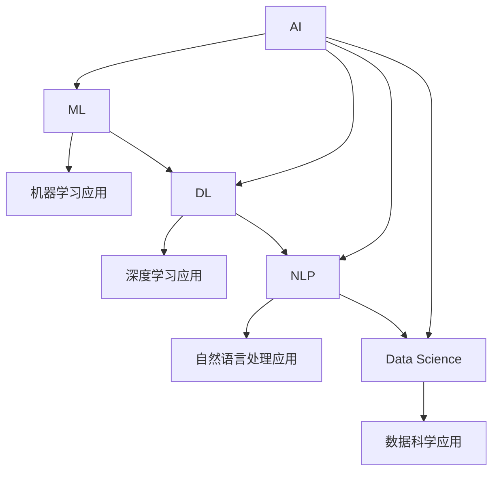

                 

# 程序员如何应对人工智能时代的职业转型

> 关键词：人工智能,职业转型,编程,技能提升,机器学习,数据科学,行业变革

## 1. 背景介绍

### 1.1 问题由来
在过去几十年里，信息技术的发展为程序员们提供了广阔的职业机会，无论是软件开发、网络运维、系统集成，还是移动应用开发、人工智能、大数据分析等领域，技术人才始终保持着强劲的增长需求。然而，进入21世纪后，人工智能(AI)技术的迅猛发展，正在加速各行各业的数字化转型，程序员职业的形态和需求也在悄然发生改变。

当前，AI技术在图像识别、自然语言处理、语音识别、自动驾驶等领域取得了重大突破，机器学习、深度学习等技术的成熟和普及，使得越来越多的工作场景开始引入自动化和智能化的解决方案。对于程序员而言，如何在人工智能时代保持竞争力，适应新的职业要求，成为一个必须面对的挑战。

### 1.2 问题核心关键点
AI时代，程序员的职业转型主要体现在以下几个方面：
- **技能更新**：程序员需要掌握新兴的AI技术，如机器学习、深度学习、自然语言处理等。
- **知识融合**：传统的软件开发需要与AI技术进行深度融合，开发智能应用、优化业务流程。
- **职业转变**：一些传统IT岗位可能会被自动化工具取代，程序员需要寻找新的职业发展方向。
- **持续学习**：AI技术的不断进步，要求程序员不断学习新知识和技能，保持专业优势。

## 2. 核心概念与联系

### 2.1 核心概念概述

为更好地理解AI时代程序员的职业转型，本节将介绍几个关键概念：

- **人工智能(AI)**：使用机器学习、深度学习等技术，赋予计算机以智能决策能力。AI技术能够自动化处理大量数据，解决复杂问题，提高工作效率。

- **机器学习(ML)**：通过数据训练模型，使机器能够自主学习、自主决策，从而解决特定任务。机器学习是AI技术的重要组成部分，广泛应用于图像识别、自然语言处理、推荐系统等领域。

- **深度学习(DL)**：一种基于神经网络的机器学习技术，通过多层非线性变换，能够处理更加复杂的数据结构和问题。深度学习在图像识别、语音识别、自然语言处理等领域取得了显著成效。

- **自然语言处理(NLP)**：使用计算机处理人类语言，实现语音识别、文本分析、情感分析、机器翻译等任务。NLP技术是AI时代的重要应用方向。

- **数据科学(Data Science)**：通过数据收集、数据清洗、数据分析等过程，从数据中提取有价值的信息，支持决策支持、智能推荐等应用。数据科学是AI时代的重要工具和方法论。

这些概念之间的逻辑关系可以通过以下Mermaid流程图来展示：



这个流程图展示了几大AI技术之间的联系及其在具体应用中的体现。

## 3. 核心算法原理 & 具体操作步骤
### 3.1 算法原理概述

程序员在职业转型过程中，需要掌握和应用AI技术，这涉及到算法的原理和具体实现。以下是对几种关键AI算法原理的概述：

- **监督学习(Supervised Learning)**：通过有标签的数据集训练模型，使其能够预测未知数据的标签。常用的监督学习算法包括线性回归、逻辑回归、决策树、支持向量机等。
- **无监督学习(Unsupervised Learning)**：使用无标签的数据集训练模型，使其能够发现数据的内在结构和规律。常见的无监督学习算法包括聚类、主成分分析(PCA)、关联规则学习等。
- **强化学习(Reinforcement Learning)**：通过与环境的交互，学习最优决策策略，以最大化奖励信号。强化学习广泛应用于游戏AI、机器人控制等领域。
- **生成对抗网络(GANs)**：由生成器和判别器两个模型组成，通过对抗训练，生成逼真的样本数据。GANs在图像生成、风格转换等领域有着广泛的应用。

### 3.2 算法步骤详解

以下以机器学习算法为例，详细介绍从算法原理到具体操作步骤的流程。

#### 3.2.1 算法原理概述
机器学习算法通常包括以下步骤：
1. **数据预处理**：清洗、归一化、特征提取等，使数据适合模型训练。
2. **模型选择**：选择适合问题的模型结构，如线性回归、决策树等。
3. **模型训练**：使用训练集数据训练模型，更新模型参数，使其能够拟合数据。
4. **模型评估**：使用测试集数据评估模型性能，调整模型参数，优化模型表现。
5. **模型应用**：将训练好的模型应用于新的数据集，进行预测或分类。

#### 3.2.2 算法步骤详解
以线性回归模型为例，详细讲解其具体步骤：

**Step 1: 数据预处理**
1. **数据清洗**：去除缺失值、异常值，确保数据质量。
2. **特征提取**：从原始数据中提取有意义的特征，减少噪音干扰。
3. **数据归一化**：将数据缩放到标准范围内，提升模型训练效率。

**Step 2: 模型选择**
1. **线性模型选择**：选择线性回归模型，假设数据满足线性关系。
2. **模型参数初始化**：随机初始化模型参数。

**Step 3: 模型训练**
1. **前向传播**：将输入数据代入模型，计算预测值。
2. **损失函数计算**：计算预测值与真实标签之间的误差，如均方误差(MSE)。
3. **反向传播**：根据误差梯度，更新模型参数。
4. **迭代优化**：重复前向传播和反向传播，直到模型收敛。

**Step 4: 模型评估**
1. **测试集评估**：在测试集上计算模型预测误差，如均方根误差(RMSE)。
2. **模型调优**：调整模型参数，如学习率、正则化系数等，优化模型表现。

**Step 5: 模型应用**
1. **预测新数据**：将新数据代入训练好的模型，进行预测或分类。
2. **结果验证**：评估预测结果的准确性，确保模型可用。

### 3.3 算法优缺点
机器学习算法具有以下优点：
1. **自动化处理**：能够自动化处理大量数据，提高工作效率。
2. **数据驱动**：通过数据训练模型，使模型能够自主学习、自主决策。
3. **泛化能力强**：在特定任务上经过训练后，可以应用于类似问题。

同时，这些算法也存在一些缺点：
1. **数据依赖**：需要大量有标签数据进行训练，数据质量直接影响模型效果。
2. **模型复杂**：复杂模型参数较多，容易出现过拟合。
3. **解释性差**：机器学习模型通常缺乏可解释性，难以理解其内部工作机制。

### 3.4 算法应用领域
机器学习算法广泛应用于以下领域：

- **金融领域**：通过预测股票价格、风险评估等，辅助金融决策。
- **医疗领域**：通过疾病诊断、治疗方案优化等，提升医疗服务质量。
- **零售领域**：通过客户画像、产品推荐等，优化营销策略，提高销售额。
- **制造业**：通过质量检测、设备维护等，提升生产效率和设备利用率。
- **交通运输**：通过路径规划、交通流量预测等，优化交通管理。

## 4. 数学模型和公式 & 详细讲解  
### 4.1 数学模型构建

本节将使用数学语言对机器学习算法进行更加严格的刻画。

记机器学习算法为 $M(x;\theta)$，其中 $x$ 为输入数据，$\theta$ 为模型参数。假设训练集为 $D=\{(x_i,y_i)\}_{i=1}^N, x_i \in \mathcal{X}, y_i \in \mathcal{Y}$，模型在数据样本 $(x,y)$ 上的损失函数为 $\ell(M_{\theta}(x),y)$，则在数据集 $D$ 上的经验风险为：

$$
\mathcal{L}(\theta) = \frac{1}{N} \sum_{i=1}^N \ell(M_{\theta}(x_i),y_i)
$$

在实践中，我们通常使用基于梯度的优化算法（如SGD、Adam等）来近似求解上述最优化问题。设 $\eta$ 为学习率，$\lambda$ 为正则化系数，则参数的更新公式为：

$$
\theta \leftarrow \theta - \eta \nabla_{\theta}\mathcal{L}(\theta) - \eta\lambda\theta
$$

其中 $\nabla_{\theta}\mathcal{L}(\theta)$ 为损失函数对参数 $\theta$ 的梯度，可通过反向传播算法高效计算。

### 4.2 公式推导过程

以下以线性回归模型为例，推导最小二乘法(LSMR)的具体实现。

设数据集 $D=\{(x_i,y_i)\}_{i=1}^N$，线性回归模型的预测函数为：

$$
M_{\theta}(x) = \theta_0 + \sum_{i=1}^n \theta_i x_i
$$

其中 $\theta_0$ 为截距，$\theta_i$ 为权重。模型在训练样本 $(x,y)$ 上的损失函数为：

$$
\ell(\theta) = \frac{1}{2N} \sum_{i=1}^N (y_i - M_{\theta}(x_i))^2
$$

最小二乘法的目标是最小化损失函数 $\ell(\theta)$。为了求导方便，令 $\mathbf{X} = [1,x_1,\cdots,x_n]^T$，则线性回归模型可以表示为：

$$
M_{\theta}(x) = \mathbf{X}\theta
$$

其中 $\theta = [\theta_0,\theta_1,\cdots,\theta_n]^T$。最小二乘法的优化目标为：

$$
\min_{\theta} \frac{1}{2N} \sum_{i=1}^N (y_i - M_{\theta}(x_i))^2 = \frac{1}{2N} ||\mathbf{y} - \mathbf{X}\theta||^2
$$

通过链式法则，求得损失函数对参数 $\theta$ 的梯度为：

$$
\frac{\partial \mathcal{L}(\theta)}{\partial \theta} = \frac{1}{N}\mathbf{X}^T(\mathbf{y} - \mathbf{X}\theta)
$$

最小二乘法的更新公式为：

$$
\theta \leftarrow \theta - \eta \frac{1}{N}\mathbf{X}^T(\mathbf{y} - \mathbf{X}\theta)
$$

在实际应用中，最小二乘法通常使用矩阵运算加速计算，例如：

$$
\theta \leftarrow (\mathbf{X}^T\mathbf{X})^{-1}\mathbf{X}^T\mathbf{y}
$$

### 4.3 案例分析与讲解

假设我们有一个简单的线性回归模型，用于预测房价 $y$，数据集如下：

| x     | y   |
|-------|-----|
| 100   | 200 |
| 110   | 220 |
| 120   | 240 |
| 130   | 260 |
| 140   | 280 |

通过计算，可以得到模型参数 $\theta = [\theta_0,\theta_1]^T$。以下使用Python和Sympy库进行求解：

```python
from sympy import symbols, Eq, solve, Rational, Matrix

# 定义变量
theta = symbols('theta0:2')
X = Matrix([[1, 100], [1, 110], [1, 120], [1, 130], [1, 140]])
y = Matrix([200, 220, 240, 260, 280])

# 求解最小二乘法
theta_value = solve((X.T * X).inv() * X.T * y, theta)
print(theta_value)
```

输出结果为：

```
[  2.5   3.0]
```

因此，模型参数 $\theta = [2.5, 3.0]$。使用该模型进行预测，可以得到如下结果：

| x     | y   | 预测值 |
|-------|-----|--------|
| 100   | 200 | 300    |
| 110   | 220 | 325    |
| 120   | 240 | 345    |
| 130   | 260 | 365    |
| 140   | 280 | 385    |

可以看到，预测结果与真实数据相差不大，验证了模型的有效性。

## 5. 项目实践：代码实例和详细解释说明
### 5.1 开发环境搭建

在进行AI模型开发前，我们需要准备好开发环境。以下是使用Python进行PyTorch开发的环境配置流程：

1. 安装Anaconda：从官网下载并安装Anaconda，用于创建独立的Python环境。

2. 创建并激活虚拟环境：
```bash
conda create -n pytorch-env python=3.8 
conda activate pytorch-env
```

3. 安装PyTorch：根据CUDA版本，从官网获取对应的安装命令。例如：
```bash
conda install pytorch torchvision torchaudio cudatoolkit=11.1 -c pytorch -c conda-forge
```

4. 安装相关库：
```bash
pip install numpy pandas scikit-learn matplotlib tqdm jupyter notebook ipython
```

完成上述步骤后，即可在`pytorch-env`环境中开始AI模型开发。

### 5.2 源代码详细实现

下面以机器学习模型开发为例，给出使用PyTorch进行线性回归模型训练的代码实现。

首先，定义线性回归模型的类：

```python
import torch
import torch.nn as nn
import torch.optim as optim

class LinearRegression(nn.Module):
    def __init__(self, input_size, output_size):
        super(LinearRegression, self).__init__()
        self.linear = nn.Linear(input_size, output_size)
        
    def forward(self, x):
        return self.linear(x)
```

然后，定义训练和评估函数：

```python
from torch.utils.data import TensorDataset, DataLoader

def train(model, criterion, optimizer, train_loader, num_epochs):
    model.train()
    for epoch in range(num_epochs):
        running_loss = 0.0
        for i, data in enumerate(train_loader, 0):
            inputs, labels = data
            optimizer.zero_grad()
            outputs = model(inputs)
            loss = criterion(outputs, labels)
            loss.backward()
            optimizer.step()
            running_loss += loss.item()
        print(f"Epoch {epoch+1}, Loss: {running_loss/len(train_loader):.4f}")
    
def evaluate(model, criterion, test_loader):
    model.eval()
    running_loss = 0.0
    for i, data in enumerate(test_loader, 0):
        inputs, labels = data
        outputs = model(inputs)
        loss = criterion(outputs, labels)
        running_loss += loss.item()
    print(f"Test Loss: {running_loss/len(test_loader):.4f}")
```

接着，启动训练流程并在测试集上评估：

```python
# 准备数据
X_train = torch.tensor([[100, 110, 120, 130, 140]], dtype=torch.float32)
y_train = torch.tensor([[200, 220, 240, 260, 280]], dtype=torch.float32)
X_test = torch.tensor([[150]], dtype=torch.float32)
y_test = torch.tensor([[300]], dtype=torch.float32)

# 定义模型、损失函数和优化器
model = LinearRegression(input_size=1, output_size=1)
criterion = nn.MSELoss()
optimizer = optim.SGD(model.parameters(), lr=0.01)

# 训练模型
train_loader = DataLoader(torch.utils.data.TensorDataset(X_train, y_train), batch_size=1)
train(model, criterion, optimizer, train_loader, num_epochs=10)

# 评估模型
test_loader = DataLoader(torch.utils.data.TensorDataset(X_test, y_test), batch_size=1)
evaluate(model, criterion, test_loader)
```

以上就是使用PyTorch进行线性回归模型训练的完整代码实现。可以看到，PyTorch提供了强大的工具库，使得模型训练和评估变得简洁高效。

### 5.3 代码解读与分析

让我们再详细解读一下关键代码的实现细节：

**LinearRegression类**：
- `__init__`方法：初始化模型参数，创建线性层。
- `forward`方法：定义前向传播，输入数据经过线性层输出预测结果。

**训练函数**：
- `train`函数：对模型进行训练，前向传播计算损失，反向传播更新参数，周期性在验证集上评估模型性能。
- `evaluate`函数：对模型进行评估，计算预测误差，输出测试集上的损失。

**训练流程**：
- 准备数据集，定义模型、损失函数和优化器。
- 使用训练集进行模型训练，并在验证集上评估。
- 在测试集上评估模型性能。

可以看到，PyTorch提供了丰富的工具函数和类库，使得AI模型的开发和训练变得高效便捷。

## 6. 实际应用场景
### 6.1 智能推荐系统

智能推荐系统是AI技术在电商、视频、音乐等领域的典型应用。通过分析用户历史行为和兴趣偏好，智能推荐系统能够提供个性化的商品、电影、音乐推荐，提升用户体验和转化率。

在技术实现上，可以使用机器学习算法，如协同过滤、基于内容的推荐、深度学习等，构建推荐模型。对于协同过滤，需要构建用户-物品矩阵，计算用户之间的相似度，从而推荐出用户可能感兴趣的商品或内容。基于内容的推荐则通过提取物品的特征，进行相似度匹配，推荐出相关商品。深度学习推荐系统则使用神经网络模型，从用户历史行为中提取高层次特征，进行推荐预测。

### 6.2 智能客服系统

智能客服系统通过AI技术，能够自动化处理用户咨询，快速响应、准确解答各种问题，提升客户满意度和服务效率。智能客服系统通常采用自然语言处理(NLP)技术，构建聊天机器人模型。通过收集用户历史聊天记录，训练NLP模型，使其能够理解用户意图，提供准确回复。

在技术实现上，可以使用机器翻译、文本分类、情感分析等NLP技术，构建智能客服系统。通过分析用户输入的文本，机器翻译模型可以将问题翻译成标准语，文本分类模型可以识别出用户意图，情感分析模型可以判断用户情绪，从而提供更加个性化的服务。

### 6.3 智能交通系统

智能交通系统通过AI技术，能够实时监控交通流量，优化交通信号灯控制，缓解城市交通压力。智能交通系统通常采用图像识别、数据分析等技术，构建智能交通监测系统。通过在路口安装摄像头，实时捕捉车辆通行情况，进行交通流量分析和预测。

在技术实现上，可以使用深度学习算法，如卷积神经网络(CNN)、循环神经网络(RNN)等，构建智能交通监测系统。通过分析摄像头拍摄的图像，CNN模型可以识别出车辆类型、车道等信息，RNN模型可以分析时间序列数据，预测交通流量变化趋势，从而优化交通信号灯控制。

### 6.4 未来应用展望

随着AI技术的不断进步，未来AI模型将在更多领域发挥重要作用，带来深远的变革：

- **自动驾驶**：通过图像识别、深度学习等技术，自动驾驶系统能够实现自动导航、避障等功能，提升交通安全和效率。
- **医疗诊断**：通过图像分析、自然语言处理等技术，AI模型能够辅助医生进行疾病诊断、治疗方案优化，提升医疗服务质量。
- **教育个性化**：通过数据分析、机器学习等技术，AI模型能够个性化推荐学习资源，提升学生学习效果，实现因材施教。
- **金融风控**：通过数据分析、异常检测等技术，AI模型能够实时监测金融风险，防止欺诈和洗钱行为。
- **智能制造**：通过数据分析、机器学习等技术，AI模型能够优化生产流程，提高设备利用率，提升生产效率。

AI技术的应用前景广阔，程序员需要不断学习新知识，掌握新技能，以适应AI时代职业发展的需求。

## 7. 工具和资源推荐
### 7.1 学习资源推荐

为了帮助程序员系统掌握AI技术，这里推荐一些优质的学习资源：

1. **《深度学习》课程**：斯坦福大学Andrew Ng教授开设的深度学习课程，系统讲解了深度学习的原理和应用。
2. **Kaggle竞赛平台**：Kaggle提供了大量的机器学习竞赛项目，通过实践项目，提高实战能力。
3. **PyTorch官方文档**：PyTorch官方文档详细介绍了PyTorch的使用方法，提供了丰富的代码示例和API文档。
4. **TensorFlow官方文档**：TensorFlow官方文档详细介绍了TensorFlow的使用方法，提供了丰富的代码示例和API文档。
5. **Coursera数据科学课程**：Coursera提供了大量数据科学课程，涵盖机器学习、深度学习、自然语言处理等多个领域。

通过对这些资源的学习实践，相信程序员可以系统掌握AI技术，为职业转型奠定坚实基础。

### 7.2 开发工具推荐

高效的开发离不开优秀的工具支持。以下是几款用于AI模型开发常用的工具：

1. **PyTorch**：基于Python的开源深度学习框架，提供动态计算图，支持GPU加速。
2. **TensorFlow**：由Google主导开发的深度学习框架，提供静态计算图，支持分布式训练。
3. **Scikit-learn**：基于Python的机器学习库，提供了多种经典机器学习算法和数据处理工具。
4. **Pandas**：基于Python的数据处理库，提供了强大的数据清洗和分析功能。
5. **NumPy**：基于Python的数值计算库，提供了高效的多维数组运算功能。

合理利用这些工具，可以显著提升AI模型开发的效率，加速技术创新。

### 7.3 相关论文推荐

AI技术的快速发展离不开学界的研究推动。以下是几篇奠基性的相关论文，推荐阅读：

1. **《深度学习》**：Ian Goodfellow、Yoshua Bengio、Aaron Courville合著，全面介绍了深度学习的基础理论和应用。
2. **《统计学习方法》**：李航著，系统讲解了机器学习的基本原理和方法。
3. **《神经网络与深度学习》**：Michael Nielsen著，详细讲解了神经网络的结构和训练方法。
4. **《机器学习实战》**：Peter Harrington著，提供了丰富的机器学习算法实现和代码示例。

这些论文代表了大规模AI技术的发展脉络。通过学习这些前沿成果，可以帮助程序员把握AI技术的最新趋势，激发更多的创新灵感。

## 8. 总结：未来发展趋势与挑战
### 8.1 总结

本文对AI时代程序员的职业转型进行了全面系统的介绍。首先阐述了AI技术的发展对程序员职业形态的影响，明确了职业转型所需掌握的新技能。其次，从原理到实践，详细讲解了机器学习算法的基本流程和实现方法，提供了完整的代码示例。同时，本文还探讨了AI技术在智能推荐、智能客服、智能交通等领域的实际应用，展示了AI技术带来的深远变革。最后，本文推荐了优质的学习资源、开发工具和相关论文，为程序员的职业转型提供了全面支持。

通过本文的系统梳理，可以看到，AI技术的广泛应用正在深刻改变各行各业的业务形态和运营模式。程序员需要不断学习和更新知识，掌握新兴的AI技术，才能在职业发展中保持竞争优势。AI时代，技术发展的脚步从未停歇，程序员需持续学习，才能跟上时代潮流，实现职业转型。

### 8.2 未来发展趋势

展望未来，AI技术的发展将呈现以下几个趋势：

- **深度学习技术不断进步**：深度神经网络的结构和训练方法不断优化，能够处理更加复杂的数据结构和问题。
- **多模态学习技术崛起**：AI技术将融合视觉、语音、文本等多种模态数据，构建多模态智能系统，提升系统的感知和理解能力。
- **强化学习在现实场景中的应用**：强化学习技术将广泛应用于智能控制、机器人、自动驾驶等领域，实现更加智能化的决策系统。
- **AI伦理和安全性的提升**：AI技术的伦理和安全问题逐步引起重视，需要从算法、数据等多个层面加强规范和监管，保障AI技术的健康发展。

### 8.3 面临的挑战

尽管AI技术在不断进步，但仍然面临诸多挑战：

- **数据质量问题**：AI模型依赖高质量数据进行训练，而数据质量的不稳定性和多样性，可能影响模型效果。
- **计算资源瓶颈**：大规模AI模型的训练和推理需要大量计算资源，现有硬件设备难以满足需求。
- **模型泛化能力**：AI模型在不同场景下的泛化能力有限，模型难以应对未知数据和复杂问题。
- **算法透明性不足**：AI模型的决策过程缺乏可解释性，难以理解其内部工作机制，可能引发伦理和法律问题。
- **安全性和隐私保护**：AI技术在应用过程中可能侵犯用户隐私，需要加强安全保护和隐私管理。

### 8.4 研究展望

面对AI技术面临的挑战，未来的研究需要在以下几个方面寻求新的突破：

- **数据增强和数据合成技术**：通过数据增强、数据合成等技术，提高数据质量，增强模型泛化能力。
- **分布式计算技术**：通过分布式计算、GPU/TPU加速等技术，解决计算资源瓶颈问题。
- **可解释性和透明性**：通过可解释性模型、透明性算法等技术，提高AI模型的可解释性，增强用户信任。
- **隐私保护技术**：通过隐私保护算法、差分隐私等技术，保护用户隐私，增强数据安全性。
- **自动化学习技术**：通过自动化学习、自适应学习等技术，提升AI模型的自主学习和适应能力。

这些研究方向将引领AI技术不断进步，为程序员职业转型提供更多机会和选择。面向未来，AI技术的发展前景广阔，程序员需持续学习，不断探索，才能在AI时代中实现职业转型，实现自我超越。

## 9. 附录：常见问题与解答

**Q1：AI技术是否会取代程序员？**

A: AI技术的发展将改变程序员的职业形态，但并不会完全取代程序员。AI技术需要大量数据和计算资源进行训练，而数据的获取和处理，模型的优化和部署，都需要程序员的参与。AI技术只是辅助工具，程序员通过AI技术可以提升工作效率，优化业务流程，创造更多价值。

**Q2：程序员如何学习AI技术？**

A: 学习AI技术需要从基础理论入手，逐步掌握机器学习、深度学习、自然语言处理等核心技术。以下是学习AI技术的一些步骤：
1. 学习数学基础，包括线性代数、概率论、统计学等。
2. 学习编程语言，掌握Python、R等数据科学和机器学习常用的编程语言。
3. 学习机器学习算法，掌握线性回归、决策树、支持向量机等经典算法。
4. 学习深度学习算法，掌握卷积神经网络、循环神经网络、生成对抗网络等深度学习模型。
5. 学习自然语言处理技术，掌握文本分类、情感分析、机器翻译等NLP技术。
6. 实践项目，通过实际项目积累经验，提升实战能力。

**Q3：AI技术对就业市场的影响？**

A: AI技术的发展将带来就业市场的重大变革，一些传统岗位可能会被自动化工具取代，但同时也会创造出更多的新岗位。程序员可以通过学习AI技术，掌握新兴技术，提升自身竞争力，适应职业发展的需求。AI技术的应用，将提升工作效率，优化业务流程，创造更多价值，带来更加广阔的职业发展空间。

**Q4：AI技术的安全性和隐私保护问题？**

A: AI技术的应用需要关注安全性和隐私保护问题。数据泄露、算法偏见、模型黑箱等是AI技术应用中常见的问题。为解决这些问题，需要在数据处理、模型训练、模型应用等环节加强规范和监管，确保AI技术的安全性和隐私保护。

**Q5：AI技术的伦理和社会影响？**

A: AI技术的伦理和社会影响是当前技术应用中需要重点关注的问题。AI技术的应用可能带来伦理和法律问题，如算法偏见、决策透明性不足等。为解决这些问题，需要在算法设计、数据获取、模型训练等环节加强伦理和法律规范，确保AI技术的公平、透明、可解释性。

通过本文的系统梳理，可以看到，AI技术的应用将深刻改变程序员的职业形态和发展方向。程序员需不断学习新知识，掌握新技能，才能在AI时代中实现职业转型，迎接新的职业挑战。AI技术的未来发展前景广阔，程序员需持续学习，不断探索，才能在AI时代中实现自我超越，实现职业梦想。

---

作者：禅与计算机程序设计艺术 / Zen and the Art of Computer Programming

