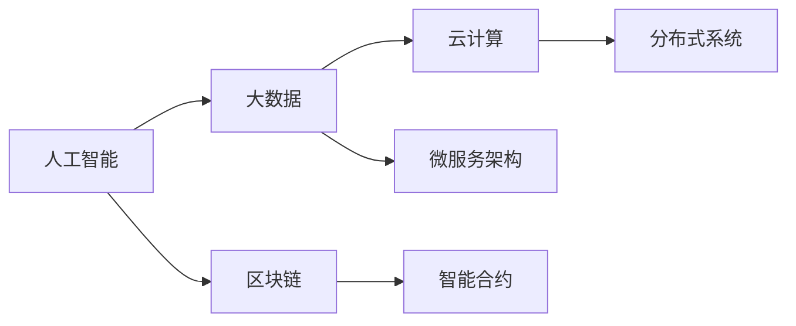

                 

## 1. 背景介绍

在快速发展的技术世界中，程序员的收入来源和职业发展成为了许多人关注的焦点。随着人工智能、大数据、云计算等新兴技术的兴起，传统的软件开发方式、工作岗位和收入结构都发生了巨大的变化。本文将探讨程序员如何通过学习和掌握新兴技术，建立长期稳定的收入来源，以及如何利用这些技术优化职业生涯。

## 2. 核心概念与联系

### 2.1 核心概念概述

在探讨长期稳定的收入来源之前，我们需要明确几个核心概念：

- **人工智能（AI）**：一种能够模拟人类智能行为的技术，包括机器学习、深度学习、自然语言处理等。
- **大数据**：指从各种来源收集的大量数据，用于分析和洞察用户行为、市场趋势等。
- **云计算**：一种基于互联网的服务，提供按需的计算资源，如服务器、存储和网络。
- **区块链**：一种分布式账本技术，确保数据的安全性和不可篡改性。
- **微服务架构**：一种将应用程序拆分为小型独立服务的设计模式，每个服务可以独立部署和扩展。

### 2.2 核心概念原理和架构的 Mermaid 流程图



这个流程图展示了各个概念之间的联系和交互。人工智能和大数据技术为云计算提供了丰富的数据源和分析工具，区块链技术提供了安全的数据存储和传输方式，微服务架构则支持了大规模分布式系统的构建和扩展。

## 3. 核心算法原理 & 具体操作步骤

### 3.1 算法原理概述

建立长期稳定的收入来源，离不开对新兴技术的深入理解和应用。以下是几个关键算法的原理概述：

- **机器学习算法**：通过数据训练模型，使其能够自动优化，并应用于各类预测和分类任务。
- **深度学习算法**：一种特殊的机器学习算法，通过构建多层神经网络，可以处理更复杂的数据。
- **自然语言处理（NLP）**：使计算机能够理解和处理人类语言的技术，包括文本分析、情感分析、机器翻译等。
- **云计算资源管理算法**：通过算法优化资源使用，如负载均衡、资源自动扩展等，确保系统的稳定性和效率。

### 3.2 算法步骤详解

1. **数据收集和预处理**：收集与目标领域相关的数据，进行清洗和预处理，确保数据质量和一致性。
2. **模型训练和验证**：选择合适的算法，利用数据训练模型，并使用验证集进行性能评估和调优。
3. **部署和监控**：将训练好的模型部署到生产环境，并使用监控工具持续跟踪其性能和稳定性。
4. **优化和迭代**：根据监控结果和业务需求，对模型和系统进行优化和迭代，不断提升性能和稳定性。

### 3.3 算法优缺点

- **优点**：
  - 能够处理大规模数据，提升决策准确性。
  - 自动化的优化过程，减少了人工干预。
  - 可扩展性强，适应不同的业务需求。

- **缺点**：
  - 对数据质量和算法选择依赖性强。
  - 模型训练和部署需要较高的技术门槛。
  - 对硬件资源和网络环境要求较高。

### 3.4 算法应用领域

这些算法在多个领域都有广泛的应用，例如：

- **金融科技**：使用机器学习和深度学习进行风险评估、欺诈检测、股票预测等。
- **医疗健康**：利用NLP进行病历分析、药物研发、健康监测等。
- **智能制造**：通过大数据和云计算优化生产流程、设备维护等。
- **交通运输**：使用AI进行交通流量预测、自动驾驶、智能调度等。
- **市场营销**：利用NLP进行用户情感分析、广告推荐、市场趋势预测等。

## 4. 数学模型和公式 & 详细讲解 & 举例说明

### 4.1 数学模型构建

以机器学习中的线性回归模型为例，其数学模型为：

$$y = \theta_0 + \theta_1 x_1 + \theta_2 x_2 + \cdots + \theta_n x_n$$

其中，$y$ 是输出变量，$\theta$ 是模型参数，$x$ 是输入变量。

### 4.2 公式推导过程

线性回归模型的推导过程如下：

1. 设定目标函数 $J(\theta) = \frac{1}{2m} \sum_{i=1}^{m} (h_\theta(x^{(i)}) - y^{(i)})^2$，其中 $m$ 是样本数量，$h_\theta(x^{(i)})$ 是模型的预测值。
2. 求导得到 $\frac{\partial J(\theta)}{\partial \theta_k} = \frac{1}{m} \sum_{i=1}^{m} (h_\theta(x^{(i)}) - y^{(i)}) x_k^{(i)}$。
3. 使用梯度下降算法更新参数：$\theta_k = \theta_k - \alpha \frac{\partial J(\theta)}{\partial \theta_k}$，其中 $\alpha$ 是学习率。

### 4.3 案例分析与讲解

以金融风险预测为例，通过收集历史交易数据和用户信息，使用线性回归模型进行风险评估。在模型训练阶段，使用验证集评估模型性能，调整超参数，确保模型泛化性能。部署后，持续监控模型预测结果，进行实时优化和迭代。

## 5. 项目实践：代码实例和详细解释说明

### 5.1 开发环境搭建

- **Python环境**：安装Anaconda或Miniconda，创建虚拟环境。
- **数据集准备**：收集与目标领域相关的数据集，进行预处理。
- **依赖包安装**：使用pip安装需要的Python库，如TensorFlow、Keras、Pandas等。

### 5.2 源代码详细实现

以下是一个简单的线性回归模型的Python代码实现：

```python
import pandas as pd
from sklearn.linear_model import LinearRegression
from sklearn.model_selection import train_test_split

# 加载数据集
data = pd.read_csv('data.csv')

# 分离输入和输出变量
X = data.drop('target', axis=1)
y = data['target']

# 划分训练集和验证集
X_train, X_val, y_train, y_val = train_test_split(X, y, test_size=0.2)

# 创建线性回归模型
model = LinearRegression()

# 训练模型
model.fit(X_train, y_train)

# 验证模型性能
score = model.score(X_val, y_val)
print(f"验证集得分：{score:.3f}")
```

### 5.3 代码解读与分析

- **数据加载**：使用Pandas库读取CSV格式的数据集。
- **模型创建**：使用scikit-learn库的LinearRegression类创建线性回归模型。
- **数据分割**：使用train_test_split函数将数据集划分为训练集和验证集。
- **模型训练**：使用fit方法对模型进行训练。
- **性能评估**：使用score方法评估模型在验证集上的性能，通常使用R²得分。

### 5.4 运行结果展示

运行上述代码后，将输出验证集得分，反映模型在未见数据上的表现。

## 6. 实际应用场景

### 6.1 金融科技

在金融科技领域，程序员可以利用机器学习和深度学习技术进行风险评估、欺诈检测、股票预测等。例如，使用历史交易数据和用户行为数据，构建模型预测贷款违约概率。

### 6.2 医疗健康

在医疗健康领域，利用NLP技术进行病历分析、药物研发、健康监测等。例如，通过分析患者电子病历，使用深度学习模型预测疾病风险。

### 6.3 智能制造

在智能制造领域，通过大数据和云计算优化生产流程、设备维护等。例如，使用传感器数据和机器学习模型预测设备故障。

### 6.4 交通运输

在交通运输领域，使用AI进行交通流量预测、自动驾驶、智能调度等。例如，通过分析交通监控数据，使用机器学习模型预测交通拥堵情况。

### 6.5 市场营销

在市场营销领域，利用NLP进行用户情感分析、广告推荐、市场趋势预测等。例如，通过分析社交媒体评论，使用NLP模型评估产品口碑。

## 7. 工具和资源推荐

### 7.1 学习资源推荐

1. **Coursera**：提供大量在线课程，涵盖人工智能、机器学习、大数据等领域的最新技术和应用。
2. **Udacity**：提供纳米学位课程，注重实际项目实践。
3. **edX**：提供来自全球顶尖大学和机构的在线课程和学位项目。
4. **Kaggle**：数据科学竞赛平台，提供大量公开数据集和挑战赛，提升实战能力。

### 7.2 开发工具推荐

1. **Python**：通用编程语言，广泛应用于数据科学和机器学习领域。
2. **TensorFlow**：Google开发的深度学习框架，支持分布式计算和GPU加速。
3. **PyTorch**：Facebook开发的深度学习框架，支持动态计算图和GPU加速。
4. **Jupyter Notebook**：开源的交互式计算环境，支持Python、R等语言。
5. **GitHub**：代码托管平台，支持版本控制和协作开发。

### 7.3 相关论文推荐

1. **"Deep Learning" by Ian Goodfellow, Yoshua Bengio, and Aaron Courville**：全面介绍深度学习理论和技术。
2. **"Hands-On Machine Learning with Scikit-Learn, Keras, and TensorFlow" by Aurélien Géron**：实战教程，涵盖机器学习基础和深度学习应用。
3. **"Natural Language Processing in Action" by Hobson Lane, Cole Howard, and Hannes Hapke**：NLP实战指南，包括文本分析、情感分析、机器翻译等。
4. **"Programming Massive Scale Machine Learning" by Jeff Dean and Alice Xiang**：来自Google的机器学习工程实践指南。
5. **"Blockchain Basics: How to Master Blockchain" by Kevin Musgrave**：区块链入门教程，涵盖基础概念和应用场景。

## 8. 总结：未来发展趋势与挑战

### 8.1 研究成果总结

- 人工智能和大数据技术的发展，为程序员提供了新的就业机会和收入来源。
- 云计算和微服务架构优化了资源使用，提升了系统的可扩展性和稳定性。
- 区块链技术为数据安全和分布式应用提供了新的解决方案。

### 8.2 未来发展趋势

- 人工智能和大数据技术将继续进步，推动更多领域的数字化转型。
- 云计算和边缘计算将进一步融合，提升数据处理和存储能力。
- 区块链技术将扩展到更多应用场景，提升数据透明性和安全性。
- 微服务架构将成为企业应用的主流设计模式，提升系统的灵活性和可维护性。

### 8.3 面临的挑战

- 新兴技术的快速变化，要求程序员不断学习和适应。
- 数据质量和隐私保护，是技术应用中的重要挑战。
- 硬件资源和网络环境，对技术应用提出了更高的要求。
- 技术门槛和成本，可能限制中小企业的技术应用。

### 8.4 研究展望

- 持续关注技术前沿，保持学习热情和能力。
- 注重数据质量和安全，提升技术应用的可靠性和可持续性。
- 优化资源使用，降低技术应用成本，提升企业的竞争力。
- 探索新技术的跨领域应用，开拓新的收入来源。

## 9. 附录：常见问题与解答

**Q1: 如何选择合适的机器学习算法？**

A: 根据数据类型和业务需求，选择合适的算法。常用的算法包括线性回归、逻辑回归、决策树、随机森林、支持向量机等。

**Q2: 如何处理数据中的缺失值和异常值？**

A: 对于缺失值，可以使用插值法、删除法或模型预测填补。对于异常值，可以使用统计方法或机器学习算法进行检测和处理。

**Q3: 如何使用模型调优提升性能？**

A: 通过调整超参数、增加正则化、增加特征工程等方法，提升模型性能。可以使用网格搜索、随机搜索等方法进行超参数优化。

**Q4: 如何部署模型到生产环境？**

A: 将模型集成到应用程序中，使用HTTP服务、API接口等方式提供服务。确保模型在生产环境中的稳定性和安全性。

**Q5: 如何监控模型的性能和稳定性？**

A: 使用监控工具如Prometheus、Grafana等，实时采集模型性能指标，设置告警阈值，及时发现和解决异常问题。

---

作者：禅与计算机程序设计艺术 / Zen and the Art of Computer Programming

