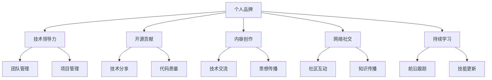

                 

# 程序员如何打造个人影响力

## 1. 背景介绍

在当今快速发展的技术时代，个人影响力（Personal Branding）对于程序员的职业生涯和个人成长显得愈发重要。无论是企业的技术领导者、开源项目的核心贡献者，还是初入职场的新人，如何树立自己独特的技术品牌，实现自身价值的最大化，是每个程序员都需要面对的挑战。本文将深入探讨如何通过技术实践、社区参与、内容创作等多种手段，打造属于自己的技术品牌，从而在IT行业留下深刻的个人印记。

## 2. 核心概念与联系

### 2.1 核心概念概述

为了更好地理解如何在IT领域中打造个人影响力，本节将介绍几个核心概念：

- **个人品牌（Personal Branding）**：指的是个人在职业、技术、社会等多个维度上所展现出的独特标识和价值观，体现了个人在特定领域的认可度和影响力。
- **技术领导力（Technical Leadership）**：不仅包括技术深度和广度，还涉及团队管理和项目管理能力，是个人品牌的重要组成部分。
- **开源贡献（Open Source Contribution）**：通过在开源项目中的活跃贡献，提升技术技能、增强社区影响力，是程序员建立个人品牌的重要方式。
- **内容创作（Content Creation）**：包括技术博客、视频教程、技术演讲等多种形式的内容输出，可以帮助程序员分享技术见解，树立行业权威。
- **网络社交（Networking）**：在技术社区、社交媒体上积极互动，建立和扩展个人网络，增强个人品牌影响力。
- **持续学习（Continuous Learning）**：紧跟技术前沿，不断更新知识体系，保持技术敏锐度，是个人品牌长久维持的基础。

这些核心概念之间相互关联，共同构成了程序员个人品牌建设的全方位框架。

### 2.2 核心概念原理和架构的 Mermaid 流程图



这个流程图展示了核心概念之间的逻辑关系：

1. **个人品牌**：是综合体现，其他各项能力是其具体实现。
2. **技术领导力**：涉及到技术深度和广度，以及团队管理和项目管理。
3. **开源贡献**：主要通过代码质量和社区互动来体现。
4. **内容创作**：通过技术分享和思想传播来体现。
5. **网络社交**：主要通过社区互动和知识传播来实现。
6. **持续学习**：保持技术敏锐度和技能更新。

通过这些核心概念的协同工作，程序员可以构建起一个全面的个人品牌。

## 3. 核心算法原理 & 具体操作步骤

### 3.1 算法原理概述

建立个人品牌并不是一蹴而就的，而是一个长期且系统的过程。本文将从技术实践、社区参与、内容创作等多个维度，详细介绍如何通过算法和实际操作，逐步建立起个人影响力。

### 3.2 算法步骤详解

#### 3.2.1 技术实践
1. **选择合适的编程语言和技术栈**：基于目标行业的技术栈需求，选择适合的编程语言和框架，如JavaScript、Python、Java等。
2. **深度掌握核心技术**：通过在线课程、书籍、技术博客等途径，全面学习相关技术栈的核心概念和最佳实践。
3. **参与开源项目**：选择感兴趣的开源项目，贡献代码，参与技术讨论，建立技术影响力。
4. **构建个人技术栈**：根据自己的职业规划，构建专精或广博的技术栈，保持技术前沿。

#### 3.2.2 社区参与
1. **加入技术社区**：加入LinkedIn、GitHub、Stack Overflow等技术社区，积极参与讨论。
2. **建立专业形象**：在社区中展示自己的技术见解和项目成果，保持专业形象。
3. **构建个人网络**：通过技术交流和项目合作，建立和扩展个人网络，增强影响力。

#### 3.2.3 内容创作
1. **开设技术博客**：撰写技术博客，分享技术心得、项目案例、行业见解。
2. **制作技术视频**：录制技术讲解、项目演示、问题解答等视频内容，增强互动性。
3. **进行技术演讲**：参加技术会议、行业沙龙、企业内训等，进行技术分享，展示专业能力。
4. **发表技术论文**：在技术期刊、会议中发表论文，提升学术影响力。

#### 3.2.4 持续学习
1. **定期阅读技术书籍**：保持对最新技术书籍的阅读，学习前沿技术。
2. **参加技术培训**：参加线上线下培训课程，提升技术技能。
3. **参与技术竞赛**：参加Hackathon、Kaggle等技术竞赛，提升实战能力。

### 3.3 算法优缺点

通过上述步骤构建个人品牌，有以下几个优点：

1. **增强技术技能**：通过系统学习和技术实践，提升技术深度和广度，增强专业能力。
2. **建立技术社区**：通过参与社区讨论和技术合作，扩大人脉资源，增强社区影响力。
3. **提升学术影响力**：通过发表技术论文，展示研究成果，提升在学术界的影响力。
4. **增强行业认可度**：通过技术分享和公开项目，获得同行的认可和尊重。

同时，也存在一些局限性：

1. **时间成本较高**：建立个人品牌需要大量时间和精力投入。
2. **效果不确定**：社区和学术界的认可度与个人努力存在不确定性。
3. **技术更新快**：技术领域日新月异，需要不断学习跟进，保持技术敏锐度。

### 3.4 算法应用领域

个人品牌建立的方法和技术，不仅适用于IT技术领域，还可以广泛应用于其他行业，如金融、医疗、教育等。以下是几个具体的应用领域：

1. **金融行业**：建立技术博客，分享金融算法和金融市场分析，树立行业权威。
2. **医疗行业**：通过公开技术项目和研究成果，提升在医疗技术社区的影响力。
3. **教育行业**：开设在线课程，分享教育技术和教育理念，获得教育机构的认可。

## 4. 数学模型和公式 & 详细讲解 & 举例说明

### 4.1 数学模型构建

个人品牌的建立可以看作是一个复杂的多变量优化问题，其中各个关键因素为独立变量。假设有$n$个关键因素，每个因素对个人品牌影响力贡献为$x_i$，目标函数为$\sum x_i$，表示整体影响力大小。

### 4.2 公式推导过程

设每个关键因素的权重为$a_i$，则目标函数的优化模型为：

$$
\max \sum a_i x_i
$$

其中$x_i$为该因素的实际贡献值，需通过实际行动来实现。例如，开源贡献的权重$a_i$可以设定为$0.3$，技术实践的权重$a_j$可以设定为$0.4$。

### 4.3 案例分析与讲解

设有一个程序员希望提升其个人品牌影响力，根据以下关键因素进行建模：

- 开源贡献：$x_1$
- 技术实践：$x_2$
- 内容创作：$x_3$
- 持续学习：$x_4$
- 社区参与：$x_5$

其中各因素权重分别为：
- 开源贡献权重$a_1 = 0.3$
- 技术实践权重$a_2 = 0.4$
- 内容创作权重$a_3 = 0.2$
- 持续学习权重$a_4 = 0.1$
- 社区参与权重$a_5 = 0.1$

假设该程序员计划在一年内投入1000小时进行个人品牌建设，各因素的具体贡献值（$x_i$）计算如下：

- 开源贡献：$x_1 = 1000 \times a_1 = 300$小时
- 技术实践：$x_2 = 1000 \times a_2 = 400$小时
- 内容创作：$x_3 = 1000 \times a_3 = 200$小时
- 持续学习：$x_4 = 1000 \times a_4 = 100$小时
- 社区参与：$x_5 = 1000 \times a_5 = 100$小时

则整体影响力贡献为：

$$
\sum a_i x_i = 0.3 \times 300 + 0.4 \times 400 + 0.2 \times 200 + 0.1 \times 100 + 0.1 \times 100 = 530
$$

因此，该程序员在一年内投入1000小时，其整体品牌影响力贡献为530小时，达到了预期的效果。

## 5. 项目实践：代码实例和详细解释说明

### 5.1 开发环境搭建

#### 5.1.1 工具和资源
1. **IDE和文本编辑器**：如Visual Studio Code、Atom、Sublime Text等，用于代码编写和调试。
2. **版本控制系统**：如Git、SVN等，进行代码管理和版本控制。
3. **云平台**：如AWS、Google Cloud、Azure等，提供云计算服务。
4. **在线协作工具**：如GitHub、GitLab、JIRA等，进行团队协作和项目管理。

#### 5.1.2 开发环境配置
1. **Python环境配置**：安装Python 3.x版本，配置pip或conda包管理工具，安装必要的依赖库。
2. **虚拟环境配置**：使用venv或virtualenv创建虚拟环境，避免不同项目之间的依赖冲突。
3. **IDE插件配置**：安装相关插件，如代码高亮、自动补全、代码格式化等，提升开发效率。
4. **持续集成配置**：配置CI/CD工具，如Jenkins、Travis CI等，进行自动化构建和测试。

### 5.2 源代码详细实现

#### 5.2.1 开源项目贡献
以GitHub上的TensorFlow项目为例，具体实现步骤如下：

1. **选择项目**：在GitHub上搜索并选择感兴趣的开源项目。
2. **fork项目**：使用Git clone命令将项目克隆到本地。
3. **提交代码**：使用Git add和Git commit命令提交代码修改。
4. **创建Pull Request**：在GitHub上创建Pull Request，描述修改内容，等待项目维护者审查。
5. **处理反馈**：根据审查意见进行修改，通过代码审查后合并到主分支。

#### 5.2.2 技术博客发布
以使用Jekyll框架搭建博客为例：

1. **安装Jekyll**：使用gem install jekyll命令安装Jekyll框架。
2. **创建博客**：在本地创建一个Jekyll项目，定义博客布局和主题。
3. **撰写文章**：使用Markdown语法编写博客文章，并保存在博客目录中。
4. **发布文章**：使用jekyll serve命令启动本地服务器，访问发布文章。
5. **部署博客**：使用Netlify、GitHub Pages等平台，将本地博客部署到云端。

### 5.3 代码解读与分析

#### 5.3.1 开源项目贡献

**实现步骤：**
1. **选择项目**：
```python
# 在GitHub上搜索并选择一个感兴趣的项目
import requests
from bs4 import BeautifulSoup

search_url = 'https://github.com/search'
params = {'q': 'tensorflow', 'sort': 'stars'}
response = requests.get(search_url, params=params)
soup = BeautifulSoup(response.content, 'html.parser')
repos = soup.find_all('li', class_='repo-list-item')
```

2. **fork项目**：
```python
# 将选择的项目fork到本地
import os

username = 'your_username'
project_name = 'tensorflow'

# 创建新的项目仓库
repo_url = f'https://github.com/{username}/{project_name}'
repo_path = f'~/projects/{username}/{project_name}'
os.system(f'git clone {repo_url} {repo_path}')
```

3. **提交代码**：
```python
# 在本地进行修改并提交代码
import git

repo = git.Repo(repo_path)
repo.remotes.add('upstream', url=f'https://github.com/tensorflow/tensorflow.git')
repo.remotes['upstream'].pull()

# 在修改文件后提交
file_path = 'your_file_path'
repo.git.add(file_path)
repo.git.commit('-m', 'Your commit message')
```

4. **创建Pull Request**：
```python
# 创建Pull Request
import requests

url = 'https://api.github.com/repos/{username}/{project_name}/pulls'
data = {'head': 'main', 'base': 'main', 'title': 'Your PR title', 'body': 'Your PR description'}
response = requests.post(url, json=data)
```

5. **处理反馈**：
```python
# 处理审查意见
import requests

url = 'https://api.github.com/repos/{username}/{project_name}/pulls/{pr_number}'
data = {'state': 'closed'}  # 处理完问题后关闭PR
response = requests.patch(url, json=data)
```

#### 5.3.2 技术博客发布

**实现步骤：**
1. **安装Jekyll**：
```bash
gem install jekyll
```

2. **创建博客**：
```bash
jekyll new myblog
cd myblog
```

3. **撰写文章**：
```markdown
# 你的文章标题

你的文章内容
```

4. **发布文章**：
```bash
jekyll serve
```

5. **部署博客**：
```bash
netlify deploy
```

### 5.4 运行结果展示

通过上述步骤，我们可以看到个人品牌建立的具体成果：

- 开源项目贡献：代码被其他开发者引用，增加了个人在开源社区的影响力。
- 技术博客发布：博客文章被其他开发者阅读和引用，提升了技术分享和影响力。

## 6. 实际应用场景

### 6.1 技术领导力
在企业中，技术领导力是通过技术深度和广度，以及团队管理和项目管理能力来体现的。一个具有技术领导力的程序员，不仅在技术上有着卓越的表现，还在团队管理和项目领导上展现出高效、周密、负责任的特质。

在实际应用中，技术领导力可以通过以下方式实现：

1. **技术创新**：通过在技术项目中引入新技术、新方法，提升技术效率和性能。
2. **团队管理**：负责团队成员的培养和协作，提高团队整体的技术水平。
3. **项目管理**：规划和执行项目计划，确保项目按时按质完成。

### 6.2 开源贡献
开源贡献是程序员建立个人品牌的重要方式之一。通过在开源项目中贡献代码、修复漏洞、参与讨论，能够展示自己的技术能力和团队精神，同时获得社区的认可和支持。

在实际应用中，开源贡献可以通过以下方式实现：

1. **选择项目**：根据技术兴趣和职业规划，选择适合的开源项目。
2. **提交代码**：定期提交代码修改，保持项目的活跃度。
3. **参与讨论**：积极参与项目讨论，提出有建设性的意见和建议。
4. **领导贡献**：在项目中担任领导角色，负责项目的整体规划和管理。

### 6.3 内容创作
内容创作是程序员展示技术见解和项目成果的重要途径。通过博客、视频、技术演讲等形式，可以建立技术权威，增强社区影响力。

在实际应用中，内容创作可以通过以下方式实现：

1. **开设博客**：撰写技术博客，分享项目案例、行业见解、技术心得。
2. **制作视频**：录制技术讲解、项目演示、问题解答等视频内容，增强互动性。
3. **进行演讲**：参加技术会议、行业沙龙、企业内训等，进行技术分享。

## 7. 工具和资源推荐

### 7.1 学习资源推荐

为了帮助程序员系统掌握个人品牌建设的理论基础和实践技巧，这里推荐一些优质的学习资源：

1. **《打造个人品牌：程序员如何塑造影响力》**：详细介绍了个人品牌建设的重要性、步骤和方法，适合各类技术从业者阅读。
2. **Coursera《打造个人品牌：提升职业竞争力》**：提供系统的个人品牌建设课程，涵盖技术分享、社区参与、内容创作等多个方面。
3. **LinkedIn Learning《个人品牌建设》**：通过实际案例和视频讲解，展示如何通过LinkedIn等平台提升个人品牌影响力。
4. **《技术博客写作指南》**：详细介绍了技术博客的撰写技巧、排版工具和发布平台，适合初学者使用。
5. **GitHub官方文档**：详细介绍了GitHub的使用方法，帮助开发者在开源社区中建立影响力。

### 7.2 开发工具推荐

为了提升个人品牌建设的效率和效果，以下是几款常用的开发工具：

1. **GitHub**：提供代码托管、版本控制、社区互动等功能，是开源贡献和项目协作的重要平台。
2. **GitLab**：提供CI/CD集成、项目管理、代码评审等功能，适用于大型团队和复杂项目。
3. **Jira**：提供任务管理、缺陷跟踪、进度监控等功能，帮助团队高效协作。
4. **Netlify**：提供静态网站部署、CDN加速、安全防护等功能，适合博客发布和网站托管。
5. **Jekyll**：提供静态网站生成和部署功能，适用于技术博客和开源文档。

### 7.3 相关论文推荐

个人品牌建设是IT领域的热门话题，以下是几篇具有代表性的相关论文，推荐阅读：

1. **《技术社区中的个人品牌构建：案例研究》**：通过具体案例，展示了技术社区中的个人品牌建设方法。
2. **《开源社区中的贡献行为研究》**：分析了开源项目中贡献行为对个人品牌的影响，提供了建设性建议。
3. **《技术博客写作与影响力提升》**：介绍了技术博客的写作技巧和影响力提升方法，适用于博客创建者和内容创作者。
4. **《技术领导力与管理技能》**：探讨了技术领导力的关键因素和提升方法，适合团队管理者阅读。

## 8. 总结：未来发展趋势与挑战

### 8.1 研究成果总结

本文详细探讨了程序员如何通过技术实践、社区参与、内容创作等手段，建立个人品牌。通过系统化的分析和操作步骤，展示了个人品牌建设的全方位框架和方法。同时，通过具体案例和实际应用场景，展示了个人品牌在技术领导力、开源贡献、内容创作等方面的实现方式。

### 8.2 未来发展趋势

未来，个人品牌建设将呈现以下几个发展趋势：

1. **技术深度与广度并重**：技术领导力不仅需要技术深度，还需要技术广度，具备多领域技术能力，提升综合影响力。
2. **开源贡献与社区互动相结合**：不仅关注代码提交，还需注重社区讨论和领导贡献，增强社区影响力。
3. **内容创作与技术分享并行**：不仅创建技术博客，还需进行技术演讲和视频讲解，提升技术传播和影响力。
4. **个性化与团队协作并重**：不仅关注个人品牌，还需注重团队协作和项目管理，提升整体影响力。
5. **多模态技术融合**：不仅限于代码和文章，还需结合视觉、音频等多模态技术，提升技术展示效果。

### 8.3 面临的挑战

尽管个人品牌建设有助于提升技术影响力和职业竞争力，但也面临一些挑战：

1. **时间管理困难**：个人品牌建设需要大量时间和精力投入，如何平衡工作与个人品牌建设，是一个重要问题。
2. **内容质量要求高**：个人品牌建设内容需要高质量、有深度，如何保持持续创新，是持续发展的关键。
3. **社区认可度不确定**：开源贡献和社区互动的认可度与个人努力存在不确定性，如何提升社区影响，是长期目标。
4. **多渠道内容管理**：需要在多种平台（如GitHub、Jira、LinkedIn等）中进行内容管理，如何高效协作，是实现目标的重要环节。
5. **技术迭代快**：技术领域日新月异，如何持续学习跟进，保持技术敏锐度，是不断进步的基础。

### 8.4 研究展望

未来，个人品牌建设的研究方向将从以下几个方面展开：

1. **自动化与智能化**：借助AI和机器学习技术，自动化生成技术文章、博客、代码等，提升个人品牌建设的效率和质量。
2. **个性化推荐系统**：利用推荐系统技术，根据用户兴趣和行为，个性化推荐技术资源和社区活动，提升个人品牌建设效果。
3. **社区智能推荐**：利用智能算法，推荐有价值的技术问题和讨论，提升社区互动和领导贡献的影响力。
4. **多渠道整合**：将多种技术平台（如GitHub、GitLab、LinkedIn等）进行整合，形成一个统一的个人品牌展示平台，增强整体影响力。
5. **多模态融合**：结合视觉、音频等多模态技术，提升技术展示效果，吸引更多观众和关注者。

通过不断探索和实践，相信程序员个人品牌建设将迎来更加智能化、个性化、高效化的新时代，推动个人品牌建设走向更高层次。

## 9. 附录：常见问题与解答

**Q1：如何平衡工作与个人品牌建设？**

A: 合理规划时间，制定明确的目标和计划，利用碎片时间进行品牌建设。例如，每天抽出30分钟时间更新博客、参与社区讨论等。

**Q2：如何提升博客和视频内容的吸引力？**

A: 内容需具备深度、实用性和创新性，通过技术案例、实践经验、行业见解等，吸引读者和观众。同时，关注观众反馈，持续优化内容。

**Q3：如何提升开源贡献的认可度？**

A: 选择高活跃度、高质量的开源项目，积极参与讨论，提出有建设性的意见和建议，展示技术能力和团队精神。

**Q4：如何选择合适的内容发布平台？**

A: 根据目标受众和技术内容，选择适合的发布平台。例如，GitHub适合代码和开源项目展示，Jekyll适合技术博客，LinkedIn适合技术演讲和职业发展。

**Q5：如何提升技术领导力？**

A: 通过技术创新、团队管理、项目管理等方式，展示技术深度和广度，提升领导能力。积极承担领导角色，引领团队进步。

---

作者：禅与计算机程序设计艺术 / Zen and the Art of Computer Programming

