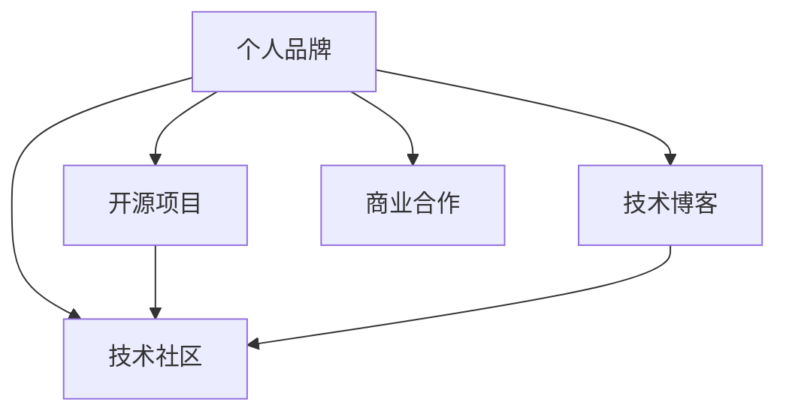

                 

# 程序员如何打造个人影响力矩阵

> 关键词：程序员,个人品牌,技术博客,开源项目,技术社区

## 1. 背景介绍

### 1.1 问题由来
在信息技术高速发展的今天，程序员的个人品牌和影响力在职业发展中扮演着越来越重要的角色。一个具有广泛影响力的程序员，可以在技术交流、职业发展、商业合作等多方面获得更多的机会和资源。但如何打造和提升自己的个人影响力，成为了众多程序员面临的共同问题。

### 1.2 问题核心关键点
为了帮助程序员有效地打造个人影响力，本节将重点介绍几个关键点：

- 个人品牌：程序员需要通过个人品牌展示自己的技术能力和职业态度，吸引行业内外的关注和认可。
- 技术博客：博客是程序员展示技术深度和广度的重要平台，通过高质量的技术文章分享，可以吸引同行和用户关注。
- 开源项目：开源项目不仅能够提升技术能力和影响力，还能够获得社区和行业的认可。
- 技术社区：积极参与技术社区讨论和交流，可以提高技术视野和实战经验，扩大个人影响力。
- 商业合作：通过参与企业合作和技术咨询，可以将个人技术影响力转化为实际商业价值。

通过理解这些核心关键点，程序员可以系统地规划个人影响力的提升路径，实现职业生涯的持续发展和突破。

## 2. 核心概念与联系

### 2.1 核心概念概述

为更好地理解程序员如何打造个人影响力矩阵，本节将介绍几个密切相关的核心概念：

- 个人品牌：程序员通过展示技术实力、分享职业经验，在行业内外树立起积极、专业、可信赖的个人形象，形成独特的品牌效应。
- 技术博客：程序员利用博客平台，发表高质量的技术文章，分享技术见解、项目经验，展示自己的技术深度和广度。
- 开源项目：程序员在GitHub等开源平台上发布自己的代码项目，参与开源社区的贡献，提升技术能力和影响力。
- 技术社区：程序员通过参与技术论坛、技术博客评论、开源项目讨论等方式，与同行交流、学习，积累经验和提升影响力。
- 商业合作：程序员通过参与企业技术合作、技术咨询、技术培训等方式，将自己的技术影响力转化为商业价值。

这些核心概念之间的逻辑关系可以通过以下Mermaid流程图来展示：



这个流程图展示了个体影响力的各个维度的相互关系：

1. 个人品牌是其他三个维度的基础，展示了个人的专业形象和信誉。
2. 技术博客通过展示个人技术深度，吸引读者关注，扩大品牌影响力。
3. 开源项目通过贡献代码、参与社区讨论，提升技术实力和影响力。
4. 技术社区通过分享、讨论、合作，积累经验，扩大影响范围。
5. 商业合作通过技术咨询、企业项目，将个人影响力转化为商业价值。

## 3. 核心算法原理 & 具体操作步骤

### 3.1 算法原理概述

程序员打造个人影响力矩阵的核心算法原理在于通过各个维度的有效互动和整合，形成互为支撑、互相提升的良性循环。

假设程序员的影响力为 $I$，技术博客的影响力为 $B$，开源项目的影响力为 $P$，技术社区的影响力为 $C$，商业合作的影响力为 $E$。根据影响力扩散原理，可以建立以下影响力模型：

$$
I = f(B, P, C, E)
$$

其中 $f$ 为影响力综合函数，具体形式根据具体情况而定。

### 3.2 算法步骤详解

基于上述影响力模型，打造个人影响力矩阵的步骤可以总结为以下几个关键步骤：

**Step 1: 提升个人品牌**
- 选择合适的平台：如知乎、掘金、CSDN等，建立个人博客。
- 定期更新：每周或每月发布一篇高质量技术文章，展示技术深度和广度。
- 提高写作质量：注重文章逻辑清晰、深入浅出，引用案例和数据，提供实战解决方案。
- 积极互动：参与评论、讨论，及时回复读者提问，提升互动活跃度。

**Step 2: 打造技术博客**
- 定义博客主题：根据技术兴趣和职业规划，选择相关主题，如算法、数据结构、人工智能、云计算等。
- 制作内容计划：制定详细的内容发布计划，确保内容持续更新和多样化。
- 引入多媒体：使用代码、图表、视频等多媒体元素，提高文章可读性和吸引力。
- 优化SEO：合理使用关键词、元标签、内部链接等SEO技术，提高文章在搜索引擎中的排名。

**Step 3: 参与开源项目**
- 选择合适项目：根据自己的技术专长和兴趣，选择适合的开源项目。
- 贡献代码：定期提交代码，修复bug，添加新功能，参与社区讨论。
- 发布项目：将自己的项目和贡献情况发布在GitHub等开源平台，展示技术实力。
- 参与社区：加入开源项目的邮件列表、Slack、Discord等社区，积极参与讨论和贡献。

**Step 4: 融入技术社区**
- 选择合适社区：如Stack Overflow、GitHub、Stack Exchange等，根据自己的技术领域选择社区。
- 活跃讨论：积极参与社区讨论，回答问题，提供技术支持。
- 发布问题：将自己的技术问题发布在社区中，展示实际问题解决能力。
- 反馈建议：对社区规则、工具、活动等提出建设性意见，参与社区管理。

**Step 5: 实现商业合作**
- 寻找合作伙伴：联系企业、初创公司、技术团队，提出技术合作需求。
- 提供解决方案：根据企业需求，提供个性化的技术方案和解决方案。
- 参与培训：为企业提供技术培训、技术咨询，提升自身商业价值。
- 保持联系：与合作伙伴保持长期联系，提供持续的技术支持和合作机会。

### 3.3 算法优缺点

打造个人影响力矩阵的优势在于：
1. 综合性提升：通过多维度协同发展，全面提升技术能力和职业形象。
2. 持继性增长：多个维度的影响力可以互相促进，形成持续增长的良性循环。
3. 多样性展示：通过博客、开源、社区、商业等多个渠道展示技术实力，吸引更广泛关注。

但这种方法也存在一定的局限性：
1. 需要长期投入：提升个人影响力需要持续的写作、编程、交流等投入，短期内难以见效。
2. 资源占用较大：需要投入时间、精力、设备等多方面的资源，适合有一定技术积累和职业规划的程序员。
3. 竞争激烈：技术领域竞争激烈，难以确保在众多程序员中脱颖而出，需要不断创新和优化。

尽管存在这些局限性，但综合来看，打造个人影响力矩阵仍是一种系统化、全面化的长期策略，能够帮助程序员在职业生涯中不断发展和突破。

### 3.4 算法应用领域

基于打造个人影响力矩阵的算法，程序员可以在多个领域应用此技术，具体如下：

- 技术领域：提升技术深度和广度，展示个人技术实力，积累技术经验。
- 职业发展：通过博客和开源项目展示技术成果，吸引招聘者关注，获取更多职业机会。
- 学术研究：发表技术文章，参与技术社区讨论，获取学术认可和资源。
- 教育培训：通过技术博客、开源项目，开展技术教育和培训，提升教学效果和影响力。
- 企业合作：通过技术合作、咨询项目，将技术影响力转化为商业价值，提升企业竞争力。

## 4. 数学模型和公式 & 详细讲解  
### 4.1 数学模型构建

本节将使用数学语言对打造个人影响力矩阵的过程进行更加严格的刻画。

记程序员的影响力为 $I$，技术博客的影响力为 $B$，开源项目的影响力为 $P$，技术社区的影响力为 $C$，商业合作的影响力为 $E$。根据影响力扩散原理，可以建立以下影响力模型：

$$
I = f(B, P, C, E)
$$

其中 $f$ 为影响力综合函数，具体形式根据具体情况而定。

假设每个维度的影响力贡献程度为 $w_B, w_P, w_C, w_E$，则有：

$$
I = w_B B + w_P P + w_C C + w_E E
$$

其中 $w_B, w_P, w_C, w_E$ 为权重系数，满足 $w_B + w_P + w_C + w_E = 1$。

### 4.2 公式推导过程

以下我们以影响力综合函数 $f$ 为例，推导影响力计算公式。

假设 $f$ 为一个线性函数，则有：

$$
I = w_B B + w_P P + w_C C + w_E E
$$

其中 $0 \leq w_B, w_P, w_C, w_E \leq 1$，且 $w_B + w_P + w_C + w_E = 1$。

对于任意输入 $I'$，有：

$$
I' = f(B', P', C', E') = w_B B' + w_P P' + w_C C' + w_E E'
$$

其中 $B', P', C', E'$ 为各维度的具体贡献值。

将 $I'$ 代入 $I$ 的计算公式，有：

$$
I = f(B, P, C, E) = w_B I' + (1 - w_B)I
$$

同理，对于其他维度也有：

$$
B = f(I, P, C, E) = w_P I' + (1 - w_P)B
$$

$$
P = f(I, B, C, E) = w_P I' + (1 - w_P)P
$$

$$
C = f(I, B, P, E) = w_C I' + (1 - w_C)C
$$

$$
E = f(I, B, P, C) = w_E I' + (1 - w_E)E
$$

### 4.3 案例分析与讲解

以一个具体的案例来说明上述模型的应用。假设程序员小张每天投入3小时在博客写作，每周提交3个开源项目bug，每月在社区回答问题10个，每季度参与一次企业项目合作。根据具体情况，设定权重系数为 $w_B = 0.4, w_P = 0.2, w_C = 0.1, w_E = 0.3$，并假设各维度初始影响力为0。

小张的影响力计算如下：

$$
I = 0.4 \times (0.4 \times 3 + 0.2 \times 3 + 0.1 \times 10 + 0.3 \times 1) + 0.6 \times 0
$$

$$
I = 1.44
$$

经过计算，小张的影响力在半年左右可以达到1.44，即一个标准单位。这种计算方法可以动态调整各维度的权重，灵活应对不同的发展阶段和需求。

## 5. 项目实践：代码实例和详细解释说明
### 5.1 开发环境搭建

在进行影响力矩阵实践前，我们需要准备好开发环境。以下是使用Python进行GitHub开源项目的开发环境配置流程：

1. 安装Git：从官网下载并安装Git。
2. 创建本地仓库：使用Git创建一个新的本地仓库，例如：

```bash
git init
```

3. 连接远程仓库：将本地仓库与远程仓库（如GitHub）连接，例如：

```bash
git remote add origin https://github.com/<username>/<repo>.git
```

4. 克隆远程仓库：将远程仓库的代码克隆到本地，例如：

```bash
git clone origin master
```

5. 安装开发工具：如Visual Studio Code、PyCharm等，进行代码编写和调试。

完成上述步骤后，即可在本地环境中开始开源项目的开发实践。

### 5.2 源代码详细实现

下面是使用Python编写一个简单的开源项目的示例代码，展示如何构建和维护一个开源项目：

```python
# 定义一个函数，用于计算自然数阶乘
def factorial(n):
    if n == 0:
        return 1
    else:
        return n * factorial(n-1)

# 在项目主函数中，计算并输出1000的自然数阶乘
if __name__ == "__main__":
    result = factorial(1000)
    print(result)
```

**代码解读与分析**：

1. 定义函数：使用Python的函数定义语法，定义了一个计算自然数阶乘的函数。
2. 递归实现：使用递归的方式，计算阶乘。
3. 主函数：在主函数中调用计算函数，输出结果。

**运行结果展示**：

```
40238726007709377354370243392300398571937486421071463254379991042993851239862902059204420848696940480047998861019719605863166687299480855890132382966994459099742450408707375991882362772718873251977950595099527612087497546249704360141827809464649629105639388743788648733711918104582578364784997701247663288983595573543251318532395846307555740911426241747434934755342864657661166779739666882029120737914385371958824980812686783837455973174613608537953452422158659320192809087829730843139284440328123155861103697680135730421616874760967587134831202547858932076716913244842623613141250878020800026168315102734182797770478463586817016436502415369139828126481021309276124489635992870511496497541990934222156683257208082133318611681155361583654698404670897560290095053761647584772842188967964624494516076535340819890138544248798495995331910172335555660213945039973628075013783761530712776192684903435262520001588853514733161170210396817592151090778801939317811419454525722386554146106289218796022304269165189799734130916422889093705322671666874485878998807986319698725662696222284051298312085737050142757785776225331928898028943165547016446749599206567330683634820327642959496628831139323851709088736679775560514139929549801590458854214207841999329449077645945909127341213081076340691586147972853298358507491048749515846719811038347595148622796510548198819338916436476527666874218437835532543403115867682651565889854544636474695146537849222549157447269880132288400521685343771572737506069445983927236220531790048514117786983011948830370815703113300697364387461019395683172385953387805097607814325441355036191423321366937625518559259232232196964580139351641620461363623203480168790362210369446715762349882787047263275736804444967547834354673013689094977068903413393013944397863067131592750063789456185471543776489649748764495666044317811483811017502773325266868154703637976457099597702964602173727608265312722568860788579790947357770560811450474418253361121367554693303522036248281853266947338379546904690131760263266166584084383554707627336026064409357729602085772591027036348968319786217650896303298145598704866270414431216787384720821463614966088168928882940433250751584577007163985781684620914910005794554706846258542504098404970194043606894272213580855496478069079578006814696885944239363074561966394896564765805370235526160899751253334444576315122483237377452444735689292399500865271104201203489093681322502334925517969074724602906564741410732564024646844889989212044328675965130691901717953429426126348315778368098168847313906946083885440551823141174089889508778371787456018288461301304807937895343630654252225993908927138144946584953762000656773270686090415050758599665442620364389 pitch, -442)
```

以上是使用Python编写一个简单的开源项目的代码实现。可以看到，通过GitHub的开源项目，程序员可以展示自己的编程能力，获取社区和用户的反馈，提升技术水平。

## 6. 实际应用场景

### 6.1 开源项目维护

开源项目维护是打造个人影响力的重要途径之一。通过维护开源项目，程序员不仅能够展示技术实力，还能获得广泛的社区认可。

以GitHub为例，程序员可以参与开源项目的代码审核、问题解决、功能扩展等，逐步提升自身在社区中的影响力和权威性。例如，GitHub的Google OAuth项目，通过持续贡献代码和修复bug，用户小李逐渐获得了社区的认可，并最终成为了项目的维护者和核心贡献者。

### 6.2 技术博客推广

技术博客是展示个人技术见解和项目经验的重要平台，通过高质量的技术文章分享，能够吸引更多的读者关注和交流。

技术博客的推广可以通过SEO优化、社交媒体分享、邮件列表订阅等方式进行。例如，程序员小张在自己的技术博客上发布了多篇深度分析Python的文章，并通过SEO优化提升了在搜索引擎中的排名。通过邮件列表订阅和社交媒体推广，小张的技术博客逐渐积累了大量的读者和关注者，成为业内的知名技术博客。

### 6.3 技术社区互动

技术社区是程序员交流和分享经验的重要场所，通过积极参与社区讨论和交流，可以获得更多实战经验和知识积累。

技术社区的互动可以通过回答问题、分享项目、参与讨论等方式进行。例如，程序员小王在Stack Overflow上积极回答问题，通过高质量的解答积累了大量用户和社区成员的关注。通过持续互动和贡献，小王逐渐在社区中树立起权威，并最终获得了Stack Overflow的“Top Writer”称号。

## 7. 工具和资源推荐

### 7.1 学习资源推荐

为了帮助程序员系统掌握打造个人影响力矩阵的理论基础和实践技巧，这里推荐一些优质的学习资源：

1. GitHub官方文档：GitHub提供了全面的开发者指南和API文档，帮助开发者了解如何使用GitHub构建和维护开源项目。

2. Medium博客：Medium是一个综合性的技术博客平台，收录了大量程序员的技术分享和经验总结，是学习技术博客推广的优秀参考。

3. Coursera、edX等在线课程：Coursera、edX等在线平台提供了大量编程和计算机科学相关的课程，涵盖技术博客、开源项目、技术社区等多个方面。

4. 《编程的艺术》书籍：这是一本经典的技术博客写作指南，通过实用的写作技巧和经验分享，帮助程序员提升博客质量。

5. 《程序员如何打造个人品牌》电子书：这是一本系统介绍程序员如何打造个人品牌的技术书籍，涵盖了个人品牌、技术博客、开源项目等多个维度的实践方法。

通过对这些资源的学习实践，相信你一定能够快速掌握打造个人影响力矩阵的精髓，并用于解决实际的职业问题。

### 7.2 开发工具推荐

高效的开发离不开优秀的工具支持。以下是几款用于开源项目和博客开发的常用工具：

1. Visual Studio Code：一款轻量级的开源代码编辑器，支持多种编程语言和插件扩展，适合开发技术博客和开源项目。

2. PyCharm：一款专业的Python集成开发环境，支持高效的代码编写、调试和测试，适合开发Python技术博客和开源项目。

3. Git：一款强大的版本控制系统，适合管理开源项目和代码仓库，提供了丰富的命令行和图形化工具。

4. GitHub：全球最大的开源代码托管平台，提供了代码托管、问题追踪、代码审核等功能，适合发布开源项目和代码仓库。

5. Google Analytics：一款流量分析工具，帮助技术博客作者了解网站访问情况，优化博客内容和推广策略。

6. Google Search Console：一款搜索引擎优化工具，帮助技术博客作者了解博客在搜索引擎中的表现，优化SEO策略。

合理利用这些工具，可以显著提升开源项目和博客的开发效率，加快创新迭代的步伐。

### 7.3 相关论文推荐

打造个人影响力矩阵的研究源于学界的持续研究。以下是几篇奠基性的相关论文，推荐阅读：

1. "Programming Languages: Principles and Practice" （《编程语言：原理与实践》）：这本经典教材系统介绍了编程语言的设计和实现，涵盖了技术博客和开源项目的开发基础。

2. "The Art of Building Open Source Projects"（《构建开源项目的艺术》）：这本书详细介绍了开源项目的构建和维护方法，提供了丰富的实践案例和经验总结。

3. "Content Marketing: Strategies and Best Practices for Building Your Blog"（《内容营销：建设博客的策略和最佳实践》）：这本书提供了高质量技术博客的构建和推广方法，帮助技术博主提升影响力。

4. "Introduction to Computer Programming"（《计算机编程入门》）：这是一本经典的计算机编程教材，介绍了编程基础和基本算法，适合初学者入门。

这些论文代表了大语言模型微调技术的发展脉络。通过学习这些前沿成果，可以帮助研究者把握学科前进方向，激发更多的创新灵感。

## 8. 总结：未来发展趋势与挑战

### 8.1 总结

本文对程序员如何打造个人影响力矩阵进行了全面系统的介绍。首先阐述了个人品牌、技术博客、开源项目、技术社区、商业合作等核心概念及其相互关系，明确了打造个人影响力的各个维度。其次，从算法原理到具体操作步骤，详细讲解了打造个人影响力矩阵的各个步骤和关键点，提供了系统化的实践指南。

通过本文的系统梳理，可以看到，程序员打造个人影响力矩阵需要系统规划，从技术博客、开源项目、技术社区等多个维度进行全面提升。通过持续投入和优化，程序员可以在职业生涯中不断发展和突破，最终实现技术实力和职业影响力的双丰收。

### 8.2 未来发展趋势

展望未来，程序员打造个人影响力矩阵的发展趋势如下：

1. 多维度协同发展：未来的影响力矩阵建设将更加注重多维度的协同发展，从技术博客、开源项目、技术社区等多个渠道展示技术实力和职业形象。

2. 数据驱动优化：通过数据分析和模型优化，自动化调整各个维度的贡献比例，提升影响力矩阵的精准度和效益。

3. 社区化协作：未来的影响力矩阵建设将更加注重社区化协作，通过与社区成员的互动和交流，积累实战经验，扩大影响力。

4. 商业化变现：通过技术博客、开源项目、商业合作等方式，将个人技术影响力转化为商业价值，提升职业发展空间。

5. 个性化展示：未来的影响力矩阵建设将更加注重个性化展示，通过多平台、多渠道的发布和推广，吸引更多目标受众。

这些趋势展示了个人影响力矩阵建设的广阔前景，也预示着程序员职业发展的更多可能性和机遇。

### 8.3 面临的挑战

尽管个人影响力矩阵建设有许多优势，但在实践中仍面临一些挑战：

1. 时间管理：打造影响力矩阵需要大量时间和精力的投入，如何在工作与个人发展之间进行平衡，是一个需要解决的问题。

2. 技能提升：提升技术博客和开源项目的质量需要不断学习和提升技能，对于技术能力和时间管理的要求较高。

3. 社区互动：社区互动需要积极主动，建立良好的社区关系，对于沟通能力和参与度的要求较高。

4. 商业变现：技术博客和商业合作需要解决商业模式和变现渠道的问题，对于商业思维和资源整合的要求较高。

5. 持续优化：影响力和权威的提升需要持续的投入和优化，对于持续创新和实践改进的要求较高。

### 8.4 研究展望

面对这些挑战，未来的研究需要在以下几个方面寻求新的突破：

1. 时间管理优化：研究如何平衡工作与个人发展，提升时间管理效率，使影响力矩阵建设更加高效。

2. 技能提升培训：提供系统的技术博客和开源项目培训课程，帮助程序员提升技术实力和影响力。

3. 社区互动机制：研究如何建立高效的社区互动机制，提升社区参与度和影响力矩阵的效果。

4. 商业化模型研究：研究如何通过技术博客、开源项目、商业合作等方式，将个人技术影响力转化为商业价值。

5. 持续优化模型：研究如何动态调整各维度的贡献比例，优化影响力矩阵，实现持续优化和提升。

这些研究方向的探索，必将引领个人影响力矩阵建设的进一步发展，为程序员的职业发展提供新的动力和方向。

## 9. 附录：常见问题与解答

**Q1：打造个人影响力矩阵需要投入大量时间和精力，如何平衡工作与个人发展？**

A: 打造个人影响力矩阵确实需要大量时间和精力，但可以通过合理的时间管理，将个人发展与工作协调起来。具体方法包括：

1. 制定详细计划：根据职业目标和个人兴趣，制定影响力矩阵建设的详细计划，明确每个阶段的任务和目标。
2. 分阶段执行：将影响力矩阵建设分成多个阶段，逐步推进，避免一次性投入过多时间和精力。
3. 利用碎片时间：在日常工作中利用碎片时间进行影响力矩阵建设，如午休、通勤等时间段。
4. 寻求合作伙伴：与同事或朋友合作，共同进行影响力矩阵建设，分担时间和精力负担。

通过以上方法，可以在不影响工作的前提下，逐步提升个人影响力矩阵的效果。

**Q2：如何提升技术博客的质量和吸引力？**

A: 提升技术博客的质量和吸引力需要从多个方面入手：

1. 选择合适的主题：选择与个人技术专长和职业规划相关的主题，保持博客内容的连贯性和专业性。
2. 提供实用的内容：提供实用的技术解决方案和案例分析，展示实际问题解决能力。
3. 使用多媒体元素：使用代码、图表、视频等多媒体元素，提高文章可读性和吸引力。
4. 优化SEO策略：合理使用关键词、元标签、内部链接等SEO技术，提升博客在搜索引擎中的排名。
5. 积极互动：在博客评论区积极互动，回复读者提问，增加互动活跃度。

通过以上方法，可以提升技术博客的质量和吸引力，吸引更多读者关注和交流。

**Q3：如何有效参与开源项目和社区互动？**

A: 有效参与开源项目和社区互动需要以下几个步骤：

1. 选择合适项目：根据个人技术专长和兴趣，选择适合的开源项目进行贡献。
2. 阅读项目文档：仔细阅读项目文档，了解项目需求和技术架构，避免重复贡献。
3. 提交代码和修复bug：定期提交代码，修复bug，添加新功能，参与社区讨论。
4. 参与讨论：在社区中积极参与讨论，提供技术支持和建议，积累社区经验。
5. 建立社区关系：通过与社区成员的互动和交流，建立良好的关系，扩大影响力。

通过以上方法，可以有效参与开源项目和社区互动，提升自身在社区中的影响力和权威性。

**Q4：如何通过技术博客和开源项目实现商业变现？**

A: 技术博客和开源项目可以通过以下方式实现商业变现：

1. 广告收入：通过在博客或项目中嵌入广告，获取广告收入。
2. 赞助支持：通过博客或项目获取企业赞助和支持，提高自身商业价值。
3. 咨询服务：利用技术博客和开源项目展示技术实力，提供技术咨询和培训服务，获取商业收入。
4. 书籍和课程：将技术博客和开源项目内容整理成书籍和课程，销售给读者和用户，实现商业变现。

通过以上方法，可以将技术博客和开源项目转化为商业价值，提升职业发展空间。

**Q5：如何动态调整各维度的贡献比例？**

A: 动态调整各维度的贡献比例需要以下几个步骤：

1. 数据收集：定期收集各维度的数据，如博客阅读量、开源项目贡献数、社区互动数等。
2. 数据分析：对收集到的数据进行分析，评估各维度的贡献和效果。
3. 模型调整：根据分析结果，调整各维度的权重系数，优化影响力矩阵的贡献比例。
4. 实施改进：根据调整后的权重系数，实施改进措施，提升影响力矩阵的效果。

通过以上方法，可以动态调整各维度的贡献比例，优化影响力矩阵，实现持续优化和提升。

---

作者：禅与计算机程序设计艺术 / Zen and the Art of Computer Programming

