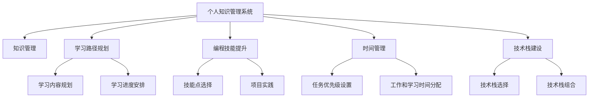

                 

# 程序员如何打造个人知识管理系统

> 关键词：个人知识管理, 编程技能提升, 学习路径规划, 时间管理, 技术栈建设, 知识共享与合作

## 1. 背景介绍

在当今快速发展的技术环境中，持续学习和自我提升是每个程序员必须面对的挑战。大量有用的知识散落在互联网的各个角落，如何快速地发现、整理和应用这些知识，成为了一个关键问题。个人知识管理系统的构建，成为每个有志于成为优秀程序员的必备技能。本文章将详细探讨如何利用技术手段打造高效实用的个人知识管理系统，助你在技术征途中一臂之力。

## 2. 核心概念与联系

### 2.1 核心概念概述

在构建个人知识管理系统时，需要明确以下核心概念：

- **个人知识管理系统 (PKMS)**：指用于管理和组织个人知识库的软件工具，旨在帮助用户高效地存储、检索、更新和使用各类知识。
- **知识管理**：指通过整合、共享、迭代和应用各类信息，提升个人和团队的知识水平和学习效率的实践。
- **学习路径规划**：指根据个人兴趣和职业发展目标，合理规划学习内容和进度，提升学习效果。
- **编程技能提升**：指通过系统化的学习计划和实践，不断更新和精进编程技能，适应技术变革。
- **时间管理**：指通过合理安排工作和学习的优先级，高效利用时间，提升工作效率和学习效率。
- **技术栈建设**：指根据项目需求和职业规划，合理选择和组合技术栈，构建完整的技术知识体系。

这些概念相互联系，共同构成了个人知识管理的核心框架。通过理解这些概念，我们能够更好地规划个人知识管理系统的构建过程，并将其作为实现职业目标的工具。

### 2.2 核心概念原理和架构的 Mermaid 流程图



该图展示了个人知识管理系统与其他关键概念之间的联系：通过知识管理整合各类信息，学习路径规划确定学习内容，编程技能提升提升技能水平，时间管理优化时间分配，技术栈建设完善技术体系。

## 3. 核心算法原理 & 具体操作步骤

### 3.1 算法原理概述

个人知识管理系统的构建，主要依赖于信息检索和组织算法。核心算法包括但不限于：

- **信息检索算法**：用于高效地从知识库中检索所需信息，常见的算法包括倒排索引、哈希表、向量空间模型等。
- **信息组织算法**：用于合理地组织和管理各类信息，常见的算法包括分类算法、聚类算法、关联规则挖掘等。
- **学习推荐算法**：用于根据用户的学习历史和兴趣推荐相关内容，常见的算法包括协同过滤、内容推荐、强化学习等。

这些算法相互配合，共同构建起一个高效、实用的个人知识管理系统。

### 3.2 算法步骤详解

构建个人知识管理系统的具体步骤如下：

1. **需求分析**：明确个人知识管理系统的目标和需求，包括知识分类、检索、组织和推荐等功能。
2. **系统设计**：设计系统的整体架构，包括信息存储、检索、组织和推荐等模块，选择合适的技术栈和工具。
3. **数据收集**：收集和整理各类知识，如代码片段、技术文章、学习笔记等。
4. **数据处理**：对收集的数据进行清洗、分类和标注，确保数据质量和一致性。
5. **系统实现**：根据设计方案，实现信息检索、组织和推荐等功能模块，并进行单元测试和集成测试。
6. **系统优化**：根据实际使用情况，不断优化系统性能和用户体验，引入新的算法和技术。

### 3.3 算法优缺点

构建个人知识管理系统的算法，具有以下优点：

- **高效检索**：能够快速定位到所需知识，提高学习和工作效率。
- **全面组织**：将各类信息合理组织，便于管理和维护。
- **智能推荐**：根据用户兴趣和历史行为推荐相关内容，提升学习效果。

但同时，也存在一些缺点：

- **数据收集复杂**：需要大量的时间和精力收集和整理数据。
- **算法复杂性**：算法设计和实现需要较高的技术门槛。
- **系统维护成本高**：系统需要不断更新和优化，维护成本较高。

### 3.4 算法应用领域

个人知识管理系统的算法和架构，广泛应用于各类知识管理场景：

- **个人学习管理**：如构建个人技术博客，记录学习笔记和心得。
- **项目协作**：如使用Jira、Trello等工具，管理团队项目和任务。
- **技术文档管理**：如维护技术栈文档，记录项目规范和技术细节。
- **知识共享**：如使用Wiki、Confluence等工具，实现团队内部知识的共享和协作。
- **时间管理**：如使用Todoist、Notion等工具，规划任务优先级和时间分配。

## 4. 数学模型和公式 & 详细讲解 & 举例说明

### 4.1 数学模型构建

个人知识管理系统的核心模型包括：

- **知识图谱模型**：用于表示知识和知识之间的关系，常见的表示方法包括图灵机、知识图等。
- **用户行为模型**：用于描述用户的行为和偏好，常见的表示方法包括马尔可夫链、隐马尔可夫模型等。
- **推荐算法模型**：用于根据用户行为和兴趣推荐相关内容，常见的模型包括协同过滤、矩阵分解、神经网络等。

### 4.2 公式推导过程

以协同过滤推荐算法为例，推导推荐公式：

设用户集合为 $U$，物品集合为 $I$，用户对物品的评分矩阵为 $R_{ui}$，用户 $u$ 对物品 $i$ 的评分和其邻域用户 $v$ 对物品 $i$ 的评分的平均值之间存在相关性，即：

$$
\hat{R}_{ui} = \frac{\sum_{v\in N_u}R_{vi}\cdot R_{uv}}{\sqrt{\sum_{v\in N_u}R_{vi}^2}\sqrt{\sum_{v\in N_u}R_{uv}^2}}
$$

其中，$N_u$ 表示用户 $u$ 的邻域集合。

### 4.3 案例分析与讲解

假设我们构建了一个用于记录个人编程学习笔记的知识管理系统，数据包括学习笔记的标题、内容和标签。我们使用TF-IDF算法对标题和内容进行文本处理，构建倒排索引，使用基于TF-IDF的相似度计算算法进行信息检索。同时，引入基于协同过滤的推荐算法，根据用户的学习历史和兴趣，推荐相关的学习笔记。

## 5. 项目实践：代码实例和详细解释说明

### 5.1 开发环境搭建

开发环境搭建包括选择编程语言、框架和工具，以下是Python+Flask+MongoDB的示例：

1. **Python**：选择Python作为编程语言，安装最新版本的Python环境。
2. **Flask**：用于构建Web应用，提供一个简单易用的Web接口。
3. **MongoDB**：作为数据存储，方便数据的增删改查。

### 5.2 源代码详细实现

以下是Flask+MongoDB实现个人知识管理系统的示例代码：

```python
from flask import Flask, request, jsonify
from pymongo import MongoClient
import tensorflow as tf

app = Flask(__name__)

# 连接MongoDB数据库
client = MongoClient('mongodb://localhost:27017/')
db = client['pkms']
collection = db['notes']

# 定义数据模型
class Note:
    def __init__(self, title, content, tags):
        self.title = title
        self.content = content
        self.tags = tags

# 定义路由
@app.route('/notes', methods=['POST'])
def add_note():
    data = request.get_json()
    note = Note(data['title'], data['content'], data['tags'])
    collection.insert_one(note.to_dict())
    return jsonify({'message': 'Note added successfully'})

@app.route('/notes', methods=['GET'])
def get_notes():
    query = request.args.get('q')
    if query:
        results = collection.find({'$or': [{'title': {'$regex': query}}, {'content': {'$regex': query}}]})
    else:
        results = collection.find()
    return jsonify([note.to_dict() for note in results])

# 启动Flask应用
if __name__ == '__main__':
    app.run(debug=True)
```

### 5.3 代码解读与分析

该代码实现了一个简单的Web服务，用于管理个人学习笔记。用户可以通过API进行笔记的添加和查询。

- `Note`类用于存储笔记的基本信息，如标题、内容和标签。
- `add_note`函数用于向数据库中添加新笔记，通过`to_dict()`方法将`Note`对象转换为字典，方便存储。
- `get_notes`函数用于查询笔记，支持模糊查询。

### 5.4 运行结果展示

运行上述代码后，可以通过访问`localhost:5000`来查看API接口，测试笔记的添加和查询功能。

## 6. 实际应用场景

### 6.1 编程学习记录

程序员可以利用个人知识管理系统，记录学习新技术、阅读技术文章和编写代码的经验。通过分类和标签化，便于后续的检索和复习。

### 6.2 项目协作

在团队开发中，个人知识管理系统可以作为协作工具，记录项目进展、讨论记录和问题反馈。通过文档管理和版本控制，团队成员可以高效地共享知识和协作开发。

### 6.3 技术文档管理

技术文档管理系统可以用于记录项目规范、技术细节和内部文档。通过结构化存储和分类，便于查找和更新。

### 6.4 时间管理

时间管理工具可以与个人知识管理系统结合，记录任务优先级、时间分配和学习进度。通过智能推荐，推荐高效的学习路径和时间分配策略。

### 6.5 知识共享与合作

个人知识管理系统也可以作为知识共享平台，团队成员可以上传共享自己的学习笔记、技术文章和项目文档。通过评论和讨论功能，促进知识的交流和合作。

## 7. 工具和资源推荐

### 7.1 学习资源推荐

- **GitHub**：大量开源项目和代码库，是学习编程技能和分享知识的好地方。
- **Stack Overflow**：编程社区，可以查找问题、分享经验和获取建议。
- **Coursera、Udacity**：在线课程平台，提供系统化的学习资源和认证课程。
- **LeetCode、HackerRank**：编程挑战平台，通过编程练习提升编程技能。

### 7.2 开发工具推荐

- **Jupyter Notebook**：基于Web的交互式编程环境，适合数据处理和算法实验。
- **Visual Studio Code**：轻量级的IDE，支持代码高亮、调试和插件扩展。
- **Git**：版本控制系统，方便代码管理和协作开发。
- **Docker**：容器化技术，便于构建可移植的开发环境。

### 7.3 相关论文推荐

- **"KDD Cup 2019 Recommendation Challenge"**：推荐系统竞赛，展示了协同过滤算法在实际应用中的效果。
- **"Deep Learning for Recommender Systems"**：深度学习在推荐系统中的应用，介绍了多个深度学习推荐算法。
- **"Information Retrieval"**：信息检索经典教材，详细介绍了信息检索的基本概念和算法。

## 8. 总结：未来发展趋势与挑战

### 8.1 研究成果总结

个人知识管理系统在技术学习和项目管理中发挥了重要作用，通过合理规划学习路径、优化时间管理和构建完整技术栈，显著提升了程序员的学习效率和工作效率。

### 8.2 未来发展趋势

未来个人知识管理系统将呈现以下趋势：

- **智能化推荐**：引入机器学习和深度学习技术，提升推荐算法的精准度和个性化。
- **知识图谱**：通过构建知识图谱，实现更加全面的知识关联和跨领域知识的整合。
- **跨平台协作**：通过云端技术，实现跨平台、跨设备的知识管理和协作。
- **自动文档生成**：利用自然语言处理技术，自动生成技术文档和代码注释。
- **情感分析**：通过情感分析技术，评估学习效果和知识管理系统的用户满意度。

### 8.3 面临的挑战

个人知识管理系统的构建和维护，面临以下挑战：

- **数据隐私**：如何确保数据安全和隐私保护，防止敏感信息泄露。
- **系统扩展**：如何设计可扩展的系统架构，支持大规模数据和高并发访问。
- **用户粘性**：如何提升用户粘性，促进知识管理系统的高效使用。
- **知识更新**：如何及时更新和维护知识库，确保知识的准确性和时效性。

### 8.4 研究展望

未来研究将重点关注以下方面：

- **用户行为分析**：通过数据挖掘和机器学习，分析用户行为和学习效果，优化知识推荐和个性化学习路径。
- **多模态知识管理**：引入多模态数据（如代码、文档、图像等），实现全面的知识管理。
- **跨领域知识融合**：探索不同领域知识之间的整合和关联，构建跨学科的知识体系。
- **知识工程和智能化**：通过知识工程和人工智能技术，实现知识的自动化和智能化管理。
- **社交学习**：通过社交网络，实现知识的共享和协作，增强团队学习效果。

## 9. 附录：常见问题与解答

**Q1：个人知识管理系统的构建需要多少时间和精力？**

A: 个人知识管理系统的构建需要投入大量时间和精力，但初期投入越充分，后续使用和维护的效率越高。建议投入时间不少于100小时。

**Q2：如何选择合适的个人知识管理系统？**

A: 选择合适的个人知识管理系统，需要考虑以下几个因素：
1. **适用场景**：根据个人需求和职业规划，选择功能完备且易用的工具。
2. **学习成本**：选择易学易用的工具，避免过高的学习曲线。
3. **扩展性**：选择可扩展的工具，满足未来技术需求和数据增长。
4. **社区支持**：选择有活跃社区和用户支持的工具，方便问题解决和经验分享。

**Q3：如何提升个人知识管理系统的效率？**

A: 提升个人知识管理系统的效率，可以从以下几个方面入手：
1. **数据结构优化**：选择高效的数据结构和算法，减少查询和检索时间。
2. **分布式存储**：采用分布式存储技术，支持大规模数据管理。
3. **缓存机制**：引入缓存机制，减少数据库查询次数，提高响应速度。
4. **自动更新**：实现自动更新和数据同步，确保知识库的时效性。

**Q4：个人知识管理系统如何保护用户隐私？**

A: 保护用户隐私，需要采取以下措施：
1. **数据加密**：对敏感数据进行加密存储，防止数据泄露。
2. **权限控制**：设置严格的权限控制，限制对敏感数据的访问权限。
3. **匿名化处理**：对用户数据进行匿名化处理，防止数据追踪。
4. **安全审计**：定期进行安全审计，发现和修复潜在的安全漏洞。

**Q5：如何选择和使用合适的个人知识管理系统？**

A: 选择和使用合适的个人知识管理系统，需要遵循以下步骤：
1. **需求分析**：明确个人知识管理系统的目标和需求，列出关键功能和特性。
2. **市场调研**：通过市场调研，了解不同知识管理系统的优缺点，选择合适的工具。
3. **试用体验**：下载试用版，进行实际使用和体验，评估工具的易用性和功能完备性。
4. **购买决策**：根据试用体验和需求分析，进行购买决策，选择最合适的工具。

通过不断实践和改进，每位程序员都可以构建出适合自己的个人知识管理系统，有效提升个人学习效率和工作质量。相信本文所提供的方法和思路，将为你打造高效实用的个人知识管理系统提供有力帮助。

---

作者：禅与计算机程序设计艺术 / Zen and the Art of Computer Programming

