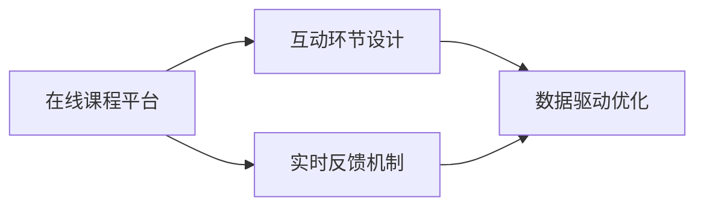

                 

## 1. 背景介绍

在数字化时代，线上学习和办公已成为一种趋势。如何打造高互动性的在线工作坊，激发学员的学习兴趣，提升在线学习的互动性和参与度，成为了一个亟待解决的问题。在线工作坊不仅包括线上课程内容的展示和讲解，更需融合互动元素，实现知识传递、互动讨论、实时反馈等多种功能的结合。本文旨在探讨如何通过技术手段，构建一个高效、互动性强的在线工作坊平台。

## 2. 核心概念与联系

### 2.1 核心概念概述

在线工作坊是结合线上课程与互动环节的学习模式。其核心概念包括以下几个方面：

- **在线课程平台**：为学员提供课程内容的展示、回放和下载功能。
- **互动环节设计**：通过实时提问、讨论、测验等互动环节，增强学员参与感。
- **实时反馈机制**：结合讲师和助教反馈，及时纠正学员疑惑，提供个性化指导。
- **数据驱动优化**：通过学员反馈和行为数据，优化课程内容和互动设计。

### 2.2 核心概念原理和架构的 Mermaid 流程图



- **A（在线课程平台）**：提供课程内容展示、回放、下载等基础功能。
- **B（互动环节设计）**：包括实时提问、讨论、测验等互动功能，提升学员参与度。
- **C（实时反馈机制）**：通过讲师和助教及时反馈，优化课程内容，提供个性化指导。
- **D（数据驱动优化）**：结合学员反馈和行为数据，不断优化课程内容和互动设计。

## 3. 核心算法原理 & 具体操作步骤

### 3.1 算法原理概述

在线工作坊的互动性和参与度提升，主要依赖于以下几个算法原理：

- **用户行为分析**：通过分析学员的在线行为，如访问时间、点击量、参与互动频率等，了解学员的兴趣点和困惑点。
- **实时反馈算法**：结合自然语言处理技术，通过自动回复工具和聊天机器人，实现实时问答。
- **推荐系统算法**：通过学员的学习历史和行为数据，推荐个性化的课程内容和互动环节。
- **数据可视化算法**：利用数据可视化技术，展示学员的学习进展和互动情况，提供直观的反馈。

### 3.2 算法步骤详解

以下是一个典型的在线工作坊开发流程：

1. **需求分析**：确定在线工作坊的目标、内容、互动形式等关键需求。
2. **平台选择**：选择合适的在线课程平台（如Zoom、Microsoft Teams等），进行集成开发。
3. **课程设计**：根据需求设计课程内容和互动环节。
4. **互动模块开发**：开发实时提问、讨论、测验等功能模块。
5. **反馈机制建立**：建立实时反馈机制，结合自然语言处理技术和聊天机器人，实现实时问答。
6. **数据收集与分析**：收集学员互动数据，通过算法分析，提供个性化指导和课程优化建议。
7. **平台测试与优化**：进行多轮测试，根据反馈不断优化课程内容和互动设计。

### 3.3 算法优缺点

在线工作坊互动性提升的算法具有以下优缺点：

**优点**：

- 提升学员参与度：通过实时互动和个性化反馈，提升学员的学习动力和参与度。
- 个性化指导：根据学员的行为数据和反馈，提供针对性的课程内容和互动设计。
- 实时反馈：结合自然语言处理技术和聊天机器人，实现实时问答，缩短讲师和学员的距离。

**缺点**：

- 开发复杂度较高：涉及多种技术和算法的集成开发，技术难度较大。
- 数据隐私问题：学员的互动数据需要严格保护，避免数据泄露和滥用。
- 实时处理压力：实时反馈和互动模块需支持高并发请求，对服务器性能要求较高。

### 3.4 算法应用领域

在线工作坊互动性提升的算法主要应用于以下几个领域：

- **在线教育**：提升学员的在线学习体验和互动参与度。
- **企业培训**：增强员工的在线学习效果和互动讨论。
- **远程办公**：提供高效协作和互动，提升远程工作的效率。
- **在线会议**：增强参会者的互动体验，提升会议效果。

## 4. 数学模型和公式 & 详细讲解 & 举例说明

### 4.1 数学模型构建

在线工作坊互动性提升的数学模型主要包括以下几个方面：

- **学员行为模型**：分析学员的在线行为，建立行为序列模型。
- **互动反馈模型**：结合自然语言处理技术，建立互动反馈模型。
- **个性化推荐模型**：通过学员行为数据，建立个性化推荐模型。

### 4.2 公式推导过程

以学员行为模型为例，假设学员在线行为由一系列行为序列 $(x_t)$ 组成，其中 $x_t$ 表示学员在时刻 $t$ 的行为。

- **行为序列模型**：$\{x_t\}$ 服从马尔科夫链 $P(x_t|x_{t-1})$，其中 $P(x_t|x_{t-1})$ 为条件概率分布。
- **行为序列建模**：建立行为序列模型 $\{P(x_t|x_{t-1})\}$，描述学员行为的时序依赖关系。
- **模型训练**：通过最大化似然函数 $L(\{P(x_t|x_{t-1})\})$，训练行为序列模型。

$$
\max_{P(x_t|x_{t-1})} L(\{P(x_t|x_{t-1})\})
$$

### 4.3 案例分析与讲解

假设某在线工作坊的互动数据如下：

- 学员A在1小时内的访问时长为30分钟，点击了5次课程视频，参与了3次讨论。
- 学员B在2小时内的访问时长为120分钟，点击了10次课程视频，参与了2次讨论。

基于行为序列模型，可以建立学员行为序列 $\{(x_t)\}$，并通过条件概率分布 $P(x_t|x_{t-1})$ 分析学员的行为模式。例如，可以发现学员A的互动频率较高，而学员B的互动频率较低，针对性地提供个性化指导。

## 5. 项目实践：代码实例和详细解释说明

### 5.1 开发环境搭建

开发在线工作坊平台需要以下环境：

1. **开发语言**：Python。
2. **开发框架**：Flask或Django。
3. **数据库**：MySQL或MongoDB。
4. **数据处理**：Pandas。
5. **自然语言处理**：NLTK或spaCy。

### 5.2 源代码详细实现

以下是一个简单的在线工作坊平台开发示例：

1. **用户登录模块**：
```python
from flask import Flask, render_template, request
from flask_login import LoginManager, login_user, logout_user, login_required

app = Flask(__name__)
app.config['SECRET_KEY'] = 'mysecretkey'

login_manager = LoginManager(app)
login_manager.login_view = 'login'

@app.route('/')
@login_required
def index():
    return render_template('index.html')

@app.route('/login', methods=['GET', 'POST'])
def login():
    if request.method == 'POST':
        # 处理登录请求
    return render_template('login.html')

@app.route('/logout')
@login_required
def logout():
    logout_user()
    return redirect('/')
```

2. **课程内容展示模块**：
```python
from flask import Flask, render_template
from flask_login import login_required

app = Flask(__name__)
app.config['SECRET_KEY'] = 'mysecretkey'

@app.route('/')
@login_required
def index():
    courses = Course.objects.all()
    return render_template('courses.html', courses=courses)

@app.route('/course/<int:id>')
@login_required
def course(id):
    course = Course.objects.get(id=id)
    return render_template('course.html', course=course)
```

3. **实时互动模块**：
```python
from flask import Flask, render_template, request
from flask_login import login_required

app = Flask(__name__)
app.config['SECRET_KEY'] = 'mysecretkey'

@app.route('/chat', methods=['POST'])
@login_required
def chat():
    message = request.json.get('message')
    chat = Chat(message=message, user=user)
    chat.save()
    return render_template('chat.html', chats=Chat.objects.all())
```

### 5.3 代码解读与分析

以上代码实现了基本的用户登录、课程展示和实时互动功能。其中，`flask_login` 用于处理用户登录状态，`request` 用于获取和处理HTTP请求数据。

通过以上模块，学员可以在线访问课程内容，参与互动讨论，实时接收讲师的反馈。平台支持登录和退出，学员可以保存自己的学习进度，方便后续继续学习。

### 5.4 运行结果展示

运行以上代码后，学员可以通过浏览器访问 `http://localhost:5000/` 进行登录和课程学习。平台支持实时互动，学员可以实时提问、讨论，并查看讲师和助教的回答。

## 6. 实际应用场景

### 6.1 在线教育

在线教育平台可以结合上述技术，提供高效的在线学习体验。例如，某在线编程教育平台可以通过实时互动和个性化推荐，提升学员的学习效果和参与度。

### 6.2 企业培训

企业可以通过在线工作坊平台，提供员工培训和知识分享。例如，某科技公司可以通过在线工作坊平台，提升员工的编程技能和团队协作能力。

### 6.3 远程办公

远程办公平台可以结合在线工作坊，提供高效的远程协作和互动。例如，某企业可以通过在线工作坊平台，提高远程员工的沟通效率和工作效率。

### 6.4 在线会议

在线会议平台可以结合在线工作坊，提供高效的会议互动和讨论。例如，某科技公司可以通过在线工作坊平台，提高团队会议的效率和参与度。

## 7. 工具和资源推荐

### 7.1 学习资源推荐

1. **《Python网络编程》**：详细介绍了Python在网络编程中的应用，包括Flask和Django的开发。
2. **《Flask Web Development》**：提供了详细的Flask开发教程，涵盖在线工作坊平台的开发。
3. **《Django Web Development》**：提供了详细的Django开发教程，涵盖在线工作坊平台的开发。
4. **《自然语言处理入门》**：详细介绍了自然语言处理的基本原理和应用，包括NLTK和spaCy的使用。
5. **《数据科学基础》**：详细介绍了数据处理和分析的基本原理，包括Pandas的使用。

### 7.2 开发工具推荐

1. **Flask**：轻量级Web框架，适合开发在线工作坊平台。
2. **Django**：全功能Web框架，适合开发在线工作坊平台。
3. **MySQL**：关系型数据库，适合存储在线工作坊平台的数据。
4. **MongoDB**：NoSQL数据库，适合存储在线工作坊平台的数据。
5. **NLTK**：自然语言处理工具包，适合处理自然语言数据。
6. **spaCy**：自然语言处理工具包，适合处理自然语言数据。
7. **Pandas**：数据处理工具包，适合处理在线工作坊平台的数据。

### 7.3 相关论文推荐

1. **《在线学习平台的用户行为分析与个性化推荐》**：详细介绍了在线学习平台的学员行为分析和个性化推荐算法。
2. **《基于聊天机器人的在线工作坊实时反馈机制》**：详细介绍了基于聊天机器人的在线工作坊实时反馈算法。
3. **《在线教育平台的数据驱动优化》**：详细介绍了在线教育平台的数据驱动优化算法。

## 8. 总结：未来发展趋势与挑战

### 8.1 研究成果总结

本文详细介绍了在线工作坊互动性提升的技术原理和操作步骤，通过行为分析、实时反馈和个性化推荐等算法，实现了在线工作坊的高互动性。通过开发环境搭建和源代码实现，展示了在线工作坊平台的具体开发流程。通过实际应用场景分析，展示了在线工作坊在在线教育、企业培训、远程办公和在线会议等领域的广泛应用。通过工具和资源推荐，提供了在线工作坊开发所需的学习资源和开发工具。

### 8.2 未来发展趋势

未来在线工作坊的发展趋势主要包括以下几个方面：

1. **AI驱动的个性化推荐**：结合AI技术，进一步提升个性化推荐的精准度。
2. **实时视频互动**：通过实时视频互动，进一步提升在线工作坊的互动性和沉浸感。
3. **多平台融合**：将在线工作坊平台与其他在线平台（如企业协同平台、在线会议平台等）进行融合，提供全方位的在线协作和互动。
4. **数据隐私保护**：结合数据隐私保护技术，确保在线工作坊平台的数据安全和隐私保护。

### 8.3 面临的挑战

在线工作坊互动性提升在技术实现过程中，面临以下挑战：

1. **技术复杂度**：在线工作坊涉及多种技术和算法的集成开发，技术难度较大。
2. **数据隐私问题**：学员的互动数据需要严格保护，避免数据泄露和滥用。
3. **实时处理压力**：实时反馈和互动模块需支持高并发请求，对服务器性能要求较高。

### 8.4 研究展望

未来在线工作坊的研究方向主要包括以下几个方面：

1. **AI驱动的个性化推荐**：结合AI技术，进一步提升个性化推荐的精准度。
2. **实时视频互动**：通过实时视频互动，进一步提升在线工作坊的互动性和沉浸感。
3. **多平台融合**：将在线工作坊平台与其他在线平台（如企业协同平台、在线会议平台等）进行融合，提供全方位的在线协作和互动。
4. **数据隐私保护**：结合数据隐私保护技术，确保在线工作坊平台的数据安全和隐私保护。

## 9. 附录：常见问题与解答

**Q1: 如何设计高效的在线工作坊平台？**

A: 设计高效的在线工作坊平台需要考虑以下几个方面：

1. **用户体验**：提供简洁、易用的界面，方便学员操作。
2. **互动性**：结合实时提问、讨论、测验等互动环节，提升学员参与感。
3. **个性化推荐**：根据学员的行为数据和反馈，提供个性化课程内容和互动设计。
4. **实时反馈**：结合自然语言处理技术和聊天机器人，实现实时问答。

**Q2: 如何提高在线工作坊的互动性？**

A: 提高在线工作坊的互动性可以通过以下几个方面：

1. **实时互动**：通过实时提问、讨论、测验等互动环节，提升学员参与感。
2. **个性化推荐**：根据学员的行为数据和反馈，提供个性化课程内容和互动设计。
3. **实时反馈**：结合自然语言处理技术和聊天机器人，实现实时问答。
4. **数据驱动优化**：通过学员反馈和行为数据，优化课程内容和互动设计。

**Q3: 如何确保在线工作坊的数据安全和隐私保护？**

A: 确保在线工作坊的数据安全和隐私保护需要考虑以下几个方面：

1. **数据加密**：对学员的互动数据进行加密处理，防止数据泄露。
2. **访问控制**：设置严格的访问权限控制，确保只有授权人员可以访问数据。
3. **匿名化处理**：对学员的互动数据进行匿名化处理，防止个人信息泄露。
4. **合规性保障**：确保在线工作坊平台符合相关数据保护法规和标准。

---

作者：禅与计算机程序设计艺术 / Zen and the Art of Computer Programming

