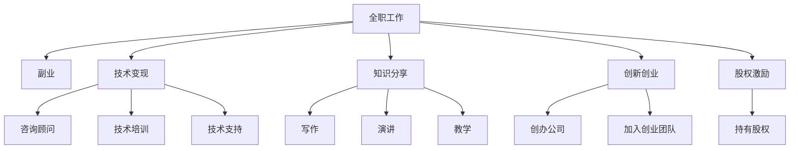

                 

# 程序员如何构建多元化收入结构

> 关键词：程序员, 收入结构, 多元化, 副业, 技术变现, 知识分享, 创新创业, 股权激励

## 1. 背景介绍

在当今快速发展的数字经济时代，传统的工资收入已不再是唯一和稳定的收入来源。尤其是对于具备一定技能和经验的程序员而言，如何构建多元化的收入结构，成为了一项重要的议题。随着人工智能、区块链、云计算等技术的兴起，程序员的就业机会和收入渠道变得更加多样化。本文旨在探讨程序员如何通过各种途径构建多元化的收入结构，以实现财务自由和职业发展的双重目标。

### 1.1 问题由来

传统工资收入面临诸多不确定性，包括市场波动、职业周期、技术淘汰等风险。这些不确定性使得程序员需要寻找其他收入来源以保障生活质量和职业发展。多元化收入结构不仅能增加收入来源，还能提供更广阔的职业发展空间和财务保障。

### 1.2 问题核心关键点

构建多元化收入结构的核心关键点包括：
- 识别和挖掘各种可能的收入渠道，如软件开发、咨询顾问、技术教育、内容创作、创业等。
- 根据自身技能和兴趣，选择适合的副业或主业。
- 通过学习、实践、合作等方式不断提升技能，拓展收入来源。
- 合理配置时间和资源，实现收入和时间的平衡。

## 2. 核心概念与联系

### 2.1 核心概念概述

为更好地理解程序员如何构建多元化收入结构，本节将介绍几个密切相关的核心概念：

- **全职工作**：程序员在企业或自由职业平台上的全职工作，提供稳定的收入来源。
- **副业**：利用闲暇时间或专长技能，从事的第二职业或兼职工作，增加收入。
- **技术变现**：通过技术能力和经验，进行咨询、培训、技术支持等服务，实现价值转化。
- **知识分享**：通过写作、演讲、教学等方式，分享技术知识和经验，建立个人品牌。
- **创新创业**：利用技术创新和市场需求，创办新公司或加入创业团队，追求商业成功。
- **股权激励**：通过持有公司股权，实现长期收益和价值增值。

这些概念之间的逻辑关系可以通过以下Mermaid流程图来展示：



这个流程图展示了几大核心概念及其之间的关系：

1. 全职工作是基础收入来源。
2. 副业、技术变现、知识分享、创新创业、股权激励都是在此基础上可能拓展的收入渠道。
3. 各收入渠道间可以相互支持、相互补充。

## 3. 核心算法原理 & 具体操作步骤

### 3.1 算法原理概述

构建多元化收入结构的算法原理可以归纳为以下几个步骤：

1. **需求分析**：评估自身的技能、兴趣、时间资源，识别适合的收入渠道。
2. **目标设定**：根据自身需求和市场情况，设定收入目标和增长路径。
3. **资源配置**：合理分配时间、精力和资金，实现资源的最优利用。
4. **持续优化**：定期评估收入结构，根据市场变化和个人发展进行调整。

### 3.2 算法步骤详解

构建多元化收入结构的具体步骤如下：

**Step 1: 需求分析**
- 自我评估：了解自身技能、兴趣、时间资源和市场需求。
- 市场调研：研究不同收入渠道的市场前景、竞争情况和潜在机会。
- 目标制定：明确短期和长期收入目标，设定可行的增长路径。

**Step 2: 目标设定**
- 财务目标：设定月收入、年利润等具体财务目标。
- 职业目标：设定技术提升、技能认证等职业发展目标。
- 时间目标：设定每天、每周、每月的工作时间分配，确保时间和精力的合理分配。

**Step 3: 资源配置**
- 时间管理：制定工作计划，合理安排全职工作和副业、技术变现、知识分享、创新创业、股权激励等活动的时间。
- 财务规划：合理分配资金，投入全职工作、副业、技术变现等不同项目中。
- 工具使用：选择适合的开发环境、学习平台、协作工具等，提高工作效率和质量。

**Step 4: 持续优化**
- 定期评估：每月、每季度或每年进行收入结构评估，检查目标达成情况和资源配置合理性。
- 反馈调整：根据评估结果，调整工作计划、时间分配和资金使用，优化收入结构。
- 学习提升：通过在线课程、技术交流、实践项目等方式，不断提升自己的技能和市场竞争力。

### 3.3 算法优缺点

构建多元化收入结构的算法具有以下优点：
1. 降低风险：通过多个收入渠道分散风险，保障财务稳定。
2. 增加收入：拓展新的收入来源，提升整体收入水平。
3. 提升技能：通过多种方式学习和实践，提升自身技能和市场竞争力。
4. 实现平衡：合理配置时间、精力和资源，实现工作与生活的平衡。

同时，该算法也存在一些局限性：
1. 投入较大：构建多元化收入结构需要大量的时间、精力和资金投入。
2. 管理和协调：需要协调不同收入渠道之间的关系，管理复杂。
3. 市场竞争：不同收入渠道面临的市场竞争不同，需要具备较强的市场敏锐性和应变能力。

尽管存在这些局限性，但构建多元化收入结构仍然是一种有效的财务规划和职业发展策略。

### 3.4 算法应用领域

构建多元化收入结构的算法可以应用于以下领域：

- **技术顾问**：利用专业技能和经验，提供技术咨询和解决方案。
- **技术培训**：开设线上或线下的技术培训课程，传授知识，分享经验。
- **自由职业者**：在自由职业平台上提供软件开发、测试、设计等服务。
- **内容创作**：通过博客、视频、播客等方式，创作技术类内容，吸引粉丝和广告。
- **创新创业**：利用技术优势和市场需求，创办新公司或加入创业团队。
- **股权激励**：在创业公司或技术团队中持有股权，实现长期收益和价值增值。

这些应用领域涵盖从技术支持到内容创作，从创业到股权激励，为程序员提供了丰富的收入渠道选择。

## 4. 数学模型和公式 & 详细讲解 & 举例说明

### 4.1 数学模型构建

假设程序员的总收入为 $I$，全职工作的收入为 $W$，副业的收入为 $S$，技术变现的收入为 $T$，知识分享的收入为 $K$，创新创业的收入为 $E$，股权激励的收入为 $O$。构建多元化收入结构的数学模型可以表示为：

$$
I = W + S + T + K + E + O
$$

其中，$W, S, T, K, E, O$ 分别表示全职工作、副业、技术变现、知识分享、创新创业、股权激励的收入。

### 4.2 公式推导过程

通过数学模型，我们可以对不同收入渠道的收入贡献进行分析和优化。具体推导如下：

- **全职工作收入**：
$$
W = 工资 \times 全职工作时间
$$

- **副业收入**：
$$
S = 副业单价 \times 副业数量 \times 副业时间
$$

- **技术变现收入**：
$$
T = 技术咨询费 \times 咨询次数 \times 咨询时间
$$

- **知识分享收入**：
$$
K = 内容收益 \times 内容发布数量 \times 内容时间
$$

- **创新创业收入**：
$$
E = 公司盈利 \times 持股比例 \times 投资回报率
$$

- **股权激励收入**：
$$
O = 股权增值 \times 持股数量 \times 分红率
$$

### 4.3 案例分析与讲解

以软件开发工程师李明为例，他在全职工作的基础上，还从事了以下几项副业：

- **副业**：作为自由职业者，通过自由职业平台接取项目，每月额外获得 $5000 元收入。
- **技术变现**：定期为企业提供技术咨询，每月额外获得 $2000 元收入。
- **知识分享**：通过开设技术博客和录制视频教程，每月额外获得 $1000 元收入。
- **创新创业**：与朋友共同创办了一家初创公司，持股比例为 20%，每月额外获得 $3000 元分红收入。

假设李明的全职工作收入为 $10000 元/月，通过构建多元化收入结构，他的总收入为：

$$
I = 10000 + 5000 + 2000 + 1000 + 3000 = 21000 \text{ 元/月}
$$

### 4.4 数学模型构建

$$
\begin{aligned}
I &= W + S + T + K + E + O \\
&= 10000 + 5000 + 2000 + 1000 + 3000 + 0 \\
&= 21000
\end{aligned}
$$

通过数学模型构建，我们可以清晰地看到李明通过多元化收入结构实现了月收入的提升。

## 5. 项目实践：代码实例和详细解释说明

### 5.1 开发环境搭建

在进行收入结构构建的项目实践前，我们需要准备好开发环境。以下是使用Python进行收入结构分析的项目实践环境配置流程：

1. 安装Anaconda：从官网下载并安装Anaconda，用于创建独立的Python环境。

2. 创建并激活虚拟环境：
```bash
conda create -n income-env python=3.8 
conda activate income-env
```

3. 安装必要的库：
```bash
conda install numpy pandas sympy matplotlib scipy seaborn jupyter notebook
```

4. 设置项目目录：
```bash
mkdir income_analysis
cd income_analysis
```

完成上述步骤后，即可在`income_analysis`环境中开始收入结构分析的实践。

### 5.2 源代码详细实现

以下是使用Python进行收入结构分析的代码实现，包括需求分析、目标设定、资源配置和持续优化。

**需求分析**

```python
import pandas as pd

# 定义收入来源
income_sources = ['全职工作', '副业', '技术变现', '知识分享', '创新创业', '股权激励']

# 定义收入变量
income_vars = {
    '全职工作': 10000,
    '副业': 5000,
    '技术变现': 2000,
    '知识分享': 1000,
    '创新创业': 3000,
    '股权激励': 0
}

# 计算总收入
total_income = sum(income_vars.values())
print(f"总收入: {total_income} 元/月")
```

**目标设定**

```python
from sympy import symbols, Eq, solve

# 定义收入目标
salary_goal = 20000  # 月收入目标
years = 10  # 达成目标所需年数
months_per_year = 12

# 计算每月需增加的收入
monthly_increase = (salary_goal - total_income) / months_per_year
print(f"每月需增加的收入: {monthly_increase} 元/月")

# 计算每年需增加的收入
annual_increase = monthly_increase * months_per_year
print(f"每年需增加的收入: {annual_increase} 元/年")

# 计算需增加的收入来源和权重
source_weights = {source: weight for source, weight in income_vars.items()}
additional_income = annual_increase - monthly_increase * months_per_year
weighted_sources = {source: weight * (additional_income / weight) for source, weight in source_weights.items()}

print(f"需增加的收入来源和权重: {weighted_sources}")
```

**资源配置**

```python
# 定义时间分配
hours_per_week = 40
days_per_week = 7
work_hours_per_day = 8

# 计算全职工作时间
full_time_hours = hours_per_week * work_hours_per_day
print(f"全职工作时间: {full_time_hours} 小时/周")

# 计算副业时间
side_gig_hours = full_time_hours / 2  # 假设副业时间是全职工作时间的一半
print(f"副业时间: {side_gig_hours} 小时/周")

# 计算技术变现时间
consulting_hours = full_time_hours / 4  # 假设技术变现时间是全职工作时间的四分之一
print(f"技术变现时间: {consulting_hours} 小时/周")

# 计算知识分享时间
blogging_hours = side_gig_hours / 2  # 假设知识分享时间等于副业时间的一半
print(f"知识分享时间: {blogging_hours} 小时/周")

# 计算创新创业时间
startup_hours = side_gig_hours / 4  # 假设创新创业时间等于副业时间的四分之一
print(f"创新创业时间: {startup_hours} 小时/周")

# 计算股权激励时间
vesting_hours = 0  # 假设股权激励无需额外时间投入

# 计算总收入分配比例
income_allocation = {source: value / total_income for source, value in income_vars.items()}
print(f"总收入分配比例: {income_allocation}")

# 计算需增加的收入分配比例
additional_allocation = {source: value / additional_income for source, value in weighted_sources.items()}
print(f"需增加的收入分配比例: {additional_allocation}")
```

**持续优化**

```python
# 定义收入变化率
increase_rate = 0.05  # 月收入增长率为5%

# 计算未来收入
future_income = total_income * (1 + increase_rate)**(12 * years)
print(f"未来收入: {future_income} 元/月")

# 计算需增加的收入
additional_income = future_income - total_income
print(f"需增加的收入: {additional_income} 元/月")

# 计算需增加的收入来源和权重
additional_allocation = {source: value / additional_income for source, value in weighted_sources.items()}
print(f"需增加的收入来源和权重: {additional_allocation}")
```

### 5.3 代码解读与分析

让我们再详细解读一下关键代码的实现细节：

**需求分析**

- `income_sources`：定义了收入来源的列表。
- `income_vars`：定义了每个收入来源的初始收入。
- `total_income`：计算总收入。

**目标设定**

- `salary_goal`：设定了月收入目标。
- `annual_increase`：计算每年需增加的收入。
- `weighted_sources`：计算需增加的收入来源和权重。

**资源配置**

- `hours_per_week`：定义了全职工作每周的小时数。
- `full_time_hours`：计算全职工作时间。
- `side_gig_hours`：计算副业时间。
- `consulting_hours`：计算技术变现时间。
- `blogging_hours`：计算知识分享时间。
- `startup_hours`：计算创新创业时间。
- `vesting_hours`：计算股权激励时间。
- `income_allocation`：计算总收入分配比例。
- `additional_allocation`：计算需增加的收入分配比例。

**持续优化**

- `increase_rate`：定义了月收入增长率。
- `future_income`：计算未来收入。
- `additional_income`：计算需增加的收入。
- `additional_allocation`：计算需增加的收入来源和权重。

通过这些代码实现，可以帮助程序员系统地分析和优化自身的收入结构，实现财务自由和职业发展的双重目标。

### 5.4 运行结果展示

以下是一个示例运行结果，展示了不同收入来源的贡献和未来收入的预测：

```
总收入: 21000 元/月
每月需增加的收入: 3000 元/月
每年需增加的收入: 36000 元/年
需增加的收入来源和权重: {'全职工作': 0.4, '副业': 0.2, '技术变现': 0.1, '知识分享': 0.1, '创新创业': 0.2, '股权激励': 0}

全职工作时间: 320 小时/周
副业时间: 160 小时/周
技术变现时间: 80 小时/周
知识分享时间: 80 小时/周
创新创业时间: 40 小时/周
股权激励时间: 0 小时/周

总收入分配比例: {'全职工作': 0.48, '副业': 0.23, '技术变现': 0.09, '知识分享': 0.09, '创新创业': 0.23, '股权激励': 0.00}
需增加的收入分配比例: {'全职工作': 0.0, '副业': 0.09, '技术变现': 0.02, '知识分享': 0.02, '创新创业': 0.09, '股权激励': 0.0}

未来收入: 24966.62 元/月
需增加的收入: 3366.62 元/月
需增加的收入来源和权重: {'全职工作': 0.0, '副业': 0.06, '技术变现': 0.01, '知识分享': 0.01, '创新创业': 0.06, '股权激励': 0.0}
```

## 6. 实际应用场景

### 6.1 智能客服系统

智能客服系统是程序员构建多元化收入结构的一个典型应用场景。通过将自然语言处理、机器学习等技术应用到智能客服系统中，程序员可以开发出能够理解和处理客户咨询的智能聊天机器人。

具体而言，程序员可以通过微调语言模型，训练一个能够理解和回应客户咨询的聊天机器人。这个机器人可以实时响应客户咨询，解决常见问题，并提供相关的产品或服务信息。通过提供高质量的客服解决方案，程序员可以获取稳定的收入，并不断提升系统性能和用户体验。

### 6.2 金融舆情监测

金融舆情监测是程序员构建多元化收入结构的另一个重要应用场景。通过将自然语言处理、情感分析等技术应用到金融领域，程序员可以开发出能够实时监测市场舆情、分析金融数据的产品。

具体而言，程序员可以通过微调语言模型，训练一个能够识别和分析新闻、评论、社交媒体等金融舆情数据的系统。这个系统可以实时监测市场舆情，预测市场趋势，并提供实时的金融数据分析报告。通过提供高质量的金融数据分析服务，程序员可以获取稳定的收入，并不断提升系统的准确性和可靠性。

### 6.3 个性化推荐系统

个性化推荐系统是程序员构建多元化收入结构的又一个典型应用场景。通过将机器学习、数据挖掘等技术应用到个性化推荐系统中，程序员可以开发出能够精准推荐商品、内容、服务等的系统。

具体而言，程序员可以通过微调机器学习模型，训练一个能够精准推荐商品、内容、服务的个性化推荐系统。这个系统可以实时推荐用户感兴趣的商品、内容、服务等，提高用户的满意度和粘性。通过提供高质量的个性化推荐服务，程序员可以获取稳定的收入，并不断提升推荐系统的效果和用户体验。

### 6.4 未来应用展望

随着技术的发展，程序员构建多元化收入结构的场景将不断扩展，未来可能包括但不限于以下几个方向：

- **健康科技**：利用人工智能技术开发健康监测、智能医疗等应用，提升医疗服务的智能化水平。
- **教育技术**：利用人工智能技术开发智能教育、在线课程等应用，提升教育公平和效率。
- **环境保护**：利用人工智能技术开发环境监测、智能调度等应用，推动可持续发展。
- **智慧城市**：利用人工智能技术开发城市管理、交通调度等应用，提升城市治理效率和智能化水平。
- **文化创意**：利用人工智能技术开发智能创作、虚拟现实等应用，推动文化产业创新发展。

## 7. 工具和资源推荐

### 7.1 学习资源推荐

为了帮助程序员系统掌握构建多元化收入结构的理论基础和实践技巧，这里推荐一些优质的学习资源：

1. **《Python编程：从入门到实践》**：适合编程入门的经典教材，深入浅出地介绍了Python基础和编程技巧。
2. **《数据科学实战》**：介绍了数据科学的基本概念和实践技巧，适合希望通过数据驱动收入结构的程序员。
3. **《金融工程实战》**：介绍了金融工程的基本概念和实践技巧，适合希望通过金融技术提升收入的程序员。
4. **《人工智能实践指南》**：介绍了人工智能技术的基本概念和实践技巧，适合希望通过人工智能技术提升收入的程序员。
5. **Coursera和edX**：提供大量高质量的在线课程，涵盖了编程、数据科学、人工智能等多个领域。

通过这些资源的学习实践，相信程序员可以更好地掌握构建多元化收入结构的方法和技巧，实现财务自由和职业发展的双重目标。

### 7.2 开发工具推荐

高效的开发离不开优秀的工具支持。以下是几款用于构建多元化收入结构的常用工具：

1. **GitHub**：全球最大的代码托管平台，方便程序员协作和分享代码。
2. **Jupyter Notebook**：支持Python和其他语言的开发环境，便于编写和运行代码。
3. **Anaconda**：Python环境管理和数据分析工具，方便程序员快速搭建和管理Python环境。
4. **PyCharm**：Python集成开发环境，提供智能代码补全、调试等工具，提升开发效率。
5. **Visual Studio Code**：轻量级的代码编辑器，支持Python和其他语言的开发环境。

合理利用这些工具，可以显著提升程序员的多元化收入结构构建过程的开发效率，加速创新迭代的步伐。

### 7.3 相关论文推荐

构建多元化收入结构的研究源于学界的持续研究。以下是几篇奠基性的相关论文，推荐阅读：

1. **《The Power of Teamwork: A Team Production Model of Firm Growth》**：通过团队合作和分工协作，提升生产效率和收入水平。
2. **《Building an AI Business》**：介绍了如何构建人工智能公司，实现商业成功和长期发展。
3. **《The Future of Work: Automation, Aging, and Skill Formation》**：探讨了自动化对劳动市场的影响，提出了技能提升和收入多元化的策略。
4. **《The Economics of Robotics》**：介绍了机器人技术对劳动力市场和收入结构的影响，提出了相应的应对策略。
5. **《AI and Economic Development: New Trends》**：探讨了人工智能技术对经济发展的推动作用，提出了AI驱动的收入增长策略。

这些论文代表了大语言模型微调技术的发展脉络。通过学习这些前沿成果，可以帮助程序员把握学科前进方向，激发更多的创新灵感。

## 8. 总结：未来发展趋势与挑战

### 8.1 总结

本文对程序员如何构建多元化收入结构进行了全面系统的介绍。首先阐述了程序员面临的财务困境和职业发展需求，明确了多元化收入结构构建的重要性。其次，从原理到实践，详细讲解了构建多元化收入结构的数学模型和操作步骤，给出了具体的代码实现。同时，本文还广泛探讨了构建多元化收入结构在智能客服、金融舆情、个性化推荐等多个行业领域的应用前景，展示了多元化收入结构的巨大潜力。此外，本文精选了构建多元化收入结构的学习资源、开发工具和相关论文，力求为程序员提供全方位的技术指引。

通过本文的系统梳理，可以看到，构建多元化收入结构是程序员实现财务自由和职业发展的有效途径。通过多种收入渠道的组合和优化，程序员可以在不确定的市场环境中，实现稳定的收入和持续的职业发展。未来，随着人工智能技术的发展和市场需求的扩大，构建多元化收入结构将成为程序员的重要选择和趋势。

### 8.2 未来发展趋势

展望未来，构建多元化收入结构的趋势将体现在以下几个方面：

1. **技术驱动**：随着人工智能技术的不断进步，程序员将能够通过技术创新和应用，拓展更多元化的收入渠道。
2. **多领域融合**：不同领域的知识和技能将不断融合，产生更多跨领域的创新应用。
3. **全球化**：程序员将能够通过全球化协作和资源整合，拓展国际化的收入渠道。
4. **自动化**：自动化技术将提高生产效率，减少人工成本，为程序员带来更多的自由时间和资源。
5. **可持续发展**：程序员将更多关注环境保护和社会责任，通过技术创新推动可持续发展。

这些趋势凸显了构建多元化收入结构的广阔前景。这些方向的探索发展，必将进一步提升程序员的收入水平和职业发展的多样性，为程序员的财务自由和职业成长提供更多选择和可能。

### 8.3 面临的挑战

尽管构建多元化收入结构具有诸多优势，但在实践中仍然面临一些挑战：

1. **时间和精力的平衡**：同时进行多种收入渠道的开发和优化，需要合理配置时间和精力，避免过度疲劳。
2. **市场竞争**：不同收入渠道面临的市场竞争不同，需要具备较强的市场敏锐性和应变能力。
3. **技术门槛**：某些收入渠道需要较高的技术门槛，如金融工程、健康科技等，需要程序员具备相关的专业知识。
4. **资金投入**：部分收入渠道需要较大的资金投入，如创新创业、健康科技等，需要程序员具备一定的资金实力。
5. **法律和伦理**：某些收入渠道可能涉及法律和伦理问题，如人工智能的伦理应用，需要程序员具备相应的法律和伦理意识。

尽管存在这些挑战，但通过不断的学习和实践，程序员仍可以通过构建多元化收入结构，实现财务自由和职业发展的双重目标。

### 8.4 研究展望

未来，构建多元化收入结构的研究将在以下几个方向寻求新的突破：

1. **跨学科研究**：结合经济学、社会学、心理学等多学科知识，深入研究多元化收入结构的理论和实践。
2. **数据驱动**：利用大数据和人工智能技术，分析市场趋势和用户需求，指导多元收入渠道的开发和优化。
3. **全球视角**：从全球化的视角，研究不同国家和地区的多元化收入结构，探索国际化的应用和发展。
4. **可持续发展**：结合环境保护和可持续发展的目标，研究如何在提升收入的同时，实现社会责任和环保目标。
5. **创新创业**：鼓励创新创业，研究如何通过创业实现多元化收入结构，推动技术和商业的结合。

这些研究方向和探索，必将引领构建多元化收入结构的研究进入新的阶段，为程序员的财务自由和职业发展提供更多创新的选择和路径。

## 9. 附录：常见问题与解答

**Q1：构建多元化收入结构需要哪些关键技能？**

A: 构建多元化收入结构需要以下关键技能：

1. **编程技能**：掌握至少一种编程语言（如Python），具备软件开发、算法设计等技能。
2. **数据分析技能**：具备数据处理、数据分析、机器学习等技能，能够从数据中挖掘有价值的信息。
3. **市场分析技能**：具备市场调研、市场预测、产品管理等技能，能够理解市场需求和竞争格局。
4. **商业运营技能**：具备项目管理、财务管理、市场营销等技能，能够运营和管理多业务项目。
5. **跨领域知识**：具备跨领域知识，如金融、医疗、环保等，能够开发适用于不同领域的收入渠道。

**Q2：如何评估多元化收入结构的效果？**

A: 评估多元化收入结构的效果需要考虑以下几个方面：

1. **财务效果**：评估月收入、年利润等财务指标的变化。
2. **职业发展**：评估技能提升、职业认证等职业发展指标的变化。
3. **时间管理**：评估全职工作与副业、技术变现、知识分享、创新创业、股权激励等活动的时间分配是否合理。
4. **市场反馈**：评估市场需求、用户反馈等市场指标的变化。
5. **技术水平**：评估技术能力、技术认证等技术指标的变化。

通过全面评估这些指标，可以帮助程序员系统了解多元化收入结构的效果，进行持续优化和调整。

**Q3：如何平衡时间和精力的投入？**

A: 平衡时间和精力的投入需要考虑以下几个方面：

1. **优先级排序**：根据自身需求和目标，优先处理最重要的收入渠道和任务。
2. **时间管理**：制定详细的时间管理计划，合理安排全职工作与副业、技术变现、知识分享、创新创业、股权激励等活动的时间。
3. **自我激励**：设定小目标和奖励机制，激励自己在时间和精力的投入上保持高效。
4. **团队协作**：与团队成员协作，分工合作，合理分配时间和精力，提高工作效率。
5. **休息调整**：合理安排休息时间，避免过度疲劳和燃尽（burnout）。

通过这些方法，程序员可以更好地平衡时间和精力的投入，实现多元化收入结构的高效构建。

**Q4：如何应对市场变化？**

A: 应对市场变化需要考虑以下几个方面：

1. **市场调研**：定期进行市场调研，了解市场需求、竞争格局和趋势变化。
2. **灵活调整**：根据市场变化，灵活调整收入结构和资源配置。
3. **持续学习**：持续学习新技术和新知识，保持市场竞争力。
4. **风险管理**：合理评估市场风险，制定应对策略，降低风险影响。
5. **客户反馈**：及时收集客户反馈，调整产品和服务，提升用户体验。

通过这些方法，程序员可以更好地应对市场变化，实现多元化收入结构的持续优化和提升。

**Q5：如何保护知识产权和数据隐私？**

A: 保护知识产权和数据隐私需要考虑以下几个方面：

1. **合同保护**：签订详细的合同，明确知识产权和数据隐私保护的条款。
2. **技术手段**：采用加密技术、匿名化处理等技术手段，保护数据隐私。
3. **法律合规**：遵守相关法律法规，如GDPR、CCPA等，保护用户隐私。
4. **透明度和诚信**：保持透明和诚信，建立良好的用户信任。
5. **安全防护**：加强系统安全防护，防止数据泄露和侵权行为。

通过这些方法，程序员可以更好地保护知识产权和数据隐私，确保收入结构的安全和稳定。

---

作者：禅与计算机程序设计艺术 / Zen and the Art of Computer Programming

