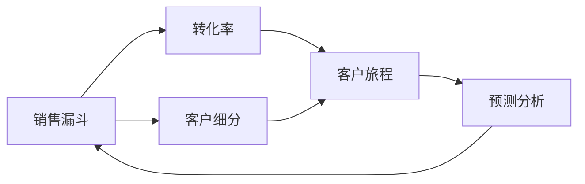
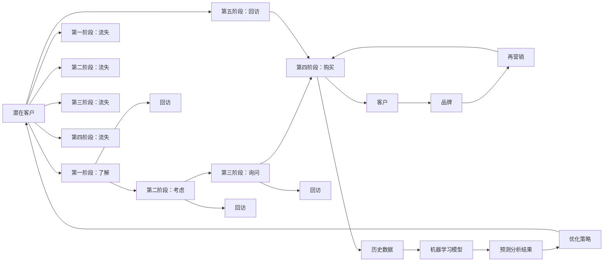

                 

# 程序员如何构建高转化率的销售漏斗

## 1. 背景介绍

在当今数字化时代，销售漏斗的构建与优化已成为提高转化率、增加收入的关键。随着人工智能(AI)和机器学习(ML)技术的发展，程序员可以运用这些工具构建更高效的销售漏斗，从而提升客户转化率，增加企业收益。本文将深入探讨如何利用AI和ML技术构建高转化率的销售漏斗，包括漏斗构建的核心概念、方法论、工具和实践案例。

## 2. 核心概念与联系

### 2.1 核心概念概述

构建高转化率的销售漏斗需要理解几个核心概念：

- **销售漏斗(Sales Funnel)**：一个潜在的客户经历一系列转化步骤，最终成为付费客户的流程。通常包括了解、考虑、询问、购买等多个阶段。
- **转化率(Conversion Rate)**：指完成特定转化步骤的客户数与访问客户数的比例，是衡量销售效率的重要指标。
- **客户旅程(Customer Journey)**：描述潜在客户从首次接触品牌到最终购买的路径。理解客户旅程对于优化销售漏斗至关重要。
- **客户细分(Customer Segmentation)**：根据客户行为、属性、价值等因素将客户分组，以便进行有针对性的营销和销售策略。
- **预测分析(Predictive Analytics)**：使用历史数据和机器学习模型预测未来客户行为和销售结果，优化销售策略。

这些概念之间的联系如图1所示：



### 2.2 核心概念原理和架构的 Mermaid 流程图



这个图表展示了销售漏斗的构成和关键步骤，以及如何利用AI和ML技术优化各个阶段，最终提高转化率。

## 3. 核心算法原理 & 具体操作步骤

### 3.1 算法原理概述

构建高转化率的销售漏斗的核心算法原理包括以下几个方面：

- **客户细分与定位**：利用机器学习算法对客户进行细分，识别高价值客户，从而针对性地制定营销策略。
- **行为预测**：使用历史数据和预测模型预测客户在销售漏斗中的行为，如流失风险、回访概率等，以便提前干预。
- **个性化推荐**：通过分析客户行为和偏好，使用推荐算法提供个性化的产品推荐，提高转化率。
- **动态漏斗优化**：利用AI技术实时监控和优化销售漏斗的每个阶段，如自动化回访、再营销等。

### 3.2 算法步骤详解

构建高转化率销售漏斗的主要步骤包括：

**Step 1: 数据收集与预处理**

- 收集客户数据，包括基本信息、购买历史、互动记录等。
- 清洗和格式化数据，去除异常值和噪声。

**Step 2: 客户细分与定位**

- 利用聚类算法（如K-Means）对客户进行细分，识别不同客户群体。
- 分析各客户群体的特征和行为，了解不同群体的需求和偏好。

**Step 3: 行为预测与客户旅程分析**

- 使用回归或分类算法（如决策树、随机森林、神经网络）预测客户在销售漏斗中的行为。
- 分析客户旅程中的关键节点和流失原因，优化各个阶段的转化策略。

**Step 4: 个性化推荐**

- 利用协同过滤、内容推荐等算法，根据客户行为和历史偏好，提供个性化的产品推荐。
- 实时更新推荐算法，捕捉客户最新的需求和变化。

**Step 5: 动态漏斗优化**

- 使用实时监控工具（如Google Analytics、Salesforce）跟踪销售漏斗中的客户行为。
- 根据监控结果，自动触发回访、再营销等策略。

### 3.3 算法优缺点

构建高转化率销售漏斗的算法具有以下优点：

- **数据驱动决策**：通过分析和预测，能够更准确地理解客户需求和行为，从而制定有效的营销策略。
- **个性化推荐**：提高客户满意度和转化率，增强品牌忠诚度。
- **动态优化**：实时监控和调整销售漏斗，提高整体转化率。

然而，该算法也存在一些缺点：

- **数据隐私问题**：需要收集大量客户数据，可能面临数据隐私和安全的风险。
- **算法复杂度**：模型训练和预测过程复杂，需要较高的计算资源和专业知识。
- **模型过拟合**：在数据量不足或客户行为多样的情况下，模型可能过拟合，影响预测结果。

### 3.4 算法应用领域

高转化率销售漏斗构建的算法可以应用于以下领域：

- **电子商务**：个性化推荐、购物车放弃优化、再营销等。
- **金融服务**：信用评分、贷款审批、客户流失预警等。
- **旅游行业**：个性化行程推荐、客户回访、促销活动等。
- **健康医疗**：患者细分、疾病预测、个性化治疗方案等。
- **教育培训**：课程推荐、学习路径优化、客户流失预警等。

## 4. 数学模型和公式 & 详细讲解 & 举例说明

### 4.1 数学模型构建

构建高转化率销售漏斗的数学模型主要包括以下几个部分：

- **客户细分模型**：使用聚类算法（如K-Means）将客户分为不同的群体。
- **行为预测模型**：使用回归或分类算法（如随机森林、神经网络）预测客户行为。
- **个性化推荐模型**：使用协同过滤、内容推荐等算法提供个性化产品推荐。

### 4.2 公式推导过程

以客户细分模型为例，K-Means算法的基本步骤包括：

1. 随机选择K个样本作为初始聚类中心。
2. 将每个样本分配到距离最近的聚类中心。
3. 计算每个聚类的中心点，重新分配样本。
4. 重复步骤2和3，直到聚类中心不再变化。

K-Means的公式表示如下：

$$
\min_{\mu_k} \sum_{i=1}^{N} \min_{k=1}^{K} ||x_i - \mu_k||^2
$$

其中，$\mu_k$为第k个聚类的中心，$x_i$为样本点。

### 4.3 案例分析与讲解

某电子商务公司使用K-Means算法对客户进行细分，识别了高价值客户群体。根据客户细分结果，公司针对不同群体制定了不同的营销策略，显著提升了转化率。

## 5. 项目实践：代码实例和详细解释说明

### 5.1 开发环境搭建

构建高转化率销售漏斗的项目实践需要以下开发环境：

- **Python**：作为主要编程语言。
- **pandas**：用于数据处理和分析。
- **scikit-learn**：包含K-Means聚类算法和其他机器学习工具。
- **TensorFlow或PyTorch**：用于构建和训练预测模型。
- **FastAPI**：用于构建API接口，集成推荐系统。
- **Docker**：容器化部署，方便扩展和运维。

### 5.2 源代码详细实现

以下是使用Python和scikit-learn进行客户分细的示例代码：

```python
from sklearn.cluster import KMeans
import pandas as pd

# 加载客户数据
data = pd.read_csv('customer_data.csv')

# 选择特征变量
X = data[['age', 'income', 'purchasing_frequency']]

# 使用K-Means算法进行聚类
kmeans = KMeans(n_clusters=3)
kmeans.fit(X)

# 输出聚类结果
labels = kmeans.predict(X)
print(labels)
```

### 5.3 代码解读与分析

上述代码中，首先使用pandas加载客户数据，选择年龄、收入和购买频率作为聚类特征。然后使用KMeans算法对客户进行聚类，最后输出聚类结果。

### 5.4 运行结果展示

运行上述代码后，输出的聚类结果将显示每个客户所属的群体标签。

## 6. 实际应用场景

### 6.1 电子商务

在电子商务领域，利用高转化率销售漏斗可以显著提升客户转化率。例如，某在线零售商使用个性化推荐系统，通过分析客户历史购买行为，推荐相关产品，提高了客户购买意愿和转化率。

### 6.2 金融服务

金融服务行业可以应用客户细分和行为预测模型，优化贷款审批流程，降低坏账率，提高客户满意度。

### 6.3 旅游行业

旅游公司可以利用高转化率销售漏斗优化客户旅程，提供个性化的旅游行程推荐，提升客户体验和转化率。

### 6.4 健康医疗

在健康医疗领域，可以使用客户细分和行为预测模型，优化诊疗路径，提高患者满意度和治疗效果。

### 6.5 教育培训

教育培训行业可以通过高转化率销售漏斗优化课程推荐，提高学员学习效果和满意度。

## 7. 工具和资源推荐

### 7.1 学习资源推荐

- **《机器学习实战》**：该书详细介绍了机器学习的基本概念和实践技巧，适合初学者入门。
- **Coursera上的机器学习课程**：由斯坦福大学提供的免费课程，由Andrew Ng主讲，涵盖了机器学习的主要算法和应用。
- **Kaggle**：一个数据科学竞赛平台，提供了大量的数据集和竞赛任务，是学习和实践机器学习的好地方。

### 7.2 开发工具推荐

- **PyTorch**：一个开源的深度学习框架，支持动态计算图和GPU加速，适合研究和实验。
- **TensorFlow**：谷歌开发的深度学习框架，支持分布式计算和生产部署。
- **scikit-learn**：一个Python机器学习库，提供了多种经典机器学习算法和工具。
- **Jupyter Notebook**：一个交互式编程环境，适合数据科学和机器学习项目开发。
- **AWS SageMaker**：亚马逊提供的机器学习服务，支持模型训练、部署和监控。

### 7.3 相关论文推荐

- **《K-Means算法及其应用》**：介绍了K-Means算法的基本原理和应用场景。
- **《深度学习在电子商务中的应用》**：介绍了深度学习在电子商务中的各种应用，包括推荐系统、客户行为预测等。
- **《机器学习在金融风险管理中的应用》**：介绍了机器学习在金融风险管理中的应用，包括信用评分、贷款审批等。
- **《机器学习在医疗健康领域的应用》**：介绍了机器学习在医疗健康领域的应用，包括疾病预测、个性化治疗等。
- **《机器学习在教育领域的应用》**：介绍了机器学习在教育领域的应用，包括课程推荐、学习路径优化等。

## 8. 总结：未来发展趋势与挑战

### 8.1 总结

本文详细探讨了如何使用AI和ML技术构建高转化率的销售漏斗。通过数据分析、机器学习算法和模型训练，可以有效地识别高价值客户，预测客户行为，提供个性化推荐，优化销售漏斗的每个阶段。这些技术的应用，不仅可以提高转化率，还能增强客户满意度和品牌忠诚度，从而增加企业收益。

### 8.2 未来发展趋势

未来，随着AI和ML技术的不断进步，构建高转化率销售漏斗的技术将更加成熟和高效。以下是一些未来的发展趋势：

- **自动化客户细分**：使用自动化算法（如AutoML）进行客户细分，减少人工干预和提高效率。
- **实时预测和响应**：使用实时监控和预测系统，及时调整销售策略，提高转化率。
- **多模态数据融合**：将客户的多模态数据（如社交媒体、地理位置等）融入销售漏斗，提供更全面的客户洞察。
- **增强现实(AR)和虚拟现实(VR)**：使用AR和VR技术，提升客户体验和互动效果。
- **情感分析和社交媒体监控**：利用情感分析和社交媒体监控，更好地理解客户情绪和需求，优化销售策略。

### 8.3 面临的挑战

尽管构建高转化率销售漏斗的技术在不断进步，但也面临一些挑战：

- **数据隐私和安全**：在收集和处理客户数据时，必须遵守数据隐私法规，保护客户隐私。
- **模型复杂度和计算资源**：构建和维护复杂的机器学习模型需要较高的计算资源和专业知识。
- **模型解释性和透明度**：需要确保模型的决策过程透明，便于理解和调试。
- **多模态数据融合**：将不同类型的数据进行融合，可能会增加数据处理的复杂性。
- **客户信任和品牌忠诚度**：过度依赖算法和自动化可能会降低客户对品牌的信任和忠诚度。

### 8.4 研究展望

未来，研究人员需要在以下几个方面进行深入研究：

- **模型解释性和透明性**：开发更透明的机器学习模型，提供可解释的决策依据。
- **数据隐私保护**：研究如何在保护客户隐私的前提下，使用数据进行销售漏斗优化。
- **多模态数据融合**：探索更好的多模态数据融合技术，提升客户洞察和销售效果。
- **自动化和智能决策**：进一步提升算法的自动化水平，减少人工干预，提高决策效率。
- **模型优化和评估**：开发更好的模型评估指标和优化方法，提升模型的效果和稳定性。

## 9. 附录：常见问题与解答

**Q1: 如何选择合适的机器学习算法？**

A: 选择合适的机器学习算法需要考虑数据类型、数据规模、问题类型等因素。一般可以通过以下步骤：

1. 数据探索和分析：了解数据的特征、分布、异常值等。
2. 问题定义：明确问题类型，如分类、回归、聚类等。
3. 算法选择：根据数据特征和问题类型，选择适合的算法。
4. 模型训练和评估：使用交叉验证、ROC曲线、混淆矩阵等方法评估模型效果。

**Q2: 数据预处理需要注意哪些问题？**

A: 数据预处理是机器学习项目中非常重要的一环，需要注意以下几个问题：

1. 数据清洗：去除缺失值、异常值、噪声等。
2. 数据归一化：将数据缩放到统一范围，避免算法对数据量级的敏感性。
3. 特征选择：选择对模型有帮助的特征，去除冗余特征。
4. 特征工程：通过编码、转换等技术，提取新的特征，提升模型效果。

**Q3: 如何处理过拟合问题？**

A: 过拟合是机器学习中常见的问题，需要采取以下措施：

1. 数据增强：通过数据扩充、旋转、翻转等方式，增加数据多样性。
2. 正则化：使用L1、L2正则化、Dropout等技术，减少过拟合。
3. 模型简化：减少模型复杂度，避免过度拟合。
4. 早停策略：在验证集上监控模型效果，当模型性能不再提升时，停止训练。

**Q4: 如何评估机器学习模型的效果？**

A: 评估机器学习模型的效果是模型优化的关键步骤，常用的评估指标包括：

1. 准确率：预测结果与实际结果一致的比例。
2. 精确率、召回率和F1值：分类任务中常用的评估指标。
3. ROC曲线和AUC值：二分类任务中常用的评估指标。
4. RMSE、MAE：回归任务中常用的评估指标。

**Q5: 如何优化销售漏斗的各个阶段？**

A: 优化销售漏斗的各个阶段需要综合考虑客户需求、市场变化、竞争对手等因素，以下是一些常见方法：

1. 了解客户需求：通过调查问卷、客户反馈等方式，了解客户需求和痛点。
2. 优化用户体验：简化用户操作，提升页面加载速度，优化交互设计。
3. 提供个性化推荐：根据客户行为和偏好，提供个性化产品推荐。
4. 实时监控和调整：使用实时监控工具，及时发现问题，优化销售策略。

通过不断优化销售漏斗的各个阶段，可以提高客户转化率和整体销售效果。

---

作者：禅与计算机程序设计艺术 / Zen and the Art of Computer Programming

