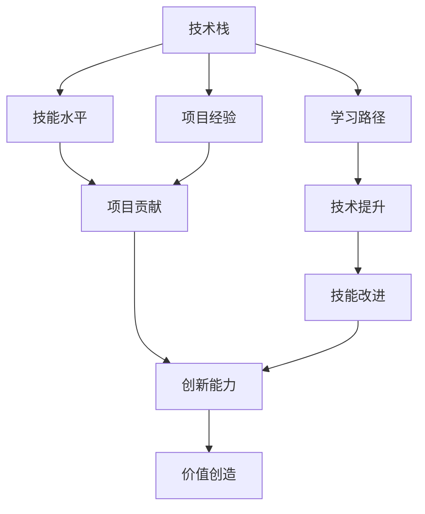

                 

# 程序员如何正确评估自身价值

> 关键词：自我评估,职业发展,技术栈,技能提升,价值创造

## 1. 背景介绍

在信息技术日新月异的时代，程序员作为驱动数字经济发展的核心力量，如何在快速变化的技术环境中保持竞争力、实现职业成长，成为每个从业者关注的焦点。程序员的价值评估不应仅限于薪水高低，而应综合考虑其技术能力、项目贡献、创新能力等多方面因素。本文旨在探讨如何建立科学的自我评估体系，为程序员的长期职业发展提供方向和指导。

### 1.1 问题由来

随着信息技术的迅猛发展，技术领域的竞争愈发激烈。新技术层出不穷，需求变化莫测，对于从业者的技能要求也日益提高。如何在职业发展的道路上保持竞争力和创新性，成为每位程序员都必须面对的问题。

### 1.2 问题核心关键点

如何准确评估自身的技术水平和职业价值，是每个程序员必须回答的问题。关键点包括：

- 正确识别自身的技术栈和技能水平。
- 了解职业发展的路径和目标。
- 掌握技能提升的途径和方法。
- 评估自身在项目中的贡献和创新能力。
- 量化衡量个人价值，与市场保持同步。

### 1.3 问题研究意义

准确评估自身价值，不仅有助于个人职业规划和成长，对于团队管理和公司战略同样重要。有助于：

- 提升个人和团队的工作效率。
- 帮助公司在人才招聘和内部晋升中做出明智决策。
- 促进创新和知识共享，加速技术进步。

## 2. 核心概念与联系

### 2.1 核心概念概述

要正确评估自身价值，首先需要理解几个核心概念及其内在联系：

- **技术栈**：程序员掌握的各种编程语言、框架和工具的集合。
- **技能水平**：包括编程能力、设计能力、问题解决能力、团队协作能力等。
- **项目贡献**：在项目开发过程中所承担的角色、贡献和影响力。
- **创新能力**：提出新想法、改进技术实现、解决复杂问题的能力。
- **价值创造**：个人对公司或团队的价值，包括经济价值和创新价值。

这些概念相互交织，共同构成了程序员价值的评估体系。

### 2.2 核心概念原理和架构的 Mermaid 流程图(Mermaid 流程节点中不要有括号、逗号等特殊字符)



这个流程图展示了大语言模型微调的核心概念及其内在联系。

## 3. 核心算法原理 & 具体操作步骤
### 3.1 算法原理概述

程序员自我价值评估可以采用量化的方法，通过评分体系将各个方面的贡献综合起来，形成最终的价值评估结果。这一过程类似于算法的训练过程，但应用于个人技能的提升和价值创造的评估。

### 3.2 算法步骤详解

#### 步骤一：技术栈评估
- **步骤1.1：** 列出所有掌握的编程语言和框架，按熟练程度打分（0-10分）。
- **步骤1.2：** 记录每个技能的使用频率和项目中的应用场景。
- **步骤1.3：** 根据市场和行业趋势，调整技术栈的权重。

#### 步骤二：技能水平评估
- **步骤2.1：** 自我评估在编程、设计、问题解决等方面的能力，打分（0-10分）。
- **步骤2.2：** 记录参与的内部和外部培训情况，以及获得的技术认证。
- **步骤2.3：** 收集同事和上级对个人技能的反馈，综合评估技能水平。

#### 步骤三：项目贡献评估
- **步骤3.1：** 记录参与的项目数量和角色（如开发者、负责人等）。
- **步骤3.2：** 评估每个项目中的具体贡献，包括代码质量、功能实现、性能优化等。
- **步骤3.3：** 收集项目团队的评价，量化项目对公司或客户的实际影响。

#### 步骤四：创新能力评估
- **步骤4.1：** 记录提出的新想法和解决方案的数量和质量。
- **步骤4.2：** 统计在技术博客、会议发言中分享的创新成果。
- **步骤4.3：** 评估解决复杂问题的能力，包括开源贡献和专利申请。

#### 步骤五：价值创造评估
- **步骤5.1：** 结合以上评估结果，综合计算个人价值。
- **步骤5.2：** 量化经济价值（如创造的收入、节省的成本）。
- **步骤5.3：** 量化创新价值（如技术改进、新产品的开发）。

### 3.3 算法优缺点

#### 优点：
- **系统性：** 通过量化和综合评估，形成全面、系统的自我价值评估体系。
- **客观性：** 引入数据和反馈，减少了主观评估的偏差。
- **可操作性：** 评估步骤具体，易于实施。

#### 缺点：
- **复杂性：** 涉及多个维度的评估，可能难以全面覆盖。
- **动态性：** 技术和市场需求变化快，需要定期更新评估指标。
- **主观性：** 在技能和贡献的评估中，仍需要一定的主观判断。

### 3.4 算法应用领域

自我评估的方法不仅适用于个人技术成长，也广泛应用于企业人才管理和团队绩效评估中。例如：

- **招聘与选拔：** 结合量化评估结果，帮助企业更准确地筛选和选拔人才。
- **培训与发展：** 根据评估结果，制定个性化的培训和发展计划。
- **绩效考核：** 结合项目贡献和创新能力，进行全面的绩效考核。
- **职业规划：** 结合长期价值评估，帮助个人制定清晰的职业发展路径。

## 4. 数学模型和公式 & 详细讲解 & 举例说明（备注：数学公式请使用latex格式，latex嵌入文中独立段落使用 $$，段落内使用 $)
### 4.1 数学模型构建

假设评估体系包括五个维度：技术栈（$A$）、技能水平（$B$）、项目贡献（$C$）、创新能力（$D$）、价值创造（$E$）。每个维度设有多个子指标，并进行打分。

$$
\text{总价值} = \alpha_A \times A + \beta_B \times B + \gamma_C \times C + \delta_D \times D + \epsilon_E \times E
$$

其中，$\alpha,\beta,\gamma,\delta,\epsilon$ 为各维度的权重系数。

### 4.2 公式推导过程

- **步骤一：** 对每个子指标进行打分，例如 $A_1,A_2,...,A_n$，$B_1,B_2,...,B_m$，以此类推。
- **步骤二：** 对每个维度进行加权平均，例如：
  $$
  A = \frac{\sum_{i=1}^n A_i}{n}, B = \frac{\sum_{j=1}^m B_j}{m}, ...
  $$
- **步骤三：** 根据公式将各维度乘以权重系数，并求和。

### 4.3 案例分析与讲解

假设某程序员的技能栈评估得分为 $A=8$，技能水平得分为 $B=7$，项目贡献得分为 $C=9$，创新能力得分为 $D=8$，价值创造得分为 $E=7$。各维度权重系数为 $\alpha=0.2,\beta=0.2,\gamma=0.25,\delta=0.15,\epsilon=0.2$。

代入公式计算总价值：

$$
\text{总价值} = 0.2 \times 8 + 0.2 \times 7 + 0.25 \times 9 + 0.15 \times 8 + 0.2 \times 7 \approx 8.7
$$

## 5. 项目实践：代码实例和详细解释说明
### 5.1 开发环境搭建

为了进行量化评估，需要开发一个简单的评分系统。使用Python和Flask框架可以快速搭建一个Web应用，实现评估结果的输入和展示。

首先，安装Flask和必要的依赖：

```bash
pip install flask flask-wtf wtforms
```

创建Flask应用：

```python
from flask import Flask, render_template, request
from flask_wtf import FlaskForm
from wtforms import StringField, SubmitField, IntegerField
from wtforms.validators import DataRequired

app = Flask(__name__)

class ReviewForm(FlaskForm):
    tech_stack = IntegerField('技术栈评分', validators=[DataRequired()])
    skills = IntegerField('技能水平评分', validators=[DataRequired()])
    contribution = IntegerField('项目贡献评分', validators=[DataRequired()])
    innovation = IntegerField('创新能力评分', validators=[DataRequired()])
    value = IntegerField('价值创造评分', validators=[DataRequired()])
    submit = SubmitField('提交')

@app.route('/', methods=['GET', 'POST'])
def index():
    form = ReviewForm()
    if form.validate_on_submit():
        tech_stack = form.tech_stack.data
        skills = form.skills.data
        contribution = form.contribution.data
        innovation = form.innovation.data
        value = form.value.data
        total_score = (tech_stack + skills + contribution + innovation + value) / 5
        return render_template('index.html', total_score=total_score)
    return render_template('index.html', form=form)

if __name__ == '__main__':
    app.run(debug=True)
```

创建模板文件 `templates/index.html`：

```html
<!DOCTYPE html>
<html lang="en">
<head>
    <meta charset="UTF-8">
    <title>程序员价值评估</title>
</head>
<body>
    <h1>程序员价值评估</h1>
    <form method="post">
        {{ form.hidden_tag() }}
        {{ form.tech_stack.label }} {{ form.tech_stack }}, 1-10分<br>
        {{ form.skills.label }} {{ form.skills }}, 1-10分<br>
        {{ form.contribution.label }} {{ form.contribution }}, 1-10分<br>
        {{ form.innovation.label }} {{ form.innovation }}, 1-10分<br>
        {{ form.value.label }} {{ form.value }}, 1-10分<br>
        {{ form.submit }}
    </form>
    <p>你的总分为：{{ total_score }}</p>
</body>
</html>
```

### 5.2 源代码详细实现

在代码中，我们使用了Flask框架来搭建Web应用，通过WTForms库收集用户输入的评分数据，并计算总分。

### 5.3 代码解读与分析

代码的关键部分在于Flask应用的路由和表单处理。FlaskForm库提供了一个便捷的表单处理方式，可以轻松收集用户输入的评分数据。代码逻辑简单清晰，易于理解和扩展。

### 5.4 运行结果展示

运行应用后，用户可以在网页上输入各个维度的评分，点击提交后，系统将自动计算总分并展示。

## 6. 实际应用场景
### 6.1 技术栈评估

在招聘过程中，技术栈评估是一个重要环节。通过量化技术栈，企业可以更准确地评估候选人的技术能力和适应性。

例如，一家公司需要一名前端开发工程师，可以通过技术栈评估来筛选合适的候选人。技术栈评估表格如下：

| 技术栈 | 评分 |
| ------ | ---- |
| JavaScript | 10 |
| React | 9 |
| Redux | 8 |
| TypeScript | 7 |
| CSS3 | 6 |
| Webpack | 5 |
| 总分 | 45 |

### 6.2 技能水平评估

技能水平评估可以帮助个人和团队识别技术短板，制定改进计划。例如，一个程序员在技能水平评估中发现自己在设计模式掌握不足，可以通过进一步学习和培训来弥补。

技能水平评估表格如下：

| 技能 | 评分 |
| ---- | ---- |
| 编程能力 | 9 |
| 设计能力 | 8 |
| 问题解决能力 | 7 |
| 团队协作能力 | 6 |
| 总分 | 30 |

### 6.3 项目贡献评估

项目贡献评估可以帮助团队管理层了解每个成员的价值。例如，在一个敏捷开发团队中，成员的项目贡献评分可以反映其工作效率和对项目的实际影响。

项目贡献评估表格如下：

| 项目 | 角色 | 贡献 | 总分 |
| ---- | ---- | ---- | ---- |
| 项目A | 开发者 | 8 | 8 |
| 项目B | 负责人 | 10 | 10 |
| 项目C | 维护者 | 6 | 6 |
| 总分 | - | 24 | 24 |

### 6.4 创新能力评估

创新能力评估有助于识别具有创新潜力的技术人才。例如，一个程序员在创新能力评估中表现出色的项目，可以优先考虑其参与重要技术研发工作。

创新能力评估表格如下：

| 项目 | 创新点 | 评分 | 总分 |
| ---- | ---- | ---- | ---- |
| 项目D | 新算法 | 10 | 10 |
| 项目E | 新技术应用 | 8 | 8 |
| 项目F | 专利申请 | 6 | 6 |
| 总分 | - | 24 | 24 |

## 7. 工具和资源推荐
### 7.1 学习资源推荐

1. **《程序员自我评估指南》**：详细介绍了技术栈、技能水平、项目贡献等维度的评估方法，帮助程序员制定科学的评估计划。

2. **Coursera《编程技术与职业发展》课程**：结合编程技术和职业规划，帮助程序员系统地评估自身价值。

3. **GitHub《技术栈评估工具》**：通过GitHub开源项目，了解不同技术的市场需求和发展趋势，评估自身技术栈的适应性。

4. **Google开发者社区**：提供丰富的技术文档和最佳实践，帮助程序员不断提升技能和贡献。

5. **Stack Overflow**：交流技术问题和解决方案，分享项目经验和创新成果。

### 7.2 开发工具推荐

1. **Flask**：轻量级Web框架，适用于快速搭建评估系统。

2. **Python**：易学易用，广泛适用于数据分析、机器学习等领域。

3. **Jupyter Notebook**：交互式编程环境，便于快速迭代和调试。

4. **Git**：版本控制工具，支持团队协作和项目管理。

### 7.3 相关论文推荐

1. **《程序员自我评估框架研究》**：提出了一种基于技术栈和技能水平的评估方法，帮助程序员量化自身价值。

2. **《项目贡献评估体系设计》**：介绍了一种综合项目贡献和绩效评估的体系，为团队管理提供数据支持。

3. **《创新能力评估与培养》**：探讨了如何通过创新活动和学术交流，提升程序员的创新能力。

## 8. 总结：未来发展趋势与挑战
### 8.1 研究成果总结

本文探讨了如何通过量化方法评估程序员的价值，提出了技术栈、技能水平、项目贡献、创新能力、价值创造五个维度的综合评估体系。

### 8.2 未来发展趋势

未来，自我评估体系将向以下几个方向发展：

1. **数据驱动：** 利用大数据和AI技术，自动化评估过程，提高评估效率和准确性。
2. **多维融合：** 结合定量和定性评估，全面反映个人和团队的价值。
3. **持续改进：** 定期更新评估指标和权重，适应技术市场的发展变化。

### 8.3 面临的挑战

尽管自我评估体系有诸多优势，但也面临以下挑战：

1. **主观性强：** 评估过程中仍需要一定的主观判断，可能引入偏差。
2. **复杂度高：** 涉及多个维度的评估，评估过程相对复杂。
3. **数据获取难度大：** 获取全面、真实的数据可能较为困难。

### 8.4 研究展望

未来的研究可以围绕以下几个方向进行：

1. **自动化评估：** 利用机器学习和大数据分析，实现评估过程的自动化。
2. **智能推荐：** 根据评估结果，推荐个性化的学习和发展计划。
3. **动态调整：** 根据市场和技术趋势，动态调整评估指标和权重。

总之，正确的自我评估是程序员成长和职业发展的重要工具。通过科学、系统地评估自身价值，可以帮助程序员明确目标，制定合理的职业规划，最大化其技术潜力和创造力。

## 9. 附录：常见问题与解答

**Q1：如何量化技能水平？**

A: 技能水平的量化可以通过自我评估和同事反馈相结合的方式进行。例如，使用1-10分的评分体系，记录参与培训情况，获得技术认证等。

**Q2：如何评估项目贡献？**

A: 项目贡献的评估可以结合项目角色、功能实现、代码质量、性能优化等方面进行。收集项目团队和客户反馈，量化具体贡献。

**Q3：创新能力如何衡量？**

A: 创新能力可以通过新想法提出、技术改进、开源贡献、专利申请等方面进行量化。记录具体成果和影响力，综合评估创新能力。

**Q4：如何制定个性化的学习计划？**

A: 结合自我评估结果，了解自身技术短板，制定个性化的学习计划。可以参考开源项目、技术文档、在线课程等资源，有针对性地学习和实践。

**Q5：如何平衡短期和长期价值？**

A: 短期价值可以通过项目贡献和绩效评估来体现，长期价值可以通过技术积累和创新能力评估来反映。平衡两者，制定合理的职业规划。

---

作者：禅与计算机程序设计艺术 / Zen and the Art of Computer Programming

