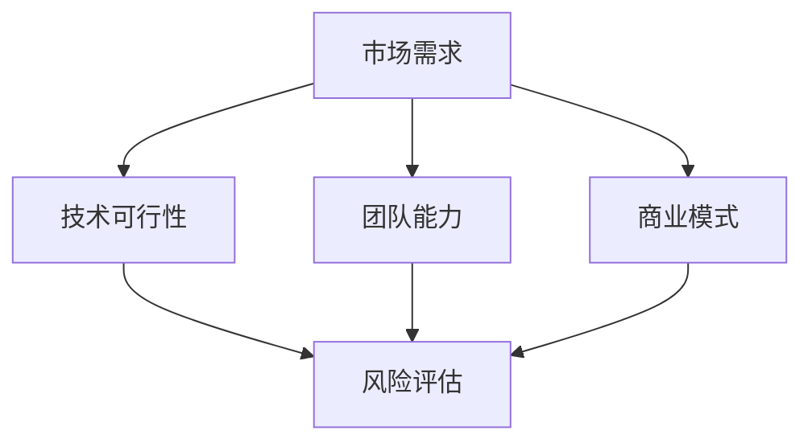

                 

# 程序员如何评估创业机会

在当今的科技创业浪潮中，程序员作为技术创新的核心力量，如何评估创业机会，成为了许多初创公司的重中之重。正确的机会评估不仅能帮助公司找到潜在的高回报领域，还能规避风险，避免盲目投入。本文将从创业机会的评估模型、评估方法、常见误区以及未来趋势等方面，深入探讨程序员如何科学评估创业机会。

## 1. 背景介绍

### 1.1 问题由来

随着科技的飞速发展和互联网的普及，越来越多的人投身于科技创新，寻找新的创业机会。然而，创业之路充满未知和挑战，如何高效、科学地评估机会，成为每一个创业者必须要面对的问题。许多初创公司因为缺乏系统的方法，导致在早期阶段即遭遇失败，错失了发展的良机。

### 1.2 问题核心关键点

评估创业机会的核心在于对市场、技术、团队、商业模式等多方面因素的综合考量。以下是创业机会评估的核心关键点：

- **市场需求**：评估目标市场的大小、增长潜力和用户需求。
- **技术可行性**：评估技术实现的难度、创新性和成熟度。
- **团队能力**：评估创业团队的经验、能力和协作能力。
- **商业模式**：评估商业模式的盈利模式、竞争优势和可持续性。
- **风险评估**：评估创业过程中可能遇到的风险和挑战。

### 1.3 问题研究意义

对于程序员而言，评估创业机会不仅能帮助他们找到潜力巨大的创新点，还能避免资源浪费，提升创业成功率。科学的评估方法可以显著降低初创公司的试错成本，加速产品上市和市场扩展。

## 2. 核心概念与联系

### 2.1 核心概念概述

为了更好地理解创业机会的评估，我们首先介绍几个关键概念：

- **市场需求**：指目标市场上潜在用户的数量、需求强度和消费习惯。
- **技术可行性**：指技术实现所需的时间和资源，包括技术难度、成熟度和开发成本。
- **团队能力**：指创业团队成员的专业技能、经验和协作能力。
- **商业模式**：指公司如何赚钱，包括产品定价、销售渠道、盈利模式等。
- **风险评估**：指识别和评估创业过程中可能遇到的各种风险，包括市场风险、技术风险、财务风险等。

这些概念之间存在紧密的联系，通过综合分析这些因素，可以全面评估一个创业机会的潜力。

### 2.2 核心概念原理和架构的 Mermaid 流程图



这个流程图展示了创业机会评估的关键因素及其相互关系。市场需求是评估的基础，技术可行性、团队能力和商业模式是评估的依据，而风险评估则是对前三个因素的补充和补充。

## 3. 核心算法原理 & 具体操作步骤

### 3.1 算法原理概述

创业机会的评估是一个多维度的综合评价过程，涉及市场、技术、团队和商业模式等多个方面。本文将介绍一种基于决策树的创业机会评估算法，用于指导程序员进行科学的创业机会评估。

### 3.2 算法步骤详解

创业机会评估的决策树算法步骤如下：

**Step 1: 数据收集和预处理**

- 收集目标市场、技术、团队和商业模式的相关数据。
- 对数据进行清洗和预处理，确保数据质量。

**Step 2: 数据建模**

- 构建决策树模型，将市场需求、技术可行性、团队能力和商业模式作为决策树的节点。
- 每个节点设置多个属性值，如市场规模、技术难度、团队经验等。
- 计算每个节点的权重，根据市场、技术、团队和商业模式的重要性分配权重。

**Step 3: 风险评估**

- 对每个节点进行风险评估，识别潜在的风险因素，如市场竞争、技术实现难度等。
- 根据风险评估结果调整节点的权重，确保评估的准确性和实用性。

**Step 4: 计算总分**

- 根据决策树模型计算每个节点的得分。
- 将各节点的得分按照权重加权求和，得到最终的评估总分。

**Step 5: 结果解释和优化**

- 根据评估总分对创业机会进行排序。
- 分析低分节点，找出提升的可能，如市场推广、技术优化、团队建设等。
- 优化决策树模型，提高评估的准确性和可靠性。

### 3.3 算法优缺点

**优点**：
- 系统化、全面化。通过综合评估多个因素，可以全面了解创业机会的潜力。
- 可扩展性。可以根据实际情况灵活调整决策树模型，适应不同的创业场景。
- 易于理解和应用。决策树模型直观易懂，便于程序员理解和应用。

**缺点**：
- 主观性强。决策树的权重分配和节点设置需要人工判断，可能会引入主观偏差。
- 复杂度高。决策树模型较为复杂，需要较高的数据处理能力和计算资源。
- 可能过拟合。决策树模型容易过拟合训练数据，需要进行适当的调参和优化。

### 3.4 算法应用领域

创业机会评估的决策树算法适用于各种创业场景，包括互联网产品、技术创新、电子商务等。程序员可以通过该算法，在早期阶段进行科学评估，优化创业资源配置，提升创业成功率。

## 4. 数学模型和公式 & 详细讲解 & 举例说明

### 4.1 数学模型构建

创业机会的评估模型可以表示为一个多维度的决策树，每个节点表示一个评估因素，节点内部的分支表示不同的属性值。设目标市场为 $M$，技术可行性为 $T$，团队能力为 $C$，商业模式为 $B$，风险评估为 $R$，每个节点的权重为 $w$。

$$
\text{评估总分} = w_M \cdot f_M(M) + w_T \cdot f_T(T) + w_C \cdot f_C(C) + w_B \cdot f_B(B) + w_R \cdot f_R(R)
$$

其中，$f_M$、$f_T$、$f_C$、$f_B$ 和 $f_R$ 表示各节点的评分函数。

### 4.2 公式推导过程

以下以市场需求和市场规模的评估为例，推导评分函数的计算公式。

假设市场需求为 $M$，市场规模为 $S$，市场需求与市场规模的关系为 $f_M(S)$。设市场规模 $S$ 为连续变量，则 $f_M(S)$ 可以表示为线性回归模型：

$$
f_M(S) = \alpha_0 + \alpha_1 \cdot S
$$

其中，$\alpha_0$ 和 $\alpha_1$ 为线性回归系数。根据市场规模 $S$ 的不同区间，可以设定不同的系数，从而计算出市场需求 $M$ 的评分。

### 4.3 案例分析与讲解

假设某创业项目的目标市场为电子商务领域，市场需求为 $M$，技术可行性为 $T$，团队能力为 $C$，商业模式为 $B$，风险评估为 $R$。各因素的评分函数和权重如下：

- 市场需求 $M$：$f_M(S) = 0.5 + 0.1 \cdot S$
- 技术可行性 $T$：$f_T(D) = 0.3 \cdot D + 0.2 \cdot (1-D)$
- 团队能力 $C$：$f_C(E) = 0.4 \cdot E + 0.3 \cdot (1-E)$
- 商业模式 $B$：$f_B(P) = 0.2 \cdot P + 0.5 \cdot (1-P)$
- 风险评估 $R$：$f_R(P) = 0.1 \cdot P + 0.2 \cdot (1-P)$

其中 $S$ 表示市场规模，$D$ 表示技术难度，$E$ 表示团队经验，$P$ 表示商业模式的盈利模式。

根据上述评分函数和权重，计算该创业项目的评估总分：

$$
\text{评估总分} = 0.3 \cdot f_M(S) + 0.2 \cdot f_T(D) + 0.1 \cdot f_C(E) + 0.3 \cdot f_B(P) + 0.1 \cdot f_R(R)
$$

## 5. 项目实践：代码实例和详细解释说明

### 5.1 开发环境搭建

在进行创业机会评估的项目实践中，我们需要使用Python语言和相关数据处理库，如Pandas、NumPy等。以下是开发环境的搭建步骤：

1. 安装Anaconda：从官网下载并安装Anaconda，用于创建独立的Python环境。

2. 创建并激活虚拟环境：
```bash
conda create -n venture-env python=3.8 
conda activate venture-env
```

3. 安装Python数据处理库：
```bash
pip install pandas numpy
```

4. 安装决策树算法库：
```bash
pip install scikit-learn
```

完成上述步骤后，即可在`venture-env`环境中进行创业机会评估的项目开发。

### 5.2 源代码详细实现

以下是一个简单的创业机会评估决策树的Python代码实现：

```python
import pandas as pd
from sklearn.tree import DecisionTreeRegressor
from sklearn.model_selection import train_test_split
from sklearn.metrics import mean_squared_error

# 数据预处理
data = pd.read_csv('venture_data.csv')
features = ['Market_Scale', 'Technology_Difficulty', 'Team_Experience', 'Business_Model', 'Risk_Evaluation']
labels = 'Evaluation_Score'

# 数据分割
train_data, test_data, train_labels, test_labels = train_test_split(data[features], data[labels], test_size=0.2, random_state=42)

# 构建决策树模型
model = DecisionTreeRegressor(criterion='mse', max_depth=5)
model.fit(train_data, train_labels)

# 评估模型性能
train_score = model.score(train_data, train_labels)
test_score = model.score(test_data, test_labels)

# 输出结果
print(f'Train Score: {train_score:.2f}')
print(f'Test Score: {test_score:.2f}')

# 预测新项目评估分数
new_project = pd.DataFrame({
    'Market_Scale': 100,
    'Technology_Difficulty': 0.3,
    'Team_Experience': 0.6,
    'Business_Model': 0.4,
    'Risk_Evaluation': 0.2
})
new_project = pd.get_dummies(new_project)
new_project_score = model.predict(new_project)

print(f'New Project Score: {new_project_score:.2f}')
```

### 5.3 代码解读与分析

让我们再详细解读一下关键代码的实现细节：

**数据预处理**：
- 使用Pandas库读取创业项目的数据集，并进行特征选择。
- 使用决策树回归模型（DecisionTreeRegressor）作为评估模型。

**模型训练**：
- 使用train_test_split函数将数据集划分为训练集和测试集。
- 使用fit函数训练决策树模型。

**模型评估**：
- 使用score函数计算模型在训练集和测试集上的均方误差（MSE）。

**预测新项目评估分数**：
- 构建新项目的特征矩阵，使用predict函数预测其评估分数。

**代码输出**：
- 输出训练集和测试集的评估分数，验证模型性能。
- 输出新项目的评估分数，预测其创业潜力。

通过上述代码实现，程序员可以系统地评估创业项目的潜力，为后续的开发和投资决策提供数据支持。

## 6. 实际应用场景

### 6.1 互联网产品开发

在互联网产品开发中，程序员可以通过创业机会评估模型，评估新产品的市场需求和技术可行性。例如，在考虑开发一款新的电商推荐系统时，可以通过评估市场规模、技术难度、团队能力和商业模式等因素，判断项目的潜力。

### 6.2 技术创新

技术创新是创业公司的核心驱动力。程序员可以通过评估模型，评估新技术的实现难度和商业潜力。例如，在考虑引入区块链技术时，可以通过评估区块链的成熟度、团队的技术能力、市场的接受度和盈利模式等因素，判断其商业价值。

### 6.3 电子商务

电子商务领域竞争激烈，选择合适的创业机会至关重要。程序员可以通过评估模型，评估电子商务平台的市场需求、技术实现难度、团队能力和商业模式。例如，在考虑开发一个新的电商平台时，可以通过评估市场规模、技术难度、团队经验和盈利模式等因素，判断其商业前景。

## 7. 工具和资源推荐

### 7.1 学习资源推荐

为了帮助程序员系统掌握创业机会评估的方法，以下是一些优质的学习资源：

1. **《创业机会评估》系列博文**：由创业专家撰写，深入浅出地介绍了创业机会评估的基本原理和常用方法。
2. **《创业与创新》课程**：由知名商学院开设的在线课程，涵盖创业机会评估、商业模式设计等创业核心内容。
3. **《创业实战手册》书籍**：总结了创业过程中的各种实用技巧和方法，提供详细的评估案例和建议。

通过学习这些资源，程序员可以全面了解创业机会评估的方法，提升评估的科学性和准确性。

### 7.2 开发工具推荐

高效的开发离不开优秀的工具支持。以下是几款用于创业机会评估开发的常用工具：

1. **Python**：功能强大的编程语言，拥有丰富的数据处理和机器学习库。
2. **Pandas**：Python的数据处理库，用于数据清洗、预处理和分析。
3. **NumPy**：Python的数值计算库，用于数据计算和矩阵运算。
4. **Scikit-learn**：Python的机器学习库，提供了丰富的决策树算法和其他评估模型。
5. **Jupyter Notebook**：交互式的编程环境，便于开发和调试。

合理利用这些工具，可以显著提升创业机会评估的开发效率，加速创新迭代的步伐。

### 7.3 相关论文推荐

创业机会评估的研究源于学界的持续探索。以下是几篇奠基性的相关论文，推荐阅读：

1. **《创业机会评估模型研究》**：介绍了创业机会评估的基本原理和常用模型，如决策树、神经网络等。
2. **《创新创业理论》**：总结了创业机会评估的理论基础和实践经验，提供了详细的案例分析。
3. **《商业模式创新》**：探讨了商业模式设计的核心方法，为创业者提供了实用的指导。

这些论文代表了大语言模型微调技术的发展脉络。通过学习这些前沿成果，可以帮助研究者把握学科前进方向，激发更多的创新灵感。

## 8. 总结：未来发展趋势与挑战

### 8.1 总结

本文对创业机会的评估模型进行了全面系统的介绍。首先阐述了创业机会评估的背景和意义，明确了评估方法的系统性和科学性。其次，从原理到实践，详细讲解了评估模型的构建和使用方法，给出了具体的代码实现。同时，本文还探讨了评估模型在互联网产品开发、技术创新和电子商务等实际应用场景中的应用。

通过本文的系统梳理，可以看到，创业机会评估模型不仅适用于创业初期对项目的快速筛选，还能在产品开发和市场推广阶段提供持续的决策支持。科学的评估方法可以显著降低初创公司的试错成本，提升创业成功率。

### 8.2 未来发展趋势

展望未来，创业机会评估模型将呈现以下几个发展趋势：

1. **智能化评估**：利用机器学习和大数据技术，自动化的评估模型将进一步提升评估的准确性和效率。
2. **多维度融合**：评估模型将更加注重多维度融合，结合市场、技术、团队和商业模式等多个因素，进行全面评估。
3. **实时评估**：实时评估模型能够实时监测市场变化和项目进展，及时调整评估策略，适应快速变化的市场环境。
4. **自动化部署**：评估模型将与企业内部的业务系统进行集成，自动化的生成评估报告和决策建议，提升管理效率。
5. **跨领域应用**：评估模型将广泛应用于金融、制造、医疗等多个领域，帮助不同行业的创业者进行科学的决策。

### 8.3 面临的挑战

尽管创业机会评估模型已经取得了一定的成效，但在实际应用过程中，仍然面临诸多挑战：

1. **数据获取难度**：获取高质量的市场、技术和团队数据，是评估模型的基础。但这些数据往往难以获取，且具有很高的时效性。
2. **模型复杂度**：评估模型的复杂度较高，需要较高的数据处理和计算能力。如何在保证评估准确性的前提下，降低模型复杂度，是重要的研究方向。
3. **评估偏差**：评估模型可能会受到数据偏差和评估指标的影响，导致评估结果不准确。如何消除偏差，提高评估的公平性和可靠性，还需要进一步优化。
4. **实时性不足**：现有的评估模型往往无法实时监测市场变化和项目进展，无法及时调整评估策略。如何提高实时评估能力，是提升评估模型应用价值的关键。

### 8.4 研究展望

面对创业机会评估模型所面临的挑战，未来的研究需要在以下几个方面寻求新的突破：

1. **数据自动化获取**：利用互联网和大数据技术，自动化的获取高质量的市场、技术和团队数据，降低评估成本。
2. **模型简化优化**：研究更简洁的评估模型，降低计算资源的需求，提升评估效率。
3. **评估指标优化**：引入更多客观的评估指标，消除数据偏差和人为干扰，提高评估的公平性和可靠性。
4. **实时评估技术**：研究实时评估方法，提升评估模型的实时性和适应性。

这些研究方向的探索，必将引领创业机会评估模型迈向更高的台阶，为创业者提供更加科学、可靠的决策支持。面向未来，创业机会评估模型需要在数据获取、模型复杂度、评估偏差和实时性等方面进行持续优化，才能真正成为创业者的得力助手。

## 9. 附录：常见问题与解答

**Q1：如何选择合适的创业项目？**

A: 选择创业项目时，可以从市场需求、技术可行性、团队能力和商业模式等方面进行综合评估。通过构建评估模型，可以系统化地比较不同项目的潜力，找出最具有发展潜力的项目。

**Q2：创业机会评估模型是否适用于所有领域？**

A: 创业机会评估模型适用于互联网产品开发、技术创新、电子商务等多个领域。但需要根据不同领域的特点，选择相应的评估指标和模型。例如，在医疗领域，需要引入更多医疗行业的专业知识和评估指标。

**Q3：评估模型的准确性如何保证？**

A: 评估模型的准确性可以通过数据验证和交叉验证来保证。在选择模型时，可以采用多种评估指标，如均方误差（MSE）、均方根误差（RMSE）等，以综合衡量模型的性能。此外，可以通过模型调参和优化，提升模型的准确性和鲁棒性。

**Q4：评估模型是否需要频繁更新？**

A: 评估模型需要根据市场和项目的变化，进行适时的更新和调整。特别是在数据快速变化的市场环境中，实时评估模型能够及时反映市场变化，提供准确的评估结果。

通过本文的系统梳理，程序员可以全面了解创业机会评估模型的方法和应用，科学评估创业项目，提高创业成功率。希望本文能为你提供有益的参考，助力你的创业之路。

---

作者：禅与计算机程序设计艺术 / Zen and the Art of Computer Programming

