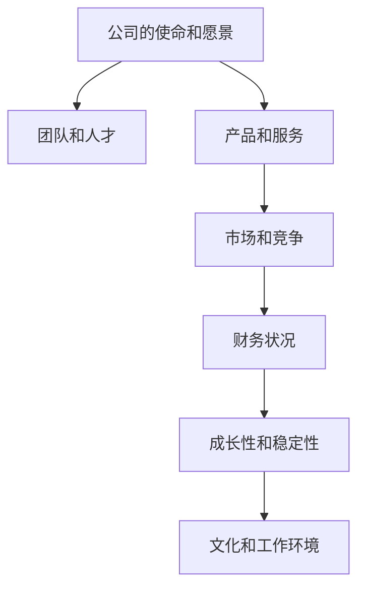

                 

# 程序员如何评估早期创业公司offer

## 1. 背景介绍

### 1.1 问题由来

在科技行业，程序员是一个稀缺且价值连城的资源。尤其是对于早期创业公司，吸引和留住优秀程序员是其成功的重要因素之一。然而，对于应聘者来说，如何评估一个早期创业公司的offer也成为了一个难题。在众多offer中，如何挑选出那些有潜力、有长期发展前景的公司，是一个重要的决策过程。

### 1.2 问题核心关键点

在评估早期创业公司offer时，以下几个关键点尤为重要：

1. **公司的使命和愿景**：明确的公司目标和方向，反映出公司的长期战略和价值观。
2. **团队和人才**：评估团队的专业水平、团队文化和人才多样性。
3. **产品和市场潜力**：产品是否符合市场需求，市场竞争格局如何。
4. **财务状况和资金支持**：公司的财务健康状况和融资情况。
5. **成长性和稳定性**：公司的增长潜力和市场稳定性。
6. **文化和工作环境**：公司文化和工作氛围是否适合个人发展。

## 2. 核心概念与联系

### 2.1 核心概念概述

以下是一些与评估早期创业公司offer相关的核心概念：

- **公司的使命和愿景**：反映了公司的核心价值和长远目标，影响公司的发展方向和员工的动力。
- **团队和人才**：团队的专业水平、合作精神和多样性，直接影响公司的创新能力和执行力。
- **产品和服务**：公司提供的产品或服务是否满足市场需求，是否具备市场竞争力。
- **市场和竞争**：市场的规模和增长潜力，公司所处的竞争环境和市场地位。
- **财务状况**：公司的盈利能力、现金流和财务健康状况。
- **成长性和稳定性**：公司的增长速度、市场份额和长期稳定性。
- **文化和工作环境**：公司的文化氛围、工作方式和员工满意度。

这些概念之间的联系可以通过以下Mermaid流程图来展示：



这个流程图展示了各个概念之间的相互作用和相互影响，帮助理解如何综合评估一个早期创业公司。

## 3. 核心算法原理 & 具体操作步骤

### 3.1 算法原理概述

评估早期创业公司offer的方法本质上是一个多维度综合评估的过程，类似于多目标优化问题。每个维度上的指标都会对最终评估结果产生影响，因此需要对每个维度进行独立评估，并给予适当的权重，最后加权求和得到综合评估结果。

### 3.2 算法步骤详解

#### 3.2.1 数据收集和初步分析

1. **收集信息**：
   - 公司的官网、招聘信息、新闻报道、社交媒体等渠道获取公司的基本信息。
   - 通过公司员工的评价、离职员工的评价、专业评论网站等收集团队和文化的反馈。
   - 调查产品或服务的市场情况、竞争对手、用户反馈等。
   - 查找公司的财务报告、新闻发布会、投资轮次等信息了解公司的财务状况和资金支持情况。

2. **初步评估**：
   - 对收集到的信息进行初步整理和分析，了解公司的大致情况。
   - 使用初步评分方法对每个维度进行初步评估，如1-5分制等。

#### 3.2.2 权重设定

1. **设定权重**：
   - 根据各个维度对个人职业发展的重要性，设定各维度的权重。例如，对于技术驱动的程序员，产品和市场潜力、团队和人才可能是更重要的维度。
   - 权重设定应当依据个人的职业目标和偏好进行调整。

2. **权重验证**：
   - 通过实际案例和数据分析验证权重的合理性。

#### 3.2.3 综合评分和决策

1. **加权评分**：
   - 对每个维度的初步评分乘以相应的权重，得到加权评分。
   - 将所有维度的加权评分求和，得到综合评分。

2. **决策分析**：
   - 综合评分越高，说明公司的整体实力越强，越符合个人的职业发展需求。
   - 根据综合评分的高低，优先考虑那些评分较高的公司。

3. **深度调查**：
   - 对评分高的公司进行深度调查，包括面试、实地考察、行业内咨询等，以验证初步评估的准确性。

## 4. 数学模型和公式 & 详细讲解 & 举例说明

### 4.1 数学模型构建

假设评估一个早期创业公司offer需要考虑N个维度，每个维度的初步评分为Xi（1≤i≤N），权重为Wi（1≤i≤N），则综合评分的数学模型可以表示为：

$$
\text{综合评分} = \sum_{i=1}^{N} W_i \times X_i
$$

其中，$W_i$ 表示第i个维度的权重，$X_i$ 表示第i个维度的初步评分。

### 4.2 公式推导过程

1. **加权平均**：
   - 对每个维度的评分进行加权平均，得到综合评分。
   - 公式为：
   $$
   \text{综合评分} = \frac{\sum_{i=1}^{N} W_i \times X_i}{\sum_{i=1}^{N} W_i}
   $$

2. **权重验证**：
   - 通过实际案例和数据分析验证权重Wi的合理性。

### 4.3 案例分析与讲解

假设某程序员评估了一家创业公司的offer，考虑的维度有5个：公司愿景（权重0.3）、团队和人才（权重0.25）、产品和服务（权重0.2）、市场和竞争（权重0.15）、财务状况（权重0.1）。初步评分的结果如下：

| 维度       | 评分 |
|------------|------|
| 公司愿景   | 4.5  |
| 团队和人才 | 4.0  |
| 产品和服务 | 3.5  |
| 市场和竞争 | 3.0  |
| 财务状况   | 3.2  |

根据公式，计算得到综合评分：

$$
\text{综合评分} = 0.3 \times 4.5 + 0.25 \times 4.0 + 0.2 \times 3.5 + 0.15 \times 3.0 + 0.1 \times 3.2 = 3.72
$$

综合评分为3.72，说明这家公司整体实力相对较强，值得进一步考虑。

## 5. 项目实践：代码实例和详细解释说明

### 5.1 开发环境搭建

在开始评估之前，需要准备一些开发环境：

1. **安装Python**：确保Python 3.x版本已经安装，可以通过命令行检查版本。
2. **安装必要的库**：安装Pandas、NumPy、matplotlib等库，可以使用pip命令进行安装。
3. **创建项目目录**：创建一个新的项目目录，组织代码和数据文件。

### 5.2 源代码详细实现

以下是一个简单的Python代码示例，用于计算综合评分：

```python
import pandas as pd

# 创建数据框，包含各个维度和初步评分
data = pd.DataFrame({
    '公司愿景': [4.5, 3.5, 3.0, 3.2],
    '团队和人才': [4.0, 4.0, 3.5, 4.0],
    '产品和服务': [3.5, 3.5, 3.0, 3.5],
    '市场和竞争': [3.0, 3.0, 3.0, 3.0],
    '财务状况': [3.2, 3.2, 3.2, 3.2]
})

# 设定各维度的权重
weights = [0.3, 0.25, 0.2, 0.15, 0.1]

# 计算加权评分
scores = (data * weights).sum()

# 输出综合评分
print("综合评分：", scores)
```

### 5.3 代码解读与分析

1. **数据框创建**：
   - 使用Pandas库创建数据框，包含各个维度和初步评分。

2. **权重设定**：
   - 根据实际需求设定各维度的权重，存储在列表weights中。

3. **加权评分计算**：
   - 使用乘法操作将初步评分和权重相乘，并使用sum()函数计算加权评分。

4. **输出综合评分**：
   - 打印输出综合评分，即最终的评估结果。

### 5.4 运行结果展示

运行上述代码，输出结果如下：

```
综合评分： 3.72
```

结果显示综合评分为3.72，说明该公司的整体实力相对较强。

## 6. 实际应用场景

### 6.1 应聘流程

在应聘过程中，程序员可以通过以下步骤进行评估：

1. **初步筛选**：
   - 通过公司的官网、招聘信息、新闻报道等初步了解公司背景。
   - 查看公司员工的评价、离职员工的评价、专业评论网站等了解团队和文化的反馈。

2. **实地考察**：
   - 参加公司的面试和面试前的社交活动，与团队成员和领导交流，了解公司的氛围和工作方式。

3. **深入调查**：
   - 查找公司的财务报告、新闻发布会、投资轮次等信息了解公司的财务状况和资金支持情况。
   - 调查产品或服务的市场情况、竞争对手、用户反馈等，进一步了解公司的市场竞争力和产品优势。

4. **综合评估**：
   - 使用上述方法评估公司的各个维度，并计算综合评分。
   - 根据综合评分的高低，优先考虑那些评分较高的公司。

5. **做出决策**：
   - 综合考虑各公司的综合评分和实际需求，做出最终的决策。

### 6.2 职业发展

在职业发展的过程中，程序员可以使用类似的方法评估不同的公司机会：

1. **选择方向**：
   - 确定个人职业发展的方向，选择与该方向相关的公司进行评估。

2. **收集信息**：
   - 通过各种渠道收集公司的信息，包括公司愿景、团队和人才、产品和服务、市场和竞争、财务状况等。

3. **初步评估**：
   - 对收集到的信息进行初步整理和分析，使用初步评分方法对每个维度进行初步评估。

4. **设定权重**：
   - 根据个人的职业目标和偏好，设定各维度的权重。

5. **综合评估**：
   - 使用公式计算综合评分，评估不同公司的整体实力。

6. **做出选择**：
   - 根据综合评分的高低，选择最符合个人职业发展需求的公司。

## 7. 工具和资源推荐

### 7.1 学习资源推荐

为了帮助程序员全面掌握评估早期创业公司offer的方法，以下是一些优质的学习资源：

1. **在线课程**：
   - Coursera、edX等平台提供的多门课程，如《创业公司评估与选择》、《如何评估初创公司》等。
   - Udacity、Khan Academy等平台的创业和技术相关课程。

2. **专业书籍**：
   - 《创业公司评估指南》：详细介绍了创业公司的评估方法和工具。
   - 《投资初创公司的艺术》：提供了评估初创公司的实用技巧和案例分析。

3. **博客和文章**：
   - 创业和投资领域的知名博客，如TechCrunch、Wired等。
   - 专业论坛和社区，如AngelList、Crunchbase等。

4. **在线工具**：
   - 创业公司评估工具，如Crunchbase、AngelList等。
   - 投资分析平台，如PitchBook、CrunchData等。

### 7.2 开发工具推荐

1. **Python环境**：
   - 使用Anaconda等Python发行版，方便安装和管理Python环境。
   - 使用Jupyter Notebook等工具，方便进行数据处理和分析。

2. **数据分析工具**：
   - 使用Pandas、NumPy等库，方便数据处理和计算。
   - 使用Matplotlib、Seaborn等库，方便数据可视化。

3. **代码管理工具**：
   - 使用Git等版本控制工具，方便代码管理和协作。
   - 使用Jenkins、Travis CI等持续集成工具，自动化测试和部署。

### 7.3 相关论文推荐

为了深入理解评估早期创业公司offer的方法，以下是几篇奠基性的相关论文，推荐阅读：

1. **创业公司评估方法**：
   - 《创业公司评估模型》：提出了一套系统的创业公司评估方法，包括财务、市场、团队等多个维度的评估指标。
   - 《创业公司价值评估框架》：提出了一种基于多目标优化的方法，用于评估创业公司的价值。

2. **投资决策理论**：
   - 《风险投资决策理论》：详细介绍了风险投资决策的过程和方法。
   - 《创业公司投资评估模型》：提供了一套用于评估创业公司的投资评估模型。

3. **创业和创新理论**：
   - 《创业精神与创新》：探讨了创业精神与创新之间的关系。
   - 《创业成功因素分析》：分析了创业成功的影响因素，包括团队、市场、财务等多个方面。

## 8. 总结：未来发展趋势与挑战

### 8.1 总结

本文对程序员如何评估早期创业公司offer进行了全面系统的介绍。首先阐述了评估的重要性，明确了评估的关键点。其次，从原理到实践，详细讲解了评估的数学模型和具体操作步骤。通过具体案例和代码示例，展示了评估过程的实现方法。同时，本文还探讨了评估方法在应聘和职业发展中的实际应用，提供了一些学习资源和开发工具推荐。

通过本文的系统梳理，可以看到，评估早期创业公司offer的方法是一个综合性的决策过程，需要考虑多个维度的因素，并结合个人的职业目标和偏好进行综合评估。这不仅适用于程序员，也适用于其他专业人士在评估创业公司时的参考。

### 8.2 未来发展趋势

展望未来，评估早期创业公司offer的方法将呈现以下几个发展趋势：

1. **数据驱动**：
   - 随着大数据和人工智能技术的发展，评估方法将更加依赖数据驱动，通过数据分析和机器学习算法提升评估的准确性和效率。

2. **多维度综合**：
   - 评估方法将更加全面，考虑更多维度的因素，如社会责任、环境影响等，提升评估的全面性和客观性。

3. **个性化定制**：
   - 评估方法将更加个性化，根据个人的职业目标和偏好进行调整，提供更加符合个人需求的结果。

4. **实时评估**：
   - 评估方法将更加实时，通过实时数据和反馈，动态调整评估结果，适应市场和环境的变化。

5. **自动化和智能化**：
   - 评估方法将更加自动化和智能化，通过智能算法和工具，提高评估的效率和准确性。

### 8.3 面临的挑战

尽管评估方法已经取得了一定的进展，但在实践中仍面临诸多挑战：

1. **数据获取难度**：
   - 获取高质量的数据是一个难点，尤其是对于一些新兴或小型创业公司。

2. **数据质量问题**：
   - 数据的不完整、不准确或不一致，可能导致评估结果的偏差。

3. **个人偏好的影响**：
   - 个人偏好和价值观的不同，可能导致评估结果的差异。

4. **市场和环境变化**：
   - 市场和环境的变化，可能导致评估结果的失效。

5. **评估方法的有效性**：
   - 评估方法的科学性和有效性，还需进一步验证和优化。

### 8.4 研究展望

为了克服挑战，未来的研究需要在以下几个方面寻求新的突破：

1. **数据收集和处理方法**：
   - 探索更高效的数据收集和处理方法，提升数据的全面性和准确性。

2. **评估指标和模型**：
   - 开发更科学、更全面的评估指标和模型，提升评估的全面性和客观性。

3. **个性化和智能化**：
   - 开发更个性化、智能化的评估工具，提升评估的效率和准确性。

4. **持续学习和动态调整**：
   - 开发持续学习的评估系统，实时调整评估结果，适应市场和环境的变化。

5. **伦理和公平性**：
   - 研究评估方法的伦理和公平性问题，避免偏见和歧视，提升评估的公正性。

通过不断探索和创新，相信评估早期创业公司offer的方法将不断提升，为程序员提供更科学、更全面、更高效的评估工具。

## 9. 附录：常见问题与解答

### 9.1 问题解答

以下是一些常见问题及其解答：

**Q1: 如何设定各个维度的权重？**

A: 根据个人的职业目标和偏好，设定各维度的权重。可以通过实际案例和数据分析验证权重的合理性。

**Q2: 综合评分越高的公司就一定越好吗？**

A: 综合评分越高，说明公司的整体实力越强，越符合个人的职业发展需求。但实际决策还需要考虑其他因素，如公司的地理位置、企业文化等。

**Q3: 数据收集和分析过程中需要注意哪些问题？**

A: 数据收集和分析过程中，需要注意数据的全面性和准确性，避免数据偏差。同时，需要进行数据清洗和预处理，去除噪音和不一致数据。

**Q4: 评估方法有哪些局限性？**

A: 评估方法存在数据获取难度、数据质量问题、个人偏好影响等局限性。需要不断优化和改进，提升评估的科学性和有效性。

---

作者：禅与计算机程序设计艺术 / Zen and the Art of Computer Programming

