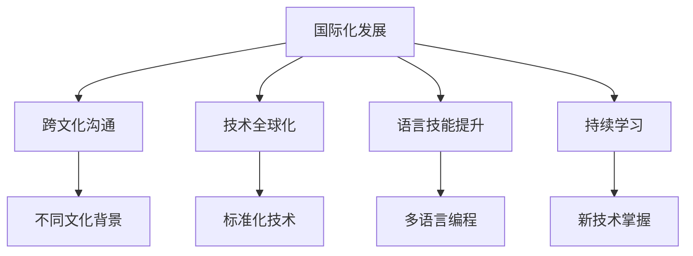

                 

# 程序员如何进行国际化发展

## 1. 背景介绍

在全球化背景下，技术人才的国际化发展已成为推动企业竞争力和创新能力的关键因素。随着国际市场的开拓，越来越多的中国企业在全球各地设立研发中心和分公司，需要大量具备国际视野和技术实力的程序员。

本文旨在探讨中国程序员如何更好地进行国际化发展，理解国际工程标准，提升跨文化沟通能力，把握国际化发展的机遇与挑战，为程序员在国际化发展道路上的职业规划和技能提升提供全面指导。

## 2. 核心概念与联系

### 2.1 核心概念概述

- **国际化发展**：指程序员在国际化的工作环境和技术环境中，进行职业生涯的拓展、技术能力和语言能力的提升。
- **跨文化沟通**：在国际化的团队和项目中，理解和适应不同文化背景下的沟通方式和习惯。
- **技术全球化**：技术的标准化和规范化，使得技术人才能够在不同国家和地区进行自由流动和合作。
- **语言技能提升**：掌握多门编程语言和国际化工作所需的英语（或其他常用语言）能力，增强国际交流和合作。
- **持续学习**：在快速变化的技术领域中，不断更新知识和技能，保持竞争力。

### 2.2 核心概念原理和架构的 Mermaid 流程图



该图展示了国际化发展的核心概念及其相互关系。国际化发展以技术全球化为基石，通过跨文化沟通、提升语言技能和持续学习，最终实现程序员在全球化环境中更好地进行职业发展和技能提升。

## 3. 核心算法原理 & 具体操作步骤

### 3.1 算法原理概述

国际化发展的核心算法原理主要体现在以下几个方面：

- **标准化技术**：理解和掌握国际通用的技术标准和规范，确保技术方案的跨文化可移植性和互操作性。
- **多语言编程**：掌握多种编程语言，以便在国际化项目中灵活应用。
- **持续学习**：在技术领域内持续学习和更新知识，以适应快速变化的技术环境。

### 3.2 算法步骤详解

#### 3.2.1 标准化技术

1. **选择合适的技术框架和标准**：
   - 选择国际通用且被广泛认可的技术框架，如Spring、React、Vue等。
   - 遵守国际标准和行业规范，如RESTful API、OAuth 2.0、JSON API等。

2. **参与国际项目和开源社区**：
   - 积极参与国际项目，如Google Summer of Code、GitHub上国际开源项目等，积累国际工作经验。
   - 在开源社区中贡献代码，提升技术影响力。

#### 3.2.2 多语言编程

1. **掌握多种编程语言**：
   - 熟练掌握常用的编程语言，如Java、Python、JavaScript等。
   - 学习并掌握与国际市场相关的编程语言，如Ruby、Go、Kotlin等。

2. **灵活应用多语言**：
   - 在项目中根据需求灵活切换编程语言，提高开发效率。
   - 使用语言转换工具，如Google Cloud Translation API，支持多语言代码的互操作性。

#### 3.2.3 持续学习

1. **制定学习计划**：
   - 根据职业规划，制定详细的学习计划，定期更新技术知识。
   - 关注国际技术动态，订阅国际知名技术博客和论坛，如Medium、Hacker News等。

2. **参加国际技术会议和培训**：
   - 参加国际技术会议，如GITCon、TechCrunch Disrupt等，获取前沿技术信息。
   - 参加技术培训班，如Coursera、Udemy等，提升技术水平。

### 3.3 算法优缺点

#### 3.3.1 标准化技术的优点和缺点

**优点**：
- 提高技术的可移植性和互操作性，方便在不同国家地区的技术协作和知识共享。
- 符合国际标准和行业规范，有助于项目在全球范围内的推广和应用。

**缺点**：
- 需要适应和掌握新的技术和标准，可能存在一定的学习曲线。
- 标准化技术可能存在局限性，无法满足所有场景和需求。

#### 3.3.2 多语言编程的优点和缺点

**优点**：
- 适应国际化的需求，能够灵活地在不同国家使用多种语言进行开发。
- 提升开发团队的国际协作能力，方便跨文化团队的工作。

**缺点**：
- 多语言编程增加了学习成本，需要持续投入时间和精力。
- 代码维护和调试可能会变得更加复杂，需要具备较高的技术水平。

#### 3.3.3 持续学习的优点和缺点

**优点**：
- 保持技术竞争力和适应能力，不断更新知识和技能。
- 提高工作效率和创新能力，跟上技术发展的步伐。

**缺点**：
- 需要持续投入时间和精力，可能影响工作和生活平衡。
- 可能存在技术学习疲劳，需要定期休息和调整学习计划。

### 3.4 算法应用领域

国际化发展的算法主要应用于以下几个领域：

- **企业国际化**：
  - 企业在全球范围内拓展业务，需要国际化技术人才。
  - 国际项目开发和技术支持，提升企业全球竞争力。

- **跨国公司**：
  - 跨国公司需要全球协作和跨文化沟通，提升技术人才的国际化水平。
  - 跨国项目管理和技术创新，推动公司技术发展和品牌国际化。

- **国际开源社区**：
  - 参与国际开源项目，提升技术影响力。
  - 贡献代码和参与社区活动，扩大国际影响力。

## 4. 数学模型和公式 & 详细讲解 & 举例说明

### 4.1 数学模型构建

国际化发展的数学模型主要基于以下几个要素：

- **技术能力**：用$T$表示，包括技术框架选择、标准化技术和多语言编程。
- **语言能力**：用$L$表示，包括英语或其他国际通用语言的掌握程度。
- **沟通能力**：用$C$表示，包括跨文化沟通技能和国际化项目经验。
- **学习投入**：用$L$表示，包括时间和精力的投入，如参加国际会议、培训和学习。

### 4.2 公式推导过程

根据以上模型，我们可以建立如下数学公式：

$$
D = f(T, L, C, L)
$$

其中，$D$表示国际化发展的综合得分，$f$表示函数关系，$T, L, C, L$分别表示技术能力、语言能力、沟通能力和学习投入。

### 4.3 案例分析与讲解

假设一个程序员具备以下技能：

- 技术能力：掌握Java、Python和JavaScript，熟悉RESTful API。
- 语言能力：英语流利，可以阅读和写作技术文档。
- 沟通能力：有国际项目经验，能流利地进行跨文化沟通。
- 学习投入：每年参加2次国际技术会议，订阅了国际知名技术博客。

根据上述公式，可以计算出该程序员的国际化发展综合得分。

## 5. 项目实践：代码实例和详细解释说明

### 5.1 开发环境搭建

在国际化开发环境中，需要使用支持多种编程语言的开发工具。以下是Python环境下国际化开发环境搭建的步骤：

1. **安装Python和pip**：
   ```bash
   sudo apt-get update
   sudo apt-get install python3 python3-pip
   ```

2. **安装虚拟环境管理工具**：
   ```bash
   pip install virtualenv
   ```

3. **创建虚拟环境**：
   ```bash
   virtualenv venv
   source venv/bin/activate
   ```

4. **安装必要的开发工具**：
   ```bash
   pip install flask flask Restful
   ```

### 5.2 源代码详细实现

以下是一个使用Flask框架实现国际化Web服务的示例：

```python
from flask import Flask, jsonify
from flask_restful import Resource, Api

app = Flask(__name__)
api = Api(app)

class HelloWorld(Resource):
    def get(self):
        return jsonify({'message': 'Hello, World!'})

api.add_resource(HelloWorld, '/')

if __name__ == '__main__':
    app.run(debug=True)
```

### 5.3 代码解读与分析

1. **Flask框架**：
   - Flask是一个轻量级的Python Web框架，非常适合开发国际化Web服务。
   - 使用Flask-RESTful扩展，方便实现RESTful API接口。

2. **国际化支持**：
   - 使用Python的`gettext`模块，支持多语言字符串的国际化。
   - 在Flask的模板中使用`_`函数，自动进行字符串的翻译。

3. **多语言支持**：
   - 定义多语言配置文件`locale/`，包含不同语言的翻译文件。
   - 在Flask应用中配置多语言环境，通过`_()`函数进行字符串翻译。

### 5.4 运行结果展示

1. **启动服务**：
   ```bash
   python main.py
   ```

2. **访问API**：
   - 使用浏览器访问`http://localhost:5000/`，看到多语言支持的结果。
   - 使用`curl`工具测试API，验证多语言支持是否正常。

## 6. 实际应用场景

### 6.1 国际项目合作

在全球化项目中，国际项目合作是程序员国际化发展的核心场景。国际项目通常需要跨文化沟通、多语言编程和标准化技术，这为程序员提供了全面提升技能的机会。

**案例**：
- 一家中国公司在美国设立研发中心，需要招聘具备国际视野的程序员。
- 程序员需要在本地化项目中，灵活应用多种编程语言和技术框架，与国际团队进行协作。

### 6.2 跨国公司技术团队

跨国公司技术团队是程序员国际化发展的理想场所，提供丰富的国际化项目和技术环境。

**案例**：
- 一名程序员加入一家跨国公司的技术团队，负责全球市场的技术开发。
- 该程序员需要掌握多语言编程，进行国际化的技术研究和创新。

### 6.3 国际开源社区贡献

参与国际开源社区，是程序员国际化发展的重要途径。通过贡献代码、参加项目讨论和社区活动，提升技术影响力。

**案例**：
- 一名程序员在GitHub上找到了一个国际开源项目，贡献了几段代码。
- 该项目得到国际社区的认可，程序员获得了更多的国际合作机会。

## 7. 工具和资源推荐

### 7.1 学习资源推荐

1. **Coursera**：
   - 提供国际知名的在线课程，涵盖计算机科学和信息技术领域的各个方面。
   - 有丰富的国际化编程课程，如`Programming for Everybody (Getting Started with Python)`、`Python Data Structures`等。

2. **Udemy**：
   - 提供高质量的编程和软件开发课程，支持多语言学习。
   - 国际知名讲师授课，如`Complete Python Bootcamp`、`JavaScript for Beginners`等。

3. **Medium**：
   - 提供国际技术博客平台，汇聚全球顶尖程序员和技术专家。
   - 可以关注国际知名的技术博主，如` freeCodeCamp`、`The Net Ninja`等。

4. **Hacker News**：
   - 国际知名的技术新闻和讨论平台，涵盖最新的技术和行业动态。
   - 关注`Programming`和`Computer Science`板块，获取前沿技术信息。

### 7.2 开发工具推荐

1. **PyCharm**：
   - 功能强大的IDE，支持多语言编程和国际化开发。
   - 提供多种插件和工具，方便调试和测试国际化代码。

2. **GitHub**：
   - 全球最大的代码托管平台，提供丰富的开源项目和技术社区。
   - 参与国际开源项目，提升技术影响力。

3. **Visual Studio Code**：
   - 轻量级的代码编辑器，支持多语言编程和国际化。
   - 有丰富的插件和扩展，方便进行国际化的开发和调试。

### 7.3 相关论文推荐

1. **"Building and Evolving Cross-Cultural IT Team Knowledge Bases: A Social Information Processing Framework for Technical Knowledge Sharing"**：
   - 探讨跨文化团队知识共享的模型和框架，提升团队国际化能力。

2. **"Technical Globalization: A Categorization and Analysis of Global Software Development (GSD) Characteristics"**：
   - 分析全球软件开发的特点和趋势，提升技术国际化水平。

## 8. 总结：未来发展趋势与挑战

### 8.1 研究成果总结

国际化发展已成为程序员职业规划的重要方向，具有广阔的市场前景和发展潜力。通过理解国际工程标准、提升跨文化沟通能力和持续学习，程序员可以更好地适应国际化的技术环境。

### 8.2 未来发展趋势

1. **技术全球化加速**：
   - 全球技术标准和规范逐步统一，技术人才的国际化需求日益增加。
   - 跨国公司和技术团队在全球市场的重要性不断提升。

2. **语言技能提升**：
   - 多语言编程和跨文化沟通能力的重要性不断增加。
   - 国际知名编程语言和技术框架的使用普及度不断提高。

3. **持续学习成为常态**：
   - 技术快速迭代，持续学习成为职业发展的必然选择。
   - 技术培训和在线教育平台的普及度不断提高。

### 8.3 面临的挑战

1. **跨文化沟通的挑战**：
   - 不同文化背景的沟通习惯和思维方式可能存在差异。
   - 需要不断学习和适应，提升跨文化沟通能力。

2. **标准化技术的挑战**：
   - 国际标准和行业规范可能存在差异，需要灵活应用和调整。
   - 需要不断学习和掌握新的技术和标准。

3. **多语言编程的挑战**：
   - 多语言编程增加了学习成本，需要持续投入时间和精力。
   - 代码维护和调试可能变得更加复杂，需要具备较高的技术水平。

4. **持续学习的挑战**：
   - 需要持续投入时间和精力，可能影响工作和生活平衡。
   - 可能存在技术学习疲劳，需要定期休息和调整学习计划。

### 8.4 研究展望

1. **跨文化沟通的提升**：
   - 通过文化交流和培训，提升跨文化沟通能力。
   - 建立跨文化团队，促进国际合作和技术交流。

2. **标准化技术的优化**：
   - 优化技术框架和标准，提高技术的可移植性和互操作性。
   - 根据项目需求，灵活选择和应用标准化技术。

3. **多语言编程的实践**：
   - 在国际化项目中灵活切换编程语言，提高开发效率。
   - 使用语言转换工具，支持多语言代码的互操作性。

4. **持续学习的策略**：
   - 制定详细的学习计划，定期更新技术知识。
   - 参加国际技术会议和培训，提升技术水平。

## 9. 附录：常见问题与解答

**Q1: 国际化发展需要投入多少时间和精力？**

A: 国际化发展需要持续投入时间和精力，具体投入量因人而异。一般来说，每周至少投入10-20小时进行学习和实践，才能取得显著效果。

**Q2: 国际化发展的关键是什么？**

A: 国际化发展的关键在于标准化技术、多语言编程和持续学习。这些要素共同作用，才能在国际化的技术环境中获得竞争力和创新能力。

**Q3: 如何提升跨文化沟通能力？**

A: 提升跨文化沟通能力需要多方面的努力：
- 学习不同文化背景下的沟通习惯和思维方式。
- 参加国际交流和培训，积累跨文化沟通经验。
- 与不同文化背景的同事和客户进行互动和沟通。

**Q4: 如何平衡国际化发展和本职工作？**

A: 平衡国际化发展和本职工作需要合理规划时间和精力：
- 制定详细的国际化发展计划，分配时间进行学习和实践。
- 在工作和生活中合理分配时间和精力，避免过度疲劳。

**Q5: 国际化发展的未来趋势是什么？**

A: 国际化发展的未来趋势包括技术全球化加速、语言技能提升和持续学习成为常态。随着技术标准和行业规范的统一，技术人才的国际化需求将进一步增加。

---

作者：禅与计算机程序设计艺术 / Zen and the Art of Computer Programming

