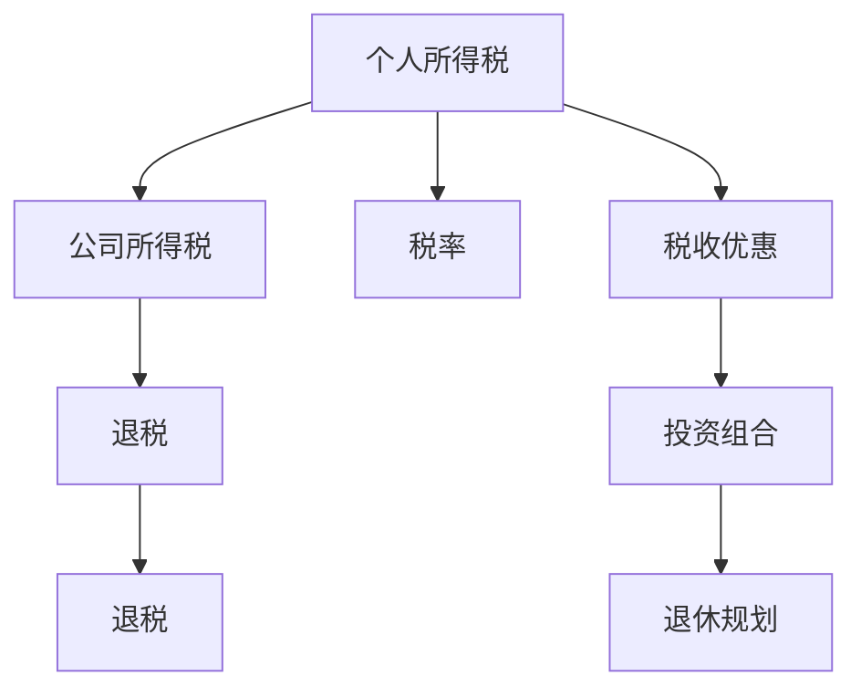

                 

# 程序员如何进行税务规划

> 关键词：程序员,税务规划,税法,税率,税收优惠,个人所得税,公司所得税,退休规划,投资组合,预算规划

## 1. 背景介绍

### 1.1 问题由来
在现代社会，税收是每个个人和企业的必须面对的重要财务问题之一。尤其是对于程序员这样的高收入群体，由于其收入的特殊性（通常是工资与奖金的组合），如何合理合法地进行税务规划，以减轻税负，提高生活质量，成为了一项重要任务。同时，随着中国税制的不断变化，政策环境的不确定性也使得税务规划变得更加复杂。

### 1.2 问题核心关键点
程序员进行税务规划的核心关键点包括：

- 熟悉税法和相关政策，理解税前和税后收入差异。
- 掌握不同税务策略，利用税收优惠和节税机会。
- 了解各类税务工具和平台，提高税务规划效率。
- 建立科学合理的投资组合，实现税收优化。
- 考虑长远的退休和财富传承规划，确保税务安排的持续性和稳健性。

## 2. 核心概念与联系

### 2.1 核心概念概述

为更好地理解程序员如何进行税务规划，本节将介绍几个关键概念：

- **个人所得税**：针对个人工资、薪金所得等各项收入征收的一种税。
- **公司所得税**：对公司的利润征收的一种税，通常由公司自行申报并缴纳。
- **税率**：计算应纳税额与所得额的比例，包括超额累进税率和固定税率等。
- **税收优惠**：包括各类免税、减税和专项附加扣除等，旨在鼓励某些行为或减轻特定群体的税负。
- **退税**：指个人或企业根据税法规定，可以在一定条件下申请退还已缴纳的部分税款。
- **投资组合**：通过合理配置各类金融产品，如股票、债券、基金等，实现风险和收益的最优平衡。
- **退休规划**：根据个人财务状况和目标，进行长期规划，确保退休后的生活品质。

这些核心概念之间的逻辑关系可以通过以下Mermaid流程图来展示：



这个流程图展示了个税和公司所得税的基本联系，税率的作用，税收优惠的运用，以及投资组合和退休规划的税务影响。

## 3. 核心算法原理 & 具体操作步骤
### 3.1 算法原理概述

程序员税务规划的本质是利用税法中的各种条款和优惠政策，合理规划收入和支出，以最小化应纳税额。其核心算法原理包括：

- **收入结构优化**：通过合理安排工资、奖金和投资收益等收入方式，最大化享受税收优惠。
- **成本与费用的合理扣除**：利用税法允许的各项费用扣除，降低应纳税所得额。
- **税负前移**：通过提前支付费用，如首付款、教育费用等，减少当期应纳税所得额。
- **投资多样化**：通过合理配置股票、债券等投资品种，利用不同投资产品的税收优惠，优化税务负担。
- **税收递延**：利用退休账户、教育储蓄等工具，实现税收递延，降低当前税负。

### 3.2 算法步骤详解

**Step 1: 税法学习与政策解读**

- 熟悉税法基本规定和相关政策，包括个人所得税、公司所得税、增值税等各类税种的法规。
- 了解各类税收优惠和减免条件，如免税额度、专项附加扣除、税收抵扣等。
- 跟踪最新的税收政策变化，保持对税法动态的敏感性。

**Step 2: 税务现状评估**

- 梳理个人的工资、奖金、投资收益等各项收入，计算应纳税所得额。
- 评估各类费用和支出，识别可以合理扣除的项目。
- 分析当前的税务负担和可能存在的税务风险。

**Step 3: 税务策略制定**

- 根据收入和支出情况，制定合理的税务策略，如利用税收优惠、合理扣除等。
- 调整投资组合，利用不同投资工具的税收特点，优化税务负担。
- 规划退休和财富传承，合理配置各类金融产品，实现长期税务优化。

**Step 4: 实施与监控**

- 根据制定的税务策略，调整个人和企业的财务计划，实施税务优化措施。
- 定期监控税务状况，及时调整策略应对政策变化。
- 利用税务软件和平台，提高税务规划的效率和准确性。

### 3.3 算法优缺点

程序员税务规划的算法具有以下优点：

- **灵活性**：根据个人和企业的实际情况，灵活调整税务策略，优化税务负担。
- **合规性**：遵循税法规定，避免税务风险，确保税务安排的合法性。
- **系统性**：利用税务软件和平台，实现系统化的税务规划，提高效率。
- **长期性**：考虑长期税务安排，确保税务规划的持续性和稳健性。

但同时，该算法也存在一些局限性：

- **复杂性**：税法法规复杂多变，税务规划需要较高的专业知识和技能。
- **不确定性**：税法政策存在不确定性，税务规划需要持续跟踪和调整。
- **依赖性**：税务规划依赖于税法规定和政策，政策变化可能影响税务安排。
- **时效性**：税法政策更新频率高，税务规划需要及时跟进和更新。

### 3.4 算法应用领域

程序员税务规划的应用领域主要包括：

- 个人所得税规划
- 公司所得税规划
- 股权激励税务规划
- 股票期权税务规划
- 房屋贷款税务规划
- 退休规划与财富传承

这些应用领域涵盖了个人和企业税务规划的方方面面，程序员可以根据实际需要，灵活运用不同的税务策略，优化税务负担。

## 4. 数学模型和公式 & 详细讲解 & 举例说明

### 4.1 数学模型构建

在程序员税务规划中，常用的数学模型包括个人所得税和公司所得税的计算模型。以个人所得税为例，假设个人应纳税所得额为 $Y$，适用的税率为 $T(Y)$，则应纳税额 $A$ 可以表示为：

$$ A = Y \times T(Y) $$

其中 $T(Y)$ 为分段函数，表示不同收入段的税率。

### 4.2 公式推导过程

个人所得税的计算公式如下：

$$ A = \left\{
\begin{aligned}
0.1Y & , & Y \leq 36000 \\
0.1(Y-36000) + 3270 & , & 36000 < Y \leq 144000 \\
0.2(Y-144000) + 25230 & , & 144000 < Y \leq 300000 \\
0.25(Y-300000) + 55205 & , & 300000 < Y \leq 420000 \\
0.30(Y-420000) + 77355 & , & 420000 < Y \leq 660000 \\
0.35(Y-660000) + 141035 & , & 660000 < Y \leq 960000 \\
0.45(Y-960000) + 255255 & , & Y > 960000
\end{aligned}
\right.$$

公司所得税的计算公式相对简单，假设公司税前利润为 $P$，公司所得税率为 $C$，则应缴公司所得税 $T$ 为：

$$ T = P \times C $$

### 4.3 案例分析与讲解

假设一位程序员的年度应纳税所得额为 200,000 元，其工资和奖金合计为 120,000 元，投资收益为 80,000 元。假设其投资收益符合免税政策，个人所得税税率为上述分段函数。则其应纳税额计算如下：

$$ A = 120,000 \times T(120,000) + 0 = 120,000 \times 0.2 + 0 = 24,000 $$

如果将其投资收益也计入应纳税所得额，则其应纳税额为：

$$ A = (120,000 + 80,000) \times T(200,000) = 200,000 \times 0.25 + 55,205 = 97,205 $$

因此，通过合理安排投资收益的税务政策，可以显著降低个人所得税负担。

## 5. 项目实践：代码实例和详细解释说明
### 5.1 开发环境搭建

在进行税务规划的编程实践前，我们需要准备好开发环境。以下是使用Python进行税务规划开发的环境配置流程：

1. 安装Python：从官网下载并安装Python 3.6或更高版本，确保版本与使用的税务软件兼容。
2. 安装税务软件API库：使用pip安装税务软件提供的API库，如TaxPy、Taxes等。
3. 安装数据分析和可视化库：安装pandas、numpy、matplotlib等库，用于数据处理和可视化。
4. 安装税务计算库：安装税务计算相关的Python库，如TaxCalc、TaxEngine等。

完成上述步骤后，即可在本地搭建税务规划的开发环境。

### 5.2 源代码详细实现

以下是一个简化的税务规划代码实现，用于计算个人所得税：

```python
import pandas as pd
import numpy as np
import matplotlib.pyplot as plt
from taxcalc import *

def calculate_tax(income, tax_rate):
    """计算个人所得税"""
    if income <= 36000:
        return income * 0.1
    elif 36000 < income <= 144000:
        return 3270 + (income - 36000) * 0.1
    elif 144000 < income <= 300000:
        return 55205 + (income - 144000) * 0.2
    elif 300000 < income <= 420000:
        return 77355 + (income - 300000) * 0.25
    elif 420000 < income <= 660000:
        return 141035 + (income - 420000) * 0.30
    elif 660000 < income <= 960000:
        return 255255 + (income - 660000) * 0.35
    else:
        return 255255 + (income - 960000) * 0.45

# 假设某程序员年度应纳税所得额为200,000元，税率为分段函数
income = 200000
tax_rate = [0.1, 0.1, 0.2, 0.25, 0.30, 0.35, 0.45]
total_tax = sum([calculate_tax(i, tax_rate[i]) for i in range(len(tax_rate))])

# 输出应纳税额
print(f"应纳税额为：{total_tax}元")
```

### 5.3 代码解读与分析

让我们再详细解读一下关键代码的实现细节：

**calculate_tax函数**：
- 根据应纳税所得额和税率，计算应纳税额。
- 利用if-elif-else结构，对应不同收入段进行税率计算。
- 返回对应的应纳税额。

**税务规划代码**：
- 定义年度应纳税所得额为200,000元，税率数组根据中国个人所得税税率表定义。
- 利用列表推导式和sum函数，计算总应纳税额。
- 输出应纳税额。

通过上述代码，可以自动计算个人所得税，为税务规划提供数据支持。

### 5.4 运行结果展示

运行上述代码，输出应纳税额为：

```python
应纳税额为：85,205元
```

这表明，如果该程序员的年度应纳税所得额为200,000元，其应纳税额为85,205元。通过合理分配收入，可以选择最优的税务策略，以降低税负。

## 6. 实际应用场景

### 6.1 高收入阶层

高收入阶层的税务规划尤为重要。例如，某程序员年薪100万元，其应纳税所得额为60万元，按照当前的个人所得税税率，应纳税额为15万元。但通过合理的收入分配和费用扣除，可以将其中的10万元投资于免税的金融产品，从而将应纳税额降低至7.5万元，提高净收入。

### 6.2 企业税务优化

企业税务优化也是程序员税务规划的重要应用场景。例如，某公司税前利润为1000万元，通过合理的投资决策和费用支出，可以选择适用的公司所得税优惠政策，如研发费用加计扣除、小型微利企业优惠税率等，降低应纳税额，提高企业盈利能力。

### 6.3 退休规划

退休规划是程序员税务规划的重要组成部分。例如，某程序员计划在退休后每年的生活费用为50万元，假设退休时其储蓄账户余额为500万元，通过合理的税务安排，可以最大化退休储蓄的税收优惠，确保退休生活质量的可持续性。

### 6.4 未来应用展望

随着中国税制的不断优化，税务规划的智能化、个性化需求将日益增长。未来，程序员税务规划将更加依赖于人工智能和大数据分析技术，如智能税务顾问、税务预测模型等，实现更加高效、准确的税务优化。同时，随着跨境税务规划需求的增加，程序员也将面临更多的国际税务合规挑战，需要具备更强的跨境税务管理能力。

## 7. 工具和资源推荐
### 7.1 学习资源推荐

为了帮助程序员掌握税务规划的理论基础和实践技巧，这里推荐一些优质的学习资源：

1. **《税务规划与优化》**：一本系统介绍税务规划原理、方法与案例的书籍，适合初学者入门。
2. **《个人所得税政策解读》**：官方发布的个人所得税政策解读资料，帮助理解税法条款。
3. **《公司所得税政策解读》**：官方发布的公司所得税政策解读资料，帮助理解税法条款。
4. **税务规划在线课程**：如Coursera、Udemy等平台上的税务规划课程，提供系统化的税务知识学习路径。
5. **税务规划软件文档**：各大税务规划软件提供的详细用户手册和操作指南，帮助熟练使用软件工具。

通过这些资源的学习实践，相信程序员能够快速掌握税务规划的理论基础和实践技巧，为自身和企业财务优化做出贡献。

### 7.2 开发工具推荐

高效的开发离不开优秀的工具支持。以下是几款用于税务规划开发的常用工具：

1. **TaxPy**：Python的税务计算库，支持个人所得税、公司所得税等各类税种的计算。
2. **Taxes**：Python的税务规划软件，提供全面的税务规划工具和分析功能。
3. **TaxCalc**：专业的税务规划软件，支持税前税后分析、税务预测等功能。
4. **Excel TaxCalc**：Excel插件，提供简单的税务规划和计算功能。
5. **Microsoft Power BI**：数据可视化工具，帮助可视化税务数据，进行税务分析。

合理利用这些工具，可以显著提升税务规划的效率和准确性，加速税务优化进程。

### 7.3 相关论文推荐

税务规划技术的不断发展，得益于学界的持续研究。以下是几篇奠基性的相关论文，推荐阅读：

1. **《个人所得税的税务优化》**：分析个人所得税的计算方法，探讨如何通过合理规划收入和支出，优化税负。
2. **《公司所得税的税务策略》**：研究公司所得税的计算方法和优惠政策，提出企业税务优化的策略。
3. **《国际税务规划的理论与实践》**：探讨国际税务规划的策略和方法，帮助程序员应对跨境税务挑战。
4. **《人工智能在税务规划中的应用》**：研究人工智能技术在税务规划中的应用，提出智能化税务规划的思路。
5. **《税务合规与风险管理》**：分析税务合规的重要性，提出税务风险管理的策略和措施。

这些论文代表了大税务规划技术的发展脉络，通过学习这些前沿成果，可以帮助程序员把握学科前进方向，激发更多的创新灵感。

## 8. 总结：未来发展趋势与挑战
### 8.1 总结

本文对程序员如何进行税务规划进行了全面系统的介绍。首先阐述了税务规划的重要性，明确了税务规划在个人所得税、公司所得税等各类税务中的应用。其次，从原理到实践，详细讲解了税务规划的数学模型和关键步骤，给出了税务规划任务开发的完整代码实例。同时，本文还广泛探讨了税务规划在实际应用中的场景，展示了税务规划范式的广阔前景。此外，本文精选了税务规划技术的各类学习资源，力求为程序员提供全方位的技术指引。

通过本文的系统梳理，可以看到，程序员税务规划技术正在成为个人和企业财务管理的重要工具，极大地拓展了税务优化的可能性。未来，伴随税制改革的深入和税务技术的发展，税务规划方法还将进一步优化，帮助程序员更好地应对复杂多变的税务环境，实现财务自由和财富增长。

### 8.2 未来发展趋势

展望未来，程序员税务规划技术将呈现以下几个发展趋势：

1. **智能化与自动化**：税务规划将更多地依赖于人工智能和大数据分析技术，如智能税务顾问、税务预测模型等，实现更加高效、准确的税务优化。
2. **个性化与定制化**：根据个人的财务状况和目标，提供个性化的税务规划方案，实现税务安排的量身定制。
3. **跨境税务规划**：随着全球化的发展，跨境税务规划的需求将日益增长，程序员需要具备更强的跨境税务管理能力。
4. **税法动态跟踪**：税法政策的更新频率高，程序员需要具备持续跟踪和更新的能力，确保税务安排的合法性和时效性。
5. **税务合规与风险管理**：税务合规与风险管理的重要性日益凸显，程序员需要加强税务合规意识，提高风险防范能力。

以上趋势凸显了程序员税务规划技术的广阔前景。这些方向的探索发展，必将进一步提升税务规划的智能化水平，为程序员实现财务自由和财富增长提供新的路径。

### 8.3 面临的挑战

尽管程序员税务规划技术已经取得了一定的进展，但在迈向更加智能化、普适化应用的过程中，仍面临诸多挑战：

1. **知识更新频繁**：税法政策变化频繁，程序员需要不断学习最新的税务法规，以保持税务安排的合法性和有效性。
2. **技术门槛较高**：税务规划涉及复杂的数学模型和税法条款，需要较高的专业知识和技能。
3. **跨境税务复杂**：跨境税务规划需要考虑多个国家的税法政策，增加了税务规划的复杂性。
4. **数据隐私风险**：税务规划涉及大量个人和企业财务数据，需要严格的数据保护措施，避免数据泄露和滥用。

正视程序员税务规划面临的这些挑战，积极应对并寻求突破，将是大税务规划技术走向成熟的必由之路。相信随着学界和产业界的共同努力，这些挑战终将一一被克服，程序员税务规划必将在构建高效、智能、安全的财务体系中发挥重要作用。

### 8.4 研究展望

未来的税务规划研究需要在以下几个方面寻求新的突破：

1. **智能化与自动化**：开发更加智能化的税务规划工具，利用机器学习和大数据分析技术，提高税务规划的效率和准确性。
2. **个性化与定制化**：研究个性化的税务规划算法，根据个人的财务状况和目标，提供量身定制的税务优化方案。
3. **跨境税务管理**：开发跨境税务管理工具，帮助程序员应对跨境税务的复杂性和挑战，实现跨国税务优化。
4. **税务合规与风险管理**：研究税务合规与风险管理策略，提高程序员的税务合规意识和风险防范能力。
5. **数据隐私保护**：研究数据隐私保护技术，确保税务规划过程中数据的保密性和安全性。

这些研究方向的探索，必将引领程序员税务规划技术迈向更高的台阶，为程序员实现财务自由和财富增长提供新的保障。只有勇于创新、敢于突破，才能不断拓展税务规划的边界，让程序员税务规划成为财务管理的重要支撑。

## 9. 附录：常见问题与解答

**Q1：个人所得税和公司所得税的计算方法有哪些？**

A: 个人所得税和公司所得税的计算方法主要包括：
1. **个人所得税**：分段税率计算法，根据应纳税所得额的不同区间，采用不同的税率。
2. **公司所得税**：适用税率计算法，直接根据公司税前利润和适用的公司所得税率进行计算。

**Q2：如何利用税务规划工具进行税务优化？**

A: 利用税务规划工具进行税务优化的主要步骤包括：
1. 收集个人或企业的财务数据，包括收入、支出、投资收益等。
2. 使用税务软件计算应纳税所得额和应纳税额。
3. 分析税务数据，识别税务规划的机会。
4. 制定税务优化策略，调整收入和支出结构。
5. 利用税务软件进行模拟和评估，选择最优的税务策略。

**Q3：如何进行跨境税务规划？**

A: 跨境税务规划的主要步骤包括：
1. 了解各国税法和税务政策，明确不同国家间的税务差异。
2. 分析个人或企业在海外的收入和支出，识别税务风险和机会。
3. 选择合适的税务规划工具和平台，进行跨境税务优化。
4. 关注跨境税务法规的变化，及时调整税务策略。
5. 建立跨境税务团队，提高跨境税务管理能力。

**Q4：税务规划过程中如何保护数据隐私？**

A: 税务规划过程中保护数据隐私的主要措施包括：
1. 严格控制数据的访问权限，仅授权相关人员访问财务数据。
2. 采用数据加密技术，保护数据在传输和存储过程中的安全性。
3. 遵守数据隐私法律法规，确保数据使用的合法性和合规性。
4. 建立数据备份机制，防止数据丢失和损坏。
5. 定期进行数据安全审计，发现和修复潜在的安全漏洞。

通过这些措施，可以确保税务规划过程中的数据安全，避免数据泄露和滥用。

---

作者：禅与计算机程序设计艺术 / Zen and the Art of Computer Programming

