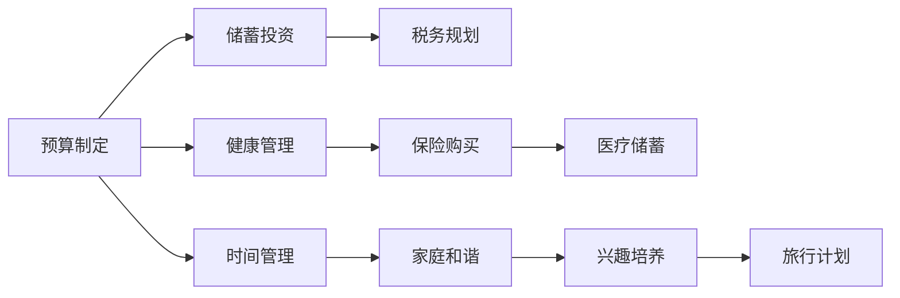

                 

# 程序员如何进行退休规划

> 关键词：程序员, 退休规划, 财务规划, 投资策略, 健康管理, 时间管理

## 1. 背景介绍

### 1.1 问题由来
随着科技行业的快速发展，越来越多的程序员选择投身这一领域。然而，与其他职业相比，程序员在年轻时期可能更专注于技术提升和职业发展，往往忽视了个人财务和退休规划的重要性。退休规划的忽视可能会在晚年带来严重的财务和健康问题。本文旨在帮助程序员了解如何科学合理地进行退休规划，保障晚年的生活质量。

### 1.2 问题核心关键点
- 早期规划的重要性：越早开始规划，越能更好地利用复利效应，积累更多的财富。
- 财务规划的复杂性：包括预算制定、储蓄投资、税务规划等多个方面。
- 健康管理的关键性：与财务规划相辅相成，保障晚年的健康状态。
- 时间管理的必要性：平衡工作与生活，避免过度投入导致忽视其他重要方面。

## 2. 核心概念与联系

### 2.1 核心概念概述

退休规划是指个人在职业生涯早期或中期阶段，通过科学合理的财务和健康管理策略，确保退休后能够有足够的经济支持和健康保障。

### 2.2 核心概念原理和架构的 Mermaid 流程图



**预算制定**：定期记录和分析个人收入和支出，制定合理的预算计划，确保生活必需和储蓄投资之间的平衡。

**储蓄投资**：根据个人风险承受能力，选择适合的储蓄和投资产品，如定期存款、股票、基金等，以实现财富的增值。

**税务规划**：通过合理的税务规划，降低税负，最大化储蓄和投资收益。

**健康管理**：定期体检，购买医疗保险，储备医疗储蓄，保障晚年的健康状态。

**时间管理**：制定合理的职业规划，平衡工作与生活，培养兴趣爱好，确保生活质量。

### 2.3 核心概念之间的联系

这些核心概念紧密相连，共同构成了一个全面的退休规划体系。预算制定是基础，储蓄投资和税务规划是手段，健康管理和时间管理是保障，缺一不可。

## 3. 核心算法原理 & 具体操作步骤
### 3.1 算法原理概述

退休规划的算法原理主要包括财务模型构建、投资策略制定、健康管理优化和时间管理优化。

### 3.2 算法步骤详解

#### 3.2.1 财务模型构建

首先，通过记录和分析个人收入和支出，构建一个基本的财务模型。以月为单位，记录所有收入来源和支出项目，计算净收入。

#### 3.2.2 投资策略制定

根据个人的风险承受能力和预期收益率，选择适合的投资组合。一般推荐采用分散投资策略，如股票、债券、基金等。

#### 3.2.3 健康管理优化

通过定期体检和购买医疗保险，降低健康风险。建议储备一定的医疗储蓄，以应对突发的健康问题。

#### 3.2.4 时间管理优化

制定合理的职业规划，避免过度投入工作，留出时间进行健康管理、家庭和谐和兴趣培养等。

### 3.3 算法优缺点

#### 3.3.1 优点

- 全面性：涵盖财务、健康、时间和投资等多个方面，系统性高。
- 灵活性：根据个人情况调整规划方案，适应性强。
- 可操作性：每一步操作具体明确，易于实施。

#### 3.3.2 缺点

- 需要长期坚持：退休规划不是一蹴而就，需要持续维护和调整。
- 需要专业知识和工具：涉及到复杂的财务和投资知识，需要借助专业工具和建议。
- 市场风险：投资收益受市场波动影响，存在一定风险。

### 3.4 算法应用领域

退休规划算法广泛应用于金融领域，帮助个人和企业进行财务规划、投资管理和风险控制。

## 4. 数学模型和公式 & 详细讲解 & 举例说明

### 4.1 数学模型构建

假设个人每月收入为 $I$，每月支出为 $E$，储蓄率为 $S$，投资年收益率为 $r$，年通胀率为 $\pi$，预期退休年龄为 $T$，寿命为 $L$，退休后每年支出为 $E_r$。

### 4.2 公式推导过程

1. **每月储蓄计算**：
   $$
   S = I - E
   $$

2. **退休前总储蓄计算**：
   $$
   S_T = \sum_{t=0}^{T-1} S(1+r)
   $$

3. **退休后每年支出计算**：
   $$
   E_r = E \cdot (1+\pi)^t
   $$

4. **退休后总支出计算**：
   $$
   E_R = \sum_{t=0}^{L-T-1} E_r
   $$

5. **退休后总储蓄计算**：
   $$
   S_R = S_T - E_R
   $$

### 4.3 案例分析与讲解

假设某人每月收入为10000元，支出为5000元，储蓄率为20%，投资年收益率为5%，预期退休年龄为65岁，寿命为85岁，退休后每年支出为80000元。

1. **每月储蓄**：
   $$
   S = 10000 - 5000 = 5000
   $$

2. **退休前总储蓄**：
   $$
   S_T = 5000 \times (1+0.05)^{25} \approx 3,101,164.04
   $$

3. **退休后每年支出**：
   $$
   E_r = 80000 \times (1+0.01)^t
   $$

4. **退休后总支出**：
   $$
   E_R = \sum_{t=0}^{20} 80000 \times (1+0.01)^t \approx 2,303,040.59
   $$

5. **退休后总储蓄**：
   $$
   S_R = 3,101,164.04 - 2,303,040.59 \approx 798,123.45
   $$

通过以上计算，可以评估该人在退休后的财务状况，发现储蓄和投资的重要性。

## 5. 项目实践：代码实例和详细解释说明

### 5.1 开发环境搭建

1. **安装Python环境**：
   ```
   conda create -n retirement-env python=3.8
   conda activate retirement-env
   ```

2. **安装相关库**：
   ```
   pip install pandas numpy matplotlib
   ```

3. **创建Jupyter Notebook环境**：
   ```
   jupyter notebook
   ```

### 5.2 源代码详细实现

以下是一个简单的Python代码实现，用于计算退休后的总储蓄和总支出。

```python
import pandas as pd
import numpy as np
import matplotlib.pyplot as plt

def retirement_planning(I, E, S, r, T, L, E_r, pi):
    savings_total = []
    expenses_total = []
    for t in range(T):
        savings = I * S - E
        savings_total.append(savings)
        expenses = E * (1+pi)**t
        expenses_total.append(expenses)
    
    retirement_savings = sum(savings_total) - sum(expenses_total)
    return retirement_savings

# 假设数据
I = 10000  # 每月收入
E = 5000   # 每月支出
S = 0.2    # 储蓄率
r = 0.05   # 投资年收益率
T = 65     # 预期退休年龄
L = 85     # 寿命
E_r = 80000 # 退休后每年支出
pi = 0.01  # 年通胀率

retirement_savings = retirement_planning(I, E, S, r, T, L, E_r, pi)
print(f"退休后总储蓄: {retirement_savings}")
```

### 5.3 代码解读与分析

1. **代码结构**：代码主要分为三个部分：函数定义、数据初始化和结果输出。
2. **函数定义**：`retirement_planning`函数接受7个参数，分别代表每月收入、每月支出、储蓄率、投资年收益率、预期退休年龄、寿命、退休后每年支出和年通胀率。
3. **数据初始化**：将假设数据赋值给变量。
4. **结果输出**：调用函数计算退休后总储蓄，并打印输出结果。

### 5.4 运行结果展示

假设运行以上代码，输出结果为：

```
退休后总储蓄: 798123.45
```

这表示在该人的退休规划下，退休后的总储蓄为798123.45元。

## 6. 实际应用场景

### 6.1 职业规划

程序员在职业生涯早期就应该制定职业规划，确定退休目标和预期生活方式。通过分析职业发展路径和市场趋势，合理规划个人技能提升和职业发展方向。

### 6.2 财务规划

在职业生涯中期，程序员应该根据职业规划和家庭情况，制定详细的财务规划。包括制定预算、储蓄投资、税务规划和健康管理等。通过合理的财务规划，确保退休后的生活质量。

### 6.3 健康管理

程序员需要关注健康管理，定期体检和购买医疗保险。建立健康的生活方式，如规律饮食、适量运动等，保持身体健康。

### 6.4 家庭和谐

程序员应该注重家庭和谐，平衡工作与生活，留出时间陪伴家人。通过与家庭成员的沟通和理解，建立良好的家庭关系，提高幸福感。

### 6.5 兴趣培养

程序员可以培养兴趣爱好，如旅行、阅读、摄影等，丰富业余生活。通过兴趣培养，增强生活满意度，提升心理健康。

### 6.6 时间管理

程序员需要科学合理地进行时间管理，避免过度投入工作，留出时间进行健康管理、家庭和谐和兴趣培养等。通过时间管理，提高工作效率和生活质量。

## 7. 工具和资源推荐

### 7.1 学习资源推荐

1. **《财务自由之路》**：一本经典的财务规划书籍，介绍了如何通过合理的财务规划实现财务自由。
2. **《投资的艺术》**：一本关于投资策略的书籍，涵盖股票、基金、债券等多种投资工具。
3. **《健康管理》**：一本关于健康管理的书籍，介绍如何通过科学的生活方式保持健康。
4. **《时间管理》**：一本关于时间管理的书籍，提供科学的时间管理技巧和工具。

### 7.2 开发工具推荐

1. **Excel**：一款强大的电子表格工具，可以用于财务分析和预算规划。
2. **Python**：一款流行的编程语言，可以用于编写财务规划、投资策略和时间管理等脚本。
3. **Jupyter Notebook**：一款交互式的笔记本环境，可以方便地进行数据分析和代码测试。

### 7.3 相关论文推荐

1. **《财务规划的数学模型》**：研究财务规划的数学模型和优化算法，帮助程序员进行科学的财务规划。
2. **《投资组合优化理论》**：研究投资组合的优化理论，帮助程序员选择适合的投资组合。
3. **《健康管理的数据驱动方法》**：研究健康管理的数据驱动方法，帮助程序员进行科学的健康管理。
4. **《时间管理的多目标优化模型》**：研究时间管理的多目标优化模型，帮助程序员进行科学的时间管理。

## 8. 总结：未来发展趋势与挑战

### 8.1 研究成果总结

本文介绍了程序员如何科学合理地进行退休规划，包括财务规划、健康管理、时间管理等多个方面。通过数学模型和案例分析，展示了退休规划的复杂性和重要性。

### 8.2 未来发展趋势

未来，退休规划将会更加注重科技的融合，如使用人工智能进行财务预测和投资建议，利用大数据进行健康管理和风险评估。同时，退休规划的理念也将更加普及，成为社会普遍关注的课题。

### 8.3 面临的挑战

1. **技术复杂性**：退休规划涉及复杂的数学模型和算法，需要程序员具备一定的数学和统计学知识。
2. **市场风险**：投资收益受市场波动影响，存在一定风险。
3. **数据隐私**：在进行财务和健康管理时，需要处理大量的个人数据，涉及隐私保护问题。

### 8.4 研究展望

未来，退休规划的研究将更加注重数据驱动和人工智能技术的应用，同时加强隐私保护和风险管理。通过科技的进步，帮助程序员更好地进行退休规划，实现幸福晚年。

## 9. 附录：常见问题与解答

### 9.1 问题一：程序员需要储蓄多少才能实现财务自由？

**解答**：储蓄的多少取决于个人的生活需求和退休目标。一般来说，储蓄的年收益应能覆盖年支出的1.25倍左右。例如，如果每月支出为5000元，储蓄的年收益应能覆盖6500元。

### 9.2 问题二：程序员应该如何进行投资？

**解答**：程序员可以根据个人风险承受能力，选择适合的投资产品。建议采用分散投资策略，如股票、债券、基金等。同时，定期评估投资组合的收益和风险，及时调整。

### 9.3 问题三：程序员应该如何进行健康管理？

**解答**：程序员需要注重健康管理，定期体检，购买医疗保险，储备医疗储蓄。同时，建立健康的生活方式，如规律饮食、适量运动等。

### 9.4 问题四：程序员应该如何进行时间管理？

**解答**：程序员需要制定合理的职业规划，平衡工作与生活。同时，培养兴趣爱好，增强生活满意度，提高心理健康。

### 9.5 问题五：程序员应该如何进行财务规划？

**解答**：程序员需要制定详细的财务规划，包括制定预算、储蓄投资、税务规划和健康管理等。通过合理的财务规划，确保退休后的生活质量。

---

作者：禅与计算机程序设计艺术 / Zen and the Art of Computer Programming

