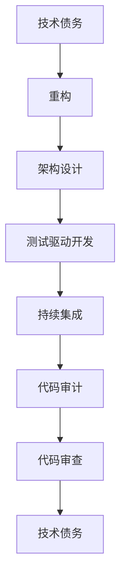

                 

# 程序员如何避免技术债务

> 关键词：技术债务, 重构, 架构设计, 测试驱动开发, 持续集成, 代码审计, 代码审查

## 1. 背景介绍

### 1.1 问题由来
在软件开发过程中，程序员经常会面临一个常见的问题：技术债务。技术债务是指在开发过程中，为了快速交付或解决紧急问题，而采用一些短期内可能有效，但长期来看会增加维护成本的解决方案。这些解决方案往往导致代码质量下降，可维护性变差，从而影响到项目的长期发展和稳定。技术债务通常表现为代码混乱、注释缺失、测试不全、文档不充分等。

### 1.2 问题核心关键点
技术债务的产生通常有以下几个原因：

1. 急于交付：为了赶工期，开发团队可能会牺牲代码质量，采用一些快速但不稳定的解决方案。
2. 需求变更频繁：随着项目进展，需求会不断变更，代码结构可能变得混乱不堪。
3. 缺乏架构设计：没有合适的架构设计，导致代码无序扩展，功能难以维护。
4. 忽视测试：没有充分的单元测试和集成测试，代码错误率增高，稳定性下降。
5. 忽略代码审查：缺乏严格的代码审查流程，代码质量难以保障。

技术债务的危害包括：

1. 维护成本增加：随着项目积累，维护成本会越来越高，甚至达到重构的程度。
2. 系统稳定性下降：代码质量差，错误率增加，系统稳定性难以保障。
3. 团队士气低落：频繁的技术债务积累，会导致团队士气低落，开发效率下降。
4. 项目延期风险：技术债务积累过多，可能导致项目延期，甚至取消。

### 1.3 问题研究意义
解决技术债务是软件开发中的一个重要课题，其研究意义包括：

1. 提升软件质量：通过重构和改进，提升代码质量，提高系统的稳定性和可维护性。
2. 降低维护成本：避免技术债务的积累，减少后续维护的成本和时间。
3. 提高开发效率：良好的代码结构和架构设计，能够提高开发效率，缩短项目周期。
4. 提升团队士气：团队士气是项目成功的关键因素之一，良好的技术实践能够提高团队士气。
5. 确保项目按时交付：避免技术债务，确保项目按时交付，提升客户满意度。

## 2. 核心概念与联系

### 2.1 核心概念概述

为了更好地理解如何避免技术债务，我们先介绍几个核心概念：

- **技术债务**：指在软件开发过程中，为了赶工期或解决紧急问题，采用的一些不稳定的解决方案，导致代码质量和系统稳定性的下降。
- **重构**：指通过修改代码结构，改善代码质量，提升系统可维护性和可扩展性的过程。
- **架构设计**：指在软件开发的早期阶段，设计出符合业务需求、易于扩展和维护的架构体系。
- **测试驱动开发(TDD)**：一种开发方法论，强调先编写测试用例，再编写代码，通过测试用例驱动开发过程，提升代码质量。
- **持续集成(CI)**：一种软件部署和集成自动化实践，通过频繁的集成和测试，及时发现和解决问题。
- **代码审计**：指对代码进行全面的审查和分析，找出潜在问题和改进点。
- **代码审查**：指由团队成员对代码进行审查，以提高代码质量和技术水平。

这些核心概念之间存在紧密的联系，通过它们之间的配合，可以有效地避免技术债务的积累。

### 2.2 核心概念原理和架构的 Mermaid 流程图(Mermaid 流程节点中不要有括号、逗号等特殊字符)


## 3. 核心算法原理 & 具体操作步骤
### 3.1 算法原理概述

避免技术债务的核心算法原理包括以下几个方面：

1. **重构(Refactoring)**：通过修改代码结构，改善代码质量，提升系统可维护性和可扩展性。重构的核心思想是通过小步操作，逐步改善代码质量。
2. **架构设计(Architecture Design)**：在软件开发的早期阶段，设计出符合业务需求、易于扩展和维护的架构体系。好的架构设计能够减少技术债务的积累。
3. **测试驱动开发(Test-Driven Development, TDD)**：通过先编写测试用例，再编写代码，提升代码质量和稳定性。测试驱动开发能够确保代码的正确性和可维护性。
4. **持续集成(Continuous Integration, CI)**：通过频繁的集成和测试，及时发现和解决问题。持续集成能够确保代码的稳定性和可维护性。
5. **代码审计(Code Audit)**：对代码进行全面的审查和分析，找出潜在问题和改进点。代码审计能够帮助团队识别技术债务，并提出改进建议。
6. **代码审查(Code Review)**：由团队成员对代码进行审查，以提高代码质量和技术水平。代码审查能够确保代码符合编码规范，提升团队协作水平。

### 3.2 算法步骤详解

以下是避免技术债务的详细步骤：

1. **需求分析**：在项目初期，进行全面的需求分析，明确业务需求和系统架构。
2. **架构设计**：根据需求分析结果，设计出符合业务需求的架构体系。
3. **编码实践**：在编码过程中，遵循测试驱动开发和代码审查等最佳实践，确保代码质量和可维护性。
4. **持续集成**：通过持续集成，频繁地集成和测试代码，确保代码的稳定性和可维护性。
5. **重构和优化**：在持续集成过程中，不断进行重构和优化，提升代码质量和系统性能。
6. **代码审计**：定期进行代码审计，找出潜在问题和改进点。

### 3.3 算法优缺点

避免技术债务的算法具有以下优点：

1. **提升代码质量**：通过重构和优化，提升代码质量，减少技术债务的积累。
2. **提升系统稳定性**：通过测试驱动开发和持续集成，确保代码的稳定性和可维护性。
3. **提升开发效率**：通过架构设计和良好的编码实践，提高开发效率，缩短项目周期。
4. **提升团队协作**：通过代码审查和持续集成，提升团队协作水平，提高开发质量。

同时，该算法也存在一些缺点：

1. **时间和成本**：重构和优化需要额外的时间和成本，可能会影响项目的进度。
2. **技术依赖**：依赖于优秀的架构设计和编码实践，需要具备一定的技术水平。
3. **团队沟通**：需要团队成员之间良好的沟通和协作，才能有效地避免技术债务。

### 3.4 算法应用领域

避免技术债务的算法在软件开发中具有广泛的应用，例如：

1. **Web开发**：通过重构和优化，提升Web应用的性能和可维护性。
2. **移动应用**：通过重构和优化，提升移动应用的性能和用户体验。
3. **数据处理**：通过重构和优化，提升数据处理系统的稳定性和可维护性。
4. **云计算**：通过架构设计和持续集成，提升云应用的性能和可扩展性。
5. **物联网(IoT)**：通过重构和优化，提升IoT系统的稳定性和可维护性。
6. **人工智能(AI)**：通过架构设计和代码审计，提升AI系统的性能和安全性。

## 4. 数学模型和公式 & 详细讲解 & 举例说明
### 4.1 数学模型构建

为了避免技术债务，我们可以建立一个数学模型来量化代码质量和系统稳定性。

设 $C$ 为代码质量得分，$S$ 为系统稳定性得分，$T$ 为技术债务得分。根据代码质量、系统稳定性和技术债务的关系，可以构建如下数学模型：

$$
C = f(C_1, C_2, C_3, \dots, C_n)
$$

$$
S = g(S_1, S_2, S_3, \dots, S_n)
$$

$$
T = h(T_1, T_2, T_3, \dots, T_n)
$$

其中，$C_i$ 表示第 $i$ 个代码质量指标，$S_i$ 表示第 $i$ 个系统稳定性指标，$T_i$ 表示第 $i$ 个技术债务指标。函数 $f$、$g$ 和 $h$ 表示代码质量、系统稳定性和技术债务的计算方式。

### 4.2 公式推导过程

以代码质量为例，常见的代码质量指标包括代码复杂度、注释质量、测试覆盖率等。设 $C_1$ 表示代码复杂度，$C_2$ 表示注释质量，$C_3$ 表示测试覆盖率。则代码质量的计算公式如下：

$$
C = C_1 \times a + C_2 \times b + C_3 \times c
$$

其中 $a$、$b$、$c$ 表示不同指标的权重系数。通过设定合适的权重系数，可以量化代码质量，从而更好地评估代码的健康程度。

### 4.3 案例分析与讲解

假设一个Web应用，我们需要对其代码质量和系统稳定性进行评估。根据上述公式，我们可以设定如下指标：

- $C_1$：代码复杂度，可以通过计算代码行数、函数个数等指标来衡量。
- $C_2$：注释质量，可以通过统计代码中注释的数量和质量来衡量。
- $C_3$：测试覆盖率，可以通过计算单元测试和集成测试的覆盖率来衡量。

根据这些指标，我们可以构建如下代码质量模型：

$$
C = C_1 \times 0.5 + C_2 \times 0.3 + C_3 \times 0.2
$$

通过计算代码质量的得分，我们可以发现哪些代码质量指标需要重点改进，从而提升整体代码质量。

## 5. 项目实践：代码实例和详细解释说明
### 5.1 开发环境搭建

为了避免技术债务，我们需要搭建一个开发环境，包括：

1. 选择合适的IDE：如Eclipse、Visual Studio、PyCharm等。
2. 安装版本控制系统：如Git、SVN等。
3. 配置持续集成工具：如Jenkins、Travis CI等。
4. 配置测试框架：如JUnit、pytest等。
5. 配置代码审查工具：如Gerrit、Review Board等。

完成以上配置后，可以开始进行技术债务的避免实践。

### 5.2 源代码详细实现

以下是一个避免技术债务的代码示例：

```python
# 需求分析
def analyze_requirements():
    # 根据需求文档，分析项目需求
    pass

# 架构设计
def design_architecture():
    # 设计系统架构
    pass

# 编码实践
def coding_practice():
    # 遵循TDD和代码审查等最佳实践
    pass

# 持续集成
def continuous_integration():
    # 配置CI，频繁集成和测试代码
    pass

# 重构和优化
def refactor_code():
    # 定期进行代码重构和优化
    pass

# 代码审计
def code_audit():
    # 定期进行代码审计，找出潜在问题和改进点
    pass
```

### 5.3 代码解读与分析

在上述代码中，我们定义了几个函数来分别处理需求分析、架构设计、编码实践、持续集成、重构和优化以及代码审计。这些函数可以分别用于不同的阶段和任务，确保整个项目始终处于良好的技术状态。

## 6. 实际应用场景
### 6.4 未来应用展望

随着技术的不断进步，避免技术债务的方法也将不断完善和改进。未来的应用场景包括：

1. **自动化重构**：利用自动化工具，自动检测和修复代码中的技术债务，提高重构效率。
2. **智能架构设计**：通过人工智能技术，自动生成符合业务需求的架构设计，减少人工干预。
3. **持续集成优化**：利用机器学习和大数据技术，优化持续集成流程，提升代码稳定性和可维护性。
4. **智能代码审计**：利用AI技术，自动进行代码审计，找出潜在问题和改进点。
5. **智能代码审查**：利用自然语言处理技术，自动进行代码审查，提高审查效率和准确性。
6. **自动化测试**：利用自动化测试工具，自动执行测试用例，提升测试效率和覆盖率。

## 7. 工具和资源推荐
### 7.1 学习资源推荐

为了避免技术债务，以下是一些推荐的学习资源：

1. 《Clean Code: A Handbook of Agile Software Craftsmanship》：Robert C. Martin 著，详细介绍如何编写清晰、可维护的代码。
2. 《Refactoring: Improving the Design of Existing Code》：Martin Fowler 著，详细讲解了重构的原理和技巧。
3. 《Design Patterns: Elements of Reusable Object-Oriented Software》：Erich Gamma 等著，介绍了常用的设计模式，提升架构设计能力。
4. 《Test-Driven Development: By Example》：Kent Beck 著，详细介绍TDD的实践方法和技巧。
5. 《Continuous Delivery: Reliable Software Releases through Build, Test, and Deployment Automation》：Jez Humble 和 David Farley 著，详细介绍CI/CD的实践方法和工具。
6. 《The Pragmatic Programmer》：Andrew Hunt 和 David Thomas 著，详细介绍了编程实践和最佳实践。

通过对这些资源的深入学习，可以系统掌握避免技术债务的各项技术和方法。

### 7.2 开发工具推荐

为了避免技术债务，以下是一些推荐的开发工具：

1. IDE：如Eclipse、Visual Studio、PyCharm等。
2. 版本控制系统：如Git、SVN等。
3. 持续集成工具：如Jenkins、Travis CI等。
4. 测试框架：如JUnit、pytest等。
5. 代码审查工具：如Gerrit、Review Board等。
6. 重构工具：如IntelliJ IDEA、Visual Studio Code等。
7. 性能监控工具：如New Relic、AppDynamics等。

### 7.3 相关论文推荐

为了避免技术债务，以下是一些推荐的相关论文：

1. "Software Engineering: A Practitioner's Approach" by Robert C. Martin：系统介绍了软件工程的基本原理和实践方法。
2. "Clean Code: A Handbook of Agile Software Craftsmanship" by Robert C. Martin：详细介绍如何编写清晰、可维护的代码。
3. "Design Patterns: Elements of Reusable Object-Oriented Software" by Erich Gamma 等：介绍了常用的设计模式，提升架构设计能力。
4. "Test-Driven Development: By Example" by Kent Beck：详细介绍TDD的实践方法和技巧。
5. "Continuous Delivery: Reliable Software Releases through Build, Test, and Deployment Automation" by Jez Humble 和 David Farley：详细介绍CI/CD的实践方法和工具。

## 8. 总结：未来发展趋势与挑战

### 8.1 研究成果总结

本文对避免技术债务的方法进行了全面系统的介绍。首先，详细解释了技术债务的产生原因和危害，明确了避免技术债务的重要性和紧迫性。其次，从重构、架构设计、测试驱动开发、持续集成、代码审计和代码审查等多个方面，介绍了避免技术债务的详细操作步骤。最后，给出了实际应用场景和未来发展趋势，帮助读者更好地理解和应用避免技术债务的方法。

### 8.2 未来发展趋势

随着技术的不断进步，避免技术债务的方法也将不断完善和改进。未来的发展趋势包括：

1. **自动化重构**：利用自动化工具，自动检测和修复代码中的技术债务，提高重构效率。
2. **智能架构设计**：通过人工智能技术，自动生成符合业务需求的架构设计，减少人工干预。
3. **持续集成优化**：利用机器学习和大数据技术，优化持续集成流程，提升代码稳定性和可维护性。
4. **智能代码审计**：利用AI技术，自动进行代码审计，找出潜在问题和改进点。
5. **智能代码审查**：利用自然语言处理技术，自动进行代码审查，提高审查效率和准确性。
6. **自动化测试**：利用自动化测试工具，自动执行测试用例，提升测试效率和覆盖率。

### 8.3 面临的挑战

尽管避免技术债务的方法已经取得了一定的成果，但在实际应用中，仍然面临以下挑战：

1. **时间和成本**：避免技术债务需要额外的时间和成本，可能会影响项目的进度。
2. **技术依赖**：依赖于优秀的架构设计和编码实践，需要具备一定的技术水平。
3. **团队沟通**：需要团队成员之间良好的沟通和协作，才能有效地避免技术债务。
4. **文化阻力**：团队成员对技术债务的认识和重视程度不同，需要花费时间和精力进行文化建设。
5. **资源限制**：某些大型项目可能需要大量的资源，才能进行全面有效的技术债务管理。

### 8.4 研究展望

未来的研究需要在以下几个方面寻求新的突破：

1. **自动化技术**：开发更加高效的自动化工具，自动检测和修复代码中的技术债务，提升重构效率。
2. **智能技术**：利用机器学习和人工智能技术，自动生成架构设计和测试用例，减少人工干预。
3. **社区合作**：建立开源社区，分享和交流避免技术债务的最佳实践和工具，提升行业整体水平。
4. **文化建设**：通过培训和宣传，提高团队成员对技术债务的认识和重视程度，形成良好的技术文化。
5. **资源优化**：通过优化资源配置和利用，降低技术债务管理的成本和难度。

## 9. 附录：常见问题与解答

**Q1：如何识别代码中的技术债务？**

A: 技术债务的识别需要从多个方面进行，包括代码复杂度、注释质量、测试覆盖率等。可以使用代码质量分析工具，如SonarQube、Checkstyle等，自动检测代码中的潜在问题和改进点。

**Q2：如何避免技术债务的积累？**

A: 避免技术债务的积累需要从源头入手，遵循良好的编码实践和最佳实践。可以通过持续集成和测试驱动开发等方法，及时发现和解决问题，避免技术债务的积累。

**Q3：如何提高团队协作水平？**

A: 提高团队协作水平需要建立良好的沟通机制和代码审查制度。可以定期进行代码审查，制定明确的代码审查流程和标准，提升团队的协作效率和代码质量。

**Q4：如何提升代码质量和系统稳定性？**

A: 提升代码质量和系统稳定性需要从多个方面入手，包括重构、优化、测试覆盖率等。可以通过重构工具和测试框架，自动进行代码重构和测试，确保代码的稳定性和可维护性。

**Q5：如何应对技术债务管理的挑战？**

A: 应对技术债务管理的挑战需要综合考虑时间和成本、技术依赖、团队沟通等因素。可以通过制定详细的技术债务管理计划，合理分配资源和人力，逐步提升技术债务管理能力。

---

作者：禅与计算机程序设计艺术 / Zen and the Art of Computer Programming

