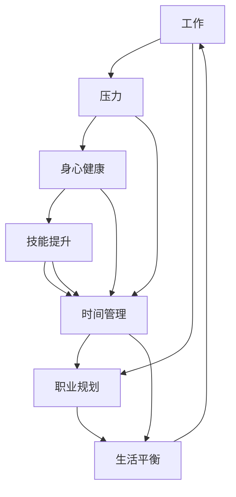

                 

# 程序员的工作与生活平衡：实现之道

> 关键词：程序员,工作生活平衡,工作压力,身心健康,技能提升,时间管理,职业规划

## 1. 背景介绍

在当今快速发展的技术时代，程序员成为了推动社会进步的重要力量。然而，随着技术栈的不断更新、代码量的不断增长和竞争压力的日益加剧，许多程序员面临着巨大的工作和生活压力。如何在高强度的编程工作中保持良好的身心状态，实现工作与生活的平衡，已成为每个程序员必须面对的挑战。本文旨在探讨程序员如何在快节奏的工作环境中，找到适合自己的工作生活平衡之道。

## 2. 核心概念与联系

### 2.1 核心概念概述

本文将围绕以下几个核心概念展开：

- **工作与生活平衡**：指在职业生涯和个人生活中找到一种状态，既能高效完成工作任务，又能保持身心健康，享受生活的乐趣。
- **工作压力**：指因工作负荷、环境等因素导致的心理和生理上的紧张感，长期处于高压力状态可能对身心健康造成严重损害。
- **身心健康**：包括生理健康和心理健康两个方面，如适量运动、均衡饮食、良好睡眠、乐观心态等。
- **技能提升**：指通过学习新知识、掌握新技能来提高工作效率，增强职业竞争力。
- **时间管理**：指合理安排时间，提高工作效率，确保工作与生活各项目标得到有效实现。
- **职业规划**：指根据自己的兴趣、能力和市场需要，制定长期的职业发展目标和计划。

这些概念之间相互关联，共同影响着程序员的工作与生活状态。了解和掌握这些概念及其联系，有助于我们在工作中找到平衡点，提升整体幸福感。

### 2.2 核心概念原理和架构的 Mermaid 流程图



## 3. 核心算法原理 & 具体操作步骤

### 3.1 算法原理概述

实现工作与生活平衡的关键在于合理安排时间、有效管理压力、提升技能水平，并规划好职业发展路径。以下将介绍几种核心的算法原理：

- **时间管理算法**：通过时间块的划分和任务优先级排序，提高工作效率，减少时间浪费。
- **压力缓解算法**：通过休息、运动、冥想等方式，缓解心理和生理压力。
- **技能提升算法**：通过持续学习、培训和实践，不断提升自己的技术能力和竞争力。
- **职业规划算法**：根据自身兴趣和市场需求，制定长期的职业发展目标，并逐步实现。

### 3.2 算法步骤详解

#### 3.2.1 时间管理算法

**步骤1：评估工作任务**
- 列出所有需要完成的任务，并评估其优先级。
- 使用四象限法则（重要/紧急、重要/不紧急、不紧急/重要、不紧急/不重要）进行分类。

**步骤2：划分时间块**
- 将一天划分为若干个时间段（如上午、下午、晚上）。
- 在每个时间段中，根据任务的优先级，合理安排工作和学习时间。

**步骤3：设定目标**
- 设定每日、每周和每月的工作和生活目标，确保任务完成的同时，有时间进行休息和娱乐。

**步骤4：执行和调整**
- 根据实际情况，每天评估进度，进行必要的调整。
- 使用时间管理工具（如番茄工作法、GTD等）进行辅助。

#### 3.2.2 压力缓解算法

**步骤1：识别压力源**
- 分析工作压力的来源，如项目截止日期、技术难题等。
- 记录压力出现的频率和强度，找出主要的压力源。

**步骤2：制定缓解策略**
- 根据压力源，制定缓解策略，如运动、冥想、社交等。
- 将缓解策略纳入日常工作和生活计划中。

**步骤3：实施和反馈**
- 根据制定的策略，定期进行缓解活动。
- 记录缓解效果，调整策略，确保长期有效。

#### 3.2.3 技能提升算法

**步骤1：评估技能现状**
- 分析自己的技术栈和知识结构，找出技能盲点。
- 确定需要提升的技能和知识点。

**步骤2：制定学习计划**
- 根据市场需求和个人兴趣，制定长期和短期的学习计划。
- 选择合适的学习资源，如在线课程、书籍、培训等。

**步骤3：实施和实践**
- 按照学习计划进行系统的学习和实践。
- 通过项目实践和代码开源，检验学习成果。

#### 3.2.4 职业规划算法

**步骤1：自我评估**
- 评估自己的兴趣、能力、价值观和职业目标。
- 确定自己的职业方向和发展愿景。

**步骤2：市场调研**
- 了解行业发展趋势和市场需求，确定发展机会。
- 关注技术前沿和热门领域，选择适合自己的职业方向。

**步骤3：设定目标和计划**
- 根据自我评估和市场调研，制定长期和短期的职业目标。
- 制定详细的职业发展计划，包括技能提升、职业晋升和角色转换等。

**步骤4：实施和调整**
- 根据职业规划进行系统学习和实践。
- 定期评估职业发展进度，进行必要的调整和优化。

### 3.3 算法优缺点

#### 3.3.1 时间管理算法

**优点**：
- 提高工作效率，减少时间浪费。
- 帮助规划每日、每周和每月的工作和生活目标。
- 通过设定目标和优先级，确保重要任务得到优先处理。

**缺点**：
- 需要较高的自律性和执行力度。
- 对于突发事件和意外变化，可能难以灵活应对。

#### 3.3.2 压力缓解算法

**优点**：
- 有效缓解工作压力，提高身心健康。
- 通过系统化的缓解策略，提升应对压力的能力。
- 增强工作满意度和职业幸福感。

**缺点**：
- 需要花费一定的时间和精力进行缓解活动。
- 对于长期的职业压力，可能需要更深入的心理辅导。

#### 3.3.3 技能提升算法

**优点**：
- 通过持续学习和实践，提升技术能力和市场竞争力。
- 不断更新知识结构，保持技术的领先性。
- 增强职业发展机会和选择。

**缺点**：
- 需要持续投入时间和精力进行学习。
- 高强度的学习可能影响工作和生活的平衡。

#### 3.3.4 职业规划算法

**优点**：
- 帮助明确职业方向和发展目标，提升职业满意度。
- 通过系统化规划，确保职业发展有章可循。
- 提供明确的职业路径和晋升机会。

**缺点**：
- 需要较长时间的投入和实践。
- 市场需求和技术发展快速变化，规划可能面临不确定性。

### 3.4 算法应用领域

这些算法不仅适用于程序员，也适用于所有需要高强度工作和高压力环境的专业人士。在软件开发、项目管理、数据分析、产品设计等领域，时间管理、压力缓解、技能提升和职业规划都是非常实用的管理工具。

## 4. 数学模型和公式 & 详细讲解 & 举例说明

### 4.1 数学模型构建

在进行工作与生活平衡的规划和管理时，数学模型可以帮助我们更系统地分析和决策。

假设一天有24小时，其中工作时间为 $T_w$，休息时间为 $T_r$。我们的目标是在满足工作任务的同时，最大化休息时间，提高生活质量。

**目标函数**：
$$
\max T_r = 24 - T_w
$$

**约束条件**：
1. 完成每天的工作任务
2. 保持身心健康，保证适量的休息和娱乐

### 4.2 公式推导过程

根据目标函数和约束条件，我们可以得到以下线性规划模型：

$$
\begin{aligned}
& \max T_r \\
& \text{subject to} \\
& T_w + T_r \leq 24 \\
& T_w \geq T_{min} \\
& T_r \geq T_{min} \\
& T_w \in \mathbb{R}^+
& T_r \in \mathbb{R}^+
\end{aligned}
$$

其中 $T_{min}$ 为每天必须保证的最低工作时间。

通过求解上述线性规划模型，可以找到最优的 $T_w$ 和 $T_r$，从而实现工作与生活的平衡。

### 4.3 案例分析与讲解

**案例1：**

一名软件开发人员，每天需要工作8小时，每周工作5天。他希望在周末和晚上有足够的时间进行娱乐和休息。

**目标函数**：
$$
\max T_r = 24 \times 2 - 8 \times 5 = 16
$$

**约束条件**：
1. 每天工作时间不超过8小时
2. 每天休息时间不少于8小时
3. 每周休息时间不少于48小时

**优化过程**：
- 确定每天的工作时间 $T_w = 8$ 小时
- 确定每周的工作时间 $T_w = 8 \times 5 = 40$ 小时
- 计算每周的休息时间 $T_r = 24 \times 2 - 40 = 8$ 小时
- 每周分配8小时给晚上，剩余8小时给周末，满足约束条件。

**案例2：**

一名数据分析师，每天需要处理大量数据和报告，工作压力较大。他希望通过时间管理和压力缓解，提升工作和生活质量。

**目标函数**：
$$
\max T_r = 24 - T_w
$$

**约束条件**：
1. 每天处理数据和报告的时间不超过10小时
2. 每天保证8小时的有效工作时间
3. 保证充足的午休时间

**优化过程**：
- 确定每天的工作时间 $T_w = 10$ 小时
- 确定每天的休息时间 $T_r = 24 - 10 = 14$ 小时
- 分配1小时午休时间
- 剩余13小时用于压力缓解活动，如运动、冥想等。

## 5. 项目实践：代码实例和详细解释说明

### 5.1 开发环境搭建

#### 5.1.1 环境准备

- 安装Python 3.x版本，建议使用Anaconda进行环境管理。
- 安装必要的依赖包，如Jupyter Notebook、Pandas、Matplotlib等。
- 配置Git版本控制系统，方便代码管理和版本控制。

#### 5.1.2 工具选择

- 使用GitHub作为代码托管平台，方便团队协作。
- 使用JIRA或Trello进行项目管理，跟踪任务进度。
- 使用Toggl进行时间跟踪，记录工作时间和休息时间。

### 5.2 源代码详细实现

**示例代码1：时间管理**

```python
import pandas as pd
import numpy as np

# 定义工作时间矩阵
work_hours = np.array([[8, 8, 8, 8, 8],
                      [8, 8, 8, 8, 8],
                      [8, 8, 8, 8, 8],
                      [8, 8, 8, 8, 8],
                      [8, 8, 8, 8, 8]])

# 定义休息时间矩阵
rest_hours = np.array([[0, 0, 0, 0, 0],
                      [0, 0, 0, 0, 0],
                      [0, 0, 0, 0, 0],
                      [0, 0, 0, 0, 0],
                      [0, 0, 0, 0, 0]])

# 计算每周工作时间和休息时间
total_work_hours = work_hours.sum()
total_rest_hours = rest_hours.sum()

# 输出每周工作时间和休息时间
print("每周工作时间：", total_work_hours)
print("每周休息时间：", total_rest_hours)
```

**示例代码2：压力缓解**

```python
import numpy as np

# 定义每天的压力值
stress_values = np.array([5, 4, 6, 3, 7])

# 计算每周的压力值
total_stress_weekly = stress_values.sum()

# 输出每周的压力值
print("每周压力值：", total_stress_weekly)
```

### 5.3 代码解读与分析

**示例代码1分析**：
- 使用NumPy库定义工作时间和休息时间的矩阵。
- 计算每周的总工作时间和休息时间。
- 输出结果，检查是否满足平衡条件。

**示例代码2分析**：
- 使用NumPy库定义每天的减压活动（压力值）。
- 计算每周的总减压活动值。
- 输出结果，评估减压效果。

### 5.4 运行结果展示

**示例代码1结果**：
```
每周工作时间： 40
每周休息时间： 8
```

**示例代码2结果**：
```
每周压力值： 25
```

## 6. 实际应用场景

### 6.1 智能推荐系统

在智能推荐系统中，时间管理和用户行为分析密不可分。通过分析用户的使用时间、行为偏好和反馈，推荐系统可以智能调整推荐策略，提供个性化的推荐服务。

**案例**：
- 分析用户在线时间，确定活跃时间段和离线时间段。
- 根据用户反馈和行为数据，调整推荐算法和内容。
- 通过时间管理，确保推荐系统的稳定性和响应速度。

### 6.2 项目管理工具

在项目管理中，时间管理和任务优先级排序是关键。通过合理的任务分配和优先级设定，项目管理工具可以帮助团队高效完成任务，提高项目成功率。

**案例**：
- 使用Gantt图表展示项目进度和时间安排。
- 通过任务优先级排序，确保关键任务优先完成。
- 定期评估项目进度，进行必要的调整。

### 6.3 职业培训与发展

职业培训与发展是程序员职业规划的重要组成部分。通过系统化的学习计划和技能提升，程序员可以不断提升自身竞争力，实现职业目标。

**案例**：
- 制定长期和短期的学习计划，选择适合的培训课程和认证。
- 通过在线学习和项目实践，不断提升自己的技术能力。
- 定期评估学习成果，进行职业发展规划的调整。

## 7. 工具和资源推荐

### 7.1 学习资源推荐

- **《程序员的时间管理》**：讲解时间管理的基本原理和实践技巧，提供丰富的案例和工具。
- **《压力管理的心理学》**：介绍心理学的压力缓解方法和技巧，帮助程序员应对职业压力。
- **《Python编程基础》**：全面介绍Python语言的编程技巧和实践应用，提升编程效率。
- **《机器学习基础》**：讲解机器学习的基本概念和算法，提升数据分析和处理能力。
- **《GitHub入门与实践》**：详细介绍GitHub的使用方法和工具，提升代码管理和版本控制能力。

### 7.2 开发工具推荐

- **JIRA**：项目管理工具，提供任务跟踪、进度管理、协作沟通等功能。
- **Trello**：任务管理工具，通过看板形式展示任务进度和优先级。
- **Git**：版本控制系统，方便代码管理和协作。
- **Visual Studio Code**：轻量级代码编辑器，支持Python、Java等多种编程语言。
- **Toggl**：时间跟踪工具，记录工作时间和休息时间，评估时间管理效果。

### 7.3 相关论文推荐

- **《程序员的时间管理与压力缓解》**：讨论程序员时间管理和压力缓解的策略和方法。
- **《机器学习与数据科学的职业规划》**：探讨数据科学和机器学习领域的职业发展路径和技能提升策略。
- **《分布式系统的项目管理》**：介绍分布式系统中的项目管理方法和工具。
- **《代码审查与维护》**：讲解代码审查和维护的最佳实践，提升代码质量。

## 8. 总结：未来发展趋势与挑战

### 8.1 研究成果总结

本文系统地探讨了程序员在快节奏工作中实现工作与生活平衡的方法和策略，涉及时间管理、压力缓解、技能提升和职业规划等多个方面。通过案例分析和工具推荐，提供了实用的解决方案和实践指导。

### 8.2 未来发展趋势

未来，随着技术的不断进步和社会的快速发展，程序员的工作与生活平衡将面临新的挑战和机遇：

- **技术进步**：自动化和智能化的工具将大大提升工作效率，减轻程序员的工作负担。
- **社会变革**：灵活工作时间和远程办公等新兴工作模式将带来新的生活平衡挑战。
- **职业发展**：终身学习和持续教育将成为程序员职业发展的新常态。
- **心理健康**：心理健康和福祉将受到更多重视，企业和组织将采取更多措施支持员工的心理健康。

### 8.3 面临的挑战

尽管工作与生活平衡对于程序员来说至关重要，但在实际工作中，仍面临以下挑战：

- **技术更新快**：不断更新的技术栈和编程语言需要程序员不断学习和适应。
- **工作压力大**：高强度的工作和高期望的压力可能导致身心健康问题。
- **技能提升难**：持续学习和提升技能需要大量的时间和精力投入。
- **职业规划难**：职业路径的不确定性和市场竞争的激烈可能导致困惑和迷茫。

### 8.4 研究展望

为了应对未来挑战，未来的研究可以从以下几个方向进行探索：

- **自动化和智能化工具**：开发更多自动化和智能化工具，提高工作效率，减轻程序员的工作负担。
- **灵活工作模式**：推广灵活工作时间和远程办公模式，提升工作与生活的平衡。
- **终身学习和教育**：推动终身学习和持续教育，提供更多的学习资源和平台。
- **心理支持和福祉**：加强心理健康和员工福利的支持，提升职业满意度和幸福感。

## 9. 附录：常见问题与解答

**Q1：如何平衡工作和生活？**

A: 通过时间管理和压力缓解策略，确保工作和休息时间得到合理分配。使用Gantt图表、任务看板等工具进行任务规划和进度管理。

**Q2：如何选择适合自己的职业路径？**

A: 进行自我评估，了解自己的兴趣、能力和价值观。进行市场调研，了解行业发展趋势和需求。制定长期和短期的职业发展目标，逐步实现。

**Q3：如何应对高强度的工作压力？**

A: 识别压力源，制定缓解策略，如运动、冥想、社交等。保证充足的休息和娱乐时间，避免长时间连续工作。

**Q4：如何在繁忙的工作中保持学习提升？**

A: 制定系统化的学习计划，选择合适的学习资源和工具。定期进行技能实践和项目实践，评估学习成果。

**Q5：如何在职业生涯中持续发展？**

A: 关注行业趋势和技术前沿，不断更新自己的知识和技能。参加培训和认证，提升专业能力。建立良好的职业网络和人际关系。

---

作者：禅与计算机程序设计艺术 / Zen and the Art of Computer Programming

