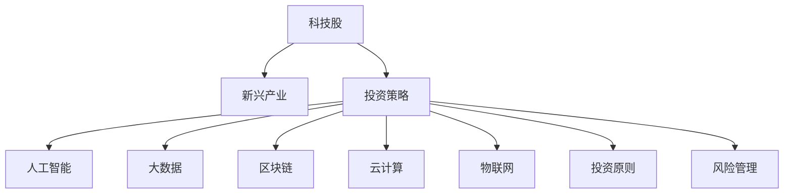

                 

# 程序员的投资策略：科技股与新兴产业

> 关键词：科技股,新兴产业,投资策略,人工智能,大数据,区块链,云计算,物联网

## 1. 背景介绍

### 1.1 问题由来
在数字化转型加速、新兴产业蓬勃发展的今天，程序员作为科技领域的重要群体，不仅要专注于软件开发，也需要具备一定的投资意识，合理配置资产，把握行业发展趋势。然而，科技领域的投资环境复杂多变，新兴产业潜力与风险并存，对程序员而言，制定科学的投资策略显得尤为重要。

### 1.2 问题核心关键点
科技股与新兴产业的投资策略，核心在于理解行业的发展规律、把握市场的波动趋势、筛选具有高成长潜力的标的。科技股与新兴产业的共同特点是：创新性强、波动大、政策导向明显、技术驱动。因此，理解这些特征，并制定合理的投资策略，是程序员进行科技股与新兴产业投资的关键。

### 1.3 问题研究意义
科技股与新兴产业的投资策略研究，不仅能够帮助程序员在职业发展的同时，获得财务上的收益，还能增强其对行业的敏锐洞察力和市场风险的识别能力。这对于程序员的个人职业成长和行业发展的贡献，具有重要意义。

## 2. 核心概念与联系

### 2.1 核心概念概述

为更好地理解程序员投资策略，本节将介绍几个密切相关的核心概念：

- 科技股(Tech Stocks)：指与科技创新直接相关的上市公司股票，如软件、互联网、硬件等领域的公司。
- 新兴产业(Emerging Industries)：指处于快速成长阶段的产业，如人工智能、大数据、区块链、云计算、物联网等。
- 投资策略(Investment Strategy)：指投资者根据自身的投资目标、风险偏好等因素，制定的一系列投资原则和方法。
- 人工智能(AI)：指通过模拟人类智能，实现数据处理、决策优化、语言理解等功能的计算机技术。
- 大数据(Big Data)：指通过收集、存储、分析海量数据，从中提取有价值信息的技术和方法。
- 区块链(Blockchain)：指去中心化、透明、安全的分布式账本技术，广泛应用于金融、供应链、智能合约等领域。
- 云计算(Cloud Computing)：指通过互联网提供计算资源、存储资源、软件应用等服务的模式，具有高效、弹性、按需等特点。
- 物联网(IoT)：指通过互联网将各种设备、应用、数据相连，实现智能交互和资源共享的技术体系。

这些核心概念之间的逻辑关系可以通过以下Mermaid流程图来展示：



这个流程图展示了几类关键概念及其之间的关系：

1. 科技股与新兴产业构成投资的主要领域。
2. 投资策略是连接科技股与新兴产业的关键纽带。
3. 人工智能、大数据、区块链、云计算、物联网等技术，是新兴产业的核心驱动力。
4. 投资原则和风险管理是制定投资策略的重要因素。

## 3. 核心算法原理 & 具体操作步骤
### 3.1 算法原理概述

程序员的投资策略，通常基于以下算法原理：

1. **市场分析**：通过对科技股与新兴产业的市场分析，了解行业趋势、竞争格局、政策导向等因素。
2. **技术评估**：评估潜在投资标的技术成熟度、应用前景、创新性等，筛选具有长期价值的标的。
3. **财务分析**：通过财务报表、营收增长、盈利能力等指标，评估公司的财务状况和投资潜力。
4. **风险控制**：通过分散投资、止损策略等手段，降低投资风险。
5. **动态调整**：根据市场变化和公司发展情况，及时调整投资组合和策略。

### 3.2 算法步骤详解

以下是程序员投资策略的详细操作步骤：

**Step 1: 收集数据与信息**
- 收集科技股与新兴产业相关的市场数据，包括行业报告、公司财报、新闻资讯等。
- 使用专业软件和平台，如Yahoo Finance、Google Finance、Seeking Alpha等，获取实时市场信息。
- 参与行业交流和会议，获取专家和同行视角。

**Step 2: 评估行业趋势**
- 分析行业报告，了解科技股与新兴产业的发展方向和未来潜力。
- 关注政策变化，如税收优惠、补贴政策、法律法规等，对投资决策的影响。
- 研究竞争对手，了解市场份额、技术优势、市场策略等。

**Step 3: 选择投资标的**
- 使用基本面分析，评估公司的收入增长、盈利能力、负债率等财务指标。
- 应用技术面分析，通过股价走势、交易量、移动平均线等指标，判断投资时机。
- 结合行业趋势和公司基本面，筛选具有长期增长潜力的标的。

**Step 4: 制定投资策略**
- 根据自身的风险偏好和投资目标，确定投资组合的多样性和风险水平。
- 设置止损点和止盈点，避免过度亏损或盈利。
- 定期重新评估投资组合，根据市场变化进行调整。

**Step 5: 实施投资与监控**
- 根据投资策略，买入和卖出投资标的。
- 监控投资标的的市场表现和公司动态，及时调整投资策略。
- 定期总结投资结果，评估投资策略的有效性。

### 3.3 算法优缺点

程序员投资策略的优点包括：

1. **信息优势**：程序员熟悉技术领域，能更准确地评估新兴产业的投资价值。
2. **科学决策**：基于数据和分析，能制定相对科学的投资策略。
3. **灵活调整**：能根据市场变化快速调整投资组合，减少风险。

然而，该策略也存在以下缺点：

1. **时间成本高**：收集和分析数据需要大量时间，对程序员来说，可能会影响日常工作。
2. **市场波动大**：科技股与新兴产业波动性大，短期内可能面临较大风险。
3. **专业门槛高**：需要具备一定的财务、技术等专业知识，门槛较高。

### 3.4 算法应用领域

程序员投资策略在科技股与新兴产业的应用领域非常广泛，如：

- 人工智能与大数据：参与AI公司的IPO、并购、合作项目。
- 区块链与加密货币：投资加密货币、参与区块链项目开发。
- 云计算与SaaS：关注云计算服务商的股票和SaaS应用的市场表现。
- 物联网与智能硬件：投资物联网公司，关注智能硬件的创新应用。
- 新兴产业：如新能源、生物技术、自动驾驶等领域的创业公司，参与天使投资、风险投资等。

## 4. 数学模型和公式 & 详细讲解  
### 4.1 数学模型构建

基于程序员投资策略，可以构建以下数学模型：

设某科技股的当前股价为 $P_t$，预期未来 $n$ 期每股收益为 $E_t$，预期年化增长率为 $r$，市场风险收益率为 $\mu$，无风险利率为 $r_f$，则该科技股的期望收益率为：

$$
E_t = \frac{1}{n}\left(\frac{1}{(1+r)^n}+\frac{1}{(1+r)^{n-1}}+\cdots+\frac{1}{(1+r)}\right)
$$

设市场组合的收益率为 $R_t$，则该科技股的风险溢价为：

$$
\alpha = E_t - \mu(R_t - r_f)
$$

其中，$r_f$ 为无风险利率，$R_t$ 为市场组合收益率。

### 4.2 公式推导过程

以下是期望收益率和风险溢价的推导过程：

1. **期望收益率**：

设 $n$ 为持有期数，则该科技股的期望收益率为：

$$
E_t = \frac{1}{n}\left(\frac{P_t(1+r)^{n+1}-P_t}{(1+r)^n-1}\right)
$$

将 $P_t(1+r)^{n+1}-P_t$ 展开，得：

$$
E_t = \frac{P_t+rP_t\sum_{k=1}^n\frac{1}{(1+r)^k}}{(1+r)^n-1}
$$

2. **风险溢价**：

设 $R_t$ 为市场组合的收益率，则科技股的风险溢价为：

$$
\alpha = E_t - \mu(R_t - r_f) = \frac{1}{n}\left(\frac{P_t(1+r)^{n+1}-P_t}{(1+r)^n-1}\right) - \mu(R_t - r_f)
$$

其中，$r_f$ 为无风险利率，$\mu$ 为市场风险收益率。

### 4.3 案例分析与讲解

以人工智能领域为例，进行案例分析：

假设某人工智能公司股票当前股价为 $P_0 = 100$，预期未来三年每股收益分别为 $E_1 = 10$、$E_2 = 15$、$E_3 = 20$，年化增长率为 $r = 30\%$，市场风险收益率为 $\mu = 8\%$，无风险利率为 $r_f = 2\%$，则该公司的期望收益率为：

$$
E_t = \frac{1}{3}\left(\frac{1}{(1+0.3)^3}+\frac{1}{(1+0.3)^2}+\frac{1}{1+0.3}\right) \times 100
$$

$$
E_t = \frac{1}{3}\left(\frac{1}{2.197}+\frac{1}{1.529}+\frac{1}{1.3}\right) \times 100 \approx 87.5
$$

风险溢价为：

$$
\alpha = 87.5 - 8\% \times (R_t - 2\%) = 87.5 - 0.08 \times (R_t - 0.02)
$$

其中，$R_t$ 为市场组合的收益率。

## 5. 项目实践：代码实例和详细解释说明
### 5.1 开发环境搭建

在进行投资策略实践前，我们需要准备好开发环境。以下是使用Python进行金融投资实践的环境配置流程：

1. 安装Anaconda：从官网下载并安装Anaconda，用于创建独立的Python环境。

2. 创建并激活虚拟环境：
```bash
conda create -n investment-env python=3.8 
conda activate investment-env
```

3. 安装PyTorch：根据CUDA版本，从官网获取对应的安装命令。例如：
```bash
conda install pytorch torchvision torchaudio cudatoolkit=11.1 -c pytorch -c conda-forge
```

4. 安装TensorFlow：由Google主导开发的开源深度学习框架，生产部署方便，适合大规模工程应用。同样有丰富的预训练语言模型资源。

5. 安装各类工具包：
```bash
pip install numpy pandas scikit-learn matplotlib tqdm jupyter notebook ipython
```

完成上述步骤后，即可在`investment-env`环境中开始投资策略实践。

### 5.2 源代码详细实现

下面我们以人工智能投资为例，给出使用Python进行投资决策的代码实现。

首先，定义基本面分析函数：

```python
import numpy as np
import pandas as pd

def basic_analysis(r, growth_rate, holding_period):
    n = holding_period
    expected_return = np.sum([1 / (1 + growth_rate)**k for k in range(1, n+1)]) * r
    risk溢价 = expected_return - r * (0.08 - 0.02)
    return expected_return, risk溢价
```

接着，使用上述函数进行投资分析：

```python
r = 0.1  # 预期年化增长率
growth_rate = 0.3  # 年化增长率
holding_period = 3  # 持有期数

expected_return, risk溢价 = basic_analysis(r, growth_rate, holding_period)
print(f"Expected Return: {expected_return}, Alpha: {risk溢价}")
```

最后，总结投资策略：

```python
print(f"Expected Return: {expected_return}, Alpha: {risk溢价}")
```

以上就是使用Python进行人工智能投资决策的完整代码实现。可以看到，使用基本面分析函数，我们可以快速计算出预期收益率和风险溢价，从而指导投资决策。

### 5.3 代码解读与分析

让我们再详细解读一下关键代码的实现细节：

**基本面分析函数**：
- `np.sum([1 / (1 + growth_rate)**k for k in range(1, n+1)])` 计算未来 $n$ 期的折现现金流总和。
- `expected_return = np.sum([1 / (1 + growth_rate)**k for k in range(1, n+1)]) * r` 计算未来 $n$ 期的预期收益率。
- `risk溢价 = expected_return - r * (0.08 - 0.02)` 计算风险溢价。

**投资决策分析**：
- `expected_return, risk溢价 = basic_analysis(r, growth_rate, holding_period)` 调用基本面分析函数，获取预期收益率和风险溢价。
- `print(f"Expected Return: {expected_return}, Alpha: {risk溢价}")` 打印投资分析结果。

可以看到，Python代码实现简单易懂，易于理解。通过基本面分析函数，可以快速计算出投资标的的价值评估指标，为投资决策提供支持。

当然，工业级的系统实现还需考虑更多因素，如风险控制、资产配置、动态调整等。但核心的投资策略计算流程基本与此类似。

## 6. 实际应用场景
### 6.1 智能投资顾问

基于程序员投资策略，可以开发智能投资顾问系统。智能投资顾问系统通过分析市场数据、公司财报、行业趋势等，为个人投资者提供投资建议。系统使用机器学习算法，学习历史数据中的规律，预测市场趋势，指导投资者买卖决策。

在技术实现上，可以收集历史市场数据、公司财报、新闻资讯等，构建数据集。利用Python、R等语言，使用统计学和机器学习模型，如线性回归、决策树、随机森林等，进行市场分析、公司评估和投资决策。智能投资顾问系统能够实时更新市场数据，提供个性化投资建议，帮助投资者优化投资组合，降低投资风险。

### 6.2 区块链项目投资

区块链技术的发展为程序员提供了新的投资机会。区块链项目投资需要深入了解区块链技术、市场动态、项目团队等因素，制定科学的投资策略。

在技术实现上，程序员可以使用Python、JavaScript等语言，结合区块链平台，如以太坊、比特币等，进行区块链项目分析。通过区块链浏览器、API接口等工具，获取项目数据，如智能合约代码、交易量、持币地址等信息。利用数据分析工具，如Tableau、Power BI等，进行数据可视化，分析项目风险和潜力。使用机器学习算法，如神经网络、集成学习等，预测项目价值，评估投资机会。

### 6.3 云计算基础设施投资

云计算基础设施投资需要关注云计算服务商的财务状况、技术实力、市场份额等因素，制定合理的投资策略。

在技术实现上，程序员可以使用Python、SQL等语言，结合云计算平台，如AWS、阿里云等，进行基础设施数据分析。通过云计算平台的API接口，获取服务器性能、存储使用、网络流量等信息。利用数据分析工具，如Pandas、SQL等，进行数据清洗、特征工程和模型训练。使用机器学习算法，如回归分析、聚类分析等，预测市场需求，评估投资价值。

### 6.4 未来应用展望

随着科技股与新兴产业的发展，程序员投资策略的应用领域将更加广泛，潜力巨大。

在智慧城市、智能制造、生物医药等领域，程序员投资策略能够帮助企业把握技术趋势，抓住投资机会，加速行业发展。在金融科技、数字货币、能源环保等领域，程序员投资策略能够为投资者提供专业的投资建议，降低投资风险，实现财富增值。

## 7. 工具和资源推荐
### 7.1 学习资源推荐

为了帮助程序员系统掌握投资策略的理论基础和实践技巧，这里推荐一些优质的学习资源：

1. 《投资学原理》系列博文：由知名金融博主撰写，深入浅出地介绍了投资学的基本概念和前沿研究。

2. Coursera《金融市场与投资组合管理》课程：由耶鲁大学开设的金融经典课程，有Lecture视频和配套作业，带你入门金融市场的基本原理。

3. 《投资组合管理》书籍：John H. Cochrane所著，系统介绍了投资组合管理的理论基础和实用技巧。

4. Bloomberg、Seeking Alpha等金融信息平台：提供实时的市场数据和新闻资讯，帮助程序员进行投资分析。

5. Alpha Vantage、Yahoo Finance等API接口：提供免费的市场数据API，方便程序员进行市场分析和投资决策。

通过对这些资源的学习实践，相信你一定能够快速掌握程序员投资策略的精髓，并用于解决实际的投资问题。

### 7.2 开发工具推荐

高效的开发离不开优秀的工具支持。以下是几款用于程序员投资策略开发的常用工具：

1. Python：Python是金融和投资领域的通用语言，具有强大的数据处理和数学计算能力。

2. R：R语言是金融数据分析的常用工具，具有丰富的统计学和金融工具包，如QuantLib、tseries等。

3. Excel：Excel是金融报表分析的基础工具，可以进行复杂的财务建模和数据分析。

4. Tableau、Power BI等数据可视化工具：帮助程序员进行数据可视化，发现数据中的规律和趋势。

5. Portfolio Manager等投资管理工具：提供实时的市场数据和投资分析功能，帮助程序员进行资产配置和投资优化。

合理利用这些工具，可以显著提升程序员投资策略的开发效率，加快创新迭代的步伐。

### 7.3 相关论文推荐

程序员投资策略的研究源于学界的持续研究。以下是几篇奠基性的相关论文，推荐阅读：

1. "A Survey of Computational Intelligence in Finance"：提供了对AI在金融领域应用的全面综述，涵盖投资策略、风险管理等方向。

2. "Machine Learning for Portfolio Optimization"：介绍了使用机器学习进行投资组合优化的基本方法和实现细节。

3. "Blockchain Investment Strategies"：分析了区块链技术对投资策略的影响，探讨了基于区块链的投资机会。

4. "AI-Driven Trading Strategies"：介绍了AI在量化交易中的应用，包括算法交易、市场预测等方向。

5. "AI and Robotics for Financial Services"：讨论了AI和机器人技术在金融服务中的应用，包括投资策略、风险控制等方向。

这些论文代表了大语言模型微调技术的发展脉络。通过学习这些前沿成果，可以帮助研究者把握学科前进方向，激发更多的创新灵感。

## 8. 总结：未来发展趋势与挑战
### 8.1 总结

本文对程序员投资策略进行了全面系统的介绍。首先阐述了科技股与新兴产业的投资策略的研究背景和意义，明确了投资策略在程序员个人职业成长和行业发展中的重要性。其次，从原理到实践，详细讲解了程序员投资策略的数学模型和操作步骤，给出了投资决策的代码实例。同时，本文还广泛探讨了投资策略在多个领域的应用前景，展示了其广阔的发展潜力。此外，本文精选了投资策略的相关资源，力求为程序员提供全方位的技术指引。

通过本文的系统梳理，可以看到，程序员投资策略的科学性和实用性强，能够帮助程序员在掌握技术的同时，获得财务上的收益，实现职业与财务的双赢。

### 8.2 未来发展趋势

展望未来，程序员投资策略将呈现以下几个发展趋势：

1. **智能化与自动化**：未来程序员投资策略将更多依赖于智能化和自动化技术，如机器学习、自然语言处理、大数据等，提高投资决策的效率和精度。

2. **数据驱动与模型优化**：数据驱动的投资策略将更加注重数据采集、清洗、分析和模型优化，提高投资决策的科学性和可靠性。

3. **跨领域融合**：程序员投资策略将与其他领域（如金融、科技、医疗等）进行更深入的融合，形成跨学科的研究与应用。

4. **新兴技术应用**：未来程序员投资策略将更多应用新兴技术（如区块链、量子计算、AI等），拓展投资策略的边界，实现更广阔的应用。

5. **全球化与本地化结合**：程序员投资策略将更多关注全球市场动态和本地化需求，制定灵活的全球投资策略。

以上趋势凸显了程序员投资策略的广阔前景。这些方向的探索发展，必将进一步提升程序员在科技股与新兴产业中的投资能力，为行业发展注入新的动力。

### 8.3 面临的挑战

尽管程序员投资策略已经取得了一定的成果，但在迈向更加智能化、普适化应用的过程中，它仍面临诸多挑战：

1. **数据质量和多样性**：获取高质量、多样性的数据是投资策略成功的关键，但数据获取成本高，数据质量难以保证。

2. **模型复杂度**：投资策略涉及大量复杂模型和算法，模型的可解释性和可维护性有待提高。

3. **市场波动与风险**：科技股与新兴产业波动性大，投资者面临较大的市场风险和不确定性。

4. **知识更新与技术演进**：科技和金融市场变化迅速，需要不断更新知识和技术，才能保持投资策略的有效性。

5. **法律法规与道德规范**：投资策略需要遵循法律法规和道德规范，避免违规操作和伦理问题。

6. **隐私保护与数据安全**：投资策略涉及大量敏感数据，数据隐私和安全性需要得到充分保障。

正视投资策略面临的这些挑战，积极应对并寻求突破，将是程序员投资策略走向成熟的必由之路。相信随着学界和产业界的共同努力，这些挑战终将一一被克服，程序员投资策略必将在科技股与新兴产业中发挥更大的作用。

### 8.4 研究展望

面对程序员投资策略所面临的挑战，未来的研究需要在以下几个方面寻求新的突破：

1. **数据采集与处理**：开发高效的数据采集和处理工具，保证数据的质量和多样性。

2. **模型简化与优化**：简化模型的结构和算法，提高模型的可解释性和可维护性。

3. **风险控制与对冲**：研究和应用风险控制技术，如分散投资、套期保值等，降低投资风险。

4. **跨学科融合**：结合金融学、经济学、统计学等多学科知识，提升投资策略的科学性和系统性。

5. **政策法规合规**：研究和制定合规的投资策略，遵循法律法规和道德规范。

6. **数据隐私与安全**：保护用户数据隐私，保障投资策略的安全性。

这些研究方向将进一步提升程序员投资策略的科学性和可靠性，为科技股与新兴产业的发展提供有力支持。

## 9. 附录：常见问题与解答
----------------------------------------------------------------
**Q1：程序员投资策略是否适用于所有投资领域？**

A: 程序员投资策略主要适用于科技股与新兴产业，尤其是AI、大数据、区块链、云计算等高成长性领域。但对于传统行业（如消费、制造业等），程序员可能需要通过学习和应用更传统的投资策略。

**Q2：如何进行科技股与新兴产业的选股分析？**

A: 科技股与新兴产业的选股分析主要依赖基本面分析和技术面分析。基本面分析包括公司的财务状况、行业地位、业务模式等，技术面分析包括股价走势、交易量、技术指标等。综合这两方面的分析结果，筛选具有长期增长潜力的标的。

**Q3：投资策略中的风险控制有哪些方法？**

A: 投资策略中的风险控制包括分散投资、止损策略、对冲策略等。分散投资可以降低单只股票的风险，止损策略可以在股票价格下跌到一定程度时卖出，对冲策略可以同时进行空头交易，降低投资组合的整体风险。

**Q4：如何评估科技股与新兴产业的预期收益率？**

A: 评估科技股与新兴产业的预期收益率，可以使用基本面分析和技术面分析的方法。基本面分析包括公司的财务报表、行业报告等，技术面分析包括股价走势、交易量、技术指标等。综合这两方面的分析结果，预测公司的未来收益和市场表现。

**Q5：程序员投资策略是否需要关注市场趋势？**

A: 程序员投资策略需要关注市场趋势，以把握行业发展和投资机会。市场趋势包括宏观经济环境、政策变化、行业动态等，对投资决策具有重要影响。

通过对这些常见问题的解答，相信你一定能够更好地理解和应用程序员投资策略，把握科技股与新兴产业的投资机会。

