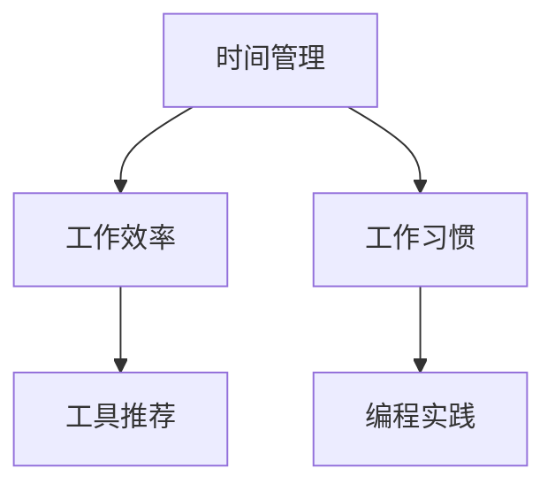

                 

# 程序员的时间管理：效率即财富

> 关键词：时间管理,效率提升,工作习惯,工具推荐,编程实践,职业发展,工作与生活平衡

## 1. 背景介绍

### 1.1 问题由来

在当前快节奏的科技行业中，程序员的工作压力日益增大。项目周期紧迫，需求变更频繁，编程任务繁重，如何高效管理时间，提升工作效率，成为了许多程序员亟需解决的难题。虽然新技术不断涌现，新工具层出不穷，但真正决定效率的关键还是程序员自身的时间管理和工作习惯。本文将通过介绍一系列行之有效的时间管理技巧和工具，帮助程序员提升工作效率，实现工作与生活的平衡。

### 1.2 问题核心关键点

- **时间管理**：合理分配时间，提升工作效率，减少工作时长。
- **工作效率**：优化工作流程，减少重复工作，提高编程质量。
- **工作习惯**：培养良好的工作习惯，提升自我管理能力。
- **工具推荐**：介绍实用的时间管理工具和编程工具。
- **编程实践**：分享高效的编程实践和代码管理技巧。

本文将围绕这些关键点展开，提供全面、系统的时间管理方案，助力程序员在繁忙的工作中保持高效、健康和快乐。

## 2. 核心概念与联系

### 2.1 核心概念概述

为了更好地理解时间管理，我们首先需要定义一些核心概念：

- **时间管理**：通过计划、组织、分配、监控等手段，合理利用时间，提升工作效率，实现目标的过程。
- **工作效率**：通过优化工作流程、使用高效工具、避免重复工作等手段，提升单位时间内完成的任务量和工作质量。
- **工作习惯**：一系列有利于提高工作效率和保持良好工作状态的日常行为习惯。
- **工具推荐**：介绍辅助时间管理和提升工作效率的工具，如项目管理软件、代码编辑器、版本控制系统等。
- **编程实践**：分享经过实践验证的编程技巧和代码管理方法，如代码重构、测试驱动开发、持续集成等。

这些概念之间相互关联，共同构成了程序员高效工作的基础。通过理解这些核心概念，我们可以更好地掌握时间管理的关键，实现工作效率的提升。

### 2.2 核心概念原理和架构的 Mermaid 流程图



这个流程图展示了时间管理、工作效率、工作习惯、工具推荐和编程实践之间的联系。通过优化时间管理，提升工作效率，培养良好的工作习惯，使用高效的工具，并遵循优秀的编程实践，我们可以构建一个高效的编程环境，实现工作与生活的平衡。

## 3. 核心算法原理 & 具体操作步骤

### 3.1 算法原理概述

时间管理算法的基本原理是通过规划、执行和反馈循环，实现对时间的有效利用。具体来说，包括以下几个关键步骤：

1. **目标设定**：明确工作目标和时间预期。
2. **任务分解**：将大任务分解为小任务，按优先级排序。
3. **时间规划**：根据任务优先级和复杂度，规划时间分配。
4. **执行与监控**：执行任务，并根据实际情况进行调整。
5. **反馈与优化**：根据任务完成情况和效率反馈，优化时间管理策略。

这些步骤通过循环迭代，不断提升时间管理效果，实现高效工作。

### 3.2 算法步骤详解

#### 3.2.1 目标设定

目标设定是时间管理的第一步。明确目标有助于聚焦注意力，提高工作效率。

**操作步骤**：
1. 列出所有需要完成的任务。
2. 对每个任务进行优先级排序，明确哪些任务是紧急且重要的，哪些是重要但不紧急的，哪些是紧急但不重要的，哪些是不紧急也不重要的。
3. 设定每个任务的完成期限和预期成果。

#### 3.2.2 任务分解

将大任务分解为小任务，有助于减少心理负担，提高任务执行效率。

**操作步骤**：
1. 将大任务拆分为若干个小任务。
2. 为每个小任务设定明确的执行步骤。
3. 评估每个小任务的复杂度和所需时间，合理分配时间资源。

#### 3.2.3 时间规划

时间规划是任务执行的关键。合理规划时间，有助于提高任务执行效率。

**操作步骤**：
1. 将任务按照优先级和复杂度分配到时间段内。
2. 为每个时间段设定具体任务，并预留一定的缓冲时间。
3. 根据实际情况调整时间规划，确保任务按时完成。

#### 3.2.4 执行与监控

执行与监控是任务实施的关键。通过持续监控，及时调整，确保任务顺利完成。

**操作步骤**：
1. 按计划执行任务，记录任务执行情况。
2. 根据任务执行情况，及时调整时间规划。
3. 使用工具监控任务进度，确保任务按时完成。

#### 3.2.5 反馈与优化

反馈与优化是时间管理的最后一步。通过持续反馈和优化，不断提升时间管理效果。

**操作步骤**：
1. 评估任务完成情况，分析效率和质量。
2. 根据反馈调整时间管理策略。
3. 总结经验教训，优化时间管理方法。

### 3.3 算法优缺点

时间管理算法的主要优点包括：
- 帮助明确目标，聚焦任务执行。
- 通过分解任务，降低心理负担，提高执行效率。
- 提供灵活的时间规划，确保任务按时完成。

其主要缺点包括：
- 需要较高的执行力和自律性。
- 时间规划可能过于机械，难以应对突发事件。
- 反馈和优化需要持续投入，工作量较大。

### 3.4 算法应用领域

时间管理算法适用于各种工作场景，包括项目管理、日常编程、团队协作等。通过合理应用，可以有效提升工作效率，减少工作压力，实现工作与生活的平衡。

## 4. 数学模型和公式 & 详细讲解 & 举例说明

### 4.1 数学模型构建

时间管理算法可以通过数学模型进行建模。这里以一个简单的项目管理任务为例，构建数学模型：

设项目共有 $N$ 个任务，每个任务需要 $t_i$ 小时，优先级为 $p_i$，已完成的任务数为 $C$，剩余未完成的任务数为 $R$。时间管理的目标是最大化项目完成效率，最小化项目完成时间。

数学模型可表示为：

$$
\max_{C} \frac{C}{N-C} \quad s.t. \quad \sum_{i=1}^{N} p_i \cdot t_i = T, \quad C \leq N
$$

其中 $T$ 为项目总时间，$p_i$ 为任务优先级，$t_i$ 为任务所需时间，$C$ 为已完成任务数。

### 4.2 公式推导过程

根据上述模型，我们可以推导出任务优先级的计算公式：

$$
p_i = \frac{t_i}{\sum_{j=1}^{N} t_j}
$$

即任务的优先级与其所需时间成正比。

### 4.3 案例分析与讲解

以一个软件开发项目为例，假设项目共有 10 个任务，每个任务需要 2 小时，优先级相同。项目总时间为 20 小时，当前已完成 3 个任务。

根据公式计算，剩余未完成任务的优先级为：

$$
p_j = \frac{2}{20 \cdot (10-3)} = \frac{2}{60} = \frac{1}{30}
$$

由于所有任务优先级相同，因此可以优先完成剩余任务。

## 5. 项目实践：代码实例和详细解释说明

### 5.1 开发环境搭建

为了实现时间管理算法，我们需要搭建相应的开发环境。以下是一些常用的开发工具：

- **IDE**：如 VSCode、IntelliJ IDEA、PyCharm 等。
- **代码编辑器**：如 Vim、Emacs、Sublime Text 等。
- **项目管理工具**：如 JIRA、Trello、Asana 等。
- **版本控制系统**：如 Git、SVN 等。

### 5.2 源代码详细实现

以一个简单的项目任务管理为例，展示如何使用 Python 实现时间管理算法：

```python
import numpy as np

# 任务信息
tasks = {
    1: {'name': '任务1', 'time': 2, 'priority': 1},
    2: {'name': '任务2', 'time': 2, 'priority': 1},
    3: {'name': '任务3', 'time': 2, 'priority': 1},
    4: {'name': '任务4', 'time': 2, 'priority': 1},
    5: {'name': '任务5', 'time': 2, 'priority': 1},
    6: {'name': '任务6', 'time': 2, 'priority': 1},
    7: {'name': '任务7', 'time': 2, 'priority': 1},
    8: {'name': '任务8', 'time': 2, 'priority': 1},
    9: {'name': '任务9', 'time': 2, 'priority': 1},
    10: {'name': '任务10', 'time': 2, 'priority': 1}
}

# 已完成任务数
completed_tasks = 3

# 计算剩余未完成任务的优先级
remaining_tasks = {}
remaining_time = 0
remaining_priorities = []
for i, task in tasks.items():
    remaining_tasks[i] = task
    remaining_time += task['time']
    remaining_priorities.append(task['priority'])

# 计算剩余任务优先级
remaining_priorities = np.array(remaining_priorities) / remaining_time

# 按优先级排序，执行任务
remaining_tasks = dict(sorted(remaining_tasks.items(), key=lambda x: remaining_tasks[x]['priority']))
for task_id, task in remaining_tasks.items():
    if completed_tasks < 10:
        completed_tasks += 1
        print(f"完成任务 {task['name']} ({task['time']}小时)")
    else:
        break
```

### 5.3 代码解读与分析

以上代码展示了如何使用 Python 实现一个简单的项目任务管理。具体步骤如下：

1. **任务信息**：定义每个任务的名称、所需时间、优先级等信息。
2. **已完成任务数**：记录已完成的任务数。
3. **计算剩余任务**：计算剩余未完成任务的优先级。
4. **按优先级排序**：按优先级排序，执行任务。
5. **输出完成情况**：输出已完成的任务信息。

## 6. 实际应用场景

### 6.1 项目管理

项目管理是时间管理的重要应用场景之一。项目经理可以通过时间管理算法，优化项目任务安排，提高项目完成效率。

**操作步骤**：
1. 列出所有项目任务，确定任务优先级和所需时间。
2. 按优先级和时间规划任务安排。
3. 持续监控任务进度，及时调整计划。
4. 评估任务完成情况，反馈优化时间管理策略。

### 6.2 日常编程

在日常编程中，合理的时间管理有助于提高代码质量和开发效率。

**操作步骤**：
1. 列出所有待完成的任务，如需求分析、设计、编码、测试等。
2. 按优先级和时间规划任务安排。
3. 持续监控任务进度，及时调整计划。
4. 评估任务完成情况，反馈优化时间管理策略。

### 6.3 团队协作

在团队协作中，合理的时间管理有助于协调团队成员的工作，提高团队协作效率。

**操作步骤**：
1. 列出所有团队任务，确定任务优先级和所需时间。
2. 按优先级和时间规划任务安排。
3. 持续监控任务进度，及时调整计划。
4. 评估任务完成情况，反馈优化时间管理策略。

### 6.4 未来应用展望

随着技术的发展，时间管理算法将不断升级，变得更加智能化和自动化。例如，使用机器学习算法预测任务完成时间，动态调整任务优先级等。未来，时间管理将与大数据、人工智能等技术深度融合，为程序员提供更加高效、智能的工作环境。

## 7. 工具和资源推荐

### 7.1 学习资源推荐

为了提高时间管理技能，以下是一些优质的学习资源：

1. **《高效能人士的七个习惯》**：史蒂芬·柯维的经典著作，介绍了七种高效工作习惯，值得程序员深入阅读。
2. **《深度工作》**：卡尔·纽波特的著作，讲述了深度工作的重要性，提供了具体的实践建议。
3. **Coursera 课程**：Coursera 提供了许多时间管理和工作效率的在线课程，如《时间管理》、《有效沟通》等。
4. **Udemy 课程**：Udemy 提供了丰富的编程实践和代码管理课程，如《Python 编程实践》、《Git 基础》等。

### 7.2 开发工具推荐

为了提高工作效率，以下是一些实用的开发工具：

1. **Visual Studio Code**：一款轻量级的代码编辑器，支持多种编程语言，插件丰富，易于使用。
2. **JIRA**：一款流行的项目管理工具，支持敏捷开发、任务追踪、报表生成等功能。
3. **Git**：一个广泛使用的版本控制系统，支持分布式版本控制，适合团队协作。
4. **GitHub**：一个流行的代码托管平台，提供代码仓库、协作功能，方便代码管理和版本控制。

### 7.3 相关论文推荐

时间管理和编程实践的研究已经积累了大量的理论和实践成果。以下是几篇具有代表性的论文：

1. **《重构：改善已有代码的设计》**：Martin Fowler 的著作，介绍了代码重构的基本原则和实践方法，对提升代码质量具有重要参考价值。
2. **《测试驱动开发：软件开发与特定需求》**：Kent Beck 的著作，详细讲解了测试驱动开发的思想和实践方法，有助于提升代码质量和开发效率。
3. **《持续集成：提升软件质量和效率》**：Martin Fowler 的著作，介绍了持续集成的基本概念和实践方法，有助于提升软件开发效率。

## 8. 总结：未来发展趋势与挑战

### 8.1 研究成果总结

本文从时间管理的核心概念出发，详细讲解了时间管理算法的基本原理和操作步骤。通过实际案例和编程实践，展示了时间管理算法的应用场景和效果。同时，推荐了多种实用的学习资源、开发工具和研究论文，帮助程序员提升时间管理技能，实现高效工作。

### 8.2 未来发展趋势

未来，时间管理算法将呈现以下几个发展趋势：

1. **智能化**：使用机器学习和大数据技术，预测任务完成时间和优先级，实现动态调整。
2. **自动化**：使用自动化工具和流程，减少手动操作，提高工作效率。
3. **协同化**：与团队协作工具深度融合，提高团队协作效率。
4. **跨平台化**：支持多平台、多设备，实现无缝协作。
5. **情境化**：根据不同的工作场景和环境，自动调整时间管理策略。

### 8.3 面临的挑战

尽管时间管理算法已经取得了一定的成果，但仍面临一些挑战：

1. **缺乏科学依据**：当前的时间管理算法主要依赖经验，缺乏科学的理论支撑。
2. **复杂性高**：时间管理算法的复杂性较高，需要较高的执行力和自律性。
3. **适用性差**：不同类型的工作和场景，需要不同的时间管理策略。
4. **心理负担**：严格的时间管理可能会带来较大的心理负担，影响工作幸福感。

### 8.4 研究展望

未来，时间管理算法的研究方向将更加注重科学化和自动化。例如，引入机器学习和大数据技术，提升时间管理算法的科学性和智能性；开发智能时间管理工具，减少手动操作，提高工作效率；应用情境感知技术，根据不同场景和工作内容，自动调整时间管理策略。同时，如何更好地平衡工作与生活，提高工作幸福感，也是未来研究的重要方向。

## 9. 附录：常见问题与解答

**Q1：时间管理算法是否适用于所有工作场景？**

A: 时间管理算法适用于大多数工作场景，但需要根据具体情况进行调整。例如，对于需要灵活应对突发事件的工作，需要预留一定的缓冲时间。

**Q2：如何处理突发事件和紧急任务？**

A: 突发事件和紧急任务需要优先处理。可以将所有任务分为两类：紧急任务和非紧急任务。对于紧急任务，立即处理，而对于非紧急任务，按照时间管理算法继续执行。

**Q3：时间管理算法的执行力和自律性要求较高，如何提升自我管理能力？**

A: 可以通过逐步适应，逐步提升执行力。例如，从简单的任务开始，逐步增加任务复杂度，逐步提升自律性。同时，可以使用番茄工作法等工具，逐步培养良好的工作习惯。

**Q4：如何平衡工作与生活？**

A: 平衡工作与生活的关键是合理规划时间，避免过度工作。可以采用时间块划分法，将时间划分为工作时间和休息时间，确保足够的休息和娱乐时间。

**Q5：时间管理算法是否适用于团队协作？**

A: 时间管理算法可以应用于团队协作，通过合理的任务分配和优先级排序，提高团队协作效率。但需要结合团队协作工具，如 JIRA、Trello 等，实现高效协作。

总之，时间管理算法是提高工作效率的重要手段，但需要根据具体情况进行调整和优化。通过合理的规划、执行和反馈，我们可以实现高效工作，提升生活幸福感，实现工作与生活的平衡。

