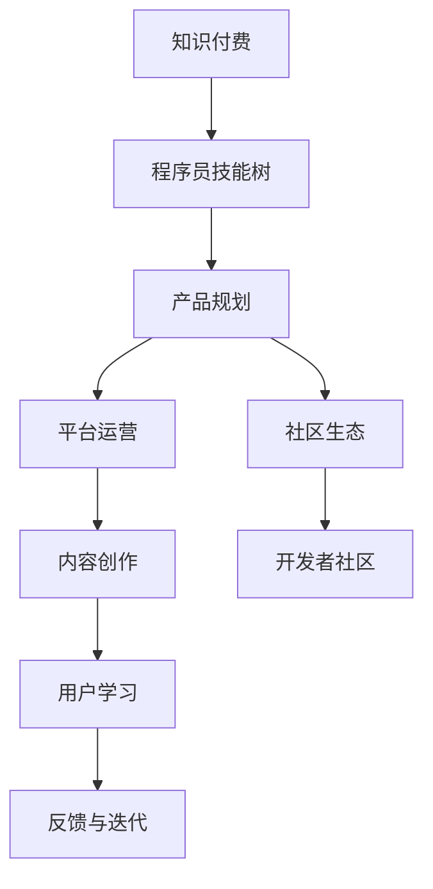

                 

# 程序员的知识付费产品线规划

## 1. 背景介绍

随着互联网和信息技术的高速发展，程序员作为推动技术创新的主力军，其知识和技能的获取、提升和分享变得尤为重要。知识付费模式应运而生，为程序员提供了学习、成长和职业发展的全新途径。本文将详细探讨如何构建一个全面、有效的程序员知识付费产品线，为程序员提供定制化的学习资源和工具，帮助他们快速掌握最新技术，实现职业突破。

## 2. 核心概念与联系

### 2.1 核心概念概述

- **知识付费**：指通过在线平台为特定知识或技能提供付费服务的商业模式，用户可以按需获取高质量的教育资源。
- **程序员技能树**：表示程序员从入门到高级的成长路径，包括必学的编程语言、工具和框架，以及软技能如算法、数据结构等。
- **产品规划**：指根据市场需求和用户反馈，设计、开发和优化知识付费产品的过程。
- **平台运营**：涉及产品发布、推广、客户服务和内容更新等环节，确保产品满足用户需求，提升用户体验。
- **社区生态**：指围绕知识付费平台形成的互动交流社区，包括开发者论坛、问答系统等，促进知识共享和技能交流。

这些概念之间紧密相连，共同构成了程序员知识付费产品线的基本框架。通过深入理解这些核心概念，我们可以设计出更具吸引力和实用性的知识付费产品。

### 2.2 核心概念原理和架构的 Mermaid 流程图



这个流程图展示了知识付费产品线中各个环节的相互关系：知识付费服务围绕程序员技能树展开，通过产品规划和平台运营确保内容质量和用户体验，借助社区生态促进知识共享和技能交流，同时通过内容创作和用户学习不断迭代改进。

## 3. 核心算法原理 & 具体操作步骤

### 3.1 算法原理概述

程序员知识付费产品线的构建，本质上是一个基于用户行为和反馈的动态优化过程。算法原理包括用户行为分析、内容推荐、个性化学习路径设计等，旨在为用户提供最相关、最实用的学习资源。

### 3.2 算法步骤详解

**Step 1: 数据收集与用户画像构建**
- 收集用户注册信息、学习记录、搜索行为、问答互动等数据。
- 基于用户的行为特征，构建用户画像，包括技术栈偏好、学习进度、职业阶段等。

**Step 2: 内容推荐与个性化路径设计**
- 根据用户画像，使用协同过滤、内容标签匹配等算法推荐相关课程、文章和视频。
- 设计个性化学习路径，推荐合适的学习顺序和任务，帮助用户系统学习。

**Step 3: 社区互动与内容更新**
- 通过社区讨论、问答系统等促进用户间的交流，分享学习心得。
- 根据社区反馈，及时更新和优化课程内容，确保其与时俱进。

**Step 4: 用户体验优化与反馈收集**
- 分析用户的学习行为和满意度，优化平台界面和功能。
- 定期收集用户反馈，了解用户需求，进行迭代改进。

**Step 5: 营销推广与用户增长**
- 制定营销策略，通过社交媒体、SEO、SEM等手段提升品牌知名度。
- 利用口碑效应和用户推荐，吸引新用户加入，扩大用户群体。

### 3.3 算法优缺点

**优点**：
- 提高学习效率：通过个性化推荐和路径设计，用户可以快速找到最适合自己的学习资源。
- 增强学习动力：社区互动和反馈机制促进知识交流和技能提升，激发学习热情。
- 提升用户黏性：优质的内容和便捷的交互方式，增加用户的使用频率和忠诚度。

**缺点**：
- 内容质量依赖于创作者：高水平的内容创作者稀缺，影响产品的整体质量。
- 用户隐私保护：收集大量用户数据，需严格遵守隐私保护法规。
- 运营成本较高：平台建设和维护需要大量资金和人力资源投入。

### 3.4 算法应用领域

程序员知识付费产品线可以应用于各类编程语言和框架的学习、特定技术栈的深入研究、跨领域的技能提升等方面。例如：

- **基础编程技能**：如Python、Java、C++等语言的入门和进阶。
- **工具和框架**：如Docker、Kubernetes、Redis等技术的实战应用。
- **算法与数据结构**：如动态规划、图论、排序算法等。
- **软技能**：如团队协作、项目管理、技术沟通等。
- **特定领域**：如机器学习、人工智能、物联网等方向的专业知识。

## 4. 数学模型和公式 & 详细讲解 & 举例说明

### 4.1 数学模型构建

程序员知识付费产品线涉及多个子系统，如用户行为分析、内容推荐、个性化路径设计等。我们以内容推荐为例，介绍数学模型的构建。

设用户集合为 $U$，课程集合为 $C$，用户与课程的评分矩阵为 $R \in \mathbb{R}^{U \times C}$，其中 $R_{ui} = r_{ui}$ 表示用户 $u$ 对课程 $i$ 的评分（若用户未评分，则 $r_{ui} = 0$）。

目标是最小化预测评分与实际评分之间的平方误差：

$$
\min_{\theta} \sum_{u \in U} \sum_{i \in C} (r_{ui} - \hat{r}_{ui})^2
$$

其中 $\hat{r}_{ui} = \theta^T \cdot \phi(u, i)$ 为模型预测的评分，$\phi(u, i)$ 为特征映射函数，$\theta$ 为模型参数。

### 4.2 公式推导过程

以协同过滤为例，设用户向量 $u = (u_1, u_2, \ldots, u_k)$，课程向量 $i = (i_1, i_2, \ldots, i_n)$，评分矩阵 $R = [r_{ij}]_{k \times n}$。

协同过滤模型包括用户-用户协同过滤和物品-物品协同过滤，这里我们以用户-物品协同过滤为例：

目标是最小化预测评分与实际评分之间的平方误差：

$$
\min_{\theta} \sum_{u \in U} \sum_{i \in C} (r_{ui} - \theta^T \cdot \phi(u, i))^2
$$

其中 $\phi(u, i) = (u_1, u_2, \ldots, u_k, i_1, i_2, \ldots, i_n)$，$\theta \in \mathbb{R}^{k+n}$ 为模型参数。

引入正则项，约束模型参数：

$$
\min_{\theta} \frac{1}{2} \sum_{u \in U} \sum_{i \in C} (r_{ui} - \theta^T \cdot \phi(u, i))^2 + \lambda \sum_{j=1}^{k+n} \theta_j^2
$$

通过求解上述优化问题，可得到模型参数 $\theta$，进而计算任意用户 $u$ 对课程 $i$ 的预测评分 $\hat{r}_{ui} = \theta^T \cdot \phi(u, i)$。

### 4.3 案例分析与讲解

假设某知识付费平台收集了100个用户对200门课程的评分数据，使用协同过滤模型进行内容推荐。用户向量 $u \in \mathbb{R}^{100}$，课程向量 $i \in \mathbb{R}^{200}$，评分矩阵 $R \in \mathbb{R}^{100 \times 200}$。

通过特征映射 $\phi(u, i) = (u_1, u_2, \ldots, u_{100}, i_1, i_2, \ldots, i_{200})$，定义模型参数 $\theta \in \mathbb{R}^{100+200} = \mathbb{R}^{300}$。

通过求解上述优化问题，得到模型参数 $\theta$。假设某用户 $u_3$ 希望学习新课程 $i_5$，利用 $\hat{r}_{35} = \theta^T \cdot \phi(u_3, i_5)$ 计算其预测评分，从而推荐该课程。

## 5. 项目实践：代码实例和详细解释说明

### 5.1 开发环境搭建

使用Python进行开发，需安装必要的依赖包，如Pandas、NumPy、Scikit-learn、TensorFlow等。可以使用虚拟环境工具如Anaconda进行环境管理。

### 5.2 源代码详细实现

以下是一个基于协同过滤模型的Python代码示例，用于推荐课程：

```python
import pandas as pd
import numpy as np
from sklearn.decomposition import TruncatedSVD

# 读取评分数据
df = pd.read_csv('ratings.csv', sep=',')
# 构建用户-课程评分矩阵
R = df.pivot_table(index='user_id', columns='course_id', values='rating', fill_value=0)
R = R.to_numpy()

# 计算用户-课程评分矩阵的奇异值分解
svd = TruncatedSVD(n_components=300)
U, S, Vt = svd.fit_transform(R)

# 预测用户对课程的评分
def predict_score(u, i):
    return np.dot(U[u], Vt[i]) / S

# 推荐课程
user_id = 3
top_n = 5
sorted_scores = [(predict_score(u, i), u, i) for u in range(R.shape[0]) for i in range(R.shape[1])]
top_scores = sorted_scores[:top_n]
for score, user, course in top_scores:
    print(f'推荐课程 {course} 给用户 {user}')
```

### 5.3 代码解读与分析

代码中首先使用Pandas库读取评分数据，构建用户-课程评分矩阵。接着，使用Scikit-learn库中的TruncatedSVD算法进行奇异值分解，得到低秩矩阵的分解结果。最后，通过计算预测评分，推荐给用户。

## 6. 实际应用场景

### 6.4 未来应用展望

未来，程序员知识付费产品线将进一步扩展和优化，以应对不断变化的市场需求和技术趋势。以下是几个可能的应用场景：

- **在线培训与认证**：提供完整的在线培训课程，帮助用户系统学习特定技术栈，并通过认证获得官方认可。
- **项目实战**：提供实战项目案例和练习，帮助用户将理论知识转化为实践能力。
- **专家讲座与访谈**：邀请行业专家进行讲座和访谈，分享最新技术趋势和实战经验。
- **虚拟编程教室**：构建虚拟编程教室，用户可以与专家互动，实时解决问题。
- **智能搜索与问答**：提供智能搜索和问答系统，快速获取编程问题解答和解决方案。

## 7. 工具和资源推荐

### 7.1 学习资源推荐

- **Coursera、Udacity**：提供大量高质量的编程和数据科学课程，涵盖各种技术栈和应用场景。
- **LeetCode、HackerRank**：提供编程练习平台，通过挑战题目提升编程能力和解题技巧。
- **Stack Overflow**：程序员问答社区，大量技术问题得到解答，用户也可以分享自己的经验。
- **GitHub**：代码托管平台，可以学习开源项目，了解最佳实践。
- **Kaggle**：数据科学竞赛平台，参与实际项目，提升数据处理和分析能力。

### 7.2 开发工具推荐

- **Jupyter Notebook**：强大的交互式编程环境，适合数据探索和机器学习模型的开发。
- **PyCharm**：IDE工具，提供代码高亮、调试和自动补全等功能，提高开发效率。
- **Git**：版本控制工具，帮助团队协作，管理代码版本。
- **Docker**：容器化技术，方便部署和运维。
- **Jenkins**：自动化构建工具，实现持续集成和持续交付。

### 7.3 相关论文推荐

- **Collaborative Filtering for Implicit Feedback Datasets**：通过协同过滤模型推荐系统的经典论文，详细介绍了协同过滤算法的原理和应用。
- **Scikit-learn**：Scikit-learn库的官方文档，提供了丰富的机器学习算法和工具。
- **TensorFlow**：TensorFlow官方文档，介绍了深度学习模型的构建和优化。
- **Deep Learning**：Ian Goodfellow等著，深度学习领域的经典教材，适合深入理解深度学习模型的原理和应用。

## 8. 总结：未来发展趋势与挑战

### 8.1 研究成果总结

本文系统介绍了程序员知识付费产品线的构建，包括核心概念、算法原理和操作步骤。通过构建基于协同过滤模型的推荐系统，展示了如何利用用户行为数据设计个性化学习路径，提升用户的学习效率。

### 8.2 未来发展趋势

- **智能化推荐**：通过引入机器学习和深度学习技术，提升推荐系统的精准度和个性化水平。
- **多渠道分发**：通过社交媒体、搜索引擎等渠道进行推广，扩大用户覆盖范围。
- **社区互动与协作**：加强社区建设，促进用户间的交流和协作，形成活跃的开发者生态。
- **内容动态更新**：根据市场和技术趋势，动态更新课程和文档，保持内容的时效性。
- **数据驱动决策**：通过数据分析和用户反馈，优化产品设计和运营策略。

### 8.3 面临的挑战

- **内容质量控制**：确保高质量内容的持续供应，避免劣质内容影响用户体验。
- **用户隐私保护**：严格遵守隐私保护法规，保护用户数据安全。
- **运营成本控制**：平衡产品质量和运营成本，实现可持续发展。
- **用户体验优化**：不断优化平台功能和界面设计，提升用户体验。
- **技术迭代更新**：紧跟技术发展，及时更新产品功能和技术栈。

### 8.4 研究展望

未来，程序员知识付费产品线将在智能化推荐、多渠道分发、社区互动与协作、内容动态更新和数据驱动决策等方面取得突破。通过不断优化产品设计和技术栈，满足用户需求，提升用户满意度，实现平台可持续发展和长期价值。

## 9. 附录：常见问题与解答

**Q1: 程序员知识付费产品线有哪些应用场景？**

A: 程序员知识付费产品线可以应用于在线培训与认证、项目实战、专家讲座与访谈、虚拟编程教室、智能搜索与问答等多个方面。

**Q2: 协同过滤算法的优缺点有哪些？**

A: 协同过滤算法的优点包括：
- 通过用户行为数据发现潜在的相关性，实现个性化推荐。
- 简单易实现，计算效率高。

缺点包括：
- 冷启动问题：新用户或新物品没有评分数据，难以推荐。
- 数据稀疏性：评分矩阵可能存在大量零值，影响推荐效果。
- 泛化能力不足：推荐结果依赖于训练数据，易过拟合。

**Q3: 如何确保程序员知识付费平台的数据隐私保护？**

A: 数据隐私保护需要从数据收集、存储、传输和使用等多个环节进行严格控制，具体措施包括：
- 数据匿名化：对用户数据进行去标识化处理。
- 访问控制：限制对数据的访问权限，确保只有授权人员才能访问。
- 加密存储：对敏感数据进行加密存储，防止未授权访问。
- 安全传输：使用SSL/TLS等加密协议，确保数据传输安全。
- 用户同意：在数据收集和使用前，获取用户的明确同意。

**Q4: 如何构建一个高质量的程序员知识付费产品线？**

A: 构建高质量的程序员知识付费产品线需要从内容、技术、运营等多个方面进行全面优化：
- 内容建设：确保内容的丰富性和多样性，吸引用户。
- 技术架构：采用先进的技术架构，提高平台的性能和可扩展性。
- 运营策略：制定合理的营销和推广策略，吸引新用户，提升用户黏性。
- 用户反馈：收集用户反馈，及时改进产品设计和功能。
- 持续迭代：持续优化产品，保持其与时俱进。

**Q5: 程序员知识付费产品线未来的发展方向有哪些？**

A: 未来，程序员知识付费产品线的发展方向包括智能化推荐、多渠道分发、社区互动与协作、内容动态更新和数据驱动决策等，通过不断优化产品设计和技术栈，提升用户体验和平台价值。

---

作者：禅与计算机程序设计艺术 / Zen and the Art of Computer Programming

