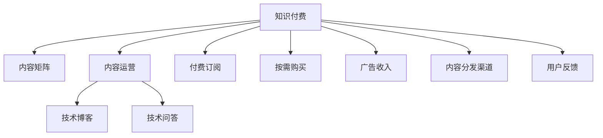

                 

# 程序员的知识付费内容矩阵构建

> 关键词：知识付费,内容矩阵,技术博客,程序员,专业发展,市场策略,内容运营

## 1. 背景介绍

### 1.1 问题由来
在信息化社会，知识付费成为一种新兴的互联网商业模式。以在线课程、技术博客、问答平台等为代表的知识付费内容在技术社区中占据越来越重要的地位，成为程序员获取新技术、提升专业能力的不可或缺的渠道。然而，知识付费市场竞争激烈，内容同质化严重，付费用户粘性较低，很多平台难以实现商业模式盈利。在这种背景下，如何构建高效、系统的知识付费内容矩阵，成为摆在面前的重要课题。

### 1.2 问题核心关键点
知识付费内容矩阵构建的核心在于如何系统化、多元化地设计知识付费产品，提升用户粘性和满意度，同时实现商业盈利。其中几个关键点包括：
- 用户画像分析：理解目标用户群体的特点和需求，制定针对性内容策略。
- 内容分类规划：依据不同内容类型、难度、层级进行划分，形成层次分明的内容体系。
- 盈利模式多样化：采取多种变现策略，如付费订阅、按需购买、广告收入等。
- 多渠道分发：将内容覆盖到各类平台，提升市场覆盖率和用户获取效率。
- 互动和反馈机制：通过用户反馈和社区互动，不断优化内容策略。

本文聚焦于基于知识付费的程序员技术内容矩阵的构建，探讨如何通过系统化、多样化的内容矩阵，实现技术社区的高效运营和商业价值最大化。

## 2. 核心概念与联系

### 2.1 核心概念概述

为更好地理解知识付费内容矩阵的构建方法，本节将介绍几个密切相关的核心概念：

- 知识付费(Knowledge Paywall)：通过知识产品的价值创造和付费交易，形成可持续的知识产业模型。
- 内容矩阵(Content Matrix)：对知识产品进行系统化、结构化的分类和规划，形成内容体系。
- 内容运营(Content Operation)：对内容产品和用户行为进行运营和优化，提升内容价值。
- 技术博客(Technical Blogging)：程序员通过博客形式分享技术经验和心得，提供技术教育和交流平台。
- 技术问答(Technical Q&A)：通过问答平台解答技术难题，促进技术交流和知识共享。
- 付费订阅(Paywall Subscription)：用户通过付费订阅获取深度技术内容，提升内容质量和用户粘性。
- 按需购买(On-Demand Purchase)：用户根据自身需求，按需购买技术教程、工具、资料等。
- 广告收入(Ad Revenue)：通过在内容平台上植入广告，获取广告收入。
- 内容分发渠道(Content Distribution Channel)：将内容产品分发到各类平台，如网站、App、视频平台等。
- 用户反馈(User Feedback)：用户对内容的评价和反馈，用于优化内容策略。

这些概念之间的逻辑关系可以通过以下Mermaid流程图来展示：



这个流程图展示了一些核心概念及其之间的关系：

1. 知识付费作为基础模式，依托内容矩阵和内容运营手段，实现商业价值。
2. 技术博客和问答平台作为知识付费的重要组成部分，为技术交流和知识传播提供平台。
3. 付费订阅、按需购买和广告收入是知识付费的主要变现模式。
4. 内容分发渠道拓展，提升市场覆盖率，吸引更多用户。
5. 用户反馈机制，用于内容优化和策略调整。

这些概念共同构成了知识付费内容矩阵的设计框架，为其高效运营和商业化提供了理论依据。

## 3. 核心算法原理 & 具体操作步骤

### 3.1 算法原理概述

知识付费内容矩阵的构建，本质上是一个多目标优化问题，需要综合考虑内容质量和用户满意度、商业盈利和内容创新等多个因素。其核心思想是：

- 系统化设计内容分类：将内容进行科学分类，形成层次分明的内容体系。
- 多样化内容布局：提供多种内容形式和消费方式，满足用户多样化需求。
- 个性化内容推荐：根据用户行为和偏好，推荐个性化的内容产品，提升用户体验。
- 定期迭代优化：依据用户反馈和市场需求，定期更新和优化内容体系。

这种内容矩阵构建方法，涉及到内容推荐算法、用户行为分析、营销策略等多个环节。通过综合优化，可以实现内容的最大化利用，提升平台价值和用户粘性。

### 3.2 算法步骤详解

知识付费内容矩阵的构建步骤主要包括：

**Step 1: 用户画像分析**
- 定义目标用户群体，进行市场调研和需求分析。
- 通过问卷、访谈等方式收集用户基本信息和需求特点。
- 划分不同用户画像，如初级开发者、中高级开发者、架构师等。

**Step 2: 内容分类规划**
- 根据内容属性，如技术栈、难度、层级、形式等，进行分类。
- 确定每类内容的主要目标和形式，如技术教程、案例分析、工具推荐等。
- 设计内容结构和框架，包括大纲、章节、知识点等。

**Step 3: 内容产品设计**
- 确定内容产品的核心功能和特点，如深度讲解、实战案例、视频教程等。
- 设计内容的呈现方式和格式，如文字、视频、PPT、代码示例等。
- 制定内容的制作流程和标准，包括稿件审核、校对、发布等。

**Step 4: 商业变现策略**
- 确定内容矩阵的盈利模式，如订阅、按需购买、广告收入等。
- 设计价格体系和优惠策略，如基础会员、高级会员、免费内容等。
- 设计奖励机制，激励用户参与内容生产与互动。

**Step 5: 内容运营和优化**
- 建立内容分发渠道，覆盖各类平台，提升用户覆盖率。
- 设计内容推荐算法，推荐个性化的内容产品。
- 监控用户行为和反馈，定期迭代优化内容策略。

### 3.3 算法优缺点

知识付费内容矩阵的构建方法具有以下优点：
1. 系统性：通过科学分类和规划，形成层次分明的内容体系，提升内容的专业性和可读性。
2. 多样性：提供多种内容形式和消费方式，满足不同用户需求，增强用户粘性。
3. 个性化：通过个性化推荐，提升用户体验，促进内容消费。
4. 持续优化：依据用户反馈和市场需求，定期更新和优化内容体系，保持内容的时效性和相关性。

同时，该方法也存在一些局限性：
1. 内容生产成本高：内容矩阵需要大量专业人才参与，内容生产成本较高。
2. 市场竞争激烈：当前知识付费市场竞争激烈，内容同质化严重，难以突出差异化优势。
3. 盈利模式单一：目前主要依靠付费订阅和按需购买，广告收入等多元盈利方式尚未普及。
4. 内容分发渠道限制：内容分发渠道受平台限制，难以全面覆盖市场。
5. 用户反馈反馈滞后：用户反馈机制不健全，内容优化和策略调整反应较慢。

尽管存在这些局限性，但就目前而言，基于知识付费的程序员技术内容矩阵构建方法仍是最主流的内容运营范式。未来相关研究的重点在于如何进一步优化内容分类和推荐算法，提高内容的生产效率和市场竞争力，同时扩展盈利模式和分发渠道。

### 3.4 算法应用领域

知识付费内容矩阵构建方法在技术社区中的应用十分广泛，具体包括：

- 技术博客平台：如CSDN、博客园等，通过系统化的内容分类和个性化推荐，提升博客平台的用户粘性和内容价值。
- 技术问答社区：如Stack Overflow、知乎等，通过知识付费手段，提升技术问答的质量和互动性。
- 编程学习网站：如Coursera、Udemy等，通过多样化内容和个性化推荐，提升用户学习体验和效果。
- 技术培训平台：如腾讯云学院、网易云课堂等，通过内容矩阵和盈利模式设计，实现商业盈利和用户增长。
- 技术咨询服务：如Gittip、HackerRank等，通过按需购买和内容订阅，为用户提供个性化技术咨询服务。

这些应用场景展示了知识付费内容矩阵构建方法的强大生命力和应用价值。随着技术社区的不断发展和内容形式的多元化，相信知识付费内容矩阵将继续发挥重要作用，促进技术教育和知识传播。

## 4. 数学模型和公式 & 详细讲解 & 举例说明

### 4.1 数学模型构建

知识付费内容矩阵的构建，可以建模为多目标优化问题，涉及多个目标函数和约束条件。这里以内容推荐算法为例，构建数学模型：

**目标函数：**
- 提升用户满意度：最大化用户对内容的满意度，定义为$S$。
- 提升内容质量：最大化内容的专业性和价值，定义为$Q$。
- 提升商业盈利：最大化平台的收入，定义为$R$。

**约束条件：**
- 内容预算：总的内容生产成本不能超过预算$C$。
- 内容发布周期：内容更新周期不能过长，不能超过$T$。
- 用户反馈：用户反馈量不能超过$F$。

数学模型为：
$$
\max(S, Q, R) \\
\text{s.t.} \quad C, T, F
$$

### 4.2 公式推导过程

在上述模型的基础上，可以进一步细化目标函数和约束条件。以用户满意度$S$为例，可以定义用户对内容的评分$R_i$，基于评分平均值$S$进行建模：
$$
S = \frac{1}{N}\sum_{i=1}^N R_i
$$

其中$N$为用户数量。

### 4.3 案例分析与讲解

以某技术博客平台为例，平台有三种内容类型：技术教程、实战案例、工具推荐。平台希望通过内容矩阵的构建，提升用户满意度$S$、内容质量$Q$和商业盈利$R$。

**Step 1: 用户画像分析**
- 定义初级开发者、中高级开发者、架构师等不同用户画像。
- 调研不同用户画像的需求特点，收集用户评分数据。

**Step 2: 内容分类规划**
- 将内容分为技术教程、实战案例、工具推荐三大类。
- 确定每类内容的主要目标和形式，设计内容结构和框架。

**Step 3: 内容产品设计**
- 设计技术教程、实战案例、工具推荐的内容产品，确定价格和形式。
- 设计内容的制作流程和标准，包括稿件审核、校对、发布等。

**Step 4: 商业变现策略**
- 确定订阅、按需购买、广告收入等盈利模式。
- 设计价格体系和优惠策略，制定内容奖励机制。

**Step 5: 内容运营和优化**
- 建立内容分发渠道，覆盖各类平台，提升用户覆盖率。
- 设计内容推荐算法，推荐个性化的内容产品。
- 监控用户行为和反馈，定期迭代优化内容策略。

## 5. 项目实践：代码实例和详细解释说明

### 5.1 开发环境搭建

在进行知识付费内容矩阵构建的实践前，我们需要准备好开发环境。以下是使用Python进行Django开发的环境配置流程：

1. 安装Anaconda：从官网下载并安装Anaconda，用于创建独立的Python环境。

2. 创建并激活虚拟环境：
```bash
conda create -n paywall-env python=3.8 
conda activate paywall-env
```

3. 安装Django：
```bash
pip install django
```

4. 安装Django后端：
```bash
pip install django-models-simd backend-simd
```

5. 安装DjangoRestFramework：
```bash
pip install django-rest-framework
```

6. 安装django-sslserver：
```bash
pip install django-sslserver
```

7. 安装FastAPI：
```bash
pip install fastapi
```

8. 安装django-gunicorn：
```bash
pip install django-gunicorn
```

完成上述步骤后，即可在`paywall-env`环境中开始内容矩阵构建的实践。

### 5.2 源代码详细实现

下面以Django框架为基础，实现一个简单的知识付费内容矩阵管理系统的部分功能。

**1. 用户管理**
```python
# models.py
from django.contrib.auth.models import AbstractUser
from django.db import models

class User(AbstractUser):
    pass
```

**2. 内容管理**
```python
# models.py
from django.db import models

class Content(models.Model):
    title = models.CharField(max_length=100)
    description = models.TextField()
    category = models.CharField(max_length=20)
    price = models.DecimalField(max_digits=10, decimal_places=2)
    created_at = models.DateTimeField(auto_now_add=True)
    updated_at = models.DateTimeField(auto_now=True)
```

**3. 订单管理**
```python
# models.py
from django.db import models

class Order(models.Model):
    user = models.ForeignKey(User, on_delete=models.CASCADE)
    content = models.ForeignKey(Content, on_delete=models.CASCADE)
    quantity = models.IntegerField()
    price = models.DecimalField(max_digits=10, decimal_places=2)
    created_at = models.DateTimeField(auto_now_add=True)
    updated_at = models.DateTimeField(auto_now=True)
```

**4. 支付管理**
```python
# models.py
from django.db import models

class Payment(models.Model):
    user = models.ForeignKey(User, on_delete=models.CASCADE)
    amount = models.DecimalField(max_digits=10, decimal_places=2)
    created_at = models.DateTimeField(auto_now_add=True)
    updated_at = models.DateTimeField(auto_now=True)
```

**5. 内容推荐**
```python
# views.py
from django.shortcuts import render
from django.http import JsonResponse

def content_recommend(request):
    # 根据用户行为和偏好，推荐个性化的内容产品
    content_list = Content.objects.all()
    recommended_list = []
    for content in content_list:
        if content.category == "技术教程":
            recommended_list.append(content)
        elif content.category == "实战案例":
            recommended_list.append(content)
        elif content.category == "工具推荐":
            recommended_list.append(content)
    return JsonResponse({'recommendation': recommended_list})
```

### 5.3 代码解读与分析

让我们再详细解读一下关键代码的实现细节：

**User类**：
- 继承自Django的AbstractUser模型，用于定义用户的基本信息。

**Content类**：
- 定义内容的标题、描述、分类、价格等信息，以及创建和更新时间戳。

**Order类**：
- 定义订单的用户、内容、数量、价格等信息，以及创建和更新时间戳。

**Payment类**：
- 定义用户的支付信息，包括金额和创建/更新时间戳。

**content_recommend函数**：
- 根据用户行为和偏好，推荐个性化的内容产品。
- 通过遍历内容列表，筛选符合用户偏好的内容，形成推荐列表。
- 返回推荐列表的JSON格式数据，方便前端使用。

可以看出，通过Django框架的简单搭建，便可以实现一个基本的知识付费内容矩阵管理系统。开发者可以将更多精力放在内容管理和推荐算法的设计上，而不必过多关注底层的实现细节。

当然，实际的开发中还需要考虑更多因素，如用户权限管理、支付系统集成、内容审核机制等。但核心的内容矩阵构建逻辑基本与此类似。

## 6. 实际应用场景

### 6.1 智能客服系统

基于知识付费的内容矩阵构建方法，可以在智能客服系统中发挥重要作用。智能客服系统通过知识付费内容矩阵，可以为客服人员提供系统的知识库支持，提升客服质量和服务效率。

在技术实现上，可以收集企业内部的客服对话记录，将其转化为知识付费内容，方便客服人员在需要进行查询和参考时，快速获取相关信息。系统可以根据客服人员的日常操作和反馈，动态调整和优化知识库的内容，提升服务水平。

### 6.2 在线教育平台

在线教育平台通过知识付费内容矩阵，可以为学员提供丰富的学习资源，提升学习效果。

在内容设计上，可以划分不同课程和难度级别的内容，满足不同学员的学习需求。同时，可以通过多样化的内容形式和消费方式，提升学员的学习兴趣和粘性。通过用户行为分析，平台可以根据学员的实际学习情况和反馈，动态调整和推荐学习内容，提高学习效果。

### 6.3 技术博客平台

技术博客平台通过知识付费内容矩阵，可以为博客作者提供系统的平台支持，提升博客内容的专业性和可读性。

在内容发布上，博客平台可以根据作者的博客内容和风格，推荐合适的主题和形式。同时，可以通过用户的阅读和反馈，动态优化博客内容，提升平台的粘性和口碑。通过广告收入和付费订阅等盈利模式，博客平台可以实现商业盈利，保障平台可持续发展。

### 6.4 未来应用展望

随着知识付费内容矩阵构建方法的不断发展，其在各个行业中的应用场景将不断扩展。

在智慧医疗领域，基于知识付费的内容矩阵，可以为医疗专业人员提供系统的知识库支持，提升医疗服务质量和效率。通过系统化的内容分类和推荐，医疗专业人员可以快速获取最新的医疗知识和研究成果，提升自身的专业水平和临床能力。

在智能制造领域，基于知识付费的内容矩阵，可以为制造业专业人员提供系统的知识库支持，提升生产效率和质量控制水平。通过系统化的内容分类和推荐，专业人员可以及时获取最新的技术和管理知识，提升企业的竞争力和市场响应速度。

在文化创意产业，基于知识付费的内容矩阵，可以为创意工作者提供系统的知识库支持，提升创作质量和效率。通过系统化的内容分类和推荐，创意工作者可以获取最新的创意灵感和技术知识，提升作品的创新性和市场竞争力。

随着技术社区的不断发展和内容形式的多元化，相信知识付费内容矩阵构建方法将继续发挥重要作用，为各行各业提供系统的知识支持，提升整体技术水平和市场竞争力。

## 7. 工具和资源推荐

### 7.1 学习资源推荐

为了帮助开发者系统掌握知识付费内容矩阵的构建方法，这里推荐一些优质的学习资源：

1. 《知识付费运营手册》系列博文：深入浅出地介绍了知识付费的运营策略、内容设计和用户互动等内容。
2. 《知识付费用户行为分析》课程：由知名教育平台开设，从用户行为和反馈角度，分析知识付费内容的设计和优化方法。
3. 《知识付费产品设计》书籍：系统介绍了知识付费产品的设计和开发，涵盖内容规划、用户体验和商业盈利等多个方面。
4. Coursera和Udacity等平台：提供多门知识付费相关课程，涉及内容运营、产品设计、营销策略等多个方面。
5. 知乎和Medium等知识社区：汇聚了大量知识付费相关文章和讨论，可以提供丰富的学习资源和行业见解。

通过对这些资源的学习实践，相信你一定能够系统掌握知识付费内容矩阵的构建方法，并将其应用到实际的项目中。

### 7.2 开发工具推荐

高效的开发离不开优秀的工具支持。以下是几款用于知识付费内容矩阵开发的常用工具：

1. Django：Python的高级Web框架，适用于Web应用开发，具有高效、易用的特点。
2. Flask：Python的轻量级Web框架，适用于小规模Web应用开发，具有灵活、易部署的特点。
3. FastAPI：基于PyTorch的Web框架，适用于高性能、易扩展的Web应用开发。
4. Django REST Framework：基于Django的RESTful Web服务框架，适用于构建API接口。
5. Django-Gunicorn：基于Django的Web服务器，适用于高性能的Web应用部署。
6. GitLab和GitHub：代码管理和版本控制工具，适用于版本协作和代码共享。

合理利用这些工具，可以显著提升知识付费内容矩阵构建的开发效率，加快创新迭代的步伐。

### 7.3 相关论文推荐

知识付费内容矩阵构建方法的发展源于学界的持续研究。以下是几篇奠基性的相关论文，推荐阅读：

1. 《知识付费运营策略》论文：探讨了知识付费平台的运营策略和盈利模式，提出了一系列优化建议。
2. 《知识付费用户行为分析》论文：研究了知识付费用户的心理和行为特点，提出了内容推荐和个性化策略。
3. 《知识付费平台技术架构》论文：介绍了知识付费平台的整体技术架构，涵盖了内容管理、用户管理、支付系统等多个方面。
4. 《知识付费内容推荐算法》论文：研究了基于协同过滤和深度学习的内容推荐算法，提升了推荐效果和用户体验。
5. 《知识付费平台盈利模式》论文：分析了知识付费平台的多种盈利模式，包括订阅、按需购买、广告收入等。

这些论文代表了大语言模型微调技术的发展脉络。通过学习这些前沿成果，可以帮助研究者把握学科前进方向，激发更多的创新灵感。

## 8. 总结：未来发展趋势与挑战

### 8.1 总结

本文对知识付费内容矩阵构建方法进行了全面系统的介绍。首先阐述了知识付费的背景和价值，明确了内容矩阵在知识付费中的重要作用。其次，从原理到实践，详细讲解了内容矩阵的设计步骤和核心算法，给出了内容矩阵构建的完整代码实例。同时，本文还探讨了内容矩阵在智能客服、在线教育、技术博客等多个行业领域的应用前景，展示了内容矩阵构建的强大生命力和应用价值。此外，本文精选了内容矩阵构建的各类学习资源，力求为读者提供全方位的技术指引。

通过本文的系统梳理，可以看到，基于知识付费的内容矩阵构建方法，在知识付费领域的各个环节中，都发挥着不可替代的重要作用。通过系统化、多样化的内容矩阵构建，可以显著提升内容产品的专业性、多样性和个性化，增强用户粘性和满意度，同时实现商业盈利。未来，随着知识付费市场的不断成熟和内容形式的多元化，知识付费内容矩阵构建方法将进一步发挥其巨大的应用价值，推动知识付费产业的不断进步。

### 8.2 未来发展趋势

展望未来，知识付费内容矩阵构建方法将呈现以下几个发展趋势：

1. 内容形式多样化：内容矩阵将更加注重内容形式的创新，如视频、直播、社交媒体等，提升内容的多样性和互动性。
2. 个性化推荐算法提升：通过更精准的推荐算法，实现更个性化的内容推荐，提升用户满意度和粘性。
3. 社交化内容整合：将内容矩阵与社交网络深度整合，形成知识社区，提升内容的传播和分享效率。
4. 平台智能化程度提升：通过智能算法，实现内容生产、分发、管理的自动化和智能化。
5. 内容生态系统构建：将内容矩阵与外部知识库、数据资源等深度整合，构建知识生态系统，提升内容的深度和广度。

以上趋势凸显了知识付费内容矩阵构建方法的广阔前景。这些方向的探索发展，必将进一步提升知识付费平台的用户粘性和商业价值，为知识付费产业带来新的突破。

### 8.3 面临的挑战

尽管知识付费内容矩阵构建方法已经取得了瞩目成就，但在迈向更加智能化、普适化应用的过程中，它仍面临着诸多挑战：

1. 内容生产和运营成本高：内容矩阵需要大量专业人才参与，内容生产和运营成本较高。
2. 市场竞争激烈：当前知识付费市场竞争激烈，内容同质化严重，难以突出差异化优势。
3. 用户需求多样：用户需求多样，个性化推荐算法需要不断优化，以满足用户多样化需求。
4. 内容质量控制：内容质量控制难度大，需要建立完善的审核和评估机制。
5. 用户粘性不足：用户粘性较低，需要不断优化内容策略，提升用户满意度。

尽管存在这些挑战，但就目前而言，基于知识付费的内容矩阵构建方法仍是最主流的内容运营范式。未来相关研究的重点在于如何进一步优化内容分类和推荐算法，提高内容的生产效率和市场竞争力，同时扩展盈利模式和分发渠道。

### 8.4 研究展望

面对知识付费内容矩阵构建所面临的种种挑战，未来的研究需要在以下几个方面寻求新的突破：

1. 探索无监督和半监督内容推荐方法：摆脱对大规模标注数据的依赖，利用自监督学习、主动学习等无监督和半监督范式，最大限度利用非结构化数据，实现更加灵活高效的内容推荐。
2. 研究参数高效和计算高效的推荐算法：开发更加参数高效的推荐算法，在固定大部分预训练参数的同时，只更新极少量的任务相关参数。同时优化推荐算法的计算图，减少前向传播和反向传播的资源消耗，实现更加轻量级、实时性的部署。
3. 融合因果和对比学习范式：通过引入因果推断和对比学习思想，增强推荐模型建立稳定因果关系的能力，学习更加普适、鲁棒的内容表征，从而提升内容泛化性和抗干扰能力。
4. 引入更多先验知识：将符号化的先验知识，如知识图谱、逻辑规则等，与推荐算法进行巧妙融合，引导推荐过程学习更准确、合理的内容推荐。同时加强不同模态数据的整合，实现视觉、语音等多模态信息与内容信息的协同建模。
5. 纳入伦理道德约束：在推荐目标中引入伦理导向的评估指标，过滤和惩罚有害内容的推荐，确保内容的健康和安全。同时加强人工干预和审核，建立内容推荐的监管机制，确保内容推荐的公正性和透明性。

这些研究方向的探索，必将引领知识付费内容矩阵构建方法迈向更高的台阶，为知识付费产业带来新的突破。面向未来，知识付费内容矩阵构建方法还需要与其他人工智能技术进行更深入的融合，如知识表示、因果推理、强化学习等，多路径协同发力，共同推动知识付费产业的进步。只有勇于创新、敢于突破，才能不断拓展知识付费内容矩阵的边界，让知识付费产业更好地造福全社会。

## 9. 附录：常见问题与解答

**Q1：知识付费内容矩阵构建方法是否适用于所有领域？**

A: 知识付费内容矩阵构建方法在知识传播和技术社区中具有很强的适用性，尤其在技术领域和教育培训中，能够显著提升内容的专业性和用户满意度。但对于一些完全非技术、非教育的领域，如艺术、娱乐等，可能不太适用。因此，在具体应用中需要结合行业特点，进行适度的调整和优化。

**Q2：如何平衡内容质量和用户满意度？**

A: 平衡内容质量和用户满意度，需要在内容生产和推荐过程中，引入多目标优化算法。通过优化目标函数和约束条件，最大化用户满意度$S$和内容质量$Q$。同时，根据用户反馈和市场需求，动态调整内容策略，不断优化内容质量和用户满意度。

**Q3：如何降低内容生产成本？**

A: 降低内容生产成本，可以从以下几个方面入手：
1. 自动化内容生成：利用AI生成内容技术，减少人工编写成本。
2. 内容众包平台：通过内容众包平台，吸引更多创作者参与内容生产。
3. 内容复用和再利用：对现有内容进行二次加工和再利用，减少重复生产和维护成本。
4. 内容模块化设计：对内容进行模块化设计，提高内容生产效率和复用性。

这些方法可以显著降低内容生产成本，提升内容矩阵构建的可行性。

**Q4：内容矩阵构建需要哪些关键技术？**

A: 内容矩阵构建需要以下几个关键技术：
1. 内容分类与标签：对内容进行科学分类和标签化，形成内容体系。
2. 推荐算法：设计高效、个性化的推荐算法，提升用户体验和粘性。
3. 用户行为分析：通过用户行为数据，进行深度分析和个性化推荐。
4. 内容审核与评估：建立完善的内容审核与评估机制，确保内容质量和合规性。
5. 数据管理与分析：利用大数据技术，对内容数据进行管理和分析，提升内容推荐效果。

这些技术是内容矩阵构建的核心，需要在技术层面进行深入研究和优化。

**Q5：如何拓展盈利模式？**

A: 拓展盈利模式，可以从以下几个方面入手：
1. 多元变现策略：除了付费订阅和按需购买，还可以拓展广告收入、内容版权销售等盈利模式。
2. 用户数据分析：利用用户行为数据，进行深度分析，发现用户需求和市场机会。
3. 内容增值服务：提供内容增值服务，如专属会员、专家咨询等，提升用户粘性和价值。
4. 用户参与激励：设计合理的激励机制，吸引用户参与内容生产与互动。

这些方法可以显著拓展盈利模式，提升知识付费平台的商业价值。

---

作者：禅与计算机程序设计艺术 / Zen and the Art of Computer Programming

