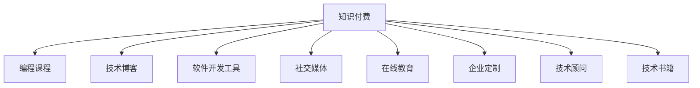

                 

# 程序员的知识付费收入多元化策略

> 关键词：知识付费, 多元化策略, 编程课程, 技术博客, 软件开发, 在线教育

## 1. 背景介绍

### 1.1 问题由来

在信息技术迅猛发展的今天，程序员已经成为各行各业不可或缺的人才。然而，许多程序员面临着收入相对较低、职业发展路径受限等问题。为了提高自身收入水平，许多程序员转向了知识付费领域，通过提供编程课程、技术博客、软件开发工具等专业知识，获取额外的收入。

### 1.2 问题核心关键点

知识付费的兴起，为程序员提供了新的收入渠道。但同时也面临着内容同质化严重、市场竞争激烈、用户忠诚度低等问题。因此，如何实现知识付费收入的多元化，成为程序员拓展收入来源的重要课题。

### 1.3 问题研究意义

实现知识付费收入多元化，不仅能提升程序员的经济收入，还能提升其行业影响力，拓宽职业发展空间。对社会而言，能够提升技术人才的整体素质，推动信息技术产业的持续发展。

## 2. 核心概念与联系

### 2.1 核心概念概述

为更好地理解程序员知识付费收入多元化的策略，本节将介绍几个密切相关的核心概念：

- 知识付费(Knowledge Pay)：指通过在线教育、技术博客、软件开发工具等平台，为用户提供专业知识，以获取货币收益的服务模式。
- 多元化收入(Multi-channel Revenue)：指通过多渠道、多方式获取收入，降低单一来源的风险，提升整体收益水平。
- 编程课程(Programming Courses)：针对不同层次用户提供的编程知识和技能培训，通过线上或线下方式进行传授。
- 技术博客(Technology Blog)：程序员通过技术博客分享编程心得、经验教训、新技术等，吸引用户访问并阅读，从中获取广告、赞助等收益。
- 软件开发工具(Developing Tools)：提供开发工具、模板、插件等，帮助用户提高编程效率，获取授权费用或销售收益。
- 社交媒体(Social Media)：通过社交平台进行技术交流、知识分享，增加品牌曝光，获取用户付费和打赏。
- 在线教育(Online Education)：通过视频、直播等方式，进行系统化、标准化的编程教学，获取付费课程订阅费和付费学习社区会员费。
- 企业定制(Enterprise Customization)：根据企业需求定制编程课程、技术解决方案，获取项目咨询费和技术服务费。
- 技术顾问(Technical Advisory)：提供企业级技术支持、项目评审、产品咨询等，获取顾问费和技术支持费。
- 技术书籍(Technology Books)：编写编程教材、技术手册等书籍，获取版税收入。

这些核心概念之间的逻辑关系可以通过以下Mermaid流程图来展示：



这个流程图展示了几大核心概念以及它们之间的联系，共同构成了程序员知识付费收入多元化的基本框架。

## 3. 核心算法原理 & 具体操作步骤
### 3.1 算法原理概述

知识付费收入多元化的核心思想是利用不同渠道、不同方式获取收入，从而降低单一来源的风险，提升整体收益水平。具体而言，就是通过多种形式的输出（如课程、博客、工具等），吸引不同的用户群体，并针对不同用户需求提供差异化的内容和服务，从而实现多元化的收入结构。

### 3.2 算法步骤详解

基于知识付费收入多元化的策略，可以按以下步骤进行具体操作：

**Step 1: 确定目标用户群体**
- 分析当前主流用户群体的特点，包括年龄、职业、需求等。
- 确定不同用户群体的知识付费需求，如初级开发者、中级开发者、企业IT部门等。

**Step 2: 设计内容和服务**
- 针对不同用户群体，设计符合其需求的课程、博客、工具等。
- 通过市场调研，了解用户对各类内容的兴趣和反馈，不断优化内容和形式。
- 采用敏捷开发方式，快速迭代产品，及时响应市场需求。

**Step 3: 推广与营销**
- 利用社交媒体、博客、论坛等渠道进行内容推广，扩大品牌影响力。
- 通过SEO优化、内容营销、付费广告等手段提升网站流量和用户访问量。
- 参加技术会议、行业展会、技术交流活动，增加曝光机会。

**Step 4: 多样化收入渠道**
- 建立付费课程、付费会员、广告、打赏、技术支持、咨询、书籍销售等多渠道收入模式。
- 根据用户需求和市场反馈，灵活调整各渠道的定价策略和优惠措施。
- 利用数据分析工具，监控各收入渠道的运营情况，及时调整优化策略。

**Step 5: 用户留存与忠诚度**
- 提供优质的课程内容、高效的技术支持、个性化的定制服务，提升用户满意度。
- 建立用户社区，增加用户间的互动和交流，增强用户粘性。
- 通过定期推送优质内容、定期举办技术活动、设立会员专属权益等措施，增强用户忠诚度。

### 3.3 算法优缺点

知识付费收入多元化的策略具有以下优点：
1. 降低风险：通过多渠道、多方式获取收入，降低单一来源的风险，提升整体收益水平。
2. 提升用户粘性：通过多样化服务，满足不同用户需求，增强用户粘性，提高用户留存率。
3. 增加市场曝光：通过多种推广渠道，提升品牌知名度，吸引更多潜在用户。
4. 优化收入结构：通过优化各收入渠道的定价和比例，实现收入最大化。

同时，该策略也存在一定的局限性：
1. 资源分散：多样化的服务需要投入大量资源进行设计和推广，可能影响单个服务的深度和广度。
2. 内容质量控制：不同渠道的内容需要保持一致性和质量，确保用户获得良好的体验。
3. 市场竞争激烈：知识付费领域竞争激烈，需要不断创新和优化，才能保持市场竞争力。
4. 用户需求多样：不同用户群体的需求差异大，需要灵活调整服务策略，才能满足不同用户需求。

尽管存在这些局限性，但就目前而言，知识付费收入多元化仍是大势所趋，程序员可以灵活运用多种策略，拓展自己的收入来源。

### 3.4 算法应用领域

知识付费收入多元化的策略，可以广泛应用于以下几个领域：

- 编程教育：提供不同层次的编程课程，如入门级、中级、高级课程，满足不同用户的学习需求。
- 技术博客：通过撰写技术文章，分享编程经验，吸引用户阅读和关注，并通过广告、赞助、会员费等方式获取收益。
- 软件开发工具：提供开发工具、模板、插件等，帮助用户提高编程效率，并通过授权费用、销售收益等方式获取收入。
- 在线教育：通过视频、直播等方式，提供系统化、标准化的编程教学，获取付费课程订阅费和付费学习社区会员费。
- 技术咨询：提供企业级技术支持、项目评审、产品咨询等，获取顾问费和技术支持费。
- 软件开发：为企业提供定制化软件开发服务，获取项目开发费用。
- 技术书籍：编写编程教材、技术手册等书籍，获取版税收入。
- 社交媒体：通过社交平台进行技术交流、知识分享，增加品牌曝光，获取用户付费和打赏。

这些领域的应用，使得程序员能够通过多种方式获取收入，实现收入来源的多元化和最大化。

## 4. 数学模型和公式 & 详细讲解
### 4.1 数学模型构建

本节将使用数学语言对程序员知识付费收入多元化的策略进行更加严格的刻画。

假设程序员的知识付费业务总收益为 $R$，各类收入渠道的总收益分别为 $R_1, R_2, \dots, R_n$。各类渠道的单位时间投入为 $C_1, C_2, \dots, C_n$，各类渠道的收入效率（单位时间收益）为 $E_1, E_2, \dots, E_n$。则总收益 $R$ 可以表示为：

$$
R = \sum_{i=1}^n R_i = \sum_{i=1}^n E_i \times C_i
$$

其中，$E_i = \frac{R_i}{C_i}$ 为第 $i$ 个渠道的收入效率。

### 4.2 公式推导过程

为了最大化总收益 $R$，我们需要最大化各个渠道的收入效率 $E_i$。这可以通过求解以下优化问题来实现：

$$
\max_{E_i} \sum_{i=1}^n E_i \times C_i \quad \text{subject to} \quad \sum_{i=1}^n R_i = R
$$

将 $E_i = \frac{R_i}{C_i}$ 代入上式，得：

$$
\max_{R_i, C_i} \sum_{i=1}^n \frac{R_i}{C_i} \times C_i \quad \text{subject to} \quad \sum_{i=1}^n R_i = R
$$

化简得：

$$
\max_{R_i, C_i} \sum_{i=1}^n R_i \quad \text{subject to} \quad \sum_{i=1}^n R_i = R
$$

这是一个典型的线性规划问题，可以通过求解线性规划模型来找到最优解。

### 4.3 案例分析与讲解

以某程序员通过在线教育、技术博客和软件开发工具三种方式获取收入为例，进行详细分析。

假设该程序员每月投入时间为 $C_1 = 10$ 小时、$C_2 = 5$ 小时、$C_3 = 3$ 小时，三种方式的单位时间收益分别为 $E_1 = 100$ 元/小时、$E_2 = 50$ 元/小时、$E_3 = 30$ 元/小时。则总收益 $R$ 可以表示为：

$$
R = R_1 + R_2 + R_3 = E_1 \times C_1 + E_2 \times C_2 + E_3 \times C_3
$$

代入具体数值：

$$
R = 100 \times 10 + 50 \times 5 + 30 \times 3 = 1300
$$

为了最大化总收益，我们需要优化三种方式的单位时间收益 $E_i$。假设每种方式实际投入时间分别为 $C_{i, \text{opt}}$，则最优总收益 $R_{\text{opt}}$ 可以通过求解线性规划问题得到：

$$
\max_{C_{i, \text{opt}}} \quad 100 \times C_{1, \text{opt}} + 50 \times C_{2, \text{opt}} + 30 \times C_{3, \text{opt}} \quad \text{subject to} \quad 100 \times C_{1, \text{opt}} + 50 \times C_{2, \text{opt}} + 30 \times C_{3, \text{opt}} = 1300
$$

通过求解该线性规划问题，可以得到最优分配方案，使得总收益最大化。

## 5. 项目实践：代码实例和详细解释说明
### 5.1 开发环境搭建

在进行知识付费收入多元化的实践前，我们需要准备好开发环境。以下是使用Python进行Flask开发的环境配置流程：

1. 安装Anaconda：从官网下载并安装Anaconda，用于创建独立的Python环境。

2. 创建并激活虚拟环境：
```bash
conda create -n pay-env python=3.8 
conda activate pay-env
```

3. 安装Flask：
```bash
pip install flask
```

4. 安装Flask-RESTful：
```bash
pip install flask-restful
```

5. 安装Flask-SQLAlchemy：
```bash
pip install flask-sqlalchemy
```

6. 安装SQLite：
```bash
pip install sqlite3
```

完成上述步骤后，即可在`pay-env`环境中开始知识付费收入多元化的开发实践。

### 5.2 源代码详细实现

这里我们以某程序员通过在线教育、技术博客和软件开发工具三种方式获取收入为例，给出使用Flask进行知识付费系统开发的Python代码实现。

首先，定义用户模型：

```python
from flask_sqlalchemy import SQLAlchemy

db = SQLAlchemy(app)

class User(db.Model):
    id = db.Column(db.Integer, primary_key=True)
    username = db.Column(db.String(64), unique=True)
    email = db.Column(db.String(64), unique=True)
    password = db.Column(db.String(128))
```

然后，定义课程模型：

```python
class Course(db.Model):
    id = db.Column(db.Integer, primary_key=True)
    title = db.Column(db.String(64))
    description = db.Column(db.Text)
    price = db.Column(db.Float)
```

接着，定义技术博客模型：

```python
class BlogPost(db.Model):
    id = db.Column(db.Integer, primary_key=True)
    title = db.Column(db.String(64))
    content = db.Column(db.Text)
    author = db.Column(db.Integer, db.ForeignKey('user.id'))
```

然后，定义软件开发工具模型：

```python
class DevelopmentTool(db.Model):
    id = db.Column(db.Integer, primary_key=True)
    name = db.Column(db.String(64))
    price = db.Column(db.Float)
    link = db.Column(db.String(128))
```

最后，定义用户注册、登录、购买等功能：

```python
@app.route('/register', methods=['GET', 'POST'])
def register():
    if request.method == 'POST':
        username = request.form['username']
        email = request.form['email']
        password = request.form['password']
        user = User(username=username, email=email, password=password)
        db.session.add(user)
        db.session.commit()
        return redirect(url_for('login'))
    return render_template('register.html')

@app.route('/login', methods=['GET', 'POST'])
def login():
    if request.method == 'POST':
        username = request.form['username']
        password = request.form['password']
        user = User.query.filter_by(username=username, password=password).first()
        if user:
            session['user_id'] = user.id
            return redirect(url_for('home'))
        return render_template('login.html')
    return render_template('login.html')

@app.route('/purchase', methods=['GET', 'POST'])
def purchase():
    if request.method == 'POST':
        course_id = request.form['course_id']
        user_id = session['user_id']
        course = Course.query.get(course_id)
        db.session.add(UserCourse(user_id=user_id, course_id=course_id))
        return redirect(url_for('home'))
    return render_template('purchase.html')

@app.route('/post', methods=['GET', 'POST'])
def post():
    if request.method == 'POST':
        title = request.form['title']
        content = request.form['content']
        user_id = session['user_id']
        post = BlogPost(title=title, content=content, author=user_id)
        db.session.add(post)
        db.session.commit()
        return redirect(url_for('home'))
    return render_template('post.html')
```

上述代码展示了使用Flask实现的知识付费系统的主要功能，包括用户注册、登录、购买课程、发布技术博客等。通过合理设计模型和接口，可以方便地扩展更多功能，如查看购买记录、获取用户评论、提供技术支持等。

### 5.3 代码解读与分析

让我们再详细解读一下关键代码的实现细节：

**User模型**：
- 定义了用户的基本信息，包括用户名、邮箱和密码。

**Course模型**：
- 定义了课程的基本信息，包括课程名称、描述和价格。

**BlogPost模型**：
- 定义了技术博客的基本信息，包括标题、内容和作者。

**DevelopmentTool模型**：
- 定义了软件开发工具的基本信息，包括名称、价格和链接。

**用户注册、登录、购买功能**：
- 通过Flask的路由机制，实现了用户注册、登录和购买课程的功能。
- 使用SQLAlchemy对数据库进行CRUD操作，简化了开发复杂度。
- 使用Session机制保存用户登录状态，提升了用户体验。
- 通过表单验证和重定向，确保了数据的安全性和完整性。

**技术博客发布功能**：
- 通过Flask的路由机制，实现了技术博客的发布功能。
- 使用SQLAlchemy对数据库进行CRUD操作，确保了数据的持久化。
- 通过表单验证和重定向，确保了数据的完整性和安全性。

通过以上代码实现，我们可以看到Flask和SQLAlchemy等工具的强大功能，使得知识付费系统的开发变得更加高效便捷。开发者可以借助这些工具，快速构建出具有丰富功能的服务，为用户提供优质的知识付费体验。

## 6. 实际应用场景
### 6.1 智能客服系统

知识付费的多元化收入策略，可以广泛应用于智能客服系统的构建。传统客服往往需要配备大量人力，高峰期响应缓慢，且一致性和专业性难以保证。通过提供系统的客服课程、技术博客和软件开发工具，帮助客户快速提升客服能力，实现智能化、自动化和个性化服务。

在技术实现上，可以设计一套全面的客服课程，从基础操作到高级技巧，涵盖各种常见问题和场景。通过技术博客，分享客户服务的经验教训和最佳实践，帮助客户提高服务质量。同时提供一些高效的客服工具，如自动化响应系统、智能问答系统等，提高客户满意度。通过这些多样化服务，客户可以在知识付费平台上获取完整的客服解决方案，提升客户服务水平。

### 6.2 金融教育

金融教育是知识付费的重要应用领域。通过提供系统的金融课程、技术博客和金融工具，帮助用户掌握金融知识，提升投资决策能力。具体而言，可以设计一系列金融课程，涵盖股票、基金、外汇、债券等多个领域。通过技术博客，分享金融市场的最新动态、投资策略和案例分析。同时提供一些金融工具，如数据分析工具、投资模拟软件等，帮助用户实践和验证金融知识。通过这些多样化服务，用户可以在知识付费平台上获得全面的金融教育，提升自身的金融素养和投资能力。

### 6.3 健康管理

健康管理是知识付费的又一重要应用领域。通过提供系统的健康课程、技术博客和健康工具，帮助用户掌握健康知识，提升健康管理能力。具体而言，可以设计一系列健康课程，涵盖饮食、运动、心理等多个方面。通过技术博客，分享健康管理的最佳实践和常见问题。同时提供一些健康工具，如饮食计划生成器、运动指导软件等，帮助用户制定个性化的健康管理方案。通过这些多样化服务，用户可以在知识付费平台上获得全面的健康教育，提升自身的健康水平。

### 6.4 未来应用展望

随着知识付费市场的不断成熟，知识付费收入多元化的策略将得到更广泛的应用。未来的知识付费平台将不仅仅局限于课程和博客，还将拓展到更多领域，如企业培训、技术咨询、软件开发、技术书籍等。通过多元化收入策略，程序员可以更好地拓展自身的职业发展空间，提升经济收入和社会影响力。

## 7. 工具和资源推荐
### 7.1 学习资源推荐

为了帮助程序员系统掌握知识付费收入多元化的理论基础和实践技巧，这里推荐一些优质的学习资源：

1. Udemy《知识付费业务实战》课程：由资深知识付费从业者讲解，深入浅出地介绍了知识付费的业务模式、市场分析、运营策略等。

2. Coursera《在线教育平台设计与运营》课程：由斯坦福大学、北京大学等名校教授讲解，系统介绍了在线教育的平台设计、运营管理、技术架构等。

3. 《知识付费的商业模型与运营策略》书籍：详细讲解了知识付费的商业模式、运营策略、用户需求分析等，适合了解知识付费的宏观战略。

4. 《知识付费平台技术架构》书籍：介绍了知识付费平台的技术架构、开发流程、部署优化等，适合技术实践者参考。

5. 《知识付费的社交化运营》博客：由知识付费平台的运营专家撰写，分享了知识付费的社交化运营策略、用户互动方式、社区管理等。

通过对这些资源的学习实践，相信你一定能够快速掌握知识付费收入多元化的精髓，并用于解决实际的NLP问题。

### 7.2 开发工具推荐

高效的开发离不开优秀的工具支持。以下是几款用于知识付费收入多元化的开发工具：

1. Flask：轻量级Web框架，简单易用，适合快速开发知识付费平台。

2. SQLAlchemy：Python ORM框架，支持多种数据库，方便进行数据库操作。

3. Elasticsearch：高效的全文搜索引擎，适合存储和搜索大量的用户数据和课程内容。

4. Redis：高效的数据缓存系统，适合处理高频的数据查询和用户请求。

5. Gunicorn：Python Web服务器，支持并发处理，适合高并发应用。

6. Docker：容器化技术，方便应用部署和运行。

合理利用这些工具，可以显著提升知识付费收入多元化的开发效率，加快创新迭代的步伐。

### 7.3 相关论文推荐

知识付费收入多元化的研究源于学界的持续研究。以下是几篇奠基性的相关论文，推荐阅读：

1. 《在线教育平台的可持续发展》（Journal of Online Teaching and Distance Learning）：探讨了在线教育平台的可持续发展策略，介绍了知识付费的多元化收入模型。

2. 《知识付费业务模式分析》（Business Research）：通过分析知识付费平台的业务模式，提出了多种收入多元化策略，并进行了案例研究。

3. 《知识付费平台的运营管理》（International Journal of E-Learning and Digital Publishing）：详细介绍了知识付费平台的运营管理策略，包括用户留存、内容推荐、广告投放等。

4. 《知识付费平台的个性化推荐》（IEEE Transactions on Knowledge and Data Engineering）：通过个性化推荐算法，提升知识付费平台的用户体验和满意度。

5. 《知识付费平台的社交化运营》（Proceedings of the ACM Conference on Electronic Commerce）：探讨了知识付费平台的社交化运营策略，介绍了社区管理、用户互动等方法。

这些论文代表了大语言模型微调技术的发展脉络。通过学习这些前沿成果，可以帮助研究者把握学科前进方向，激发更多的创新灵感。

## 8. 总结：未来发展趋势与挑战
### 8.1 总结

本文对知识付费收入多元化的策略进行了全面系统的介绍。首先阐述了知识付费的兴起背景和重要意义，明确了收入多元化的基本思路。其次，从原理到实践，详细讲解了知识付费收入多元化的数学模型和关键步骤，给出了知识付费系统开发的完整代码实例。同时，本文还广泛探讨了知识付费在智能客服、金融教育、健康管理等多个行业领域的应用前景，展示了知识付费范式的广泛价值。此外，本文精选了知识付费技术的各类学习资源，力求为读者提供全方位的技术指引。

通过本文的系统梳理，可以看到，知识付费收入多元化策略在大数据时代具有广阔的应用前景，为程序员拓展收入来源提供了重要参考。未来，伴随知识付费市场的不断成熟，知识付费收入多元化将成为程序员收入增长的重要途径。

### 8.2 未来发展趋势

展望未来，知识付费收入多元化将呈现以下几个发展趋势：

1. 市场细分：随着用户需求的多样化，知识付费市场将进一步细分，提供更多细分领域的服务。
2. 内容创新：通过个性化推荐、知识图谱、大数据分析等技术，不断推出创新性课程和内容，提升用户粘性。
3. 技术融合：知识付费将与其他技术如区块链、人工智能、大数据等进行深度融合，提升服务质量。
4. 国际市场拓展：随着全球化趋势的加深，知识付费市场将拓展到更多国际市场，提升全球用户覆盖率。
5. 精准营销：通过精准用户画像、个性化推荐、社区互动等手段，提升营销效果和用户转化率。
6. 跨界合作：与企业、高校、行业协会等机构进行合作，提供定制化解决方案，提升市场影响力。
7. 内容付费：从订阅模式向内容付费模式转变，提升单次付费收益，优化收入结构。
8. 社交互动：通过社交平台、知识社区等形式，增加用户互动，提升用户参与度和满意度。
9. 企业定制：为企业提供定制化解决方案，提升企业级市场份额，增加高价值收入。

这些趋势凸显了知识付费收入多元化的广阔前景。这些方向的探索发展，必将进一步提升知识付费平台的收入和影响力，为程序员提供更多元化的收入来源。

### 8.3 面临的挑战

尽管知识付费收入多元化具有广阔的发展前景，但在实现过程中仍面临着诸多挑战：

1. 内容质量控制：多样化服务需要保持高质量内容输出，避免同质化和低质量内容。
2. 市场竞争激烈：知识付费市场竞争激烈，需要不断创新和优化，才能保持市场竞争力。
3. 用户需求多样：不同用户群体的需求差异大，需要灵活调整服务策略，才能满足不同用户需求。
4. 运营成本高：知识付费平台的运营成本较高，需要有效的成本控制和盈利模式。
5. 用户留存困难：用户流失率高，需要不断优化用户体验和运营策略，提升用户粘性。
6. 技术门槛高：知识付费平台的技术实现复杂，需要较高的技术积累和团队实力。
7. 法律风险：知识付费市场存在法律风险，需要合规经营，避免侵权和版权纠纷。
8. 数据隐私问题：用户数据的隐私保护问题，需要严格的数据保护措施。

这些挑战需要在实践中不断应对和解决，才能实现知识付费收入多元化的长期可持续性。

### 8.4 研究展望

面对知识付费收入多元化的挑战，未来的研究需要在以下几个方面寻求新的突破：

1. 内容创新技术：开发创新性课程和内容，提升用户粘性和满意度。
2. 个性化推荐算法：提升个性化推荐效果，优化用户推荐内容。
3. 社交互动机制：设计合理的社交互动机制，增加用户参与度和互动性。
4. 用户画像分析：通过数据分析技术，构建精准用户画像，提升运营效果。
5. 社区管理策略：设计有效的社区管理策略，提升社区活跃度和用户粘性。
6. 技术架构优化：优化知识付费平台的技术架构，提升系统的稳定性和可扩展性。
7. 盈利模式创新：探索新的盈利模式，提升平台整体收益水平。
8. 法律合规管理：完善法律合规管理措施，避免法律风险。
9. 用户隐私保护：制定严格的数据隐私保护措施，保障用户隐私。

这些研究方向的研究突破，必将引领知识付费收入多元化技术的发展，为知识付费平台带来更多的创新和活力。面向未来，知识付费收入多元化技术需要与其他人工智能技术进行更深入的融合，如知识表示、因果推理、强化学习等，多路径协同发力，共同推动知识付费平台的进步。

## 9. 附录：常见问题与解答

**Q1：知识付费的盈利模式有哪些？**

A: 知识付费的盈利模式主要包括以下几种：

1. 课程订阅费：用户购买课程，获得系统化、标准化的学习内容，按月或按年支付订阅费。
2. 单次购买：用户一次性购买特定课程或内容，无需支付订阅费。
3. 广告收入：通过在线广告系统，向用户展示商业广告，获取广告收入。
4. 会员费：用户加入付费会员，享受更多的增值服务和特权，按月或按年支付会员费。
5. 打赏和赞助：用户通过付费打赏、企业赞助等方式，支持创作者和平台，获取一定比例的分成。
6. 技术服务费：为企业客户提供技术解决方案、定制开发等服务，收取技术服务费。
7. 书籍销售：编写技术书籍、教程等，通过图书出版社或电商平台销售，获取版税收入。
8. 咨询和培训：提供企业级技术咨询、培训等服务，收取咨询和培训费用。

**Q2：如何设计有效的课程内容？**

A: 设计有效的课程内容需要考虑以下几个方面：

1. 用户需求：深入分析用户需求，设计符合用户需求的内容。
2. 目标明确：课程目标明确，能够帮助用户解决实际问题。
3. 内容充实：课程内容充实，包括基础知识、案例分析、实践操作等。
4. 互动性强：通过讨论、问答、作业等形式，增加互动性，提升学习效果。
5. 多样化形式：采用视频、PPT、文档等多种形式，满足不同用户的学习偏好。
6. 持续更新：课程内容持续更新，保持新鲜度，提升用户粘性。
7. 专家参与：邀请行业专家参与课程设计，提升课程权威性和实用性。
8. 反馈机制：建立用户反馈机制，及时了解用户需求和课程效果，不断优化课程内容。

**Q3：知识付费平台如何提高用户留存率？**

A: 提高用户留存率需要采取多种措施：

1. 提供优质课程：课程内容优质，满足用户需求，提升用户满意度。
2. 定期推送优质内容：通过邮件、社交平台等方式，定期推送优质课程和学习资源，提升用户参与度。
3. 用户互动：建立社区、论坛等互动平台，增加用户之间的交流和互动，提升用户粘性。
4. 个性化推荐：通过数据分析，推荐符合用户兴趣和需求的课程，提升用户粘性。
5. 用户激励：通过积分、勋章、排行榜等方式，激励用户积极参与学习，提升用户留存率。
6. 技术支持：提供高效的技术支持，帮助用户解决学习中的问题，提升用户满意度。
7. 用户反馈：建立用户反馈机制，及时了解用户需求和课程效果，不断优化课程内容和运营策略。
8. 持续优化：不断优化平台功能和服务，提升用户体验和满意度。

通过以上措施，可以有效提高知识付费平台的用户留存率，提升平台整体运营效果。

**Q4：知识付费平台如何提高用户转化率？**

A: 提高用户转化率需要采取多种措施：

1. 精准营销：通过精准用户画像和个性化推荐，提高用户转化率。
2. 数据分析：通过数据分析技术，挖掘用户需求和行为特征，优化营销策略。
3. 用户体验：提升用户体验，增加用户信任感和满意度，提升转化率。
4. 内容优化：优化课程内容和形式，提升用户体验和满意度，增加转化率。
5. 用户激励：通过积分、勋章、排行榜等方式，激励用户积极参与学习，提升转化率。
6. 广告投放：通过精准广告投放，提升平台曝光率和用户转化率。
7. 社交互动：通过社交平台、知识社区等形式，增加用户互动，提升用户转化率。
8. 用户反馈：建立用户反馈机制，及时了解用户需求和课程效果，优化课程内容和运营策略，提升转化率。

通过以上措施，可以有效提高知识付费平台的用户转化率，提升平台整体运营效果。

---

作者：禅与计算机程序设计艺术 / Zen and the Art of Computer Programming

