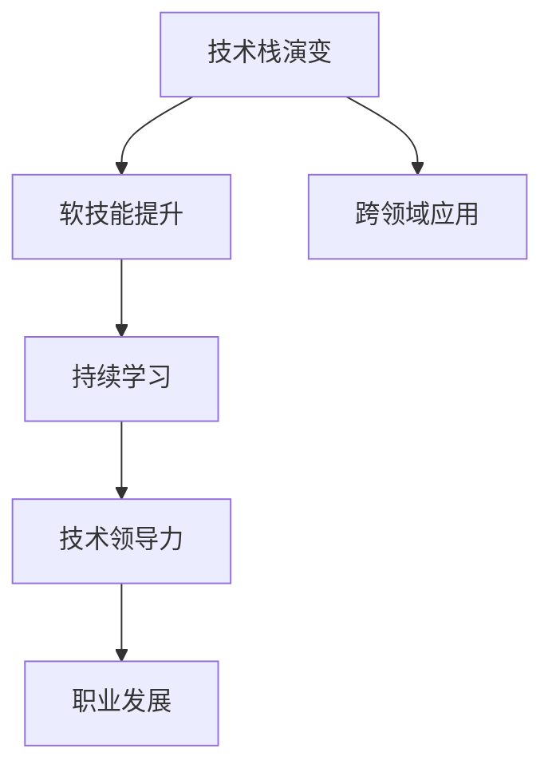

                 

# 程序员的职业生涯规划：30年路线图

> 关键词：
    1. 职业生涯规划
    2. 程序员发展路线
    3. 技术栈演变
    4. 软技能提升
    5. 持续学习
    6. 跨领域应用
    7. 技术领导力

## 1. 背景介绍

### 1.1 问题由来

在快速变化的技术环境中，程序员的职业生涯规划变得更加复杂和多变。技术的不断演进要求从业者不仅需要掌握最新的编程语言和工具，还需要持续学习和适应新的行业趋势。同时，随着人工智能、大数据等新兴技术的发展，程序员的技能需求也正在发生深刻的变化。

### 1.2 问题核心关键点

程序员的职业生涯规划需要考虑技术栈的演变、软技能的提升、持续学习和跨领域应用等多个方面。在技术快速发展的背景下，制定一份有前瞻性和实际可行性的职业路线图，成为每位程序员的必修课。本文旨在为读者提供一个系统的、涵盖30年的程序员职业路线图，帮助他们在技术洪流中找到自己的定位和方向。

## 2. 核心概念与联系

### 2.1 核心概念概述

在程序员的职业生涯规划中，需要明确以下几个核心概念及其相互关系：

1. **技术栈演变**：指随着技术趋势的改变，程序员所需掌握的技术和工具集也会相应地变化。从早期的C语言、C++到现代的JavaScript、Python、Go等，技术栈的演变直接影响着程序员的职业路径。

2. **软技能提升**：包括沟通能力、团队协作、时间管理、问题解决等非技术能力。这些软技能对于团队合作和项目管理至关重要，是职业发展的关键因素。

3. **持续学习**：程序员需要不断学习新技术、新工具和新方法，保持技术栈的更新和扩展。持续学习是应对技术变化、保持竞争力的必备条件。

4. **跨领域应用**：程序员需要具备跨领域的思维和能力，能够将所学技术应用于不同行业和场景中。例如，将算法应用于金融、医疗、教育等领域的实践。

5. **技术领导力**：除了技术技能，成为一名优秀的技术领导还需要具备战略思考、团队管理、项目管理等领导力技能。技术领导力是职业发展的高级阶段。

这些概念之间的逻辑关系可以通过以下Mermaid流程图来展示：



这个流程图展示了几大核心概念之间的相互关系：

1. 技术栈演变是职业发展的基石。
2. 软技能提升和持续学习是职业发展的两个重要维度。
3. 跨领域应用是技术应用广度的体现。
4. 技术领导力是职业发展的高级阶段。

## 3. 核心算法原理 & 具体操作步骤

### 3.1 算法原理概述

程序员的职业生涯规划，本质上是一个基于目标和路径规划的问题。其核心算法原理包括以下几个方面：

1. **目标设定**：明确职业目标，包括短期目标和长期目标，例如成为某个技术领域的专家、项目负责人或技术领导者。

2. **路径规划**：根据目标选择合适的技术栈和技能提升路径，制定详细的学习计划和时间表。

3. **评估反馈**：定期评估进度和效果，根据反馈调整路线图。

4. **灵活调整**：保持路线图灵活性，适应技术趋势和市场需求的变化。

### 3.2 算法步骤详解

基于上述原理，程序员的职业生涯规划可以分为以下四个步骤：

**Step 1: 目标设定**

- 确定短期目标（1-2年）：例如掌握一种新语言、完成某个项目等。
- 确定长期目标（5-10年）：例如成为某领域的专家、领导一个团队等。

**Step 2: 路径规划**

- 根据目标选择所需掌握的技术栈和软技能。
- 制定详细的学习计划，包括学习资源、时间安排、评估标准等。
- 分阶段实施学习计划，例如先掌握基础知识，再深入学习高级应用。

**Step 3: 评估反馈**

- 定期评估学习进度和效果，例如通过项目成果、技术测试等。
- 根据评估结果调整学习计划，例如调整学习速度、增加学习内容等。

**Step 4: 灵活调整**

- 保持对技术趋势和市场需求变化的敏感性。
- 适时调整职业路线图，适应新的技术和市场需求。

### 3.3 算法优缺点

基于目标和路径规划的算法具有以下优点：

1. **系统性**：通过明确目标和规划路径，使职业生涯规划更具系统性和可操作性。
2. **可量化**：通过设定短期和长期目标，可以更清晰地评估进展和效果。
3. **灵活性**：路线图设计上保留了一定的灵活性，适应技术和市场变化。

同时，该算法也存在以下局限性：

1. **主观性强**：目标和路径的设定可能受个人主观意愿影响。
2. **适应性差**：对于技术变化快、市场需求多变的领域，路线图可能需要频繁调整。
3. **执行难度大**：持续学习和高强度工作可能给个人带来压力。

### 3.4 算法应用领域

程序员的职业生涯规划方法，在软件工程、人工智能、大数据等技术密集型领域具有广泛应用。例如，软件工程师需要掌握多种编程语言和框架，数据科学家需要具备数据处理、算法设计和模型训练等技能。通过系统化的职业生涯规划，程序员能够更好地适应技术变化，提升职业竞争力。

## 4. 数学模型和公式 & 详细讲解 & 举例说明

### 4.1 数学模型构建

程序员的职业发展可以建模为一个动态规划问题，其中状态表示当前技术栈和软技能的掌握程度，动作表示学习新技能或应用新技术，奖励表示职业发展的效果。模型的目标是最大化最终的奖励，即达到设定的职业目标。

### 4.2 公式推导过程

设 $S_t$ 表示第 $t$ 阶段的技术栈和软技能掌握程度，$A_t$ 表示可采取的动作集合，$R_t$ 表示第 $t$ 阶段的学习效果。状态转移和奖励的公式为：

$$
S_{t+1} = f(S_t, A_t, R_t)
$$

$$
R_{t+1} = g(S_t, A_t, R_t)
$$

其中 $f$ 和 $g$ 分别表示状态转移函数和奖励函数。

### 4.3 案例分析与讲解

假设某程序员当前掌握的语言为C++，软技能为基本沟通能力和团队协作。他希望在3年内成为全栈开发工程师，因此制定了以下职业路线图：

- 第1年：掌握JavaScript和React。
- 第2年：学习后端开发，掌握Node.js和Django。
- 第3年：提升软技能，完成全栈项目。

根据上述路线图，可以构建状态和动作的动态规划模型，通过迭代计算，评估每个阶段的职业发展效果，最终达到目标。

## 5. 项目实践：代码实例和详细解释说明

### 5.1 开发环境搭建

要实现程序员职业路线图的自动化管理，需要搭建一个能够支持持续学习和评估反馈的开发环境。以下是一个基本配置：

- 环境：Linux系统，使用Docker容器化部署。
- 开发工具：Jupyter Notebook，Git，Docker。
- 学习资源：Coursera、Udacity、LeetCode等在线学习平台。
- 评估工具：GitHub，GitLab等版本控制系统。

### 5.2 源代码详细实现

以下是Python实现的简要代码示例：

```python
class CareerPlanner:
    def __init__(self, target, skills, timeline):
        self.target = target
        self.skills = skills
        self.timeline = timeline
        self.learning_plan = {}

    def set_learning_plan(self, skill, year):
        self.learning_plan[year] = skill

    def simulate_learning(self):
        current_skill = {}
        for year in range(1, len(self.timeline) + 1):
            if year in self.learning_plan:
                current_skill[self.skills[self.learning_plan[year]]] = True
            current_skill.update(current_skill)
            print(f"Year {year}: Current skills: {current_skill}")
        
    def evaluate_effectiveness(self):
        effectiveness = 0
        for year in range(1, len(self.timeline) + 1):
            if year in self.learning_plan:
                effectiveness += self.effectiveness_matrix[year][self.skills[self.learning_plan[year]]]
        return effectiveness

# 示例使用
planner = CareerPlanner("Full Stack Developer", ["JavaScript", "React", "Node.js", "Django"], [1, 2, 3])
planner.set_learning_plan("JavaScript", 1)
planner.set_learning_plan("React", 1)
planner.set_learning_plan("Node.js", 2)
planner.set_learning_plan("Django", 2)
planner.simulate_learning()
effectiveness = planner.evaluate_effectiveness()
print(f"Overall effectiveness: {effectiveness}")
```

### 5.3 代码解读与分析

上述代码定义了一个 `CareerPlanner` 类，用于管理程序员的职业规划和学习计划。通过 `set_learning_plan` 方法，程序员可以设定每个阶段需要掌握的技能。`simulate_learning` 方法模拟学习过程，并在每个阶段输出当前掌握的技能。`evaluate_effectiveness` 方法计算整体职业发展效果。

## 6. 实际应用场景

### 6.1 技术转型

对于希望转型到新领域的程序员，职业规划尤为重要。通过明确目标和制定详细的学习计划，可以显著提高转型的成功率。例如，一名C++开发者希望转型为数据科学家，需要掌握Python、R语言、数据分析和机器学习等技能。制定详细的学习路径和时间表，可以更好地适应新领域的挑战。

### 6.2 项目管理

在软件开发团队中，项目管理是一个复杂的任务。通过系统化的职业规划，可以更好地分配团队成员的角色和任务，提升团队效率和项目成功率。例如，针对某个复杂的系统开发项目，可以制定各成员的学习和技能提升计划，确保团队整体技术水平的提升。

### 6.3 技术领导力培养

成为技术领导者不仅是技术上的挑战，还需要具备领导和管理能力。通过持续学习和职业规划，可以在技术积累的基础上，进一步提升领导力和影响力。例如，一名高级开发工程师希望成为技术主管，可以通过学习团队管理、项目规划等软技能，逐步成长为技术领导者。

## 7. 工具和资源推荐

### 7.1 学习资源推荐

1. **在线课程**：
   - Coursera：提供来自世界顶尖大学和机构的在线课程，涵盖计算机科学、数据科学、人工智能等方向。
   - Udacity：提供项目导向的纳米学位课程，注重实践能力的培养。
   - edX：提供高质量的在线课程，涵盖多个技术领域。

2. **学习平台**：
   - LeetCode：提供算法和数据结构练习题库，提升编程能力和解决问题的能力。
   - HackerRank：提供编程挑战和竞赛，提升编程技巧和思维能力。
   - Codecademy：提供互动式编程课程，适合初学者入门。

### 7.2 开发工具推荐

1. **编程语言和框架**：
   - Python：功能强大、生态丰富的语言，广泛应用于数据科学、人工智能等方向。
   - JavaScript/TypeScript：全栈开发的首选语言，广泛用于Web开发和移动应用开发。
   - Java/Scala：适用于企业级应用和大数据处理。

2. **开发环境**：
   - VS Code：轻量级、功能强大的编辑器，支持多种编程语言和插件。
   - IntelliJ IDEA：功能丰富的集成开发环境，适合Java开发。
   - Sublime Text：轻量级文本编辑器，支持多种编程语言。

### 7.3 相关论文推荐

1. **职业发展理论**：
   - "Career Development and the Emergence of Leadership" by Robert E. Lent, Linda L. Brown, & Gary L. Hackett：探讨职业生涯发展的理论基础和实践方法。
   - "The Leadership Challenge" by James Kouzes & Barry Posner：提供领导力发展的实践指导和案例分析。

2. **技术趋势研究**：
   - "The Future of Software Development" by Nassim Nicholas Taleb：探讨软件发展和技术趋势的预测和应对策略。
   - "The Second Machine Age: Work, Progress, and Prosperity in a Time of Brilliant Technologies" by Erik Brynjolfsson & Andrew McAfee：分析技术变革对就业和社会的深远影响。

## 8. 总结：未来发展趋势与挑战

### 8.1 研究成果总结

程序员的职业规划方法已经广泛应用于软件开发、数据科学、人工智能等领域，帮助从业者系统性地提升技术能力和职业素养。通过目标设定、路径规划、持续学习等关键环节，程序员能够更好地适应技术变化和市场需求。

### 8.2 未来发展趋势

1. **技术融合**：随着人工智能、大数据、云计算等技术的快速发展，程序员需要具备跨领域的技术融合能力，能够在多个技术领域协同工作。
2. **自动化和AI辅助**：自动化和AI技术的应用，将显著提升编程效率和代码质量。例如，AI辅助的代码重构、自动化测试等工具将广泛应用。
3. **远程协作**：远程工作和协作成为常态，程序员需要具备远程协作和项目管理的能力。例如，使用Git等版本控制工具进行远程协作。

### 8.3 面临的挑战

1. **技术更新快**：技术的快速迭代要求程序员不断学习和适应，可能带来较大的工作压力。
2. **技能要求高**：跨领域应用和领导力提升需要综合的技能，对个人能力提出了更高的要求。
3. **市场需求变化**：技术市场需求变化快，需要程序员具备灵活调整和快速学习的能力。

### 8.4 研究展望

未来的研究将聚焦于以下几个方向：

1. **自动化编程辅助**：开发更智能的自动化编程工具，提升编程效率和代码质量。
2. **跨领域技能模型**：构建跨领域的技能模型，帮助程序员更好地理解和应用多领域技术。
3. **领导力提升**：研究领导力提升的方法和工具，提升技术领导者的管理能力和团队协作能力。

总之，程序员的职业生涯规划是一个复杂而动态的过程，需要系统化的规划和管理。通过明确目标、制定详细的学习计划和持续评估反馈，程序员能够更好地适应技术变化和市场需求，实现职业发展。

## 9. 附录：常见问题与解答

**Q1: 如何制定一个合理的职业规划？**

A: 制定职业规划时，需要考虑以下步骤：
1. 明确职业目标：包括短期和长期目标。
2. 评估当前技能：了解自己已掌握的技术和软技能。
3. 确定技能差距：分析实现目标所需的技能和知识。
4. 制定学习计划：规划学习内容和时间表。
5. 定期评估反馈：根据进展调整学习计划。

**Q2: 学习新技术时，如何平衡时间和精力？**

A: 平衡学习和工作的关键是制定合理的学习计划和时间管理：
1. 设定学习优先级：根据职业目标和需求，确定需要优先学习的内容。
2. 利用碎片时间：利用通勤、休息等碎片时间进行学习，例如听音频课程或阅读技术文章。
3. 定期复习和实践：通过复习和实践巩固所学知识，保持长期记忆。
4. 设置合理的学习目标：将大目标分解为小目标，逐步实现。

**Q3: 如何提升软技能？**

A: 提升软技能需要系统性的训练和实践：
1. 参加相关课程和培训：例如沟通技巧、团队管理等。
2. 实践应用：在工作中积极参与团队协作和项目管理，积累经验。
3. 反思和改进：通过自我反思和他人反馈，不断改进和提升。

**Q4: 如何应对技术变化和市场需求？**

A: 应对技术变化和市场需求，需要具备以下能力：
1. 持续学习：保持对新技术和新趋势的关注和研究。
2. 灵活调整：根据市场需求变化，及时调整学习计划和职业目标。
3. 跨领域应用：掌握多种技术和领域知识，具备跨领域的思维和能力。

**Q5: 如何培养技术领导力？**

A: 培养技术领导力需要综合提升技术和管理能力：
1. 学习领导力理论：例如阅读领导力书籍、参加领导力培训。
2. 实践领导力技能：通过项目管理和团队协作实践领导力技能。
3. 寻求导师指导：找到有经验的导师，提供指导和反馈。

通过系统化的职业生涯规划和学习实践，程序员可以更好地适应技术变化和市场需求，实现职业发展和技术进步。希望本文能为读者提供有益的指导和参考，助力他们在职业生涯中取得更大的成功。

---

作者：禅与计算机程序设计艺术 / Zen and the Art of Computer Programming

