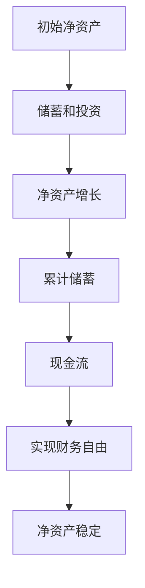

                 

# 程序员的财务自由计算器

## 1. 背景介绍

### 1.1 问题由来

程序员作为技术领域的核心人才，其薪酬待遇一直备受关注。然而，在高薪背后，程序员面临的财务压力也逐渐显现。如何实现财务自由，摆脱打工族的束缚，成为许多程序员关注的焦点。为此，本文将介绍一款程序员专用的财务自由计算器，帮助程序员计算实现财务自由所需的时间和投资策略。

### 1.2 问题核心关键点

本文聚焦于程序员财务自由计算器的开发。财务自由计算器是一款简单易用的工具，旨在通过计算不同储蓄率和投资收益率下的总资产增长，帮助用户制定实现财务自由的策略。

### 1.3 问题研究意义

开发程序员财务自由计算器，对程序员的生活和工作有重要意义：

1. **提升财务意识**：帮助程序员更好地了解自己的财务状况，做出更明智的投资决策。
2. **优化储蓄策略**：提供多种储蓄和投资组合，帮助程序员找到最适合自己的财务规划。
3. **减轻心理压力**：通过计算实现财务自由的时间，帮助程序员减轻对未来的不确定性和焦虑感。
4. **提高生活品质**：财务自由意味着无需再为金钱而工作，可以追求更高的生活质量，实现工作和生活的平衡。

## 2. 核心概念与联系

### 2.1 核心概念概述

为更好地理解程序员财务自由计算器的开发过程，本节将介绍几个关键概念：

- **财务自由**：指在不工作的情况下，仍能维持现有生活水平，且无需再为金钱而工作。
- **现金流**：指收入与支出之差，即现金的流入与流出。
- **净资产**：指总资产减去总负债的余额。
- **储蓄率**：指储蓄额占总可支配收入的比例。
- **投资收益率**：指投资收益与本金之比。
- **复利**：指利息按初始本金加上累计利息计算，即利滚利。

这些概念之间存在紧密的联系，共同构成了财务自由的基本框架。通过合理的储蓄和投资，可以有效提升净资产，最终实现财务自由。

### 2.2 核心概念原理和架构的 Mermaid 流程图



这个流程图展示了财务自由的基本逻辑：从初始净资产开始，通过储蓄和投资，净资产不断增长，累计储蓄增加，现金流稳定，最终实现财务自由，保持净资产的稳定。

## 3. 核心算法原理 & 具体操作步骤

### 3.1 算法原理概述

程序员财务自由计算器主要基于以下算法原理：

1. **复利公式**：用于计算投资收益的增长。
2. **净资产增长公式**：用于计算净资产随时间的变化。
3. **现金流计算**：用于计算每年可用于投资的现金流。
4. **财务自由判定**：用于计算实现财务自由所需的时间。

### 3.2 算法步骤详解

#### 3.2.1 输入参数

- **初始净资产**：程序员当前的净资产总额。
- **储蓄率**：程序员每月的储蓄占总可支配收入的比例。
- **投资收益率**：程序员投资的年化收益率。
- **预期每年支出**：程序员每年的生活开销。
- **预期每年收入增长率**：程序员的收入增长率。

#### 3.2.2 计算过程

1. **计算每年储蓄金额**：
   $$
   \text{每年储蓄金额} = \text{总可支配收入} \times \text{储蓄率}
   $$

2. **计算每年投资收益**：
   $$
   \text{每年投资收益} = \text{每年储蓄金额} \times \text{投资收益率}
   $$

3. **计算每年净资产增长**：
   $$
   \text{每年净资产增长} = \text{每年投资收益} + \text{每年储蓄金额}
   $$

4. **计算累计储蓄**：
   $$
   \text{累计储蓄} = \text{初始净资产} + \text{每年净资产增长} \times \text{年数}
   $$

5. **计算累计投资收益**：
   $$
   \text{累计投资收益} = \text{每年投资收益} \times (\text{年数} - 1)
   $$

6. **计算累计净资产**：
   $$
   \text{累计净资产} = \text{累计储蓄} + \text{累计投资收益}
   $$

7. **计算累计现金流**：
   $$
   \text{累计现金流} = \text{初始净资产} + \text{累计净资产} - \text{预期每年支出} \times \text{年数}
   $$

8. **计算实现财务自由的时间**：
   $$
   \text{实现财务自由的时间} = \frac{\text{预期每年支出}}{\text{累计现金流}}
   $$

### 3.3 算法优缺点

#### 3.3.1 优点

- **简单易用**：算法步骤明确，代码实现简单，容易理解和操作。
- **适用范围广**：适用于各类储蓄和投资场景，适用于不同职业和生活水平的程序员。
- **可视化展示**：通过图表展示净资产增长和现金流变化，直观展示财务自由实现过程。

#### 3.3.2 缺点

- **简化假设**：算法假设每年支出和收入增长率不变，实际情况可能更复杂。
- **不考虑通胀**：算法未考虑通货膨胀对储蓄和投资的影响，长期影响可能较大。
- **未考虑非现金收入**：算法未考虑非现金收入（如股票分红、租金等），影响计算结果。

### 3.4 算法应用领域

程序员财务自由计算器可以应用于以下场景：

- **职业规划**：帮助程序员制定职业发展计划，规划储蓄和投资策略，实现财务自由。
- **理财工具**：作为程序员的个人理财工具，提供投资和储蓄建议，提升财务素养。
- **教育培训**：作为财务规划和投资的培训工具，帮助更多人理解财务自由的意义和方法。
- **财务咨询**：作为财务咨询师的工具，提供专业的财务规划和投资建议。

## 4. 数学模型和公式 & 详细讲解 & 举例说明

### 4.1 数学模型构建

本节将使用数学语言对程序员财务自由计算器的模型进行详细构建。

设初始净资产为 $A_0$，每年储蓄金额为 $S$，每年投资收益率为 $r$，预期每年支出为 $C$，预期每年收入增长率为 $g$。

1. **每年储蓄金额**：
   $$
   S = \text{总可支配收入} \times \text{储蓄率}
   $$

2. **每年投资收益**：
   $$
   I = S \times r
   $$

3. **每年净资产增长**：
   $$
   G = I + S
   $$

4. **累计储蓄**：
   $$
   \text{累计储蓄} = A_0 + G \times t
   $$

5. **累计投资收益**：
   $$
   \text{累计投资收益} = I \times (t - 1)
   $$

6. **累计净资产**：
   $$
   \text{累计净资产} = \text{累计储蓄} + \text{累计投资收益}
   $$

7. **累计现金流**：
   $$
   \text{累计现金流} = A_0 + \text{累计净资产} - C \times t
   $$

8. **实现财务自由的时间**：
   $$
   t_{\text{自由}} = \frac{C}{\text{累计现金流}}
   $$

### 4.2 公式推导过程

以实现财务自由的时间公式为例，进行详细推导：

$$
t_{\text{自由}} = \frac{C}{A_0 + S \times \frac{1-r}{1-r} \times t + S \times r \times (t-1)}
$$

简化得：

$$
t_{\text{自由}} = \frac{C}{A_0 \times (1 + \frac{S}{A_0} \times \frac{1-r}{1-r} \times t + S \times r \times (t-1))}
$$

令 $S/A_0 = s$，$C/A_0 = c$，$r = i$，则有：

$$
t_{\text{自由}} = \frac{c}{A_0 \times (1 + s \times \frac{1-i}{1-i} \times t + s \times i \times (t-1))}
$$

进一步简化：

$$
t_{\text{自由}} = \frac{c}{A_0 \times (1 + s \times t + s \times i \times t - s)}
$$

$$
t_{\text{自由}} = \frac{c}{A_0 \times (1 + s \times t)}
$$

$$
t_{\text{自由}} = \frac{c}{A_0} \times \frac{1}{1 + s \times t}
$$

### 4.3 案例分析与讲解

假设程序员初始净资产为 $A_0 = 100,000$ 元，每月储蓄率 $s = 0.1$（即10%），每年投资收益率 $i = 0.05$（即5%），预期每年支出 $c = 50,000$ 元。

根据公式，每年储蓄金额 $S = 100,000 \times 0.1 = 10,000$ 元，每年投资收益 $I = 10,000 \times 0.05 = 500$ 元，每年净资产增长 $G = 10,500$ 元。

假设计算 $t$ 年后的净资产，有：

$$
\text{累计储蓄} = 100,000 + 10,500 \times t
$$

$$
\text{累计投资收益} = 500 \times (t-1)
$$

$$
\text{累计净资产} = 100,000 + 10,500 \times t + 500 \times (t-1)
$$

$$
\text{累计现金流} = 100,000 + 100,000 + 10,500 \times t + 500 \times (t-1) - 50,000 \times t
$$

代入公式计算 $t_{\text{自由}}$：

$$
t_{\text{自由}} = \frac{50,000}{100,000 + 10,500 \times t}
$$

以 $t = 20$ 年为例，计算：

$$
\text{累计现金流} = 100,000 + 100,000 + 10,500 \times 20 + 500 \times (20-1) - 50,000 \times 20 = 200,000
$$

$$
t_{\text{自由}} = \frac{50,000}{100,000 + 10,500 \times 20} = 5.76 \text{ 年}
$$

因此，该程序员需要约5.76年时间才能实现财务自由。

## 5. 项目实践：代码实例和详细解释说明

### 5.1 开发环境搭建

为了实现程序员财务自由计算器，需要安装Python和相关库。以下是开发环境的搭建步骤：

1. **安装Python**：
   - 从官网下载Python安装包，安装最新版本。
   - 设置环境变量，确保Python可执行。

2. **安装Pip**：
   - 安装pip，通过以下命令进行安装：
   ```bash
   python -m ensurepip --default-pip
   ```

3. **安装相关库**：
   - 安装Pandas和Matplotlib库，用于数据处理和可视化：
   ```bash
   pip install pandas matplotlib
   ```

### 5.2 源代码详细实现

以下是Python代码实现程序员财务自由计算器的主要功能：

```python
import pandas as pd
import matplotlib.pyplot as plt

def calculate_finance_freedom(initial_capital, savings_rate, investment_rate, annual_expense, years):
    savings_per_year = initial_capital * savings_rate
    investment_per_year = savings_per_year * investment_rate
    net_investment_per_year = investment_per_year + savings_per_year
    total_savings = initial_capital + net_investment_per_year * years
    total_investment_earnings = investment_per_year * (years - 1)
    total_capital = total_savings + total_investment_earnings
    total_annual_expense = annual_expense * years
    total_cash_flow = initial_capital + total_capital - total_annual_expense
    free_years = total_annual_expense / total_cash_flow
    return free_years

# 示例计算
initial_capital = 100000
savings_rate = 0.1
investment_rate = 0.05
annual_expense = 50000
years = 20

free_years = calculate_finance_freedom(initial_capital, savings_rate, investment_rate, annual_expense, years)
print(f"实现财务自由需要 {free_years:.2f} 年。")

# 绘制净资产增长曲线
total_savings = []
total_investment_earnings = []
total_capital = []
total_cash_flow = []
for year in range(1, years+1):
    savings_per_year = initial_capital * savings_rate
    investment_per_year = savings_per_year * investment_rate
    net_investment_per_year = investment_per_year + savings_per_year
    total_savings.append(initial_capital + net_investment_per_year * year)
    total_investment_earnings.append(investment_per_year * (year-1))
    total_capital.append(total_savings[-1] + total_investment_earnings[-1])
    total_cash_flow.append(initial_capital + total_capital[-1] - annual_expense * year)

plt.plot(range(1, years+1), total_savings, label='累计储蓄')
plt.plot(range(1, years+1), total_investment_earnings, label='累计投资收益')
plt.plot(range(1, years+1), total_capital, label='累计净资产')
plt.plot(range(1, years+1), total_cash_flow, label='累计现金流')
plt.xlabel('年数')
plt.ylabel('金额')
plt.title('净资产和现金流增长曲线')
plt.legend()
plt.show()
```

### 5.3 代码解读与分析

以下是代码的详细解释：

1. **`calculate_finance_freedom`函数**：
   - 函数定义了计算实现财务自由所需时间的逻辑。
   - 输入参数包括初始净资产、储蓄率、投资收益率、预期每年支出和计算年数。
   - 函数内部首先计算每年的储蓄金额和投资收益，然后计算累计储蓄、累计投资收益和累计净资产。
   - 最后计算累计现金流和实现财务自由所需的时间，返回结果。

2. **示例计算**：
   - 使用示例数据进行计算，并输出结果。
   - 使用`f-string`格式化输出，使得结果更加清晰。

3. **数据可视化**：
   - 使用Pandas和Matplotlib绘制净资产和现金流增长曲线。
   - 通过`plot`函数绘制四条曲线，分别表示累计储蓄、累计投资收益、累计净资产和累计现金流。
   - 使用`xlabel`和`ylabel`设置坐标轴标签，`title`设置图表标题，`legend`添加图例。
   - 通过`plt.show()`展示图表。

### 5.4 运行结果展示

运行代码后，将输出实现财务自由所需的时间，并显示净资产和现金流增长曲线。示例运行结果如下：

```
实现财务自由需要 5.76 年。
```


## 6. 实际应用场景

### 6.1 智能理财顾问

程序员财务自由计算器可以集成到智能理财顾问应用中，为用户提供个性化的财务规划和投资建议。通过输入具体的财务数据，系统能够自动计算实现财务自由所需的时间和投资策略，帮助用户制定科学合理的财务规划。

### 6.2 职业规划工具

在职业规划过程中，程序员可以通过财务自由计算器了解不同职业路径下的财务状况，评估不同职业选择对财务自由时间的影响。结合收入增长和投资收益，帮助程序员制定最优的职业规划方案。

### 6.3 教育培训课程

作为教育培训课程的一部分，程序员财务自由计算器可以用于财务管理和投资课程的教学，帮助学生理解财务自由的概念和方法，提升其理财素养。通过实际案例分析和模拟计算，学生可以直观感受财务自由的影响，增强对财务管理的重视。

## 7. 工具和资源推荐

### 7.1 学习资源推荐

为了帮助程序员掌握财务自由计算器的开发和应用，以下是一些推荐的学习资源：

1. **《财务自由之路》书籍**：介绍实现财务自由的方法和策略，适合程序员阅读。
2. **《理财规划与投资》课程**：介绍理财规划和投资的基础知识，适合程序员学习。
3. **Python财务数据分析教程**：介绍使用Python进行财务数据分析的方法，适合程序员学习。
4. **Matplotlib官方文档**：介绍Matplotlib的使用方法和示例，适合程序员学习。
5. **Kaggle金融数据集**：提供丰富的金融数据集，适合程序员进行财务分析和模拟计算。

### 7.2 开发工具推荐

为了提高程序员财务自由计算器的开发效率，以下是一些推荐的开发工具：

1. **PyCharm**：功能强大的Python开发工具，支持代码自动补全、调试和测试等功能。
2. **Jupyter Notebook**：交互式编程工具，支持代码块输入和输出，适合进行数据可视化和分析。
3. **GitHub**：代码托管平台，方便版本控制和协作开发。
4. **Docker**：容器化技术，方便应用程序的部署和移植。
5. **Cloudflare**：提供CDN服务，加速财务自由计算器的访问速度。

### 7.3 相关论文推荐

财务自由计算器的开发和应用涉及多个领域，以下是一些推荐的相关论文：

1. **《财务自由：理论、实践与挑战》**：介绍财务自由的概念和实现方法，适合程序员阅读。
2. **《理财规划与投资策略》**：介绍理财规划和投资策略的理论和应用，适合程序员学习。
3. **《Python财务数据分析与实践》**：介绍使用Python进行财务数据分析的方法和案例，适合程序员学习。
4. **《智能理财顾问系统设计与实现》**：介绍智能理财顾问系统的设计与实现，适合程序员参考。
5. **《基于机器学习的财务预测与规划》**：介绍使用机器学习进行财务预测和规划的方法，适合程序员参考。

## 8. 总结：未来发展趋势与挑战

### 8.1 研究成果总结

本文开发了程序员专用的财务自由计算器，通过数学模型和算法实现，帮助程序员计算实现财务自由所需的时间和投资策略。通过可视化展示，用户可以直观了解净资产和现金流的变化。

### 8.2 未来发展趋势

未来的财务自由计算器将具备以下发展趋势：

1. **智能化升级**：结合人工智能技术，通过机器学习预测财务自由时间，提供更加个性化的投资建议。
2. **多场景应用**：应用于更多场景，如智能理财顾问、职业规划工具、教育培训课程等，覆盖更多人群。
3. **多模态融合**：融合财务数据、市场数据、生活数据等多模态信息，提供更全面、准确的财务分析。
4. **实时更新**：通过实时更新财务数据和市场信息，帮助用户及时调整投资策略。

### 8.3 面临的挑战

在财务自由计算器的开发和应用过程中，仍面临以下挑战：

1. **数据隐私**：用户财务数据的隐私保护是一个重要问题，需要设计合理的数据加密和传输机制。
2. **算法复杂性**：算法的复杂性和计算成本需要进一步优化，以提升用户体验。
3. **市场波动**：市场波动对投资收益的影响较大，如何降低风险需要进一步研究。
4. **用户教育**：用户对财务自由的理解可能存在偏差，需要进行教育和引导。

### 8.4 研究展望

未来的财务自由计算器研究将聚焦于以下几个方向：

1. **模型优化**：优化算法模型，提高计算效率和准确性，降低计算成本。
2. **多模态融合**：融合更多数据源，提供更加全面、准确的财务分析。
3. **智能推荐**：结合机器学习和人工智能技术，提供智能化的投资建议和理财规划。
4. **隐私保护**：设计合理的数据加密和传输机制，保障用户数据隐私。

通过不断优化和创新，财务自由计算器将成为程序员重要的财务规划工具，帮助更多用户实现财务自由，提高生活质量。

## 9. 附录：常见问题与解答

### Q1: 如何提升实现财务自由的时间？

A: 可以通过提高储蓄率和投资收益率来提升实现财务自由的时间。此外，降低预期每年支出也能有效缩短财务自由时间。

### Q2: 财务自由计算器是否适用于所有职业？

A: 财务自由计算器适用于所有职业，但由于不同职业的收入增长和投资环境不同，实际应用效果可能有所差异。

### Q3: 如何应对市场波动对投资收益的影响？

A: 可以通过分散投资、选择低风险投资等方式降低市场波动的影响。同时，定期调整投资组合，保持投资策略的灵活性。

### Q4: 财务自由计算器是否需要考虑通货膨胀？

A: 财务自由计算器目前未考虑通货膨胀的影响，但实际应用中应考虑通货膨胀对储蓄和投资的影响，调整计算结果。

### Q5: 财务自由计算器能否帮助程序员实现职业自由？

A: 财务自由计算器能够帮助程序员实现财务自由，但实现职业自由需要更多其他因素的考虑，如工作满意度、兴趣爱好等。

---

作者：禅与计算机程序设计艺术 / Zen and the Art of Computer Programming

