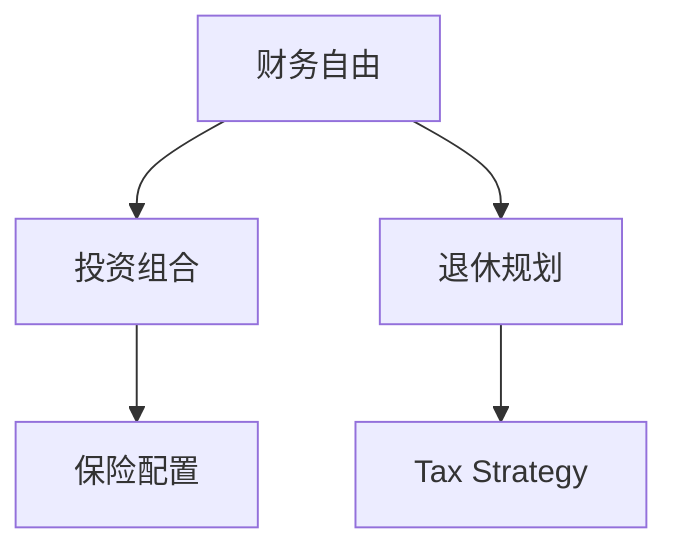

                 

# 程序员的财务规划：从入门到财务自由的路线图

> 关键词：财务规划, 程序员, 财务自由, 投资组合, 退休规划, 税务策略, 保险配置

## 1. 背景介绍

### 1.1 问题由来
在科技迅猛发展的今天，程序员已不仅是代码的编写者，更是社会进步的推动者。然而，高薪收入背后往往隐藏着巨大的财务风险：高消费、高压力、低储蓄、低投资、低保险配置等问题普遍存在。如何规划个人财务，实现财务自由，已成为程序员群体共同的课题。

### 1.2 问题核心关键点
财务规划的核心在于有效管理个人收入与支出，合理配置投资和保险资源，确保未来生活品质。具体关键点包括：
- 确定收入、支出和储蓄目标。
- 优化投资组合，分散风险，提高回报。
- 构建全面的保险体系，规避财务风险。
- 制定科学的退休规划，实现长期稳定财务。
- 掌握税务策略，合理避税。

### 1.3 问题研究意义
财务规划的合理实施，不仅能帮助程序员应对当前和未来的财务压力，还能保障其生活质量，实现财务自由。对个人而言，良好的财务规划有助于积累财富，实现梦想。对社会而言，程序员作为科技创新的重要力量，财务健康将推动整个行业乃至社会的发展。

## 2. 核心概念与联系

### 2.1 核心概念概述

为更好地理解程序员的财务规划方法，本节将介绍几个密切相关的核心概念：

- 财务自由(Financial Freedom)：指个人无需再依赖工作收入，通过被动收入（如投资收益、租金、版权费等）维持生活质量。
- 投资组合(Investment Portfolio)：指个人持有的各类资产（如股票、债券、房地产、基金等）的组合，旨在分散风险，优化收益。
- 退休规划(Retirement Planning)：指为未来退休生活进行财务规划，确保退休后仍能保持生活品质。
- 税务策略(Tax Strategy)：指通过合法途径优化税务安排，减少税收负担，提高净收益。
- 保险配置(Insurance Configuration)：指根据个人和家庭的财务状况，选择合适的保险产品，降低财务风险。

这些核心概念之间的逻辑关系可以通过以下Mermaid流程图来展示：



这个流程图展示了几者之间的逻辑关系：

1. 财务自由是最终目标，实现路径包括投资组合优化、退休规划、税务策略和保险配置。
2. 投资组合是实现财务自由的重要手段，需合理配置各类资产。
3. 退休规划和税务策略辅助投资组合，提高整体财务规划的效率和合理性。
4. 保险配置作为基础保障，为财务自由提供更牢固的支持。

## 3. 核心算法原理 & 具体操作步骤
### 3.1 算法原理概述

财务规划的核心理论基于现代理财学的三大支柱：资产配置、风险管理、财务目标设定。具体步骤如下：

- **资产配置**：根据个人风险偏好和财务目标，分配不同资产类别的比例。
- **风险管理**：通过分散投资和风险对冲策略，降低投资组合的波动性。
- **财务目标设定**：设定合理的收入、支出、储蓄和投资目标，确保财务计划的可行性和可持续性。

### 3.2 算法步骤详解

**Step 1: 财务状况评估**
- 列出所有收入来源和支出项目，计算净收入。
- 评估现有资产和负债情况，计算净资产。
- 分析现金流状况，确保有足够的流动性应对紧急情况。

**Step 2: 财务目标设定**
- 确定短期（如1-3年）、中期（如3-10年）和长期（如10年以上）财务目标。
- 设定储蓄目标和投资目标，确保目标的合理性和可达性。

**Step 3: 资产配置**
- 根据风险偏好，选择股票、债券、房地产、基金等资产类别。
- 计算每种资产的预期收益和风险，构建最优投资组合。
- 定期调整投资组合，确保其与财务目标和风险偏好相匹配。

**Step 4: 风险管理**
- 使用分散投资策略，降低单个资产的波动性。
- 通过保险配置，保障资产不受意外事件冲击。
- 引入对冲策略，如期权、期货等，进一步分散风险。

**Step 5: 税务策略**
- 了解个人所得税、资本利得税、增值税等税种及其税率。
- 选择最优的税务规划方案，如税收递延、税收抵免等，减少税收负担。
- 通过合理投资，利用税收优惠政策，提高净收益。

**Step 6: 退休规划**
- 评估预期退休年龄和退休后生活质量，设定退休储蓄目标。
- 选择合适的退休账户（如401(k)、IRA等），最大化退休储蓄。
- 定期评估和调整退休计划，确保其与财务目标一致。

### 3.3 算法优缺点

财务规划的优点在于：
1. 系统化管理个人财务，避免无序消费和投资。
2. 通过分散投资和风险管理，提高投资组合的稳健性。
3. 利用税务策略减少税收负担，提高净收益。
4. 保险配置提供安全保障，降低财务风险。

但财务规划也存在一定的局限性：
1. 需要较高的专业知识和技能，门槛较高。
2. 市场变化和政策调整会影响规划效果。
3. 规划过程中的数据获取和分析需要大量时间和精力。
4. 定期调整和评估成本较高。

尽管有这些局限性，但合理的财务规划仍能显著提升个人财务健康和幸福感。

### 3.4 算法应用领域

财务规划方法在个人和家庭财务管理、企业财务管理、金融投资等领域均有广泛应用。

- 个人和家庭财务管理：帮助个体和家庭实现财务自由，提高生活质量。
- 企业财务管理：优化企业财务结构，提高运营效率和盈利能力。
- 金融投资：通过合理的资产配置和风险管理，实现长期稳定的投资回报。

## 4. 数学模型和公式 & 详细讲解 & 举例说明（备注：数学公式请使用latex格式，latex嵌入文中独立段落使用 $$，段落内使用 $)
### 4.1 数学模型构建

本节将使用数学语言对财务规划的计算过程进行更加严格的刻画。

假设个人年收入为 $Y$，月支出为 $C$，月储蓄为 $S$，年投资收益率为 $r$，股票占比为 $x$，债券占比为 $y$，房地产占比为 $z$。

定义净收入 $I = Y - C$，净资产 $A = I \times r$，总投资组合收益 $P = r \times x \times p + r \times y \times q + r \times z \times s$，其中 $p, q, s$ 分别为股票、债券和房地产的预期年收益率。

### 4.2 公式推导过程

假设个人在20岁时开始储蓄，每年储蓄 $S$，年投资收益率为 $r$，到65岁时，总储蓄为 $A_0 + A_1 + \cdots + A_{45}$，总收益为 $P_0 + P_1 + \cdots + P_{45}$，其中 $A_i$ 和 $P_i$ 分别为第 $i$ 年的储蓄和收益。

根据复利公式，第 $i$ 年的储蓄和收益可以表示为：
$$
A_i = S \times (1+r)^i
$$
$$
P_i = P_{i-1} \times (1+r)
$$

总储蓄和总收益的公式为：
$$
A = \sum_{i=0}^{45} A_i = S \times \frac{(1+r)^{46} - 1}{r}
$$
$$
P = \sum_{i=0}^{45} P_i = P_0 \times \frac{1-(1+r)^{46}}{r}
$$

根据退休规划的假设，假设退休后的年支出为 $C$，预期寿命为 $N$ 年，则退休后总支出为 $N \times C$。为确保财务自由，总储蓄和总收益应大于等于退休后总支出。

### 4.3 案例分析与讲解

**案例一：20岁开始储蓄，年储蓄1万元，年收益率为5%**

假设每年储蓄1万元，年收益率为5%，计算65岁时的总储蓄和总收益：

$$
A = 10000 \times \frac{(1+0.05)^{46} - 1}{0.05} \approx 358,649
$$
$$
P = 10000 \times \frac{1-(1+0.05)^{46}}{0.05} \approx 249,997
$$

总储蓄和总收益共约70万元。

**案例二：60岁退休，预期退休后年支出5万元**

假设退休后年支出为5万元，预期寿命为25年，则总支出为 $25 \times 5 = 125$ 万元。为实现财务自由，需要确保总储蓄和总收益大于等于125万元。

## 5. 项目实践：代码实例和详细解释说明
### 5.1 开发环境搭建

在进行财务规划的计算时，我们需要准备好开发环境。以下是使用Python进行财务规划计算的环境配置流程：

1. 安装Anaconda：从官网下载并安装Anaconda，用于创建独立的Python环境。

2. 创建并激活虚拟环境：
```bash
conda create -n finance-env python=3.8 
conda activate finance-env
```

3. 安装必要的Python库：
```bash
conda install pandas sympy sympy
```

4. 安装Excel文件读写库：
```bash
conda install openpyxl
```

5. 安装Jupyter Notebook：
```bash
conda install jupyter notebook
```

完成上述步骤后，即可在`finance-env`环境中开始财务规划的计算。

### 5.2 源代码详细实现

下面以案例一为例，使用Python进行财务规划的计算和分析。

```python
import pandas as pd
from sympy import symbols, Rational, solve

# 定义变量
r = Rational(5, 100)  # 年收益率
n = 46  # 储蓄年数
S = 10000  # 年储蓄

# 计算总储蓄和总收益
A = S * ((1 + r)**n - 1) / r
P = A * r

# 打印结果
print(f"总储蓄：{A}")
print(f"总收益：{P}")
```

### 5.3 代码解读与分析

让我们再详细解读一下关键代码的实现细节：

**计算公式**：
- 使用Sympy库定义变量，确保计算的精确性。
- 根据公式计算总储蓄和总收益。

**打印输出**：
- 通过print函数输出计算结果，便于阅读和分析。

通过上述代码，我们可以快速计算出20岁开始储蓄，年储蓄1万元，年收益率为5%时的总储蓄和总收益。

## 6. 实际应用场景
### 6.1 企业财务管理

企业财务管理是财务规划的重要应用场景之一。通过合理的财务规划，企业可以优化资本结构，提高资本利用效率，降低财务风险，提升盈利能力。

具体应用包括：
- 资产配置：合理配置现金流、应收账款、存货等流动资产，提高资金使用效率。
- 风险管理：通过保险和融资工具，降低经营风险和财务风险。
- 税务策略：选择最优的税务规划方案，减少税收负担，提高净利润。

### 6.2 个人退休规划

个人退休规划是财务规划的核心内容之一。合理规划退休储蓄，确保退休后仍能保持较高生活质量，是每位员工和自雇人士的重要任务。

具体步骤包括：
- 设定退休目标：确定退休年龄、预期生活品质等。
- 计算退休储蓄需求：根据预期支出，计算退休储蓄目标。
- 选择合适的退休账户：利用401(k)、IRA等退休账户最大化储蓄。
- 定期评估和调整：根据市场和政策变化，调整储蓄和投资策略。

### 6.3 家庭财务规划

家庭财务规划是个人财务规划的扩展和延伸。家庭财务规划涉及多人、多账户的管理，更复杂，但也更具挑战性。

具体应用包括：
- 收入管理：设定家庭收入目标，合理分配家庭支出。
- 储蓄规划：设定家庭储蓄目标，确保资金流动性。
- 投资配置：根据家庭风险偏好，配置各类资产。
- 保险规划：确保家庭成员的财务安全。
- 税务规划：通过合理的税务安排，提高家庭净收益。

### 6.4 未来应用展望

随着科技的进步和市场的发展，财务规划的应用场景将更加多样化和复杂化。

未来，财务规划将进一步结合大数据、人工智能等技术，提供更加精准和个性化的财务建议。智能投顾、智能税务、智能保险等新兴服务将逐渐普及，进一步提高财务规划的效率和效果。

## 7. 工具和资源推荐
### 7.1 学习资源推荐

为了帮助财务规划的从业者和爱好者系统掌握财务规划的理论基础和实践技巧，这里推荐一些优质的学习资源：

1. 《财富自由之路》系列博文：由知名理财专家撰写，深入浅出地介绍了财务自由的概念、路径和方法。

2. Coursera《财务规划与投资》课程：全球顶级大学开设的课程，涵盖财务规划、投资组合管理、税务策略等内容，适合系统学习。

3. 《个人理财：从入门到精通》书籍：全面介绍了个人财务管理的各个环节，包括预算、储蓄、投资、保险、税务等。

4. 《财务自由的故事》纪录片：通过真实的财务自由案例，展示如何通过科学的财务规划实现财务自由。

5. 《财富管理》杂志：提供最新的财务规划和投资管理资讯，帮助你了解市场动态和行业趋势。

通过对这些资源的学习实践，相信你一定能够快速掌握财务规划的精髓，并用于解决实际的财务问题。

### 7.2 开发工具推荐

高效的工具支持是财务规划成功实施的基础。以下是几款常用的财务规划工具：

1. Microsoft Excel：功能强大的电子表格工具，适合进行复杂的财务计算和数据分析。

2. Google Sheets：在线电子表格工具，与Google Drive无缝集成，方便共享和协作。

3. Quicken：专业的家庭财务管理软件，支持预算管理、投资跟踪、税务规划等功能。

4. Mint：免费的财务管理工具，自动跟踪账户变动，生成财务报告，适合日常使用。

5. Personal Capital：在线财务管理平台，提供全方位的财务规划和投资管理服务。

合理利用这些工具，可以显著提升财务规划的效率和准确性，帮助个人和企业实现财务目标。

### 7.3 相关论文推荐

财务规划的研究源于学界的持续探索。以下是几篇重要的相关论文，推荐阅读：

1. "A Quantitative Approach to Financial Planning"：介绍了一种基于数学模型的财务规划方法。

2. "The Role of Financial Planning in Retirement Planning"：探讨了财务规划在退休规划中的作用和重要性。

3. "Tax-Effective Investment Strategies"：研究了通过税务策略优化投资组合的方法。

4. "Portfolio Optimization with Risk Aversion"：讨论了如何通过风险管理优化投资组合。

5. "Behavioral Finance and Investment Planning"：分析了行为金融学对投资规划的影响，提出了相应的优化策略。

这些论文代表了财务规划技术的发展脉络。通过学习这些前沿成果，可以帮助从业者把握学科前进方向，激发更多的创新灵感。

## 8. 总结：未来发展趋势与挑战
### 8.1 总结

本文对程序员的财务规划方法进行了全面系统的介绍。首先阐述了财务规划的背景和意义，明确了财务规划在实现个人和企业财务自由中的重要作用。其次，从原理到实践，详细讲解了财务规划的数学模型和操作步骤，给出了具体的代码实现和案例分析。同时，本文还广泛探讨了财务规划在企业财务管理、个人退休规划、家庭财务规划等多个场景中的应用，展示了财务规划的广泛适用性和深远影响。

通过本文的系统梳理，可以看到，财务规划是一个涉及多学科、多领域的综合性系统工程，需要综合考虑个人收入、支出、储蓄、投资、保险、税务等多个方面。合理规划可以显著提升财务健康和生活质量，实现财务自由。

### 8.2 未来发展趋势

展望未来，财务规划技术将呈现以下几个发展趋势：

1. 数字化转型：借助大数据和人工智能技术，财务规划将更加精准和个性化，能够提供更为细致的财务建议和优化方案。

2. 自动化提升：智能投顾、智能税务、智能保险等新兴服务将逐步普及，财务规划过程将更加自动化和智能化。

3. 跨学科融合：财务规划将与其他学科（如行为经济学、心理学等）深度融合，提供更加全面、科学的财务建议。

4. 全球化扩展：跨国企业和全球公民的财务规划需求将增加，跨国金融市场和税务政策的融合将进一步推动全球财务规划的发展。

5. 政策驱动：政府将出台更多政策支持财务规划，提供税收优惠、补贴等激励措施，推动财务规划的普及和应用。

以上趋势凸显了财务规划技术的广阔前景，相信未来在技术、市场、政策等多方面协同推动下，财务规划将进入一个更成熟、更高效、更普适的新阶段。

### 8.3 面临的挑战

尽管财务规划技术正在不断发展，但在实现财务自由的过程中，仍面临诸多挑战：

1. 数据隐私和安全：财务规划涉及大量个人和企业的敏感信息，数据隐私和安全问题至关重要。

2. 市场和政策波动：市场和经济政策的波动对财务规划效果有重大影响，需灵活调整策略。

3. 复杂性和门槛：财务规划涉及众多专业知识和技能，需要较高的专业素养和实践经验。

4. 个性化需求：不同个体的财务状况和需求各异，需要个性化的财务规划方案。

5. 成本和收益权衡：财务规划的成本和收益需合理权衡，避免过度投资和浪费资源。

正视财务规划面临的这些挑战，积极应对并寻求突破，将有助于实现个人和企业财务目标，迈向财务自由。

### 8.4 研究展望

未来的财务规划研究需要在以下几个方面寻求新的突破：

1. 数据驱动的决策支持：借助大数据和人工智能技术，提供更加科学、个性化的财务规划建议。

2. 自动化和智能化的财务规划系统：开发智能投顾、智能税务等自动化工具，降低从业者的技术门槛，提高效率。

3. 跨学科的财务规划理论：将心理学、行为经济学等学科研究成果应用于财务规划，增强规划的科学性和可操作性。

4. 全球化的财务规划标准：制定全球统一的财务规划标准和评估体系，推动跨国企业和全球公民的财务规划普及。

5. 政策支持和激励机制：政府和监管机构应出台更多政策支持财务规划，提供税收优惠、补贴等激励措施，推动财务规划的普及和应用。

这些研究方向和突破将引领财务规划技术进入新的高度，为实现个人和企业财务自由提供更有力的支持。

## 9. 附录：常见问题与解答

**Q1：如何设定合理的财务目标？**

A: 设定合理的财务目标需考虑个人的生活品质、家庭责任、职业规划等因素。一般来说，应设定具体、可量化、可达成的目标，并定期评估和调整。

**Q2：如何选择合适的投资组合？**

A: 选择合适的投资组合需考虑个人的风险偏好、财务目标、投资期限等因素。一般建议多元化配置，分散风险，并根据市场变化定期调整。

**Q3：如何规避税务风险？**

A: 规避税务风险需了解相关税法和政策，合理规划税务安排。选择税收递延、税收抵免等方案，减少税收负担。

**Q4：如何保险配置？**

A: 保险配置需根据个人和家庭的财务状况，选择合适的保险产品，如健康险、寿险、意外险等。确保在意外事件发生时，有足够的保险保障。

**Q5：如何平衡短期和长期财务目标？**

A: 平衡短期和长期财务目标需合理安排收入、支出、储蓄和投资。短期目标可通过控制开支和储蓄实现，长期目标需通过投资和退休规划达成。

总之，财务规划是一个复杂但重要的系统工程，需要多方面综合考虑和持续优化。通过不断学习和实践，相信每个人都能实现自己的财务自由梦想。

---

作者：禅与计算机程序设计艺术 / Zen and the Art of Computer Programming

