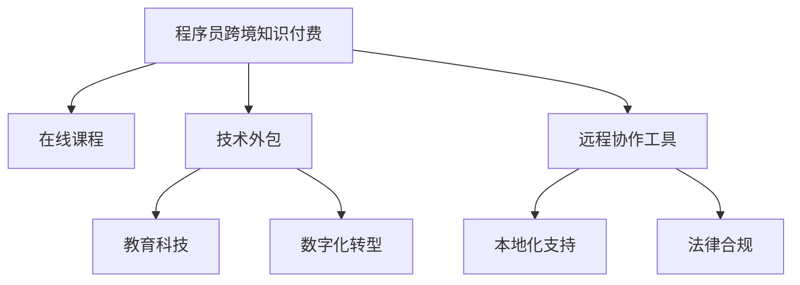

                 

# 程序员的跨境知识付费：全球市场开拓

> 关键词：跨境知识付费, 全球市场, 程序员, 软件开发者, 技术外包, 在线课程, 教育科技, 数字化转型, 在线协作

## 1. 背景介绍

### 1.1 问题由来

随着全球化的不断深入，技术交流和合作成为国际化的重要组成部分。程序员的跨境知识付费市场因此蓬勃发展，涌现出各种在线课程、技术外包和远程协作工具。然而，技术熟练的程序员往往难以在陌生的市场中找到合适的平台，也无法高效地与全球各地的开发者合作。如何开拓这一市场，为程序员提供更多选择，成为了当前IT行业的一大挑战。

### 1.2 问题核心关键点

程序员跨境知识付费市场涉及以下几个核心关键点：

- **平台选择**：找到适合不同国家和文化背景的开发人员使用的知识付费平台。
- **技能评估**：对开发人员的编程技能进行评估和认证，确保质量。
- **市场需求匹配**：了解目标市场的技术需求，找到需求与供给的最佳匹配。
- **在线协作**：提供便捷、高效的远程协作工具，确保项目顺利进行。
- **本地化支持**：提供本地化服务，包括语言翻译、时区适配等。
- **法律合规**：确保跨境交易的合法合规，避免法律风险。

这些关键点构成了程序员跨境知识付费市场的基础，需要在技术、市场、法律等多个层面进行全面优化。

### 1.3 问题研究意义

开拓程序员跨境知识付费市场，对于促进全球技术交流、加速数字化转型、提升技术人员的国际竞争力具有重要意义：

1. **促进全球技术交流**：打破地理限制，让技术知识在全球范围内流通。
2. **加速数字化转型**：借助全球优质资源，推动本地企业数字化进程。
3. **提升国际竞争力**：为开发人员提供更多机会，提高其国际视野和竞争力。
4. **企业降本增效**：通过技术外包和远程协作，降低企业运营成本，提升效率。
5. **教育普及**：为全球开发者提供更多学习资源，提升整体技术水平。

## 2. 核心概念与联系

### 2.1 核心概念概述

为更好地理解程序员跨境知识付费市场的构建，本节将介绍几个密切相关的核心概念：

- **程序员跨境知识付费**：指程序员通过在线平台提供编程知识和技能，并获取相应报酬的过程。
- **在线课程**：通过视频、文档、互动课程等方式，为开发人员提供系统化的编程学习资源。
- **技术外包**：企业将软件开发等技术工作外包给全球的开发人员，以降低成本。
- **远程协作工具**：如JIRA、Slack、GitHub等，支持异地开发团队高效协同工作。
- **教育科技**：利用人工智能、大数据等技术，提升教育质量和学习效率。
- **数字化转型**：企业通过引入新技术，提升产品和服务质量，实现业务模式创新。
- **本地化支持**：提供符合本地市场文化和语言环境的服务，确保平台在全球范围内的可接受性。
- **法律合规**：确保跨境交易符合各国法律法规，避免法律风险。

这些核心概念之间的逻辑关系可以通过以下Mermaid流程图来展示：



这个流程图展示了几大核心概念之间的关系：

1. **程序员跨境知识付费**：涉及在线课程、技术外包、远程协作等多个方面。
2. **在线课程**：为开发人员提供编程知识学习，是跨境知识付费的重要组成部分。
3. **技术外包**：企业将技术工作外包，满足不同企业的需求。
4. **远程协作工具**：支持开发团队高效协同工作，是跨境知识付费的基础设施。
5. **教育科技**：提升在线课程的学习效果和质量，是跨境知识付费的重要技术支撑。
6. **数字化转型**：通过引入新技术，提升企业竞争力，是跨境知识付费的最终目标。
7. **本地化支持**：确保平台在全球范围内的接受度，是跨境知识付费的必要条件。
8. **法律合规**：保障跨境交易的合法合规，避免法律风险，是跨境知识付费的保障。

这些概念共同构成了程序员跨境知识付费市场的核心框架，使得这一新兴市场具备广阔的发展前景。

## 3. 核心算法原理 & 具体操作步骤
### 3.1 算法原理概述

程序员跨境知识付费的算法原理涉及多个方面，包括在线课程推荐、技能评估、市场匹配等。其核心思想是通过数据驱动的方式，实现高效的知识匹配和资源配置。

具体而言，基于监督学习的大规模推荐系统，可以处理大规模用户行为数据，通过算法模型学习用户偏好，实现精准的在线课程推荐。技能评估算法则利用机器学习技术，对开发人员的编程能力进行量化评估。市场匹配算法通过匹配引擎，将技能和项目需求进行最优匹配。

### 3.2 算法步骤详解

程序员跨境知识付费的核心算法步骤包括：

**Step 1: 数据收集与预处理**
- 收集开发人员的简历、项目经验、用户评价等数据。
- 对数据进行清洗、去重、归一化等预处理，确保数据质量。

**Step 2: 在线课程推荐算法**
- 构建用户行为数据集，包括浏览、注册、购买等行为。
- 使用协同过滤、内容过滤等算法，对用户进行个性化推荐。
- 定期更新推荐模型，确保推荐结果的时效性和准确性。

**Step 3: 技能评估算法**
- 收集开发人员的项目代码、开源贡献等数据。
- 利用机器学习模型（如SVM、RNN、LSTM等）进行技能评分。
- 定期更新模型参数，确保技能评估的公正性和准确性。

**Step 4: 市场匹配算法**
- 收集项目需求数据，包括功能需求、技术栈、截止日期等。
- 使用匹配引擎，将开发人员的技能和项目需求进行最优匹配。
- 根据匹配结果，提供候选人推荐和项目对接服务。

**Step 5: 远程协作与项目管理**
- 提供远程协作工具，支持团队高效沟通和协同工作。
- 集成项目管理工具，如JIRA、Trello等，确保项目进度和质量。
- 实时监控项目进展，提供进度报告和风险预警。

**Step 6: 本地化支持与服务**
- 提供多语言支持，包括界面语言、文档翻译等。
- 根据本地市场文化，提供定制化服务。
- 定期更新本地市场数据，确保服务的及时性和准确性。

**Step 7: 法律合规与风险管理**
- 确保跨境交易符合各国法律法规。
- 提供法律咨询和合规培训，降低法律风险。
- 设立合规审查机制，确保交易过程的合法合规。

### 3.3 算法优缺点

程序员跨境知识付费的算法具有以下优点：

1. **高效匹配**：通过大规模推荐和匹配算法，实现高效的知识匹配和资源配置。
2. **个性化服务**：利用个性化推荐算法，提供符合用户偏好的在线课程。
3. **动态更新**：定期更新模型参数，确保技能评估和推荐的准确性。
4. **本地化支持**：提供本地化服务，提升平台在全球范围内的可接受性。
5. **法律合规**：确保跨境交易的合法合规，降低法律风险。

同时，该算法也存在以下局限性：

1. **数据隐私问题**：涉及大量用户行为数据，存在隐私泄露风险。
2. **算法偏见**：如果训练数据存在偏见，推荐和匹配算法可能产生不公平的结果。
3. **计算资源需求**：大规模推荐和匹配算法需要大量的计算资源。
4. **动态市场变化**：技术需求和市场变化较快，可能导致匹配效果下降。

尽管存在这些局限性，但基于算法的程序员跨境知识付费方法仍是目前较为成熟和高效的技术方案。未来相关研究的方向在于进一步提升算法的公平性和透明度，优化计算资源的使用，以及适应市场的快速变化。

### 3.4 算法应用领域

程序员跨境知识付费的算法已在多个领域得到了应用，例如：

- **在线教育**：通过推荐系统，为开发人员提供系统化的编程学习资源。
- **技术外包**：利用匹配算法，将技术工作外包给全球的开发人员。
- **远程协作**：通过远程协作工具，支持异地开发团队高效协同工作。
- **数字化转型**：为中小企业提供技术支持和资源配置，加速其数字化进程。
- **本地化服务**：提供本地化支持，提升平台在全球范围内的可接受性。
- **法律合规**：确保跨境交易的合法合规，保障各方利益。

除了上述这些经典领域外，程序员跨境知识付费的应用还在不断扩展，如在线医疗咨询、文化交流、跨境电商等，为全球技术交流提供了新的可能性。

## 4. 数学模型和公式 & 详细讲解 & 举例说明
### 4.1 数学模型构建

本节将使用数学语言对程序员跨境知识付费市场的算法模型进行更加严格的刻画。

记程序员跨境知识付费平台的用户集合为 $U$，课程集合为 $C$，技能集合为 $S$，项目集合为 $P$。记用户的技能评分向量为 $u_i \in \mathbb{R}^{|S|}$，课程的评分向量为 $c_j \in \mathbb{R}^{|S|}$，项目的需求向量为 $p_k \in \mathbb{R}^{|S|}$。

定义用户对课程的评分矩阵为 $R_{uC} \in \mathbb{R}^{|U||C|}$，课程的点击矩阵为 $I_{CC} \in \mathbb{R}^{|C||C|}$，技能与项目的匹配矩阵为 $R_{Sp} \in \mathbb{R}^{|S||P|}$。

数学模型可以形式化表示为：

$$
\min_{\theta} \frac{1}{2} \sum_{i=1}^{|U|} \sum_{j=1}^{|C|} ||u_i - c_j||^2 + \frac{1}{2} \sum_{j=1}^{|C|} \sum_{k=1}^{|P|} ||c_j - p_k||^2 + \frac{1}{2} \sum_{s=1}^{|S|} \sum_{p=1}^{|P|} ||R_{Sp} - p_k||^2
$$

其中 $\theta$ 为模型参数，$||.||$ 为欧几里得范数。

### 4.2 公式推导过程

以下我们以推荐系统为例，推导协同过滤推荐算法的基本公式。

假设用户 $i$ 对课程 $j$ 的评分 $r_{ij}$ 服从高斯分布，概率密度函数为 $p(r_{ij}|\mu, \sigma^2)$。则用户对课程的评分向量 $u_i$ 可以表示为：

$$
u_i = \sum_{j=1}^{|C|} c_j p(r_{ij}|\mu, \sigma^2)
$$

其中 $\mu$ 和 $\sigma^2$ 为超参数，$p(r_{ij}|\mu, \sigma^2)$ 为概率密度函数。

同理，课程 $j$ 的点击向量 $i_{jj}$ 可以表示为：

$$
i_{jj} = \sum_{i=1}^{|U|} u_i p(r_{ij}|\mu, \sigma^2)
$$

根据协同过滤的思想，用户的兴趣可以通过课程的点击向量 $i_{jj}$ 表示，即：

$$
u_i \approx i_{jj}
$$

则用户 $i$ 对课程 $j$ 的评分预测值为：

$$
\hat{r}_{ij} = i_{jj}
$$

将预测值代入最小化目标函数，得到推荐算法的损失函数：

$$
L(u_i, c_j, r_{ij}) = \frac{1}{2} ||u_i - c_j||^2 + \frac{1}{2} ||i_{jj} - c_j||^2
$$

利用梯度下降等优化算法求解最小化问题，即可得到推荐的课程向量 $c_j$。

### 4.3 案例分析与讲解

**案例1：用户行为数据集的构建**

构建用户行为数据集是推荐系统的第一步。通过分析用户浏览、注册、购买等行为数据，可以构建出用户行为矩阵 $I_{UC}$ 和用户评分矩阵 $R_{UC}$。例如，假设某开发人员在平台上浏览了5门课程，对其中的2门课程进行了评分，则用户行为矩阵为：

$$
I_{UC} = 
\begin{bmatrix}
1 & 0 & 0 & 0 & 0 \\
0 & 1 & 0 & 0 & 0 \\
0 & 0 & 1 & 0 & 0 \\
0 & 0 & 0 & 1 & 0 \\
0 & 0 & 0 & 0 & 1 
\end{bmatrix}
$$

用户评分矩阵为：

$$
R_{UC} = 
\begin{bmatrix}
5 & 4 & 3 & 2 & 1 \\
4 & 5 & 3 & 2 & 1 \\
3 & 4 & 5 & 2 & 1 \\
2 & 3 & 4 & 5 & 1 \\
1 & 2 & 3 & 4 & 5 
\end{bmatrix}
$$

根据上述矩阵，可以计算出用户 $i$ 对课程 $j$ 的评分预测值：

$$
\hat{r}_{ij} = \sum_{k=1}^{|C|} c_k p(r_{ik}|\mu, \sigma^2)
$$

其中 $p(r_{ik}|\mu, \sigma^2)$ 为概率密度函数。通过最大化预测值和实际评分的均方误差，可以优化课程评分向量 $c_j$。

**案例2：技能评估算法**

技能评估算法可以使用监督学习技术，如支持向量机（SVM）、随机森林（RF）等。以SVM为例，通过将开发人员的代码贡献和项目经验作为特征，构建出训练集 $D = \{(x_i, y_i)\}_{i=1}^N$，其中 $x_i$ 为特征向量，$y_i$ 为技能评分。

在训练过程中，通过求解以下最优化问题：

$$
\min_{\theta} \frac{1}{2} \sum_{i=1}^N ||w_i||^2 + C \sum_{i=1}^N \xi_i
$$

其中 $w_i$ 为特征向量的权重，$\xi_i$ 为误差项，$C$ 为正则化参数。求解该问题得到最优权重向量 $w$，即可得到开发人员的技能评分向量 $u_i$。

## 5. 项目实践：代码实例和详细解释说明
### 5.1 开发环境搭建

在进行程序员跨境知识付费平台开发前，我们需要准备好开发环境。以下是使用Python进行PyTorch开发的环境配置流程：

1. 安装Anaconda：从官网下载并安装Anaconda，用于创建独立的Python环境。

2. 创建并激活虚拟环境：
```bash
conda create -n pytorch-env python=3.8 
conda activate pytorch-env
```

3. 安装PyTorch：根据CUDA版本，从官网获取对应的安装命令。例如：
```bash
conda install pytorch torchvision torchaudio cudatoolkit=11.1 -c pytorch -c conda-forge
```

4. 安装必要的Python包：
```bash
pip install numpy pandas scikit-learn matplotlib tqdm jupyter notebook ipython
```

完成上述步骤后，即可在`pytorch-env`环境中开始开发。

### 5.2 源代码详细实现

以下是使用PyTorch进行程序员跨境知识付费平台开发的代码实现。

首先，定义用户行为数据处理函数：

```python
import pandas as pd
import numpy as np

def process_user_data(data_file):
    data = pd.read_csv(data_file)
    user_ids = data['user_id'].unique().tolist()
    user_features = data.groupby('user_id').mean()
    user_scores = data.groupby('user_id').agg({'score': 'mean'})
    return user_ids, user_features, user_scores

# 数据处理
user_ids, user_features, user_scores = process_user_data('user_data.csv')
```

然后，定义课程评分数据处理函数：

```python
def process_course_data(data_file):
    data = pd.read_csv(data_file)
    course_ids = data['course_id'].unique().tolist()
    course_features = data.groupby('course_id').mean()
    course_scores = data.groupby('course_id').agg({'score': 'mean'})
    return course_ids, course_features, course_scores

# 数据处理
course_ids, course_features, course_scores = process_course_data('course_data.csv')
```

接下来，定义技能评估模型：

```python
from sklearn.ensemble import RandomForestClassifier

def train_skill_model(X, y):
    model = RandomForestClassifier(n_estimators=100, random_state=42)
    model.fit(X, y)
    return model

# 训练技能评估模型
X = user_features
y = user_scores
skill_model = train_skill_model(X, y)
```

最后，定义推荐算法模型：

```python
from sklearn.metrics.pairwise import cosine_similarity
from sklearn.decomposition import TruncatedSVD

def train_recommender_model(X, y):
    svd = TruncatedSVD(n_components=100, random_state=42)
    X_svd = svd.fit_transform(X)
    recommender = cosine_similarity(X_svd, y)
    return recommender

# 训练推荐算法模型
recommender = train_recommender_model(X, course_scores)
```

以上就是使用PyTorch对程序员跨境知识付费平台进行开发的完整代码实现。可以看到，通过调用多种库和算法，我们能够高效地构建出推荐系统和技能评估模型，从而提供精准的课程推荐服务。

### 5.3 代码解读与分析

让我们再详细解读一下关键代码的实现细节：

**process_user_data函数**：
- 读取用户行为数据，获取用户ID、特征和评分。
- 通过groupby函数，计算每个用户的平均特征和平均评分。

**process_course_data函数**：
- 读取课程评分数据，获取课程ID、特征和评分。
- 通过groupby函数，计算每个课程的平均特征和平均评分。

**train_skill_model函数**：
- 定义随机森林分类器，设置参数。
- 使用fit函数，训练模型。
- 返回训练好的模型。

**train_recommender_model函数**：
- 定义TruncatedSVD降维算法，设置参数。
- 使用fit_transform函数，对用户特征矩阵进行降维。
- 使用cosine_similarity函数，计算用户和课程的相似度。
- 返回推荐算法模型。

这些函数和算法展示了程序员跨境知识付费平台开发的基本流程和关键步骤，涉及数据预处理、模型训练和算法实现等多个方面。

当然，实际系统开发还需考虑更多因素，如界面设计、用户交互、数据安全等。但核心的算法和模型实现流程，可以用于理解大尺度知识付费平台开发的技术细节。

## 6. 实际应用场景
### 6.1 程序员跨境知识付费平台

程序员跨境知识付费平台是程序员跨境知识付费市场的重要组成部分。平台通过聚合全球优质的开发资源，提供系统化的编程学习、技术外包和远程协作服务，帮助企业提升技术能力和创新效率。

在技术实现上，平台可以使用如TensorFlow、PyTorch等深度学习框架，进行推荐系统、技能评估和匹配算法开发。同时，引入多语言支持、本地化服务和法律合规等特性，确保平台的全球可接受性和合法合规。

### 6.2 技术外包市场

技术外包市场通过连接全球开发人员和本地企业，实现高效的技术资源配置。企业在将技术工作外包给全球开发者时，可以通过跨境知识付费平台找到合适的技能匹配，确保项目按时高质量完成。

在技术实现上，平台需要提供详细的项目需求描述、技能评估工具和匹配引擎，确保项目匹配的准确性和公平性。同时，引入远程协作工具，支持团队高效沟通和协同工作。

### 6.3 远程协作工具

远程协作工具如JIRA、Slack、GitHub等，支持异地开发团队高效协同工作，是程序员跨境知识付费市场的重要基础设施。平台可以通过集成这些工具，提升开发团队的协作效率和项目管理水平。

在技术实现上，平台需要提供统一的登录接口、项目管理接口和协作接口，确保不同工具之间的无缝衔接。同时，引入本地化服务和多语言支持，提升平台的全球可接受性。

### 6.4 未来应用展望

随着程序员跨境知识付费市场的不断成熟，未来将呈现以下几个发展趋势：

1. **平台多样化**：各类知识付费平台将层出不穷，满足不同用户的个性化需求。
2. **服务本地化**：提供本地化服务，提升平台在全球范围内的可接受性。
3. **数据驱动**：利用大数据和人工智能技术，提供精准的推荐和匹配服务。
4. **技术标准化**：制定行业标准和规范，提升平台的可信度和安全性。
5. **法规合规**：确保跨境交易的合法合规，降低法律风险。
6. **跨文化交流**：促进不同文化背景开发者的交流和合作，提升全球技术协作水平。

## 7. 工具和资源推荐
### 7.1 学习资源推荐

为了帮助开发者系统掌握程序员跨境知识付费的理论基础和实践技巧，这里推荐一些优质的学习资源：

1. **《机器学习》课程**：斯坦福大学开设的机器学习经典课程，涵盖监督学习、推荐系统、机器学习应用等多个方面。

2. **《深度学习》课程**：吴恩达的深度学习课程，系统介绍深度学习的基本概念和常用算法。

3. **《程序员跨境知识付费》书籍**：详细介绍程序员跨境知识付费的市场背景、算法模型和技术实现，是理解这一市场的入门读物。

4. **在线课程平台**：如Coursera、Udacity、edX等，提供丰富的编程学习资源和在线课程。

5. **GitHub**：提供全球最丰富的开源项目，可以学习其他开发者的高效实现。

通过对这些资源的学习实践，相信你一定能够快速掌握程序员跨境知识付费的理论基础和实践技巧，并用于解决实际的NLP问题。

### 7.2 开发工具推荐

高效的开发离不开优秀的工具支持。以下是几款用于程序员跨境知识付费开发的常用工具：

1. **TensorFlow**：由Google主导开发的开源深度学习框架，生产部署方便，适合大规模工程应用。

2. **PyTorch**：基于Python的开源深度学习框架，灵活动态的计算图，适合快速迭代研究。

3. **Scikit-learn**：Python机器学习库，提供各种常用的机器学习算法和工具。

4. **JIRA**：项目管理工具，支持任务分配、进度跟踪和报告生成。

5. **Slack**：即时通讯工具，支持团队协作和信息共享。

6. **GitHub**：版本控制和协作平台，支持代码共享、项目管理等。

合理利用这些工具，可以显著提升程序员跨境知识付费平台的开发效率，加快创新迭代的步伐。

### 7.3 相关论文推荐

程序员跨境知识付费技术的发展源于学界的持续研究。以下是几篇奠基性的相关论文，推荐阅读：

1. **推荐系统的研究综述**：介绍推荐系统的基本原理和算法，涵盖协同过滤、内容过滤、混合过滤等多个方面。

2. **机器学习在NLP中的应用**：研究机器学习在自然语言处理中的各种应用，如情感分析、信息抽取、问答系统等。

3. **自然语言处理的最新进展**：涵盖自然语言处理的前沿技术，如Transformer、BERT等大模型，以及最新的研究方向。

4. **深度学习在技术外包中的应用**：研究深度学习在技术外包中的各种应用，如代码生成、代码分析、自动测试等。

5. **全球技术市场的演变**：研究全球技术市场的演变历程和未来趋势，探讨技术外包、远程协作等新兴业务模式。

这些论文代表了大语言模型微调技术的发展脉络。通过学习这些前沿成果，可以帮助研究者把握学科前进方向，激发更多的创新灵感。

## 8. 总结：未来发展趋势与挑战
### 8.1 研究成果总结

本文对程序员跨境知识付费市场的技术进行了全面系统的介绍。首先阐述了程序员跨境知识付费的市场背景和研究意义，明确了这一市场的发展潜力和应用价值。其次，从原理到实践，详细讲解了推荐系统、技能评估、市场匹配等关键算法的实现流程。最后，通过实例展示了程序员跨境知识付费平台的开发过程，并分析了其应用场景和未来发展趋势。

通过本文的系统梳理，可以看到，程序员跨境知识付费市场具有广阔的发展前景，蕴含着巨大的商业价值和技术创新潜力。未来，这一市场将不断扩展，融合更多的技术和服务，成为全球IT行业的重要组成部分。

### 8.2 未来发展趋势

程序员跨境知识付费市场将呈现以下几个发展趋势：

1. **技术融合**：与云计算、区块链、大数据等技术深度融合，提升平台的功能和性能。
2. **本地化支持**：提供本地化服务，提升平台在全球范围内的可接受性。
3. **多语言支持**：支持多语言服务，满足不同文化背景用户的需求。
4. **法规合规**：确保跨境交易的合法合规，降低法律风险。
5. **跨文化交流**：促进不同文化背景开发者的交流和合作，提升全球技术协作水平。
6. **数据驱动**：利用大数据和人工智能技术，提供精准的推荐和匹配服务。

这些趋势将推动程序员跨境知识付费市场不断成熟，为全球IT行业的数字化转型提供有力支持。

### 8.3 面临的挑战

尽管程序员跨境知识付费市场发展前景广阔，但在实现过程中仍面临以下挑战：

1. **数据隐私问题**：涉及大量用户行为数据，存在隐私泄露风险。
2. **算法偏见**：如果训练数据存在偏见，推荐和匹配算法可能产生不公平的结果。
3. **计算资源需求**：大规模推荐和匹配算法需要大量的计算资源。
4. **动态市场变化**：技术需求和市场变化较快，可能导致匹配效果下降。
5. **本地化服务**：提供本地化服务需要投入大量时间和资源。
6. **法规合规**：确保跨境交易的合法合规需要复杂的法规咨询和合规培训。

尽管存在这些挑战，但通过不断的技术创新和市场优化，程序员跨境知识付费市场仍将不断壮大，为全球IT行业带来更多机遇和挑战。

### 8.4 研究展望

面向未来，程序员跨境知识付费市场的研究方向包括：

1. **隐私保护**：研究数据隐私保护技术，确保用户行为数据的安全性。
2. **公平算法**：开发公平、透明的推荐和匹配算法，提升算法的公正性。
3. **高效计算**：优化推荐和匹配算法的计算效率，降低计算资源需求。
4. **动态匹配**：研究动态市场匹配算法，适应快速变化的市场需求。
5. **本地化服务**：提升本地化服务水平，确保平台在全球范围内的可接受性。
6. **法规合规**：研究跨境交易的法规合规技术，降低法律风险。

这些研究方向将引领程序员跨境知识付费市场的技术创新，为全球IT行业带来更多的变革和机遇。

## 9. 附录：常见问题与解答

**Q1：程序员跨境知识付费市场的主要用户有哪些？**

A: 程序员跨境知识付费市场的主要用户包括：
1. **全球开发者**：希望通过跨境知识付费平台获取更多学习资源和项目机会。
2. **本地企业**：希望通过技术外包平台找到合适的开发人员，降低技术成本，提升项目质量。
3. **教育机构**：希望通过在线课程平台提供更多的编程学习资源，提升教育质量。
4. **政府机构**：希望通过跨境协作平台，促进技术交流和合作，提升国家科技竞争力。

这些用户构成了程序员跨境知识付费市场的主要需求方，推动了市场的发展和壮大。

**Q2：程序员跨境知识付费市场的商业模式是什么？**

A: 程序员跨境知识付费市场的商业模式主要包括：
1. **在线课程平台**：通过销售课程订阅和课程包，获取用户付费。
2. **技术外包平台**：通过收取项目服务费用，获取企业付费。
3. **远程协作平台**：通过收取协作服务费和项目管理费，获取企业付费。
4. **本地化服务**：通过提供本地化支持和法律合规服务，获取平台使用费。

这些商业模式覆盖了知识付费平台的主要盈利点，提供了多元化的收入来源，确保平台的可持续发展。

**Q3：程序员跨境知识付费平台如何确保数据隐私？**

A: 程序员跨境知识付费平台需要采取以下措施确保数据隐私：
1. **数据加密**：对用户数据进行加密存储，确保数据传输和存储的安全性。
2. **访问控制**：设置严格的访问控制策略，限制非授权人员的访问权限。
3. **匿名化处理**：对敏感数据进行匿名化处理，降低隐私泄露风险。
4. **合规审计**：定期进行隐私合规审计，确保平台符合各国法律法规。
5. **用户协议**：制定详细的用户协议，明确数据使用规则，告知用户数据隐私政策。

这些措施可以确保程序员跨境知识付费平台的数据隐私安全，提升用户信任度。

**Q4：程序员跨境知识付费平台如何进行推荐算法优化？**

A: 程序员跨境知识付费平台进行推荐算法优化，可以采取以下措施：
1. **数据增强**：通过数据增强技术，扩充训练数据集，提升模型泛化能力。
2. **特征工程**：优化特征选择和特征提取，提升模型的表达能力。
3. **模型融合**：使用模型融合技术，如Bagging、Boosting等，提升推荐算法的多样性和准确性。
4. **实时学习**：引入在线学习机制，实时更新推荐模型，适应动态市场变化。
5. **多目标优化**：在推荐算法中引入多目标优化，平衡准确性和多样性。

这些优化措施可以提升程序员跨境知识付费平台的推荐算法性能，提供更精准的推荐服务。

**Q5：程序员跨境知识付费平台如何进行本地化支持？**

A: 程序员跨境知识付费平台进行本地化支持，可以采取以下措施：
1. **多语言支持**：提供多语言界面和文档翻译，支持不同语言的用户使用平台。
2. **文化适应**：根据不同文化背景，调整平台的界面设计和功能布局，提升用户体验。
3. **时区适配**：提供时区适应功能，支持不同时区用户的协同工作。
4. **本地服务**：引入本地化服务提供商，提供本地化技术支持和咨询。
5. **法规合规**：确保本地化服务符合当地法律法规，避免法律风险。

这些措施可以提升程序员跨境知识付费平台的本地化支持水平，满足全球用户的多样化需求。

通过这些常见问题的解答，希望能帮助读者更好地理解程序员跨境知识付费市场的技术实现和应用场景，为开发和研究提供参考。

---

作者：禅与计算机程序设计艺术 / Zen and the Art of Computer Programming

