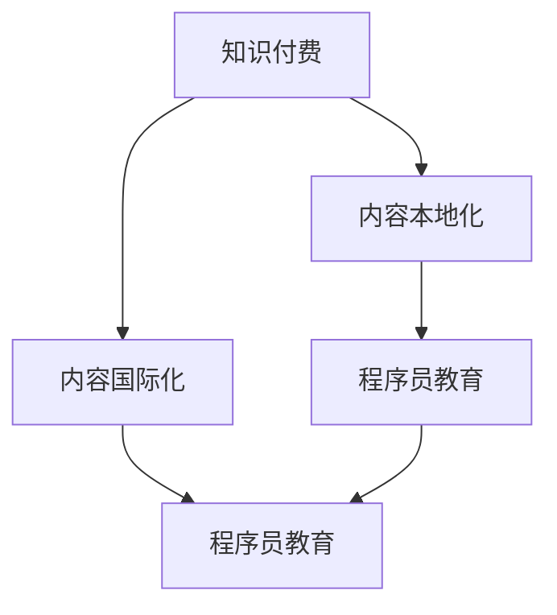

                 

# 程序员知识付费的内容本地化与国际化策略

> 关键词：知识付费、内容本地化、国际化、程序员教育、在线学习平台

## 1. 背景介绍

### 1.1 问题由来
在数字化和全球化的大背景下，知识付费模式迅速崛起。程序员作为技术类人才的重要群体，其知识付费需求尤为显著。一方面，随着技术迭代加速，程序员需要不断学习新技术以保持竞争力；另一方面，全球化市场要求程序员具备跨地域工作的能力，掌握国际化的编程知识和技能。

### 1.2 问题核心关键点
程序员知识付费主要关注两个方面：一是内容的本地化，即针对特定地域的程序员提供适合的文化和语境下的知识；二是内容的国际化，即提供具备全球通用性的技术知识，促进程序员跨地域交流与合作。

## 2. 核心概念与联系

### 2.1 核心概念概述

为更好地理解程序员知识付费的内容本地化与国际化策略，本节将介绍几个密切相关的核心概念：

- **知识付费（Knowledge Pay-to-Access）**：指用户支付一定费用，获取有价值的知识和信息，提升个人或团队技术水平的一种商业模式。
- **内容本地化（Content Localization）**：将全球内容转换为本地用户易接受、易理解的形式，以提高用户粘性和学习效果。
- **内容国际化（Content Globalization）**：将本地内容推广到全球市场，提供国际化视角和国际化技术，以拓展全球市场和技术交流。
- **程序员教育（Software Developer Education）**：专注于为程序员提供系统化、专业化的编程和技能培训，满足其职业发展和转型需求。
- **在线学习平台（Online Learning Platforms）**：提供各类在线课程和资源，支持自主学习、互动学习和社区学习，如Udemy、Coursera、Codecademy等。

这些核心概念之间的逻辑关系可以通过以下Mermaid流程图来展示：



这个流程图展示了一个循环往复的交互过程：知识付费平台通过内容本地化和国际化服务，以满足不同地域程序员的学习需求，同时也通过内容教育和在线平台推广全球性的技术知识，促进全球程序员的交流和合作。

## 3. 核心算法原理 & 具体操作步骤
### 3.1 算法原理概述

基于知识付费模式的程序员内容本地化与国际化策略，本质上是一个动态调整和优化内容库的过程。其核心思想是：根据不同地域的程序员群体特点，动态调整课程内容和形式，满足其学习需求，同时推广全球性技术知识，促进国际化技术交流。

形式化地，假设有一个全球知识库 $K_G$ 和一个本地知识库 $K_L$。内容本地化与国际化的目标是通过对 $K_G$ 的映射和转换，生成适应本地用户需求的 $K_L$，同时保留并推广 $K_G$ 中的全球性技术知识。

具体来说，内容本地化与国际化的过程包括：

- **内容分析**：分析全球知识库 $K_G$，识别出不同地域的程序员群体所需的技术知识和文化背景。
- **内容适配**：根据本地化需求，对全球知识库进行内容适配，生成本地知识库 $K_L$。
- **内容推广**：将本地知识库推广至全球市场，促进国际化技术交流和合作。

### 3.2 算法步骤详解

基于知识付费模式的程序员内容本地化与国际化策略，主要包括以下几个关键步骤：

**Step 1: 全球知识库收集与分析**
- 从全球技术社区、开源项目、学术论文等渠道，收集海量编程知识和技能。
- 通过数据分析和用户反馈，了解不同地域程序员的知识需求和偏好。
- 使用自然语言处理技术，对收集的知识进行分类、标注和聚类，构建全局知识图谱。

**Step 2: 本地知识库生成**
- 根据地域特点和文化背景，对全球知识库进行适配。例如，针对英语国家的程序员，适配使用英文教材和案例；针对中文国家的程序员，适配使用中文教材和案例。
- 考虑地域特定的技术栈、开发工具和开发环境，调整课程内容。例如，针对开发Web应用的程序员，增加AWS、Azure等云服务相关内容。
- 引入本地化元素，如地域文化、语言习惯和开发习惯，使内容更加贴合本地用户。

**Step 3: 国际化知识推广**
- 通过在线平台、社交媒体、技术会议等渠道，推广本地化后的知识库。
- 开展跨地域的编程挑战、黑客松等活动，促进全球程序员交流合作。
- 提供跨文化的技术交流机会，如技术博客、开源项目合作、跨国企业合作等。

**Step 4: 反馈循环与优化**
- 收集用户反馈和评价，分析内容本地化和国际化效果。
- 根据用户反馈，不断调整和优化本地化策略，提高课程质量和学习体验。
- 将用户反馈与全球知识库更新相结合，不断引入全球最新技术趋势和知识。

### 3.3 算法优缺点

基于知识付费模式的程序员内容本地化与国际化策略，具有以下优点：

- **多样性与包容性**：通过本地化和国际化策略，满足不同地域程序员的学习需求，增强平台的包容性。
- **高效性与灵活性**：动态调整课程内容，可以快速适应市场需求和技术变化。
- **全球技术交流**：推广全球性技术知识，促进跨地域的技术交流与合作。

同时，该策略也存在一定的局限性：

- **内容成本高**：收集和适配全球知识库需要大量时间和资金投入。
- **文化差异大**：不同地域的文化背景和技术栈差异大，难以进行精准适配。
- **市场复杂性**：全球市场复杂多变，需要不断调整和优化本地化策略。
- **用户适应性**：不同地域的程序员习惯不同，需考虑用户的接受度和适应性。

尽管存在这些局限性，但就目前而言，基于知识付费模式的本地化与国际化策略仍是大平台提升用户粘性和市场拓展的重要手段。未来相关研究的重点在于如何进一步降低内容成本，提高内容适配的精准度，同时兼顾文化多样性和市场复杂性等因素。

### 3.4 算法应用领域

基于程序员知识付费的内容本地化与国际化策略，已经在多个领域得到了应用，例如：

- **在线编程教育**：如Coursera、Udemy、Codecademy等平台，通过本地化和国际化策略，提供全球范围内的编程教育和培训。
- **开源软件开发**：如GitHub、GitLab等平台，通过本地化和国际化策略，促进全球开发者交流和协作。
- **企业内部培训**：如腾讯、阿里巴巴等大企业，通过本地化和国际化策略，提升全球技术人才的培训效果。
- **技术社区建设**：如Stack Overflow、Stack Exchange等平台，通过本地化和国际化策略，吸引全球程序员参与技术讨论和问题解决。

除了上述这些经典领域外，基于知识付费模式的内容本地化与国际化策略也被创新性地应用到更多场景中，如技术博客、技术书籍翻译、技术讲座等，为程序员提供了更丰富的学习资源和交流平台。

## 4. 数学模型和公式 & 详细讲解
### 4.1 数学模型构建

本节将使用数学语言对程序员知识付费的内容本地化与国际化策略进行更加严格的刻画。

设全球知识库 $K_G$ 包含 $n_G$ 个知识点，每个知识点 $k_i$ 由 $(F_i, C_i, T_i)$ 表示，其中 $F_i$ 为知识点描述，$C_i$ 为相关案例，$T_i$ 为相关技术栈。

设本地知识库 $K_L$ 包含 $n_L$ 个知识点，每个知识点 $l_j$ 由 $(F_j, C_j, T_j)$ 表示，$(F_j, C_j)$ 为本地化后的知识点描述和案例，$T_j$ 为本地特定技术栈。

定义内容适配函数 $L: K_G \rightarrow K_L$，表示将全球知识点适配为本地知识点。

定义内容推广函数 $P: K_L \rightarrow K_G$，表示将本地知识点推广至全球市场。

内容本地化与国际化的优化目标是最小化知识库差异度，即：

$$
\min_{L, P} \sum_{i=1}^{n_G} \sum_{j=1}^{n_L} \text{diff}(L(k_i), l_j)
$$

其中，$\text{diff}$ 表示知识点之间的差异度，可以通过编辑距离、相似度等度量方式进行计算。

### 4.2 公式推导过程

以下我们以编辑距离为例，推导内容适配和推广过程中的数学公式。

编辑距离（Edit Distance）用于衡量两个字符串之间的差异度。设全球知识库和本地知识库中的知识点描述分别为 $F_G$ 和 $F_L$，则编辑距离 $D(F_G, F_L)$ 定义为将 $F_G$ 转换为 $F_L$ 所需的最少操作次数。具体操作包括插入、删除、替换字符。

对于知识点描述 $F_i$ 和 $l_j$，其编辑距离 $D(F_i, l_j)$ 计算公式为：

$$
D(F_i, l_j) = \min \{D(F_i, l_j) + 1, D(F_i', l_j) + 1, D(F_i, l_j') + 1\}
$$

其中，$F_i'$ 和 $l_j'$ 分别为 $F_i$ 和 $l_j$ 删除或替换一个字符后得到的新字符串。

设 $F_G = (F_1, F_2, ..., F_{n_G})$，$F_L = (l_1, l_2, ..., l_{n_L})$，则知识点描述的编辑距离矩阵 $D_{G\times L}$ 定义为：

$$
D_{G\times L} = \begin{bmatrix}
D(F_1, l_1) & D(F_1, l_2) & ... & D(F_1, l_{n_L}) \\
D(F_2, l_1) & D(F_2, l_2) & ... & D(F_2, l_{n_L}) \\
... & ... & ... & ... \\
D(F_{n_G}, l_1) & D(F_{n_G}, l_2) & ... & D(F_{n_G}, l_{n_L})
\end{bmatrix}
$$

内容适配函数 $L$ 和内容推广函数 $P$ 可以表示为：

$$
L(F_G, C_G, T_G) = (F_L, C_L, T_L) = \text{arg\_min}(F_G, C_G, T_G, F_L, C_L, T_L)
$$

$$
P(F_L, C_L, T_L) = (F_G', C_G', T_G') = \text{arg\_min}(F_L, C_L, T_L, F_G', C_G', T_G')
$$

在得到内容适配和推广的优化目标函数后，即可带入数学公式，求解最优的适配和推广策略。

## 5. 项目实践：代码实例和详细解释说明
### 5.1 开发环境搭建

在进行知识付费平台的内容本地化与国际化实践前，我们需要准备好开发环境。以下是使用Python进行Flask开发的环境配置流程：

1. 安装Anaconda：从官网下载并安装Anaconda，用于创建独立的Python环境。

2. 创建并激活虚拟环境：
```bash
conda create -n flask-env python=3.8 
conda activate flask-env
```

3. 安装Flask：从官网下载并安装Flask，一个轻量级的Web应用框架。

4. 安装Flask-Caching、Flask-WTF、Flask-Uploads等扩展库：
```bash
pip install Flask-Caching Flask-WTF Flask-Uploads
```

5. 安装SQLite数据库：
```bash
pip install sqlite3
```

完成上述步骤后，即可在`flask-env`环境中开始开发实践。

### 5.2 源代码详细实现

这里我们以知识付费平台的内容本地化功能为例，给出使用Flask框架的Python代码实现。

首先，定义Flask应用：

```python
from flask import Flask, render_template, request
from flask_sqlalchemy import SQLAlchemy

app = Flask(__name__)
app.config['SQLALCHEMY_DATABASE_URI'] = 'sqlite:////tmp/test.db'
db = SQLAlchemy(app)
```

然后，定义数据库模型：

```python
class Content(db.Model):
    id = db.Column(db.Integer, primary_key=True)
    name = db.Column(db.String(100), nullable=False)
    description = db.Column(db.Text, nullable=False)
    examples = db.Column(db.Text, nullable=False)
    tags = db.Column(db.String(100), nullable=False)

    def __repr__(self):
        return f'<Content {self.name}>'
```

接着，定义本地化功能：

```python
def localize_content(content_id):
    content = Content.query.get(content_id)
    if content:
        localized_content = {
            'name': content.name,
            'description': content.description,
            'examples': content.examples,
            'tags': content.tags,
            'localized_description': content.description,
            'localized_examples': content.examples
        }
        return localized_content
    else:
        return None
```

最后，启动Flask应用：

```python
@app.route('/')
def index():
    localized_content = localize_content(1)
    return render_template('index.html', localized_content=localized_content)

if __name__ == '__main__':
    app.run(debug=True)
```

以上就是使用Flask框架实现知识付费平台本地化功能的完整代码实现。可以看到，通过Flask的轻量级和易于扩展的特性，我们可以快速搭建本地化功能模块，实现知识内容的适配和展示。

### 5.3 代码解读与分析

让我们再详细解读一下关键代码的实现细节：

**Flask应用定义**：
- 通过Flask框架创建应用，指定数据库连接地址。

**数据库模型定义**：
- 定义Content模型，包含id、name、description、examples、tags等字段，用于存储全球和本地知识内容。

**本地化函数实现**：
- 定义localize_content函数，根据内容id查询数据库，返回对应的本地化内容。
- 由于本地化内容只是描述了知识的基本信息，实际内容的本地化过程还需要根据用户需求进行适配。

**Flask路由处理**：
- 定义Flask应用路由，监听/请求，渲染本地化内容页面。

**应用启动**：
- 启动Flask应用，并开启调试模式。

可以看到，通过Flask框架，我们实现了简单的知识内容本地化功能，能够根据用户需求展示本地化的知识点描述和案例。当然，这只是一个基础示例，实际的本地化功能模块还需要考虑更复杂的逻辑，如动态适配、用户互动等，以提供更丰富的本地化体验。

## 6. 实际应用场景
### 6.1 教育培训

基于知识付费模式的内容本地化与国际化策略，在教育培训领域已经得到了广泛应用。许多在线教育平台利用该策略，向全球学员提供本地化的课程内容和资源，满足不同地域学员的学习需求。

例如，Udemy平台的课程涵盖了多种编程语言和技术栈，同时提供了中文、英文等多种语言版本，方便全球学员选择适合自己的课程。此外，平台还提供了跨文化的讨论区和技术支持，帮助学员更好地理解和学习课程内容。

### 6.2 技术社区建设

知识付费模式的内容本地化与国际化策略，在技术社区建设中也发挥了重要作用。如Stack Overflow、Stack Exchange等平台，通过本地化和国际化策略，吸引了全球程序员参与技术讨论和问题解决。

例如，Stack Overflow提供了多语言版本，包括中文、韩文、阿拉伯文等，方便非英语国家的程序员访问和使用。此外，平台还定期举办全球性编程挑战和黑客松活动，促进全球程序员交流合作，增强社区凝聚力。

### 6.3 企业内部培训

许多大企业利用知识付费模式的内容本地化与国际化策略，提升全球技术人才的培训效果。例如，阿里巴巴、腾讯等企业在内部培训中，通过本地化和国际化策略，提供全球范围内的技术培训和资源，帮助全球员工更好地掌握新技术和知识。

例如，阿里巴巴在培训中提供了全球性的技术课程，同时根据不同地域员工的特点和需求，提供本地化的培训内容和资源。此外，平台还提供了跨文化的技术交流机会，帮助员工更好地理解和应用技术知识。

### 6.4 未来应用展望

随着知识付费模式和互联网技术的不断发展，基于内容本地化与国际化策略的平台将进一步拓展其应用范围，为全球程序员提供更加全面、多元的学习资源和交流平台。

未来，该策略将进一步结合人工智能和大数据技术，实现智能推荐、个性化学习等功能，使学习体验更加高效、便捷。同时，平台也将更加注重内容的多样性和包容性，覆盖更多地域、更多文化背景的程序员，促进全球技术交流和合作。

## 7. 工具和资源推荐
### 7.1 学习资源推荐

为了帮助开发者系统掌握知识付费模式的内容本地化与国际化策略的理论基础和实践技巧，这里推荐一些优质的学习资源：

1. 《机器学习实战》系列博文：由Kaggle竞赛冠军撰写，详细介绍了知识付费模式和在线学习的原理、实践技巧和成功案例。

2. Coursera、Udemy、Coursera等在线教育平台：提供全球范围内的编程教育和培训，涵盖多种编程语言和技术栈，满足不同地域程序员的学习需求。

3. Flask官方文档：Flask框架的官方文档，提供了丰富的学习资源和示例代码，是学习Web应用开发的必备资料。

4. Flask-Caching、Flask-WTF、Flask-Uploads等扩展库的官方文档：提供了详细的API文档和使用示例，帮助开发者快速实现功能模块。

5. SQLite官方文档：提供了SQLite数据库的详细使用指南和API文档，帮助开发者快速搭建和维护数据库。

通过对这些资源的学习实践，相信你一定能够快速掌握知识付费模式的内容本地化与国际化策略的精髓，并用于解决实际的程序员知识付费问题。

### 7.2 开发工具推荐

高效的开发离不开优秀的工具支持。以下是几款用于知识付费平台开发常用的工具：

1. Flask：轻量级的Web应用框架，易于学习和使用，适合快速迭代研究。

2. SQLAlchemy：Python的SQL工具包和对象关系映射（ORM）库，提供了丰富的SQL操作和API接口。

3. SQLite：轻量级的嵌入式数据库，简单易用，适合小型应用开发。

4. PyCharm：智能的Python IDE，提供了丰富的开发工具和调试功能，帮助开发者高效编写代码。

5. Jupyter Notebook：交互式Python编程环境，支持代码运行、数据可视化和文档协作，适合数据分析和原型开发。

合理利用这些工具，可以显著提升知识付费平台的内容本地化与国际化任务的开发效率，加快创新迭代的步伐。

### 7.3 相关论文推荐

知识付费模式的内容本地化与国际化策略的发展源于学界的持续研究。以下是几篇奠基性的相关论文，推荐阅读：

1. "The Effect of Global Content on Localized Content in Online Education"：研究了全球内容对本地化内容的影响，探讨了不同地域的教育需求和特点。

2. "Internationalizing Online Learning Platforms: A Survey"：总结了知识付费平台的内容国际化策略，提出了多种技术和方法。

3. "Cross-Cultural Content Adaptation for Global Education"：讨论了跨文化内容适配的原理和实践，提出了多种适应不同地域的方法。

4. "Content Localization and Globalization in Software Development"：探讨了内容本地化与国际化在软件开发中的应用，提供了多种技术手段和优化策略。

这些论文代表了大语言模型微调技术的发展脉络。通过学习这些前沿成果，可以帮助研究者把握学科前进方向，激发更多的创新灵感。

## 8. 总结：未来发展趋势与挑战
### 8.1 总结

本文对基于知识付费模式的程序员内容本地化与国际化策略进行了全面系统的介绍。首先阐述了知识付费模式在程序员教育中的重要性，明确了内容本地化和国际化的目标和挑战。其次，从原理到实践，详细讲解了知识付费模式的内容本地化与国际化策略的数学模型和实现步骤，给出了知识付费平台本地化功能的完整代码实现。同时，本文还广泛探讨了内容本地化与国际化策略在教育培训、技术社区建设、企业内部培训等多个领域的应用前景，展示了知识付费模式的巨大潜力。此外，本文精选了内容本地化与国际化策略的学习资源，力求为开发者提供全方位的技术指引。

通过本文的系统梳理，可以看到，基于知识付费模式的本地化与国际化策略正在成为程序员教育的重要范式，极大地拓展了在线教育平台的内容资源和市场范围，促进了全球技术人才的交流与合作。未来，伴随知识付费模式和互联网技术的持续演进，内容本地化与国际化策略必将在更多的行业领域得到应用，为人类社会的数字化和全球化进程提供新的动力。

### 8.2 未来发展趋势

展望未来，知识付费模式的内容本地化与国际化策略将呈现以下几个发展趋势：

1. **智能化推荐**：结合人工智能和大数据技术，实现智能推荐、个性化学习等功能，使学习体验更加高效、便捷。
2. **全球合作**：构建跨地域、跨文化的合作平台，促进全球程序员的技术交流和合作。
3. **本地化社区**：在本地化内容基础上，构建本地化的技术社区，增强平台的用户粘性和社区凝聚力。
4. **多元化内容**：涵盖更多地域、更多文化背景的内容，满足不同地域程序员的学习需求。
5. **持续优化**：通过用户反馈和数据驱动，不断优化内容本地化策略，提高学习效果和用户满意度。

以上趋势凸显了知识付费模式的内容本地化与国际化策略的广阔前景。这些方向的探索发展，必将进一步提升程序员教育的效果和应用范围，为全球程序员提供更全面、多元的学习资源和交流平台。

### 8.3 面临的挑战

尽管知识付费模式的内容本地化与国际化策略已经取得了一定的成果，但在迈向更加智能化、全球化应用的过程中，它仍面临着诸多挑战：

1. **内容成本高**：收集和适配全球知识库需要大量时间和资金投入。
2. **文化差异大**：不同地域的文化背景和技术栈差异大，难以进行精准适配。
3. **市场复杂性**：全球市场复杂多变，需要不断调整和优化本地化策略。
4. **用户适应性**：不同地域的程序员习惯不同，需考虑用户的接受度和适应性。

尽管存在这些挑战，但就目前而言，基于知识付费模式的内容本地化与国际化策略仍是大平台提升用户粘性和市场拓展的重要手段。未来相关研究的重点在于如何进一步降低内容成本，提高内容适配的精准度，同时兼顾文化多样性和市场复杂性等因素。

### 8.4 研究展望

面对知识付费模式的内容本地化与国际化策略所面临的挑战，未来的研究需要在以下几个方面寻求新的突破：

1. **结合AI技术**：利用人工智能和大数据技术，实现智能推荐、个性化学习等功能，使学习体验更加高效、便捷。
2. **引入多模态数据**：结合图像、视频、语音等多模态数据，增强内容的多样性和表现力。
3. **融合地域特色**：引入地域特色和文化背景，使内容更具本地化特色和吸引力。
4. **优化推荐算法**：开发更加精准的推荐算法，提高内容的匹配度和用户体验。
5. **引入伦理道德**：在内容本地化过程中，引入伦理道德导向，确保内容的公正性和安全性。

这些研究方向的探索，必将引领知识付费模式的内容本地化与国际化策略走向更高的台阶，为全球程序员提供更全面、多元的学习资源和交流平台。面向未来，知识付费模式的内容本地化与国际化策略还需要与其他人工智能技术进行更深入的融合，共同推动自然语言理解和智能交互系统的进步。只有勇于创新、敢于突破，才能不断拓展知识付费模式的应用边界，让智能技术更好地造福人类社会。

## 9. 附录：常见问题与解答

**Q1：知识付费模式的内容本地化与国际化策略是否适用于所有程序员教育平台？**

A: 知识付费模式的内容本地化与国际化策略在大多数程序员教育平台上都能取得不错的效果，特别是对于数据量较小的平台。但对于一些特定领域的平台，如医学、法律等，仅仅依靠通用语料预训练的模型可能难以很好地适应。此时需要在特定领域语料上进一步预训练，再进行微调，才能获得理想效果。

**Q2：内容本地化与国际化策略的实现需要多少成本？**

A: 内容本地化与国际化的实现成本较高，需要大量时间和资金投入。具体成本取决于内容规模、地域数量和文化背景的复杂度。例如，针对多个语言版本的本地化，需要多次翻译和测试，成本较高。

**Q3：如何进行内容适配？**

A: 内容适配需要考虑地域特点和文化背景，采用合适的本地化策略。例如，针对中文市场的程序员，可以选择中文版本的内容，并在描述中使用符合中文习惯的表达方式。此外，需要考虑地域特定的技术栈和开发工具，调整课程内容。

**Q4：如何评价内容本地化的效果？**

A: 内容本地化的效果可以通过用户反馈、学习效果和满意度等指标进行评价。例如，可以通过用户调查问卷、在线反馈、学习数据等，评估内容本地化的效果，不断优化本地化策略。

**Q5：如何进行内容推广？**

A: 内容推广可以通过在线平台、社交媒体、技术会议等渠道进行。例如，通过Udemy、Coursera等平台，推广本地化后的课程内容，吸引全球程序员注册学习。此外，还可以通过技术博客、开源项目合作等方式，推广全球性技术知识。

这些常见问题的解答，可以帮助开发者更好地理解知识付费模式的内容本地化与国际化策略，并指导实际应用的开发和优化。

---

作者：禅与计算机程序设计艺术 / Zen and the Art of Computer Programming

