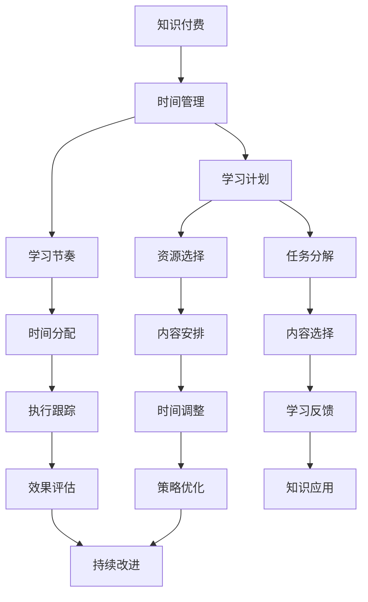

                 

# 程序员知识付费的时间管理策略

## 1. 背景介绍

### 1.1 问题由来

随着知识付费时代的到来，程序员们面临着越来越多的在线学习资源。无论是视频课程、在线文档、技术博客还是社区讨论，都为程序员提供了丰富的学习材料。然而，信息的海洋不仅带来了知识，也带来了选择上的困惑。如何在海量的学习资源中找到适合自己的内容，如何在有限的时间内高效利用资源，成为程序员普遍关心的问题。

### 1.2 问题核心关键点

有效的时间管理，是知识付费时代程序员提高学习效率的关键。高效的时间管理不仅能够帮助程序员更好地规划学习时间，还能够避免在信息过载的环境中迷失方向。其核心在于如何制定学习计划、选择合适的内容、掌握学习节奏，以及如何在学习与工作之间找到平衡。

### 1.3 问题研究意义

掌握高效的时间管理策略，可以帮助程序员在繁忙的工作与学习中找到平衡点，提升学习效率和工作表现，加速个人技能提升。同时，这也能够帮助程序员更好地利用知识付费资源，确保每一份投资都能转化为实实在在的收益。研究高效的时间管理方法，对于推动知识付费平台的发展，提升在线学习资源的利用率，具有重要的理论和实践意义。

## 2. 核心概念与联系

### 2.1 核心概念概述

在探讨程序员知识付费的时间管理策略时，我们需要引入几个核心概念：

- **知识付费**：指用户为获取特定知识或技能，通过支付费用获取学习资源的行为。
- **时间管理**：指通过合理安排时间，高效利用时间资源，实现既定目标的过程。
- **学习计划**：指为了达成特定学习目标，对学习时间和内容进行规划的方案。
- **学习节奏**：指在学习过程中，如何安排时间和休息，保持学习效率和质量。

这些概念之间存在紧密联系，共同构成了程序员高效利用知识付费资源的基础。通过明确这些概念，我们可以更好地理解和应用时间管理策略。

### 2.2 核心概念原理和架构的 Mermaid 流程图



这个流程图展示了知识付费、时间管理、学习计划、学习节奏等多个概念之间的联系和作用路径。通过这些概念的相互协作，程序员可以更好地管理时间，提升学习效果。

## 3. 核心算法原理 & 具体操作步骤

### 3.1 算法原理概述

基于知识付费的时间管理，本质上是利用时间序列分析和学习算法，对用户的学习行为和效果进行预测和优化。其核心思想是通过对学习计划、学习节奏、资源选择等方面的综合考虑，制定出最佳的学习方案，并根据实际效果进行迭代优化。

形式化地，设用户的学习时间为 $T$，学习内容为 $C$，学习目标为 $G$，则时间管理的目标是找到最优的 $T$ 和 $C$，使得 $G$ 最大化。具体来说，可以通过以下步骤来实现：

1. 收集用户的学习行为数据，如学习时长、频率、内容偏好等。
2. 分析学习效果，建立学习内容与学习效果之间的关联模型。
3. 制定初步的学习计划，选择合适的学习内容。
4. 根据学习效果反馈，调整学习计划和节奏。
5. 不断迭代，优化学习计划和内容选择。

### 3.2 算法步骤详解

基于知识付费的时间管理算法可以分为以下几个步骤：

**Step 1: 数据收集与分析**
- 收集用户的学习行为数据，包括学习时长、频率、学习内容等。
- 分析这些数据，了解用户的学习习惯、偏好和效果。

**Step 2: 建立学习模型**
- 根据收集到的数据，建立学习内容与学习效果之间的关联模型。
- 选择合适的学习模型，如回归模型、分类模型等。

**Step 3: 制定学习计划**
- 根据学习模型预测，制定初步的学习计划。
- 选择最适合用户的学习内容，考虑到用户的兴趣和技能水平。

**Step 4: 调整学习节奏**
- 根据学习计划和用户反馈，调整学习时间和节奏。
- 引入学习节奏优化算法，如动态规划、模拟退火等。

**Step 5: 持续优化**
- 根据学习效果，不断调整学习计划和内容选择。
- 引入机器学习算法，进行学习计划的迭代优化。

**Step 6: 效果评估与反馈**
- 评估学习计划的效果，收集用户反馈。
- 根据反馈结果，优化学习计划和学习模型。

### 3.3 算法优缺点

基于知识付费的时间管理算法具有以下优点：
1. 个性化定制：能够根据用户的个性化需求和学习效果，定制化的制定学习计划。
2. 动态调整：能够根据用户的学习进度和效果，动态调整学习时间和内容。
3. 提高效率：通过优化学习计划和内容选择，显著提高学习效率。
4. 灵活性强：适用于不同学习目标和内容的选择，具有较好的泛化能力。

同时，该算法也存在以下缺点：
1. 数据依赖：依赖于用户的学习行为数据，数据质量直接影响算法效果。
2. 模型复杂：建立学习模型的过程较为复杂，需要较强的数据处理和建模能力。
3. 用户适应性：模型需要经过一段时间的训练才能达到最佳效果，用户适应性较低。
4. 可解释性：学习模型的决策过程较为复杂，难以直观理解。

尽管存在这些局限性，但该算法仍是大规模知识付费用户有效时间管理的重要工具。未来相关研究的重点在于如何进一步降低数据依赖，提高模型的可解释性和适应性。

### 3.4 算法应用领域

基于知识付费的时间管理算法，已经在多个领域得到了应用：

1. 在线教育：通过分析学生学习行为和效果，定制化推荐学习计划和内容，提升学习效果。
2. 企业培训：帮助企业员工制定个性化的学习计划，提升职业技能。
3. 个人发展：帮助个人用户优化学习时间，提升自我技能和职业竞争力。
4. 在线文档阅读：推荐最符合用户需求的阅读内容和路径，提升知识获取效率。
5. 社区讨论：推荐最相关的学习资源和讨论内容，促进社区知识共享。

## 4. 数学模型和公式 & 详细讲解 & 举例说明

### 4.1 数学模型构建

设用户的学习时间为 $T$，学习内容为 $C$，学习目标为 $G$，则时间管理的数学模型可以表示为：

$$
\max_{T,C} G(T,C)
$$

其中 $G(T,C)$ 为学习目标的函数，可以通过以下方式定义：

- $G$ 为完成任务的收益函数，如学习时长与学习效果的乘积。
- $T$ 为学习时间，需要考虑用户可用的实际时间。
- $C$ 为学习内容，需要考虑用户的学习兴趣和目标需求。

### 4.2 公式推导过程

以回归模型为例，推导学习内容与学习效果之间的关联模型。假设学习内容 $C$ 与学习效果 $y$ 之间的关系为线性回归模型：

$$
y = \beta_0 + \beta_1 x_1 + \beta_2 x_2 + \ldots + \beta_n x_n + \epsilon
$$

其中 $x_i$ 为学习内容的特征向量，$\epsilon$ 为误差项。通过最小化误差 $\epsilon$，求解系数 $\beta_i$，即可得到学习内容与学习效果之间的关联模型。

### 4.3 案例分析与讲解

假设用户 A 在在线教育平台上学习 Python 编程。根据用户 A 的学习行为数据，我们可以建立学习内容与学习效果之间的关联模型。设学习内容 $C$ 为课程难度、课程时长、课程评价等特征，学习效果 $y$ 为课程通过率。

通过回归分析，我们可以得到如下模型：

$$
y = 0.5x_1 - 0.2x_2 + 0.3x_3 + \epsilon
$$

其中 $x_1$ 为课程难度，$x_2$ 为课程时长，$x_3$ 为课程评价。根据该模型，我们可以预测用户 A 在不同课程上的通过率，并制定最佳学习计划。

## 5. 项目实践：代码实例和详细解释说明

### 5.1 开发环境搭建

在进行时间管理算法实践前，我们需要准备好开发环境。以下是使用Python进行PyTorch开发的环境配置流程：

1. 安装Anaconda：从官网下载并安装Anaconda，用于创建独立的Python环境。

2. 创建并激活虚拟环境：
```bash
conda create -n pytorch-env python=3.8 
conda activate pytorch-env
```

3. 安装PyTorch：根据CUDA版本，从官网获取对应的安装命令。例如：
```bash
conda install pytorch torchvision torchaudio cudatoolkit=11.1 -c pytorch -c conda-forge
```

4. 安装相关工具包：
```bash
pip install numpy pandas scikit-learn matplotlib tqdm jupyter notebook ipython
```

完成上述步骤后，即可在`pytorch-env`环境中开始时间管理算法的开发实践。

### 5.2 源代码详细实现

首先，定义时间管理算法的核心模块：

```python
import numpy as np
import pandas as pd
from sklearn.linear_model import LinearRegression
from sklearn.metrics import mean_squared_error

def fit_model(data):
    X = data[['x1', 'x2', 'x3']] # 学习内容特征
    y = data['y'] # 学习效果
    model = LinearRegression().fit(X, y)
    return model

def predict(user, model):
    X = user[['x1', 'x2', 'x3']] # 用户学习内容特征
    y_pred = model.predict(X)
    return y_pred
```

然后，构建学习数据集：

```python
data = pd.read_csv('learning_data.csv') # 读取学习数据
```

接着，构建用户A的学习行为数据：

```python
user_A = pd.read_csv('user_A_data.csv') # 读取用户A学习行为数据
```

最后，使用用户A的学习行为数据进行模型训练，并预测其学习效果：

```python
model = fit_model(data)
y_pred = predict(user_A, model)
print(y_pred)
```

### 5.3 代码解读与分析

让我们再详细解读一下关键代码的实现细节：

**fit_model函数**：
- 将学习内容特征和效果数据作为输入，使用线性回归模型进行拟合。

**predict函数**：
- 根据用户的学习内容特征，使用训练好的模型进行预测。

**data和user_A数据集**：
- data数据集包含学习内容特征和效果数据。
- user_A数据集包含用户A的学习行为数据。

这些函数和数据集可以构成一个简单的基于知识付费的时间管理算法模型。通过构建学习模型，我们可以对用户的学习效果进行预测，并据此制定个性化的学习计划。

## 6. 实际应用场景

### 6.1 在线教育平台

在线教育平台通过分析用户的学习行为和效果，为每位用户定制个性化的学习计划。例如，平台可以根据用户的学习时长、课程评价、答题成绩等数据，预测用户在不同课程上的通过率，推荐最适合的学习路径和时间安排，帮助用户高效学习。

### 6.2 企业培训系统

企业培训系统利用时间管理算法，为员工制定个性化的培训计划。通过分析员工的培训需求和学习效果，系统推荐最适合的培训内容和路径，同时调整培训时间和节奏，确保员工在有限的时间内获得最大化的收益。

### 6.3 个人学习计划

个人用户可以通过时间管理算法，优化自己的学习计划。例如，用户可以在周末选择适合自己的学习内容，并根据学习效果调整学习时间和节奏，确保在忙碌的工作和生活中，能够高效地提升自我技能。

## 7. 工具和资源推荐

### 7.1 学习资源推荐

为了帮助开发者系统掌握时间管理算法的理论基础和实践技巧，这里推荐一些优质的学习资源：

1. 《时间管理：系统化工作方法的实用指南》：由时间管理专家撰写，详细讲解了时间管理的基本原理和实用技巧。
2. 《深度学习实战：Python编程实践》：介绍了时间管理算法的理论基础和实现方法，并提供了大量代码实例。
3. 《机器学习实战》：讲解了机器学习的基本原理和算法，对时间管理算法的建模和优化有详细说明。
4. Kaggle时间管理算法竞赛：通过参与实际竞赛，学习时间管理算法的应用和优化方法。
5. GitHub时间管理算法开源项目：通过阅读和参与开源项目，了解时间管理算法的实际应用场景和实现细节。

通过这些资源的学习实践，相信你一定能够快速掌握时间管理算法的精髓，并用于解决实际的时间管理问题。

### 7.2 开发工具推荐

高效的开发离不开优秀的工具支持。以下是几款用于时间管理算法开发的常用工具：

1. Python：简单易学的高级编程语言，拥有丰富的第三方库和工具，非常适合科学计算和数据处理。
2. PyTorch：基于Python的开源深度学习框架，支持动态计算图，适合快速迭代研究。
3. Jupyter Notebook：交互式的编程环境，方便进行数据处理和模型训练。
4. Scikit-learn：Python科学计算库，包含各种机器学习算法，适合进行时间管理算法的建模和优化。
5. Pandas：Python数据分析库，适合处理和学习数据。

合理利用这些工具，可以显著提升时间管理算法的开发效率，加快创新迭代的步伐。

### 7.3 相关论文推荐

时间管理算法的研究源于学界的持续研究。以下是几篇奠基性的相关论文，推荐阅读：

1. A Time Management System Using Genetic Algorithm：引入遗传算法，优化学习计划的制定和调整。
2. Personalized Learning Plan Design Using SVM：使用支持向量机算法，根据用户特征和效果，预测最优学习计划。
3. Predicting Learning Success Using Machine Learning Algorithms：通过多种机器学习算法，预测学习效果和调整学习计划。
4. An Optimal Time Management Model for Project Scheduling：建立时间管理模型，优化项目调度。
5. A Time Management System Based on Data Mining：引入数据挖掘技术，优化时间管理系统的构建。

这些论文代表了大规模知识付费用户时间管理的研究脉络。通过学习这些前沿成果，可以帮助研究者把握学科前进方向，激发更多的创新灵感。

## 8. 总结：未来发展趋势与挑战

### 8.1 总结

本文对基于知识付费的时间管理算法进行了全面系统的介绍。首先阐述了时间管理算法的研究背景和意义，明确了算法在帮助程序员提高学习效率方面的独特价值。其次，从原理到实践，详细讲解了时间管理算法的数学原理和关键步骤，给出了时间管理算法开发的完整代码实例。同时，本文还广泛探讨了时间管理算法在在线教育、企业培训、个人学习等多个领域的应用前景，展示了算法的重要价值。此外，本文精选了时间管理算法的各类学习资源，力求为读者提供全方位的技术指引。

通过本文的系统梳理，可以看到，基于知识付费的时间管理算法为程序员提供了一种高效的时间管理工具，帮助他们更好地规划学习时间和内容，提升学习效率和工作表现。未来，伴随时间管理算法的不断发展，相信时间管理技术将为知识付费平台的发展提供新的动力，推动在线学习资源的利用率不断提升。

### 8.2 未来发展趋势

展望未来，时间管理算法将呈现以下几个发展趋势：

1. 个性化进一步增强。通过更深入的数据挖掘和建模，时间管理算法将能够为每位用户制定更加个性化的学习计划。
2. 动态调整更加灵活。随着学习效果的实时反馈，时间管理算法将能够更加灵活地调整学习计划和内容选择。
3. 模型复杂度提升。随着算法的不断优化，时间管理算法的模型复杂度将进一步提升，能够处理更复杂的学习场景。
4. 多模态数据整合。时间管理算法将能够整合视觉、语音、文本等多种模态的数据，提升学习效果的预测准确性。
5. 跨领域应用拓展。时间管理算法不仅适用于在线学习，还将在更多领域得到应用，如企业培训、个人时间管理等。

以上趋势展示了时间管理算法的广阔前景。这些方向的探索发展，必将进一步提升时间管理算法的精准性和适用性，为知识付费平台提供更有价值的服务。

### 8.3 面临的挑战

尽管时间管理算法已经取得了一定的成就，但在迈向更加智能化、普适化应用的过程中，它仍面临着诸多挑战：

1. 数据质量问题。时间管理算法的准确性和效果很大程度上依赖于数据的质量和完整性。如何在数据稀缺或数据质量不高的场景下，依然能够取得良好的效果，是一个重要的研究方向。
2. 模型泛化能力。时间管理算法需要在不同的学习场景和数据集上取得泛化效果。如何在复杂的学习场景中，建立稳定的时间管理模型，是一个亟待解决的问题。
3. 用户适应性。时间管理算法需要适应不同用户的学习习惯和需求，如何设计更加友好和适应的用户界面，是一个重要的优化方向。
4. 系统可扩展性。随着用户数量的增加，时间管理算法的可扩展性将面临更大的挑战。如何在分布式环境中高效地处理海量数据，是一个重要的技术问题。
5. 资源优化。时间管理算法的资源优化是一个重要的研究方向，如何平衡模型的复杂度和计算效率，是一个亟待解决的问题。

尽管存在这些挑战，但时间管理算法的发展前景依然广阔，相信随着学界和产业界的共同努力，这些挑战终将一一被克服，时间管理算法必将在知识付费平台的发展中发挥更大的作用。

### 8.4 研究展望

面对时间管理算法所面临的挑战，未来的研究需要在以下几个方面寻求新的突破：

1. 引入更多先验知识。将符号化的先验知识，如知识图谱、逻辑规则等，与时间管理算法进行融合，引导算法学习更合理的时间管理策略。
2. 采用更加复杂的建模方法。引入更加复杂的机器学习算法，如深度学习、强化学习等，提升时间管理算法的预测准确性和动态调整能力。
3. 引入因果分析方法。将因果分析方法引入时间管理算法，识别出时间管理决策的关键特征，增强输出解释的因果性和逻辑性。
4. 构建多模态时间管理模型。引入多模态数据整合技术，提升时间管理算法的综合预测能力。
5. 引入对抗训练方法。通过对抗训练方法，提升时间管理算法的鲁棒性和稳定性，避免模型的过拟合和预测偏差。

这些研究方向展示了时间管理算法未来发展的潜力，相信通过这些研究的不断推进，时间管理算法将能够为知识付费平台提供更加精准、智能、高效的时间管理服务，助力程序员和知识付费用户实现高效学习。

## 9. 附录：常见问题与解答

**Q1：如何选择合适的学习内容？**

A: 选择合适的学习内容需要考虑用户的学习目标和兴趣。首先，了解用户的学习需求和目标，明确需要提升的技能。其次，根据用户的兴趣和学习习惯，选择合适的学习资源。最后，通过分析学习效果，不断调整学习内容，确保学习路径的有效性。

**Q2：如何调整学习时间和节奏？**

A: 调整学习时间和节奏需要考虑用户的实际工作和生活情况。首先，根据用户的学习目标和效果，制定初步的学习计划。其次，根据用户的学习反馈和状态，动态调整学习时间和节奏。最后，引入学习节奏优化算法，如动态规划、模拟退火等，优化学习时间和休息的分配。

**Q3：时间管理算法需要多少数据？**

A: 时间管理算法的训练和优化需要大量的学习数据。建议收集用户的学习行为数据，包括学习时长、频率、内容偏好等。数据量越大，算法的效果越好。在数据稀缺或数据质量不高的场景下，可以通过数据增强和模型迁移学习等方法，提升算法的效果。

**Q4：时间管理算法如何应对数据质量问题？**

A: 数据质量问题可以通过多种方式应对。首先，通过数据清洗和预处理，提升数据的质量和完整性。其次，引入数据增强和数据扩充技术，提高数据的多样性和代表性。最后，引入模型迁移学习技术，利用已有数据和知识，提升新数据集上的效果。

**Q5：时间管理算法如何在分布式环境中高效运行？**

A: 在分布式环境中高效运行时间管理算法，需要考虑数据分布、计算负载均衡等问题。首先，通过数据分区和负载均衡技术，合理分配计算资源。其次，引入分布式计算框架，如Spark、Hadoop等，加速数据处理和模型训练。最后，通过模型压缩和稀疏化存储等技术，优化算法的计算效率和资源占用。

---

作者：禅与计算机程序设计艺术 / Zen and the Art of Computer Programming

