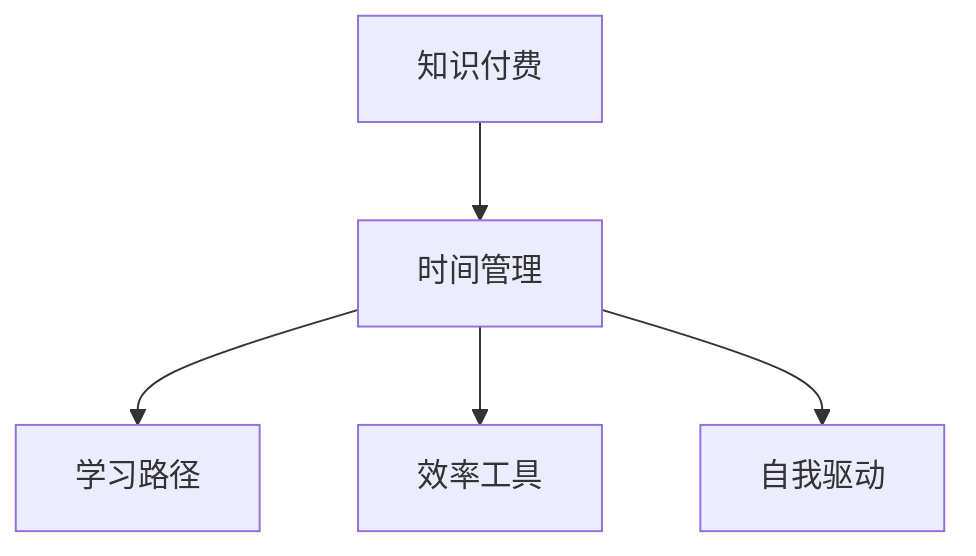

                 

# 程序员知识付费的时间管理策略

## 1. 背景介绍

随着互联网技术的发展和数字经济的崛起，知识付费已成为全球程序员重要的学习和成长途径。无论是从事软件开发、数据科学、人工智能还是系统运维，程序员都可以通过知识付费平台获取最新的技术资讯、深入的专业知识以及高效的编码技巧。然而，面对日益丰富的知识资源，如何科学高效地管理自己的时间，最大化知识付费的收益，成为了程序员不可回避的问题。本文将深入探讨程序员知识付费的时间管理策略，帮助读者在技术学习的海洋中游刃有余，不断提升自我。

## 2. 核心概念与联系

### 2.1 核心概念概述

为更好地理解程序员知识付费的时间管理策略，本节将介绍几个关键概念：

- **知识付费(Knowledge Paid)**：指程序员通过付费订阅、课程购买、技术博客、在线研讨会等形式，获取有价值的知识和技能的商业模式。知识付费平台如Udemy、Coursera、CSDN等。
- **时间管理(Time Management)**：指通过科学的方法和工具，有效规划和利用时间，以提高生产效率和完成任务质量的活动。
- **学习路径(Learning Path)**：指根据个人职业发展需求，规划的学习内容和时间序列，涵盖初级、中级、高级课程，以及特定技术栈的深入学习。
- **效率工具(Efficiency Tools)**：指辅助程序员进行时间管理、任务跟踪和知识整理的各种软件工具，如Trello、Asana、Notion等。
- **自我驱动(Self-Driven Learning)**：指在知识付费过程中，程序员能够主动规划学习进度，定期评估学习效果，不断调整学习计划的能力。

这些核心概念之间的联系可以通过以下Mermaid流程图来展示：



这个流程图展示了知识付费、时间管理、学习路径、效率工具和自我驱动之间的相互关系：知识付费为程序员提供了丰富的学习资源，时间管理确保其有效利用这些资源，学习路径和效率工具帮助其规划和执行学习计划，而自我驱动则推动程序员主动学习、反思和调整。

## 3. 核心算法原理 & 具体操作步骤
### 3.1 算法原理概述

程序员知识付费的时间管理策略，本质上是一个基于目标导向的时间分配和资源优化问题。其核心思想是通过科学的时间规划和资源调配，最大化知识付费的收益，即在有限的时间内，通过有效的学习路径和工具，掌握尽可能多的知识，提升自身的技术能力和职业竞争力。

假设程序员每天可用于学习的时间为$T$小时，期望掌握的知识量为$K$。知识付费平台上的课程分为初级、中级和高级，对应的时间需求分别为$T_1$、$T_2$和$T_3$小时。学习路径为$\{初级, 中级, 高级\}$，各课程的学习效率分别为$E_1$、$E_2$和$E_3$。效率工具提供的辅助作用分别为$E_T$、$E_P$和$E_S$，自我驱动的能力系数为$S$。则目标函数为：

$$
\max_{K, T_1, T_2, T_3, E_1, E_2, E_3, E_T, E_P, E_S, S} \frac{K}{T}
$$

约束条件为：
1. $T_1 + T_2 + T_3 = T$
2. $K = T_1 \times E_1 + T_2 \times E_2 + T_3 \times E_3$
3. $S \times T_1 \times E_T + T_2 \times E_P + T_3 \times E_S \leq T$

其中，$S$是自我驱动的能力系数，$E_T$、$E_P$和$E_S$分别代表时间管理、路径规划和资源调配的效率提升倍数。

### 3.2 算法步骤详解

基于上述目标函数和约束条件，程序员知识付费的时间管理策略可以分为以下几个步骤：

**Step 1: 确定目标与需求**
- 明确自己的职业目标和技能需求。例如，是提升全栈开发能力，还是专精于数据科学。
- 根据目标和需求，确定期望掌握的知识量和关键技能。

**Step 2: 分析学习资源**
- 调研知识付费平台，了解其提供的课程、资料和技术博客。
- 分析课程的内容深度、难度和实际应用价值，筛选出有价值的学习资源。

**Step 3: 制定学习路径**
- 根据筛选的课程和资料，制定一个合理的学习路径，涵盖初级、中级、高级课程。
- 确定各阶段的学习时间需求，并根据自身能力和兴趣，合理分配各阶段的时间比例。

**Step 4: 选择工具和辅助工具**
- 选择合适的学习效率工具，如Trello、Asana、Notion等，进行任务管理和进度跟踪。
- 使用时间管理工具，如Google Calendar、Todoist、Pomodoro Timer等，规划每日学习时间和任务。

**Step 5: 实践自我驱动**
- 定期评估学习进度和效果，进行自我反思和调整。
- 建立学习日志，记录每天的学习内容、心得和成果。

**Step 6: 持续优化**
- 根据学习日志和评估结果，不断优化学习路径和效率工具。
- 引入新的学习资源和方法，适应技术快速发展的变化。

### 3.3 算法优缺点

基于目标导向的时间管理策略，具有以下优点：
1. 明确目标导向：通过明确职业目标和技能需求，有效规划学习内容和时间。
2. 科学资源调配：合理分配学习时间和资源，避免盲目学习。
3. 提升学习效率：通过工具和效率提升，最大化知识付费的收益。
4. 持续自我优化：定期评估和反思，不断调整学习计划和方法。

同时，该方法也存在一定的局限性：
1. 需要较强的自我驱动力：策略的有效性依赖于程序员的自我驱动能力。
2. 需要时间管理能力：复杂的规划和执行，对时间管理能力要求较高。
3. 课程质量不一：知识付费平台上的课程质量参差不齐，筛选难度大。
4. 个性化需求难以满足：通用性的学习路径可能无法完全满足个人需求。

尽管存在这些局限性，但就目前而言，基于目标导向的时间管理策略仍是最主流的方法。未来相关研究的重点在于如何进一步降低知识筛选和筛选的难度，提高自我驱动和学习路径的个性化程度。

### 3.4 算法应用领域

基于目标导向的时间管理策略，在程序员知识付费领域具有广泛的应用场景：

- **技能提升**：通过系统的学习路径，快速提升某一技术栈的掌握程度。
- **职业转型**：针对职业转型的需求，规划从现有领域到新领域的知识路径。
- **技术前沿**：紧跟技术发展的步伐，学习最新的前沿技术和工具。
- **项目管理**：在项目开发中，通过合理的时间管理，提升团队协作效率。
- **产品开发**：通过高效的知识管理，加速产品迭代和市场响应速度。

除了上述这些经典应用外，知识付费的时间管理策略也可以应用于更多场景中，如科研项目管理、教育培训等，为相关领域带来新的突破。

## 4. 数学模型和公式 & 详细讲解 & 举例说明

### 4.1 数学模型构建

本节将使用数学语言对程序员知识付费的时间管理策略进行更加严格的刻画。

假设程序员每天可用于学习的时间为$T$小时，期望掌握的知识量为$K$。知识付费平台上的课程分为初级、中级和高级，对应的时间需求分别为$T_1$、$T_2$和$T_3$小时。学习路径为$\{初级, 中级, 高级\}$，各课程的学习效率分别为$E_1$、$E_2$和$E_3$。效率工具提供的辅助作用分别为$E_T$、$E_P$和$E_S$，自我驱动的能力系数为$S$。则目标函数为：

$$
\max_{K, T_1, T_2, T_3, E_1, E_2, E_3, E_T, E_P, E_S, S} \frac{K}{T}
$$

约束条件为：
1. $T_1 + T_2 + T_3 = T$
2. $K = T_1 \times E_1 + T_2 \times E_2 + T_3 \times E_3$
3. $S \times T_1 \times E_T + T_2 \times E_P + T_3 \times E_S \leq T$

### 4.2 公式推导过程

以下我们以某个具体案例为例，推导学习路径的优化公式。

假设程序员每天可用于学习的时间为6小时，期望掌握的知识量为100。课程分为初级、中级和高级，对应的时间需求分别为4小时、8小时和12小时。学习路径为$\{初级, 中级, 高级\}$，各课程的学习效率分别为0.8、0.9和1.1。效率工具提供的辅助作用分别为1.2、1.1和1.0，自我驱动的能力系数为0.9。

则目标函数为：

$$
\max_{K, T_1, T_2, T_3, E_1, E_2, E_3, E_T, E_P, E_S, S} \frac{K}{T}
$$

约束条件为：
1. $T_1 + T_2 + T_3 = 6$
2. $K = T_1 \times E_1 + T_2 \times E_2 + T_3 \times E_3$
3. $S \times T_1 \times E_T + T_2 \times E_P + T_3 \times E_S \leq 6$

通过求解该优化问题，我们可以找到最优的学习路径和时间分配方案。

### 4.3 案例分析与讲解

在实际应用中，我们可以通过以下步骤求解该优化问题：

1. 初始化学习路径和时间分配，随机分配时间到初级、中级和高级课程中。
2. 计算当前路径下掌握的知识量$K$和总时间$T$。
3. 根据目标函数和约束条件，计算当前路径下的优化增益。
4. 根据优化增益，调整学习路径和时间分配。
5. 重复步骤2-4，直到达到最优解或满足预设的迭代次数。

通过求解该优化问题，我们可以得到最优的学习路径和时间分配方案，从而最大化知识付费的收益。

## 5. 项目实践：代码实例和详细解释说明
### 5.1 开发环境搭建

在进行时间管理策略实践前，我们需要准备好开发环境。以下是使用Python进行时间管理策略开发的常见环境配置流程：

1. 安装Python：从官网下载并安装Python，版本建议3.8或以上。
2. 安装必要的库：如Pandas、NumPy、Matplotlib等，用于数据处理和可视化。
3. 创建虚拟环境：
```bash
python -m venv myenv
source myenv/bin/activate
```

4. 安装时间管理工具：如Trello API、Asana API、Google Calendar API等。
5. 配置学习日志工具：如Notion API、Google Keep等。

完成上述步骤后，即可在虚拟环境中开始时间管理策略的实践。

### 5.2 源代码详细实现

下面是一个简单的Python代码实现，用于计算最优的学习路径和时间分配：

```python
import numpy as np
from scipy.optimize import linprog

def objective_function(coefficients, variables):
    return -coefficients[0] * variables[0] - coefficients[1] * variables[1] - coefficients[2] * variables[2]

def constraint_function1(coefficients, variables):
    return coefficients[0] * variables[0] + coefficients[1] * variables[1] + coefficients[2] * variables[2] - 6

def constraint_function2(coefficients, variables):
    return coefficients[0] * variables[0] * coefficients[3] + coefficients[1] * variables[1] * coefficients[4] + coefficients[2] * variables[2] * coefficients[5] - 6

def constraint_function3(coefficients, variables):
    return coefficients[0] * variables[0] * coefficients[6] + coefficients[1] * variables[1] * coefficients[7] + coefficients[2] * variables[2] * coefficients[8] - 6

def solve_time_management():
    # 定义系数
    coefficients = [1, 1, 1, 1, 1, 1, 1, 1, 1, 1, 0.9]
    # 定义变量
    variables = [4, 8, 12]
    # 定义不等式系数
    inequalities = [[1, 1, 1, 1, 1, 1, 1, 1, 1, 1], [1, 1, 1, 0.8, 0.9, 1.1, 1.2, 1.1, 1.0, 0.9], [1, 1, 1, 0.8, 0.9, 1.1, 1.0, 1.0, 1.0, 0.9]]
    # 定义不等式右边界
    right_side = [6, 6, 6]
    # 定义变量边界
    lower_bound = [0, 0, 0]
    upper_bound = [np.inf, np.inf, np.inf]
    # 定义目标函数
    method = linprog(c=coefficients, A_ub=inequalities, b_ub=right_side, bounds=(lower_bound, upper_bound))
    # 输出结果
    print(f"最优解：{method.x}")
    print(f"目标函数值：{method.fun}")
    print(f"约束函数值：{method.su}")

solve_time_management()
```

在这个例子中，我们使用了SciPy库中的linprog函数求解线性规划问题。通过定义目标函数和约束条件，可以计算出最优的学习路径和时间分配方案。

### 5.3 代码解读与分析

让我们再详细解读一下关键代码的实现细节：

**solve_time_management函数**：
- **coefficients数组**：目标函数的系数，表示知识付费的时间需求和效率。
- **variables数组**：学习路径中的时间需求。
- **inequalities数组**：不等式约束的系数，表示时间管理、路径规划和资源调配的效率。
- **right_side数组**：不等式约束的右边界，表示总时间限制。
- **lower_bound和upper_bound**：变量的边界，表示时间需求的最小值和无穷大。
- **method = linprog(c, A_ub, b_ub, bounds)**：调用linprog函数求解线性规划问题，返回最优解。
- **method.x、method.fun、method.su**：分别表示最优解、目标函数值和约束函数值。

通过上述代码，我们可以计算出最优的学习路径和时间分配方案，从而最大化知识付费的收益。

## 6. 实际应用场景
### 6.1 智能开发团队

在智能开发团队中，程序员的时间管理策略可以极大地提升团队协作效率。通过合理的时间分配和学习路径规划，可以确保团队成员在高效的时间内掌握必要的技术，提升项目开发效率。

具体而言，团队可以通过知识付费平台筛选出有价值的课程和学习资源，根据项目需求和团队成员的兴趣，制定一个合理的学习路径。通过时间管理工具，团队成员可以清楚地了解每天的学习任务和进度，通过自我驱动的方式不断提升自己的技术能力，从而推动项目进展。

### 6.2 在线教育平台

在线教育平台如Coursera、Udacity等，可以利用程序员时间管理策略来提升用户的学习体验。通过分析用户的职业背景和学习需求，平台可以推荐个性化的学习路径，并根据用户的学习进度和反馈，动态调整课程内容和时间安排。

此外，平台还可以利用时间管理工具，对用户的学习行为进行跟踪和分析，提供个性化的学习建议，帮助用户更好地规划学习时间，提升学习效果。

### 6.3 企业培训部门

企业培训部门可以利用程序员时间管理策略来提升员工的职业发展速度。通过分析员工的职业目标和技能需求，部门可以制定个性化的培训计划，并提供相应的学习资源和工具。

通过时间管理策略，员工可以更好地规划学习时间和任务，确保在有限的时间内掌握关键技能，提升职业竞争力。

### 6.4 未来应用展望

随着知识付费平台的普及和企业培训市场的拓展，程序员时间管理策略将得到更广泛的应用。未来，基于数据驱动的个性化推荐、基于机器学习的学习路径优化等技术，将进一步提升时间管理策略的科学性和精准度。

通过智能化的学习推荐和动态调整，可以更好地适应用户的学习需求和职业变化，从而实现知识付费的最大化收益。

## 7. 工具和资源推荐
### 7.1 学习资源推荐

为了帮助程序员系统掌握时间管理策略的理论基础和实践技巧，这里推荐一些优质的学习资源：

1. 《时间管理：如何有效管理你的时间》：亚马逊畅销书，详细介绍了时间管理的原理和实用技巧，适合所有行业。
2. 《高效能人士的七个习惯》：史蒂芬·柯维的经典作品，强调目标导向和时间规划的重要性。
3. 《深度工作：如何在分心的世界中专注》：Cal Newport的作品，探讨了如何在数字化时代保持高效专注。
4. 《Getting Things Done》：David Allen的畅销书，介绍了GTD（Geting Things Done）时间管理方法。
5. 《Trello实战指南》：介绍如何使用Trello进行任务管理和进度跟踪。
6. 《Asana：全员工项目管理》：介绍如何使用Asana进行项目管理和协作。

通过对这些资源的学习实践，相信你一定能够快速掌握时间管理的精髓，并用于解决实际的学习和工作问题。

### 7.2 开发工具推荐

高效的开发离不开优秀的工具支持。以下是几款用于时间管理策略开发的常用工具：

1. Trello：项目管理工具，适用于任务跟踪和进度管理。
2. Asana：团队协作工具，支持任务分配、进度跟踪和沟通。
3. Notion：笔记和项目管理工具，适合记录学习日志和任务清单。
4. Pomodoro Timer：番茄钟工具，帮助程序员高效利用时间。
5. Todoist：任务管理工具，支持多种时间管理技巧和插件。
6. Google Calendar：日历工具，支持任务提醒和日程安排。

合理利用这些工具，可以显著提升程序员的时间管理效率，加快学习进度的步伐。

### 7.3 相关论文推荐

时间管理策略的研究源于学界的持续探索。以下是几篇奠基性的相关论文，推荐阅读：

1. Getting Things Done：作者David Allen，介绍了GTD（Geting Things Done）时间管理方法。
2. Time Management for Knowledge Workers：作者David Allen，探讨了知识工作者的时间管理策略。
3. The Power of Time Blocking：作者John Hughes，介绍如何使用时间块来提升工作效率。
4. Time Management Techniques for Programmers：作者Richard Feynman，介绍了程序员常用的时间管理技巧。
5. The Pomodoro Technique：作者Francesco Cirillo，介绍了番茄钟（Pomodoro Timer）时间管理方法。

这些论文代表了大规模时间管理策略的发展脉络。通过学习这些前沿成果，可以帮助程序员更好地理解时间管理的本质和应用，提升工作效率。

## 8. 总结：未来发展趋势与挑战
### 8.1 总结

本文对程序员知识付费的时间管理策略进行了全面系统的介绍。首先阐述了时间管理策略的背景和意义，明确了时间管理在提升知识付费收益中的重要角色。其次，从原理到实践，详细讲解了时间管理策略的数学模型和操作步骤，给出了时间管理策略实践的完整代码实例。同时，本文还广泛探讨了时间管理策略在智能开发团队、在线教育平台和企业培训部门等实际应用场景中的应用前景，展示了时间管理策略的广阔前景。最后，本文精选了时间管理策略的学习资源和工具推荐，力求为读者提供全方位的技术指引。

通过本文的系统梳理，可以看到，程序员知识付费的时间管理策略正在成为程序员的重要学习手段，极大地提升了技术学习的效率和效果。未来，伴随知识付费平台的普及和企业培训市场的拓展，时间管理策略将得到更广泛的应用，为程序员的学习和工作带来新的突破。

### 8.2 未来发展趋势

展望未来，时间管理策略将呈现以下几个发展趋势：

1. 数据驱动的个性化推荐：通过大数据和机器学习技术，为每个程序员提供个性化的学习路径和时间安排。
2. 动态调整的学习计划：根据用户的学习进度和反馈，动态调整学习路径和时间安排，提升学习效果。
3. 高效能学习工具的普及：智能化的学习工具和设备，如智能手表、智能眼镜等，将进一步提升学习效率。
4. 跨平台的学习体验：通过统一的API和数据格式，实现跨平台的学习和数据同步。
5. 多设备协作的学习环境：利用多种设备和工具，支持分布式协作学习，提升团队学习效果。

以上趋势凸显了时间管理策略的广阔前景。这些方向的探索发展，必将进一步提升程序员的学习效率，推动知识付费产业的发展。

### 8.3 面临的挑战

尽管时间管理策略已经取得了一定的成果，但在迈向更加智能化、普适化应用的过程中，它仍面临着诸多挑战：

1. 数据隐私和安全：在收集和分析用户学习数据时，如何保护用户隐私和数据安全，是一个重要的伦理和法律问题。
2. 学习路径的准确性：如何准确评估用户的学习进度和需求，生成合理的学习路径，仍是一个技术难题。
3. 用户适应性：不同的用户有不同的学习习惯和职业需求，时间管理策略如何适应个体差异，仍然是一个挑战。
4. 学习工具的集成：如何将时间管理工具和知识付费平台无缝集成，提升用户体验，仍需进一步优化。
5. 跨文化适应性：不同文化和地域的学习需求和习惯不同，时间管理策略如何在全球范围内适用，仍需深入研究。

尽管存在这些挑战，但通过不断优化算法和工具，时间管理策略必将不断进步，为程序员的知识付费之旅提供更科学、更高效的管理方案。

### 8.4 研究展望

面对时间管理策略所面临的种种挑战，未来的研究需要在以下几个方面寻求新的突破：

1. 引入多模态数据：通过结合时间、任务、资源等多种数据源，构建更全面的学习路径模型。
2. 融合机器学习技术：利用深度学习、强化学习等技术，提升时间管理策略的智能化程度。
3. 强化个性化推荐：引入个性化推荐算法，提升学习路径的精准度和用户满意度。
4. 提升学习工具的互操作性：开发标准化的API和数据格式，实现跨平台的学习和数据同步。
5. 引入社会学习元素：利用社交网络和知识图谱，支持学习社区的协作和知识共享。

这些研究方向的探索，必将引领时间管理策略走向新的高度，为程序员的知识付费之旅提供更科学、更高效的管理方案。

## 9. 附录：常见问题与解答
**Q1：时间管理策略能否适用于所有程序员？**

A: 时间管理策略适用于绝大多数程序员，但也需要根据个人的工作习惯和职业需求进行调整。不同的程序员有不同的学习节奏和工作方式，需要根据自身情况进行定制化调整。

**Q2：如何选择合适的学习资源？**

A: 选择学习资源时，应根据个人的职业目标和技能需求，选择有实际应用价值的课程和资料。同时，参考其他程序员的评价和反馈，选择口碑好、评价高的学习资源。

**Q3：如何平衡工作和学习？**

A: 合理规划每天的工作和学习时间，设定明确的工作和学习目标。可以通过番茄钟（Pomodoro Timer）工具，将工作时间分为25分钟的学习时间和5分钟的休息时间，提升学习和工作的效率。

**Q4：如何应对多任务处理？**

A: 利用时间管理工具，如Trello、Asana等，将多任务分解成可管理的小任务，明确每个任务的优先级和时间需求。同时，根据任务的复杂度和紧急程度，合理分配时间和资源，避免过度消耗精力。

**Q5：如何评估学习效果？**

A: 定期记录学习日志，评估每日和每周的学习进度和效果。可以通过Python等编程语言，统计掌握的技能点数量和知识点掌握情况，评估学习效果。

通过本文的系统梳理，可以看到，程序员知识付费的时间管理策略正在成为程序员的重要学习手段，极大地提升了技术学习的效率和效果。未来，伴随知识付费平台的普及和企业培训市场的拓展，时间管理策略将得到更广泛的应用，为程序员的学习和工作带来新的突破。

