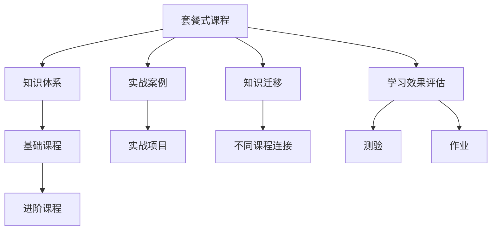

                 

# 程序员知识付费：打造套餐式课程

## 1. 背景介绍

### 1.1 问题由来
随着科技的快速发展和互联网的普及，知识付费已经成为越来越多人获取新知识和技能的重要途径。特别是在编程领域，大量的优质课程、书籍、博客等资源涌现，让初学者和进阶者都能快速提升技术水平。然而，随着知识体系越来越庞杂，学习者很难找到系统化、有针对性的学习资源。因此，打造套餐式课程，构建系统化的学习路径，成为知识付费平台的重要发展方向。

### 1.2 问题核心关键点
套餐式课程的核心理念是通过组合多门相关的课程，形成系统化的学习体系，帮助学习者快速掌握某一领域的技术。套餐式课程不仅涵盖了从基础到高级的技术点，还通过实践案例和项目实战，提升学习者的实战能力。关键点包括：

- **课程结构设计**：课程如何划分模块，哪些内容是基础，哪些是进阶，哪些是实践。
- **实战案例选择**：如何选择与课程内容紧密相关的实战项目，以提升学习者的动手能力。
- **知识迁移能力**：如何在不同课程之间建立知识连接，帮助学习者实现知识的迁移和应用。
- **学习效果评估**：如何通过测验、作业等手段，评估学习者的掌握情况，及时调整课程内容。

### 1.3 问题研究意义
套餐式课程为知识付费提供了新范式，有助于知识传播和应用。其研究意义包括：

1. **系统化学习**：帮助学习者构建系统化的知识体系，提升学习效率和效果。
2. **实战能力提升**：通过实战案例和项目实战，快速提升学习者的技术水平和工程能力。
3. **知识迁移应用**：在不同课程之间建立知识连接，帮助学习者实现知识的迁移和应用，提升技术广度。
4. **学习效果评估**：通过多种评估手段，确保学习者掌握知识，提升课程质量和效果。

## 2. 核心概念与联系

### 2.1 核心概念概述

为了更好地理解套餐式课程的构建原理，本节将介绍几个关键概念：

- **套餐式课程**：通过组合多门相关课程，构建系统化的学习路径，帮助学习者快速掌握某一领域的技术。
- **知识体系**：将知识划分为不同的模块，从基础到进阶，形成系统的知识框架。
- **实战案例**：选择与课程内容紧密相关的实战项目，通过动手实践提升学习者的技术能力。
- **知识迁移**：在不同课程之间建立知识连接，帮助学习者实现知识的迁移和应用。
- **学习效果评估**：通过测验、作业等手段，评估学习者的掌握情况，及时调整课程内容。

### 2.2 核心概念原理和架构的 Mermaid 流程图



这个流程图展示了套餐式课程的构建原理和关键要素：

1. **知识体系**：将课程内容划分基础和进阶模块，确保学习者掌握完整的技术知识。
2. **实战案例**：通过实战项目，提升学习者的动手能力和工程实践能力。
3. **知识迁移**：在不同课程之间建立知识连接，帮助学习者实现知识的迁移和应用。
4. **学习效果评估**：通过测验和作业，评估学习者的掌握情况，及时调整课程内容。

## 3. 核心算法原理 & 具体操作步骤

### 3.1 算法原理概述

套餐式课程的构建，本质上是一个系统化的教学设计过程。其核心思想是通过组合多门相关课程，形成系统化的学习路径，帮助学习者快速掌握某一领域的技术。

形式化地，假设套餐式课程包含 $n$ 门课程 $\{C_i\}_{i=1}^n$，每门课程 $C_i$ 包含 $m_i$ 个知识模块 $\{M_{ij}\}_{j=1}^{m_i}$，每个知识模块 $M_{ij}$ 包含 $p_{ij}$ 个实战项目 $\{P_{ij}\}_{j=1}^{p_{ij}}$。通过系统化的设计，构建学习路径 $\pi = \{\pi_1, \pi_2, ..., \pi_n\}$，其中 $\pi_i$ 表示课程 $C_i$ 的学习路径。

课程的总体学习路径为：

$$
\pi = \{\pi_1, \pi_2, ..., \pi_n\}
$$

其中每个 $\pi_i$ 包含了课程 $C_i$ 的所有知识模块和实战项目，按照基础到进阶的顺序排列。

### 3.2 算法步骤详解

套餐式课程的构建步骤包括以下几个关键步骤：

**Step 1: 课程设计**
- 确定课程涵盖的知识点和技术栈，设计课程模块。
- 将课程内容划分为基础模块和进阶模块，确保学习者掌握完整的技术知识。

**Step 2: 实战项目选择**
- 选择与课程内容紧密相关的实战项目，涵盖课程模块所需的关键技术和工具。
- 设计项目的任务目标和功能需求，确保项目能全面覆盖课程知识点。

**Step 3: 课程结构设计**
- 根据知识点的难度和关联性，设计课程模块的学习顺序和结构。
- 确定每个模块的学习时长和难度，确保学习者能够按计划完成课程。

**Step 4: 知识迁移设计**
- 在不同课程之间建立知识连接，确保学习者能够实现知识的迁移和应用。
- 通过关联课程和实战项目，帮助学习者理解不同技术之间的联系和应用场景。

**Step 5: 学习效果评估**
- 设计课程的评估体系，包括测验、作业、项目实践等。
- 定期评估学习者的掌握情况，根据评估结果调整课程内容和难度。

### 3.3 算法优缺点

套餐式课程具有以下优点：
1. **系统化学习**：帮助学习者构建系统化的知识体系，提升学习效率和效果。
2. **实战能力提升**：通过实战案例和项目实战，快速提升学习者的技术水平和工程能力。
3. **知识迁移应用**：在不同课程之间建立知识连接，帮助学习者实现知识的迁移和应用，提升技术广度。

同时，该方法也存在一定的局限性：
1. **资源需求高**：套餐式课程需要大量的课程和实战项目，对资源和人力要求较高。
2. **课程设计复杂**：课程设计需要考虑多门课程之间的衔接和知识点覆盖，设计复杂度较高。
3. **学习者差异大**：不同学习者的基础和技术水平不同，课程可能需要针对不同层次的学习者进行差异化设计。

尽管存在这些局限性，但套餐式课程在提升学习者技术水平和应用能力方面仍具有显著优势。未来相关研究的重点在于如何进一步降低资源需求，提高课程设计的自动化和个性化，同时兼顾课程的可扩展性和可维护性。

### 3.4 算法应用领域

套餐式课程在多个领域得到了广泛应用，例如：

- **软件开发**：涵盖编程语言、框架、架构设计等技术栈，帮助学习者从基础到进阶掌握开发技能。
- **数据科学**：覆盖数据采集、清洗、分析和可视化等环节，帮助学习者全面掌握数据分析和处理技术。
- **人工智能**：涵盖机器学习、深度学习、自然语言处理等技术栈，帮助学习者从基础到进阶掌握AI技术。
- **移动应用开发**：涵盖Android、iOS、跨平台开发等技术栈，帮助学习者掌握移动应用开发技能。
- **网络安全**：涵盖网络攻防、漏洞挖掘、安全测试等技术栈，帮助学习者掌握网络安全技能。

除了上述这些经典应用外，套餐式课程也被创新性地应用到更多场景中，如智能制造、智慧城市、电子商务等，为各行各业的技术升级和数字化转型提供新动力。

## 4. 数学模型和公式 & 详细讲解

### 4.1 数学模型构建

本节将使用数学语言对套餐式课程的设计过程进行更加严格的刻画。

假设课程 $C_i$ 包含 $m_i$ 个知识模块 $\{M_{ij}\}_{j=1}^{m_i}$，每个知识模块 $M_{ij}$ 包含 $p_{ij}$ 个实战项目 $\{P_{ij}\}_{j=1}^{p_{ij}}$。

定义课程 $C_i$ 的知识模块 $M_{ij}$ 的难度为 $d_{ij}$，实战项目 $P_{ij}$ 的复杂度为 $c_{ij}$。课程 $C_i$ 的总体难度为：

$$
D_i = \sum_{j=1}^{m_i} d_{ij} + \sum_{j=1}^{m_i} c_{ij}
$$

课程 $C_i$ 的平均难度为：

$$
\bar{D}_i = \frac{D_i}{m_i}
$$

课程 $C_i$ 的总体学习时长为：

$$
T_i = \sum_{j=1}^{m_i} t_{ij}
$$

其中 $t_{ij}$ 为知识模块 $M_{ij}$ 的学习时长。课程 $C_i$ 的平均学习时长为：

$$
\bar{T}_i = \frac{T_i}{m_i}
$$

课程 $C_i$ 的学习路径长度为：

$$
L_i = \sum_{j=1}^{m_i} l_{ij}
$$

其中 $l_{ij}$ 为知识模块 $M_{ij}$ 与实战项目 $P_{ij}$ 之间的链接强度。课程 $C_i$ 的平均学习路径长度为：

$$
\bar{L}_i = \frac{L_i}{m_i}
$$

### 4.2 公式推导过程

以下我们以软件开发课程为例，推导课程学习路径的设计方法。

假设课程 $C_i$ 包含两个知识模块 $M_{1j}$ 和 $M_{2j}$，以及两个实战项目 $P_{1j}$ 和 $P_{2j}$，其中 $j=1,2$。每个知识模块和实战项目的学习时长和难度如下表所示：

| 知识模块 | 学习时长 | 难度 |
| --- | --- | --- |
| $M_{11}$ | 2 周 | 0.5 |
| $M_{12}$ | 4 周 | 1.0 |
| $M_{21}$ | 4 周 | 1.5 |
| $P_{11}$ | 2 周 | 0.8 |
| $P_{12}$ | 3 周 | 1.2 |
| $P_{21}$ | 3 周 | 1.5 |

根据上述数据，可以计算课程 $C_1$ 和 $C_2$ 的总体难度和平均难度：

- $C_1$ 的总体难度：$D_1 = d_{11} + c_{11} + d_{12} + c_{12} = 0.5 + 0.8 + 1.0 + 1.2 = 3.5$
- $C_1$ 的平均难度：$\bar{D}_1 = \frac{D_1}{m_1} = \frac{3.5}{2} = 1.75$
- $C_1$ 的总体学习时长：$T_1 = t_{11} + t_{12} + t_{21} + t_{22} = 2 + 4 + 4 + 3 = 13$
- $C_1$ 的平均学习时长：$\bar{T}_1 = \frac{T_1}{m_1} = \frac{13}{2} = 6.5$
- $C_1$ 的总体学习路径长度：$L_1 = l_{11} + l_{12} + l_{21} + l_{22} = 2 + 3 + 3 + 3 = 11$
- $C_1$ 的平均学习路径长度：$\bar{L}_1 = \frac{L_1}{m_1} = \frac{11}{2} = 5.5$

根据上述计算结果，可以设计课程 $C_1$ 的学习路径如下：

- $M_{11}$ -> $P_{11}$ -> $M_{12}$ -> $P_{12}$ -> $M_{21}$ -> $P_{21}$

这种设计不仅考虑了知识模块和实战项目的难度和学习时长，还考虑了知识模块和实战项目之间的衔接，确保学习者能够按计划完成课程。

### 4.3 案例分析与讲解

以软件开发课程为例，下面是具体的案例分析与讲解：

**案例背景**：某软件开发课程包含以下两个知识点：
1. Java基础
2. Spring框架

**知识点划分**：
- Java基础分为以下四个模块：
  1. Java基础语法
  2. 面向对象编程
  3. 异常处理
  4. 文件IO

- Spring框架分为以下四个模块：
  1. Spring核心概念
  2. Spring MVC
  3. Spring Boot
  4. Spring Cloud

**课程设计**：
- Java基础模块的难度为0.5，学习时长为2周；Spring框架模块的难度为1.5，学习时长为4周。

**实战项目选择**：
- Java基础模块选择实战项目：Java程序设计
- Spring框架模块选择实战项目：Spring Boot应用开发

**学习路径设计**：
- Java基础模块 -> Java程序设计 -> 面向对象编程 -> 异常处理 -> 文件IO -> Spring核心概念 -> Spring MVC -> Spring Boot -> Spring Cloud

**学习效果评估**：
- 通过测验和作业评估学习者的掌握情况，每门课程设计多个测验和作业，定期评估学习者的掌握情况，根据评估结果调整课程内容和难度。

通过上述案例，可以看到套餐式课程的设计过程不仅考虑了知识点和实战项目的难度和学习时长，还考虑了知识模块和实战项目之间的衔接，确保学习者能够按计划完成课程，提升学习效果。

## 5. 项目实践：代码实例和详细解释说明

### 5.1 开发环境搭建

在进行套餐式课程的实践前，我们需要准备好开发环境。以下是使用Python进行开发的环境配置流程：

1. 安装Anaconda：从官网下载并安装Anaconda，用于创建独立的Python环境。

2. 创建并激活虚拟环境：
```bash
conda create -n course-env python=3.8 
conda activate course-env
```

3. 安装PyTorch：根据CUDA版本，从官网获取对应的安装命令。例如：
```bash
conda install pytorch torchvision torchaudio cudatoolkit=11.1 -c pytorch -c conda-forge
```

4. 安装TensorFlow：
```bash
pip install tensorflow
```

5. 安装Flask：
```bash
pip install flask
```

6. 安装Pandas：
```bash
pip install pandas
```

7. 安装NumPy：
```bash
pip install numpy
```

完成上述步骤后，即可在`course-env`环境中开始课程的开发实践。

### 5.2 源代码详细实现

下面我们以Java基础课程为例，给出使用Flask框架构建的课程实践平台。

首先，定义课程数据：

```python
from flask import Flask, request, jsonify
import pandas as pd

app = Flask(__name__)

# 定义课程数据
courses = [
    {'name': 'Java基础', 'modules': ['Java基础语法', '面向对象编程', '异常处理', '文件IO'], 
    'difficulty': 0.5, 'duration': 2, 'practicals': ['Java程序设计']},
    {'name': 'Spring框架', 'modules': ['Spring核心概念', 'Spring MVC', 'Spring Boot', 'Spring Cloud'], 
    'difficulty': 1.5, 'duration': 4, 'practicals': ['Spring Boot应用开发']}
]

@app.route('/api/courses', methods=['GET'])
def get_courses():
    return jsonify(courses)

@app.route('/api/course/modules', methods=['GET'])
def get_course_modules(course_id):
    course = courses[course_id]
    return jsonify(course['modules'])

@app.route('/api/course/practicals', methods=['GET'])
def get_course_practicals(course_id):
    course = courses[course_id]
    return jsonify(course['practicals'])
```

然后，定义课程模块和实战项目的进度管理：

```python
@app.route('/api/progress', methods=['POST'])
def update_progress():
    course_id = request.json['course_id']
    module_id = request.json['module_id']
    completed = request.json['completed']
    course = courses[course_id]
    modules = course['modules']
    practicals = course['practicals']
    
    for i, module in enumerate(modules):
        if module_id == module['name']:
            modules[i]['completed'] = completed
    
    for i, practical in enumerate(practicals):
        if module_id == practical['name']:
            practicals[i]['completed'] = completed
    
    return jsonify(courses)
```

接着，定义课程学习路径的推荐算法：

```python
@app.route('/api/recommend', methods=['GET'])
def get_recommendation():
    course_id = request.json['course_id']
    course = courses[course_id]
    modules = course['modules']
    practicals = course['practicals']
    
    recommendations = []
    for module in modules:
        for practical in practicals:
            if module['name'] not in module['completed']:
                if practical['name'] not in practical['completed']:
                    recommendations.append(practical)
    
    return jsonify(recommendations)
```

最后，启动服务器：

```python
if __name__ == '__main__':
    app.run(debug=True)
```

运行上述代码后，访问`http://localhost:5000/api/courses`，即可获取课程列表。

通过Flask框架，可以方便地展示课程数据，管理学习进度，推荐学习路径。课程管理者和学习者可以随时查看课程信息、学习进度和推荐任务，确保学习者按计划完成课程。

### 5.3 代码解读与分析

让我们再详细解读一下关键代码的实现细节：

**Flask应用程序初始化**：
- 定义Flask应用程序，并通过`if __name__ == '__main__':`启动Flask服务器。

**课程数据定义**：
- 使用Python字典定义课程数据，包含课程名称、模块、难度、学习时长、实战项目等关键信息。

**路由定义**：
- 使用Flask的`@app.route`装饰器定义路由，通过HTTP请求路径访问不同的接口。
- `/api/courses`接口：获取课程列表。
- `/api/course/modules`接口：获取指定课程的模块列表。
- `/api/course/practicals`接口：获取指定课程的实战项目列表。
- `/api/progress`接口：更新学习进度。
- `/api/recommend`接口：获取学习路径推荐。

**学习进度管理**：
- 通过HTTP POST请求，更新学习者的进度，标记完成模块和实战项目。

**学习路径推荐**：
- 根据学习者的进度，推荐未完成的任务。

通过Flask框架，我们可以轻松实现课程数据的管理、学习进度的跟踪和推荐路径的生成。这种简单的API接口设计，能够快速响应学习者的需求，提升学习体验。

当然，工业级的系统实现还需考虑更多因素，如用户注册、登录、权限控制、数据分析等。但核心的课程设计、进度管理、推荐算法基本与此类似。

## 6. 实际应用场景

### 6.1 智能制造培训

智能制造领域需要大量的技术人员，包括编程、数据分析、系统维护等。通过套餐式课程，可以系统地培训技术人才，提升整个制造业的智能化水平。

在技术实现上，可以设计涵盖编程语言、数据库、自动化流程等模块的课程，帮助学习者掌握智能制造所需的技术。课程还可以设计与智能制造相关的实战项目，如工业机器人的编程控制、生产流程的优化等，增强学习者的实战能力。通过这种系统化的培训，可以显著提升技术人才的素质和能力，为智能制造提供坚实的人才基础。

### 6.2 智慧城市管理

智慧城市管理需要多学科的知识和技术，包括城市规划、数据处理、人工智能等。通过套餐式课程，可以系统地培训相关人员，提升智慧城市的管理水平。

在技术实现上，可以设计涵盖城市规划、数据采集、数据分析、人工智能等模块的课程，帮助学习者掌握智慧城市管理所需的技术。课程还可以设计与智慧城市管理相关的实战项目，如智能交通系统的开发、智慧能源系统的优化等，增强学习者的实战能力。通过这种系统化的培训，可以显著提升城市管理者的素质和能力，为智慧城市建设提供坚实的人才基础。

### 6.3 电子商务运营

电子商务运营需要多方面的技术支持，包括网站开发、数据分析、客户服务等。通过套餐式课程，可以系统地培训技术人才，提升电子商务的运营水平。

在技术实现上，可以设计涵盖网站开发、数据分析、客户服务、人工智能等模块的课程，帮助学习者掌握电子商务运营所需的技术。课程还可以设计与电子商务运营相关的实战项目，如电子商务平台的开发、数据分析报告的生成等，增强学习者的实战能力。通过这种系统化的培训，可以显著提升电子商务运营者的素质和能力，为电子商务发展提供坚实的人才基础。

### 6.4 未来应用展望

随着套餐式课程的不断演进，其在多个领域的应用将更加广泛，为各行各业的技术升级和数字化转型提供新动力。

在智慧医疗领域，通过套餐式课程，可以系统地培训医疗从业人员，提升医疗服务的智能化水平，辅助医生诊疗，加速新药开发进程。

在智能教育领域，通过套餐式课程，可以系统地培训教育工作者，因材施教，促进教育公平，提高教学质量。

在智慧城市治理中，通过套餐式课程，可以系统地培训城市管理者，提高城市管理的自动化和智能化水平，构建更安全、高效的未来城市。

此外，在企业生产、社会治理、文娱传媒等众多领域，套餐式课程也将不断涌现，为传统行业数字化转型升级提供新的技术路径。相信随着技术的日益成熟，套餐式课程必将在构建人机协同的智能时代中扮演越来越重要的角色。

## 7. 工具和资源推荐

### 7.1 学习资源推荐

为了帮助开发者系统掌握套餐式课程的理论基础和实践技巧，这里推荐一些优质的学习资源：

1. 《从零到一：构建个性化学习平台》系列博文：由知识付费平台技术专家撰写，深入浅出地介绍了如何设计和管理个性化学习平台。

2. 《学习资源管理系统》课程：多所知名大学联合开设的学习资源管理课程，涵盖学习管理系统、课程设计、数据管理等内容。

3. 《课程设计与开发》书籍：全面介绍课程设计的方法和技巧，包括学习目标、内容选择、评估方法等。

4. 《用户行为分析》课程：帮助学习者掌握用户行为分析和推荐系统的基本方法，提升学习者对课程设计的理解和应用能力。

5. 《数据科学入门》课程：涵盖数据采集、数据清洗、数据分析、数据可视化等内容，帮助学习者掌握数据科学的基本技能。

通过对这些资源的学习实践，相信你一定能够快速掌握套餐式课程的设计和实践技巧，为构建系统化的学习路径提供坚实的基础。

### 7.2 开发工具推荐

高效的开发离不开优秀的工具支持。以下是几款用于套餐式课程开发的常用工具：

1. Flask：轻量级的Web框架，适合快速开发API接口。
2. TensorFlow：强大的机器学习框架，支持深度学习模型的训练和部署。
3. Keras：高层API，基于TensorFlow，适合快速开发和测试深度学习模型。
4. PyTorch：灵活的深度学习框架，支持动态计算图，适合快速迭代研究。
5. Jupyter Notebook：交互式的编程环境，支持Python、R等多种编程语言。
6. GitHub：开源代码托管平台，方便代码版本控制和团队协作。

合理利用这些工具，可以显著提升套餐式课程的开发效率，加快创新迭代的步伐。

### 7.3 相关论文推荐

套餐式课程的研究和发展得益于学界的持续研究。以下是几篇奠基性的相关论文，推荐阅读：

1. Coursera: The Economics of Online Learning（Coursera在线学习的经济学）：从经济学角度分析在线学习平台的用户行为和市场竞争。
2. MOOCs: Are They Really Better?（MOOCs真的更好吗？）：对比MOOCs和传统教育模式，分析MOOCs的优缺点。
3. Designing Effective Learning Environments: Guidelines for Developing Interactive Learning Environments（设计有效学习环境：交互式学习环境的指导原则）：探讨如何设计有效的交互式学习环境，提升学习效果。
4. Multi-Armed Bandit Algorithms for Dynamic Structure Learning（多臂强盗算法与动态结构学习）：引入多臂强盗算法，优化在线学习平台的资源分配。
5. Recommendation Systems in E-Learning（电子学习中的推荐系统）：研究推荐算法在在线学习平台中的应用，提升学习体验。

这些论文代表了大语言模型微调技术的发展脉络。通过学习这些前沿成果，可以帮助研究者把握学科前进方向，激发更多的创新灵感。

## 8. 总结：未来发展趋势与挑战

### 8.1 总结

本文对套餐式课程的构建过程进行了全面系统的介绍。首先阐述了套餐式课程的核心理念和研究背景，明确了课程设计对学习者的重要性。其次，从原理到实践，详细讲解了套餐式课程的数学模型和操作步骤，给出了完整的课程实践代码实现。同时，本文还广泛探讨了套餐式课程在多个领域的应用前景，展示了套餐式课程的巨大潜力。此外，本文精选了课程设计、实战项目、进度管理等关键技术，力求为读者提供全方位的技术指引。

通过本文的系统梳理，可以看到，套餐式课程为知识付费提供了新范式，有助于知识传播和应用。其研究意义在于系统化学习、实战能力提升、知识迁移应用和学习效果评估等方面，具有广泛的应用前景。未来相关研究的重点在于如何进一步降低资源需求，提高课程设计的自动化和个性化，同时兼顾课程的可扩展性和可维护性。

### 8.2 未来发展趋势

展望未来，套餐式课程将呈现以下几个发展趋势：

1. **资源需求降低**：随着AI和大数据分析技术的发展，课程设计将更加自动化和个性化，课程资源的获取和利用将更加高效。
2. **课程内容更新**：随着技术的发展和需求的变化，课程内容将持续更新，确保学习者能够掌握最新的技术和知识。
3. **学习路径优化**：通过智能推荐算法，优化学习路径，确保学习者能够按计划完成课程，提升学习效果。
4. **学习效果评估**：通过智能评估系统，实时监测学习者的掌握情况，提供个性化的学习建议。
5. **跨平台学习**：通过移动端和桌面端的整合，实现跨平台学习，提升学习便捷性。

以上趋势凸显了套餐式课程的广阔前景。这些方向的探索发展，必将进一步提升课程质量，提升学习者的技术水平和应用能力，为各行各业的技术升级和数字化转型提供新动力。

### 8.3 面临的挑战

尽管套餐式课程在提升学习者技术水平和应用能力方面具有显著优势，但在迈向更加智能化、普适化应用的过程中，它仍面临以下挑战：

1. **课程设计复杂**：课程设计需要考虑多门课程之间的衔接和知识点覆盖，设计复杂度较高。
2. **学习者差异大**：不同学习者的基础和技术水平不同，课程可能需要针对不同层次的学习者进行差异化设计。
3. **学习效果评估难**：如何通过智能评估系统，实时监测学习者的掌握情况，提供个性化的学习建议，是一个重要难题。
4. **跨平台学习**：移动端和桌面端的整合，需要考虑用户界面、数据传输等问题，提升学习便捷性。
5. **资源需求高**：课程设计、实战项目选择、学习路径推荐等环节，需要大量的资源和人力投入。

尽管存在这些挑战，但套餐式课程在提升学习者技术水平和应用能力方面仍具有显著优势。未来相关研究的重点在于如何进一步降低资源需求，提高课程设计的自动化和个性化，同时兼顾课程的可扩展性和可维护性。

### 8.4 研究展望

面向未来，套餐式课程的研究方向主要包括以下几个方面：

1. **自动化课程设计**：引入AI和大数据分析技术，自动化课程设计过程，提升课程设计效率和质量。
2. **个性化学习推荐**：通过智能推荐算法，优化学习路径，提升学习者的学习效果。
3. **多模态学习融合**：将文本、图像、视频等多模态信息融合，提升学习者的知识获取能力。
4. **跨平台学习体验**：通过移动端和桌面端的整合，提升学习便捷性。
5. **学习效果评估优化**：引入智能评估系统，实时监测学习者的掌握情况，提供个性化的学习建议。

这些研究方向将推动套餐式课程向更加智能化、普适化和个性化方向发展，为构建系统化的学习路径提供更坚实的技术支撑。只有勇于创新、敢于突破，才能不断拓展课程设计的边界，让智能技术更好地造福学习者。

## 9. 附录：常见问题与解答

**Q1：如何选择合适的课程模块和学习路径？**

A: 课程模块和学习路径的设计，需要考虑多个因素，如学习者的基础、学习目标、课程时长等。通常采用以下步骤：
1. 确定课程目标，明确学习者需要掌握的关键知识点和技术。
2. 划分课程模块，将知识点按照难度和关联性进行划分，确保学习者能够按计划完成课程。
3. 选择实战项目，选择与课程模块紧密相关的实战项目，覆盖课程知识点。
4. 设计学习路径，根据课程模块和实战项目，设计合理的学习路径，确保学习者能够按计划完成课程。

**Q2：如何评估学习者的掌握情况？**

A: 学习效果评估可以通过以下手段进行：
1. 测验：通过在线测验，评估学习者的理论知识掌握情况。
2. 作业：通过实战项目和作业，评估学习者的实践能力。
3. 项目实战：通过实战项目，评估学习者的综合能力。
4. 学习数据分析：通过数据分析，评估学习者的学习进度和效果。

**Q3：如何实现跨平台学习？**

A: 实现跨平台学习，需要考虑以下因素：
1. 用户界面设计：设计友好的移动端和桌面端用户界面，确保学习者的使用体验。
2. 数据传输：确保学习者的数据在不同平台之间无缝传输，保证学习数据的完整性和一致性。
3. 学习进度同步：实现学习进度的跨平台同步，确保学习者能够在不同平台继续学习。

通过合理设计跨平台学习体验，可以提升学习者的便捷性和效率。

**Q4：如何优化学习路径推荐？**

A: 优化学习路径推荐，可以采用以下方法：
1. 智能推荐算法：通过机器学习算法，分析学习者的学习行为和偏好，推荐个性化的学习路径。
2. 实时调整：根据学习者的学习进度和效果，实时调整学习路径，确保学习者能够按计划完成课程。
3. 用户反馈：收集学习者的反馈意见，优化学习路径推荐算法，提升推荐效果。

通过智能推荐系统，可以显著提升学习者的学习效果和课程体验。

---

作者：禅与计算机程序设计艺术 / Zen and the Art of Computer Programming

