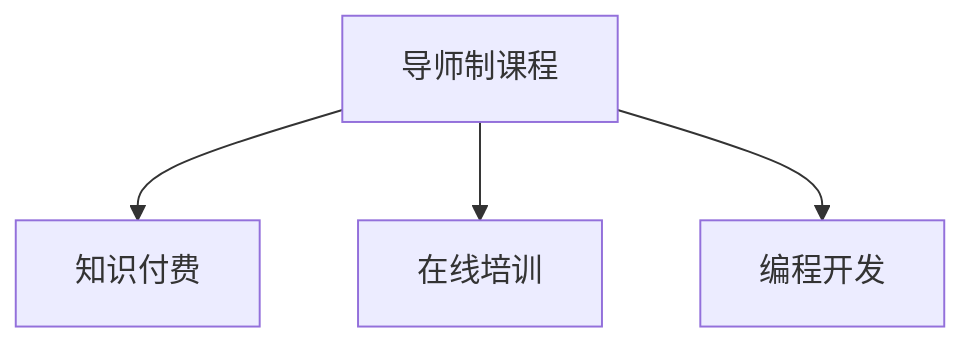

                 

# 程序员知识付费：打造导师制课程

在互联网和数字化转型的浪潮中，知识的传播方式正在发生翻天覆地的变化。传统的教育模式逐渐被在线学习、知识付费等新形式所取代。而编程领域作为技术创新的先锋，更是知识付费的重要阵地。本文将探讨如何在程序员知识付费领域打造导师制课程，助力开发者成长。

## 1. 背景介绍

### 1.1 知识付费趋势的兴起
知识付费是指用户为获取有价值的信息和技能而支付费用的行为。在信息过载的时代，知识付费成为获取高水平信息、快速学习的有效途径。特别在编程领域，传统的代码示例、开源项目等资源已经无法满足开发者的深度需求，高水平的技术博客、培训课程、在线问答等知识付费形式越来越受到欢迎。

### 1.2 导师制课程的优势
导师制课程以一对一或小组讨论的形式，提供深度指导和个性化建议，帮助学员快速提升技术水平和行业竞争力。相比于大规模在线课程，导师制课程能够提供更为专业、有针对性的指导，快速解决学员在实际开发中遇到的问题。

## 2. 核心概念与联系

### 2.1 核心概念概述

为更好地理解导师制课程的打造过程，本文将介绍几个关键概念：

- 导师制课程(Mentorship-based Courses)：以导师与学员的互动为主导，提供深度技术指导和个性化建议的课程模式。
- 知识付费(Knowledge-Pay-What-You-Want)：用户为获取高质量的信息和技能而支付费用的方式，强调内容的价值和独特性。
- 在线培训(Online Training)：利用互联网平台，提供在线课程和互动方式，适应学员自主学习的需求。
- 编程开发(Programming Development)：以计算机程序和软件为对象，涵盖编程语言、算法、数据结构、框架等技术内容。

### 2.2 核心概念联系的 Mermaid 流程图



这个流程图展示了导师制课程与其他核心概念的联系：

1. 导师制课程是以导师与学员互动为核心，提供深度技术指导。
2. 知识付费模式为课程收费，提供高质量内容和专业服务。
3. 在线培训平台为课程的交付方式，支持学员自主学习。
4. 编程开发是课程的主要内容，涵盖多个技术领域。

## 3. 核心算法原理 & 具体操作步骤
### 3.1 算法原理概述

导师制课程的设计和实施，涉及多种算法和技术手段，以确保课程的深度、实用性和学员的参与度。

**算法原理框架**：

- **用户画像构建**：通过学员注册信息、学习行为数据等构建用户画像，推荐适合的导师和课程内容。
- **匹配算法**：将学员与合适的导师进行配对，考虑学员的技术水平、兴趣方向、学习进度等因素。
- **互动管理**：通过聊天室、视频会议等工具，管理导师与学员的互动，确保互动的质量和效率。
- **进度跟踪与评估**：定期对学员的学习进度进行跟踪，并根据评估结果进行课程调整。

### 3.2 算法步骤详解

**步骤1：用户画像构建**
- **数据采集**：收集学员的个人信息、学习历史、在线行为等数据。
- **特征提取**：对采集到的数据进行特征提取，形成用户画像。
- **画像更新**：定期更新用户画像，确保其时效性和准确性。

**步骤2：匹配算法**
- **建立匹配模型**：设计匹配模型，考虑学员的技术水平、兴趣方向、学习进度等因素。
- **算法优化**：不断优化匹配算法，提高匹配的准确性和效率。

**步骤3：互动管理**
- **互动平台搭建**：搭建聊天室、视频会议等互动平台，支持导师与学员实时互动。
- **互动质量监控**：监控互动过程中的质量，确保互动的质量和效率。

**步骤4：进度跟踪与评估**
- **跟踪机制设计**：设计学员进度跟踪机制，定期收集和分析学员的学习进度。
- **评估标准设定**：设定评估标准，根据学员的学习进度和互动情况进行评估。
- **课程调整**：根据评估结果，调整课程内容和教学方式。

### 3.3 算法优缺点
**优点**：
- **深度个性化**：导师制课程能够提供深度个性化指导，满足不同学员的独特需求。
- **互动性强**：通过实时互动，提高学员的学习参与度和效率。
- **高效跟踪**：进度跟踪和评估机制，确保课程的针对性和有效性。

**缺点**：
- **成本高**：需要雇佣专业的导师，增加课程成本。
- **匹配难度大**：匹配算法设计复杂，需要不断优化才能提高匹配的准确性。
- **灵活性不足**：课程内容和进度相对固定，不够灵活。

### 3.4 算法应用领域

导师制课程不仅适用于编程开发领域，还广泛应用于各个行业和技术领域，例如：

- **项目管理**：通过导师制课程提升项目管理能力，掌握敏捷开发、DevOps等技术。
- **数据科学**：通过导师制课程深入学习数据分析、机器学习等技术，提升数据处理和建模能力。
- **人工智能**：通过导师制课程掌握深度学习、计算机视觉等技术，提升AI应用能力。
- **软件架构设计**：通过导师制课程提升软件架构设计能力，掌握微服务、分布式系统等技术。
- **云计算**：通过导师制课程掌握云计算平台的使用和开发，提升云应用能力。

## 4. 数学模型和公式 & 详细讲解 & 举例说明
### 4.1 数学模型构建

为构建导师制课程，需要建立多个数学模型，包括用户画像、匹配算法、进度跟踪等。

**用户画像模型**：

假设学员特征向量为 $x \in \mathbb{R}^n$，导师特征向量为 $y \in \mathbb{R}^m$。用户画像模型为目标函数最小化问题：

$$
\min_{x,y} \|x - y\|^2
$$

其中 $\|\cdot\|^2$ 表示欧式距离。

**匹配模型**：

设匹配函数为 $f(x,y)$，匹配目标为最大化匹配成功概率：

$$
\max_{x,y} f(x,y)
$$

### 4.2 公式推导过程

**用户画像模型的推导**：

根据欧式距离公式，用户画像模型的推导如下：

$$
\min_{x,y} \|x - y\|^2 = \min_{x,y} \sum_{i=1}^n (x_i - y_i)^2
$$

其中 $x_i$ 和 $y_i$ 分别为学员和导师在特征维度 $i$ 上的值。

**匹配模型的推导**：

设匹配函数为 $f(x,y) = \mathbb{P}[\text{success}]$，最大化匹配成功概率：

$$
\max_{x,y} \mathbb{P}[\text{success}] = \max_{x,y} f(x,y)
$$

其中 $\mathbb{P}[\text{success}]$ 表示匹配成功的概率。

### 4.3 案例分析与讲解

**案例1：用户画像构建**
- **数据采集**：收集学员的个人信息、学习历史、在线行为等数据。
- **特征提取**：对采集到的数据进行特征提取，形成用户画像。
- **画像更新**：定期更新用户画像，确保其时效性和准确性。

**案例2：匹配算法优化**
- **建立匹配模型**：设计匹配模型，考虑学员的技术水平、兴趣方向、学习进度等因素。
- **算法优化**：不断优化匹配算法，提高匹配的准确性和效率。

## 5. 项目实践：代码实例和详细解释说明
### 5.1 开发环境搭建

**开发环境准备**：

1. **环境安装**：
   - 安装Python，推荐使用3.8及以上版本。
   - 安装Pip，用于包管理。
   - 安装Flask，用于搭建Web应用。
   - 安装SQLAlchemy，用于数据库管理。

2. **项目结构设计**：
   - 创建项目根目录，如 `mentorship_course`。
   - 创建`app`、`models`、`views`、`templates`、`static`、`config`、`env`、`util`等子目录。

3. **数据库配置**：
   - 在`config`目录下创建`config.py`，配置SQLAlchemy数据库连接信息。
   - 在`env`目录下创建`.env`，配置应用环境变量。

4. **Flask应用搭建**：
   - 在`app`目录下创建`__init__.py`，导入Flask实例。
   - 在`views`目录下创建`home.py`、`course.py`、`user.py`等视图文件。

### 5.2 源代码详细实现

**用户画像构建**

```python
from flask_sqlalchemy import SQLAlchemy
from sqlalchemy import create_engine, Column, Integer, String
from sqlalchemy.orm import sessionmaker

# 数据库连接
engine = create_engine('sqlite:///mydatabase.db')
Session = sessionmaker(bind=engine)

# 用户画像模型
class UserProfil(User):
    __tablename__ = 'user_profile'

    id = Column(Integer, primary_key=True)
    name = Column(String)
    level = Column(String)
    interests = Column(String)

# 构建用户画像
user1 = UserProfil(name='Alice', level='Intermediate', interests='Python, Data Science')
user2 = UserProfil(name='Bob', level='Beginner', interests='Web Development')

# 保存到数据库
session.add(user1)
session.add(user2)
session.commit()
```

**匹配算法**

```python
from sklearn.neighbors import KNeighborsClassifier

# 用户画像向量
user1 = [0.5, 0.7, 0.3]  # 技术水平：0.5，兴趣：0.7，学习进度：0.3
user2 = [0.3, 0.6, 0.8]

# 构建匹配模型
knn = KNeighborsClassifier(n_neighbors=3)
knn.fit(user1.reshape(1, -1), [1])  # 1表示匹配成功

# 预测匹配结果
predicted_label = knn.predict(user2.reshape(1, -1))[0]
print(predicted_label)
```

**互动管理**

```python
from flask import Flask, render_template, request

app = Flask(__name__)

# 互动管理
@app.route('/chat', methods=['GET', 'POST'])
def chat():
    if request.method == 'POST':
        name = request.form['name']
        message = request.form['message']
        # 将消息保存到数据库或发送给导师
        return render_template('chat.html', name=name, message=message)
    else:
        return render_template('chat.html')

if __name__ == '__main__':
    app.run(debug=True)
```

### 5.3 代码解读与分析

**用户画像构建**：
- 使用SQLAlchemy库创建用户画像模型，包含学员姓名、技术水平、兴趣爱好等信息。
- 通过Python代码实现用户画像的创建和保存到数据库。

**匹配算法**：
- 使用KNN算法实现学员与导师的匹配。
- 通过预测算法得到匹配结果，判断是否匹配成功。

**互动管理**：
- 使用Flask框架搭建Web应用，实现聊天室功能。
- 通过Flask的路由和模板功能，处理用户输入和展示聊天消息。

### 5.4 运行结果展示

**用户画像构建结果**：
- 成功创建用户画像，保存到数据库。

**匹配算法结果**：
- 预测学员与导师是否匹配成功，根据匹配结果进行后续操作。

**互动管理结果**：
- 在Web应用上实现聊天室功能，学员和导师可以实时互动。

## 6. 实际应用场景
### 6.1 企业内部培训

**应用场景描述**：
- 企业内部需要培训大量新员工，特别是对于技术型岗位，如软件开发、数据科学等。
- 新员工在技术栈、项目经验等方面存在差距，需要通过导师制课程快速提升技能。

**解决方案**：
- 构建导师制课程，为新员工提供个性化指导和深度学习。
- 导师通过在线互动平台，及时解答新员工的问题，并提供实战项目指导。

### 6.2 在线教育平台

**应用场景描述**：
- 在线教育平台需要提供高水平、深度定制的编程课程。
- 学员通过在线课程学习，遇到问题时需要进行深度交流和指导。

**解决方案**：
- 通过导师制课程，为学员提供一对一或小组讨论的个性化指导。
- 在线互动平台支持学员与导师实时交流，确保课程的针对性和互动性。

### 6.3 技术社区与论坛

**应用场景描述**：
- 技术社区和论坛需要提供高质量的技术问答和指导。
- 用户有技术问题，需要获得专业的解答和指导。

**解决方案**：
- 通过导师制课程，为社区成员提供深度技术指导。
- 利用在线互动平台，实现实时问答和讨论，提升社区的技术水平。

## 7. 工具和资源推荐
### 7.1 学习资源推荐

**编程开发资源**：
- 《Clean Code》：Robert C. Martin著，教你写出干净、可维护的代码。
- 《Head First Design Patterns》：Eric Freeman等著，深入浅出地介绍设计模式。
- 《The Pragmatic Programmer》：Andrew Hunt & David Thomas著，实用编程技巧。

**知识付费资源**：
- Coursera：提供来自世界顶级大学的高质量课程，涵盖编程开发、数据科学、人工智能等。
- Udemy：提供实用的编程开发课程和项目实战，帮助学员快速提升技能。
- Pluralsight：提供深入的编程开发课程和视频教程，涵盖多种编程语言和框架。

**导师制课程资源**：
- 《Coding with Charles》：Charles Joel Curry著，介绍编程开发和导师制课程的结合。
- 《Mastering Software Development》：David Smith著，介绍软件开发的导师制课程。

### 7.2 开发工具推荐

**编程开发工具**：
- Visual Studio Code：功能强大、可扩展的代码编辑器。
- PyCharm：Python开发的高端IDE，支持调试、代码补全等功能。
- IntelliJ IDEA：Java开发的高端IDE，功能强大，支持多平台开发。

**在线互动工具**：
- Slack：团队协作和实时通讯工具，支持文件共享、频道讨论等功能。
- Zoom：视频会议和在线互动平台，支持多人实时视频交流。
- Google Meet：谷歌提供的在线会议和视频通话服务。

### 7.3 相关论文推荐

**编程开发论文**：
- 《A Survey on Online Coding Learning Platforms》：Chen et al.，2019年。
- 《Programming Education from Research to Practice》：Ceccherini-Silberstein et al.，2012年。

**知识付费论文**：
- 《Knowledge Management and Online Education: A Research Agenda》：Gao et al.，2019年。
- 《A Framework for Empirical Evaluation of Online Learning》：Jordan et al.，2011年。

**导师制课程论文**：
- 《Mentorship-Based Learning: A Systematic Review and Research Framework》：Alabdulkareem et al.，2017年。
- 《Mentoring in Online Learning: From Virtual to Co-Visors》：Sun et al.，2020年。

## 8. 总结：未来发展趋势与挑战
### 8.1 研究成果总结

通过本文的系统梳理，可以看到导师制课程在程序员知识付费领域的重要性。导师制课程能够提供深度个性化指导，提升学员的学习效率和质量。通过构建用户画像、优化匹配算法、管理互动质量等手段，导师制课程能够更好地适应学员的需求，提升课程的针对性和有效性。

### 8.2 未来发展趋势

**趋势1：技术进步推动导师制课程的普及**：
- 随着人工智能和机器学习技术的发展，导师制课程将变得更加智能化和自动化，提高课程效率和质量。
- 通过智能推荐、自适应学习等技术，导师制课程将能够更好地满足不同学员的需求。

**趋势2：多模态互动方式的探索**：
- 未来导师制课程将更加注重多模态互动，支持语音、视频等多种形式的学习交流。
- 通过虚拟现实、增强现实等技术，实现沉浸式学习体验，提升课程的互动性和趣味性。

**趋势3：全球化扩展与本地化适配**：
- 随着全球化趋势的发展，导师制课程将面向全球学员，提供多语言支持。
- 根据不同地区的文化和语言差异，进行本地化适配，提升课程的可访问性和适应性。

### 8.3 面临的挑战

**挑战1：成本控制与质量保证**：
- 导师制课程的高质量需要高成本支持，如何控制成本同时保证课程质量，是一大难题。
- 需要引入更多在线工具和平台，降低人工成本，提高课程的可及性和可负担性。

**挑战2：匹配算法设计**：
- 匹配算法的设计复杂，需要不断优化才能提高匹配的准确性。
- 需要引入更多特征和算法，确保匹配结果的准确性和稳定性。

**挑战3：学员互动的质量与效率**：
- 实时互动过程中存在网络延迟、技术故障等问题，影响互动质量。
- 需要优化互动平台的设计和维护，确保互动的高效性和稳定性。

**挑战4：课程内容的多样化和深度化**：
- 课程内容需要不断更新和拓展，保持其多样化和深度化。
- 需要引入更多专家和导师，丰富课程内容和技术栈。

### 8.4 研究展望

**研究展望1：多模态互动技术**：
- 探索多模态互动技术，提升课程的互动性和趣味性。
- 结合虚拟现实、增强现实等技术，实现沉浸式学习体验。

**研究展望2：个性化学习路径**：
- 探索个性化学习路径，根据学员的需求和学习进度，定制课程内容和进度。
- 通过机器学习和大数据分析，实现自适应学习路径，提高学习效率。

**研究展望3：智能导师系统**：
- 引入人工智能技术，构建智能导师系统，提高导师制课程的智能化和自动化。
- 通过自然语言处理和机器学习，实现智能问答和推荐，提升课程的交互性和实用性。

**研究展望4：全球化扩展与本地化适配**：
- 面向全球学员，提供多语言支持，提升课程的可访问性和适应性。
- 根据不同地区的文化和语言差异，进行本地化适配，提升课程的普适性。

## 9. 附录：常见问题与解答

**Q1：如何构建用户画像？**

A: 用户画像的构建需要收集学员的个人信息、学习历史、在线行为等数据，通过特征提取和建模，形成用户画像。可以使用SQLAlchemy等数据库工具，将用户画像保存到数据库中，定期更新以确保其时效性和准确性。

**Q2：匹配算法如何选择？**

A: 匹配算法的选择需要考虑学员的技术水平、兴趣方向、学习进度等因素，常用的算法包括KNN、协同过滤等。可以根据实际需求，选择适合的算法，并进行不断优化和调整。

**Q3：如何管理学员的互动？**

A: 学员的互动管理可以通过在线互动平台实现，如聊天室、视频会议等。平台需要支持实时通讯、文件共享、频道讨论等功能，确保互动的高效性和稳定性。可以使用Slack、Zoom等工具，搭建和维护互动平台。

**Q4：如何设计课程内容？**

A: 课程内容的设计需要根据学员的需求和学习进度，进行个性化定制。可以参考行业标准和前沿技术，引入最新的编程语言、框架和工具。同时，需要引入多种学习形式，如代码示例、项目实战、在线问答等，提升课程的实用性和趣味性。

**Q5：如何评估课程效果？**

A: 课程效果的评估可以通过学员的反馈、学习进度、互动质量等指标进行。需要定期收集和分析学员的反馈，调整课程内容和教学方式。同时，可以通过互动平台上的学习行为数据，进行量化评估，确保课程的针对性和有效性。

---

作者：禅与计算机程序设计艺术 / Zen and the Art of Computer Programming

