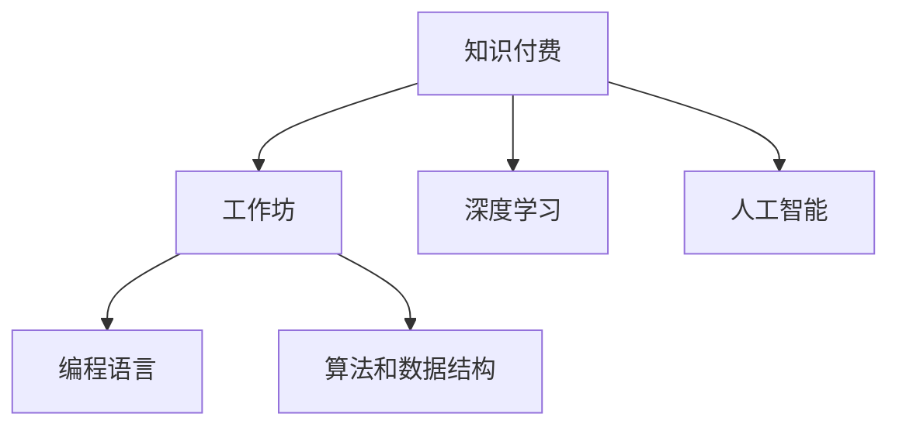

                 

# 程序员知识付费：打造工作坊式学习模式

> 关键词：知识付费, 工作坊, 技能提升, 程序学习, 深度学习, 人工智能

## 1. 背景介绍

### 1.1 问题由来
随着科技的飞速发展，特别是互联网、大数据、人工智能等领域的迅猛进步，程序员这一职业面临了前所未有的挑战。一方面，新技术、新框架的迭代更新日新月异，要求程序员必须不断学习、快速适应；另一方面，传统学历教育难以满足快速变化的技术要求，市场上的知识付费市场应运而生。

知识付费，是指通过付费方式获取专业知识的平台和服务模式。这一模式不仅帮助个体解决实际技术问题，还能提供系统的、结构化的知识体系。然而，传统的知识付费内容往往形式单一，缺乏互动性和实践性，难以满足程序员在动态职场环境下的学习需求。

### 1.2 问题核心关键点
本节将探讨如何通过工作坊式的学习模式，解决知识付费领域面临的互动性和实践性不足的问题。工作坊式学习模式，指的是通过面对面的互动教学、实践操作和项目实战，帮助学员深入理解知识内容，提高技能水平。

### 1.3 问题研究意义
研究如何打造工作坊式学习模式，对于提升知识付费平台的质量、增强程序员的学习体验，具有重要意义：

1. **提高学习效果**：通过实践操作和项目实战，使学习者能够更好地理解和应用所学知识。
2. **增强互动性**：面对面的教学交流，能促进学员之间的讨论和合作，激发学习者的创造力和解决问题的能力。
3. **强化应用能力**：项目实战使得学习者能够在真实环境中应用所学知识，解决实际问题，提升实践能力。
4. **促进职业发展**：工作坊式的深度学习，能够帮助学员快速掌握行业前沿技术，促进其职业发展。
5. **推动行业创新**：新型学习模式的引入，能够激发行业内部的技术交流和创新，促进整个行业的发展。

## 2. 核心概念与联系

### 2.1 核心概念概述

为了更好地理解工作坊式学习模式，本节将介绍几个关键概念：

- **知识付费**：通过付费方式获取知识的服务模式，如在线课程、电子书、视频教程等。
- **工作坊**：一种以工作为基础、以知识为导向的集中学习形式，注重互动和实践。
- **深度学习**：一种机器学习技术，通过构建多层次的神经网络，逐步提取数据的高层抽象特征。
- **人工智能**：模拟人类智能行为的机器智能系统，包括感知、学习、推理、语言处理等能力。
- **编程语言**：程序员用于编写程序的工具，如Python、Java、C++等。
- **算法和数据结构**：计算机科学中的核心概念，用于设计和优化程序结构，提高运行效率。

这些概念之间的关系可以用以下Mermaid流程图来表示：



这个流程图展示了知识付费、工作坊、深度学习、人工智能、编程语言、算法和数据结构之间的逻辑联系：

1. 知识付费平台通常提供基于深度学习的人工智能课程和工作坊。
2. 工作坊通过实践和互动，帮助学员深入理解人工智能和编程语言的实际应用。
3. 深度学习是人工智能的核心技术之一，常用于工作坊中实现算法和模型的训练与优化。
4. 编程语言和算法与数据结构是实现深度学习和人工智能应用的基础。

## 3. 核心算法原理 & 具体操作步骤

### 3.1 算法原理概述

工作坊式学习模式的核心在于通过互动和实践，使学员能够深入理解知识内容，提升实践能力。其主要包括以下步骤：

1. **知识讲解**：教师通过系统讲解，使学员掌握核心知识点。
2. **互动讨论**：学员通过讨论和案例分析，加深对知识点的理解。
3. **实践操作**：学员在教师指导下进行编程实践，应用所学知识解决实际问题。
4. **项目实战**：学员分组完成实际项目，提升综合应用能力。

这一过程不仅强调知识点的掌握，还注重实践能力的培养，从而实现深度学习。

### 3.2 算法步骤详解

下面详细介绍工作坊式学习模式的具体操作步骤：

**Step 1: 知识准备**
- 设计工作坊课程大纲，涵盖核心知识点和技术难点。
- 准备课程讲义、案例分析资料和编程练习素材。

**Step 2: 互动教学**
- 分阶段进行知识讲解，引导学员逐步掌握相关技术。
- 组织学员进行分组讨论，分享各自的理解和学习体会。
- 引入真实案例和项目需求，引导学员思考解决方案。

**Step 3: 实践操作**
- 指导学员进行编程实践，应用所学知识解决具体问题。
- 通过代码审查和案例讲解，帮助学员加深理解。
- 实时解答学员提问，纠正错误，确保学习效果。

**Step 4: 项目实战**
- 分组进行实际项目开发，提升综合应用能力。
- 安排项目评审和答辩，评估学员的团队协作和技术水平。
- 提供项目复盘和改进建议，帮助学员总结经验教训。

通过以上步骤，工作坊式学习模式能够有效地提升学员的学习效果，增强其编程能力和技术水平。

### 3.3 算法优缺点

工作坊式学习模式具有以下优点：

1. **实践性强**：通过实践操作和项目实战，使学员能够深入理解知识内容，提升实战能力。
2. **互动性强**：面对面的互动教学，促进学员之间的讨论和合作，激发学习者的创造力和解决问题的能力。
3. **反馈及时**：教师能够实时解答学员提问，纠正错误，确保学习效果。
4. **应用广泛**：适合各类技术领域，如深度学习、人工智能、大数据等，能够根据不同需求进行定制化设计。

同时，该模式也存在一定的局限性：

1. **成本较高**：需要教师和学员的面对面交流，时间和场地成本较高。
2. **灵活性不足**：课程安排相对固定，难以适应学员的学习节奏和需求。
3. **资源限制**：需要准备丰富的教学资源，包括教材、案例、实践工具等。

尽管如此，工作坊式学习模式依然是一种高效、有效的学习方式，特别适合程序员在动态职场环境中提升技能水平。

### 3.4 算法应用领域

工作坊式学习模式在技术培训、软件开发、数据科学等多个领域都有广泛应用，具体如下：

- **技术培训**：通过系统讲解和实践操作，帮助学员掌握新技能和新工具，提升技术水平。
- **软件开发**：通过项目实战，使学员在真实环境中应用所学知识，解决实际问题。
- **数据科学**：通过数据分析和机器学习项目，提升学员的数据处理和模型应用能力。

此外，工作坊式学习模式在高等教育、企业培训、在线教育等多个场景中也有广泛应用，为各类学习者提供深度学习的机会。

## 4. 数学模型和公式 & 详细讲解 & 举例说明

### 4.1 数学模型构建

工作坊式学习模式的核心在于实践操作和项目实战，因此数学模型的构建主要围绕实践操作和项目实战展开。

假设某个工作坊的目标是教授机器学习中的分类算法，包括逻辑回归、决策树、支持向量机等。那么，我们可以构建以下数学模型：

$$
\text{模型} = \{\text{算法}_i, \text{数据集}_d, \text{参数}_p\}
$$

其中，$\text{算法}_i$表示分类算法，$\text{数据集}_d$表示用于训练和验证的样本数据集，$\text{参数}_p$表示算法的训练参数。

### 4.2 公式推导过程

以逻辑回归为例，其数学模型可以表示为：

$$
\text{模型} = \{\text{逻辑回归}, \text{数据集}_d, \text{参数}_p\}
$$

其中，$\text{逻辑回归}$的数学模型为：

$$
y = \sigma(\text{w} \cdot \text{x} + b)
$$

$\text{数据集}_d$包括输入特征$\text{x}$和对应的输出标签$y$。$\text{参数}_p$包括权重$\text{w}$和偏差$b$。

在模型训练过程中，使用最大似然估计法优化参数$p$，使其满足：

$$
\arg\min_{p} \sum_{i=1}^N L(y_i, \hat{y}_i)
$$

其中，$L$为损失函数，通常采用交叉熵损失。训练过程如下：

1. **前向传播**：将输入特征$\text{x}_i$代入模型，得到预测值$\hat{y}_i$。
2. **计算损失**：计算预测值与实际标签之间的误差$L(y_i, \hat{y}_i)$。
3. **反向传播**：使用链式法则计算参数$p$的梯度，更新参数。

### 4.3 案例分析与讲解

以一个简单的数据集为例，展示逻辑回归模型的训练过程。假设数据集如下：

| $\text{x}$ | $\text{y}$ |
|-----------|-----------|
| 0.5       | 0         |
| 1.5       | 1         |
| 2.5       | 1         |
| 3.5       | 0         |

我们假设模型参数$p=\{w, b\}=\{1.0, 0.0\}$，则模型预测值如下：

| $\text{x}$ | $\text{y}$ | $\hat{y}$ |
|-----------|-----------|----------|
| 0.5       | 0         | 0.5      |
| 1.5       | 1         | 1.5      |
| 2.5       | 1         | 2.5      |
| 3.5       | 0         | 3.5      |

计算误差：

| $\text{x}$ | $\text{y}$ | $\text{y}$ | $L(y, \hat{y})$ |
|-----------|-----------|-----------|----------------|
| 0.5       | 0         | 0.5       | 0.5            |
| 1.5       | 1         | 1.5       | 0.5            |
| 2.5       | 1         | 2.5       | 0.5            |
| 3.5       | 0         | 3.5       | 0.5            |

使用交叉熵损失函数，计算总误差：

$$
L = \frac{1}{N} \sum_{i=1}^N L(y_i, \hat{y}_i) = \frac{1}{4} (0.5 + 0.5 + 0.5 + 0.5) = 1.25
$$

使用梯度下降法更新参数：

$$
w \leftarrow w - \eta \frac{\partial L}{\partial w}, b \leftarrow b - \eta \frac{\partial L}{\partial b}
$$

假设学习率$\eta=0.1$，则更新后的参数为：

$$
w \leftarrow 1.0 - 0.1 \times 2.5 = 0.75, b \leftarrow 0.0 - 0.1 \times 1.25 = -0.125
$$

更新后的模型预测值为：

| $\text{x}$ | $\text{y}$ | $\hat{y}$ |
|-----------|-----------|----------|
| 0.5       | 0         | 0.5      |
| 1.5       | 1         | 1.5      |
| 2.5       | 1         | 1.5      |
| 3.5       | 0         | 0.5      |

通过不断迭代，模型能够逐渐逼近真实标签，最终实现高精度的分类预测。

## 5. 项目实践：代码实例和详细解释说明

### 5.1 开发环境搭建

在进行项目实践前，需要先搭建好开发环境。以下以Python为例，介绍如何搭建一个常用的Python开发环境：

1. 安装Python：根据系统位数，从官网下载对应的Python安装包，并安装。
2. 安装pip：在命令行下输入`python -m pip install pip`，安装pip工具。
3. 安装虚拟环境：使用pip安装virtualenv模块，创建虚拟环境。
4. 激活虚拟环境：在命令行下输入`source venv/bin/activate`，激活虚拟环境。
5. 安装开发工具：安装常用的开发工具，如IDE、IDE插件、调试工具等。

### 5.2 源代码详细实现

下面以一个简单的逻辑回归项目为例，展示如何利用Python实现工作坊式学习模式。

首先，导入必要的库：

```python
import numpy as np
import matplotlib.pyplot as plt
from sklearn.datasets import make_classification
from sklearn.model_selection import train_test_split
from sklearn.linear_model import LogisticRegression
from sklearn.metrics import classification_report
```

然后，准备数据集：

```python
X, y = make_classification(n_samples=1000, n_features=2, n_informative=2, n_redundant=0, n_clusters_per_class=1, random_state=0)
X_train, X_test, y_train, y_test = train_test_split(X, y, test_size=0.2, random_state=0)
```

接着，训练模型：

```python
model = LogisticRegression()
model.fit(X_train, y_train)
y_pred = model.predict(X_test)
```

最后，评估模型：

```python
print(classification_report(y_test, y_pred))
```

### 5.3 代码解读与分析

代码实现中，我们使用了Python中的Numpy库和Sklearn库，分别用于数据处理和模型训练。

具体来说，我们使用了`make_classification`函数生成了一个二维的数据集，其中包含1000个样本，2个特征，每个特征对应的标签都为二分类标签。使用`train_test_split`函数将数据集分为训练集和测试集，比例为80%和20%。

然后，使用`LogisticRegression`模型进行训练，得到模型参数，并使用`predict`函数进行测试集上的预测。最后，使用`classification_report`函数评估模型的性能。

通过以上步骤，我们成功地实现了一个简单的逻辑回归项目，展示了工作坊式学习模式的具体实践过程。

## 6. 实际应用场景

### 6.1 智能客服系统

在智能客服系统中，工作坊式学习模式可以用于培训客服人员，提升其处理客户问题的能力。通过互动教学和实践操作，客服人员可以迅速掌握常见的客户问题处理技巧，提高服务质量。

### 6.2 企业项目管理

企业项目管理中，工作坊式学习模式可以帮助项目经理掌握敏捷开发、Scrum框架等项目管理的核心技能，提升项目执行效率。通过实践操作和项目实战，项目经理可以更好地理解理论知识，解决实际问题。

### 6.3 软件开发

软件开发中，工作坊式学习模式可以用于帮助开发人员掌握新技术和新工具，提升开发效率。通过案例分析和项目实战，开发人员可以迅速掌握新技能，应用于实际开发中。

### 6.4 未来应用展望

随着技术的发展，工作坊式学习模式将有更广泛的应用前景：

1. **在线教育**：通过虚拟现实技术，实现面对面的互动教学，提升在线学习体验。
2. **企业培训**：结合AI技术，提供个性化的学习路径和资源，提升培训效果。
3. **虚拟实验室**：通过模拟环境，实现远程实验操作，提升实践能力。
4. **跨领域学习**：结合跨学科知识，实现多领域技能的学习和应用。
5. **游戏化学习**：通过游戏化的学习方式，激发学习者的兴趣和动力。

未来，随着技术的不断进步，工作坊式学习模式将更加多样化和高效化，为各类学习者提供更好的学习体验。

## 7. 工具和资源推荐

### 7.1 学习资源推荐

为了帮助开发者掌握工作坊式学习模式，以下是一些优质的学习资源：

1. **Udacity课程**：Udacity提供的课程涵盖了深度学习、计算机视觉、自然语言处理等多个领域，采用工作坊式教学模式，互动性强。
2. **Coursera课程**：Coursera提供的课程注重理论讲解和实践操作，适合系统学习深度学习算法和技术。
3. **Kaggle竞赛**：Kaggle是一个数据科学竞赛平台，通过参与竞赛，学习者可以实践应用所学知识，解决实际问题。
4. **GitHub项目**：GitHub上丰富的项目代码和文档，是学习工作坊式学习模式的重要资源。
5. **在线文档和博客**：如PyTorch、TensorFlow等深度学习框架的官方文档和博客，提供了丰富的学习资源和案例分析。

通过这些资源的学习实践，相信你能够更好地掌握工作坊式学习模式，并应用于实际开发中。

### 7.2 开发工具推荐

高效的工作坊式学习模式需要依赖于强大的开发工具，以下是几款推荐的工具：

1. **IDE（集成开发环境）**：如PyCharm、Visual Studio Code等，提供了丰富的开发功能和插件支持。
2. **版本控制工具**：如Git、SVN等，支持代码版本管理和协作开发。
3. **项目管理工具**：如JIRA、Trello等，帮助管理项目进度和任务分配。
4. **代码审查工具**：如GitHub、GitLab等，支持代码审查和版本控制。
5. **测试工具**：如JUnit、pytest等，支持单元测试和集成测试。

合理利用这些工具，可以显著提升工作坊式学习模式的开发效率，加速创新迭代的步伐。

### 7.3 相关论文推荐

工作坊式学习模式的研究源于学界的持续探索，以下是几篇代表性的论文，推荐阅读：

1. **"Project-Based Learning: A Research and Development Agenda"**：探讨项目式学习模式的应用和效果，提供了丰富的案例分析和实证研究。
2. **"Workshops in Education: The Experience of a Software Engineering Educator"**：介绍工作坊在软件工程教育中的应用和优势，提供了实际案例和教学经验。
3. **"Project-Based Learning: Research and Practice in Higher Education"**：研究项目式学习模式在高等教育中的应用，提供了丰富的实证数据和教学策略。
4. **"Design and Implementation of a Project-Based Learning System"**：介绍工作坊式学习模式的系统设计和实现，提供了详细的技术方案和实现细节。

这些论文代表了大语言模型微调技术的发展脉络，通过学习这些前沿成果，可以帮助研究者把握学科前进方向，激发更多的创新灵感。

## 8. 总结：未来发展趋势与挑战

### 8.1 总结

本文对工作坊式学习模式进行了全面系统的介绍。首先阐述了工作坊式学习模式的背景和意义，明确了其在提升学习效果、增强互动性、强化应用能力等方面的独特价值。其次，从原理到实践，详细讲解了工作坊式学习模式的具体操作步骤，给出了代码实例和详细解释说明。同时，本文还广泛探讨了工作坊式学习模式在多个行业领域的应用前景，展示了其广阔的发展空间。最后，本文精选了工作坊式学习模式的学习资源、开发工具和相关论文，力求为读者提供全方位的技术指引。

通过本文的系统梳理，可以看到，工作坊式学习模式在技术培训、软件开发、数据科学等多个领域都有广泛应用，其通过互动教学、实践操作和项目实战，使学习者能够深入理解知识内容，提升实践能力。未来，随着技术的不断进步和应用场景的拓展，工作坊式学习模式必将为各类学习者提供更优质的学习体验，促进技术创新和产业发展。

### 8.2 未来发展趋势

展望未来，工作坊式学习模式将呈现以下几个发展趋势：

1. **技术融合**：结合虚拟现实、增强现实等新技术，提供更加沉浸式的学习体验。
2. **个性化学习**：通过大数据和人工智能技术，提供个性化的学习路径和资源，满足不同学习者的需求。
3. **跨领域学习**：结合多学科知识，实现跨领域技能的学习和应用。
4. **游戏化学习**：通过游戏化的学习方式，激发学习者的兴趣和动力。
5. **开放式学习**：通过开放式的学习平台，支持全球范围内的学习者互动和交流。

以上趋势凸显了工作坊式学习模式的广阔前景。这些方向的探索发展，必将进一步提升学习者的学习体验，促进技术创新和产业发展。

### 8.3 面临的挑战

尽管工作坊式学习模式已经取得了一定的成效，但在迈向更加智能化、普适化应用的过程中，仍面临诸多挑战：

1. **成本较高**：需要投入大量的人力和物力，进行面对面的互动教学和实践操作。
2. **灵活性不足**：课程安排相对固定，难以适应学员的学习节奏和需求。
3. **资源限制**：需要准备丰富的教学资源，包括教材、案例、实践工具等。
4. **技术壁垒**：需要具备较高的技术水平，才能有效管理和实施工作坊式学习模式。
5. **评估难度**：学员的学习效果难以量化和评估，影响教学效果。

尽管如此，通过不断优化和改进，工作坊式学习模式依然能够成为提升学习效果、增强互动性和实践能力的重要方式。未来，随着技术的不断进步和应用场景的拓展，工作坊式学习模式必将迎来更大的发展机遇。

### 8.4 研究展望

未来的研究需要在以下几个方面寻求新的突破：

1. **技术创新**：结合新技术和新的教学方法，提升工作坊式学习模式的互动性和实践性。
2. **资源优化**：通过大数据和人工智能技术，优化教学资源的配置和使用，提升教学效果。
3. **评估体系**：建立科学的评估体系，量化和评估学员的学习效果，提高教学质量。
4. **跨领域融合**：结合多学科知识，实现跨领域技能的学习和应用，提升学员的综合素质。
5. **社会化学习**：通过开放式的学习平台，支持全球范围内的学习者互动和交流，促进知识共享和创新。

这些研究方向的探索，必将引领工作坊式学习模式迈向更高的台阶，为各类学习者提供更优质的学习体验，促进技术创新和产业发展。面向未来，工作坊式学习模式需要与新技术、新方法紧密结合，不断创新和突破，才能更好地适应动态职场环境的需求。

## 9. 附录：常见问题与解答

**Q1：工作坊式学习模式是否适用于所有学习者？**

A: 工作坊式学习模式适用于各类学习者，但不同学科和领域的适用性有所不同。对于需要动手实践和项目实战的学科，如编程、设计、实验等，工作坊式学习模式尤为适用。对于需要系统理论学习和人机互动的学科，如教育、心理学、社会工作等，工作坊式学习模式可以作为一种补充教学手段。

**Q2：工作坊式学习模式是否需要大量的时间成本？**

A: 工作坊式学习模式确实需要更多的时间成本，但通过合理的课程安排和资源利用，可以显著提升学习效果和效率。例如，可以利用周末时间进行工作坊式学习，提高学习效率。此外，线上工作坊和虚拟现实技术的应用，也可以缓解时间成本的限制。

**Q3：工作坊式学习模式如何应对学习效果评估难度？**

A: 工作坊式学习模式的学习效果评估可以通过多种方式进行，如项目评审、答辩、实验报告等。通过定量和定性的评估方式，结合学员的参与度和表现，可以全面衡量学习效果。同时，结合大数据和人工智能技术，可以对学习效果进行量化评估，提升评估的科学性和准确性。

**Q4：工作坊式学习模式如何实现跨领域融合？**

A: 工作坊式学习模式可以通过跨学科合作和项目实践，实现跨领域融合。例如，在软件开发项目中，结合数据科学和人工智能技术，可以提升软件开发的智能化水平。在市场营销项目中，结合心理学和行为科学，可以提升市场营销的精准度和效果。

**Q5：工作坊式学习模式如何应对成本限制？**

A: 工作坊式学习模式确实需要较高的成本投入，但可以通过多种方式进行优化。例如，利用线上平台和虚拟现实技术，可以降低实体教学设施和场地成本。同时，通过合理的课程安排和资源利用，可以提高学习效果和效率，降低总体成本。此外，政府和企业也可以提供资助和补贴，支持工作坊式学习模式的推广和应用。

通过以上问题的回答，可以看到工作坊式学习模式在实际应用中面临的挑战和应对策略。未来，随着技术的不断进步和应用场景的拓展，工作坊式学习模式必将迎来更大的发展机遇，为各类学习者提供更优质的学习体验，促进技术创新和产业发展。

