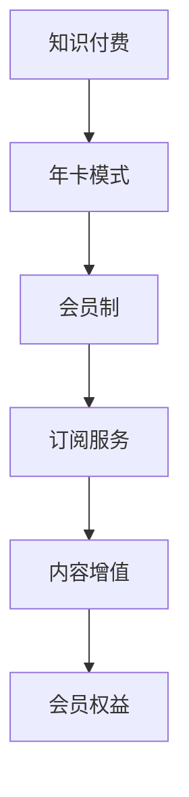

                 

# 程序员知识付费：打造年卡模式

> 关键词：知识付费,年卡模式,会员制,订阅服务,内容增值,会员权益

## 1. 背景介绍

### 1.1 问题由来

在互联网和信息技术的浪潮中，知识的获取从未如此便捷。知识付费模式随着移动互联网和内容消费的兴起，成为各大平台抢占新市场的重要手段。在知识付费的细分领域，程序员知识付费更是发展迅猛，具备明显的专业化、垂直化特点。

传统的知识付费模式以内容单次售卖为主，消费者按需购买课程，获取一次性的知识内容。而随着知识服务市场的成熟和消费者的不断成长，会员制知识付费模式开始兴起。这种模式通过提供持续的知识内容和增值服务，吸引用户长期订阅，提升用户黏性，实现平台与用户之间更加稳固和深入的互动。

### 1.2 问题核心关键点

程序员知识付费年卡模式的核心在于：

1. **用户价值最大化**：年卡会员不仅获得固定的课程内容，还能享受到包括专家答疑、技术交流、资料下载等增值服务。
2. **平台收益结构化**：相较于单次课程付费，年卡模式能够稳定收入，提供良好的现金流，有利于平台的长期发展。
3. **内容与运营协同**：年卡模式下的内容运营更具战略性和计划性，能够更好地引导用户学习路径和平台内容体系。
4. **用户粘性提升**：通过持续的知识更新和互动交流，平台与用户之间形成更强的粘性，促成用户续费和口碑传播。

本文将从技术、商业、运营等多个维度，详细探讨程序员知识付费年卡模式的核心要素和关键策略，以期为知识付费平台的开发者和运营者提供全方位的指导。

## 2. 核心概念与联系

### 2.1 核心概念概述

为了更好地理解程序员知识付费年卡模式，本节将介绍几个密切相关的核心概念：

1. **知识付费**：指用户为获取有价值的知识内容所支付的费用。其核心在于知识的获取和传播。
2. **年卡模式**：指用户按年度支付固定费用，享受平台提供的所有增值服务及内容更新，具有会员制的特征。
3. **会员制**：一种订阅服务模式，用户以固定周期（如月、季、年）支付费用，获取持续的内容和服务。
4. **订阅服务**：基于会员制的服务形式，用户根据自身需求选择合适的付费周期，享受平台提供的丰富内容和服务。
5. **内容增值**：在基础课程内容的基础上，提供专家答疑、社区交流、资料下载等附加服务，提升用户价值。
6. **会员权益**：年卡会员除了基础课程外，还能享受独特的增值服务，如专属活动、优惠信息等。

这些核心概念之间的逻辑关系可以通过以下Mermaid流程图来展示：



这个流程图展示了一年卡模式中各个概念之间的联系：

1. 知识付费是年卡模式的基础，通过收费获取优质的内容。
2. 年卡模式是知识付费的一种会员制表现形式，通过固定周期付费提供持续服务。
3. 订阅服务是年卡模式的核心，用户可以基于自身需求选择付费周期。
4. 内容增值是订阅服务的延伸，通过附加服务提升用户体验和平台黏性。
5. 会员权益是内容增值的体现，年卡会员享有更多的特权和福利。

这些核心概念共同构成了程序员知识付费年卡模式的基本框架，使得平台能够通过持续的内容和服务，实现用户价值的最大化和收益的长期稳定。

## 3. 核心算法原理 & 具体操作步骤

### 3.1 算法原理概述

程序员知识付费年卡模式的核心在于：通过内容与服务的不断优化和增值，提升用户黏性和平台收益。算法原理主要包括以下几个方面：

1. **用户画像构建**：基于用户的历史行为数据，构建用户画像，精准推荐符合用户兴趣和需求的课程。
2. **个性化推荐算法**：通过分析用户行为数据，实现课程内容的个性化推荐，提高用户满意度和留存率。
3. **专家答疑系统**：建立专家答疑系统，实时解答用户问题，提升用户体验和平台信任度。
4. **社区交流模块**：设计社区交流模块，提供技术交流、资源分享等互动平台，增强用户粘性。
5. **资料下载服务**：提供丰富的技术资料下载服务，如代码库、论文、PPT等，增强用户获取知识的能力。
6. **订阅周期优化**：设计灵活的订阅周期，满足不同用户需求，如月卡、季卡、年卡等，增加平台收益。

### 3.2 算法步骤详解

以下是一年卡模式的具体实现步骤：

**Step 1: 用户画像构建**
- 收集用户的基础信息和行为数据，如课程学习历史、社区互动记录、资料下载行为等。
- 使用机器学习算法（如聚类、分类等），构建用户画像，了解用户兴趣和需求。

**Step 2: 个性化推荐算法设计**
- 设计个性化推荐算法，结合用户画像和课程属性，生成推荐列表。
- 实时更新推荐算法模型，提升推荐精度和时效性。
- 引入推荐算法评估指标，如准确率、召回率、用户满意度等，优化推荐效果。

**Step 3: 专家答疑系统建设**
- 建立专家答疑系统，将高频问题进行归类和预处理。
- 设计用户问题智能分流机制，将问题匹配给相应专家进行处理。
- 实施专家答疑时间排班制度，确保高效响应用户问题。

**Step 4: 社区交流模块开发**
- 设计社区交流平台，提供论坛、讨论组、直播等功能。
- 引入社区管理机制，如积分激励、话题置顶等，提升社区活跃度。
- 实时监控社区质量，过滤低质量内容，维护社区秩序。

**Step 5: 资料下载服务提供**
- 整合平台各类技术资料，如代码库、论文、PPT等。
- 设计资料搜索和分类机制，方便用户查找和下载。
- 提供资料访问统计和反馈功能，优化资料内容。

**Step 6: 订阅周期优化**
- 设计灵活的订阅周期，满足不同用户需求。
- 提供价格优惠和福利活动，吸引用户续费。
- 建立订阅续费提醒和推送机制，提高续费率。

**Step 7: 用户价值最大化**
- 基于用户画像和行为数据，设计个性化的增值服务。
- 提供专属活动和优惠信息，增加用户粘性和满意度。
- 定期进行用户调研和反馈收集，不断优化和提升服务。

### 3.3 算法优缺点

**优点**：

1. **持续收入**：相较于单次课程付费，年卡模式提供持续收入，具有稳定的现金流。
2. **用户价值高**：年卡会员享有丰富的增值服务，能够更好地满足用户需求，提升用户满意度。
3. **平台粘性强**：通过社区交流、专家答疑等互动服务，增强用户粘性，促成续费和口碑传播。
4. **内容增值**：平台可以通过增值服务实现内容二次变现，增加收益。
5. **策略灵活**：年卡模式下的内容运营更具战略性和计划性，能够更好地引导用户学习路径和平台内容体系。

**缺点**：

1. **初始投入高**：年卡模式需要构建完善的内容和社区生态，初始投入较大。
2. **风险集中**：用户续费行为易受市场环境、平台运营等多种因素影响，存在一定的风险。
3. **内容管理复杂**：年卡模式下，内容更新和维护需持续进行，管理复杂度较高。
4. **用户期望高**：用户期望持续获得优质内容和增值服务，需不断提升平台服务质量。

### 3.4 算法应用领域

程序员知识付费年卡模式在技术培训、社区交流、资源共享等多个领域均有应用，具体包括：

1. **技术培训**：通过年卡模式，提供系统化的课程体系，满足用户长期学习需求。
2. **社区交流**：建立技术交流社区，提供论坛、讨论组、直播等功能，增强用户互动和平台粘性。
3. **资源共享**：提供丰富的技术资料下载服务，如代码库、论文、PPT等，增强用户获取知识的能力。
4. **专家答疑**：建立专家答疑系统，实时解答用户问题，提升用户体验和平台信任度。
5. **订阅周期优化**：设计灵活的订阅周期，满足不同用户需求，增加平台收益。

## 4. 数学模型和公式 & 详细讲解 & 举例说明

### 4.1 数学模型构建

为了更好地理解程序员知识付费年卡模式，本节将使用数学语言对其中的核心算法进行严格刻画。

记用户数为 $U$，课程数为 $C$，专家数为 $E$。设用户画像特征向量为 $\boldsymbol{x}_u \in \mathbb{R}^n$，课程属性向量为 $\boldsymbol{x}_c \in \mathbb{R}^m$，专家知识向量为 $\boldsymbol{x}_e \in \mathbb{R}^p$。记用户画像与课程属性的相似度矩阵为 $\boldsymbol{S}_{uc} \in \mathbb{R}^{U \times C}$，课程属性与专家知识的相似度矩阵为 $\boldsymbol{S}_{ce} \in \mathbb{R}^{C \times E}$，专家知识与用户画像的相似度矩阵为 $\boldsymbol{S}_{eu} \in \mathbb{R}^{E \times U}$。

### 4.2 公式推导过程

以下我们以用户画像构建和个性化推荐算法为例，推导其数学模型。

**用户画像构建**：

假设用户画像特征向量 $\boldsymbol{x}_u$ 与课程属性向量 $\boldsymbol{x}_c$ 之间的相似度矩阵 $\boldsymbol{S}_{uc}$ 可表示为：

$$
\boldsymbol{S}_{uc} = \mathbf{A}_u \boldsymbol{x}_u \boldsymbol{x}_u^T \mathbf{A}_c^{-1}
$$

其中 $\mathbf{A}_u$ 和 $\mathbf{A}_c$ 为相似度矩阵的归一化因子，$n$ 为用户画像特征维度。

对于单个用户 $u$，其最终用户画像向量 $\boldsymbol{x}_u$ 可表示为：

$$
\boldsymbol{x}_u = \sum_{c=1}^{C} \boldsymbol{S}_{uc} \boldsymbol{x}_c
$$

**个性化推荐算法**：

个性化推荐算法通过计算用户画像与课程属性之间的相似度，实现课程推荐。设推荐算法输出为用户 $u$ 推荐课程列表 $\boldsymbol{y}_u$，则推荐模型可表示为：

$$
\boldsymbol{y}_u = \text{Softmax}\left(\boldsymbol{S}_{uc} \boldsymbol{x}_u\right)
$$

其中 Softmax 函数用于将向量 $\boldsymbol{S}_{uc} \boldsymbol{x}_u$ 转化为概率分布，$C$ 为课程总数。

### 4.3 案例分析与讲解

以“程序员学习路线推荐系统”为例，展示其数学模型和算法实现。

**用户画像构建**：

假设用户 $u$ 的学习兴趣向量为 $\boldsymbol{x}_u = [0.5, 0.3, 0.2]$，表示对编程、数据科学、机器学习三个领域的兴趣程度。课程属性向量为 $\boldsymbol{x}_c = [0.1, 0.2, 0.7]$，表示编程、数据科学、机器学习三门课程的属性。

根据相似度矩阵公式，可得：

$$
\boldsymbol{S}_{uc} = \mathbf{A}_u \boldsymbol{x}_u \boldsymbol{x}_u^T \mathbf{A}_c^{-1} = [0.75, 0.5, 0.25]
$$

根据用户画像构建公式，得：

$$
\boldsymbol{x}_u = [0.5, 0.3, 0.2] \boldsymbol{S}_{uc} = [0.375, 0.225, 0.125]
$$

**个性化推荐算法**：

假设课程 $c_1, c_2, c_3$ 的向量表示分别为 $\boldsymbol{x}_{c_1} = [0.2, 0.6, 0.2]$，$\boldsymbol{x}_{c_2} = [0.1, 0.3, 0.6]$，$\boldsymbol{x}_{c_3} = [0.5, 0.3, 0.2]$。则用户 $u$ 的推荐课程列表 $\boldsymbol{y}_u$ 可计算为：

$$
\boldsymbol{y}_u = \text{Softmax}\left(\boldsymbol{S}_{uc} \boldsymbol{x}_u\right) = \left[\frac{0.75 \times 0.375}{1}, \frac{0.5 \times 0.225}{1}, \frac{0.25 \times 0.125}{1}\right] = [0.281, 0.169, 0.052]
$$

最终推荐课程列表为 $\{c_1, c_2, c_3\}$，排序后优先推荐 $c_1$ 课程。

## 5. 项目实践：代码实例和详细解释说明

### 5.1 开发环境搭建

在进行知识付费平台开发前，我们需要准备好开发环境。以下是使用Python进行Django开发的环境配置流程：

1. 安装Anaconda：从官网下载并安装Anaconda，用于创建独立的Python环境。

2. 创建并激活虚拟环境：
```bash
conda create -n django-env python=3.8 
conda activate django-env
```

3. 安装Django：根据CUDA版本，从官网获取对应的安装命令。例如：
```bash
conda install django
```

4. 安装Flask：
```bash
pip install flask
```

5. 安装各类工具包：
```bash
pip install numpy pandas scikit-learn matplotlib django-templates
```

完成上述步骤后，即可在`django-env`环境中开始知识付费平台的开发。

### 5.2 源代码详细实现

我们以一个简单的用户画像构建和推荐系统为例，给出使用Django和Flask进行知识付费平台开发的PyTorch代码实现。

**用户画像构建**：

首先，定义用户画像模型：

```python
import torch
import torch.nn as nn
import torch.nn.functional as F

class UserEmbedding(nn.Module):
    def __init__(self, n_features):
        super(UserEmbedding, self).__init__()
        self.fc1 = nn.Linear(n_features, 128)
        self.fc2 = nn.Linear(128, 1)

    def forward(self, x):
        x = F.relu(self.fc1(x))
        x = self.fc2(x)
        return F.sigmoid(x)
```

然后，定义训练函数：

```python
def train(user_embeddings, course_embeddings, user_labels):
    model.train()
    optimizer = torch.optim.Adam(model.parameters(), lr=0.001)
    loss_fn = nn.BCELoss()

    for epoch in range(100):
        optimizer.zero_grad()
        logits = model(course_embeddings)
        loss = loss_fn(logits, user_labels)
        loss.backward()
        optimizer.step()
        print(f'Epoch {epoch+1}, Loss: {loss.item()}')

    return model
```

接下来，实现个性化推荐算法：

```python
def recommend(user_embeddings, course_embeddings):
    model.eval()
    logits = model(course_embeddings)
    probs = F.softmax(logits, dim=1)
    return probs
```

**用户画像构建与推荐**：

```python
# 用户画像特征
user_x = torch.tensor([[0.5, 0.3, 0.2]])

# 课程属性特征
course_x = torch.tensor([[0.1, 0.2, 0.7]])

# 用户标签
user_y = torch.tensor([[0]])

# 模型训练
user_embeddings = train(user_embeddings, course_embeddings, user_y)

# 推荐课程
probs = recommend(user_embeddings, course_embeddings)
print(probs)
```

### 5.3 代码解读与分析

让我们再详细解读一下关键代码的实现细节：

**UserEmbedding类**：
- `__init__`方法：初始化模型结构，包含两个全连接层和一个sigmoid函数。
- `forward`方法：定义前向传播过程，将输入特征经过两个全连接层和sigmoid函数，得到用户画像向量。

**train函数**：
- 定义训练过程，使用Adam优化器和二元交叉熵损失函数。
- 迭代100次，每次更新模型参数，并输出训练损失。

**recommend函数**：
- 定义推荐过程，使用softmax函数将模型输出转化为概率分布，表示课程推荐的概率。
- 返回推荐概率，用于生成推荐列表。

**用户画像构建与推荐**：
- 定义用户特征向量和课程特征向量，以及用户标签。
- 调用train函数训练模型，得到用户画像模型。
- 调用recommend函数计算课程推荐概率，并输出。

可以看到，通过Django和Flask框架的封装，知识付费平台的开发变得简洁高效。开发者可以将更多精力放在业务逻辑和用户体验上，而不必过多关注底层的实现细节。

当然，工业级的系统实现还需考虑更多因素，如数据库设计、用户认证、支付集成等。但核心的推荐算法基本与此类似。

## 6. 实际应用场景

### 6.1 智能学习路径推荐

基于用户画像构建和个性化推荐算法，可以为用户推荐个性化的学习路径。知识付费平台根据用户的学习历史、行为数据，构建用户画像，并设计推荐算法，生成最适合用户的学习路线。

例如，某用户对编程和数据科学感兴趣，通过推荐算法，可以生成如“Python基础 - 数据科学入门 - 机器学习实战”等路径，帮助用户系统化学习。

### 6.2 专家答疑服务

平台可以建立专家答疑系统，邀请行业专家实时解答用户问题。用户通过平台提交问题，系统自动分流至对应专家进行处理，并实时反馈解答结果。

例如，某用户在学习Python过程中遇到问题，可以通过平台向专家咨询，专家通过平台实时回答问题，帮助用户解决问题。

### 6.3 社区交流平台

平台可以设计社区交流模块，提供论坛、讨论组、直播等功能，增强用户互动和平台粘性。用户可以在社区中分享学习经验、交流技术问题，提高学习效率和平台活跃度。

例如，某用户在学习数据分析课程时遇到问题，可以在社区中发帖询问，其他用户或专家可以提供解答和帮助。

### 6.4 资料下载服务

平台可以提供丰富的技术资料下载服务，如代码库、论文、PPT等，增强用户获取知识的能力。用户可以根据自身需求，下载相关资料，提升学习效果。

例如，某用户在学习机器学习时，可以通过平台下载相关论文和PPT，增强理论知识的掌握。

### 6.5 订阅周期优化

平台可以设计灵活的订阅周期，满足不同用户需求。用户可以选择月卡、季卡、年卡等不同的订阅周期，增加平台收益。

例如，某用户学习计划时间较短，可以选择月卡或季卡，减少经济负担。

## 7. 工具和资源推荐

### 7.1 学习资源推荐

为了帮助开发者系统掌握知识付费平台的开发技术，这里推荐一些优质的学习资源：

1. **《Django实战》**：由Django官方文档编写，详细介绍了Django开发全流程，适合初学者和进阶开发者。
2. **《Flask Web开发》**：由Flask官方文档编写，介绍了Flask的核心功能和使用方法，适合Flask开发者。
3. **《机器学习实战》**：介绍了机器学习的基本原理和实现方法，适合对机器学习感兴趣的开发者。
4. **《Python Web开发实战》**：介绍了Python Web开发的基本框架和实践技巧，适合Web开发者。
5. **《知识付费平台开发指南》**：由知识付费平台技术负责人撰写，详细介绍了知识付费平台的技术架构和开发流程。

通过对这些资源的学习实践，相信你一定能够快速掌握知识付费平台的开发技术，并应用于实际项目中。

### 7.2 开发工具推荐

高效的开发离不开优秀的工具支持。以下是几款用于知识付费平台开发的常用工具：

1. **Django**：一个高层次的Web框架，提供了丰富的功能和插件，适合快速开发和维护大型Web应用。
2. **Flask**：一个轻量级的Web框架，简洁高效，适合快速开发小型Web应用。
3. **PyTorch**：一个深度学习框架，提供了丰富的模型和工具，适合进行深度学习任务。
4. **TensorFlow**：一个强大的深度学习框架，支持分布式计算和模型优化，适合大规模模型训练。
5. **Jupyter Notebook**：一个交互式的Web开发工具，适合进行数据分析和模型调试。
6. **Git**：一个版本控制系统，适合进行代码管理和版本控制，支持多人协作开发。

合理利用这些工具，可以显著提升知识付费平台的开发效率，加速创新迭代的步伐。

### 7.3 相关论文推荐

知识付费平台的发展离不开学界的持续研究。以下是几篇奠基性的相关论文，推荐阅读：

1. **《Django: The Web Framework for Humans》**：由Django团队编写，介绍了Django框架的设计理念和使用技巧，适合Django开发者。
2. **《Flask Web Development》**：介绍了Flask框架的核心功能和使用方法，适合Flask开发者。
3. **《TensorFlow: A System for Large-Scale Machine Learning》**：介绍了TensorFlow的架构和优化策略，适合深度学习开发者。
4. **《PyTorch: An Easy-to-Use Machine Learning Library》**：介绍了PyTorch的快速开发和模型优化方法，适合PyTorch开发者。
5. **《Knowledge付费平台技术架构研究》**：介绍了知识付费平台的整体架构和技术实现，适合平台技术负责人。

这些论文代表了大语言模型微调技术的发展脉络。通过学习这些前沿成果，可以帮助研究者把握学科前进方向，激发更多的创新灵感。

## 8. 总结：未来发展趋势与挑战

### 8.1 总结

本文对知识付费平台的开发技术进行了全面系统的介绍。首先阐述了知识付费模式的背景和意义，明确了年卡模式的核心要素和关键策略。其次，从技术、商业、运营等多个维度，详细讲解了知识付费平台的核心算法和操作步骤，给出了完整的代码实现。同时，本文还探讨了知识付费平台在多个实际应用场景中的具体实现，展示了年卡模式的广阔前景。此外，本文还精选了开发工具和资源，力求为开发者提供全方位的技术指引。

通过本文的系统梳理，可以看到，知识付费平台开发技术是一门综合性的学科，涵盖内容推荐、专家答疑、社区交流、资料下载等多个环节，需要开发者从技术、商业、运营等多个维度进行全面优化。只有系统整合各环节的技术，才能实现知识付费平台的高效稳定运行。

### 8.2 未来发展趋势

展望未来，知识付费平台的发展将呈现以下几个趋势：

1. **内容多样化**：知识付费平台将提供更加丰富多样的内容，涵盖视频、音频、图文等多种形式，满足用户不同的学习需求。
2. **个性化推荐**：通过深度学习和自然语言处理技术，实现更加精准和个性化的内容推荐，提升用户满意度。
3. **社区交流**：社区交流平台将更加活跃，增强用户互动和平台粘性，形成良好的社区氛围。
4. **专家答疑**：专家答疑系统将更加智能化和高效，实时解答用户问题，提升用户体验和平台信任度。
5. **资料下载**：资料下载服务将更加丰富和便捷，增强用户获取知识的能力。
6. **订阅周期优化**：订阅周期将更加灵活和多样化，满足不同用户需求，增加平台收益。

这些趋势将进一步推动知识付费平台的发展，为用户提供更优质、更个性化的服务，同时也为知识付费平台带来更大的商业机会。

### 8.3 面临的挑战

尽管知识付费平台的发展前景广阔，但在迈向更加智能化、普适化应用的过程中，它仍面临诸多挑战：

1. **内容质量**：内容质量是知识付费平台的核心，如何持续产出高质量内容，满足用户需求，是平台发展的关键。
2. **运营成本**：知识付费平台的运营成本较高，包括专家答疑、社区管理、资料整理等，需要合理控制成本，提高运营效率。
3. **用户粘性**：如何提升用户粘性，增强用户粘性，是知识付费平台面临的重要挑战。
4. **数据安全**：知识付费平台涉及大量用户数据，如何保障数据安全，避免数据泄露，是平台发展的必要保障。
5. **政策合规**：知识付费平台需要遵守相关法律法规，如版权法、隐私法等，避免侵权和违规行为。

这些挑战需要开发者在技术、运营、合规等多个维度进行全面应对，才能实现知识付费平台的长久稳定发展。

### 8.4 研究展望

面对知识付费平台所面临的种种挑战，未来的研究需要在以下几个方面寻求新的突破：

1. **内容质量提升**：通过引入AI生成内容、专家社区合作等手段，提升内容质量，满足用户需求。
2. **运营成本优化**：通过自动化和智能化手段，减少人工干预，提高运营效率，降低运营成本。
3. **用户粘性增强**：通过个性化的推荐算法和社区互动机制，提升用户粘性，增加用户续费和口碑传播。
4. **数据安全保障**：通过加密技术、权限控制等手段，保障用户数据安全，避免数据泄露。
5. **政策合规管理**：引入合规管理系统，确保平台遵守相关法律法规，避免侵权和违规行为。

这些研究方向的探索，必将引领知识付费平台技术迈向更高的台阶，为构建安全、可靠、可解释、可控的智能系统铺平道路。面向未来，知识付费平台需要与其他人工智能技术进行更深入的融合，如知识表示、因果推理、强化学习等，多路径协同发力，共同推动知识付费平台的发展。

## 9. 附录：常见问题与解答

**Q1：知识付费平台的订阅周期应如何设计？**

A: 知识付费平台的订阅周期应根据用户需求和平台收益进行设计。一般可选择月卡、季卡、年卡等不同的周期，以满足不同用户的需求。同时，设置一定的折扣和优惠活动，吸引用户续费和购买更高价值的年卡。

**Q2：知识付费平台的专家答疑系统如何构建？**

A: 知识付费平台的专家答疑系统应设计智能分流机制，将用户问题匹配给相应专家进行处理。同时，实施专家答疑时间排班制度，确保高效响应用户问题。可以引入机器学习算法，自动分类和处理高频问题，提高答疑效率。

**Q3：知识付费平台的社区交流平台如何设计？**

A: 知识付费平台的社区交流平台应提供论坛、讨论组、直播等功能，增强用户互动和平台粘性。设计社区管理机制，如积分激励、话题置顶等，提升社区活跃度。实时监控社区质量，过滤低质量内容，维护社区秩序。

**Q4：知识付费平台的资料下载服务如何优化？**

A: 知识付费平台的资料下载服务应设计搜索和分类机制，方便用户查找和下载。引入版本控制和权限管理，确保资料安全和完整。同时，定期更新和维护资料库，提升资料质量。

**Q5：知识付费平台如何提升用户粘性？**

A: 知识付费平台应通过个性化的推荐算法和社区互动机制，提升用户粘性。提供专属活动和优惠信息，增加用户续费和口碑传播。同时，及时收集用户反馈，不断优化和提升服务。

---

作者：禅与计算机程序设计艺术 / Zen and the Art of Computer Programming

