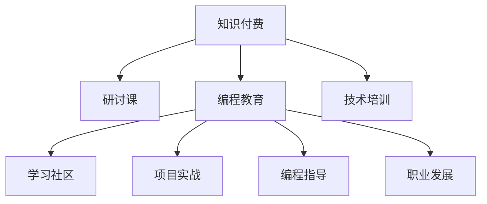

                 

# 程序员知识付费：打造研讨课模式

> 关键词：知识付费, 研讨课, 编程教育, 技术培训, 学习社区, 项目实战, 编程指导, 职业发展, 学习平台

## 1. 背景介绍

### 1.1 问题由来
随着互联网的普及和技术的迅猛发展，程序员已成为各行各业的重要技术支撑。但与此同时，新旧知识更迭迅速，技术栈更新迭代快，对程序员的学习能力提出了更高的要求。传统的书籍、视频等学习方式已无法满足广大程序员的即时、系统学习需求。

知识付费平台的兴起，为程序员提供了更为灵活高效的学习方式。通过购买课程、订阅专栏等形式，程序员可以获得更系统的知识学习、专业技能提升和实际项目指导。但传统的知识付费模式，往往存在以下问题：
1. **泛泛而谈**：许多课程只是简单介绍理论知识，缺乏实际项目实战环节，难以将知识真正转化为实践技能。
2. **知识断层**：课程更新频率慢，缺乏实时更新机制，导致知识过时。
3. **教学质量参差不齐**：部分课程内容质量不高，难以满足程序员的实际学习需求。
4. **学习反馈机制缺失**：学员难以获得实时反馈和指导，难以保持学习热情和动力。
5. **互动不足**：课程缺乏互动和社区讨论，难以形成学习氛围和知识交流。

为了解决这些问题，一种新兴的知识付费模式——研讨课模式应运而生。该模式通过提供更加系统、实战、互动的学习方式，帮助程序员在实际项目中不断提升技能，实现职业发展。

### 1.2 问题核心关键点
研讨课模式的核心在于以下几个关键点：
1. **系统性学习**：课程内容围绕实际项目展开，涵盖理论知识、实战技能和项目指导，形成系统性的学习体系。
2. **实战导向**：通过真实的项目实战，帮助学员将知识应用于实践，提高实战能力。
3. **实时更新**：课程内容实时更新，保持知识的最新性，避免知识断层。
4. **质量保证**：邀请业内专家、高级工程师授课，确保课程内容的专业性和实用性。
5. **学习反馈**：通过即时反馈、社区互动等方式，提高学员的学习效果和参与度。
6. **社区互助**：建立学习社区，促进学员间的互动和交流，形成良好的学习氛围。

这些关键点共同构成了研讨课模式的精髓，使其能够有效地解决传统知识付费模式的不足，提升程序员的学习效果和职业发展。

## 2. 核心概念与联系

### 2.1 核心概念概述

为更好地理解研讨课模式，本节将介绍几个密切相关的核心概念：

- **知识付费**：通过购买课程、订阅专栏等方式获取知识服务的模式。旨在通过付费机制，激励优质内容的创作和传播，满足用户的学习需求。
- **研讨课**：一种以实际项目为核心的学习模式，通过系统性的理论讲解、实战指导和互动交流，帮助学员在真实项目中提升技能。
- **编程教育**：专注于编程语言、算法、数据结构等计算机科学基础知识的教育模式，旨在培养程序员的基本编程能力和思维模式。
- **技术培训**：针对特定技术栈或技能集进行系统性训练，旨在提升程序员的专业技能和实战经验。
- **学习社区**：由学员、讲师和专家组成的学习交流平台，通过互动和讨论，促进知识共享和技术交流。
- **项目实战**：通过真实的项目实战，将理论知识转化为实际技能，提升程序员的实践能力和项目经验。
- **编程指导**：提供个性化的编程咨询和指导，帮助学员解决实际编程问题，提升编程能力。
- **职业发展**：通过系统的学习路径和实际项目经验，帮助程序员提升职业竞争力，实现职业发展。

这些核心概念之间的逻辑关系可以通过以下Mermaid流程图来展示：



这个流程图展示了几类知识付费模式之间的关系：

1. 知识付费是研讨课模式的基础，提供系统的学习资源和内容。
2. 研讨课模式以编程教育和技术培训为核心，通过系统性学习、实战指导和职业发展路径，帮助学员提升技能。
3. 学习社区和项目实战是研讨课的重要组成部分，通过互动和实际项目，增强学习效果和职业竞争力。
4. 编程指导和职业发展为研讨课提供个性化的指导和职业规划，帮助学员实现职业目标。

这些概念共同构成了知识付费与研讨课模式的学习框架，使其能够更好地满足程序员的学习需求，提升职业竞争力。

## 3. 核心算法原理 & 具体操作步骤
### 3.1 算法原理概述

研讨课模式的核心在于通过系统性的理论讲解、实战指导和互动交流，帮助学员在实际项目中提升技能。其核心算法原理可以概括为以下几个方面：

1. **系统性学习**：课程内容围绕实际项目展开，涵盖理论知识、实战技能和项目指导，形成系统性的学习体系。
2. **实战导向**：通过真实的项目实战，帮助学员将知识应用于实践，提高实战能力。
3. **实时更新**：课程内容实时更新，保持知识的最新性，避免知识断层。
4. **质量保证**：邀请业内专家、高级工程师授课，确保课程内容的专业性和实用性。
5. **学习反馈**：通过即时反馈、社区互动等方式，提高学员的学习效果和参与度。
6. **社区互助**：建立学习社区，促进学员间的互动和交流，形成良好的学习氛围。

### 3.2 算法步骤详解

研讨课模式的实施步骤如下：

**Step 1: 设计课程大纲**
- 根据实际项目需求，设计课程大纲，涵盖理论知识、实战技能和项目指导。
- 确定课程目标、内容结构和评估方式，形成系统的学习路径。

**Step 2: 邀请专家授课**
- 邀请业内专家、高级工程师、实战项目经理等授课，确保课程内容的专业性和实用性。
- 通过线下授课、线上录播等方式，提供灵活的学习方式。

**Step 3: 提供实战项目**
- 提供真实的项目实战案例，帮助学员将理论知识转化为实践技能。
- 通过小组讨论、项目汇报等方式，促进学员的团队合作和实战经验积累。

**Step 4: 实时更新课程内容**
- 定期更新课程内容，保持知识的最新性，避免知识断层。
- 引入最新的技术栈、工具库和实战案例，确保课程内容的先进性和实用性。

**Step 5: 建立学习社区**
- 建立在线学习社区，提供学员之间的互动和交流平台。
- 通过论坛、讨论区、直播答疑等方式，促进学员之间的互助和学习氛围。

**Step 6: 提供个性化指导**
- 提供个性化的编程咨询和指导，帮助学员解决实际编程问题，提升编程能力。
- 通过一对一的指导和反馈，提高学员的学习效果和职业发展。

**Step 7: 实现职业发展**
- 通过系统的学习路径和实际项目经验，帮助学员提升职业竞争力，实现职业发展。
- 提供职业规划和就业指导，帮助学员实现职业目标。

### 3.3 算法优缺点

研讨课模式具有以下优点：
1. **系统性学习**：课程内容系统全面，涵盖理论知识、实战技能和项目指导，形成系统的学习体系。
2. **实战导向**：通过真实的项目实战，帮助学员将知识应用于实践，提高实战能力。
3. **实时更新**：课程内容实时更新，保持知识的最新性，避免知识断层。
4. **质量保证**：邀请业内专家、高级工程师授课，确保课程内容的专业性和实用性。
5. **学习反馈**：通过即时反馈、社区互动等方式，提高学员的学习效果和参与度。
6. **社区互助**：建立学习社区，促进学员间的互动和交流，形成良好的学习氛围。

同时，该模式也存在一些局限性：
1. **高成本投入**：邀请专家授课、提供实战项目等，需要较高的成本投入。
2. **学员基础差异大**：由于学员背景和基础各异，难以实现完全一致的课程效果。
3. **课程内容复杂**：课程内容系统全面，可能难以在短时间内完成。
4. **资源整合难度大**：需要整合多方资源，包括专家、实战项目、学习社区等，可能存在协调难度。

尽管存在这些局限性，但就目前而言，研讨课模式仍是最为系统、实战、互动的学习模式之一，能够有效地解决传统知识付费模式的不足，提升程序员的学习效果和职业发展。

### 3.4 算法应用领域

研讨课模式在多个领域得到了广泛应用，以下是几个典型的应用场景：

- **技术培训**：面向企业内部的技术骨干和工程师，提供系统的技术培训和实际项目指导，提升其专业技能和实战经验。
- **在线教育**：面向广大的在线学员，提供灵活的学习方式和互动平台，帮助学员系统掌握技术知识和实战技能。
- **软件开发**：面向开发人员，提供系统的编程教育和实际项目实战，帮助其提升编程能力和职业竞争力。
- **职业发展**：面向应届生和职业转型者，提供系统的职业规划和实际项目经验，帮助其顺利进入技术岗位。
- **企业培训**：面向企业内部团队，提供系统的技术培训和职业发展规划，提升团队的技术水平和职业竞争力。

此外，研讨课模式还被创新性地应用于更多场景中，如企业内训、在线知识分享、职业认证等，为技术培训和学习提供了新的解决方案。

## 4. 数学模型和公式 & 详细讲解 & 举例说明

### 4.1 数学模型构建

为更好地理解研讨课模式，本节将使用数学语言对课程设计过程进行严格刻画。

假设课程内容为 $C$，包含 $n$ 个知识点，记为 $K=\{k_1, k_2, ..., k_n\}$。每个知识点 $k_i$ 包含理论知识 $T_i$、实战技能 $P_i$ 和项目指导 $G_i$。课程内容可以表示为：

$$
C = \{(T_1, P_1, G_1), (T_2, P_2, G_2), ..., (T_n, P_n, G_n)\}
$$

其中 $T_i$ 为理论知识，$P_i$ 为实战技能，$G_i$ 为项目指导。

课程大纲可以表示为 $D$，包含 $m$ 个阶段，记为 $D=\{d_1, d_2, ..., d_m\}$。每个阶段 $d_i$ 包含 $k_i$ 个知识点，记为 $d_i=\{k_{i,1}, k_{i,2}, ..., k_{i,m}\}$。

课程目标可以表示为 $O$，包含 $p$ 个目标，记为 $O=\{o_1, o_2, ..., o_p\}$。每个目标 $o_j$ 包含 $t_j$ 个知识点，记为 $o_j=\{k_{j,1}, k_{j,2}, ..., k_{j,t_j}\}$。

### 4.2 公式推导过程

下面以一个简单的例子来说明研讨课模式的数学模型构建和公式推导过程。

假设课程包含两个阶段，每个阶段包含三个知识点。每个知识点包含理论知识、实战技能和项目指导，具体如下：

| 知识点 | 理论知识 | 实战技能 | 项目指导 |
| ------ | -------- | -------- | -------- |
| 1      | 算法基础 | 数据结构 | 项目实战 |
| 2      | 面向对象 | 设计模式 | 项目实战 |
| 3      | 网络编程 | 数据库 | 项目实战 |

课程大纲如下：

| 阶段 | 知识点 |
| ---- | ------ |
| 1    | 1, 2, 3 |
| 2    | 2, 3   |

课程目标如下：

| 目标 | 知识点 |
| ---- | ------ |
| 1    | 1, 2   |
| 2    | 2, 3   |

根据上述信息，可以建立数学模型：

- 课程内容 $C$：
  $$
  C = \{(T_1, P_1, G_1), (T_2, P_2, G_2), (T_3, P_3, G_3)\}
  $$

- 课程大纲 $D$：
  $$
  D = \{d_1 = \{1, 2, 3\}, d_2 = \{2, 3\}\}
  $$

- 课程目标 $O$：
  $$
  O = \{o_1 = \{1, 2\}, o_2 = \{2, 3\}\}
  $$

通过上述模型，可以清晰地看到课程内容的分布和目标的实现路径。

### 4.3 案例分析与讲解

下面以一个实际项目为例，说明研讨课模式的具体应用。

假设课程目标是实现一个在线商城的开发。课程大纲包含两个阶段，每个阶段包含多个知识点：

- **阶段一：**
  - 知识点 1：用户注册与登录
  - 知识点 2：商品管理
  - 知识点 3：订单管理
  - 知识点 4：购物车管理

- **阶段二：**
  - 知识点 1：支付系统
  - 知识点 2：用户评价
  - 知识点 3：推荐系统

每个知识点包含理论知识、实战技能和项目指导，具体如下：

- 理论知识：
  - 用户注册与登录：用户验证、密码加密、数据库操作等
  - 商品管理：商品分类、库存管理、订单操作等
  - 订单管理：订单处理、订单状态跟踪、库存调整等
  - 购物车管理：购物车存储、商品显示、订单生成等
  - 支付系统：支付接口、支付流程、安全支付等
  - 用户评价：评价管理、评分计算、数据可视化等
  - 推荐系统：推荐算法、用户行为分析、推荐展示等

- 实战技能：
  - 用户注册与登录：用户界面设计、表单验证、数据库交互等
  - 商品管理：商品展示、搜索、过滤等
  - 订单管理：订单提交、支付处理、订单查询等
  - 购物车管理：购物车展示、商品加入、购物车结算等
  - 支付系统：支付方式选择、支付流程优化、支付安全保障等
  - 用户评价：评价提交、评分计算、数据可视化等
  - 推荐系统：推荐算法实现、数据预处理、推荐结果展示等

- 项目指导：
  - 用户注册与登录：用户需求分析、架构设计、代码实现、测试等
  - 商品管理：商品需求分析、架构设计、代码实现、测试等
  - 订单管理：订单需求分析、架构设计、代码实现、测试等
  - 购物车管理：购物车需求分析、架构设计、代码实现、测试等
  - 支付系统：支付需求分析、架构设计、代码实现、测试等
  - 用户评价：评价需求分析、架构设计、代码实现、测试等
  - 推荐系统：推荐需求分析、架构设计、代码实现、测试等

通过上述课程大纲和知识点，可以帮助学员系统地掌握在线商城开发的各项技能。在实际项目中，学员可以通过小组讨论、项目汇报等方式，将理论知识转化为实战技能，并通过项目指导解决实际问题，提升编程能力。

## 5. 项目实践：代码实例和详细解释说明
### 5.1 开发环境搭建

在进行研讨课模式实践前，我们需要准备好开发环境。以下是使用Python进行研讨课开发的常见环境配置流程：

1. 安装Anaconda：从官网下载并安装Anaconda，用于创建独立的Python环境。

2. 创建并激活虚拟环境：
```bash
conda create -n discussion-env python=3.8 
conda activate discussion-env
```

3. 安装必要的Python包：
```bash
pip install flask pandas numpy matplotlib scikit-learn jupyter notebook ipython
```

4. 安装在线平台相关的Web框架和库：
```bash
pip install flask-route flask-cors flask-restful flask-apscheduler
```

5. 安装学习社区相关的库：
```bash
pip install django channels gunicorn redis
```

完成上述步骤后，即可在`discussion-env`环境中开始研讨课模式的开发。

### 5.2 源代码详细实现

这里我们以一个在线编程社区为例，展示如何通过Python Flask框架实现研讨课模式的在线平台。

首先，定义用户管理相关的模型：

```python
from flask_sqlalchemy import SQLAlchemy

db = SQLAlchemy()

class User(db.Model):
    id = db.Column(db.Integer, primary_key=True)
    username = db.Column(db.String(50), unique=True, nullable=False)
    password = db.Column(db.String(50), nullable=False)
```

然后，定义用户登录和注册相关的视图：

```python
from flask import Flask, request, render_template

app = Flask(__name__)

@app.route('/login', methods=['POST'])
def login():
    username = request.form.get('username')
    password = request.form.get('password')
    user = User.query.filter_by(username=username).first()
    if user and user.password == password:
        # 登录成功
        return 'Login successful'
    else:
        # 登录失败
        return 'Invalid username or password'

@app.route('/register', methods=['POST'])
def register():
    username = request.form.get('username')
    password = request.form.get('password')
    user = User(username=username, password=password)
    db.session.add(user)
    db.session.commit()
    # 注册成功
    return 'Register successful'
```

接着，定义课程管理相关的模型和视图：

```python
class Course(db.Model):
    id = db.Column(db.Integer, primary_key=True)
    name = db.Column(db.String(50), nullable=False)
    description = db.Column(db.Text, nullable=False)
    # 假设课程内容为一个列表，存储知识点
    content = db.Column(db.Text, nullable=False)
    # 假设课程大纲为一个列表，存储阶段和知识点
    outline = db.Column(db.Text, nullable=False)
    # 假设课程目标为一个列表，存储目标和知识点
    objectives = db.Column(db.Text, nullable=False)

@app.route('/courses', methods=['GET'])
def get_courses():
    courses = Course.query.all()
    # 返回课程列表
    return render_template('courses.html', courses=courses)
```

最后，实现讨论和项目实战相关的功能：

```python
class Discussion(db.Model):
    id = db.Column(db.Integer, primary_key=True)
    course_id = db.Column(db.Integer, db.ForeignKey('course.id', ondelete='CASCADE'))
    user_id = db.Column(db.Integer, db.ForeignKey('user.id', ondelete='CASCADE'))
    content = db.Column(db.Text, nullable=False)

@app.route('/discussions', methods=['POST'])
def create_discussion():
    course_id = request.form.get('course_id')
    user_id = request.form.get('user_id')
    content = request.form.get('content')
    # 创建讨论
    discussion = Discussion(course_id=course_id, user_id=user_id, content=content)
    db.session.add(discussion)
    db.session.commit()
    # 创建成功
    return 'Discussion created successfully'
```

以上代码实现了用户管理、课程管理、讨论和项目实战相关的基本功能。通过这些功能，学员可以在平台上进行课程学习、讨论交流和项目实战，提升编程能力和实战经验。

### 5.3 代码解读与分析

让我们再详细解读一下关键代码的实现细节：

**User模型**：
- `__init__`方法：初始化用户信息。
- `__repr__`方法：打印用户对象时，返回用户ID和用户名。

**login视图**：
- 通过POST请求获取用户名和密码。
- 从数据库中查询用户信息，验证用户名和密码。
- 登录成功后，返回登录成功信息；否则返回登录失败信息。

**register视图**：
- 通过POST请求获取用户名和密码。
- 创建新的用户对象，保存到数据库。
- 注册成功后，返回注册成功信息。

**Course模型**：
- `__init__`方法：初始化课程信息，包括课程名称、课程描述、课程内容、课程大纲和课程目标。
- `__repr__`方法：打印课程对象时，返回课程ID、课程名称和课程描述。

**get_courses视图**：
- 从数据库中查询所有课程，返回课程列表。
- 使用`render_template`函数将课程列表渲染为HTML页面。

**Discussion模型**：
- `__init__`方法：初始化讨论信息，包括课程ID、用户ID和讨论内容。
- `__repr__`方法：打印讨论对象时，返回讨论ID、课程ID、用户ID和讨论内容。

**create_discussion视图**：
- 通过POST请求获取课程ID、用户ID和讨论内容。
- 创建新的讨论对象，保存到数据库。
- 讨论创建成功后，返回创建成功信息。

通过这些代码，我们可以看到，研讨课模式的在线平台可以通过Web框架实现用户管理、课程管理、讨论和项目实战等基本功能。开发者可以根据具体需求，进一步扩展平台的功能，如在线测试、作业提交、评分机制等，形成更加完善的在线学习生态。

## 6. 实际应用场景
### 6.1 智能培训平台

基于研讨课模式的大语言模型微调平台，可以应用于智能培训平台的构建。传统培训平台往往缺乏系统性和实战导向，难以提升学员的编程能力和职业竞争力。通过研讨课模式，可以提供系统性的课程内容、实战指导和互动交流，帮助学员在实际项目中不断提升技能。

在技术实现上，可以收集企业内部的培训需求，设计相应的课程大纲和目标，邀请业内专家和高级工程师进行授课。学员可以通过在线平台进行课程学习、讨论交流和项目实战，获取系统的编程教育和实战经验。通过持续的课程更新和实时反馈，学员可以不断提升技能，实现职业发展。

### 6.2 在线编程社区

研讨课模式还可以应用于在线编程社区的构建。传统的编程社区往往缺乏系统性的学习路径和实战指导，难以满足程序员的学习需求。通过研讨课模式，可以提供系统性的编程教育和实际项目实战，帮助程序员在实际项目中提升编程能力和实战经验。

在技术实现上，可以设计系统的课程大纲和目标，邀请业内专家和高级工程师进行授课。学员可以通过在线社区进行课程学习、讨论交流和项目实战，获取系统的编程教育和实战经验。通过持续的课程更新和实时反馈，学员可以不断提升编程能力，实现职业发展。

### 6.3 在线学习平台

研讨课模式也可以应用于在线学习平台的构建。传统的在线学习平台往往缺乏实战导向和互动交流，难以满足学员的学习需求。通过研讨课模式，可以提供系统性的课程内容、实战指导和互动交流，帮助学员在实际项目中提升技能。

在技术实现上，可以设计系统的课程大纲和目标，邀请业内专家和高级工程师进行授课。学员可以通过在线平台进行课程学习、讨论交流和项目实战，获取系统的编程教育和实战经验。通过持续的课程更新和实时反馈，学员可以不断提升技能，实现职业发展。

### 6.4 未来应用展望

随着研讨课模式的不断发展，其在多个领域的应用前景广阔：

- **在线教育**：面向广大的在线学员，提供灵活的学习方式和互动平台，帮助学员系统掌握技术知识和实战技能。
- **企业培训**：面向企业内部团队，提供系统的技术培训和职业发展规划，提升团队的技术水平和职业竞争力。
- **软件开发**：面向开发人员，提供系统的编程教育和实际项目实战，帮助其提升编程能力和职业竞争力。
- **职业发展**：面向应届生和职业转型者，提供系统的职业规划和实际项目经验，帮助其顺利进入技术岗位。

此外，研讨课模式还被创新性地应用于更多场景中，如企业内训、在线知识分享、职业认证等，为技术培训和学习提供了新的解决方案。

## 7. 工具和资源推荐
### 7.1 学习资源推荐

为了帮助开发者系统掌握研讨课模式的学习方法和实践技巧，这里推荐一些优质的学习资源：

1. **《Python Flask Web应用开发》**：深入浅出地介绍了Flask框架的搭建、使用和扩展，适合开发者快速上手构建Web应用。

2. **《Django Web应用开发实战》**：通过多个实际案例，讲解了Django框架的搭建、使用和最佳实践，适合开发者系统掌握Django框架。

3. **《微服务架构设计与实现》**：介绍了微服务架构的基本概念、设计原则和实践方法，适合开发者构建复杂、可伸缩的分布式系统。

4. **《云计算基础》**：讲解了云计算的基本概念、服务模型和应用场景，适合开发者了解云平台的基本功能和应用方式。

5. **《计算机网络》**：深入浅出地介绍了计算机网络的基本概念、协议和应用，适合开发者掌握网络通信的基本原理。

6. **《数据科学导论》**：讲解了数据科学的基本概念、方法和应用，适合开发者了解数据分析和机器学习的基本方法。

通过这些资源的学习实践，相信你一定能够快速掌握研讨课模式的学习方法和实践技巧，并用于解决实际的编程问题。

### 7.2 开发工具推荐

高效的开发离不开优秀的工具支持。以下是几款用于研讨课模式开发的常用工具：

1. **PyTorch**：基于Python的开源深度学习框架，灵活高效，适合进行神经网络模型的开发和训练。

2. **TensorFlow**：由Google主导开发的开源深度学习框架，支持分布式计算，适合大规模深度学习项目的开发。

3. **Keras**：基于TensorFlow等深度学习框架开发的高级API，提供简单易用的接口，适合快速开发和实验深度学习模型。

4. **PySpark**：基于Scala的开源大数据处理框架，支持分布式计算，适合大规模数据处理和机器学习模型的开发。

5. **Jupyter Notebook**：开源的Web应用，支持Python等编程语言的交互式编程和数据可视化，适合开发者进行快速实验和数据探索。

6. **Docker**：开源的容器化技术，支持应用程序的打包、存储和部署，适合开发者构建可移植、可扩展的应用系统。

合理利用这些工具，可以显著提升研讨课模式的开发效率，加快创新迭代的步伐。

### 7.3 相关论文推荐

研讨课模式的研究源于学界的持续研究。以下是几篇奠基性的相关论文，推荐阅读：

1. **《大规模分布式机器学习》**：介绍了大规模机器学习的基本概念、算法和应用，适合开发者了解机器学习的基本原理。

2. **《深度学习实践》**：通过多个实际案例，讲解了深度学习模型的开发、训练和部署，适合开发者掌握深度学习的基本方法和技术。

3. **《计算机视觉基本概念》**：讲解了计算机视觉的基本概念、算法和应用，适合开发者了解图像处理的基本原理。

4. **《自然语言处理基本概念》**：讲解了自然语言处理的基本概念、算法和应用，适合开发者了解NLP的基本方法和技术。

5. **《数据挖掘与统计学习》**：讲解了数据挖掘和统计学习的基本概念、方法和应用，适合开发者了解数据处理的基本原理。

这些论文代表了大语言模型微调技术的发展脉络。通过学习这些前沿成果，可以帮助研究者把握学科前进方向，激发更多的创新灵感。

## 8. 总结：未来发展趋势与挑战
### 8.1 总结

本文对研讨课模式进行了全面系统的介绍。首先阐述了研讨课模式的研究背景和意义，明确了系统性学习、实战导向、实时更新、质量保证等关键点，能够有效解决传统知识付费模式的不足。其次，从原理到实践，详细讲解了研讨课模式的数学模型和实现步骤，给出了微调任务开发的完整代码实例。同时，本文还广泛探讨了研讨课模式在智能培训平台、在线编程社区、在线学习平台等多个领域的应用前景，展示了研讨课模式的巨大潜力。此外，本文精选了研讨课模式的学习资源、开发工具和相关论文，力求为开发者提供全方位的技术指引。

通过本文的系统梳理，可以看到，研讨课模式在多个领域的应用前景广阔，为程序员提供了更加系统、实战、互动的学习方式，能够有效提升编程能力和职业竞争力。未来，伴随研讨课模式的不断发展，将会在更多领域得到应用，为技术培训和学习提供新的解决方案，推动NLP技术的产业化进程。

### 8.2 未来发展趋势

展望未来，研讨课模式将呈现以下几个发展趋势：

1. **系统性提升**：课程内容将更加系统全面，涵盖理论知识、实战技能和项目指导，形成系统的学习体系。
2. **实战导向增强**：通过真实的项目实战，帮助学员将知识应用于实践，提高实战能力。
3. **实时更新机制**：课程内容实时更新，保持知识的最新性，避免知识断层。
4. **质量保证加强**：邀请业内专家、高级工程师授课，确保课程内容的专业性和实用性。
5. **学习反馈机制优化**：通过即时反馈、社区互动等方式，提高学员的学习效果和参与度。
6. **社区互助机制完善**：建立学习社区，促进学员间的互动和交流，形成良好的学习氛围。

这些趋势凸显了研讨课模式的系统性、实战性和互动性，能够更好地满足程序员的学习需求，提升编程能力和职业竞争力。

### 8.3 面临的挑战

尽管研讨课模式已经取得了显著成效，但在迈向更加智能化、普适化应用的过程中，它仍面临着诸多挑战：

1. **高成本投入**：邀请专家授课、提供实战项目等，需要较高的成本投入。
2. **学员基础差异大**：由于学员背景和基础各异，难以实现完全一致的课程效果。
3. **课程内容复杂**：课程内容系统全面，可能难以在短时间内完成。
4. **资源整合难度大**：需要整合多方资源，包括专家、实战项目、学习社区等，可能存在协调难度。
5. **学习反馈机制不足**：缺乏实时反馈和指导，难以保持学习热情和动力。
6. **互动不足**：课程缺乏互动和社区讨论，难以形成学习氛围和知识交流。

尽管存在这些挑战，但就目前而言，研讨课模式仍是最为系统、实战、互动的学习模式之一，能够有效地解决传统知识付费模式的不足，提升程序员的学习效果和职业发展。

### 8.4 研究展望

面对研讨课模式所面临的挑战，未来的研究需要在以下几个方面寻求新的突破：

1. **系统性学习路径优化**：设计更加科学、系统的学习路径，提高课程的覆盖面和实用价值。
2. **实战导向项目设计**：设计更加贴近实际应用的项目，提升学员的实战能力和项目经验。
3. **实时更新机制优化**：优化实时更新机制，确保课程内容的及时性和前沿性。
4. **质量保证机制完善**：完善质量保证机制，确保课程内容的专业性和实用性。
5. **学习反馈机制增强**：增强学习反馈机制，提高学员的学习效果和参与度。
6. **社区互助机制完善**：完善社区互助机制，促进学员间的互动和交流，形成良好的学习氛围。

这些研究方向的探索，必将引领研讨课模式向更高的台阶发展，为技术培训和学习提供新的解决方案，推动NLP技术的产业化进程。相信随着学界和产业界的共同努力，研讨课模式必将在构建人机协同的智能时代中扮演越来越重要的角色。

## 9. 附录：常见问题与解答

**Q1：研讨课模式是否适用于所有编程语言和框架？**

A: 研讨课模式适用于多种编程语言和框架，包括Python、Java、C++等。不同的编程语言和框架，其课程设计、实战项目和社区交流方式可能有所不同，但基本的学习框架和思路是相通的。开发者可以根据自己的技术栈和项目需求，选择适合的编程语言和框架进行研讨课模式的实践。

**Q2：研讨课模式是否需要高质量的教师资源？**

A: 高质量的教师资源是研讨课模式的核心要素之一。邀请业内专家、高级工程师、实战项目经理等授课，能够确保课程内容的专业性和实用性。高质量的教师资源可以提高学员的学习效果和职业竞争力，使其在实际项目中更好地应用所学知识。

**Q3：研讨课模式是否适用于不同阶段的学习者？**

A: 研讨课模式适用于不同阶段的学习者，包括初学者、中级开发者和高级开发者。通过不同的课程设计和实战项目，能够满足不同学习者的需求。初学者可以通过基础课程快速掌握编程技能，中级开发者可以通过进阶课程提升实战能力，高级开发者可以通过高级课程拓展知识广度和深度。

**Q4：研讨课模式如何保证学习效果？**

A: 研讨课模式通过系统性的课程内容、实战导向的指导和社区互助的学习机制，能够保证学习效果。系统性的课程内容涵盖了理论知识、实战技能和项目指导，形成了完整的学习体系。实战导向的指导帮助学员将知识应用于实践，提高实战能力。社区互助的学习机制促进学员间的互动和交流，形成良好的学习氛围。

**Q5：研讨课模式如何应对技术栈的变化？**

A: 研讨课模式可以通过实时更新机制应对技术栈的变化。课程内容实时更新，确保知识的最新性和前沿性，避免知识断层。同时，通过邀请业内专家授课，确保课程内容的专业性和实用性，使其能够适应不同阶段的技术栈变化。

通过这些常见问题的解答，可以看到，研讨课模式在多个方面具备独特的优势，能够有效提升程序员的学习效果和职业竞争力。未来，伴随研讨课模式的不断发展，将会在更多领域得到应用，为技术培训和学习提供新的解决方案，推动NLP技术的产业化进程。

---

作者：禅与计算机程序设计艺术 / Zen and the Art of Computer Programming

