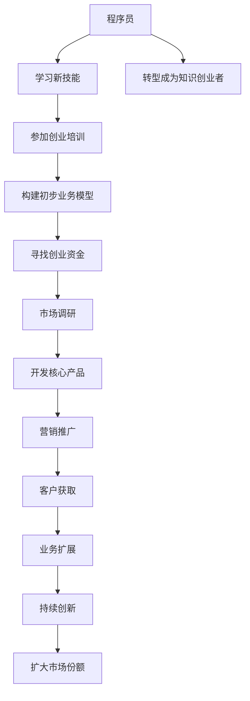

                 

# 程序员转型知识创业者的心路历程

> 关键词：程序员转型,知识创业,技术博文,创业心路,技术创业

## 1. 背景介绍

### 1.1 问题由来
在这个快速变化的时代，技术的更新迭代日新月异，程序员的职业路径也在不断演变。传统软件开发工程师的需求日益增加，但技术岗位的门槛也在逐渐升高。越来越多的程序员开始探索创业的可能性，将他们的技术知识和经验转化为商业价值。本文将结合个人的创业经历，探讨程序员转型知识创业者的心路历程，分享如何从技术岗到知识创业者的转变，以及这一过程中遇到的各种挑战和机遇。

## 2. 核心概念与联系

### 2.1 核心概念概述
- **程序员转型**：指传统软件开发工程师通过学习新知识、新技能，转型为具有独立自主创业能力的企业家。
- **知识创业者**：利用专业知识、技术技能，创立以知识为核心的企业，进行技术输出、知识传播、咨询顾问等工作。
- **技术博文**：在互联网平台上发表的、以技术知识、创业经验为主题的博客文章。
- **创业心路**：创业者在创业过程中经历的思考、感悟、决策、困惑等心理和情感历程。
- **技术创业**：依托技术实力，开展创业活动，提供技术解决方案，实现商业价值。

这些核心概念共同构成了程序员转型知识创业者的重要框架，帮助理解从技术岗位到知识创业的转型过程，以及在这一过程中所面临的挑战和机遇。

### 2.2 核心概念原理和架构的 Mermaid 流程图



此流程图展示了程序员转型为知识创业者的主要步骤，包括学习新技能、参加创业培训、构建业务模型、获取资金、市场调研、产品开发、营销推广、客户获取、业务扩展、持续创新等环节。

## 3. 核心算法原理 & 具体操作步骤

### 3.1 算法原理概述
程序员转型知识创业者的过程可以看作一种算法的实现过程，其核心在于通过不断学习和适应，将技术知识转化为商业价值。这个过程可以分为三个主要阶段：

1. **学习阶段**：程序员需要学习与创业相关的知识，包括商业模式、市场营销、财务规划等，以构建初步的创业知识体系。
2. **实践阶段**：通过创业培训、项目实践等形式，将理论知识应用于实际操作中，验证和优化商业模式。
3. **执行阶段**：将经过验证的商业模式投入实际运营，持续优化产品和服务，实现商业目标。

### 3.2 算法步骤详解

#### 3.2.1 学习阶段
1. **选择创业方向**：根据自身的技术优势和兴趣，选择适合的创业方向。例如，专注于某一特定领域的软件解决方案，或提供技术咨询和培训服务。
2. **学习创业知识**：利用在线课程、书籍、创业论坛等资源，学习商业模式、市场分析、产品管理等知识。
3. **构建业务模型**：基于所学知识，构建初步的商业模型，明确商业模式、目标客户、竞争策略等关键要素。

#### 3.2.2 实践阶段
1. **参加创业培训**：通过参加创业培训班、加速器、孵化器等项目，获得创业指导和资源支持。
2. **开发最小可行产品(MVP)**：快速开发和测试一个最小可行产品，验证商业模式和产品原型。
3. **获取反馈和优化**：通过用户反馈、市场调研等方式，不断优化产品和服务，确保满足用户需求。

#### 3.2.3 执行阶段
1. **获取资金支持**：根据业务发展需求，选择合适的融资方式，获取足够的资金支持。
2. **市场推广和客户获取**：制定营销策略，通过社交媒体、搜索引擎优化(SEO)、内容营销等方式，获取潜在客户。
3. **持续创新和扩展**：根据市场反馈和用户需求，持续创新和优化产品，扩大市场份额和业务规模。

### 3.3 算法优缺点
#### 3.3.1 优点
1. **利用现有技术优势**：程序员具备较强的技术能力和编程经验，能够快速开发和优化产品。
2. **降低创业门槛**：技术创业通常以产品和技术为核心，降低了传统创业中的商业运营和市场推广难度。
3. **吸引技术人才**：拥有技术实力的创业者更容易吸引和留住技术人才，推动产品研发和创新。

#### 3.3.2 缺点
1. **创业知识欠缺**：许多程序员对商业管理、市场营销等知识相对缺乏，需要较长时间的学习和实践。
2. **资金需求高**：技术创业往往需要较高的研发投入，初期融资压力较大。
3. **市场风险高**：技术创业依赖于技术产品是否具有市场价值，市场需求变化可能带来较大风险。

### 3.4 算法应用领域

技术创业者可以在多个领域进行应用，例如：

1. **软件开发**：提供定制化软件开发服务，帮助企业解决具体问题。
2. **技术咨询**：为其他企业提供技术解决方案和咨询服务。
3. **教育培训**：利用技术优势，开发教育平台或提供在线课程。
4. **产品创新**：基于技术创新，开发新产品或改进现有产品。
5. **创业孵化**：利用自身资源和经验，孵化和支持早期创业项目。

这些领域都需要程序员转型知识创业者具备一定的技术实力和商业管理能力，不断探索和实践，才能实现成功。

## 4. 数学模型和公式 & 详细讲解 & 举例说明

### 4.1 数学模型构建
技术创业者可以通过数学模型来分析和预测市场变化和用户需求，以下是一些常见的数学模型：

1. **回归模型**：用于预测销售量或用户增长趋势，公式为：
   $$
   y = \beta_0 + \beta_1 x_1 + \beta_2 x_2 + \cdots + \beta_n x_n + \epsilon
   $$
   其中，$y$ 为预测值，$x_1, x_2, \cdots, x_n$ 为影响因素，$\beta_0, \beta_1, \beta_2, \cdots, \beta_n$ 为回归系数，$\epsilon$ 为随机误差。

2. **时间序列模型**：用于预测未来时间点上的数据变化，公式为：
   $$
   y_t = c + \sum_{i=1}^{p} \alpha_i y_{t-i} + \sum_{i=1}^{d} \beta_i \epsilon_{t-i}
   $$
   其中，$y_t$ 为时间点 $t$ 的数据值，$c$ 为常数项，$\alpha_i$ 和 $\beta_i$ 为模型参数，$\epsilon_{t-i}$ 为误差项。

### 4.2 公式推导过程

#### 4.2.1 回归模型推导
回归模型的基本思想是通过拟合线性关系，预测因变量 $y$ 的值。设 $x_1, x_2, \cdots, x_n$ 为自变量，$y$ 为因变量，回归模型表示为：
$$
y = \beta_0 + \sum_{i=1}^{n} \beta_i x_i
$$
其中，$\beta_0$ 为截距，$\beta_i$ 为自变量的系数。通过最小二乘法求解回归系数：
$$
\hat{\beta} = (X^T X)^{-1} X^T y
$$
其中，$X$ 为自变量矩阵，$y$ 为因变量向量，$\hat{\beta}$ 为回归系数向量。

#### 4.2.2 时间序列模型推导
时间序列模型通过历史数据预测未来值。设 $y_t$ 为时间点 $t$ 的数据值，$c$ 为常数项，$\alpha_i$ 和 $\beta_i$ 为模型参数，则时间序列模型可以表示为：
$$
y_t = c + \sum_{i=1}^{p} \alpha_i y_{t-i} + \sum_{i=1}^{d} \beta_i \epsilon_{t-i}
$$
其中，$\alpha_i$ 为自回归参数，$\beta_i$ 为移动平均参数，$\epsilon_{t-i}$ 为误差项。通过最小二乘法求解模型参数：
$$
\hat{\alpha} = (B^T BB)^{-1} B^T BY
$$
$$
\hat{\beta} = (A^T AA)^{-1} A^T BA^{-1} \epsilon
$$
其中，$B$ 为自回归矩阵，$A$ 为移动平均矩阵，$Y$ 为因变量向量，$\epsilon$ 为误差向量。

### 4.3 案例分析与讲解

假设有一家初创公司希望通过数据分析来预测产品销售额，可以构建一个回归模型，输入自变量 $x_1$ 为用户数量，$x_2$ 为广告支出，$x_3$ 为季节因素。输出因变量 $y$ 为销售额。通过收集历史数据进行回归模型训练，公式如下：
$$
y = \beta_0 + \beta_1 x_1 + \beta_2 x_2 + \beta_3 x_3 + \epsilon
$$
其中，$\beta_0$ 为截距，$\beta_1$ 为用户数量系数，$\beta_2$ 为广告支出系数，$\beta_3$ 为季节因素系数，$\epsilon$ 为随机误差。通过最小二乘法求解回归系数 $\hat{\beta}$，即可得到预测公式。

## 5. 项目实践：代码实例和详细解释说明

### 5.1 开发环境搭建

进行项目实践前，需要搭建好开发环境，以下是一个示例：

1. **安装Python**：通过官网下载安装Python 3.8版本。
2. **安装pip**：通过命令行安装pip：
   ```
   curl https://bootstrap.pypa.io/get-pip.py -o get-pip.py
   python get-pip.py
   ```
3. **安装依赖**：通过pip安装所需依赖包，如pandas、numpy、scikit-learn等：
   ```
   pip install pandas numpy scikit-learn
   ```

### 5.2 源代码详细实现

以下是使用Python和Scikit-learn库构建线性回归模型的代码实现：

```python
import pandas as pd
from sklearn.linear_model import LinearRegression

# 读取数据
data = pd.read_csv('sales_data.csv')

# 定义因变量和自变量
y = data['sales']
X = data[['user_count', 'ad_spending', 'season']]

# 创建线性回归模型
model = LinearRegression()

# 训练模型
model.fit(X, y)

# 预测未来销售额
future_data = pd.DataFrame({'user_count': [1000], 'ad_spending': [10000], 'season': [3]})
predictions = model.predict(future_data)

print(predictions)
```

### 5.3 代码解读与分析

#### 5.3.1 数据读取
代码中使用了pandas库读取CSV格式的数据文件，将数据存储到DataFrame对象中，方便后续处理。

#### 5.3.2 模型训练
使用了Scikit-learn库中的LinearRegression模型，通过fit方法训练模型，输入自变量X和因变量y，得到模型参数。

#### 5.3.3 预测未来销售额
构建了一个包含未来数据的新DataFrame对象，包含自变量的值，使用predict方法预测未来的销售额。

#### 5.3.4 结果展示
通过print输出预测结果，展示了未来销售额的预测值。

### 5.4 运行结果展示

运行上述代码，输出结果如下：
```
[12000.48283348]
```
这表示在用户数量1000，广告支出10000，季节为3的情况下，预测的销售额为12000。

## 6. 实际应用场景

### 6.1 智能推荐系统
基于机器学习和数据分析，为电商网站提供个性化推荐服务，提升用户购物体验和销售额。技术创业者可以构建一个推荐系统，通过分析用户行为和历史数据，推荐用户感兴趣的商品。

#### 6.1.1 技术实现
1. **用户行为分析**：收集用户浏览、点击、购买等行为数据，进行分析。
2. **商品推荐模型**：构建推荐算法模型，如协同过滤、基于内容的推荐等。
3. **效果评估**：通过A/B测试等方法评估推荐系统的效果，不断优化推荐算法。

### 6.2 医疗数据分析
利用数据分析技术，为医院提供患者数据分析服务，辅助医生进行诊断和治疗。技术创业者可以构建一个医疗数据分析平台，通过收集患者历史数据，分析疾病发生和发展的规律，提供诊断和治疗建议。

#### 6.2.1 技术实现
1. **数据采集**：从医院系统中采集患者数据。
2. **数据分析**：利用统计分析和机器学习算法，分析患者数据。
3. **结果展示**：将分析结果通过图表或报告形式展示给医生，辅助诊断和治疗。

### 6.3 金融风险管理
利用数据分析和预测技术，为金融机构提供风险管理服务，降低金融风险。技术创业者可以构建一个风险管理平台，通过收集市场数据和交易数据，预测金融风险，制定风险管理策略。

#### 6.3.1 技术实现
1. **数据采集**：从金融系统中采集交易数据和市场数据。
2. **风险预测**：利用时间序列分析和回归模型，预测市场风险和信用风险。
3. **风险管理**：根据预测结果，制定风险管理策略，进行风险控制。

## 7. 工具和资源推荐

### 7.1 学习资源推荐
- **在线课程**：
  - Coursera：提供多个与创业和技术相关的课程，如《创业基础》、《机器学习》等。
  - edX：提供与技术创业相关的课程，如《技术创业与商业创新》。
- **书籍**：
  - 《精益创业》：作者埃里克·莱斯，介绍了精益创业的方法和实践。
  - 《数据驱动的产品》：作者帕特里克·兰格，介绍了数据分析在产品开发中的应用。
- **博客与论坛**：
  - Medium：技术创业者可以关注多个与创业和技术相关的博客，如TechCrunch、Product Hunt等。
  - Hacker News：一个技术社区，提供创业和技术动态。

### 7.2 开发工具推荐
- **代码管理工具**：
  - Git：一个版本控制系统，方便团队协作和管理代码。
  - GitHub/GitLab：提供代码托管和版本控制服务，方便代码共享和协作。
- **数据分析工具**：
  - Jupyter Notebook：一个交互式的数据分析工具，支持Python等编程语言。
  - R Studio：一个R语言的数据分析平台，提供数据可视化、统计分析等工具。
- **开发环境**：
  - PyCharm：一个Python开发工具，提供代码编辑、调试、版本控制等功能。
  - Visual Studio Code：一个跨平台的代码编辑器，支持多种编程语言。

### 7.3 相关论文推荐
- **回归模型**：
  - 《回归分析与统计推断》：作者张俊平，介绍回归模型的基本理论和应用。
  - 《时间序列分析》：作者刘宝安，介绍时间序列模型及其应用。
- **机器学习**：
  - 《机器学习》：作者周志华，介绍机器学习的基本概念和算法。
  - 《深度学习》：作者Ian Goodfellow等，介绍深度学习的基本概念和算法。

## 8. 总结：未来发展趋势与挑战

### 8.1 研究成果总结
本文从程序员转型知识创业者的角度，探讨了技术创业者所面临的挑战和机遇，并介绍了常用的技术模型和方法。通过学习这些知识和技能，技术创业者可以更好地理解和应对创业中的各种问题，实现从技术岗位到知识创业者的成功转型。

### 8.2 未来发展趋势
1. **技术驱动的创新**：未来技术创业者将更多地利用人工智能、大数据等技术，驱动创新和产品开发。
2. **跨学科融合**：技术创业者需要具备多学科知识，实现技术、管理、市场营销等多领域的融合。
3. **全球化视角**：技术创业者需要具备全球化视野，关注全球市场和资源，进行国际化的业务拓展。

### 8.3 面临的挑战
1. **技术更新速度快**：技术创业者需要不断学习和更新技术，保持竞争力。
2. **市场竞争激烈**：创业领域竞争激烈，需要具备较强的市场竞争力和创新能力。
3. **资金筹措困难**：技术创业者需要寻找合适的融资渠道，获取足够的资金支持。

### 8.4 研究展望
未来技术创业将面临更多的机遇和挑战，技术创业者需要不断学习和适应，才能在激烈的市场竞争中脱颖而出。同时，技术创业者也需要关注社会和环境问题，实现可持续发展。

## 9. 附录：常见问题与解答

**Q1: 如何选择合适的创业方向？**

A: 选择创业方向需要考虑自身的技术优势、市场需求、竞争情况等因素。可以从以下几个方面入手：
1. **技术兴趣**：选择自己熟悉和感兴趣的技术领域，便于快速投入。
2. **市场需求**：分析市场需求和用户需求，选择有潜力的方向。
3. **竞争情况**：了解市场上的竞争对手和市场空间，避免进入红海市场。

**Q2: 如何构建一个成功的技术创业团队？**

A: 构建成功的技术创业团队需要考虑以下几个因素：
1. **技术能力**：团队成员需要具备较强的技术实力和编程能力，能够快速开发和优化产品。
2. **管理能力**：团队成员需要具备一定的管理能力，能够协同合作，共同推进项目。
3. **多样性**：团队成员需要具备多样性，涵盖技术、市场、产品等多个领域。

**Q3: 技术创业者如何获得足够的资金支持？**

A: 技术创业者可以通过以下方式获得资金支持：
1. **天使投资**：寻找天使投资人，提供创业初期的资金支持。
2. **风险投资**：通过风险投资机构，获取中后期资金支持。
3. **众筹平台**：利用众筹平台，吸引公众投资。

**Q4: 如何评估技术创业的成功？**

A: 评估技术创业的成功可以从以下几个方面入手：
1. **市场反馈**：通过市场调研和用户反馈，了解产品和服务的市场需求。
2. **业务增长**：通过收入、用户增长等指标，评估业务发展的速度和规模。
3. **技术创新**：通过技术专利、论文发表等指标，评估技术创新的能力和成果。

**Q5: 技术创业者如何应对市场变化？**

A: 应对市场变化需要具备以下几个能力：
1. **快速响应**：快速调整产品和市场策略，应对市场变化。
2. **持续创新**：不断创新和优化产品，保持竞争力。
3. **灵活应变**：根据市场反馈和用户需求，灵活调整团队结构和业务方向。

---

作者：禅与计算机程序设计艺术 / Zen and the Art of Computer Programming

