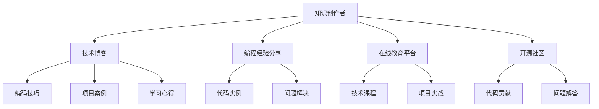

                 

# 程序员转型知识创作者的成功案例

> 关键词：程序员转型, 知识创作者, 技术博客, 程序员转型之路, 知识创作者成功案例

## 1. 背景介绍

在信息技术快速发展的今天，程序员已经不再局限于传统的软件开发工作。越来越多的程序员正在转型成为知识创作者，通过分享自己的技术见解和实践经验，帮助他人成长，同时也提升自身的影响力和职业发展空间。本文将探讨程序员转型知识创作者的成功案例，分析这一转型的背景、动因和成功要素，并为希望转型的程序员提供一些实用的建议。

### 1.1 转型背景

近年来，随着互联网技术的普及和在线教育的兴起，越来越多的技术人员开始意识到知识分享的价值。传统的编程工作往往比较单调，缺乏创造性和成就感。而成为知识创作者，不仅能够通过输出内容与他人进行深度交流，还能不断积累自身的知识和影响力，为职业发展带来新的机遇。

### 1.2 转型动因

程序员转型的动因多种多样，主要包括：

- **提升职业发展空间**：通过分享技术知识，建立个人品牌，获取更多的职业机会和资源。
- **实现个人价值**：帮助他人解决问题、提升技能，获得成就感和满足感。
- **拓展知识边界**：通过教学相长，深化对技术的理解和应用，开拓新的技术领域。
- **应对职业危机**：在行业变化、技术迭代加速的背景下，保持技能竞争力，避免职业危机。

## 2. 核心概念与联系

### 2.1 核心概念概述

为更好地理解程序员转型知识创作者的过程，本节将介绍几个核心概念及其之间的联系：

- **知识创作者**：指通过各种平台，如博客、视频、播客等，分享自己的技术知识、经验和见解的人。
- **程序员转型**：指原本专注于软件开发工作的技术人员，通过学习和实践，逐步过渡到知识创作领域的过程。
- **技术博客**：指以技术为主题的博客，内容涵盖编程技巧、项目实践、学习心得等。
- **编程经验分享**：指通过代码实例、项目案例、问题解决等，分享自己的编程经验和实践技巧。
- **在线教育平台**：如Coursera、Udacity、Bilibili等，提供技术课程、项目实战等内容，帮助他人学习和成长。
- **开源社区**：如GitHub、Stack Overflow等，通过代码贡献、问题解答等形式，积累技术社区影响力。

这些概念之间的逻辑关系可以通过以下Mermaid流程图来展示：



这个流程图展示了知识创作者与相关概念之间的联系。程序员通过博客、分享、课程、社区等渠道，传播自己的技术知识，并与其他技术爱好者进行交流，最终实现自身技术的积累和影响力的提升。

## 3. 核心算法原理 & 具体操作步骤

### 3.1 算法原理概述

程序员转型知识创作者的过程，本质上是一个知识传播和交流的过程。通过持续的学习、实践和分享，不断提升自己的技术水平和影响力。这一过程虽然不涉及具体的算法计算，但可以借鉴一些知识传播和学习的算法原理，提升传播效果和自身成长。

### 3.2 算法步骤详解

以下是程序员转型知识创作者的基本操作步骤：

**Step 1: 建立知识体系**
- 确定自己的技术专长和兴趣领域，构建系统的技术知识体系。
- 梳理过往的项目经验和技术积累，形成自己的技术框架和知识库。

**Step 2: 选择传播平台**
- 根据自身定位和受众需求，选择合适的传播平台，如技术博客、视频平台、社区等。
- 了解各平台的特色和优势，确定适合自己的内容形式和发布频率。

**Step 3: 制定内容规划**
- 根据知识体系和传播平台特点，制定详细的知识传播计划。
- 确定核心主题和次要话题，设计内容结构和时间安排。

**Step 4: 实践和分享**
- 不断学习新技术和新知识，实践自己的技术理念。
- 通过博客、视频、课程等多种形式，分享自己的实践经验和见解。
- 积极参与技术讨论和问题解答，积累社区影响力。

**Step 5: 反馈和改进**
- 通过阅读反馈和评论，了解受众的接受程度和需求。
- 根据反馈调整内容形式和传播策略，持续改进和优化传播效果。

### 3.3 算法优缺点

程序员转型知识创作者的过程，具有以下优点：
1. **知识积累和提升**：通过不断的学习、实践和分享，可以深入理解技术原理和应用场景，提升自身的技术水平。
2. **扩大影响力**：通过有效的知识传播，可以积累大量的技术粉丝和追随者，提升个人品牌价值。
3. **职业发展**：知识创作者往往能接触到更多的行业资源和机会，为职业发展提供新的可能。
4. **价值实现**：帮助他人解决问题和提升技能，实现自己的价值和成就感。

同时，这一过程也存在一些局限：
1. **时间和精力的投入**：持续的创作和分享需要投入大量的时间和精力，有时甚至会影响日常工作。
2. **内容质量要求高**：高质量的内容才能吸引受众，对于创作者来说，持续生产高质量内容是一个挑战。
3. **市场竞争激烈**：技术博客、视频课程、开源社区等平台竞争激烈，如何在众多内容中脱颖而出，需要精心策划和持续努力。
4. **受众需求多样**：技术受众的需求和兴趣点各不相同，如何满足多样化的需求，提升传播效果，是一个需要不断探索的问题。

### 3.4 算法应用领域

程序员转型知识创作者的成功案例，在多个领域都得到了应用和验证。以下是一些典型的应用场景：

- **技术博客**：如《Ruby on Rails实战》、《JavaScript高级程序设计》等，通过深入浅出的技术讲解，帮助读者提升编程技能。
- **视频课程**：如《LeetCode刷题指南》、《Python高级编程》等，通过可视化的讲解，使复杂技术变得易于理解和实践。
- **在线教育平台**：如Coursera上的《机器学习》课程、Udacity上的《深度学习》课程，提供系统化的技术学习路径，帮助学习者系统掌握技术。
- **开源社区**：如GitHub上的开源项目，通过代码贡献和问题解答，建立技术社区的影响力。

## 4. 数学模型和公式 & 详细讲解 & 举例说明

### 4.1 数学模型构建

知识创作者的内容传播效果，可以通过一些简单的数学模型进行量化分析。以下是一个基于传播力和受众影响力的数学模型：

设知识创作者的内容传播力为 $F$，受众影响力为 $I$，总传播效果为 $E$。则有：

$$
E = F \times I
$$

其中 $F$ 可以通过内容的质量、传播渠道的影响力等指标来衡量；$I$ 可以通过受众的参与度、反馈量等指标来衡量。

### 4.2 公式推导过程

在上述模型中，$F$ 和 $I$ 可以进一步细分为多个子指标，分别量化其贡献：

- $F_{\text{content}}$：内容本身的质量，包括深度、结构、可读性等。
- $F_{\text{platform}}$：传播渠道的覆盖范围和影响程度，如博客的访问量、视频平台的观看次数等。
- $I_{\text{interaction}}$：受众的互动行为，如评论、点赞、分享等。
- $I_{\text{feedback}}$：受众的反馈质量，如有价值的提问、合理的建议等。

将这些子指标代入总模型中，可以得到：

$$
E = (F_{\text{content}} \times F_{\text{platform}}) \times (I_{\text{interaction}} \times I_{\text{feedback}})
$$

### 4.3 案例分析与讲解

以《JavaScript高级程序设计》这本书为例，其传播力和受众影响力可以分别量化为：

- $F_{\text{content}}$：内容的深度、结构和可读性。该书通过详细的代码实例和深入的技术讲解，提供了高质量的内容。
- $F_{\text{platform}}$：传播渠道的影响力。该书通过亚马逊、豆瓣等平台进行销售和评价，覆盖了广泛的受众群体。
- $I_{\text{interaction}}$：受众的互动行为。读者在评论和反馈中提出了许多有价值的意见和建议。
- $I_{\text{feedback}}$：受众的反馈质量。作者积极回应读者的评论，进行内容修订和补充。

通过这些指标的衡量，可以得出该书的总传播效果 $E$。

## 5. 项目实践：代码实例和详细解释说明

### 5.1 开发环境搭建

以下是使用Python进行技术博客开发的开发环境搭建流程：

1. 安装Anaconda：从官网下载并安装Anaconda，用于创建独立的Python环境。

2. 创建并激活虚拟环境：
```bash
conda create -n blog-env python=3.8 
conda activate blog-env
```

3. 安装PyTorch：根据CUDA版本，从官网获取对应的安装命令。例如：
```bash
conda install pytorch torchvision torchaudio cudatoolkit=11.1 -c pytorch -c conda-forge
```

4. 安装博客框架：如Hexo、Gatsby等，搭建技术博客的静态网站。

5. 安装Markdown编辑器：如VSCode、Atom等，编写和编辑博客内容。

完成上述步骤后，即可在`blog-env`环境中开始博客开发。

### 5.2 源代码详细实现

以下是一个简单的技术博客项目的源代码实现：

**index.html**

```html
<!DOCTYPE html>
<html lang="en">
<head>
    <meta charset="UTF-8">
    <title>JavaScript高级程序设计</title>
    <link rel="stylesheet" href="/css/style.css">
</head>
<body>
    <header>
        <h1>JavaScript高级程序设计</h1>
    </header>
    <main>
        <article>
            <h2>目录</h2>
            <ul>
                <li><a href="/1">Chapter 1: 基础概念</a></li>
                <li><a href="/2">Chapter 2: 面向对象编程</a></li>
                <li><a href="/3">Chapter 3: 异步编程</a></li>
                <li><a href="/4">Chapter 4: 高级模块化</a></li>
            </ul>
        </article>
        <section>
            <h2>最新文章</h2>
            <ul>
                <li><a href="/2023/04/01">JavaScript异步编程最佳实践</a></li>
                <li><a href="/2023/03/15">如何使用Node.js构建高性能Web应用</a></li>
                <li><a href="/2023/02/20">ES6新特性解析</a></li>
            </ul>
        </section>
    </main>
    <footer>
        <p>&copy; 2023 JavaScript高级程序设计博客</p>
    </footer>
</body>
</html>
```

**style.css**

```css
body {
    font-family: Arial, sans-serif;
    margin: 0;
    padding: 0;
    background-color: #f4f4f4;
}

header {
    background-color: #333;
    color: #fff;
    padding: 20px;
    text-align: center;
}

main {
    margin: 20px;
    max-width: 800px;
    margin: 0 auto;
}

article {
    margin-bottom: 40px;
}

h2 {
    color: #333;
    margin: 0;
}

section {
    margin-top: 20px;
}

li {
    margin: 5px 0;
}

a {
    color: #0066cc;
    text-decoration: none;
}

a:hover {
    text-decoration: underline;
}
```

**index.js**

```javascript
const express = require('express');
const app = express();

app.get('/', (req, res) => {
    res.sendFile(__dirname + '/index.html');
});

app.listen(3000, () => {
    console.log('Server is running on port 3000');
});
```

### 5.3 代码解读与分析

让我们再详细解读一下关键代码的实现细节：

**index.html**

- 通过`<header>`和`<footer>`标签定义了博客的标题和版权信息。
- 通过`<main>`标签组织了博客的主要内容，包括目录和最新文章列表。
- 使用`<a>`标签定义了文章和目录的链接。

**style.css**

- 使用CSS对博客页面进行了基本的样式设置，包括字体、颜色、布局等。

**index.js**

- 使用Express框架搭建了简单的Web服务器，监听3000端口，并返回静态页面文件。

**5.4 运行结果展示**

启动服务器后，可以通过浏览器访问`http://localhost:3000`，查看博客页面。以下是一个典型的技术博客页面：

```
JavaScript高级程序设计
|   最新文章
|   |   JavaScript异步编程最佳实践
|   |   如何使用Node.js构建高性能Web应用
|   |   ES6新特性解析
|   |   |   |   |   |   |   |   |   |   |   |   |   |   |   |   |   |   |   |   |   |   |   |   |   |   |   |   |   |   |   |   |   |   |   |   |   |   |   |   |   |   |   |   |   |   |   |   |   |   |   |   |   |   |   |   |   |   |   |   |   |   |   |   |   |   |   |   |   |   |   |   |   |   |   |   |   |   |   |   |   |   |   |   |   |   |   |   |   |   |   |   |   |   |   |   |   |   |   |   |   |   |   |   |   |   |   |   |   |   |   |   |   |   |   |   |   |   |   |   |   |   |   |   |   |   |   |   |   |   |   |   |   |   |   |   |   |   |   |   |   |   |   |   |   |   |   |   |   |   |   |   |   |   |   |   |   |   |   |   |   |   |   |   |   |   |   |   |   |   |   |   |   |   |   |   |   |   |   |   |   |   |   |   |   |   |   |   |   |   |   |   |   |   |   |   |   |   |   |   |   |   |   |   |   |   |   |   |   |   |   |   |   |   |   |   |   |   |   |   |   |   |   |   |   |   |   |   |   |   |   |   |   |   |   |   |   |   |   |   |   |   |   |   |   |   |   |   |   |   |   |   |   |   |   |   |   |   |   |   |   |   |   |   |   |   |   |   |   |   |   |   |   |   |   |   |   |   |   |   |   |   |   |   |   |   |   |   |   |   |   |   |   |   |   |   |   |   |   |   |   |   |   |   |   |   |   |   |   |   |   |   |   |   |   |   |   |   |   |   |   |   |   |   |   |   |   |   |   |   |   |   |   |   |   |   |   |   |   |   |   |   |   |   |   |   |   |   |   |   |   |   |   |   |   |   |   |   |   |   |   |   |   |   |   |   |   |   |   |   |   |   |   |   |   |   |   |   |   |   |   |   |   |   |   |   |   |   |   |   |   |   |   |   |   |   |   |   |   |   |   |   |   |   |   |   |   |   |   |   |   |   |   |   |   |   |   |   |   |   |   |   |   |   |   |   |   |   |   |   |   |   |   |   |   |   |   |   |   |   |   |   |   |   |   |   |   |   |   |   |   |   |   |   |   |   |   |   |   |   |   |   |   |   |   |   |   |   |   |   |   |   |   |   |   |   |   |   |   |   |   |   |   |   |   |   |   |   |   |   |   |   |   |   |   |   |   |   |   |   |   |   |   |   |   |   |   |   |   |   |   |   |   |   |   |   |   |   |   |   |   |   |   |   |   |   |   |   |   |   |   |   |   |   |   |   |   |   |   |   |   |   |   |   |   |   |   |   |   |   |   |   |   |   |   |   |   |   |   |   |   |   |   |   |   |   |   |   |   |   |   |   |   |   |   |   |   |   |   |   |   |   |   |   |   |   |   |   |   |   |   |   |   |   |   |   |   |   |   |   |   |   |   |   |   |   |   |   |   |   |   |   |   |   |   |   |   |   |   |   |   |   |   |   |   |   |   |   |   |   |   |   |   |   |   |   |   |   |   |   |   |   |   |   |   |   |   |   |   |   |   |   |   |   |   |   |   |   |   |   |   |   |   |   |   |   |   |   |   |   |   |   |   |   |   |   |   |   |   |   |   |   |   |   |   |   |   |   |   |   |   |   |   |   |   |   |   |   |   |   |   |   |   |   |   |   |   |   |   |   |   |   |   |   |   |   |   |   |   |   |   |   |   |   |   |   |   |   |   |   |   |   |   |   |   |   |   |   |   |   |   |   |   |   |   |   |   |   |   |   |   |   |   |   |   |   |   |   |   |   |   |   |   |   |   |   |   |   |   |   |   |   |   |   |   |   |   |   |   |   |   |   |   |   |   |   |   |   |   |   |   |   |   |   |   |   |   |   |   |   |   |   |   |   |   |   |   |   |   |   |   |   |   |   |   |   |   |   |   |   |   |   |   |   |   |   |   |   |   |   |   |   |   |   |   |   |   |   |   |   |   |   |   |   |   |   |   |   |   |   |   |   |   |   |   |   |   |   |   |   |   |   |   |   |   |   |   |   |   |   |   |   |   |   |   |   |   |   |   |   |   |   |   |   |   |   |   |   |   |   |   |   |   |   |   |   |   |   |   |   |   |   |   |   |   |   |   |   |   |   |   |   |   |   |   |   |   |   |   |   |   |   |   |   |   |   |   |   |   |   |   |   |   |   |   |   |   |   |   |   |   |   |   |   |   |   |   |   |   |   |   |   |   |   |   |   |   |   |   |   |   |   |   |   |   |   |   |   |   |   |   |   |   |   |   |   |   |   |   |   |   |   |   |   |   |   |   |   |   |   |   |   |   |   |   |   |   |   |   |   |   |   |   |   |   |   |   |   |   |   |   |   |   |   |   |   |   |   |   |   |   |   |   |   |   |   |   |   |   |   |   |   |   |   |   |   |   |   |   |   |   |   |   |   |   |   |   |   |   |   |   |   |   |   |   |   |   |   |   |   |   |   |   |   |   |   |   |   |   |   |   |   |   |   |   |   |   |   |   |   |   |   |   |   |   |   |   |   |   |   |   |   |   |   |   |   |   |   |   |   |   |   |   |   |   |   |   |   |   |   |   |   |   |   |   |   |   |   |   |   |   |   |   |   |   |   |   |   |   |   |   |   |   |   |   |   |   |   |   |   |   |   |   |   |   |   |   |   |   |   |   |   |   |   |   |   |   |   |   |   |   |   |   |   |   |   |   |   |   |   |   |   |   |   |   |   |   |   |   |   |   |   |   |   |   |   |   |   |   |   |   |   |   |   |   |   |   |   |   |   |   |   |   |   |   |   |   |   |   |   |   |   |   |   |   |   |   |   |   |   |   |   |   |   |   |   |   |   |   |   |   |   |   |   |   |   |   |   |   |   |   |   |   |   |   |   |   |   |   |   |   |   |   |   |   |   |   |   |   |   |   |   |   |   |   |   |   |   |   |   |   |   |   |   |   |   |   |   |   |   |   |   |   |   |   |   |   |   |   |   |   |   |   |   |   |   |   |   |   |   |   |   |   |   |   |   |   |   |   |   |   |   |   |   |   |   |   |   |   |   |   |   |   |   |   |   |   |   |   |   |   |   |   |   |   |   |   |   |   |   |   |   |   |   |   |   |   |   |   |   |   |   |   |   |   |   |   |   |   |   |   |   |   |   |   |   |   |   |   |   |   |   |   |   |   |   |   |   |   |   |   |   |   |   |   |   |   |   |   |   |   |   |   |   |   |   |   |   |   |   |   |   |   |   |   |   |   |   |   |   |   |   |   |   |   |   |   |   |   |   |   |   |   |   |   |   |   |   |   |   |   |   |   |   |   |   |   |   |   |   |   |   |   |   |   |   |   |   |   |   |   |   |   |   |   |   |   |   |   |   |   |   |   |   |   |   |   |   |   |   |   |   |   |   |   |   |   |   |   |   |   |   |   |   |   |   |   |   |   |   |   |   |   |   |   |   |   |   |   |   |   |   |   |   |   |   |   |   |   |   |   |   |   |   |   |   |   |   |   |   |   |   |   |   |   |   |   |   |   |   |   |   |   |   |   |   |   |   |   |   |   |   |   |   |   |   |   |   |   |   |   |   |   |   |   |   |   |   |   |   |   |   |   |   |   |   |   |   |   |   |   |   |   |   |   |   |   |   |   |   |   |   |   |   |   |   |   |   |   |   |   |   |   |   |   |   |   |   |   |   |   |   |   |   |   |   |   |   |   |   |   |   |   |   |   |   |   |   |   |   |   |   |   |   |   |   |   |   |   |   |   |   |   |   |   |   |   |   |   |   |   |   |   |   |   |   |   |   |   |   |   |   |   |   |   |   |   |   |   |   |   |   |   |   |   |   |   |   |   |   |   |   |   |   |   |   |   |   |   |   |   |   |   |   |   |   |   |   |   |   |   |   |   |   |   |   |   |   |   |   |   |   |   |   |   |   |   |   |   |   |   |   |   |   |   |   |   |   |   |   |   |   |   |   |   |   |   |   |   |   |   |   |   |   |   |   |   |   |   |   |   |   |   |   |   |   |   |   |   |   |   |   |   |   |   |   |   |   |   |   |   |   |   |   |   |   |   |   |   |   |   |   |   |   |   |   |   |   |   |   |   |   |   |   |   |   |   |   |   |   |   |   |   |   |   |   |   |   |   |   |   |   |   |   |   |   |   |   |   |   |   |   |   |   |   |   |   |   |   |   |   |   |   |   |   |   |   |   |   |   |   |   |   |   |   |   |   |   |   |   |   |   |   |   |   |   |   |   |   |   |   |   |   |   |   |   |   |   |   |   |   |   |   |   |   |   |   |   |   |   |   |   |   |   |   |   |   |   |   |   |   |   |   |   |   |   |   |   |   |   |   |   |   |   |   |   |   |   |   |   |   |   |   |   |   |   |   |   |   |   |   |   |   |   |   |   |   |   |   |   |   |   |   |   |   |   |   |   |   |   |   |   |   |   |   |   |   |   |   |   |   |   |   |   |   |   |   |   |   |   |   |   |   |   |   |   |   |   |   |   |   |   |   |   |   |   |   |   |   |   |   |   |   |   |   |   |   |   |   |   |   |   |   |   |   |   |   |   |   |   |   |   |   |   |   |   |   |   |   |   |   |   |   |   |   |   |   |   |   |   |   |   |   |   |   |   |   |   |   |   |   |   |   |   |   |   |   |   |   |   |   |   |   |   |   |   |   |   |   |   |   |   |   |   |   |   |   |   |   |   |   |   |   |   |   |   |   |   |   |   |   |   |   |   |   |   |   |   |   |   |   |   |   |   |   |   |   |   |   |   |   |   |   |   |   |   |   |   |   |   |   |   |   |   |   |   |   |   |   |   |   |   |   |   |   |   |   |   |   |   |   |   |   |   |   |   |   |   |   |   |   |   |   |   |   |   |   |   |   |   |   |   |   |   |   |   |   |   |   |   |   |   |   |   |   |   |   |   |   |   |   |   |   |   |   |   |   |   |   |   |   |   |   |   |   |   |   |   |   |   |   |   |   |   |   |   |   |   |   |   |   |   |   |   |   |   |   |   |   |   |   |   |   |   |   |   |   |   |   |   |   |   |   |   |   |   |   |   |   |   |   |   |   |   |   |   |   |   |   |   |   |   |   |   |   |   |   |   |   |   |   |   |   |   |   |   |   |   |   |   |   |   |   |   |   |   |   |   |   |   |   |   |   |   |   |   |   |   |   |   |   |   |   |   |   |   |   |   |   |   |   |   |   |   |   |   |   |   |   |   |   |   |   |   |   |   |   |   |   |   |   |   |   |   |   |   |   |   |   |   |   |   |   |   |   |   |   |   |   |   |   |   |   |   |   |   |   |   |   |   |   |   |   |   |   |   |   |   |   |   |   |   |   |   |   |   |   |   |   |   |   |   |   |   |   |   |   |   |   |   |   |   |   |   |   |   |   |   |   |   |   |   |   |   |   |   |   |   |   |   |   |   |   |   |   |   |   |   |   |   |   |   |   |   |   |   |   |   |   |   |   |   |   |   |   |   |   |   |   |   |   |   |   |   |   |   |   |   |   |   |   |   |   |   |   |   |   |   |   |   |   |   |   |   |   |   |   |   |   |   |   |   |   |   |   |   |   |   |   |   |   |   |   |   |   |   |   |   |   |   |   |   |   |   |   |   |   |   |   |   |   |   |   |   |   |   |   |   |   |   |   |   |   |   |   |   |   |   |   |   |   |   |   |   |   |   |   |   |   |   |   |   |   |   |   |   |   |   |   |   |   |   |   |   |   |   |   |   |   |   |   |   |   |   |   |   |   |   |   |   |   |   |   |   |   |   |   |   |   |   |   |   |   |   |   |   |   |   |   |   |   |   |   |   |   |   |   |   |   |   |   |   |   |   |   |   |   |   |   |   |   |   |   |   |   |   |   |   |   |   |   |   |   |   |   |   |   |   |   |   |   |   |   |   |   |   |   |   |   |   |   |   |   |   |   |   |   |   |   |   |   |   |   |   |   |   |   |   |   |   |   |   |   |   |   |   |   |   |   |   |   |   |   |   |   |   |   |   |   |   |   |   |   |   |   |   |   |   |   |   |   |   |   |   |   |   |   |   |   |   |   |   |   |   |   |   |   |   |   |   |   |   |   |   |   |   |   |   |   |   |   |   |   |   |   |   |   |   |   |   |   |   |   |   |   |   |   |   |   |   |   |   |   |   |   |   |   |   |   |   |   |   |   |   |   |   |   |   |   |   |   |   |   |   |   |   |   |   |   |   |   |   |   |   |   |   |   |   |   |   |   |   |   |   |   |   |   |   |   |   |   |   |   |   |   |   |   |   |   |   |   |   |   |   |   |   |   |   |   |   |   |   |   |   |   |   |   |   |   |   |   |   |   |   |   |   |   |   |   |   |   |   |   |   |   |   |   |   |   |   |   |   |   |   |   |   |   |   |   |   |   |   |   |   |   |   |   |   |   |   |   |   |   |   |   |   |   |   |   |   |   |   |   |   |   |   |   |   |   |   |   |   |   |   |   |   |   |   |   |   |   |   |   |   |   |   |   |   |   |   |   |   |   |   |   |   |   |   |   |   |   |   |   |   |   |   |   |   |   |   |   |   |   |   |   |   |   |   |   |   |   |   |   |   |   |   |   |   |   |   |   |   |   |   |   |   |   |   |   |   |   |   |   |   |   |   |   |   |   |   |   |   |   |   |   |   |   |   |   |   |   |   |   |   |   |   |   |   |   |   |   |   |   |   |   |   |   |   |   |   |   |   |   |   |   |   |   |   |   |   |   |   |   |   |   |   |   |   |   |   |   |   |   |   |   |   |   |   |   |   |   |   |   |   |   |   |   |   |   |   |   |   |   |   |   |   |   |   |   |   |   |   |   |   |   |   |   |   |   |   |   |   |   |   |   |   |   |   |   |   |   |   |   |   |   |   |   |   |   |   |   |   |   |   |   |   |   |   |   |   |   |   |   |   |   |   |   |   |   |   |   |   |   |   |   |   |   |   |   |   |   |   |   |   |   |   |   |   |   |   |   |   |   |   |   |   |   |   |   |   |   |   |   |   |   |   |   |   |   |   |   |   |   |   |   |   |   |   |   |   |   |   |   |   |   |   |   |   |   |   |   |   |   |   |   |   |   |   |   |   |   |   |   |   |   |   |   |   |   |   |   |   |   |   |   |   |   |   |   |   |   |   |   |   |   |   |   |   |   |   |   |   |   |   |   

