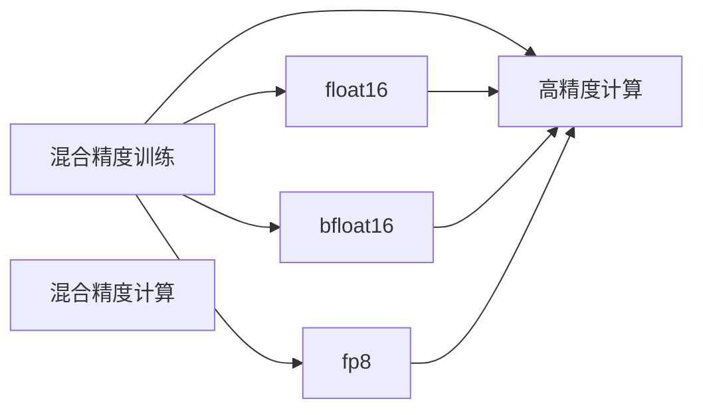

                 

# 第09章 混合精度训练 fp16、bf16与fp8

## 1. 背景介绍

### 1.1 问题由来

在深度学习的训练过程中，模型参数通常使用单精度浮点型(float32)来存储和计算。然而，单精度浮点数的精度和范围限制了模型训练的速度和效率，特别是在大型深度学习模型和大规模数据集的情况下。为了解决这一问题，混合精度训练技术应运而生。

混合精度训练技术（Mixed Precision Training）是指在模型训练过程中，部分参数使用高精度（如float64），而部分参数使用低精度（如float16或bfloat16）进行计算和存储，从而在保证精度损失最小化的同时，大幅提高模型训练速度和效率。该技术广泛应用于大型深度学习模型的训练，特别是当模型的参数量巨大且数据集规模庞大时。

### 1.2 问题核心关键点

混合精度训练的核心在于如何平衡精度和速度。不同的低精度格式（如fp16、bf16、fp8）有着不同的精度和存储效率，适用于不同的训练场景。选择合适的低精度格式，可以最大化混合精度训练的效果，同时最小化精度损失。

为了实现混合精度训练，主要的挑战包括：
- 参数的低精度表示：如何有效地表示和处理低精度数据，以支持高精度部分的计算。
- 计算精度与浮点数选择：如何选择合适的低精度浮点数（如fp16、bf16、fp8），以保证计算精度和效率。
- 精度损失控制：如何通过训练策略和正则化技术，最小化混合精度训练带来的精度损失。

## 2. 核心概念与联系

### 2.1 核心概念概述

为了更好地理解混合精度训练，我们需要了解以下核心概念：

- 混合精度训练（Mixed Precision Training）：在深度学习模型训练过程中，部分参数使用高精度（如float64），部分参数使用低精度（如float16或bfloat16）进行计算和存储，以提升训练速度和效率。
- float16：半精度浮点数，精度为float32的一半，但存储效率是其两倍，常用于混合精度训练中。
- bfloat16：一种近似于float16的浮点数格式，精度略高于float16，适用于深度学习模型的训练。
- fp8：一种更低的精度格式，通过更精细的指数范围和尾数精度实现更高的压缩率，但精度损失较大，常用于深度学习模型推理。
- 混合精度计算（Mixed Precision Computation）：指在计算过程中同时使用高精度和低精度数据进行混合计算，以提高计算效率。

这些核心概念之间的逻辑关系可以通过以下Mermaid流程图来展示：



这个流程图展示了大语言模型微调的核心概念及其之间的关系：

1. 混合精度训练：将高精度和低精度数据结合起来，提高训练效率。
2. float16、bf16、fp8：不同的低精度格式，适用于不同的计算需求。
3. 高精度计算：用于保持计算精度的部分，如网络初始化和部分梯度计算。

## 3. 核心算法原理 & 具体操作步骤
### 3.1 算法原理概述

混合精度训练的原理是将模型参数分为高精度部分和低精度部分。高精度部分通常用于网络初始化和部分梯度计算，以确保计算精度。低精度部分用于大部分前向和后向传播计算，以提高计算速度和效率。

混合精度训练的关键在于如何将高精度和低精度数据进行有效的组合和计算。通常有以下几种方法：

1. 逐层混合精度：将模型分为多个层次，不同层次使用不同的精度格式进行计算。
2. 混合精度计算：在计算过程中同时使用高精度和低精度数据进行混合计算，以提高效率。
3. 混合精度模型参数：将模型参数分为高精度和低精度两部分，分别存储和更新。

### 3.2 算法步骤详解

混合精度训练的步骤主要包括以下几个关键步骤：

**Step 1: 准备数据和模型**

- 准备训练数据集，将其分为训练集和验证集。
- 定义深度学习模型，包括网络结构、激活函数、损失函数等。

**Step 2: 设置混合精度参数**

- 选择低精度格式，如float16或bfloat16。
- 配置混合精度计算设备，如使用NVIDIA的混合精度训练工具（NVIDIA Apex）。
- 设置混合精度计算规则，如逐层混合精度或混合精度模型参数。

**Step 3: 初始化模型**

- 使用高精度数据对模型进行初始化。
- 将部分参数转换为低精度格式，以便于混合精度计算。

**Step 4: 混合精度训练**

- 使用混合精度计算规则进行前向和后向传播计算。
- 在每个epoch结束时，将低精度参数转换为高精度格式，进行梯度更新。
- 重复上述步骤，直到模型收敛。

**Step 5: 验证和测试**

- 在验证集上评估模型性能。
- 在测试集上进一步验证模型效果。

### 3.3 算法优缺点

混合精度训练具有以下优点：

1. 提高训练速度：通过使用低精度浮点数进行大部分计算，可以显著提高模型训练的速度。
2. 减少内存占用：低精度浮点数占用内存较少，可以节省大量的内存资源。
3. 降低计算成本：混合精度训练减少了单精度浮点数的计算量，降低了计算成本。

同时，混合精度训练也存在以下缺点：

1. 精度损失：低精度浮点数可能会引入一定的精度损失，影响模型的性能。
2. 硬件依赖：混合精度训练需要特定的硬件支持，如NVIDIA GPU和混合精度计算工具。
3. 参数表示复杂：部分参数需要高精度表示，部分参数需要低精度表示，增加了参数管理的复杂性。

### 3.4 算法应用领域

混合精度训练技术广泛应用于深度学习模型的训练，特别是在大型深度学习模型和大规模数据集的情况下。以下是一些典型应用场景：

- 计算机视觉：用于图像分类、目标检测、图像生成等任务。
- 自然语言处理：用于文本分类、情感分析、机器翻译等任务。
- 语音识别：用于语音识别、语音合成等任务。
- 生成对抗网络（GANs）：用于生成高质量的图像、视频等。
- 推荐系统：用于推荐系统的训练，提高推荐模型的准确性和效率。

## 4. 数学模型和公式 & 详细讲解 & 举例说明

### 4.1 数学模型构建

混合精度训练的核心是如何在计算过程中同时使用高精度和低精度数据。以下是混合精度训练的数学模型构建：

- 假设模型参数 $w$ 分为高精度部分 $w_{32}$ 和低精度部分 $w_{16}$。
- 高精度部分 $w_{32}$ 通常用于网络初始化和部分梯度计算。
- 低精度部分 $w_{16}$ 用于大部分前向和后向传播计算。

### 4.2 公式推导过程

以单层神经网络为例，计算过程可以分为以下几个步骤：

1. 前向传播计算：
   - 使用高精度数据计算输入 $x$ 与权重 $w_{32}$ 的乘积。
   - 将乘积结果转换为低精度格式，与 $w_{16}$ 计算。
   - 将计算结果转换为高精度格式，进行激活函数计算。

2. 后向传播计算：
   - 计算高精度部分的梯度。
   - 计算低精度部分的梯度。
   - 将高精度和低精度梯度合并，更新模型参数。

### 4.3 案例分析与讲解

以卷积神经网络（CNN）为例，展示混合精度训练的实现过程。假设模型参数 $w$ 分为高精度部分 $w_{32}$ 和低精度部分 $w_{16}$。

1. 前向传播：
   - 使用高精度数据计算输入 $x$ 与权重 $w_{32}$ 的卷积。
   - 将卷积结果转换为低精度格式，与 $w_{16}$ 计算。
   - 将计算结果转换为高精度格式，进行激活函数计算。

2. 后向传播：
   - 计算高精度部分的梯度。
   - 计算低精度部分的梯度。
   - 将高精度和低精度梯度合并，更新模型参数。

## 5. 项目实践：代码实例和详细解释说明
### 5.1 开发环境搭建

在进行混合精度训练实践前，我们需要准备好开发环境。以下是使用PyTorch和NVIDIA Apex进行混合精度训练的环境配置流程：

1. 安装Anaconda：从官网下载并安装Anaconda，用于创建独立的Python环境。

2. 创建并激活虚拟环境：
```bash
conda create -n mpx-env python=3.8 
conda activate mpx-env
```

3. 安装PyTorch和NVIDIA Apex：
```bash
pip install torch torchvision torchaudio cudatoolkit=11.1 -c pytorch -c conda-forge
pip install apex
```

4. 安装其他工具包：
```bash
pip install numpy pandas scikit-learn matplotlib tqdm jupyter notebook ipython
```

完成上述步骤后，即可在`mpx-env`环境中开始混合精度训练实践。

### 5.2 源代码详细实现

以下是一个使用PyTorch和NVIDIA Apex进行混合精度训练的代码示例：

```python
import torch
import torch.nn as nn
import torch.optim as optim
import apex

class Model(nn.Module):
    def __init__(self):
        super(Model, self).__init__()
        self.fc1 = nn.Linear(784, 256)
        self.fc2 = nn.Linear(256, 10)

    def forward(self, x):
        x = x.view(-1, 784)
        x = self.fc1(x)
        x = torch.relu(x)
        x = self.fc2(x)
        return x

# 定义模型和优化器
model = Model()
optimizer = optim.SGD(model.parameters(), lr=0.01, momentum=0.9)
criterion = nn.CrossEntropyLoss()

# 混合精度设置
mp = apex.mp.MixedPrecision
model, optimizer = mp.cast_model_and_optimizer(model, optimizer)

# 定义训练函数
def train_model(model, optimizer, criterion, train_loader, device):
    model.train()
    for epoch in range(num_epochs):
        for batch_idx, (data, target) in enumerate(train_loader):
            data, target = data.to(device), target.to(device)
            optimizer.zero_grad()
            output = model(data)
            loss = criterion(output, target)
            loss.backward()
            optimizer.step()

# 训练模型
train_loader = ...
device = torch.device('cuda')
train_model(model, optimizer, criterion, train_loader, device)
```

### 5.3 代码解读与分析

让我们再详细解读一下关键代码的实现细节：

**Model类**：
- `__init__`方法：初始化模型参数，包括线性层、激活函数等。
- `forward`方法：定义前向传播过程。

**混合精度设置**：
- 使用`apex.mp.MixedPrecision`对模型和优化器进行混合精度设置。
- `mp.cast_model_and_optimizer`方法可以将模型和优化器的部分参数转换为低精度格式，以便于混合精度计算。

**训练函数**：
- 在每个epoch内，对数据进行迭代，进行前向传播和后向传播计算。
- 使用优化器更新模型参数。

**训练模型**：
- 在训练集中进行模型训练。
- 使用NVIDIA GPU进行计算。

## 6. 实际应用场景
### 6.1 计算机视觉

在计算机视觉领域，混合精度训练可以显著提高图像分类、目标检测、图像生成等任务的训练速度和效率。通过使用混合精度训练，可以加快模型训练，提高模型的准确性和泛化能力。

### 6.2 自然语言处理

在自然语言处理领域，混合精度训练同样可以应用于文本分类、情感分析、机器翻译等任务。通过混合精度训练，可以在较短的时间内训练出高精度的模型，同时提高模型的推理速度。

### 6.3 语音识别

在语音识别领域，混合精度训练可以用于语音识别和语音合成的训练，提高语音识别的准确性和实时性。混合精度训练还可以减少语音合成的计算成本，提高语音合成的效率。

### 6.4 生成对抗网络（GANs）

在生成对抗网络（GANs）领域，混合精度训练可以用于生成高质量的图像、视频等。通过混合精度训练，可以提高GANs的训练速度和生成质量，同时减少计算成本。

### 6.5 推荐系统

在推荐系统领域，混合精度训练可以用于推荐系统的训练，提高推荐模型的准确性和效率。通过混合精度训练，可以在较短的时间内训练出高精度的推荐模型，同时提高推荐系统的实时性。

## 7. 工具和资源推荐
### 7.1 学习资源推荐

为了帮助开发者系统掌握混合精度训练的理论基础和实践技巧，这里推荐一些优质的学习资源：

1. 《深度学习中的混合精度训练》系列博文：由深度学习专家撰写，深入浅出地介绍了混合精度训练的原理和实践技巧。

2. 《深度学习中的混合精度训练》书籍：详细介绍了混合精度训练的理论和实践方法，包括不同的低精度格式和训练策略。

3. 《深度学习中的混合精度训练》课程：斯坦福大学开设的深度学习课程，有Lecture视频和配套作业，带你入门混合精度训练的高级话题。

4. PyTorch官方文档：PyTorch的官方文档，提供了混合精度训练的详细说明和样例代码。

5. NVIDIA官方文档：NVIDIA Apex和混合精度训练的官方文档，提供了详细的API接口和最佳实践。

通过对这些资源的学习实践，相信你一定能够快速掌握混合精度训练的精髓，并用于解决实际的深度学习问题。

### 7.2 开发工具推荐

高效的开发离不开优秀的工具支持。以下是几款用于混合精度训练开发的常用工具：

1. PyTorch：基于Python的开源深度学习框架，灵活动态的计算图，适合快速迭代研究。大部分深度学习模型都有PyTorch版本的实现。

2. TensorFlow：由Google主导开发的开源深度学习框架，生产部署方便，适合大规模工程应用。同样有丰富的深度学习模型资源。

3. NVIDIA Apex：NVIDIA提供的混合精度计算工具，可以用于PyTorch和TensorFlow，支持混合精度模型参数和混合精度计算。

4. Weights & Biases：模型训练的实验跟踪工具，可以记录和可视化模型训练过程中的各项指标，方便对比和调优。与主流深度学习框架无缝集成。

5. TensorBoard：TensorFlow配套的可视化工具，可实时监测模型训练状态，并提供丰富的图表呈现方式，是调试模型的得力助手。

6. Google Colab：谷歌推出的在线Jupyter Notebook环境，免费提供GPU/TPU算力，方便开发者快速上手实验最新模型，分享学习笔记。

合理利用这些工具，可以显著提升混合精度训练的开发效率，加快创新迭代的步伐。

### 7.3 相关论文推荐

混合精度训练技术的发展源于学界的持续研究。以下是几篇奠基性的相关论文，推荐阅读：

1. Mixed Precision Training with Tensor Cores：NVIDIA官方论文，介绍了如何使用NVIDIA的混合精度计算工具进行混合精度训练。

2. Deep Learning with Mixed Precision Data Types：NVIDIA的深度学习技术报告，详细介绍了混合精度训练的理论和实践方法。

3. Learning Efficient Neural Networks with Mixed Precision Training：使用混合精度训练提高神经网络的计算效率和精度。

4. Mixed Precision Training in PyTorch: A Case Study on ResNet-50：使用PyTorch进行混合精度训练的实际案例，展示了混合精度训练的效果和优势。

5. A Comprehensive Analysis of Mixed-Precision Methods for Neural Network Training：对混合精度训练方法进行全面分析，比较了不同方法的优缺点。

这些论文代表了大语言模型微调技术的发展脉络。通过学习这些前沿成果，可以帮助研究者把握学科前进方向，激发更多的创新灵感。

## 8. 总结：未来发展趋势与挑战
### 8.1 总结

本文对混合精度训练技术进行了全面系统的介绍。首先阐述了混合精度训练的背景和意义，明确了混合精度训练在提高深度学习模型训练速度和效率方面的独特价值。其次，从原理到实践，详细讲解了混合精度训练的数学原理和关键步骤，给出了混合精度训练任务开发的完整代码实例。同时，本文还广泛探讨了混合精度训练技术在计算机视觉、自然语言处理、语音识别等多个领域的应用前景，展示了混合精度训练技术的广阔前景。

通过本文的系统梳理，可以看到，混合精度训练技术已经成为深度学习模型训练的重要范式，极大地提高了模型训练的速度和效率。未来，伴随深度学习技术的不断发展，混合精度训练技术还将不断演进，为深度学习模型的训练带来新的突破。

### 8.2 未来发展趋势

展望未来，混合精度训练技术将呈现以下几个发展趋势：

1. 混合精度计算的普及：随着深度学习模型规模的增大，混合精度计算将成为训练深度学习模型的标准配置。越来越多的深度学习框架将提供混合精度计算的支持。

2. 混合精度计算的优化：未来的混合精度计算将不断优化，通过引入新的计算硬件和软件工具，提高混合精度计算的效率和精度。

3. 混合精度计算的应用扩展：混合精度计算将应用于更多的深度学习任务，如计算机视觉、自然语言处理、语音识别等。

4. 混合精度计算与其它技术的融合：混合精度计算将与其他深度学习技术进行更深入的融合，如分布式训练、模型压缩等，提升深度学习技术的整体性能。

5. 混合精度计算与云计算的结合：混合精度计算将与云计算平台结合，提供高效、便捷的混合精度计算服务，降低深度学习模型的计算成本。

这些趋势凸显了混合精度训练技术的广阔前景。这些方向的探索发展，必将进一步提升深度学习模型的训练速度和效率，推动深度学习技术的产业化进程。

### 8.3 面临的挑战

尽管混合精度训练技术已经取得了瞩目成就，但在迈向更加智能化、普适化应用的过程中，它仍面临着诸多挑战：

1. 硬件依赖：混合精度训练需要特定的硬件支持，如NVIDIA GPU和混合精度计算工具。硬件的成本和普及程度直接影响混合精度训练的普及。

2. 精度损失控制：混合精度训练引入的低精度浮点数可能会导致一定的精度损失，影响模型的性能。如何最小化精度损失，仍是一个亟待解决的问题。

3. 参数管理复杂：混合精度训练涉及高精度和低精度参数的管理，增加了参数管理的复杂性。

4. 学习曲线陡峭：混合精度训练需要一定的学习曲线，开发者需要掌握混合精度训练的理论和实践方法，才能有效利用混合精度训练技术。

5. 计算资源需求高：混合精度训练需要较大的计算资源，特别是在训练大规模深度学习模型时，计算资源的投入将非常高。

这些挑战需要学界和产业界的共同努力，才能进一步推动混合精度训练技术的普及和应用。

### 8.4 研究展望

面对混合精度训练所面临的挑战，未来的研究需要在以下几个方面寻求新的突破：

1. 优化混合精度计算工具：进一步优化混合精度计算工具，提高混合精度计算的效率和精度。

2. 引入更高效的低精度格式：引入更高效的低精度格式，如bfloat16、fp8等，进一步提升混合精度训练的效果。

3. 引入新的训练策略：引入新的训练策略，如分布式混合精度训练、混合精度微调等，提高混合精度训练的灵活性和适应性。

4. 引入先验知识：将符号化的先验知识与混合精度训练结合，引导混合精度训练过程，学习更加普适、鲁棒的语言表征。

5. 引入多模态数据：引入多模态数据，如视觉、语音、文本等，提高混合精度训练模型的多模态处理能力。

这些研究方向将引领混合精度训练技术迈向更高的台阶，为深度学习模型的训练带来新的突破。相信随着学界和产业界的共同努力，混合精度训练技术必将取得新的进展，推动深度学习技术的不断进步。

## 9. 附录：常见问题与解答

**Q1: 混合精度训练有哪些常见问题？**

A: 混合精度训练常见问题包括：
1. 精度损失：混合精度训练可能引入一定的精度损失，影响模型的性能。
2. 硬件依赖：混合精度训练需要特定的硬件支持，如NVIDIA GPU和混合精度计算工具。
3. 参数管理复杂：混合精度训练涉及高精度和低精度参数的管理，增加了参数管理的复杂性。

**Q2: 如何选择适合的低精度格式？**

A: 选择合适的低精度格式需要考虑以下几个方面：
1. 精度要求：根据任务需求选择合适的低精度格式，如float16、bf16、fp8等。
2. 硬件支持：确保硬件支持所选择的低精度格式。
3. 计算效率：根据计算资源需求和训练时间选择合适的低精度格式。

**Q3: 如何控制混合精度训练中的精度损失？**

A: 控制混合精度训练中的精度损失可以采用以下方法：
1. 使用更高精度的初始化参数。
2. 引入正则化技术，如L2正则、Dropout等，防止过拟合。
3. 使用更先进的低精度格式，如bfloat16、fp8等，减少精度损失。

**Q4: 混合精度训练对内存和计算资源的需求如何？**

A: 混合精度训练对内存和计算资源的需求较大，特别是在训练大规模深度学习模型时。可以使用混合精度计算工具和分布式训练技术来优化资源使用。

**Q5: 如何评估混合精度训练的效果？**

A: 评估混合精度训练的效果可以采用以下方法：
1. 在验证集上评估模型性能。
2. 在测试集上进一步验证模型效果。
3. 比较混合精度训练与单精度训练的效果，评估精度和速度的平衡。

通过对这些问题的解答，可以帮助开发者更好地理解混合精度训练的理论和实践，提高深度学习模型的训练效率和性能。

---

作者：禅与计算机程序设计艺术 / Zen and the Art of Computer Programming

