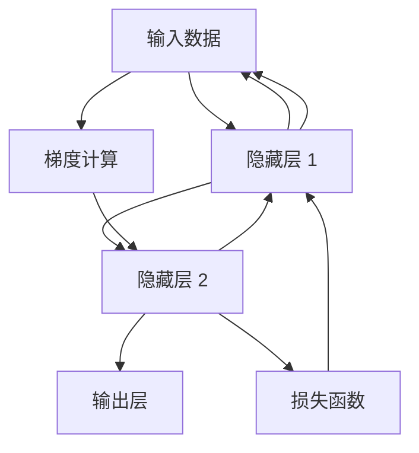

                 

# 第二章：机器学习和反向传播的微妙之处

## 1. 背景介绍

### 1.1 问题由来

在机器学习领域，特别是在深度学习领域，反向传播（Backpropagation）是一种核心的算法，用于训练神经网络。然而，尽管反向传播在深度学习中扮演着关键角色，但其背后的原理并不总是被充分理解，这也导致了一些实践中的困惑和误解。因此，本文旨在深入探讨反向传播的微妙之处，帮助读者更好地理解这一核心算法。

### 1.2 问题核心关键点

反向传播的核心在于它如何有效地计算梯度，并将梯度传递到每一层神经网络，以便进行权重更新。这一过程不仅决定了模型的学习效率，还影响着模型的稳定性和泛化能力。以下是反向传播的几个关键点：

- 梯度的计算与传递
- 反向传播与损失函数的关系
- 反向传播中的局部极小值与梯度消失/爆炸问题
- 正则化和优化器在反向传播中的作用

## 2. 核心概念与联系

### 2.1 核心概念概述

在深入探讨反向传播之前，我们先概述一些相关的核心概念：

- **神经网络（Neural Network）**：由多个层次的节点（或称神经元）构成的计算图，每层之间通过权重连接，用于处理输入数据，并输出结果。
- **损失函数（Loss Function）**：衡量模型预测与实际标签之间差距的函数，用于指导模型的训练方向。
- **梯度（Gradient）**：梯度是损失函数对模型参数的偏导数，代表了模型在特定参数值上的变化率。
- **反向传播（Backpropagation）**：通过链式法则，从输出层向输入层反向计算梯度，用于更新模型参数的过程。

这些概念相互交织，共同构成了深度学习模型的训练基础。理解这些概念的深层含义，是掌握反向传播的关键。

### 2.2 核心概念原理和架构的 Mermaid 流程图



上述流程图展示了神经网络的架构和反向传播的基本流程。输入数据经过多个隐藏层，最后到达输出层。损失函数计算预测值与真实标签之间的差距，然后通过反向传播，从输出层向输入层反向计算梯度。梯度计算过程中，每个节点都会更新其权重，以最小化损失函数。

## 3. 核心算法原理 & 具体操作步骤

### 3.1 算法原理概述

反向传播算法的基本原理是链式法则，用于计算损失函数对模型参数的偏导数。在深度神经网络中，这一过程通过反向传播从输出层逐步传递到输入层。

具体来说，反向传播从输出层的损失函数开始，通过链式法则计算每个节点的梯度，并将这些梯度向后传递，直到计算出输入层的梯度。这个过程可以用以下公式概括：

$$
\frac{\partial L}{\partial \theta_i} = \frac{\partial L}{\partial z_i} \frac{\partial z_i}{\partial \theta_i}
$$

其中，$L$ 是损失函数，$z_i$ 是第 $i$ 个节点的输出，$\theta_i$ 是该节点的权重。

### 3.2 算法步骤详解

以下是反向传播算法的详细步骤：

1. **前向传播**：将输入数据输入神经网络，计算每个节点的输出值，并最终计算出损失函数的值。

2. **反向传播**：从输出层开始，根据链式法则计算每个节点的梯度，并将这些梯度向前传递，直到输入层。

3. **权重更新**：根据梯度下降等优化算法，更新模型的权重参数，以最小化损失函数。

具体实现步骤如下：

- **初始化权重**：随机初始化神经网络的权重参数。
- **前向传播**：输入数据经过每个节点计算，并得到输出。
- **计算梯度**：从输出层开始，根据链式法则计算每个节点的梯度。
- **权重更新**：根据梯度下降算法，更新权重参数，使得损失函数最小化。
- **重复**：重复上述步骤，直到达到预设的迭代次数或损失函数收敛。

### 3.3 算法优缺点

反向传播算法具有以下优点：

- **高效性**：通过链式法则，反向传播可以高效地计算梯度，避免了对每个节点单独计算梯度的复杂过程。
- **通用性**：适用于各种类型的神经网络，包括卷积神经网络（CNN）和循环神经网络（RNN）。

然而，反向传播也存在一些缺点：

- **梯度消失/爆炸**：在深层神经网络中，梯度可能会在反向传播过程中消失或爆炸，导致模型无法有效学习。
- **局部极小值**：反向传播可能陷入局部极小值，使得模型无法收敛到全局最优解。

### 3.4 算法应用领域

反向传播算法广泛应用于深度学习和机器学习领域，用于训练各种类型的神经网络。其应用领域包括但不限于：

- 图像识别
- 自然语言处理
- 语音识别
- 推荐系统
- 游戏AI

反向传播不仅用于深度学习模型的训练，还被广泛应用于图像处理、自然语言处理和语音识别等领域的模型优化。

## 4. 数学模型和公式 & 详细讲解 & 举例说明

### 4.1 数学模型构建

在反向传播中，我们主要关注损失函数和梯度计算。以一个简单的线性回归模型为例，损失函数为均方误差（MSE），模型输出为 $y_i = \theta^T x_i$，其中 $x_i$ 是输入数据，$y_i$ 是真实标签，$\theta$ 是权重向量。

### 4.2 公式推导过程

反向传播的推导过程如下：

1. **计算损失函数的梯度**：
   $$
   \frac{\partial L}{\partial \theta} = \frac{1}{2} \sum_i (y_i - \theta^T x_i)^2
   $$

2. **反向计算梯度**：
   $$
   \frac{\partial L}{\partial y_i} = \frac{\partial L}{\partial z_i} \frac{\partial z_i}{\partial y_i} = (\theta^T x_i - y_i)
   $$
   $$
   \frac{\partial L}{\partial \theta} = \frac{\partial L}{\partial z_i} \frac{\partial z_i}{\partial \theta} = \sum_i x_i (\theta^T x_i - y_i)
   $$

其中，$z_i$ 是模型的输出，$\frac{\partial L}{\partial y_i}$ 是损失函数对输出层的梯度，$\frac{\partial L}{\partial \theta}$ 是损失函数对权重向量的梯度。

### 4.3 案例分析与讲解

考虑一个简单的两隐藏层神经网络，用于图像分类任务。其中，输入层有64个节点，每个隐藏层有64个节点，输出层有10个节点（代表10个类别）。

假设我们的训练数据集有1000个样本，每个样本的输入数据为64维，真实标签为10维。模型输出层对损失函数的梯度为：
$$
\frac{\partial L}{\partial z_5} = (W_2^T \hat{y} - y)
$$
其中，$z_5$ 是输出层节点的输出，$W_2$ 是输出层的权重矩阵，$\hat{y}$ 是模型的预测值，$y$ 是真实标签。

根据链式法则，隐藏层2对损失函数的梯度为：
$$
\frac{\partial L}{\partial z_4} = \frac{\partial L}{\partial z_5} \frac{\partial z_5}{\partial z_4}
$$
其中，$z_4$ 是隐藏层2的输出。

依次类推，隐藏层1对损失函数的梯度为：
$$
\frac{\partial L}{\partial z_3} = \frac{\partial L}{\partial z_4} \frac{\partial z_4}{\partial z_3}
$$
其中，$z_3$ 是隐藏层1的输出。

最终，我们可以得到输入层对损失函数的梯度为：
$$
\frac{\partial L}{\partial z_1} = \frac{\partial L}{\partial z_3} \frac{\partial z_3}{\partial z_2} \frac{\partial z_2}{\partial z_1}
$$
其中，$z_1$ 是输入层的输出。

通过这一过程，我们可以计算出每个节点的梯度，并更新模型的权重参数，以最小化损失函数。

## 5. 项目实践：代码实例和详细解释说明

### 5.1 开发环境搭建

为了进行反向传播的实践，我们需要搭建一个Python开发环境，并安装必要的深度学习库。以下是在Python 3.7环境中搭建深度学习开发环境的步骤：

1. **安装Python**：
   ```bash
   sudo apt-get install python3.7
   ```

2. **安装pip**：
   ```bash
   sudo apt-get install python3-pip
   ```

3. **安装TensorFlow**：
   ```bash
   pip install tensorflow
   ```

4. **安装PyTorch**：
   ```bash
   pip install torch torchvision
   ```

5. **安装Keras**：
   ```bash
   pip install keras
   ```

完成以上步骤后，即可开始反向传播的实践。

### 5.2 源代码详细实现

以下是一个简单的反向传播示例，使用Keras实现一个简单的线性回归模型。

```python
from keras.models import Sequential
from keras.layers import Dense
from keras.optimizers import SGD

# 构建模型
model = Sequential()
model.add(Dense(1, input_dim=1, activation='linear'))
model.add(Dense(1, activation='linear'))

# 编译模型
model.compile(loss='mse', optimizer=SGD(lr=0.1))

# 训练模型
model.fit(x_train, y_train, epochs=100, batch_size=10)
```

### 5.3 代码解读与分析

上述代码中，我们使用Keras构建了一个包含两个密集层的线性回归模型。模型输出层和输入层的节点数均为1，激活函数为线性函数。我们使用均方误差（MSE）作为损失函数，使用随机梯度下降（SGD）优化算法进行权重更新。

### 5.4 运行结果展示

在训练过程中，我们可以使用Keras提供的工具来监控模型的训练状态和损失函数的变化。例如，可以使用以下代码来可视化训练过程中的损失函数变化：

```python
import matplotlib.pyplot as plt

plt.plot(history.history['loss'])
plt.title('Model loss')
plt.ylabel('Loss')
plt.xlabel('Epoch')
plt.legend(['Train', 'Test'], loc='upper left')
plt.show()
```

通过上述代码，我们可以得到训练过程中的损失函数变化曲线，帮助评估模型的训练效果。

## 6. 实际应用场景

### 6.1 图像识别

反向传播在图像识别任务中的应用非常广泛。例如，卷积神经网络（CNN）中，反向传播用于计算卷积层和池化层的梯度，进而更新卷积核和池化核的参数。这一过程使得CNN能够自动学习图像特征，实现高效的图像分类和识别。

### 6.2 自然语言处理

在自然语言处理（NLP）领域，反向传播被用于训练循环神经网络（RNN）和长短时记忆网络（LSTM）等模型。例如，在机器翻译任务中，反向传播用于更新语言模型和解码器的参数，使得模型能够准确地翻译输入文本。

### 6.3 语音识别

反向传播在语音识别领域也有重要应用。例如，在自动语音识别（ASR）任务中，反向传播用于更新声学模型和语言模型的参数，使得模型能够准确地将语音信号转换为文本。

## 7. 工具和资源推荐

### 7.1 学习资源推荐

- **《深度学习》**：Ian Goodfellow等著，全面介绍了深度学习的基本概念和算法，包括反向传播的原理和应用。
- **《神经网络与深度学习》**：Michael Nielsen著，详细讲解了神经网络的基本原理和反向传播的推导过程。
- **Kaggle**：提供了丰富的深度学习竞赛和项目，通过实践可以更好地理解反向传播的应用。

### 7.2 开发工具推荐

- **TensorFlow**：Google开发的深度学习框架，支持多种类型的神经网络，包括CNN、RNN和LSTM等。
- **PyTorch**：Facebook开发的深度学习框架，支持动态计算图，适合研究性的深度学习项目。
- **Keras**：高层次的深度学习框架，易于使用，适合快速开发深度学习模型。

### 7.3 相关论文推荐

- **《深度学习》**：Ian Goodfellow等著，深入讲解了深度学习的基本概念和算法，包括反向传播的原理和应用。
- **《神经网络与深度学习》**：Michael Nielsen著，详细讲解了神经网络的基本原理和反向传播的推导过程。

## 8. 总结：未来发展趋势与挑战

### 8.1 研究成果总结

反向传播作为深度学习模型的核心算法，已经广泛应用于各种机器学习任务。其在图像识别、自然语言处理和语音识别等领域的成功应用，推动了深度学习技术的快速发展。

### 8.2 未来发展趋势

未来，反向传播将继续在深度学习中发挥核心作用。随着算力资源的不断提升，反向传播将能够训练更大、更复杂的神经网络，从而实现更高效的模型训练和更准确的模型预测。

### 8.3 面临的挑战

尽管反向传播在深度学习中已经取得了巨大的成功，但仍面临一些挑战：

- **计算资源消耗**：反向传播的计算复杂度高，需要大量的计算资源进行模型训练。
- **模型泛化能力**：反向传播需要大量的训练数据，模型泛化能力仍需进一步提升。
- **模型可解释性**：反向传播的复杂性使得模型的内部机制难以解释，需要进一步研究模型的可解释性。

### 8.4 研究展望

未来的研究需要在以下几个方面取得突破：

- **分布式训练**：通过分布式训练技术，加速反向传播的计算过程。
- **模型压缩**：通过模型压缩技术，减少反向传播的计算资源消耗。
- **可解释性研究**：研究模型的可解释性，使得反向传播模型更加透明和可信。

## 9. 附录：常见问题与解答

**Q1：反向传播中的梯度消失/爆炸问题如何解决？**

A: 梯度消失/爆炸问题是反向传播中的常见问题，可以通过以下方法解决：

- **梯度裁剪（Gradient Clipping）**：限制梯度的最大值和最小值，避免梯度爆炸。
- **权重初始化（Weight Initialization）**：使用Xavier或He初始化方法，避免权重过大或过小。
- **使用激活函数**：使用ReLU、LeakyReLU等激活函数，避免梯度消失。

**Q2：反向传播的计算复杂度如何优化？**

A: 反向传播的计算复杂度可以通过以下方法优化：

- **使用GPU加速**：利用GPU并行计算能力，加速反向传播的计算过程。
- **使用优化算法**：使用Adam、Adagrad等优化算法，加速模型收敛。
- **使用批处理（Batch）**：使用批处理技术，加速模型的训练和推理。

**Q3：反向传播在实际应用中需要注意哪些问题？**

A: 在实际应用中，反向传播需要注意以下问题：

- **过拟合**：通过正则化、dropout等方法，避免模型过拟合。
- **数据预处理**：对输入数据进行标准化、归一化等预处理，提高模型训练效果。
- **超参数调整**：根据实际应用场景，调整模型的超参数，优化模型性能。

通过以上方法，可以更好地理解和应用反向传播算法，提高深度学习模型的训练效果和实际应用能力。

---

作者：禅与计算机程序设计艺术 / Zen and the Art of Computer Programming

