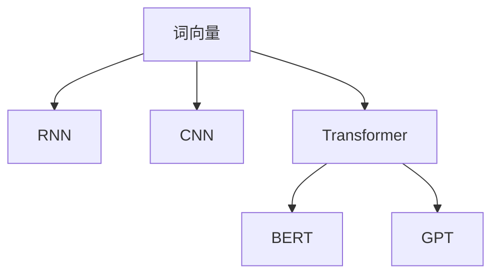

                 

# 第五章：自然语言处理基础

## 1. 背景介绍

### 1.1 问题由来

随着人工智能(AI)技术的飞速发展，自然语言处理(NLP)作为AI的重要分支，已经深入应用到生活的各个领域。从智能客服到智能翻译，从情感分析到问答系统，NLP技术正在改变人类的生产生活方式。然而，尽管NLP技术取得了诸多进展，但NLP领域依然存在一些核心挑战，如语言理解的深度、自然语言的生成能力、跨领域适应性等。本章节将围绕这些核心挑战，全面介绍NLP的基础知识，期望为读者提供对NLP技术更深入的理解和认识。

### 1.2 问题核心关键点

自然语言处理(NLP)技术主要关注如何使计算机理解和处理人类语言。其核心问题包括：

- **语言理解**：通过算法实现对文本内容的理解，如分词、句法分析、语义分析等。
- **语言生成**：通过算法生成自然语言文本，如机器翻译、文本生成、对话系统等。
- **跨领域适应**：将预训练模型在不同领域进行微调，以适应特定任务和应用场景。

## 2. 核心概念与联系

### 2.1 核心概念概述

为了更好地理解NLP的基础知识，本节将介绍几个密切相关的核心概念：

- **词向量(Word Embedding)**：将词语映射到高维向量空间，捕捉词语的语义信息。词向量是一种常用的自然语言表示方法。
- **循环神经网络(RNN)**：一种能够处理序列数据的神经网络，常用于语言建模和序列标注任务。
- **卷积神经网络(CNN)**：一种能够处理局部特征的神经网络，常用于文本分类和情感分析任务。
- **Transformer**：一种能够高效处理长距离依赖的神经网络，通过自注意力机制实现跨层信息交互，广泛应用于机器翻译、语言生成等任务。
- **BERT(Bidirectional Encoder Representations from Transformers)**：一种预训练语言模型，通过双向编码和掩码语言模型等任务提升语言理解能力。
- **GPT(Generative Pre-trained Transformer)**：一种预训练语言模型，通过自回归生成模型提升语言生成能力。

这些核心概念之间的逻辑关系可以通过以下Mermaid流程图来展示：



这个流程图展示了大语言模型的核心概念及其之间的关系：

1. 词向量是其他模型的基础，捕捉词语的语义信息。
2. RNN和CNN分别用于处理序列和局部特征。
3. Transformer在大规模语言建模中应用广泛，BERT和GPT在此基础上进一步提升语言理解能力和生成能力。

## 3. 核心算法原理 & 具体操作步骤

### 3.1 算法原理概述

NLP的核心算法包括词向量、RNN、CNN、Transformer等。这些算法从不同的角度出发，解决NLP任务中的核心问题。

- **词向量算法**：通过将词语映射到高维向量空间，捕捉词语的语义信息，如Word2Vec、GloVe等。
- **RNN算法**：通过循环结构处理序列数据，捕捉词语之间的时序关系，如LSTM、GRU等。
- **CNN算法**：通过卷积结构处理文本数据，捕捉局部特征，如TextCNN等。
- **Transformer算法**：通过自注意力机制捕捉长距离依赖关系，实现跨层信息交互，如BERT、GPT等。

这些算法共同构成了NLP的核心框架，使其能够高效处理语言理解、生成、分类、标注等任务。

### 3.2 算法步骤详解

以BERT预训练为例，具体介绍基于Transformer的微调算法步骤：

1. **准备数据集**：收集标注数据集，包括训练集、验证集和测试集。数据集应涵盖不同类型的句子，并确保句子长度的一致性。
2. **预训练模型初始化**：选择预训练模型（如BERT），并根据数据集特点进行参数初始化。
3. **微调模型**：在预训练模型的基础上，使用下游任务数据集进行微调。微调的目标是最小化损失函数，优化模型参数。
4. **评估模型**：在验证集上评估微调后的模型性能，调整超参数以优化模型表现。
5. **测试模型**：在测试集上测试最终模型的性能，并根据测试结果优化模型。

### 3.3 算法优缺点

NLP算法具有以下优点：

- **鲁棒性强**：通过多种算法结合，可以提升模型在不同场景下的适应性。
- **表现优异**：在语言理解、生成、分类、标注等多个任务上，表现出色。
- **可解释性高**：通过词向量、RNN、CNN、Transformer等算法，可以深入理解语言特征。

同时，NLP算法也存在一些局限性：

- **数据依赖高**：需要大量标注数据进行训练，标注成本高。
- **模型复杂**：大型预训练模型参数量大，训练和推理成本高。
- **多义词问题**：自然语言中的多义词现象，增加了模型理解的复杂度。
- **语言特定性**：不同语言之间的差异，增加了跨语言翻译和理解的难度。

### 3.4 算法应用领域

NLP技术在多个领域都有广泛应用：

- **智能客服**：通过自然语言处理技术，实现智能客服机器人，提供24小时不间断服务。
- **情感分析**：对用户评论、社交媒体等文本数据进行情感分析，了解用户情感倾向。
- **机器翻译**：通过自然语言处理技术，实现跨语言的自动翻译，促进全球交流。
- **信息检索**：通过自然语言处理技术，实现高效的文本检索，提高信息获取效率。
- **问答系统**：通过自然语言处理技术，实现智能问答系统，回答用户问题。
- **文本摘要**：通过自然语言处理技术，对长篇文本进行自动摘要，提取核心信息。
- **知识图谱**：通过自然语言处理技术，构建知识图谱，提供结构化信息。

这些应用场景展示了NLP技术的强大潜力和广泛应用，推动了社会的数字化转型。

## 4. 数学模型和公式 & 详细讲解 & 举例说明

### 4.1 数学模型构建

NLP任务的数学模型一般由以下几部分组成：

1. **输入层**：将文本数据转换为模型所需的输入格式，如将文本转换为词向量或字符序列。
2. **隐藏层**：进行特征提取和信息处理，可以是RNN、CNN或Transformer等。
3. **输出层**：根据任务需求，进行分类、标注或生成等操作。

以BERT为例，BERT的数学模型包括输入层、Transformer编码层、输出层和掩码语言模型。

### 4.2 公式推导过程

BERT模型的公式推导过程如下：

1. **输入层**：
   - 输入文本 $x_i$ 转换为词向量 $X \in \mathbb{R}^{L \times D}$，其中 $L$ 为句子长度，$D$ 为词向量维度。

2. **Transformer编码层**：
   - 使用Transformer编码器对输入词向量进行编码，输出序列表示 $H \in \mathbb{R}^{L \times D}$。
   - 使用掩码语言模型对序列表示进行预测，定义损失函数 $L_{MLM}(X, H)$。

3. **输出层**：
   - 根据任务需求，定义输出层和损失函数，如分类任务使用交叉熵损失函数。

4. **整体损失函数**：
   - 将输入层、Transformer编码层和输出层的损失函数进行组合，定义整体损失函数 $L = \alpha L_{MLM}(X, H) + (1-\alpha) L_{TASK}(X, H, Y)$，其中 $Y$ 为任务标签。

### 4.3 案例分析与讲解

以情感分析任务为例，分析BERT模型的推导过程：

1. **输入层**：将文本 $x_i$ 转换为词向量 $X \in \mathbb{R}^{L \times D}$。
2. **Transformer编码层**：使用BERT编码器对词向量进行编码，输出序列表示 $H \in \mathbb{R}^{L \times D}$。
3. **输出层**：定义二分类任务，使用softmax函数将序列表示映射到情感标签，定义交叉熵损失函数 $L_{TASK}(X, H, Y)$。
4. **整体损失函数**：将BERT掩码语言模型损失 $L_{MLM}(X, H)$ 和情感分析任务损失 $L_{TASK}(X, H, Y)$ 进行组合，定义整体损失函数 $L$。

## 5. 项目实践：代码实例和详细解释说明

### 5.1 开发环境搭建

进行NLP项目实践，需要先搭建好开发环境。以下是使用Python和PyTorch搭建开发环境的流程：

1. **安装Anaconda**：从官网下载并安装Anaconda，用于创建独立的Python环境。
2. **创建虚拟环境**：
   ```bash
   conda create -n nlp-env python=3.8 
   conda activate nlp-env
   ```
3. **安装依赖库**：
   ```bash
   pip install torch torchtext transformers
   ```

### 5.2 源代码详细实现

以下以BERT情感分析任务为例，介绍使用PyTorch和transformers库进行项目开发的完整代码实现：

```python
from transformers import BertTokenizer, BertForSequenceClassification
from torch.utils.data import DataLoader
import torch

# 初始化模型和分词器
model = BertForSequenceClassification.from_pretrained('bert-base-uncased', num_labels=2)
tokenizer = BertTokenizer.from_pretrained('bert-base-uncased')

# 准备数据集
train_data = # 训练数据
val_data = # 验证数据
test_data = # 测试数据

# 数据处理
def process_data(data, tokenizer, max_len=128):
    inputs = tokenizer(data, padding=True, truncation=True, max_length=max_len, return_tensors='pt')
    return inputs['input_ids'], inputs['attention_mask']

# 加载数据
train_ids, train_masks = process_data(train_data, tokenizer, max_len=128)
val_ids, val_masks = process_data(val_data, tokenizer, max_len=128)
test_ids, test_masks = process_data(test_data, tokenizer, max_len=128)

# 定义模型
device = torch.device('cuda') if torch.cuda.is_available() else torch.device('cpu')
model.to(device)

# 定义损失函数和优化器
criterion = torch.nn.CrossEntropyLoss()
optimizer = torch.optim.Adam(model.parameters(), lr=2e-5)

# 训练模型
def train_epoch(model, train_loader, optimizer, criterion):
    model.train()
    loss = 0
    for batch in train_loader:
        input_ids, attention_mask = batch
        input_ids = input_ids.to(device)
        attention_mask = attention_mask.to(device)
        outputs = model(input_ids, attention_mask=attention_mask)
        loss += criterion(outputs.logits, labels).item()
    return loss / len(train_loader)

def evaluate(model, val_loader, criterion):
    model.eval()
    total_loss = 0
    for batch in val_loader:
        input_ids, attention_mask = batch
        input_ids = input_ids.to(device)
        attention_mask = attention_mask.to(device)
        outputs = model(input_ids, attention_mask=attention_mask)
        total_loss += criterion(outputs.logits, labels).item()
    return total_loss / len(val_loader)

# 训练模型
train_loader = DataLoader(train_data, batch_size=32, shuffle=True)
val_loader = DataLoader(val_data, batch_size=32, shuffle=False)
test_loader = DataLoader(test_data, batch_size=32, shuffle=False)

epochs = 3
best_loss = float('inf')

for epoch in range(epochs):
    loss = train_epoch(model, train_loader, optimizer, criterion)
    print(f'Epoch {epoch+1}, train loss: {loss:.4f}')
    if loss < best_loss:
        best_loss = loss
        save_model(model, 'model_checkpoint')

# 评估模型
val_loss = evaluate(model, val_loader, criterion)
print(f'Val loss: {val_loss:.4f}')

# 测试模型
test_loss = evaluate(model, test_loader, criterion)
print(f'Test loss: {test_loss:.4f}')
```

### 5.3 代码解读与分析

通过上述代码，我们可以对BERT情感分析任务的实现进行详细解读：

1. **模型初始化**：使用`BertForSequenceClassification`类加载预训练的BERT模型，并进行分类器初始化。
2. **数据处理**：使用`BertTokenizer`类进行文本分词和编码，转换为模型所需的输入格式。
3. **模型训练**：通过定义训练循环，在训练集上训练模型，并使用Adam优化器更新模型参数。
4. **模型评估**：在验证集上评估模型性能，并保存最优模型。
5. **模型测试**：在测试集上测试模型性能。

### 5.4 运行结果展示

在训练过程中，可以使用TensorBoard等工具可视化训练过程，如损失曲线、准确率曲线等，以便进行调试和优化。

## 6. 实际应用场景

### 6.1 智能客服

智能客服系统是NLP技术的重要应用之一。通过自然语言处理技术，智能客服系统能够实现自动对话、问题解答和客户管理等功能，提高客服效率和服务质量。

### 6.2 机器翻译

机器翻译是NLP技术的经典应用场景之一。通过自然语言处理技术，机器翻译系统能够实现自动翻译，提高跨语言沟通效率。

### 6.3 情感分析

情感分析是NLP技术的重要应用之一。通过自然语言处理技术，情感分析系统能够对用户评论、社交媒体等文本数据进行情感分析，了解用户情感倾向。

### 6.4 信息检索

信息检索是NLP技术的重要应用之一。通过自然语言处理技术，信息检索系统能够实现高效的信息检索和文档匹配，提高信息获取效率。

### 6.5 问答系统

问答系统是NLP技术的重要应用之一。通过自然语言处理技术，问答系统能够实现自动问答，回答用户问题，提高用户体验。

## 7. 工具和资源推荐

### 7.1 学习资源推荐

为了帮助开发者系统掌握NLP的基础知识，这里推荐一些优质的学习资源：

1. 《自然语言处理综论》（第三版）：清华大学出版社，系统介绍NLP的基础知识和经典算法。
2. 《深度学习》（第二版）：Ian Goodfellow等著，详细介绍深度学习的基础知识和应用场景。
3. 《Python自然语言处理》：Book by Janani Balakrishnan，介绍使用Python进行NLP开发的实践技巧。
4. Coursera《自然语言处理》课程：由斯坦福大学开设，有Lecture视频和配套作业，带你入门NLP领域的基本概念和经典模型。
5. Kaggle《自然语言处理》竞赛：通过参与Kaggle竞赛，提升NLP项目的实战能力。

### 7.2 开发工具推荐

高效的开发离不开优秀的工具支持。以下是几款用于NLP项目开发的常用工具：

1. PyTorch：基于Python的开源深度学习框架，灵活动态的计算图，适合快速迭代研究。大部分预训练语言模型都有PyTorch版本的实现。
2. TensorFlow：由Google主导开发的开源深度学习框架，生产部署方便，适合大规模工程应用。同样有丰富的预训练语言模型资源。
3. HuggingFace Transformers库：由HuggingFace开发的NLP工具库，集成了众多SOTA语言模型，支持PyTorch和TensorFlow，是进行NLP任务开发的利器。
4. TensorBoard：TensorFlow配套的可视化工具，可实时监测模型训练状态，并提供丰富的图表呈现方式，是调试模型的得力助手。
5. spaCy：Python自然语言处理库，提供词性标注、句法分析、实体识别等功能，是NLP开发的基础工具。

### 7.3 相关论文推荐

NLP技术的发展离不开学界的持续研究。以下是几篇奠基性的相关论文，推荐阅读：

1. Word2Vec: Exploring the Semantic Structure of Words：介绍Word2Vec算法，将词语映射到高维向量空间，捕捉词语的语义信息。
2. Long Short-Term Memory：介绍LSTM算法，通过循环结构处理序列数据，捕捉词语之间的时序关系。
3. Convolutional Neural Networks for Sentence Classification：介绍CNN算法，通过卷积结构处理文本数据，捕捉局部特征。
4. Attention Is All You Need：介绍Transformer算法，通过自注意力机制捕捉长距离依赖关系，实现跨层信息交互。
5. BERT: Pre-training of Deep Bidirectional Transformers for Language Understanding：介绍BERT模型，通过双向编码和掩码语言模型等任务提升语言理解能力。
6. GPT-3: Language Models are Unsupervised Multitask Learners：介绍GPT-3模型，通过自回归生成模型提升语言生成能力。

这些论文代表了大语言模型的发展脉络。通过学习这些前沿成果，可以帮助研究者把握学科前进方向，激发更多的创新灵感。

## 8. 总结：未来发展趋势与挑战

### 8.1 研究成果总结

本章节对NLP技术的基础知识进行了系统介绍，包括词向量、RNN、CNN、Transformer等核心算法。这些算法从不同的角度出发，解决了NLP任务中的核心问题，推动了NLP技术的不断发展。

### 8.2 未来发展趋势

展望未来，NLP技术的发展趋势如下：

1. **大模型成为主流**：随着预训练语言模型的不断涌现，大模型成为NLP领域的主流。超大规模语言模型蕴含的丰富语言知识，有望支撑更加复杂多变的下游任务。
2. **自监督学习成为重要手段**：利用自监督学习任务提升语言模型性能，减少对标注数据的依赖。
3. **多模态学习成为重要方向**：将视觉、语音等多模态信息与文本信息进行协同建模，提升语言模型对现实世界的理解能力。
4. **跨语言模型成为重要方向**：提升跨语言翻译和理解的性能，推动全球交流。
5. **生成式模型成为重要方向**：通过生成式模型提升语言生成能力，推动自动摘要、对话系统等任务的进展。
6. **隐私保护成为重要方向**：在模型训练和推理过程中，加强数据隐私保护，提升用户隐私安全。

### 8.3 面临的挑战

尽管NLP技术取得了诸多进展，但在迈向更加智能化、普适化应用的过程中，仍面临以下挑战：

1. **数据依赖高**：需要大量标注数据进行训练，标注成本高。
2. **模型复杂**：大型预训练模型参数量大，训练和推理成本高。
3. **多义词问题**：自然语言中的多义词现象，增加了模型理解的复杂度。
4. **语言特定性**：不同语言之间的差异，增加了跨语言翻译和理解的难度。
5. **隐私保护问题**：在模型训练和推理过程中，如何保护用户隐私。

### 8.4 研究展望

面对NLP技术面临的挑战，未来的研究需要在以下几个方面寻求新的突破：

1. **探索无监督和半监督学习**：摆脱对大规模标注数据的依赖，利用自监督学习、主动学习等无监督和半监督范式，最大限度利用非结构化数据，实现更加灵活高效的NLP模型。
2. **研究参数高效和计算高效的模型**：开发更加参数高效的模型，在固定大部分预训练参数的同时，只更新极少量的任务相关参数。同时优化模型的计算图，减少前向传播和反向传播的资源消耗，实现更加轻量级、实时性的部署。
3. **融合因果和对比学习范式**：通过引入因果推断和对比学习思想，增强NLP模型的建立稳定因果关系的能力，学习更加普适、鲁棒的语言表征，从而提升模型泛化性和抗干扰能力。
4. **引入更多先验知识**：将符号化的先验知识，如知识图谱、逻辑规则等，与神经网络模型进行巧妙融合，引导NLP模型的训练过程学习更准确、合理的语言模型。同时加强不同模态数据的整合，实现视觉、语音等多模态信息与文本信息的协同建模。
5. **结合因果分析和博弈论工具**：将因果分析方法引入NLP模型，识别出模型决策的关键特征，增强输出解释的因果性和逻辑性。借助博弈论工具刻画人机交互过程，主动探索并规避模型的脆弱点，提高系统稳定性。
6. **纳入伦理道德约束**：在模型训练目标中引入伦理导向的评估指标，过滤和惩罚有偏见、有害的输出倾向。同时加强人工干预和审核，建立NLP模型的行为监管机制，确保输出的符合人类价值观和伦理道德。

这些研究方向的探索，必将引领NLP技术迈向更高的台阶，为构建安全、可靠、可解释、可控的智能系统铺平道路。面向未来，NLP技术还需要与其他人工智能技术进行更深入的融合，如知识表示、因果推理、强化学习等，多路径协同发力，共同推动自然语言理解和智能交互系统的进步。只有勇于创新、敢于突破，才能不断拓展语言模型的边界，让智能技术更好地造福人类社会。

---

作者：禅与计算机程序设计艺术 / Zen and the Art of Computer Programming

