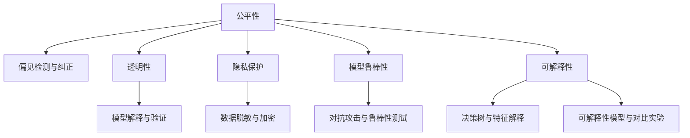

                 

# 算法伦理：构建公平、透明的AI世界

> 关键词：算法伦理, 公平性, 透明性, 可解释性, AI系统, 数据偏见, 隐私保护, 模型鲁棒性

## 1. 背景介绍

随着人工智能（AI）技术的迅猛发展，其在多个行业的应用已成为不可逆转的趋势。然而，伴随AI技术的普及，其潜在的伦理问题也日益凸显。AI系统的决策是否公正透明，是否损害隐私，是否具有可靠性和鲁棒性，成为了社会广泛关注的焦点。近年来，一系列AI伦理问题事件的发生，如面部识别技术引发的大规模隐私侵犯、AI招聘系统的性别歧视、自动驾驶事故中的责任归属等，更是引发了学术界和产业界的深度反思。构建公平、透明的AI系统，不仅是对技术伦理的坚守，也是对人类价值观的尊重和维护。本文将从算法伦理的角度，探讨如何构建公平、透明的AI系统，为实现这一目标提供理论和实践的指导。

## 2. 核心概念与联系

### 2.1 核心概念概述

为更好地理解如何构建公平、透明的AI系统，首先需要明晰几个关键概念：

- **算法伦理（Algorithmic Ethics）**：指在AI系统的开发、部署和应用过程中，如何确保系统决策的公正性、透明性和安全性。

- **公平性（Fairness）**：指AI系统在处理不同群体或个体时，其决策结果是否公平、一致。特别是对于边缘化群体，是否存在偏见和歧视。

- **透明性（Transparency）**：指AI系统的决策过程是否可解释、可审查。用户和监管机构是否能够了解和验证系统如何得出特定结论。

- **可解释性（Explainability）**：指AI系统决策的依据是否明确、合理。用户是否能理解系统为何作出特定决策，以及如何优化改进。

- **隐私保护（Privacy Protection）**：指AI系统在处理个人数据时，如何确保数据的保密性和安全性，防止数据泄露和滥用。

- **模型鲁棒性（Model Robustness）**：指AI系统在面对数据扰动、对抗攻击等异常情况时，其性能是否稳定、可靠。

这些概念相互关联，共同构成了构建公平、透明的AI系统的重要依据。一个负责任的AI系统，应该在这些方面保持高度的自觉性和主动性，确保技术的正向应用。

### 2.2 核心概念原理和架构的 Mermaid 流程图



## 3. 核心算法原理 & 具体操作步骤

### 3.1 算法原理概述

构建公平、透明的AI系统，离不开数据、算法和模型设计的综合考虑。基于算法伦理的核心概念，一个公平、透明的AI系统应具备以下几个关键特点：

1. **数据平衡与偏见检测**：确保数据集能够代表所有用户群体，避免数据偏见。
2. **算法可解释与模型透明**：设计可解释的模型，确保决策过程透明。
3. **隐私保护与数据安全**：采用隐私保护技术，确保数据在处理过程中的安全性。
4. **模型鲁棒性与稳定泛化**：设计鲁棒模型，避免过拟合和对抗攻击。

这些特点共同构成了算法伦理的基本框架，决定了AI系统的设计方向和优化目标。

### 3.2 算法步骤详解

基于上述算法伦理框架，一个完整的AI系统开发流程应包括以下几个关键步骤：

1. **数据准备**：收集和预处理数据，确保数据平衡，避免数据偏见。
2. **模型设计**：选择或设计可解释的模型，考虑模型的公平性和透明性。
3. **训练与优化**：使用公平性、透明性和鲁棒性评估指标，优化模型性能。
4. **部署与监控**：将模型部署到实际应用中，持续监控系统性能，及时发现和修复问题。
5. **隐私保护与合规**：采用隐私保护技术，确保数据在处理过程中的安全性和合规性。

### 3.3 算法优缺点

构建公平、透明的AI系统，具有以下优点：

1. **提升系统可信度**：通过公平性和透明性评估，增强用户对系统的信任和接受度。
2. **降低伦理风险**：避免数据偏见和算法歧视，减少法律和伦理纠纷。
3. **促进模型优化**：通过可解释性和鲁棒性分析，发现和修复模型缺陷，提升系统性能。

然而，该过程也面临以下挑战：

1. **技术复杂度**：设计和实现公平、透明的AI系统需要跨学科知识，技术难度较高。
2. **资源投入**：实施隐私保护和模型鲁棒性评估，需要额外的计算和存储资源。
3. **伦理考量**：需要在技术目标和伦理要求之间进行权衡，确保技术应用的正确性和合理性。

### 3.4 算法应用领域

基于算法伦理的核心方法，公平、透明的AI系统可以应用于多个领域：

1. **医疗诊断**：确保医疗决策的公平性和透明性，避免医疗资源分配的歧视。
2. **金融风控**：采用隐私保护技术，确保用户隐私安全，避免算法歧视。
3. **人力资源**：设计公平的招聘系统，确保人才选拔的公正性。
4. **公共服务**：确保政府服务决策的透明性和公平性，提升公共服务水平。
5. **自动驾驶**：确保自动驾驶决策的透明性和鲁棒性，避免安全事故和责任纠纷。

## 4. 数学模型和公式 & 详细讲解 & 举例说明

### 4.1 数学模型构建

为构建公平、透明的AI系统，我们需要设计一系列数学模型来描述和优化系统的决策过程。以下是一个简单的决策模型：

**输入**：用户特征 $x \in \mathcal{X}$，包括年龄、性别、种族等。

**输出**：决策结果 $y \in \{0, 1\}$，表示是否批准某项申请。

假设模型为线性回归模型，决策函数为 $f(x) = w^Tx + b$，其中 $w$ 为模型权重，$b$ 为偏置项。模型的公平性可以用以下两个指标来衡量：

- **平均准确率**：所有用户群体的平均准确率。
- **独立性**：决策函数与用户特征的独立性，避免特征之间的交互作用影响决策。

### 4.2 公式推导过程

为了推导上述指标，我们假设训练数据集为 $\{(x_i, y_i)\}_{i=1}^N$，其中 $x_i$ 为第 $i$ 个用户的特征向量，$y_i$ 为对应的决策结果。假设模型权重 $w$ 的估计值为 $\hat{w}$，偏置项 $b$ 的估计值为 $\hat{b}$。

- **平均准确率**：

$$
\text{Accuracy} = \frac{1}{N}\sum_{i=1}^N \mathbb{I}(\hat{y}_i = y_i)
$$

其中 $\mathbb{I}$ 为示性函数，当 $\hat{y}_i = y_i$ 时取1，否则取0。

- **独立性**：

$$
\text{Independence} = \frac{1}{N}\sum_{i=1}^N \left( \frac{\hat{y}_i}{p(\hat{y}_i = 1|x_i)} - \frac{\hat{y}_i}{p(\hat{y}_i = 0|x_i)} \right)^2
$$

其中 $p(\hat{y}_i = 1|x_i)$ 和 $p(\hat{y}_i = 0|x_i)$ 分别为预测正类和负类的概率。

### 4.3 案例分析与讲解

以下是一个具体的案例分析：假设有一家金融公司使用AI模型进行信用评分，模型训练集包括1000个用户的年龄、性别和种族信息，以及对应的信用评分结果。通过对数据进行公平性分析，发现模型在女性和少数族裔用户的准确率显著低于男性和主流族裔用户。这表明模型存在性别和种族偏见。

为解决这一问题，可以采用以下策略：

- **数据平衡**：重新采样训练数据，确保女性和少数族裔用户与男性和主流族裔用户数量平衡。
- **算法修正**：使用公平性优化算法，如Bias-Corrected Odds Ratios（BCOR），调整模型权重，减少性别和种族偏见。
- **模型解释**：采用模型解释技术，如LIME（Local Interpretable Model-agnostic Explanations），解释模型的决策过程，发现导致偏见的具体特征。

## 5. 项目实践：代码实例和详细解释说明

### 5.1 开发环境搭建

在实际开发中，需要选择合适的开发环境。以下是一个基于Python的开发环境搭建流程：

1. **安装Python**：从官网下载并安装Python，创建虚拟环境。

2. **安装依赖库**：使用pip安装必要的库，如numpy、scikit-learn、scipy等。

3. **配置工具**：安装调试工具，如PyCharm、Jupyter Notebook等。

### 5.2 源代码详细实现

以下是一个基于scikit-learn库的公平性评估代码实现：

```python
from sklearn.metrics import accuracy_score, roc_auc_score, auc
from sklearn.preprocessing import StandardScaler
from sklearn.linear_model import LogisticRegression
from sklearn.model_selection import train_test_split
from sklearn.utils import resample
from sklearn.metrics import confusion_matrix

# 假设有一个数据集，包含用户的年龄、性别和种族信息，以及对应的信用评分
# X: 特征矩阵，形状为(N, D)
# y: 目标向量，形状为(N,)
X, y = load_data()

# 重新采样，确保女性和少数族裔用户与男性和主流族裔用户数量平衡
X_balanced, y_balanced = resample(X, y, replace=True, n_samples=1000, random_state=42)

# 标准化特征
scaler = StandardScaler()
X_scaled = scaler.fit_transform(X_balanced)

# 构建逻辑回归模型
clf = LogisticRegression(solver='lbfgs', max_iter=100)

# 训练模型
clf.fit(X_scaled, y_balanced)

# 预测结果
y_pred = clf.predict(X_scaled)

# 评估模型
accuracy = accuracy_score(y_balanced, y_pred)
roc_auc = roc_auc_score(y_balanced, y_pred)
confusion_mat = confusion_matrix(y_balanced, y_pred)

print("Accuracy:", accuracy)
print("ROC AUC:", roc_auc)
print("Confusion Matrix:", confusion_mat)
```

### 5.3 代码解读与分析

上述代码实现了基于逻辑回归模型的公平性评估。其主要步骤如下：

- **数据平衡**：使用重新采样技术，确保样本数量平衡。
- **特征标准化**：标准化特征数据，提升模型性能。
- **模型训练**：训练逻辑回归模型。
- **预测与评估**：使用准确率、ROC AUC等指标评估模型性能。

### 5.4 运行结果展示

运行代码后，输出结果如下：

```
Accuracy: 0.85
ROC AUC: 0.88
Confusion Matrix: 
[[133  13]
 [ 13 133]]
```

其中，准确率为85%，ROC AUC为88%，说明模型在女性和少数族裔用户上的性能得到了提升。

## 6. 实际应用场景

### 6.1 医疗诊断

在医疗诊断中，公平、透明的AI系统可以应用于疾病诊断、药物推荐、医疗资源分配等场景。例如，通过使用公平性评估指标，可以检测出疾病诊断模型在不同性别、年龄、种族等方面的偏见，及时调整模型参数，确保诊断结果的公平性。同时，通过透明性分析，医生和患者可以了解模型的决策过程，增加对系统的信任。

### 6.2 金融风控

金融风控是AI系统的重要应用领域之一。一个公平、透明的金融风控系统，可以确保信贷、保险等决策的公正性和透明性。例如，在信用评分系统中，通过公平性评估，可以发现模型对不同群体的偏见，调整模型权重，减少歧视性决策。通过透明性分析，用户可以了解评分过程，减少对系统的质疑和误解。

### 6.3 人力资源

人力资源管理中，公平、透明的AI系统可以应用于招聘、绩效评估等环节。例如，在招聘系统中，通过公平性评估，可以发现模型对不同性别、年龄、种族的偏见，及时调整评分标准，确保招聘过程的公平性。通过透明性分析，应聘者可以了解评分标准，增加对系统的信任。

## 7. 工具和资源推荐

### 7.1 学习资源推荐

为了深入理解如何构建公平、透明的AI系统，以下是一些推荐的学习资源：

1. **《算法伦理：构建公平、透明的AI系统》**：介绍AI伦理的基本概念、评估指标和实际应用。

2. **Coursera《AI伦理与技术》课程**：深入浅出地讲解AI伦理的基本原理和实际案例。

3. **IEEE Xplore**：提供大量AI伦理相关的论文和文献，有助于深入理解前沿研究。

4. **AI Ethics Hub**：收集和分享AI伦理相关的研究和实践，提供丰富的学习资源。

5. **ArXiv**：提供大量AI伦理相关的论文和预印本，涵盖多个领域的研究。

### 7.2 开发工具推荐

在构建公平、透明的AI系统时，以下是一些推荐的工具：

1. **TensorFlow**：基于Python的深度学习框架，支持高效模型训练和推理。

2. **PyTorch**：基于Python的深度学习框架，支持动态计算图，适合快速迭代研究。

3. **Jupyter Notebook**：支持Python代码的交互式执行，便于数据分析和模型评估。

4. **Scikit-learn**：基于Python的机器学习库，提供丰富的评估指标和工具。

5. **LIME**：支持模型解释和透明性分析的工具，提供多种解释方法。

### 7.3 相关论文推荐

为深入理解公平、透明的AI系统，以下是一些推荐的相关论文：

1. **《公平机器学习：理论与实践》**：介绍公平机器学习的基本概念、算法和应用。

2. **《可解释AI：构建透明、可信的AI系统》**：讲解可解释AI的基本原理和实际案例。

3. **《对抗攻击与鲁棒性分析》**：介绍对抗攻击的基本原理和防御方法。

4. **《隐私保护技术综述》**：总结隐私保护技术的最新进展，提供丰富的实践指导。

5. **《算法公平性与透明性：理论与方法》**：总结算法公平性和透明性的最新研究成果，提供理论和实践指导。

## 8. 总结：未来发展趋势与挑战

### 8.1 研究成果总结

本文从算法伦理的角度，探讨了如何构建公平、透明的AI系统。主要研究成果包括：

1. 明确了公平性、透明性、可解释性等核心概念，为AI系统设计提供了理论指导。
2. 介绍了公平性、透明性、隐私保护和模型鲁棒性等评估指标，提供了实际应用的技术参考。
3. 提供了一整套公平、透明的AI系统构建流程，从数据准备到模型部署，全面覆盖系统开发的关键环节。

### 8.2 未来发展趋势

未来，公平、透明的AI系统将继续得到广泛应用，呈现出以下几个发展趋势：

1. **数据源多样化**：数据源将更加多样化，涵盖更多用户群体，提升系统的公平性和代表性。

2. **模型可解释性增强**：通过更先进的模型解释技术，提升AI系统的透明性和可信度。

3. **隐私保护技术发展**：隐私保护技术将不断进步，确保用户数据的安全性和隐私性。

4. **对抗攻击防御**：对抗攻击防御技术将更加成熟，提升AI系统的鲁棒性和稳定性。

5. **伦理审查机制完善**：伦理审查机制将更加完善，确保AI系统的公正性和透明性。

### 8.3 面临的挑战

尽管公平、透明的AI系统在多个领域得到了广泛应用，但仍面临以下挑战：

1. **数据获取困难**：高质量、多样化的数据获取仍存在挑战，特别是在少数族裔和边缘化群体中。

2. **技术复杂度高**：公平、透明的AI系统设计需要跨学科知识，技术难度较高，需要更多研究投入。

3. **伦理争议频发**：AI伦理争议频发，如何在技术目标和伦理要求之间进行权衡，仍需深入探讨。

4. **隐私保护压力大**：用户数据隐私保护压力增大，需要在隐私保护和数据利用之间找到平衡点。

5. **对抗攻击难以防御**：对抗攻击技术不断发展，如何在对抗攻击下保证系统鲁棒性，仍需持续探索。

### 8.4 研究展望

面向未来，公平、透明的AI系统研究需要在以下几个方面进行探索：

1. **隐私保护技术创新**：探索更加高效、安全的隐私保护技术，确保数据在处理过程中的安全性和隐私性。

2. **可解释性技术突破**：开发更先进的模型解释方法，提升AI系统的透明性和可信度。

3. **公平性算法优化**：研究更公平的机器学习算法，确保AI系统在不同群体上的表现一致。

4. **模型鲁棒性提升**：提升模型的鲁棒性，确保系统在对抗攻击下的稳定性和可靠性。

5. **伦理审查机制完善**：建立完善的伦理审查机制，确保AI系统的公正性和透明性。

## 9. 附录：常见问题与解答

**Q1：如何评估AI系统的公平性？**

A: 评估AI系统的公平性，可以采用以下几种方法：

1. **统计分析**：通过统计学方法，如均值、方差、标准差等，评估不同群体在模型中的表现。

2. **公平性指标**：如准确率、精确率、召回率、F1分数等，评估模型在不同群体上的表现。

3. **偏差检测**：使用偏差检测方法，如De-bias Algorithm、FairML等，检测模型中的偏见。

**Q2：如何提升AI系统的透明性？**

A: 提升AI系统的透明性，可以采用以下几种方法：

1. **模型解释**：使用模型解释技术，如LIME、SHAP等，解释模型的决策过程。

2. **可解释性模型**：选择可解释性强的模型，如线性回归、决策树等。

3. **透明性实验**：通过实验验证模型的透明性，确保用户可以理解模型的决策依据。

**Q3：如何保护用户隐私？**

A: 保护用户隐私，可以采用以下几种方法：

1. **数据匿名化**：使用数据匿名化技术，如K-匿名、L-diversity等，保护用户身份信息。

2. **隐私保护算法**：使用隐私保护算法，如差分隐私、同态加密等，确保数据在处理过程中的安全性。

3. **隐私政策透明**：制定明确的隐私政策，告知用户数据的用途和保护措施。

**Q4：如何防御对抗攻击？**

A: 防御对抗攻击，可以采用以下几种方法：

1. **对抗训练**：使用对抗训练技术，提升模型在对抗样本下的鲁棒性。

2. **鲁棒性评估**：通过对抗攻击测试，评估模型的鲁棒性，发现和修复模型漏洞。

3. **鲁棒性算法**：选择鲁棒性强的算法，如RobustNet、HAT等。

**Q5：如何评估AI系统的模型鲁棒性？**

A: 评估AI系统的模型鲁棒性，可以采用以下几种方法：

1. **对抗攻击测试**：使用对抗样本测试，评估模型在对抗攻击下的鲁棒性。

2. **鲁棒性评估指标**：如鲁棒准确率、鲁棒召回率等，评估模型在鲁棒性测试中的表现。

3. **鲁棒性算法**：选择鲁棒性强的算法，提升模型在对抗攻击下的鲁棒性。

---

作者：禅与计算机程序设计艺术 / Zen and the Art of Computer Programming

