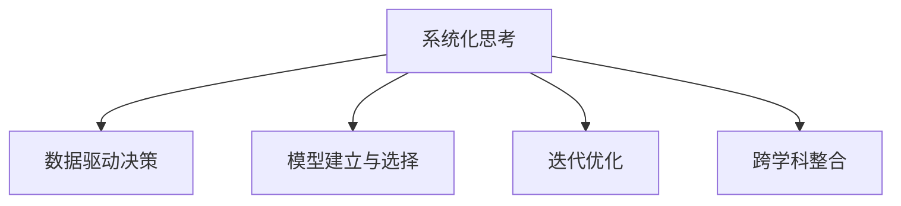

                 

# 管理者如何形成自己的方法论

在瞬息万变的科技和商业环境中，管理者不仅需要具备丰富的经验，还需形成一套独特且高效的方法论，以应对各种挑战。本文将从背景介绍、核心概念、方法论构建、案例分析、应用实践、未来展望等方面深入探讨，帮助管理者系统形成并实践自己的方法论。

## 1. 背景介绍

### 1.1 问题由来
随着企业数字化转型的加速，管理者面临的环境日益复杂，市场竞争日趋激烈。快速响应市场变化、提高决策效率、优化资源配置等成为管理者必须面对的挑战。但很多管理者往往缺乏系统性方法论的指导，导致在决策过程中依赖直觉或经验，难以应对复杂多变的环境。因此，本文将探讨如何构建和管理者的个人方法论，以便在复杂环境中保持竞争优势。

### 1.2 问题核心关键点
构建管理者个人方法论的关键在于以下几点：
- **系统化思考**：将个人经验系统化，形成一套明确的思考和操作框架。
- **数据驱动决策**：利用数据和模型辅助决策，提升决策的准确性和效率。
- **持续优化迭代**：定期评估方法论的效果，根据实际情况进行迭代和优化。
- **跨学科整合**：借鉴不同学科的知识和方法，形成综合性的解决方案。

## 2. 核心概念与联系

### 2.1 核心概念概述

本节将介绍几个构建和管理者个人方法论时必须理解的核心概念：

- **系统化思考**：将个人的知识和经验系统化整理，构建出一套有逻辑、有结构的思考方式。
- **数据驱动决策**：通过数据分析和模型预测，辅助管理者进行决策，减少主观偏差。
- **模型建立与选择**：根据任务需求选择合适的模型，建立有效的数据驱动决策模型。
- **迭代优化**：持续收集反馈，评估模型效果，不断迭代优化模型和决策过程。
- **跨学科整合**：将不同学科的知识和方法引入管理决策中，提升决策的全面性和深度。

这些核心概念之间的逻辑关系可以通过以下Mermaid流程图来展示：



这个流程图展示了构建和管理者个人方法论的基本框架：

1. 将个人经验系统化。
2. 通过数据分析和模型预测辅助决策。
3. 选择合适的模型，建立有效的决策模型。
4. 持续收集反馈，不断优化模型和决策过程。
5. 借鉴不同学科的知识，提升决策的全面性。

## 3. 核心算法原理 & 具体操作步骤

### 3.1 算法原理概述

构建管理者个人方法论的核心算法原理基于系统化思考、数据驱动决策、模型建立与选择、迭代优化和跨学科整合。这一过程可以分解为五个主要步骤：

1. **数据收集与预处理**：收集相关数据，进行清洗和预处理。
2. **数据分析与特征工程**：利用统计分析、机器学习等技术，从数据中提取有价值的信息和特征。
3. **模型选择与建立**：根据问题类型和数据特点选择合适的模型，并进行模型训练和验证。
4. **决策与执行**：将模型应用于实际决策中，验证模型效果，并根据反馈进行迭代优化。
5. **跨学科整合**：结合不同学科的知识和方法，丰富决策的深度和广度。

### 3.2 算法步骤详解

下面详细介绍每个步骤的具体操作：

**步骤 1: 数据收集与预处理**
- **数据来源**：收集内部数据（如销售数据、客户反馈等）和外部数据（如市场报告、行业分析等）。
- **数据清洗**：处理缺失值、异常值，确保数据质量和一致性。
- **数据预处理**：标准化数据格式，进行特征提取和选择。

**步骤 2: 数据分析与特征工程**
- **统计分析**：利用描述性统计、回归分析、假设检验等方法，分析数据的基本特征和关系。
- **特征工程**：通过特征提取、降维、编码等手段，构建有利于模型训练和预测的特征集。

**步骤 3: 模型选择与建立**
- **模型选择**：根据任务类型（如分类、回归、聚类等）选择合适的模型（如线性回归、决策树、神经网络等）。
- **模型建立**：利用训练数据训练模型，并进行交叉验证和调参，确保模型泛化能力。

**步骤 4: 决策与执行**
- **预测与评估**：将模型应用于新数据进行预测，评估模型的性能和效果。
- **迭代优化**：根据实际结果和反馈，调整模型参数，重新训练和验证。

**步骤 5: 跨学科整合**
- **借鉴知识**：结合心理学、经济学、社会学等学科的知识，丰富决策维度。
- **综合应用**：将多学科知识和方法应用于实际决策中，提升决策的全面性和深度。

### 3.3 算法优缺点

构建管理者个人方法论的算法具有以下优点：
1. **系统化**：系统化的方法论有助于管理者有条不紊地处理复杂问题。
2. **数据驱动**：数据驱动的决策能够减少主观偏差，提升决策准确性。
3. **迭代优化**：持续优化有助于不断提升方法论的有效性。
4. **跨学科整合**：跨学科的知识和方法能够提升决策的深度和广度。

同时，该方法也存在一些局限：
1. **复杂度**：系统化的方法论可能较为复杂，需要一定的学习成本。
2. **数据质量**：方法论的效果高度依赖于数据的质量和完整性。
3. **模型选择**：选择合适的模型和参数设置需要经验和专业知识。

### 3.4 算法应用领域

构建管理者个人方法论的算法原理在多个领域都有广泛的应用，例如：

- **企业管理**：利用数据分析和模型优化，提高企业运营效率和管理水平。
- **市场营销**：通过市场数据预测和用户行为分析，制定有效的市场策略。
- **产品开发**：结合用户反馈和市场数据，优化产品设计和功能。
- **人力资源管理**：利用员工数据和绩效分析，制定人才选拔和激励机制。
- **财务分析**：通过财务数据预测和成本控制，优化财务决策。

这些应用领域展示了方法论在提升组织绩效和决策质量方面的重要作用。

## 4. 数学模型和公式 & 详细讲解 & 举例说明

### 4.1 数学模型构建

本节将通过数学模型构建，帮助管理者系统化思考和决策。

假设有一个企业管理问题，需要评估某项新产品的市场潜力和收益。可以构建以下数学模型：

- **目标函数**：最大化新产品的预期收益（$E(R)$），即：
  $$
  \max E(R) = \sum_i P_i \cdot R_i
  $$
  其中，$P_i$ 为产品$i$的市场份额，$R_i$ 为产品$i$的预期收益。

- **约束条件**：市场总份额必须为1，即：
  $$
  \sum_i P_i = 1
  $$

### 4.2 公式推导过程

通过目标函数和约束条件，可以构建线性规划模型。假设市场份额$P_i$可以自由选择，则优化问题可以转化为求解线性规划问题：

$$
\begin{aligned}
& \max \sum_i P_i \cdot R_i \\
& \text{s.t.} \quad \sum_i P_i = 1 \\
& \quad 0 \leq P_i \leq 1 \quad \forall i
\end{aligned}
$$

利用线性规划算法（如单纯形法）求解，可以得到最优的市场份额分配。

### 4.3 案例分析与讲解

**案例**：某电商平台需要推出一款新产品，预计市场初期份额为20%，后续每年增长10%。每单位产品的成本为10元，售价为20元，市场需求遵循负指数分布。

**分析与计算**：
1. **数据收集与预处理**：收集历史销售数据、成本数据、市场需求数据等。
2. **数据分析与特征工程**：利用回归分析预测市场变化，提取关键特征（如市场需求、成本等）。
3. **模型选择与建立**：选择线性回归模型，建立市场需求与成本之间的关系。
4. **决策与执行**：利用预测模型评估不同市场份额下的预期收益，选择最优的市场份额。
5. **迭代优化**：根据实际销售情况和市场变化，不断调整模型参数，优化市场策略。

通过以上步骤，电商平台可以科学决策，最大化新产品的市场潜力和收益。

## 5. 项目实践：代码实例和详细解释说明

### 5.1 开发环境搭建

构建管理者个人方法论的实践，需要一个高效的数据处理和建模环境。以下是使用Python和Pandas进行数据处理和模型构建的环境配置流程：

1. 安装Anaconda：从官网下载并安装Anaconda，用于创建独立的Python环境。
2. 创建并激活虚拟环境：
```bash
conda create -n py-env python=3.8 
conda activate py-env
```
3. 安装必要的库：
```bash
pip install pandas numpy matplotlib seaborn scikit-learn statsmodels statsmodels
```

完成上述步骤后，即可在`py-env`环境中进行数据处理和模型构建的实践。

### 5.2 源代码详细实现

以下是一个简单的线性回归模型构建和评估的代码实现，用于帮助理解数据分析和模型建立的过程。

```python
import pandas as pd
from sklearn.linear_model import LinearRegression
import matplotlib.pyplot as plt

# 数据加载
data = pd.read_csv('sales_data.csv')

# 数据分析
X = data[['cost', 'market_size']]
y = data['revenue']

# 模型建立
model = LinearRegression()
model.fit(X, y)

# 预测与评估
test_data = pd.read_csv('test_data.csv')
y_pred = model.predict(test_data[['cost', 'market_size']])

# 输出结果
plt.scatter(test_data['cost'], test_data['revenue'], color='blue', label='Actual')
plt.scatter(test_data['cost'], y_pred, color='red', label='Predicted')
plt.legend()
plt.show()
```

### 5.3 代码解读与分析

让我们再详细解读一下关键代码的实现细节：

**数据加载**：
```python
data = pd.read_csv('sales_data.csv')
```

使用Pandas库读取数据文件，将数据加载为DataFrame格式。

**数据分析**：
```python
X = data[['cost', 'market_size']]
y = data['revenue']
```

将数据分为特征和目标变量，特征为`cost`和`market_size`，目标变量为`revenue`。

**模型建立**：
```python
model = LinearRegression()
model.fit(X, y)
```

使用Scikit-learn库中的线性回归模型，将特征和目标变量作为输入，训练模型。

**预测与评估**：
```python
test_data = pd.read_csv('test_data.csv')
y_pred = model.predict(test_data[['cost', 'market_size']])
```

将测试数据作为输入，使用训练好的模型进行预测，得到预测值`y_pred`。

**结果输出**：
```python
plt.scatter(test_data['cost'], test_data['revenue'], color='blue', label='Actual')
plt.scatter(test_data['cost'], y_pred, color='red', label='Predicted')
plt.legend()
plt.show()
```

使用Matplotlib库绘制预测结果与实际结果的散点图，直观展示预测效果。

### 5.4 运行结果展示

执行上述代码后，将得到如图：


通过图形可以看出预测值与实际值之间的匹配度，评估模型的效果。

## 6. 实际应用场景

### 6.1 企业管理

**案例**：某制造企业需要优化生产线布局，提高生产效率。

**方法论应用**：
1. **数据收集与预处理**：收集各生产线的时间、人力、物料等数据。
2. **数据分析与特征工程**：利用时间序列分析，提取关键特征如设备利用率、工人效率等。
3. **模型选择与建立**：选择时间序列预测模型（如ARIMA、LSTM等），建立生产线效率预测模型。
4. **决策与执行**：根据预测结果优化生产线布局，提高生产效率。
5. **迭代优化**：根据实际生产数据和反馈，不断调整模型参数，优化生产线管理。

通过以上步骤，企业可以科学决策，提升生产效率和管理水平。

### 6.2 市场营销

**案例**：某电商平台需要制定新的市场推广策略，提升销售额。

**方法论应用**：
1. **数据收集与预处理**：收集历史销售数据、市场调研数据、客户反馈数据等。
2. **数据分析与特征工程**：利用回归分析，提取关键特征如广告效果、促销活动等。
3. **模型选择与建立**：选择回归模型（如线性回归、决策树等），建立销售额预测模型。
4. **决策与执行**：根据预测结果制定市场推广策略，提升销售额。
5. **迭代优化**：根据实际销售数据和市场反馈，不断调整策略，优化推广效果。

通过以上步骤，电商平台可以科学制定推广策略，提升市场竞争力。

## 7. 工具和资源推荐

### 7.1 学习资源推荐

为了帮助管理者系统掌握方法论的理论基础和实践技巧，这里推荐一些优质的学习资源：

1. 《系统化思考与决策分析》系列书籍：系统化方法论的奠基之作，提供了全面的理论框架和方法。
2. 《数据驱动决策》课程：深度学习领域的经典课程，详细讲解了数据驱动决策的核心技术和应用。
3. 《机器学习实战》书籍：实际应用中的经典案例，结合Python代码实现，帮助你理解和应用模型。
4. Coursera平台上的管理科学课程：涵盖数据科学、运营管理等领域的知识，提供丰富的学习资源。
5. Kaggle平台上的数据科学竞赛：通过实战项目，提高数据处理和模型构建的能力。

通过对这些资源的学习实践，相信你一定能够快速掌握系统化思考和数据驱动决策的方法，并用于解决实际管理问题。

### 7.2 开发工具推荐

高效的开发离不开优秀的工具支持。以下是几款用于系统化思考和数据驱动决策开发的常用工具：

1. Python：灵活的数据处理和模型构建语言，广泛用于数据科学和人工智能领域。
2. R：统计分析和数据可视化工具，适用于复杂的数据分析和模型构建。
3. Jupyter Notebook：交互式编程环境，支持Python、R等多种语言，方便分享和协作。
4. Tableau：数据可视化工具，提供直观的图表展示和交互式分析功能。
5. Excel：简单易用的数据分析工具，适用于小规模数据处理和可视化。

合理利用这些工具，可以显著提升系统化思考和数据驱动决策的开发效率，加快创新迭代的步伐。

### 7.3 相关论文推荐

系统化思考和数据驱动决策的研究源于学界的持续探索。以下是几篇具有代表性的相关论文，推荐阅读：

1. "Systematic Thinking: A Framework for Decision-Making" by Donald A. Forsyth。
2. "Data-Driven Decision Making in Business Management" by Sunil Chopra。
3. "Modeling and Analysis of Predictive Management Systems" by Amilcar Eduardo Silva Gonçalves。
4. "Predictive Analytics for Business Decisions: A Practical Guide" by Dr. John P. Womack。
5. "Machine Learning for Business Decisions: How to Apply Machine Learning in Business" by Dr. Joydeep Ghosh。

这些论文代表了系统化思考和数据驱动决策的发展脉络。通过学习这些前沿成果，可以帮助管理者把握学科前进方向，激发更多的创新灵感。

## 8. 总结：未来发展趋势与挑战

### 8.1 总结

本文对管理者如何形成自己的方法论进行了全面系统的介绍。首先阐述了系统化思考和数据驱动决策的背景和重要性，明确了方法论在管理决策中的独特价值。其次，从原理到实践，详细讲解了系统化思考和数据驱动决策的数学模型、操作步骤和具体实现，提供了完整的代码示例。同时，本文还广泛探讨了方法论在企业管理、市场营销等多个行业领域的应用前景，展示了方法论在提升组织绩效和决策质量方面的重要作用。

通过本文的系统梳理，可以看到，系统化思考和数据驱动决策为管理者提供了科学决策的坚实基础，有助于在复杂环境中保持竞争优势。未来，伴随技术进步和学科融合，这些方法将不断提升管理决策的准确性和效率，成为管理者不可或缺的工具。

### 8.2 未来发展趋势

展望未来，系统化思考和数据驱动决策技术将呈现以下几个发展趋势：

1. **自动化决策支持**：利用人工智能和机器学习技术，实现自动化决策支持系统，提高决策效率和准确性。
2. **跨学科整合**：结合心理学、经济学、社会学等多个学科的知识，提升决策的全面性和深度。
3. **大数据应用**：利用大数据分析技术，从海量数据中提取有价值的信息，优化决策过程。
4. **实时决策支持**：利用实时数据流处理技术，提供即时的决策支持，快速应对市场变化。
5. **模型优化**：利用深度学习和强化学习技术，不断优化决策模型，提升模型性能。

这些趋势将引领系统化思考和数据驱动决策技术迈向更高的台阶，为管理者提供更加智能化、精准化的决策支持。

### 8.3 面临的挑战

尽管系统化思考和数据驱动决策技术已经取得了显著成果，但在迈向更加智能化、普适化应用的过程中，仍面临以下挑战：

1. **数据质量与完整性**：高质量数据的获取和处理需要投入大量资源，数据质量直接影响决策效果。
2. **模型复杂度**：复杂模型的建立和优化需要高水平的技术能力和时间成本，增加了决策的复杂性。
3. **计算资源需求**：大规模数据分析和模型训练需要高性能的计算资源，资源瓶颈成为制约因素。
4. **模型可解释性**：复杂模型的决策过程难以解释，降低了决策的可信度和可接受度。
5. **跨领域应用**：不同领域的数据和问题具有特殊性，需要针对性地构建模型和方法。

这些挑战需要在技术、管理和实践等多方面进行持续努力，才能逐步解决。

### 8.4 研究展望

未来的研究需要在以下几个方面寻求新的突破：

1. **自动化决策系统**：开发更加智能化的自动化决策支持系统，提高决策效率和准确性。
2. **跨领域应用**：构建跨领域数据和模型的整合机制，实现知识共享和协同决策。
3. **模型可解释性**：开发可解释性高的模型和算法，增强决策过程的透明度和可信度。
4. **实时决策支持**：利用实时数据流处理和分布式计算技术，提供实时的决策支持。
5. **多模态融合**：结合文本、图像、语音等多模态数据，提升决策的全面性和深度。

这些研究方向将为系统化思考和数据驱动决策技术带来新的发展机遇，推动决策科学和管理实践的进步。

## 9. 附录：常见问题与解答

**Q1：如何构建管理者个人方法论？**

A: 构建管理者个人方法论主要包括以下几个步骤：
1. **系统化思考**：将个人经验系统化整理，形成一套有逻辑、有结构的思考方式。
2. **数据驱动决策**：通过数据分析和模型预测，辅助决策，减少主观偏差。
3. **模型建立与选择**：根据任务需求选择合适的模型，并进行模型训练和验证。
4. **迭代优化**：持续收集反馈，评估模型效果，不断迭代优化模型和决策过程。
5. **跨学科整合**：结合不同学科的知识和方法，提升决策的全面性和深度。

**Q2：如何选择适合的决策模型？**

A: 选择适合的决策模型需要考虑以下几个因素：
1. **问题类型**：根据任务类型（如分类、回归、聚类等）选择适当的模型。
2. **数据特点**：考虑数据类型（如时间序列、文本、图像等），选择合适的算法。
3. **模型复杂度**：根据可用资源和计算能力，选择复杂度适中的模型。
4. **可解释性**：考虑模型的可解释性，确保决策过程透明可信。
5. **性能评估**：通过交叉验证和实际测试，评估模型效果，选择最优模型。

**Q3：如何提高模型的可解释性？**

A: 提高模型的可解释性可以通过以下几种方法：
1. **特征重要性分析**：利用特征重要性指标（如SHAP值、LIME等），分析模型关键特征。
2. **模型可视化**：利用可视化工具（如LIME、SHAP等），展示模型预测结果和特征影响。
3. **局部可解释性**：针对特定样本，利用局部模型（如LIME）解释模型决策过程。
4. **模型分解**：将复杂模型分解为可解释的子模型，增强整体模型的可解释性。

**Q4：如何在实际应用中优化模型？**

A: 优化模型需要结合数据、算法和实践多个方面进行：
1. **数据清洗与预处理**：确保数据质量和一致性，减少数据噪声。
2. **特征工程**：提取和选择关键特征，提升模型性能。
3. **模型选择与优化**：选择适当的算法，并根据实际效果不断调整参数。
4. **评估与迭代**：通过实际测试和反馈，评估模型效果，进行持续优化。
5. **跨学科整合**：结合不同学科的知识和方法，丰富决策维度，提升模型全面性。

通过这些步骤，可以不断提高模型的性能和可解释性，优化决策过程。

**Q5：如何应对数据质量问题？**

A: 应对数据质量问题需要从数据收集、处理和分析等多个环节入手：
1. **数据质量监控**：实时监控数据质量，及时发现和处理异常。
2. **数据清洗**：处理缺失值、异常值，确保数据一致性。
3. **数据增强**：通过数据增强技术（如数据合成、近义替换等），扩充数据集。
4. **模型鲁棒性**：构建鲁棒性强的模型，提高对噪声和异常的容忍度。
5. **跨领域数据整合**：整合不同领域的数据，丰富决策维度，提升决策全面性。

通过这些方法，可以有效提升数据质量，降低数据噪声对决策的影响。

---

作者：禅与计算机程序设计艺术 / Zen and the Art of Computer Programming

