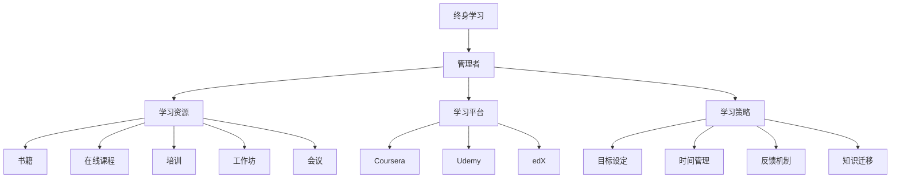

                 

# 管理者终身学习的重要性与方法

## 1. 背景介绍

### 1.1 问题由来
当今世界正在经历前所未有的变化，技术创新、市场竞争、消费者需求等诸多因素共同推动着商业环境的快速演进。管理者作为企业的中流砥柱，必须具备不断学习和适应新环境的意识与能力，才能在激烈的市场竞争中占据优势，引领企业走向成功。然而，许多管理者往往难以跟上时代的步伐，导致企业竞争力下降，甚至陷入困境。因此，本文旨在探讨管理者终身学习的重要性与方法，帮助管理者在快速变化的环境中不断提升自我，推动企业发展。

### 1.2 问题核心关键点
管理者终身学习的重要性在于其能够不断提升个人能力，增强企业竞争力。具体而言，管理者通过持续学习，可以：

- 掌握最新管理理念和方法，提高决策水平。
- 提升领导力与团队管理能力，增强团队凝聚力和执行力。
- 拓展视野，了解行业趋势，制定更为前瞻的战略。
- 增强创新能力，推动企业转型升级。
- 改进人际关系处理技巧，建立和谐的工作环境。

面对复杂多变的商业环境，管理者终身学习已成为企业成功的关键因素之一。本文将从终身学习的定义、重要性、方法以及面临的挑战等方面，全面系统地探讨这一重要主题。

## 2. 核心概念与联系

### 2.1 核心概念概述

为更好地理解管理者终身学习的概念及其应用，本节将介绍几个核心概念：

- **终身学习（Lifelong Learning）**：指在职业生涯的各个阶段，通过不断学习新知识、新技能，持续提升个人和组织能力的教育理念。
- **管理者（Manager）**：指在组织中承担决策、指挥、协调、控制等职能，推动企业达成目标的职位人员。
- **学习资源（Learning Resources）**：包括书籍、在线课程、培训、工作坊、会议等，帮助管理者获取新知识和技能。
- **学习平台（Learning Platforms）**：如Coursera、Udemy、edX等，提供丰富的在线课程和学习资源，支持管理者随时随地学习。
- **学习策略（Learning Strategies）**：如目标设定、时间管理、反馈机制、知识迁移等，指导管理者有效实施学习计划。

这些核心概念之间存在紧密联系，共同构成了管理者终身学习的框架。通过理解这些概念，我们可以更好地把握管理者终身学习的重要性与方法。

### 2.2 核心概念原理和架构的 Mermaid 流程图



## 3. 核心算法原理 & 具体操作步骤

### 3.1 算法原理概述

管理者终身学习本质上是一种系统化、持续化的学习过程。其核心思想是通过不断获取新知识、新技能，更新现有知识体系，以适应不断变化的环境和需求。这一过程涉及到以下基本步骤：

1. **目标设定（Goal Setting）**：明确学习目标，制定具体、可行的计划。
2. **资源获取（Resource Acquisition）**：选择合适的学习资源，如课程、书籍、培训等。
3. **策略制定（Strategy Formulation）**：设计学习策略，如时间安排、学习路径、反馈机制等。
4. **执行与评估（Execution and Evaluation）**：按照计划执行学习活动，并定期评估学习效果。
5. **知识迁移（Knowledge Transfer）**：将学到的知识应用于实际工作中，解决实际问题。

### 3.2 算法步骤详解

管理者终身学习的具体步骤可以分为以下几个阶段：

**Step 1: 目标设定**

管理者需明确自己的学习目标，如提高某项技能、学习新的管理方法等。目标应具有SMART原则（具体、可测量、可实现、相关、时限性），确保其清晰、可行。

**Step 2: 资源获取**

选择合适的学习资源，包括书籍、在线课程、培训、工作坊等。需根据自身需求和目标，选择最合适的学习材料。

**Step 3: 策略制定**

制定学习策略，包括时间安排、学习路径、反馈机制等。需合理安排学习时间，制定阶段性学习目标，确保学习计划科学合理。

**Step 4: 执行与评估**

按照学习计划执行学习活动，定期评估学习效果，如通过测试、项目实践等方式检验学习成果。

**Step 5: 知识迁移**

将学到的知识应用于实际工作中，通过实践检验学习效果，并在实践中进一步巩固和提升。

### 3.3 算法优缺点

管理者终身学习具有以下优点：

1. **持续提升能力**：通过持续学习，管理者可以不断提升个人和组织能力，适应不断变化的环境。
2. **增强决策水平**：掌握最新管理理念和方法，提高决策水平，增强企业竞争力。
3. **促进团队发展**：提升领导力和团队管理能力，增强团队凝聚力和执行力。
4. **推动创新**：拓展视野，了解行业趋势，制定更为前瞻的战略，推动企业转型升级。
5. **改善人际关系**：改进人际关系处理技巧，建立和谐的工作环境。

然而，这一过程也面临一些挑战：

1. **时间和精力限制**：管理者日常工作繁忙，难以抽出足够时间和精力进行系统化学习。
2. **资源获取难度**：高质量的学习资源往往需要投入一定的成本，且获取途径有限。
3. **知识迁移困难**：学到的知识需要有效应用于实际工作中，这对管理者的实践能力和理解力提出了较高要求。
4. **持续性不足**：管理者在繁忙的工作中容易放弃持续学习的计划，缺乏长期坚持的动力。
5. **学习效果评估困难**：缺乏系统的评估机制，难以量化学习成果，影响学习效果的提升。

尽管存在这些挑战，但管理者终身学习仍具有重要意义和广泛应用价值。

### 3.4 算法应用领域

管理者终身学习在多个领域中得到了广泛应用，例如：

1. **人力资源管理**：通过持续学习，提升人力资源管理能力，优化人才选拔、培养和激励机制。
2. **财务管理**：学习最新的财务管理方法和工具，提高财务决策水平，增强企业盈利能力。
3. **市场营销**：掌握最新的市场营销理念和方法，提升品牌影响力和市场竞争力。
4. **供应链管理**：通过学习供应链管理的最佳实践，优化供应链流程，降低运营成本，提升效率。
5. **技术创新**：学习最新的科技趋势和技术工具，推动企业技术创新和转型升级。

这些领域的管理者通过持续学习，不断提升自我，推动企业发展，取得了显著成效。

## 4. 数学模型和公式 & 详细讲解 & 举例说明

### 4.1 数学模型构建

本节将使用数学语言对管理者终身学习的模型进行更加严格的刻画。

设管理者初始知识水平为 $K_0$，目标知识水平为 $K_T$，学习速率为 $r$，学习时间为 $t$。管理者终身学习的过程可以用以下数学模型表示：

$$
K_t = K_0 + r \cdot t
$$

其中，$K_t$ 为学习后的知识水平，$t$ 为学习时间，$r$ 为学习速率。

### 4.2 公式推导过程

对于管理者终身学习的数学模型，可以通过简单的积分来推导：

$$
K_t = K_0 + \int_0^t r \, dt
$$

通过积分，得到：

$$
K_t = K_0 + rt
$$

这表明，随着时间的推移，管理者的知识水平将线性增长，取决于初始知识水平 $K_0$、学习速率 $r$ 和学习时间 $t$。

### 4.3 案例分析与讲解

假设一位管理者初始知识水平为 $K_0 = 0$，目标知识水平为 $K_T = 100$，学习速率为 $r = 2$。则其终身学习过程可以用以下公式表示：

$$
K_t = 2t
$$

当 $t = 10$ 时，$K_t = 20$，表示在最初的 10 天里，管理者的知识水平增加了 20 分。当 $t = 50$ 时，$K_t = 100$，达到了目标知识水平。

## 5. 项目实践：代码实例和详细解释说明

### 5.1 开发环境搭建

在进行管理者终身学习实践前，我们需要准备好开发环境。以下是使用Python进行开发的流程：

1. 安装Python：从官网下载并安装Python，建议选择最新版本。
2. 安装相关库：使用pip安装Pandas、NumPy、Matplotlib等常用库，如：
```bash
pip install pandas numpy matplotlib
```
3. 配置学习平台：选择合适的学习平台，如Coursera、Udemy等，注册账号并购买课程。

### 5.2 源代码详细实现

以下是使用Python实现管理者终身学习的示例代码，展示如何设定学习目标、资源获取、策略制定和评估：

```python
import pandas as pd
import numpy as np
import matplotlib.pyplot as plt

# 定义学习模型
def learn(model_params):
    K_0, r, t_max = model_params
    K_t = K_0 + r * t_max
    return K_t

# 设定初始知识水平和目标知识水平
K_0 = 0
K_T = 100

# 设定学习速率和最大学习时间
r = 2
t_max = 50

# 计算最终知识水平
K_t = learn((K_0, r, t_max))
print(f"最终知识水平: {K_t}")

# 可视化学习过程
t_values = np.arange(0, t_max+1, 1)
K_values = np.array([learn((K_0, r, t)) for t in t_values])
plt.plot(t_values, K_values)
plt.xlabel('时间')
plt.ylabel('知识水平')
plt.title('管理者终身学习过程')
plt.show()
```

### 5.3 代码解读与分析

这段代码展示了如何通过简单的数学模型，计算管理者的终身学习过程。

1. **学习模型定义**：通过一个简单的函数 `learn`，根据初始知识水平、学习速率和最大学习时间，计算最终的知识点。
2. **参数设定**：根据问题描述，设定初始知识水平 $K_0 = 0$，目标知识水平 $K_T = 100$，学习速率 $r = 2$，最大学习时间 $t_{max} = 50$。
3. **计算和可视化**：通过计算得到最终知识水平 $K_t = 100$，并使用Matplotlib可视化学习过程。

## 6. 实际应用场景

### 6.1 企业培训与发展

管理者终身学习在企业培训和发展中具有重要应用。企业可以通过系统化的培训计划，帮助管理者不断提升自身能力，推动企业发展。例如：

- **定期培训课程**：设计定期培训课程，涵盖财务管理、人力资源管理、市场营销等领域，帮助管理者系统学习相关知识。
- **导师制度**：建立导师制度，安排经验丰富的管理者指导年轻管理者，传授实践经验和行业洞察。
- **知识共享平台**：搭建知识共享平台，鼓励管理者分享学习经验和成果，形成学习交流的良好氛围。

### 6.2 管理创新与转型

管理者终身学习能够推动企业管理创新与转型。通过持续学习，管理者可以掌握最新的管理理念和方法，推动企业发展。例如：

- **敏捷管理**：学习敏捷管理理念和方法，提升团队协作和项目交付能力。
- **数据驱动决策**：学习数据分析和数据驱动决策方法，提升企业决策水平。
- **创新管理**：学习创新管理理念，推动企业技术创新和转型升级。

### 6.3 领导力提升

管理者终身学习能够提升领导力，增强团队凝聚力和执行力。例如：

- **领导力培训**：通过领导力培训课程，提升管理者的领导力和团队管理能力。
- **情商提升**：学习情商管理技巧，增强人际关系处理能力，建立和谐的工作环境。
- **目标设定与执行**：学习目标设定和执行方法，提升团队目标一致性和执行力。

### 6.4 未来应用展望

随着技术进步和市场需求的变化，管理者终身学习将得到更广泛的应用。未来可能的发展趋势包括：

1. **线上学习平台普及**：线上学习平台的普及将为管理者提供更多灵活、便捷的学习资源，促进持续学习。
2. **个性化学习推荐**：通过智能推荐系统，根据管理者的兴趣和需求，推荐合适的学习资源。
3. **混合学习模式**：结合线上学习和线下培训，形成混合学习模式，提升学习效果。
4. **学习评估与反馈机制**：建立系统的学习评估和反馈机制，量化学习效果，提供持续改进的依据。
5. **社会化学习**：通过社交网络和社区平台，分享学习经验和成果，促进社会化学习。

## 7. 工具和资源推荐

### 7.1 学习资源推荐

以下是一些优质的学习资源，帮助管理者不断提升自我：

1. **Coursera**：提供丰富的在线课程，涵盖管理、领导力、数据分析等领域。
2. **Udemy**：提供高质量的课程和认证项目，涵盖项目管理和创新管理等方向。
3. **edX**：提供世界知名大学的课程，涵盖领导力、金融、市场营销等方向。
4. **LinkedIn Learning**：提供与职业发展相关的课程，涵盖领导力、沟通技巧、团队管理等领域。
5. **MBA课程**：通过MBA课程，系统学习管理理论和实践经验。

### 7.2 开发工具推荐

以下是一些常用的开发工具，帮助管理者有效实施学习计划：

1. **Pandas**：数据分析和处理工具，帮助管理者快速处理和分析数据。
2. **NumPy**：数学计算工具，提供高效的数学计算功能。
3. **Matplotlib**：数据可视化工具，帮助管理者直观展示学习效果。
4. **Jupyter Notebook**：交互式编程环境，支持多种语言和工具集成，方便开发者协作开发。
5. **GitHub**：代码托管平台，支持版本控制和协作开发，方便管理者共享和维护代码。

### 7.3 相关论文推荐

以下是一些重要的相关论文，帮助管理者深入理解终身学习的理论和应用：

1. **《终身学习：新经济时代的必备技能》**：探讨终身学习的理论和应用，强调其在快速变化环境中的重要性。
2. **《学习型组织：建立持续改进的文化》**：介绍学习型组织的构建方法，强调团队学习和持续改进。
3. **《敏捷管理：快速响应变化的艺术》**：介绍敏捷管理理念和方法，提升团队协作和项目交付能力。
4. **《创新管理：打造持续创新的组织》**：介绍创新管理理念，推动企业技术创新和转型升级。
5. **《情商管理：提升领导力和人际关系处理能力》**：介绍情商管理技巧，增强人际关系处理能力。

## 8. 总结：未来发展趋势与挑战

### 8.1 总结

本文对管理者终身学习的重要性与方法进行了全面系统的介绍。首先阐述了终身学习的定义及其在管理者发展中的重要意义，明确了终身学习对提升管理能力、增强企业竞争力、推动企业转型升级的关键作用。其次，从算法原理到操作步骤，详细讲解了管理者终身学习的数学模型和实践方法，给出了完整代码实现。同时，本文还探讨了终身学习在企业培训、管理创新、领导力提升等方面的实际应用，展示了其在管理领域中的广泛应用价值。最后，本文推荐了一些优质的学习资源、开发工具和相关论文，帮助管理者更好地实施终身学习计划。

通过本文的系统梳理，可以看到，管理者终身学习在当前快速变化和竞争激烈的市场环境中具有重要意义。通过持续学习，管理者可以不断提升自身能力，推动企业发展。未来，伴随技术进步和市场需求的变化，管理者终身学习必将成为企业发展的核心动力，引领企业迈向更高的发展高度。

### 8.2 未来发展趋势

展望未来，管理者终身学习将呈现以下几个发展趋势：

1. **技术驱动学习**：随着AI和机器学习技术的进步，智能推荐、数据分析等技术将广泛应用于学习平台，帮助管理者更高效地获取和利用学习资源。
2. **混合学习模式**：线上学习与线下培训相结合的混合学习模式将成为主流，帮助管理者更灵活地进行持续学习。
3. **社会化学习**：通过社交网络和社区平台，分享学习经验和成果，促进社会化学习，提升学习效果。
4. **知识整合与创新**：通过知识整合与创新，管理者能够更全面地掌握新知识和技能，推动企业发展。
5. **领导力与团队管理**：终身学习将更加注重领导力与团队管理能力的提升，帮助管理者构建高效团队，增强企业执行力。

这些趋势表明，管理者终身学习在未来将得到更广泛的应用和发展，为企业的持续发展和创新提供强大动力。

### 8.3 面临的挑战

尽管管理者终身学习具有重要意义，但在实施过程中仍面临诸多挑战：

1. **时间和精力限制**：管理者日常工作繁忙，难以抽出足够时间和精力进行系统化学习。
2. **资源获取难度**：高质量的学习资源往往需要投入一定的成本，且获取途径有限。
3. **知识迁移困难**：学到的知识需要有效应用于实际工作中，这对管理者的实践能力和理解力提出了较高要求。
4. **持续性不足**：管理者在繁忙的工作中容易放弃持续学习的计划，缺乏长期坚持的动力。
5. **学习效果评估困难**：缺乏系统的评估机制，难以量化学习成果，影响学习效果的提升。

尽管存在这些挑战，但通过科学规划和管理，管理者可以克服这些障碍，有效实施终身学习计划。

### 8.4 研究展望

面对管理者终身学习所面临的挑战，未来的研究需要在以下几个方面寻求新的突破：

1. **优化学习策略**：研究更科学、更高效的学习策略，帮助管理者更好地规划和管理学习计划。
2. **提升学习效果**：通过AI和机器学习技术，优化学习资源推荐和评估机制，提升学习效果。
3. **促进知识迁移**：研究更有效的方法，促进学到的知识在实际工作中的应用，提升知识迁移能力。
4. **建立激励机制**：建立有效的激励机制，激发管理者的持续学习动力，保障学习计划的顺利实施。
5. **推动企业文化建设**：推动企业建立学习型文化，鼓励全员学习，形成良好的学习氛围。

这些研究方向的探索，将引领管理者终身学习走向更高的层次，为构建学习型组织和企业创新提供新的思路和方法。

## 9. 附录：常见问题与解答

**Q1：管理者终身学习是否适用于所有管理者？**

A: 管理者终身学习适用于大多数管理者，尤其是那些希望提升自身能力、推动企业发展的管理者。不同级别的管理者可能面临不同的学习需求和挑战，但通过持续学习，都可以获得不同程度的提升。

**Q2：如何平衡工作与学习？**

A: 平衡工作与学习是管理者终身学习的关键问题。建议采用以下策略：
- **时间管理**：制定详细的学习计划，利用碎片时间进行学习，如通勤、午休等。
- **优先级排序**：根据工作任务和学习目标，合理安排优先级，确保学习时间不被其他事务干扰。
- **目标设定**：设定阶段性学习目标，逐步推进学习计划，保持持续学习动力。

**Q3：如何选择学习资源？**

A: 选择学习资源时应考虑以下因素：
- **相关性**：选择与自身需求和工作相关的学习资源，确保学习内容具有实际应用价值。
- **质量与可信度**：选择高质量、权威的学习资源，如知名大学、权威机构提供的课程和认证项目。
- **灵活性**：选择灵活多样的学习资源，如在线课程、书籍、培训、工作坊等，便于不同场景下的学习。

**Q4：如何评估学习效果？**

A: 评估学习效果可以采用以下方法：
- **自我评估**：通过自我反思和实践应用，评估学习效果。
- **反馈机制**：通过同事、领导和团队成员的反馈，评估学习成果。
- **考核机制**：建立系统的考核机制，量化学习成果，提供持续改进的依据。

**Q5：如何推动企业文化建设？**

A: 推动企业文化建设可以从以下方面入手：
- **领导示范**：领导层应以身作则，带头学习和分享，树立学习榜样。
- **激励机制**：建立奖励机制，激励员工积极参与学习，提升学习热情。
- **学习平台**：搭建学习平台，提供丰富的学习资源和互动机会，促进知识共享。

本文从多个方面探讨了管理者终身学习的重要性与方法，希望帮助管理者更好地应对快速变化的市场环境，推动企业持续发展。通过科学规划和管理，管理者可以不断提升自身能力，带领企业迈向更高的发展高度。

