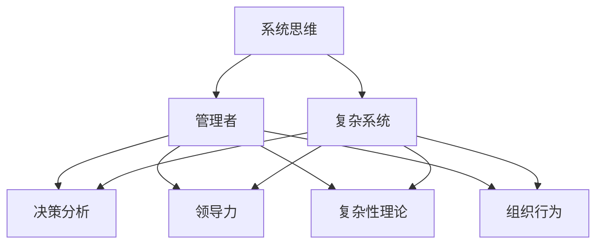

                 

# 系统思维:管理者应对复杂问题的能力

> 关键词：系统思维,复杂系统,管理者,决策分析,领导力,复杂性理论,组织行为

## 1. 背景介绍

在当今复杂多变的商业环境中，管理者面临着前所未有的挑战。企业间的竞争日趋激烈，市场变化速度加快，技术创新层出不穷，企业内部运营也需要不断优化以保持竞争力。而系统的思维方式正是应对这些复杂问题的一种有效工具。系统思维将系统看作一个整体，注重各个组成部分之间的相互作用和影响，有助于管理者识别、分析和解决问题，从而提升组织的管理效能和决策水平。

## 2. 核心概念与联系

### 2.1 核心概念概述

- **系统思维(System Thinking)**：将问题看作系统的一部分，从系统的整体性、相互关系、动态变化等方面进行思考，以找到根本的解决方案。系统思维强调全局观，关注系统各部分之间的关联与互动，通过优化系统结构来提升整体性能。

- **复杂系统(Complex System)**：指那些具有高度非线性、不确定性和多样性的系统。复杂系统常常存在多个动态因素和相互作用，难以简单地通过线性方法进行分析和预测。

- **管理者(Manager)**：组织中的关键决策者，负责监督、规划和执行组织的战略目标，维护组织的稳定和发展。管理者的决策水平直接关系到组织的表现和员工的工作积极性。

- **决策分析(Decision Analysis)**：利用数学模型和数据，对决策进行量化分析，以帮助管理者做出更为科学、合理的决策。决策分析包括成本效益分析、风险评估、数据挖掘等技术。

- **领导力(Leadership)**：管理者通过其影响力、资源配置能力和决策能力，引导和激励团队达成共同目标。领导力不仅仅是权威和命令，更是沟通、协调和激发下属潜力的过程。

- **复杂性理论(Complexity Theory)**：研究系统复杂性的学科，旨在理解和预测系统行为，特别是复杂系统的自组织和涌现现象。复杂性理论为管理者提供了分析复杂系统的方法论和理论框架。

- **组织行为(Organizational Behavior)**：研究组织中人的行为和互动方式，如何影响组织结构、流程和决策。组织行为有助于管理者洞察团队和个体行为规律，提升团队协作和领导效能。

### 2.2 核心概念联系

通过这些核心概念的链接，可以形成一个系统思维框架，帮助管理者处理复杂问题：



系统思维认为，管理者需要通过理解复杂系统的特性，结合决策分析、领导力提升和组织行为洞察，才能更好地应对复杂问题。

## 3. 核心算法原理 & 具体操作步骤

### 3.1 算法原理概述

系统思维的应用通常包括以下几个步骤：

1. **系统定义**：明确问题的系统边界和关键组成部分。
2. **数据收集**：收集与系统相关的数据和信息。
3. **模型构建**：构建反映系统行为的数学模型或仿真模型。
4. **分析与优化**：对模型进行分析和优化，以找到最优解决方案。
5. **实施与评估**：将解决方案付诸实践，并持续评估其效果。

这些步骤形成了一个闭环，帮助管理者不断迭代优化系统，提升管理效能。

### 3.2 算法步骤详解

以下是系统思维在管理中的应用详细步骤：

**Step 1: 系统定义**

首先，需要明确问题的系统边界，识别系统的关键组成部分和相互作用关系。这一步骤需要管理者的系统视角和全局理解能力。

**Step 2: 数据收集**

收集与系统相关的数据，包括财务数据、市场数据、员工反馈、客户满意度等。数据的质量和多样性将直接影响后续分析的准确性。

**Step 3: 模型构建**

选择合适的模型来描述系统行为。常见的模型包括因果图、系统动力学模型、仿真模型等。这一步骤需要管理者的模型构建能力和理论知识。

**Step 4: 分析与优化**

利用统计分析、优化算法、仿真模拟等技术，对模型进行分析和优化。这一步骤需要管理者的数据分析能力和技术应用能力。

**Step 5: 实施与评估**

将分析结果转化为具体的行动方案，并在实践中不断调整和优化。这一步骤需要管理者的执行力和持续改进能力。

### 3.3 算法优缺点

系统思维的优势在于：

- **整体视角**：系统思维从全局视角出发，考虑系统的各个部分和相互关系，避免局部优化的片面性。
- **动态适应**：系统思维关注系统的动态变化，能够更好地应对环境变化和不确定性。
- **综合分析**：系统思维结合多种分析方法，能够提供多维度的洞察和解决方案。

系统思维的局限在于：

- **复杂性高**：系统思维涉及多层次、多因素的复杂分析，需要管理者具备较强的理论和技术能力。
- **数据需求大**：高质量的数据是系统思维的基础，但数据获取和处理成本较高。
- **实施难度大**：系统思维涉及跨部门、跨层次的协调和合作，实施难度较大。

### 3.4 算法应用领域

系统思维广泛应用于各类管理场景，包括：

- **战略规划**：帮助企业识别内外部环境的变化，制定灵活的战略规划。
- **运营优化**：通过优化供应链、生产流程等，提升企业运营效率。
- **风险管理**：识别和管理企业面临的各类风险，建立风险防范机制。
- **人力资源管理**：分析员工行为和互动，优化人力资源配置和管理。
- **客户关系管理**：提升客户满意度，优化客户服务流程。
- **项目管理和团队协作**：通过系统思维提升项目执行效率和团队协作能力。

## 4. 数学模型和公式 & 详细讲解  
### 4.1 数学模型构建

假设企业是一个复杂的系统，其运营受多个因素影响，如市场需求、生产能力、库存水平等。系统思维可以通过建立系统动力学模型来描述这些因素的动态变化关系。

**系统动力学模型(System Dynamics Model)**：
$$
\dot{x} = f(x,u,w)
$$

其中，$x$ 表示状态变量，$u$ 表示输入变量，$w$ 表示系统参数。$f$ 表示状态变量的变化率，通常由一系列非线性方程描述。

### 4.2 公式推导过程

以生产库存管理为例，假设市场需求$D$、生产能力$P$、库存水平$I$之间的关系如下：

$$
D = d_1 + d_2I
$$

$$
I_{t+1} = I_t + P_t - D_t
$$

其中，$d_1$ 和 $d_2$ 为需求变动系数，$I_t$ 和 $P_t$ 分别表示第 $t$ 时刻的库存和生产量，$D_t$ 表示第 $t$ 时刻的需求量。

根据上述关系，可以构建一个简单的库存管理模型，并进行仿真和优化。

### 4.3 案例分析与讲解

某家电企业面临库存积压问题，通过对库存系统的系统动力学模型进行仿真分析，发现主要原因在于生产计划和市场需求预测的误差较大。通过优化生产计划和需求预测模型，成功将库存水平降低20%，提升了企业运营效率。

## 5. 项目实践：代码实例和详细解释说明

### 5.1 开发环境搭建

为进行系统思维的实践，需要搭建一个包含多种数据源和分析工具的开发环境。以下是一个Python开发环境的搭建步骤：

1. 安装Python：从官网下载并安装Python 3.x版本。
2. 安装Jupyter Notebook：通过pip安装Jupyter Notebook，用于编写和运行Python代码。
3. 安装Pandas和Matplotlib：用于数据处理和可视化。
4. 安装Scikit-learn和TensorFlow：用于机器学习和深度学习模型的构建和训练。
5. 安装System Dynamics Modeling Toolbox（如Simulink）：用于建立和仿真系统动力学模型。

### 5.2 源代码详细实现

以下是一个使用Python进行系统思维实践的示例代码：

```python
import numpy as np
import pandas as pd
from sklearn.linear_model import LinearRegression
import matplotlib.pyplot as plt

# 数据准备
data = pd.read_csv('inventory_data.csv')

# 数据预处理
X = data[['demand', 'production']]
y = data['inventory']
X = X.values
y = y.values.reshape(-1, 1)

# 线性回归模型
model = LinearRegression()
model.fit(X, y)

# 预测未来库存水平
future_demand = np.array([100, 120, 110, 90, 95, 95, 100])
future_production = np.array([80, 85, 90, 95, 100, 105, 110])
future_inventory = model.predict(np.vstack((future_demand, future_production)).T)

# 可视化结果
plt.plot(future_demand, future_inventory, label='Predicted Inventory')
plt.plot(future_production, future_inventory, 'r--', label='Actual Inventory')
plt.legend()
plt.show()
```

### 5.3 代码解读与分析

上述代码通过线性回归模型对库存数据进行分析，并预测未来的库存水平。通过可视化结果，可以直观地看到预测值和实际值的差异。

## 6. 实际应用场景

### 6.1 智能制造系统

在智能制造系统中，系统思维可以帮助优化生产流程，提升生产效率。通过建立生产系统的系统动力学模型，识别出关键瓶颈和优化机会，可以实现更智能的生产计划和资源配置。

### 6.2 智慧城市治理

智慧城市治理涉及多部门、多层次的协调和合作。系统思维可以提供一个全面的治理视角，帮助城市管理者优化资源配置，提升公共服务的效率和质量。

### 6.3 金融风险管理

金融市场充满不确定性和复杂性。系统思维可以应用于风险评估和管理，通过建立市场动态模型，预测市场变化，识别潜在的风险点。

### 6.4 未来应用展望

未来，系统思维将在更多领域得到应用，为复杂系统的管理和决策提供有力支持：

- **大数据分析**：结合大数据技术，系统思维可以分析海量数据，提取有价值的洞察。
- **物联网(IoT)**：物联网设备生成的数据可以用于系统建模，提升系统的智能和自动化水平。
- **人工智能**：人工智能技术可以辅助系统思维模型的构建和分析，提升决策的精度和速度。
- **区块链**：区块链技术可以提供透明、可追溯的数据来源，增强系统分析的可靠性和安全性。

## 7. 工具和资源推荐

### 7.1 学习资源推荐

- **《系统思维：用系统思考解决复杂问题》**：一本介绍系统思维方法的经典书籍，深入浅出地讲解了系统思维的核心概念和应用。
- **《复杂性理论基础》**：介绍复杂性理论的入门书籍，涵盖复杂系统的基本概念和分析方法。
- **Coursera系统思维课程**：Coursera提供的系统思维课程，涵盖了系统思维的多个方面，包括系统建模、分析和优化。
- **Khan Academy系统动力学课程**：Khan Academy提供的一系列系统动力学课程，适合初学者学习。

### 7.2 开发工具推荐

- **Python**：Python是数据科学和系统思维建模的主流编程语言，具有丰富的库和工具支持。
- **Jupyter Notebook**：Jupyter Notebook是Python编程环境，支持代码编写、数据可视化、交互式分析。
- **Matplotlib和Seaborn**：用于数据可视化，帮助管理者直观理解数据和模型结果。
- **Scikit-learn和TensorFlow**：用于建立和训练数据模型，支持复杂的系统分析和预测。
- **Simulink**：MATLAB的图形化系统仿真工具，适合建立和仿真系统动力学模型。

### 7.3 相关论文推荐

- **《系统思维：管理与决策的新范式》**：一篇介绍系统思维在管理中的应用和优势的综述论文。
- **《复杂系统建模与仿真：方法与实践》**：介绍复杂系统建模和仿真的方法和案例的书籍。
- **《领导力与系统思维：提升管理效能的新路径》**：一本探讨领导力与系统思维结合的书籍，适合管理者阅读。

## 8. 总结：未来发展趋势与挑战

### 8.1 研究成果总结

本文系统介绍了系统思维在管理中的应用，强调了系统思维在复杂问题解决中的重要性。系统思维的应用不仅提升了管理者的决策水平，还促进了组织的整体绩效提升。

### 8.2 未来发展趋势

未来，系统思维将在以下几个方面继续发展：

- **融合人工智能**：系统思维将与人工智能技术深度融合，提升系统分析的精度和自动化水平。
- **跨学科应用**：系统思维将更多地应用于跨学科领域，如金融、医疗、教育等。
- **物联网和区块链**：结合物联网和区块链技术，系统思维可以提升数据的透明度和安全性，增强系统模型的可靠性。
- **社会系统和环境管理**：系统思维在社会系统和环境管理中的应用将日益增多，如城市规划、环境保护等。

### 8.3 面临的挑战

尽管系统思维在管理中具有重要价值，但实现系统思维的应用也面临一些挑战：

- **数据质量**：高质量的数据是系统思维的基础，但数据的获取和处理成本较高。
- **复杂模型构建**：系统思维涉及复杂的建模和仿真过程，需要管理者具备较强的技术能力。
- **跨部门协调**：系统思维涉及跨部门和跨层次的协调，实施难度较大。
- **持续优化**：系统思维需要持续的优化和改进，以适应环境变化和新的管理需求。

### 8.4 研究展望

未来的研究需要在以下几个方面进行深入探索：

- **新型系统动力学模型**：开发适应新情境和新技术的系统动力学模型，提升系统分析的灵活性。
- **实时数据处理**：结合大数据和实时数据处理技术，提升系统思维模型的实时性和动态适应能力。
- **跨学科整合**：推动系统思维与其他学科的整合，提升系统的跨学科应用能力。
- **伦理和隐私保护**：研究系统思维在隐私保护和伦理导向方面的应用，确保系统的安全性和公平性。

系统思维的应用将为企业和社会的管理决策提供有力支持，推动复杂系统管理向智能化、科学化、可持续化的方向发展。管理者应积极学习和应用系统思维，提升自身的管理效能和决策水平，为组织的可持续发展做出更大贡献。

## 9. 附录：常见问题与解答

**Q1: 系统思维和传统管理思维有什么区别？**

A: 传统管理思维主要关注局部和短期目标，系统思维则强调全局和长期视角。系统思维通过整体视角分析问题，考虑各部分之间的相互作用和影响，寻找系统优化方案。

**Q2: 如何提高系统思维的能力？**

A: 系统思维能力可以通过以下方法提高：
1. 学习和培训：参加系统思维课程和研讨会，学习系统思维的理论和方法。
2. 实践应用：通过实际管理问题应用系统思维，积累经验。
3. 跨学科学习：学习其他学科的知识，如数学、统计学、计算机科学等，增强系统思维的基础。
4. 模拟训练：利用仿真工具进行模拟训练，提升系统建模和分析能力。

**Q3: 系统思维在管理中的具体应用有哪些？**

A: 系统思维在管理中的应用包括：
1. 战略规划和目标设定。
2. 运营优化和资源配置。
3. 风险管理与应急预案。
4. 人力资源管理与团队协作。
5. 客户关系管理与市场营销。
6. 项目管理与任务执行。

**Q4: 系统思维和人工智能的结合有哪些应用？**

A: 系统思维和人工智能的结合可以应用于：
1. 智能决策支持系统。
2. 动态优化与预测。
3. 自动化和自适应管理。
4. 大数据分析和深度学习模型。

**Q5: 系统思维在组织变革中的作用是什么？**

A: 系统思维在组织变革中的作用包括：
1. 识别和解决组织问题。
2. 推动组织结构的优化。
3. 促进跨部门和跨层次的协调。
4. 提升组织的创新能力和适应性。

通过以上系统思维的全面理解和实践，管理者可以更好地应对复杂问题，提升管理效能，推动组织的持续发展。

---

作者：禅与计算机程序设计艺术 / Zen and the Art of Computer Programming

